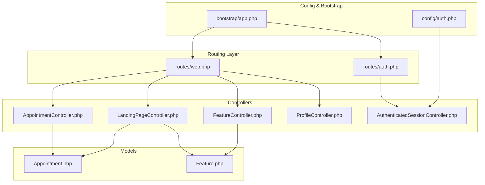
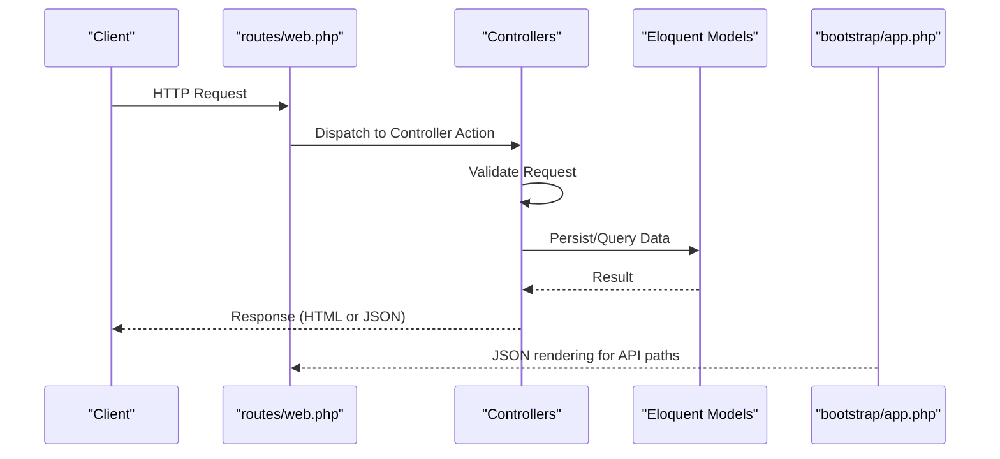
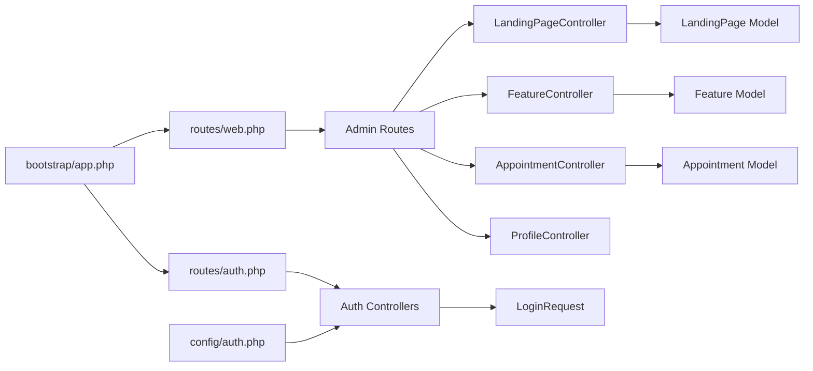

# API Reference

<cite>
**Referenced Files in This Document**
- [routes/web.php](file://routes/web.php)
- [routes/auth.php](file://routes/auth.php)
- [app/Http/Controllers/AppointmentController.php](file://app/Http/Controllers/AppointmentController.php)
- [app/Http/Controllers/LandingPageController.php](file://app/Http/Controllers/LandingPageController.php)
- [app/Http/Controllers/FeatureController.php](file://app/Http/Controllers/FeatureController.php)
- [app/Http/Controllers/Auth/AuthenticatedSessionController.php](file://app/Http/Controllers/Auth/AuthenticatedSessionController.php)
- [app/Http/Requests/Auth/LoginRequest.php](file://app/Http/Requests/Auth/LoginRequest.php)
- [app/Http/Controllers/ProfileController.php](file://app/Http/Controllers/ProfileController.php)
- [app/Models/Appointment.php](file://app/Models/Appointment.php)
- [app/Models/Feature.php](file://app/Models/Feature.php)
- [database/migrations/2026_06_22_024652_create_appointments_table.php](file://database/migrations/2026_06_22_024652_create_appointments_table.php)
- [database/migrations/2026_06_17_060200_create_features_table.php](file://database/migrations/2026_06_17_060200_create_features_table.php)
- [config/auth.php](file://config/auth.php)
- [bootstrap/app.php](file://bootstrap/app.php)
</cite>

## Table of Contents
1. [Introduction](#introduction)
2. [Project Structure](#project-structure)
3. [Core Components](#core-components)
4. [Architecture Overview](#architecture-overview)
5. [Detailed Component Analysis](#detailed-component-analysis)
6. [Dependency Analysis](#dependency-analysis)
7. [Performance Considerations](#performance-considerations)
8. [Troubleshooting Guide](#troubleshooting-guide)
9. [Conclusion](#conclusion)
10. [Appendices](#appendices)

## Introduction
This document provides comprehensive API documentation for the ClinicalLog CMS RESTful endpoints. It covers HTTP methods, URL patterns, request/response schemas, authentication requirements, and operational details for content management, user administration, file operations, and appointment processing. It also explains authentication middleware, rate limiting, security considerations, CORS configuration, API versioning strategies, backward compatibility, client integration guidelines, and troubleshooting advice.

## Project Structure
The application is a Laravel-based CMS with a focus on administrative workflows and public-facing landing page content. The routing layer defines both public and authenticated admin endpoints. Controllers encapsulate business logic for managing content and appointments, while models define persistence schemas. Middleware and configuration govern authentication, redirection, and JSON rendering for API requests.

**Diagram sources**
- [routes/web.php:1-77](file://routes/web.php#L1-L77)
- [routes/auth.php:1-60](file://routes/auth.php#L1-L60)
- [app/Http/Controllers/AppointmentController.php:1-77](file://app/Http/Controllers/AppointmentController.php#L1-L77)
- [app/Http/Controllers/LandingPageController.php:1-223](file://app/Http/Controllers/LandingPageController.php#L1-L223)
- [app/Http/Controllers/FeatureController.php:1-158](file://app/Http/Controllers/FeatureController.php#L1-L158)
- [app/Http/Controllers/Auth/AuthenticatedSessionController.php:1-48](file://app/Http/Controllers/Auth/AuthenticatedSessionController.php#L1-L48)
- [app/Http/Controllers/ProfileController.php:1-61](file://app/Http/Controllers/ProfileController.php#L1-L61)
- [app/Models/Appointment.php:1-20](file://app/Models/Appointment.php#L1-L20)
- [app/Models/Feature.php:1-17](file://app/Models/Feature.php#L1-L17)
- [bootstrap/app.php:1-25](file://bootstrap/app.php#L1-L25)
- [config/auth.php:1-118](file://config/auth.php#L1-L118)

**Section sources**
- [routes/web.php:1-77](file://routes/web.php#L1-L77)
- [routes/auth.php:1-60](file://routes/auth.php#L1-L60)
- [bootstrap/app.php:1-25](file://bootstrap/app.php#L1-L25)
- [config/auth.php:1-118](file://config/auth.php#L1-L118)

## Core Components
- Authentication and Authorization
  - Session-based authentication via the “web” guard.
  - Rate limiting for login attempts and verification actions.
  - Middleware enforcing verified emails for admin routes.
- Content Management
  - Landing page updates with rich content fields, images, visibility toggles, and structured JSON arrays.
  - Feature CRUD with icon selection via file upload or Lucide icon name, and sortable order.
- Appointment Processing
  - Public appointment submission with validation and status lifecycle.
  - Admin management of appointments with status updates and deletion.
- User Administration
  - Profile editing, password updates, and account deletion with current password confirmation.
- File Operations
  - Image uploads for hero/about/dashboard sections with optional deletion flags.
  - Feature icon uploads with replacement and cleanup.

**Section sources**
- [routes/web.php:37-74](file://routes/web.php#L37-L74)
- [routes/auth.php:14-59](file://routes/auth.php#L14-L59)
- [app/Http/Controllers/LandingPageController.php:18-221](file://app/Http/Controllers/LandingPageController.php#L18-L221)
- [app/Http/Controllers/FeatureController.php:24-156](file://app/Http/Controllers/FeatureController.php#L24-L156)
- [app/Http/Controllers/AppointmentController.php:14-76](file://app/Http/Controllers/AppointmentController.php#L14-L76)
- [app/Http/Controllers/ProfileController.php:17-59](file://app/Http/Controllers/ProfileController.php#L17-L59)
- [app/Http/Requests/Auth/LoginRequest.php:41-77](file://app/Http/Requests/Auth/LoginRequest.php#L41-L77)

## Architecture Overview
The system uses Laravel’s routing and controller pattern. Authentication middleware secures admin routes. JSON rendering is enabled for API requests via bootstrap configuration. Controllers coordinate validation, persistence, and response formatting.

**Diagram sources**
- [routes/web.php:1-77](file://routes/web.php#L1-L77)
- [bootstrap/app.php:20-23](file://bootstrap/app.php#L20-L23)
- [app/Http/Controllers/AppointmentController.php:14-41](file://app/Http/Controllers/AppointmentController.php#L14-L41)
- [app/Http/Controllers/LandingPageController.php:18-221](file://app/Http/Controllers/LandingPageController.php#L18-L221)
- [app/Http/Controllers/FeatureController.php:24-156](file://app/Http/Controllers/FeatureController.php#L24-L156)

## Detailed Component Analysis

### Authentication Endpoints
- Purpose: User registration, login, logout, password reset, email verification, and password confirmation.
- Authentication: Session-based via “web” guard.
- Rate Limiting: Login throttling and verification notification throttling.
- Security: CSRF protection via Laravel forms; signed email verification links; password confirmation for sensitive actions.

Endpoints
- POST /login
  - Purpose: Authenticate user and redirect to admin dashboard.
  - Authentication: None (guest middleware).
  - Request: email, password, remember (optional).
  - Response: Redirect to admin dashboard on success; otherwise redirect back with errors.
  - Throttling: Enforced by LoginRequest.
  - Security: CSRF via form submission; IP/email throttling.
- POST /logout
  - Purpose: Destroy authenticated session.
  - Authentication: Required.
  - Response: Redirect to home.
- POST /register
  - Purpose: Register new user.
  - Authentication: None.
  - Response: Redirect to login.
- POST /forgot-password
  - Purpose: Send password reset link.
  - Authentication: None.
  - Response: Redirect with status message.
- POST /reset-password
  - Purpose: Set new password using token.
  - Authentication: None.
  - Response: Redirect to login with success.
- GET /verify-email
  - Purpose: Show email verification prompt.
  - Authentication: Required.
  - Response: View.
- GET /verify-email/{id}/{hash}
  - Purpose: Verify email via signed link.
  - Authentication: Signed link required; throttled.
  - Response: Redirect to admin dashboard.
- POST /email/verification-notification
  - Purpose: Resend verification email.
  - Authentication: Required; throttled.
  - Response: Redirect back with status.
- POST /confirm-password
  - Purpose: Confirm password for sensitive actions.
  - Authentication: Required.
  - Response: Redirect back with confirmation.
- PUT /password
  - Purpose: Update user password.
  - Authentication: Required.
  - Response: Redirect to profile with success.

Validation and Error Handling
- Login throttling enforced by LoginRequest; clears limiter on successful auth.
- Verification route applies signed and throttled middleware.
- Password confirmation and update require authenticated session.

Security Considerations
- Use HTTPS in production.
- Protect against CSRF for form submissions.
- Enforce strong password policies at the application level if needed.
- Rate limit brute-force attempts and verification retries.

**Section sources**
- [routes/auth.php:14-59](file://routes/auth.php#L14-L59)
- [app/Http/Controllers/Auth/AuthenticatedSessionController.php:25-46](file://app/Http/Controllers/Auth/AuthenticatedSessionController.php#L25-L46)
- [app/Http/Requests/Auth/LoginRequest.php:41-85](file://app/Http/Requests/Auth/LoginRequest.php#L41-L85)
- [config/auth.php:40-44](file://config/auth.php#L40-L44)

### Content Management Endpoints

#### Landing Page CMS
- Base Path: /admin/landing-page
- Methods
  - GET /admin/landing-page
    - Purpose: Load landing page editor.
    - Authentication: Required and verified.
    - Response: HTML view with landing data.
  - PUT /admin/landing-page
    - Purpose: Update landing page content.
    - Authentication: Required and verified.
    - Request Fields:
      - Text fields: hero_title, hero_description, hero_badge, hero_cta_primary, hero_cta_secondary, navbar_cta_text, navbar_cta_url, about_title, about_description, dashboard_title, dashboard_description, cta_title, cta_description, terms_gdrive_url, privacy_gdrive_url.
      - Visibility toggles: about_visible, features_visible, benefits_visible, dashboard_visible, steps_visible, pricing_visible, cta_visible, testimonials_visible.
      - Images: hero_image, about_image, dashboard_image (upload), delete_hero_image, delete_about_image, delete_dashboard_image (flags).
      - Structured JSON: navbar_links (array of label/url), benefits (array of icon/title), steps (array of icon/num/title/desc), testimonials (array of quote/name/role/img), pricing_plans (array of tier/name/price/featured/features).
    - Validation: String length limits, image MIME types and size, boolean coercion via presence of keys.
    - Response: Redirect back with success message.
    - Notes: Updates or creates the single landing page record; deletes existing images when flagged.

- Request Parameter Validation
  - String and text constraints per field.
  - Image validation with allowed MIME types and size limit.
  - JSON arrays sanitized and filtered for required fields.

- Response Formatting
  - HTML redirects with success messages.

- Error Handling
  - Validation failures redirect back with errors.
  - File deletion and replacement handled safely.

**Section sources**
- [routes/web.php:52-54](file://routes/web.php#L52-L54)
- [app/Http/Controllers/LandingPageController.php:18-221](file://app/Http/Controllers/LandingPageController.php#L18-L221)

#### Features CMS
- Base Path: /admin/features
- Methods
  - GET /admin/features
    - Purpose: List features with pagination.
    - Authentication: Required and verified.
    - Response: HTML view with paginated features.
  - GET /admin/features/create
    - Purpose: Render feature creation form.
    - Authentication: Required and verified.
    - Response: HTML form.
  - POST /admin/features
    - Purpose: Create a new feature.
    - Authentication: Required and verified.
    - Request Fields:
      - title, description.
      - Icon choice: icon (file upload) or icon_name (Lucide icon name). If icon_name is set, uploaded icon is cleared.
      - sort_order (integer clamped to valid range).
    - Validation: Presence and length constraints; file upload rules.
    - Behavior: Adjusts sort_order of existing features to make room for the new item.
    - Response: Redirect to features index with success.
  - GET /admin/features/{id}/edit
    - Purpose: Render feature edit form.
    - Authentication: Required and verified.
    - Response: HTML form.
  - PUT /admin/features/{id}
    - Purpose: Update feature metadata and icon.
    - Authentication: Required and verified.
    - Request Fields: Same as create, with optional delete_icon flag to remove uploaded icon.
    - Behavior: Reorders features if sort_order changes; replaces or clears icons appropriately.
    - Response: Redirect to features index with success.
  - DELETE /admin/features/{id}
    - Purpose: Delete feature and adjust sort orders.
    - Authentication: Required and verified.
    - Response: Redirect to features index with success.

- Request Parameter Validation
  - Presence and type checks; file upload validation; sort_order clamping.

- Response Formatting
  - HTML redirects with success messages.

- Error Handling
  - Validation failures redirect back with errors.
  - File cleanup on icon replacement or deletion.

**Section sources**
- [routes/web.php:56-62](file://routes/web.php#L56-L62)
- [app/Http/Controllers/FeatureController.php:24-156](file://app/Http/Controllers/FeatureController.php#L24-L156)

### Appointment Processing Endpoints

#### Public Appointment Submission
- Base Path: /
- Method
  - POST /appointments
    - Purpose: Submit a demo appointment request.
    - Authentication: Not required.
    - Request Fields:
      - name (string, max length), email (email, max length), whatsapp (string, max length), institution (string, max length), demo_date (date, must be today or later), demo_time (string), notes (nullable string, max length), status defaults to pending.
    - Validation: Required fields, date constraint, string limits.
    - Response: JSON success message.
    - Notes: Status is initialized to pending; admin manages status updates.

- Request Parameter Validation
  - Required and type checks; date comparison; length limits.

- Response Formatting
  - JSON body with success flag and message.

- Error Handling
  - Validation errors return HTTP 302 with errors; successful submission returns JSON.

**Section sources**
- [routes/web.php:26](file://routes/web.php#L26)
- [app/Http/Controllers/AppointmentController.php:14-41](file://app/Http/Controllers/AppointmentController.php#L14-L41)
- [database/migrations/2026_06_22_024652_create_appointments_table.php:14-25](file://database/migrations/2026_06_22_024652_create_appointments_table.php#L14-L25)

#### Admin Appointment Management
- Base Path: /admin/appointments
- Methods
  - GET /admin/appointments
    - Purpose: View appointment list with pagination.
    - Authentication: Required and verified.
    - Response: HTML view with paginated appointments.
  - PATCH /admin/appointments/{appointment}/status
    - Purpose: Update appointment status.
    - Authentication: Required and verified.
    - Request Fields:
      - status: one of pending, done, cancelled.
    - Validation: Required enum-like value.
    - Response: Back with success message.
  - DELETE /admin/appointments/{appointment}
    - Purpose: Delete an appointment.
    - Authentication: Required and verified.
    - Response: Back with success message.

- Request Parameter Validation
  - Enum validation for status.

- Response Formatting
  - HTML redirects with success messages.

- Error Handling
  - Validation failures redirect back with errors.

**Section sources**
- [routes/web.php:64-67](file://routes/web.php#L64-L67)
- [app/Http/Controllers/AppointmentController.php:46-76](file://app/Http/Controllers/AppointmentController.php#L46-L76)

### User Administration Endpoints
- Base Path: /profile
- Methods
  - GET /profile
    - Purpose: Edit profile.
    - Authentication: Required and verified.
    - Response: HTML form.
  - PATCH /profile
    - Purpose: Update profile information.
    - Authentication: Required and verified.
    - Request Fields: As defined by ProfileUpdateRequest (e.g., name, email).
    - Behavior: Marks email unverified if changed.
    - Response: Redirect to profile with status.
  - DELETE /profile
    - Purpose: Delete user account.
    - Authentication: Required and verified.
    - Request Fields: password (current password).
    - Behavior: Logs out, deletes user, invalidates session.
    - Response: Redirect to home.

- Request Parameter Validation
  - Current password confirmation required for deletion.

- Response Formatting
  - HTML redirects with status messages.

- Error Handling
  - Validation failures redirect back with errors.

**Section sources**
- [routes/web.php:47-50](file://routes/web.php#L47-L50)
- [app/Http/Controllers/ProfileController.php:17-59](file://app/Http/Controllers/ProfileController.php#L17-L59)

## Dependency Analysis
- Routing depends on controllers and models.
- Controllers depend on validation requests and storage for file operations.
- Authentication middleware and guard configuration affect all protected routes.
- Bootstrap configuration enables JSON responses for API paths.

**Diagram sources**
- [routes/web.php:1-77](file://routes/web.php#L1-L77)
- [routes/auth.php:1-60](file://routes/auth.php#L1-L60)
- [app/Http/Controllers/LandingPageController.php:1-223](file://app/Http/Controllers/LandingPageController.php#L1-L223)
- [app/Http/Controllers/FeatureController.php:1-158](file://app/Http/Controllers/FeatureController.php#L1-L158)
- [app/Http/Controllers/AppointmentController.php:1-77](file://app/Http/Controllers/AppointmentController.php#L1-L77)
- [app/Http/Controllers/ProfileController.php:1-61](file://app/Http/Controllers/ProfileController.php#L1-L61)
- [app/Http/Requests/Auth/LoginRequest.php:1-87](file://app/Http/Requests/Auth/LoginRequest.php#L1-L87)
- [app/Models/Appointment.php:1-20](file://app/Models/Appointment.php#L1-L20)
- [app/Models/Feature.php:1-17](file://app/Models/Feature.php#L1-L17)
- [bootstrap/app.php:1-25](file://bootstrap/app.php#L1-L25)
- [config/auth.php:1-118](file://config/auth.php#L1-L118)

**Section sources**
- [routes/web.php:1-77](file://routes/web.php#L1-L77)
- [routes/auth.php:1-60](file://routes/auth.php#L1-L60)
- [bootstrap/app.php:1-25](file://bootstrap/app.php#L1-L25)
- [config/auth.php:1-118](file://config/auth.php#L1-L118)

## Performance Considerations
- Pagination: Use pagination for listing endpoints to avoid large payloads.
- File Uploads: Validate file sizes and MIME types early; store only necessary images.
- Sorting: Minimize reordering operations; batch updates where possible.
- Database Indexes: Consider adding indexes on frequently filtered/sorted columns (e.g., status, created_at).
- Caching: Cache static landing page content where appropriate.
- Concurrency: Rate limiting protects login and verification endpoints; consider similar limits for public endpoints under load.

## Troubleshooting Guide
Common Issues and Fixes
- Login throttling
  - Symptom: Repeated failed logins trigger throttling.
  - Fix: Wait for lockout period; ensure correct credentials; verify rate limiter configuration.
  - Section sources
    - [app/Http/Requests/Auth/LoginRequest.php:61-77](file://app/Http/Requests/Auth/LoginRequest.php#L61-L77)
- Validation errors on admin forms
  - Symptom: Redirect back with validation errors.
  - Fix: Ensure required fields meet constraints; check file upload limits and image formats.
  - Section sources
    - [app/Http/Controllers/LandingPageController.php:20-46](file://app/Http/Controllers/LandingPageController.php#L20-L46)
    - [app/Http/Controllers/FeatureController.php:26-32](file://app/Http/Controllers/FeatureController.php#L26-L32)
- Missing authentication for admin routes
  - Symptom: Redirect to login or dashboard.
  - Fix: Ensure session is established and email is verified.
  - Section sources
    - [routes/web.php:37-74](file://routes/web.php#L37-L74)
    - [config/auth.php:40-44](file://config/auth.php#L40-L44)
- Appointment status update fails
  - Symptom: Validation error for status enum.
  - Fix: Use one of pending, done, cancelled.
  - Section sources
    - [app/Http/Controllers/AppointmentController.php:57-59](file://app/Http/Controllers/AppointmentController.php#L57-L59)
- File deletion not applied
  - Symptom: Image remains after delete flag.
  - Fix: Ensure delete flags are present and processed; verify storage disk permissions.
  - Section sources
    - [app/Http/Controllers/LandingPageController.php:82-87](file://app/Http/Controllers/LandingPageController.php#L82-L87)
    - [app/Http/Controllers/LandingPageController.php:95-100](file://app/Http/Controllers/LandingPageController.php#L95-L100)
    - [app/Http/Controllers/LandingPageController.php:108-113](file://app/Http/Controllers/LandingPageController.php#L108-L113)

## Conclusion
ClinicalLog CMS exposes a clear set of authenticated admin endpoints for content and user management, plus a public endpoint for appointment requests. Authentication relies on Laravel’s session guard with robust rate limiting and verification controls. Controllers enforce strict validation and handle file operations safely. The bootstrap configuration supports JSON responses for API consumers. Following the guidelines in this document ensures secure, reliable, and maintainable integrations.

## Appendices

### Endpoint Categories and Examples

- Authentication
  - POST /login
    - Example: Submit email and password; receive redirect to admin dashboard.
  - POST /logout
    - Example: Invalidate session and redirect to home.
  - POST /register
    - Example: Create new user account.
  - POST /forgot-password
    - Example: Request password reset link.
  - POST /reset-password
    - Example: Set new password using token.
  - GET /verify-email
    - Example: Show verification prompt.
  - GET /verify-email/{id}/{hash}
    - Example: Verify email via signed link.
  - POST /email/verification-notification
    - Example: Resend verification email.
  - POST /confirm-password
    - Example: Confirm password for sensitive actions.
  - PUT /password
    - Example: Update user password.

- Content Management
  - GET /admin/landing-page
    - Example: Load landing page editor.
  - PUT /admin/landing-page
    - Example: Update hero title, images, visibility flags, and structured JSON arrays.
  - GET /admin/features
    - Example: Paginated features list.
  - GET /admin/features/create
    - Example: Render feature creation form.
  - POST /admin/features
    - Example: Create feature with icon (file or Lucide name) and sort order.
  - GET /admin/features/{id}/edit
    - Example: Render feature edit form.
  - PUT /admin/features/{id}
    - Example: Update feature metadata and icon; reorder if needed.
  - DELETE /admin/features/{id}
    - Example: Delete feature and adjust sort orders.

- Appointment Processing
  - POST /appointments
    - Example: Submit demo request; receive JSON success message.
  - GET /admin/appointments
    - Example: View appointment list.
  - PATCH /admin/appointments/{appointment}/status
    - Example: Update status to pending, done, or cancelled.
  - DELETE /admin/appointments/{appointment}
    - Example: Delete appointment.

- User Administration
  - GET /profile
    - Example: Render profile edit form.
  - PATCH /profile
    - Example: Update profile info; changing email requires re-verification.
  - DELETE /profile
    - Example: Delete account after confirming current password.

### Request Parameter Validation Summary
- Authentication
  - LoginRequest enforces email and password presence; applies rate limiting.
- Landing Page
  - String length limits; image MIME/type/size validation; boolean flags via presence.
- Features
  - Presence and length constraints; file upload validation; sort_order clamping.
- Appointments
  - Required fields, date validation, string limits; status enum validation.
- Profile
  - ProfileUpdateRequest fields; current password confirmation for deletion.

### Response Formatting
- Admin endpoints typically return HTML redirects with success/error messages.
- Public appointment submission returns JSON with success flag and message.
- JSON rendering is enabled for API paths via bootstrap configuration.

### Authentication Middleware and Security
- Guards and providers configured for session-based authentication.
- Middleware enforces verified email for admin routes.
- Rate limiting for login and verification actions.
- CSRF protection via Laravel forms; signed verification links.

### CORS Configuration
- Configure CORS in Laravel using the cors package or server-level proxy.
- Allowlist origins, methods, and headers as needed.
- Ensure credentials support is enabled only for trusted origins.

### API Versioning Strategies
- URL versioning: /api/v1/...
- Header versioning: Accept: application/vnd.clinicallog.v1+json
- Query parameter versioning: ?version=1
- Adopt one strategy consistently and document it.

### Backward Compatibility Considerations
- Introduce new fields as nullable or optional.
- Avoid removing or renaming existing fields without a new version.
- Provide deprecation notices and migration timelines.
- Maintain stable response shapes where possible.

### Client Implementation Guidelines
- Use HTTPS and secure cookies.
- Implement retry with exponential backoff for transient errors.
- Respect rate limits and handle lockouts gracefully.
- Validate responses and handle both HTML and JSON formats depending on endpoint.
- For file uploads, ensure multipart/form-data encoding and appropriate size limits.