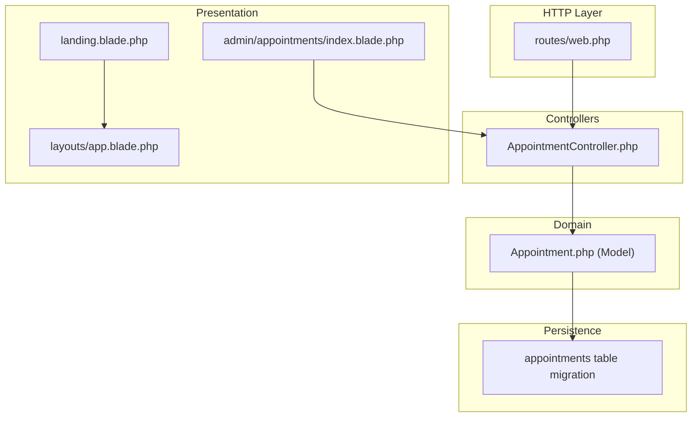
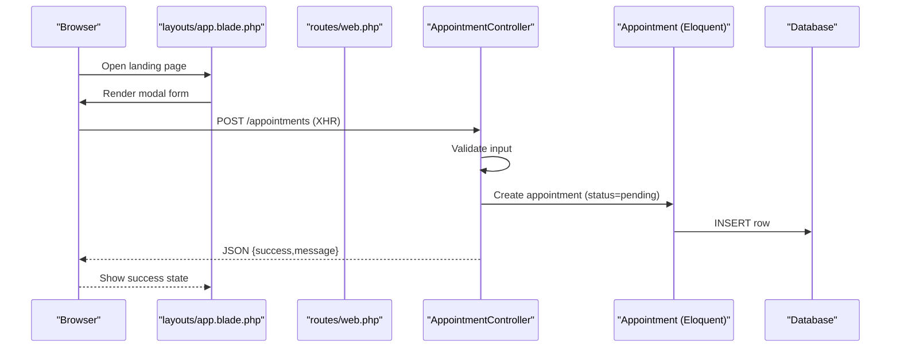
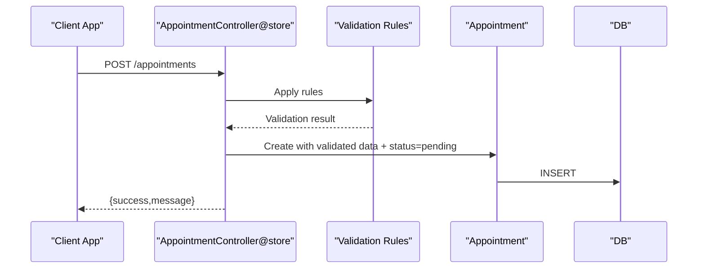
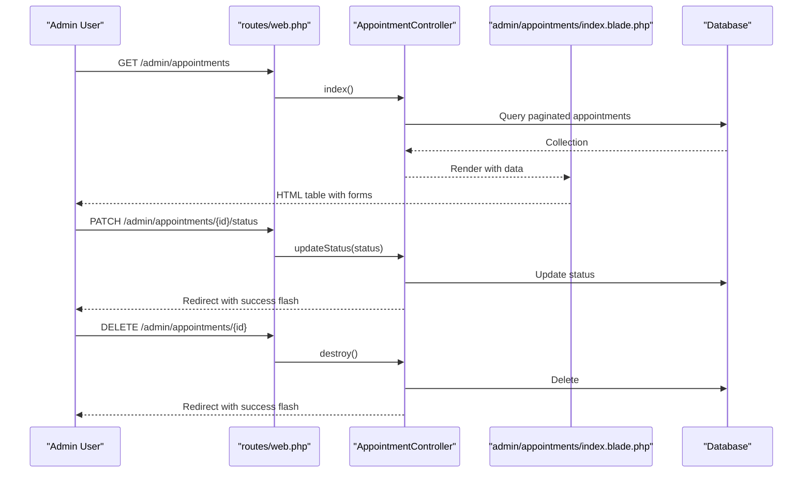
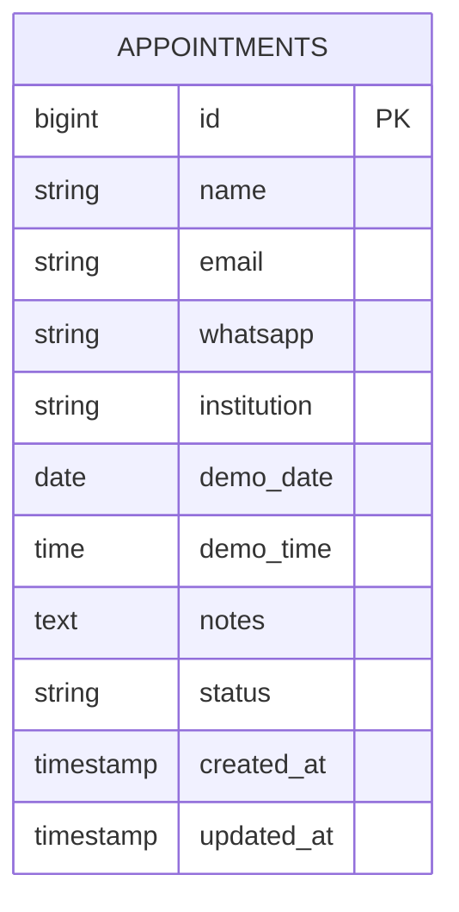
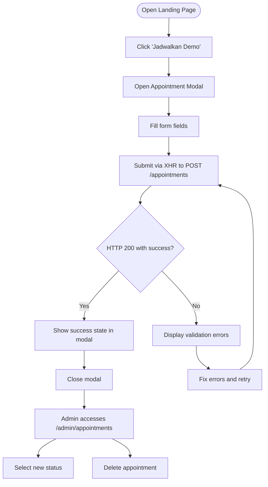
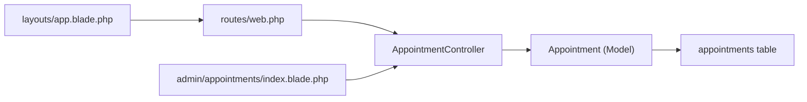

# Appointment Management APIs

<cite>
**Referenced Files in This Document**
- [web.php](file://routes/web.php)
- [AppointmentController.php](file://app/Http/Controllers/AppointmentController.php)
- [Appointment.php](file://app/Models/Appointment.php)
- [2026_06_22_024652_create_appointments_table.php](file://database/migrations/2026_06_22_024652_create_appointments_table.php)
- [index.blade.php](file://resources/views/admin/appointments/index.blade.php)
- [app.blade.php](file://resources/views/layouts/app.blade.php)
- [landing.blade.php](file://resources/views/landing.blade.php)
- [mail.php](file://config/mail.php)
- [app.php](file://bootstrap/app.php)
</cite>

## Table of Contents
1. [Introduction](#introduction)
2. [Project Structure](#project-structure)
3. [Core Components](#core-components)
4. [Architecture Overview](#architecture-overview)
5. [Detailed Component Analysis](#detailed-component-analysis)
6. [Dependency Analysis](#dependency-analysis)
7. [Performance Considerations](#performance-considerations)
8. [Troubleshooting Guide](#troubleshooting-guide)
9. [Conclusion](#conclusion)
10. [Appendices](#appendices)

## Introduction
This document describes the appointment management APIs in ClinicalLog CMS. It covers:
- Contact form submission endpoint for appointment requests (POST)
- Administrative endpoints for listing, updating status, and deleting appointments (GET, PATCH, DELETE)
- Request/response schemas, validation rules, and status tracking workflows
- Lead management process and notification integration
- Practical examples and troubleshooting guidance

## Project Structure
The appointment feature spans routing, controller, model, migration, and frontend templates:
- Routes define the endpoints for public submission and admin management
- Controller handles validation, persistence, and responses
- Model defines the persisted attributes
- Migration creates the database table
- Blade templates render admin UI and the landing page modal form

**Diagram sources**
- [web.php:26-67](file://routes/web.php#L26-L67)
- [AppointmentController.php:9-76](file://app/Http/Controllers/AppointmentController.php#L9-L76)
- [Appointment.php:7-18](file://app/Models/Appointment.php#L7-L18)
- [2026_06_22_024652_create_appointments_table.php:14-25](file://database/migrations/2026_06_22_024652_create_appointments_table.php#L14-L25)
- [landing.blade.php:446-470](file://resources/views/landing.blade.php#L446-L470)
- [index.blade.php:1-93](file://resources/views/admin/appointments/index.blade.php#L1-L93)
- [app.blade.php:195-396](file://resources/views/layouts/app.blade.php#L195-L396)

**Section sources**
- [web.php:26-67](file://routes/web.php#L26-L67)
- [AppointmentController.php:9-76](file://app/Http/Controllers/AppointmentController.php#L9-L76)
- [Appointment.php:7-18](file://app/Models/Appointment.php#L7-L18)
- [2026_06_22_024652_create_appointments_table.php:14-25](file://database/migrations/2026_06_22_024652_create_appointments_table.php#L14-L25)
- [landing.blade.php:446-470](file://resources/views/landing.blade.php#L446-L470)
- [index.blade.php:1-93](file://resources/views/admin/appointments/index.blade.php#L1-L93)
- [app.blade.php:195-396](file://resources/views/layouts/app.blade.php#L195-L396)

## Core Components
- Public appointment submission endpoint: POST /appointments
- Admin listing endpoint: GET /admin/appointments
- Admin status update endpoint: PATCH /admin/appointments/{appointment}/status
- Admin deletion endpoint: DELETE /admin/appointments/{appointment}

Response behavior:
- Public submission returns JSON with success flag and message
- Admin endpoints return HTML via Blade templates

Validation rules enforced server-side for submissions:
- name: required, string, max length 255
- email: required, email, max length 255
- whatsapp: required, string, max length 25
- institution: required, string, max length 255
- demo_date: required, date, must be today or later
- demo_time: required, string
- notes: optional, string, max length 1000

Status values for admin updates:
- pending, done, cancelled

**Section sources**
- [web.php:26-67](file://routes/web.php#L26-L67)
- [AppointmentController.php:16-24](file://app/Http/Controllers/AppointmentController.php#L16-L24)
- [AppointmentController.php:57-59](file://app/Http/Controllers/AppointmentController.php#L57-L59)
- [2026_06_22_024652_create_appointments_table.php:23-23](file://database/migrations/2026_06_22_024652_create_appointments_table.php#L23-L23)

## Architecture Overview
High-level flow for appointment submission and admin management:

**Diagram sources**
- [app.blade.php:358-364](file://resources/views/layouts/app.blade.php#L358-L364)
- [web.php:26-26](file://routes/web.php#L26-L26)
- [AppointmentController.php:14-41](file://app/Http/Controllers/AppointmentController.php#L14-L41)
- [Appointment.php:9-18](file://app/Models/Appointment.php#L9-L18)
- [2026_06_22_024652_create_appointments_table.php:14-25](file://database/migrations/2026_06_22_024652_create_appointments_table.php#L14-L25)

## Detailed Component Analysis

### Public Contact Form Submission API
Purpose: Accept appointment requests from the landing page modal.

- Endpoint: POST /appointments
- Authentication: Not defined in routes; CSRF token included in form
- Request payload schema:
  - name: string, required
  - email: string, required (valid email)
  - whatsapp: string, required
  - institution: string, required
  - demo_date: date, required (must be today or later)
  - demo_time: string, required
  - notes: string, optional

- Response:
  - Status: 200 OK
  - Body: JSON object with success flag and message

Processing logic:
- Server validates input according to rules
- Creates a new appointment record with status set to pending
- Returns success JSON

**Diagram sources**
- [web.php:26-26](file://routes/web.php#L26-L26)
- [AppointmentController.php:14-41](file://app/Http/Controllers/AppointmentController.php#L14-L41)
- [Appointment.php:9-18](file://app/Models/Appointment.php#L9-L18)

**Section sources**
- [web.php:26-26](file://routes/web.php#L26-L26)
- [AppointmentController.php:16-24](file://app/Http/Controllers/AppointmentController.php#L16-L24)
- [AppointmentController.php:26-40](file://app/Http/Controllers/AppointmentController.php#L26-L40)
- [app.blade.php:358-364](file://resources/views/layouts/app.blade.php#L358-L364)

### Administrative Appointment Management API
Endpoints:
- GET /admin/appointments: List all appointments (paginated)
- PATCH /admin/appointments/{appointment}/status: Update status
- DELETE /admin/appointments/{appointment}: Delete appointment

Response behavior:
- GET returns HTML (Blade template)
- PATCH/DELETE return redirects with success messages

Status update validation:
- status: required, must be one of pending, done, cancelled

Admin UI highlights:
- Listing table shows requester info, contact, schedule, notes, and status selector
- Status selector submits a form with method override to PATCH
- Delete action submits a form with method override to DELETE

**Diagram sources**
- [web.php:64-67](file://routes/web.php#L64-L67)
- [AppointmentController.php:46-50](file://app/Http/Controllers/AppointmentController.php#L46-L50)
- [AppointmentController.php:55-66](file://app/Http/Controllers/AppointmentController.php#L55-L66)
- [AppointmentController.php:71-75](file://app/Http/Controllers/AppointmentController.php#L71-L75)
- [index.blade.php:60-79](file://resources/views/admin/appointments/index.blade.php#L60-L79)

**Section sources**
- [web.php:64-67](file://routes/web.php#L64-L67)
- [AppointmentController.php:46-50](file://app/Http/Controllers/AppointmentController.php#L46-L50)
- [AppointmentController.php:55-66](file://app/Http/Controllers/AppointmentController.php#L55-L66)
- [AppointmentController.php:71-75](file://app/Http/Controllers/AppointmentController.php#L71-L75)
- [index.blade.php:60-79](file://resources/views/admin/appointments/index.blade.php#L60-L79)

### Data Model and Persistence
The appointment entity stores the following fields:
- name, email, whatsapp, institution
- demo_date (date), demo_time (time)
- notes (text, nullable)
- status (string, default pending)
- timestamps (created_at, updated_at)

**Diagram sources**
- [2026_06_22_024652_create_appointments_table.php:14-25](file://database/migrations/2026_06_22_024652_create_appointments_table.php#L14-L25)
- [Appointment.php:9-18](file://app/Models/Appointment.php#L9-L18)

**Section sources**
- [2026_06_22_024652_create_appointments_table.php:14-25](file://database/migrations/2026_06_22_024652_create_appointments_table.php#L14-L25)
- [Appointment.php:9-18](file://app/Models/Appointment.php#L9-L18)

### Frontend Integration and Workflows
- Landing page modal form posts to the submission endpoint
- On success, the modal switches to a success state
- On errors, validation messages are shown inline
- Admin UI displays a paginated table with status selection and delete actions

**Diagram sources**
- [landing.blade.php:446-470](file://resources/views/landing.blade.php#L446-L470)
- [app.blade.php:345-390](file://resources/views/layouts/app.blade.php#L345-L390)
- [web.php:26-26](file://routes/web.php#L26-L26)
- [index.blade.php:60-79](file://resources/views/admin/appointments/index.blade.php#L60-L79)

**Section sources**
- [landing.blade.php:446-470](file://resources/views/landing.blade.php#L446-L470)
- [app.blade.php:345-390](file://resources/views/layouts/app.blade.php#L345-L390)
- [index.blade.php:60-79](file://resources/views/admin/appointments/index.blade.php#L60-L79)

## Dependency Analysis
- Routes depend on AppointmentController methods
- Controller depends on Appointment model
- Model persists to the appointments table
- Admin UI depends on controller-provided data and routes
- Frontend modal depends on route name for submission

**Diagram sources**
- [web.php:26-67](file://routes/web.php#L26-L67)
- [AppointmentController.php:9-76](file://app/Http/Controllers/AppointmentController.php#L9-L76)
- [Appointment.php:7-18](file://app/Models/Appointment.php#L7-L18)
- [2026_06_22_024652_create_appointments_table.php:14-25](file://database/migrations/2026_06_22_024652_create_appointments_table.php#L14-L25)
- [index.blade.php:1-93](file://resources/views/admin/appointments/index.blade.php#L1-L93)
- [app.blade.php:358-364](file://resources/views/layouts/app.blade.php#L358-L364)

**Section sources**
- [web.php:26-67](file://routes/web.php#L26-L67)
- [AppointmentController.php:9-76](file://app/Http/Controllers/AppointmentController.php#L9-L76)
- [Appointment.php:7-18](file://app/Models/Appointment.php#L7-L18)
- [2026_06_22_024652_create_appointments_table.php:14-25](file://database/migrations/2026_06_22_024652_create_appointments_table.php#L14-L25)
- [index.blade.php:1-93](file://resources/views/admin/appointments/index.blade.php#L1-L93)
- [app.blade.php:358-364](file://resources/views/layouts/app.blade.php#L358-L364)

## Performance Considerations
- Pagination: Admin listing uses pagination to limit result sets
- Minimal validation: Server-side validation is lightweight and fast
- No background jobs observed for notifications in current code

[No sources needed since this section provides general guidance]

## Troubleshooting Guide
Common issues and resolutions:
- Validation failures on submission:
  - Ensure all required fields match rules (dates after or equal to today, valid email)
  - Check for client-side error box content for specific messages
- Status update fails:
  - Verify status value is one of pending, done, cancelled
- Delete operation does nothing:
  - Confirm CSRF token presence and proper method override to DELETE
- No confirmation received:
  - Check browser network tab for response body and status
  - Review server logs for exceptions

**Section sources**
- [AppointmentController.php:16-24](file://app/Http/Controllers/AppointmentController.php#L16-L24)
- [AppointmentController.php:57-59](file://app/Http/Controllers/AppointmentController.php#L57-L59)
- [app.blade.php:371-378](file://resources/views/layouts/app.blade.php#L371-L378)
- [index.blade.php:60-79](file://resources/views/admin/appointments/index.blade.php#L60-L79)

## Conclusion
The appointment management system provides a straightforward pipeline for collecting demo requests from the landing page and managing them in the admin panel. Public submissions are validated and stored with a default pending status, while administrators can update status or remove entries. The current implementation focuses on simplicity and uses standard Laravel patterns.

[No sources needed since this section summarizes without analyzing specific files]

## Appendices

### API Reference

- Base Path
  - Public: /
  - Admin: /admin

- Endpoints

  - POST /appointments
    - Description: Submit an appointment request
    - Authentication: CSRF token included in form
    - Request JSON:
      - name: string, required
      - email: string, required (valid email)
      - whatsapp: string, required
      - institution: string, required
      - demo_date: date, required (today or later)
      - demo_time: string, required
      - notes: string, optional
    - Response: 200 OK with JSON {success, message}

  - GET /admin/appointments
    - Description: List appointments (paginated)
    - Authentication: Requires login and verified email
    - Response: HTML table with forms for status and delete

  - PATCH /admin/appointments/{appointment}/status
    - Description: Update appointment status
    - Authentication: Requires login and verified email
    - Request form field:
      - status: string, required (pending | done | cancelled)
    - Response: Redirect with success flash message

  - DELETE /admin/appointments/{appointment}
    - Description: Delete an appointment
    - Authentication: Requires login and verified email
    - Response: Redirect with success flash message

- Validation Rules
  - name: required, string, max 255
  - email: required, email, max 255
  - whatsapp: required, string, max 25
  - institution: required, string, max 255
  - demo_date: required, date, after_or_equal:today
  - demo_time: required, string
  - notes: nullable, string, max 1000

- Status Values
  - pending, done, cancelled

- Notification Integration
  - Mail configuration exists but no explicit notification code is present in the reviewed files
  - Default mailer and supported drivers are defined in configuration

**Section sources**
- [web.php:26-67](file://routes/web.php#L26-L67)
- [AppointmentController.php:16-24](file://app/Http/Controllers/AppointmentController.php#L16-L24)
- [AppointmentController.php:57-59](file://app/Http/Controllers/AppointmentController.php#L57-L59)
- [mail.php:17-118](file://config/mail.php#L17-L118)

### Examples

- Submitting an Appointment Request
  - Action: POST /appointments
  - Payload keys: name, email, whatsapp, institution, demo_date, demo_time, notes
  - Expected response: {success, message}

- Updating Appointment Status
  - Action: PATCH /admin/appointments/{id}/status
  - Payload: status = pending | done | cancelled
  - Expected outcome: Status updated and success message shown

- Deleting an Appointment
  - Action: DELETE /admin/appointments/{id}
  - Expected outcome: Record removed and success message shown

**Section sources**
- [web.php:26-67](file://routes/web.php#L26-L67)
- [index.blade.php:60-79](file://resources/views/admin/appointments/index.blade.php#L60-L79)