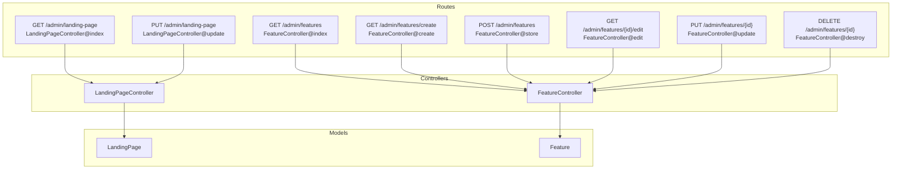
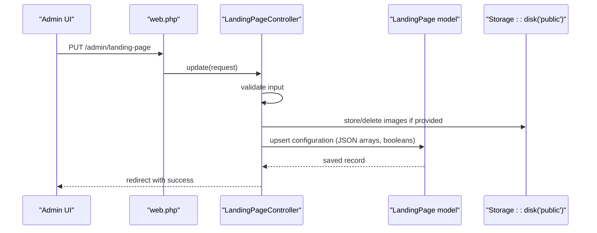
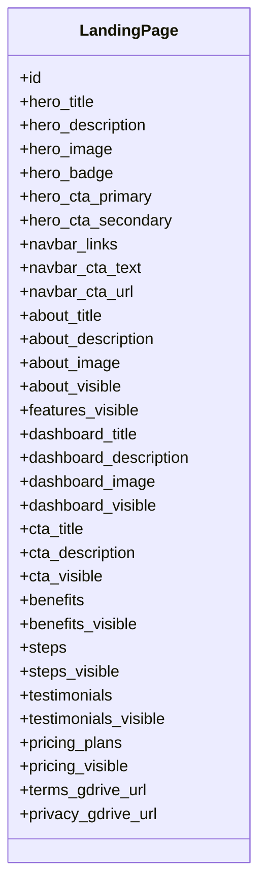
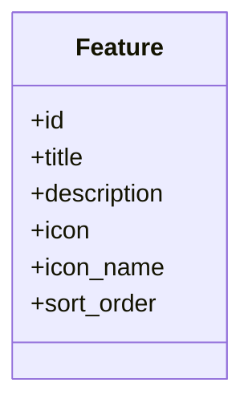
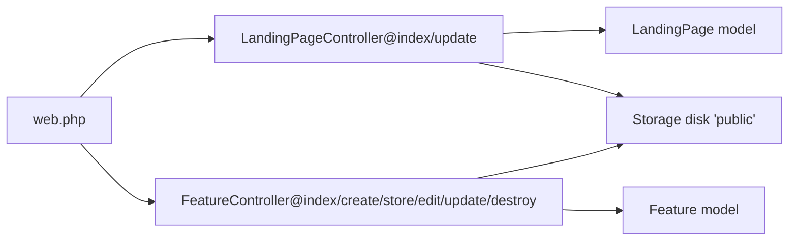

# Content Management APIs

<cite>
**Referenced Files in This Document**
- [web.php](file://routes/web.php)
- [LandingPageController.php](file://app/Http/Controllers/LandingPageController.php)
- [FeatureController.php](file://app/Http/Controllers/FeatureController.php)
- [LandingPage.php](file://app/Models/LandingPage.php)
- [Feature.php](file://app/Models/Feature.php)
- [2026_06_17_031941_create_landing_pages_table.php](file://database/migrations/2026_06_17_031941_create_landing_pages_table.php)
- [2026_06_17_060200_create_features_table.php](file://database/migrations/2026_06_17_060200_create_features_table.php)
- [2026_06_17_073934_add_icon_and_sort_to_features_table.php](file://database/migrations/2026_06_17_073934_add_icon_and_sort_to_features_table.php)
- [2026_06_18_023000_add_images_to_landing_pages_table.php](file://database/migrations/2026_06_18_023000_add_images_to_landing_pages_table.php)
- [2026_06_18_035802_add_dashboard_and_navbar_to_landing_pages_table.php](file://database/migrations/2026_06_18_035802_add_dashboard_and_navbar_to_landing_pages_table.php)
- [2026_06_18_040000_add_all_sections_to_landing_pages_table.php](file://database/migrations/2026_06_18_040000_add_all_sections_to_landing_pages_table.php)
- [2026_06_18_064300_add_testimonials_visible_to_landing_pages.php](file://database/migrations/2026_06_18_064300_add_testimonials_visible_to_landing_pages.php)
- [2026_06_22_022549_add_section_visibility_to_landing_pages.php](file://database/migrations/2026_06_22_022549_add_section_visibility_to_landing_pages.php)
- [2026_06_22_024652_create_appointments_table.php](file://database/migrations/2026_06_22_024652_create_appointments_table.php)
</cite>

## Table of Contents
1. [Introduction](#introduction)
2. [Project Structure](#project-structure)
3. [Core Components](#core-components)
4. [Architecture Overview](#architecture-overview)
5. [Detailed Component Analysis](#detailed-component-analysis)
6. [Dependency Analysis](#dependency-analysis)
7. [Performance Considerations](#performance-considerations)
8. [Troubleshooting Guide](#troubleshooting-guide)
9. [Conclusion](#conclusion)
10. [Appendices](#appendices)

## Introduction
This document describes the content management APIs for the ClinicalLog CMS focused on:
- Landing page management via a single endpoint for retrieval and updates of hero, about, dashboard, CTA, benefits, steps, testimonials, pricing, and navigation bar settings, plus section visibility controls.
- Feature management via dedicated endpoints supporting CRUD operations with sorting and icon management (Lucide icon names or uploaded SVG icons).

The APIs are implemented as Laravel web routes protected by authentication middleware. They support image uploads, JSON arrays for structured content, and boolean flags for section visibility. Validation rules, error handling patterns, and practical usage examples are included.

## Project Structure
The CMS exposes two primary content management surfaces:
- Landing page CMS: GET and PUT endpoints under /admin/landing-page
- Feature CMS: GET/POST/PUT/DELETE endpoints under /admin/features

**Diagram sources**
- [web.php:52-62](file://routes/web.php#L52-L62)
- [LandingPageController.php:11-17](file://app/Http/Controllers/LandingPageController.php#L11-L17)
- [FeatureController.php:11-20](file://app/Http/Controllers/FeatureController.php#L11-L20)

**Section sources**
- [web.php:52-62](file://routes/web.php#L52-L62)

## Core Components
- LandingPageController
  - index(): renders the landing page CMS UI with current configuration and paginated features.
  - update(): validates and persists landing page content, images, JSON arrays, and visibility flags.
- FeatureController
  - index(), create(), edit(): render forms and manage feature creation/editing.
  - store(): creates a feature with icon (Lucide name or uploaded file) and inserts it at a specified sort order.
  - update(): updates feature metadata, icon, and reorders features atomically.
  - destroy(): deletes a feature and adjusts subsequent sort orders.

Validation and persistence are handled via model fillable attributes and casts, and controller-side validation rules.

**Section sources**
- [LandingPageController.php:11-222](file://app/Http/Controllers/LandingPageController.php#L11-L222)
- [FeatureController.php:11-154](file://app/Http/Controllers/FeatureController.php#L11-L154)
- [LandingPage.php:9-57](file://app/Models/LandingPage.php#L9-L57)
- [Feature.php:9-15](file://app/Models/Feature.php#L9-L15)

## Architecture Overview
The CMS uses Laravel’s MVC pattern with:
- Routes grouped under an authenticated and verified middleware.
- Controllers orchestrating validation, storage operations, and redirects.
- Eloquent models with explicit fillable and cast definitions.
- Public storage for uploaded images and icons.

**Diagram sources**
- [web.php:52-54](file://routes/web.php#L52-L54)
- [LandingPageController.php:19-222](file://app/Http/Controllers/LandingPageController.php#L19-L222)
- [LandingPage.php:9-57](file://app/Models/LandingPage.php#L9-L57)

## Detailed Component Analysis

### Landing Page Management API
- Endpoint: PUT /admin/landing-page
- Authentication: Required (auth, verified middleware)
- Purpose: Retrieve and update the global landing page configuration including hero, about, dashboard, CTA, benefits, steps, testimonials, pricing, navigation bar, and visibility flags.

#### Request Body Fields
- Text and short text fields: hero_title, hero_description, hero_badge, hero_cta_primary, hero_cta_secondary, navbar_cta_text, navbar_cta_url, about_title, about_description, dashboard_title, dashboard_description, cta_title, cta_description, terms_gdrive_url, privacy_gdrive_url.
- Images: hero_image, about_image, dashboard_image (multipart/form-data; supported types jpg, jpeg, png, webp, svg; max size 2048 KB).
- JSON arrays: benefits, steps, testimonials, pricing_plans (arrays of objects).
- Boolean flags: about_visible, features_visible, benefits_visible, dashboard_visible, steps_visible, pricing_visible, cta_visible, testimonials_visible.
- Navigation bar: navbar_links (array of objects with label and url).
- Delete flags for images: delete_hero_image, delete_about_image, delete_dashboard_image (when set to 1, clears the respective stored image).

Validation rules enforced server-side:
- String length limits per field.
- Image validation with allowed MIME types and size cap.
- Boolean casting for visibility flags.
- JSON arrays sanitized and filtered to ensure required keys are present.

Processing logic:
- Validates incoming payload.
- Handles image uploads and deletions; replaces existing files when new ones are provided.
- Normalizes JSON arrays (benefits, steps, testimonials, pricing_plans) ensuring required fields and defaults.
- Upserts a single LandingPage record with all fields.

Response:
- Redirects back with a success message upon completion.

Practical examples:
- Update hero section and visibility flags:
  - Send multipart/form-data with hero_title, hero_description, testimonials_visible=true, features_visible=false.
- Upload hero image and remove previous image:
  - Attach hero_image and include delete_hero_image=1.
- Configure navigation bar:
  - Submit navbar_links as an array of {label, url} entries.
- Add pricing plans:
  - Submit pricing_plans as an array of {name, price, tier, features_text} where features_text is newline-separated feature items.

Real-time preview:
- The CMS does not expose a separate preview endpoint; updates are applied immediately and reflected on the live site and admin UI.

Bulk operations:
- No dedicated bulk endpoint exists; use multiple requests to update multiple sections.

**Section sources**
- [web.php:52-54](file://routes/web.php#L52-L54)
- [LandingPageController.php:19-222](file://app/Http/Controllers/LandingPageController.php#L19-L222)
- [LandingPage.php:9-57](file://app/Models/LandingPage.php#L9-L57)

#### Landing Page Data Model

**Diagram sources**
- [LandingPage.php:9-57](file://app/Models/LandingPage.php#L9-L57)
- [2026_06_17_031941_create_landing_pages_table.php:11-21](file://database/migrations/2026_06_17_031941_create_landing_pages_table.php#L11-L21)
- [2026_06_18_023000_add_images_to_landing_pages_table.php:11-14](file://database/migrations/2026_06_18_023000_add_images_to_landing_pages_table.php#L11-L14)
- [2026_06_18_035802_add_dashboard_and_navbar_to_landing_pages_table.php:14-23](file://database/migrations/2026_06_18_035802_add_dashboard_and_navbar_to_landing_pages_table.php#L14-L23)
- [2026_06_18_040000_add_all_sections_to_landing_pages_table.php:11-26](file://database/migrations/2026_06_18_040000_add_all_sections_to_landing_pages_table.php#L11-L26)
- [2026_06_18_064300_add_testimonials_visible_to_landing_pages.php:11-12](file://database/migrations/2026_06_18_064300_add_testimonials_visible_to_landing_pages.php#L11-L12)
- [2026_06_22_022549_add_section_visibility_to_landing_pages.php:14-21](file://database/migrations/2026_06_22_022549_add_section_visibility_to_landing_pages.php#L14-L21)

### Feature Management API
- Endpoints:
  - GET /admin/features → list and redirect to landing edit
  - GET /admin/features/create → create form
  - POST /admin/features → create feature
  - GET /admin/features/{id}/edit → edit form
  - PUT /admin/features/{id} → update feature
  - DELETE /admin/features/{id} → delete feature
- Authentication: Required (auth, verified middleware)

#### Feature CRUD Operations

- Create Feature (POST /admin/features)
  - Payload fields:
    - title, description
    - icon_name (Lucide icon name; optional)
    - icon (uploaded SVG; optional; mutually exclusive with icon_name)
    - sort_order (integer; determines position)
  - Behavior:
    - If icon_name is provided, uploaded icon is ignored and cleared.
    - If icon is provided, icon_name is cleared.
    - sort_order clamped to [1, totalFeatures + 1]; existing features shifted accordingly.
  - Response: Redirect to landing edit with success message.

- Update Feature (PUT /admin/features/{id})
  - Supports same fields as create.
  - Reordering logic:
    - If sort_order changes, shifts features between old and new positions to maintain continuity.
  - Icon management:
    - If icon_name provided, removes uploaded icon file.
    - If new icon uploaded, replaces previous file.
    - delete_icon=1 clears both icon and icon_name.
  - Response: Redirect to landing edit with success message.

- Delete Feature (DELETE /admin/features/{id})
  - Removes feature and associated uploaded icon file.
  - Adjusts sort_order of subsequent features.

- List/Forms
  - GET /admin/features and related edit routes render admin forms and pass total feature count for position calculations.

Practical examples:
- Create a feature with a Lucide icon name:
  - POST with title, description, icon_name=“clipboard-edit”, sort_order=2.
- Replace an uploaded icon:
  - PUT with icon=file and delete_icon=0 to keep sort_order; backend replaces file and clears icon_name.
- Reorder features:
  - PUT /admin/features/{id} with sort_order=1 to move to top; backend shifts others.

**Section sources**
- [web.php:56-62](file://routes/web.php#L56-L62)
- [FeatureController.php:16-154](file://app/Http/Controllers/FeatureController.php#L16-L154)
- [Feature.php:9-15](file://app/Models/Feature.php#L9-L15)

#### Feature Data Model

**Diagram sources**
- [Feature.php:9-15](file://app/Models/Feature.php#L9-L15)
- [2026_06_17_060200_create_features_table.php:14-22](file://database/migrations/2026_06_17_060200_create_features_table.php#L14-L22)
- [2026_06_17_073934_add_icon_and_sort_to_features_table.php:14-17](file://database/migrations/2026_06_17_073934_add_icon_and_sort_to_features_table.php#L14-L17)
- [2026_06_18_060800_add_icon_name_to_features_table.php:14-15](file://database/migrations/2026_06_18_060800_add_icon_name_to_features_table.php#L14-L15)

### Request/Response Schemas

- Landing Page Update (PUT /admin/landing-page)
  - Content-Type: multipart/form-data or application/json
  - Fields:
    - hero_title (string), hero_description (string), hero_badge (string), hero_cta_primary (string), hero_cta_secondary (string)
    - hero_image (file), delete_hero_image (integer 0/1)
    - navbar_cta_text (string), navbar_cta_url (string)
    - about_title (string), about_description (string), about_image (file), delete_about_image (integer 0/1)
    - dashboard_title (string), dashboard_description (string), dashboard_image (file), delete_dashboard_image (integer 0/1)
    - cta_title (string), cta_description (string)
    - benefits (array of objects with icon, title), steps (array of objects with icon, num, title, desc), testimonials (array of objects with quote, name, role, img), pricing_plans (array of objects with tier, name, price, featured, features)
    - navbar_links (array of objects with label, url)
    - Visibility flags: about_visible, features_visible, benefits_visible, dashboard_visible, steps_visible, pricing_visible, cta_visible, testimonials_visible (booleans)
    - Terms/Privacy GDrive URLs: terms_gdrive_url, privacy_gdrive_url (strings)
  - Validation: Length limits, MIME types for images, boolean casting for visibility flags, sanitization of JSON arrays.
  - Response: Redirect with success message.

- Feature Create/Update (POST/PUT /admin/features/{id})
  - Content-Type: multipart/form-data
  - Fields:
    - title (string), description (string)
    - icon_name (string; Lucide icon name)
    - icon (file; SVG)
    - sort_order (integer)
    - delete_icon (integer 0/1)
  - Validation: Presence of required fields; mutual exclusivity of icon/icon_name; sort_order clamping.
  - Response: Redirect with success message.

- Feature Delete (DELETE /admin/features/{id})
  - Response: Redirect with success message.

**Section sources**
- [LandingPageController.php:21-47](file://app/Http/Controllers/LandingPageController.php#L21-L47)
- [FeatureController.php:22-54](file://app/Http/Controllers/FeatureController.php#L22-L54)
- [FeatureController.php:64-132](file://app/Http/Controllers/FeatureController.php#L64-L132)

### Authentication and Authorization
- All CMS endpoints are guarded by middleware requiring authentication and email verification.
- Accessible only to authenticated and verified users.

**Section sources**
- [web.php:37-74](file://routes/web.php#L37-L74)

### Error Handling Patterns
- Validation failures: Controller-side validation triggers request rejection; errors are surfaced via the framework’s validation pipeline.
- Redirect-based responses: Successful updates redirect back with a success flash message.
- File deletion: On image/icon replacement or removal, files are deleted from public storage before persisting new data.

**Section sources**
- [LandingPageController.php:77-114](file://app/Http/Controllers/LandingPageController.php#L77-L114)
- [FeatureController.php:71-92](file://app/Http/Controllers/FeatureController.php#L71-L92)
- [FeatureController.php:139-142](file://app/Http/Controllers/FeatureController.php#L139-L142)

## Dependency Analysis

**Diagram sources**
- [web.php:52-62](file://routes/web.php#L52-L62)
- [LandingPageController.php:11-222](file://app/Http/Controllers/LandingPageController.php#L11-L222)
- [FeatureController.php:11-154](file://app/Http/Controllers/FeatureController.php#L11-L154)
- [LandingPage.php:9-57](file://app/Models/LandingPage.php#L9-L57)
- [Feature.php:9-15](file://app/Models/Feature.php#L9-L15)

**Section sources**
- [web.php:52-62](file://routes/web.php#L52-L62)

## Performance Considerations
- Image uploads: Limit file size to reduce I/O overhead; ensure appropriate server storage configuration.
- JSON arrays: Keep arrays concise; avoid excessively large pricing or testimonials lists.
- Sorting operations: Reordering features performs batch updates; keep the number of features reasonable to minimize write amplification.
- Pagination: Features are paginated in the landing CMS view; consider pagination for large datasets in future enhancements.

## Troubleshooting Guide
- Validation errors on landing page update:
  - Ensure image MIME types match allowed types and sizes.
  - Confirm JSON arrays include required keys (e.g., title for benefits/steps/testimonials).
  - Use boolean flags as true/false; visibility toggles rely on presence checks.
- Feature reorder anomalies:
  - Verify sort_order falls within [1, totalFeatures + 1].
  - Avoid concurrent edits to prevent race conditions during shifting.
- Icon issues:
  - If using Lucide icon names, do not upload files; if uploading files, do not set icon_name.
  - To remove an icon, set delete_icon=1 or provide icon_name to clear file.
- Image replacement failures:
  - Confirm delete flags are set to 1 when removing images.
  - Ensure storage permissions allow file deletion and creation.

**Section sources**
- [LandingPageController.php:21-47](file://app/Http/Controllers/LandingPageController.php#L21-L47)
- [FeatureController.php:35-44](file://app/Http/Controllers/FeatureController.php#L35-L44)
- [FeatureController.php:103-121](file://app/Http/Controllers/FeatureController.php#L103-L121)

## Conclusion
The CMS provides a cohesive set of endpoints for managing landing page content and features. Landing page updates leverage a single PUT endpoint with robust validation and media handling, while feature management supports full CRUD with intelligent sorting and dual icon strategies (Lucide names or uploaded SVGs). Together, these APIs enable efficient content maintenance with clear validation, predictable reordering, and straightforward image management.

## Appendices

### Database Schema Highlights
- Landing pages table additions:
  - Images: hero_image, about_image, dashboard_image
  - Navigation bar: navbar_links (JSON), navbar_cta_text, navbar_cta_url
  - Dashboard: dashboard_title, dashboard_description, dashboard_image
  - Hero extras: hero_badge, hero_cta_primary, hero_cta_secondary
  - Sections: cta_title, cta_description, benefits (JSON), steps (JSON), testimonials (JSON), pricing_plans (JSON)
  - Visibility flags: about_visible, features_visible, benefits_visible, dashboard_visible, steps_visible, pricing_visible, cta_visible, testimonials_visible
  - Terms/Privacy: terms_gdrive_url, privacy_gdrive_url
- Features table additions:
  - icon, icon_name, sort_order

**Section sources**
- [2026_06_18_023000_add_images_to_landing_pages_table.php:11-14](file://database/migrations/2026_06_18_023000_add_images_to_landing_pages_table.php#L11-L14)
- [2026_06_18_035802_add_dashboard_and_navbar_to_landing_pages_table.php:14-23](file://database/migrations/2026_06_18_035802_add_dashboard_and_navbar_to_landing_pages_table.php#L14-L23)
- [2026_06_18_040000_add_all_sections_to_landing_pages_table.php:11-26](file://database/migrations/2026_06_18_040000_add_all_sections_to_landing_pages_table.php#L11-L26)
- [2026_06_18_064300_add_testimonials_visible_to_landing_pages.php:11-12](file://database/migrations/2026_06_18_064300_add_testimonials_visible_to_landing_pages.php#L11-L12)
- [2026_06_22_022549_add_section_visibility_to_landing_pages.php:14-21](file://database/migrations/2026_06_22_022549_add_section_visibility_to_landing_pages.php#L14-L21)
- [2026_06_17_073934_add_icon_and_sort_to_features_table.php:14-17](file://database/migrations/2026_06_17_073934_add_icon_and_sort_to_features_table.php#L14-L17)
- [2026_06_18_060800_add_icon_name_to_features_table.php:14-15](file://database/migrations/2026_06_18_060800_add_icon_name_to_features_table.php#L14-L15)