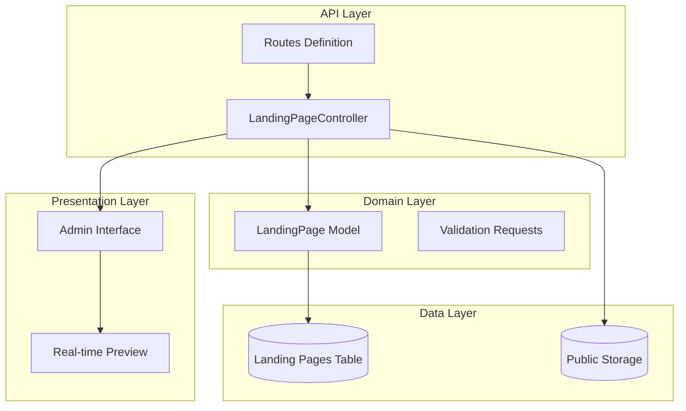
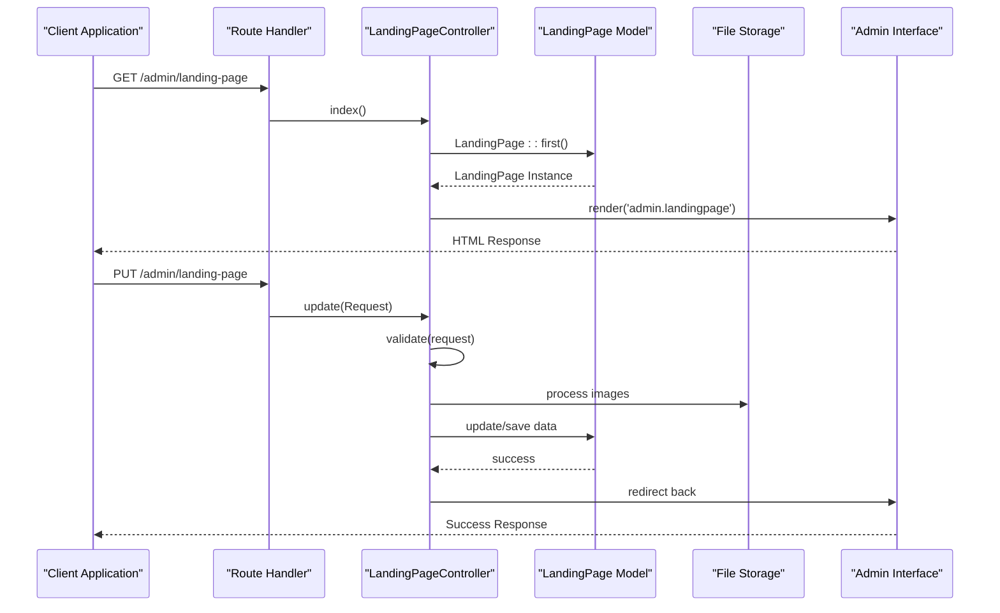
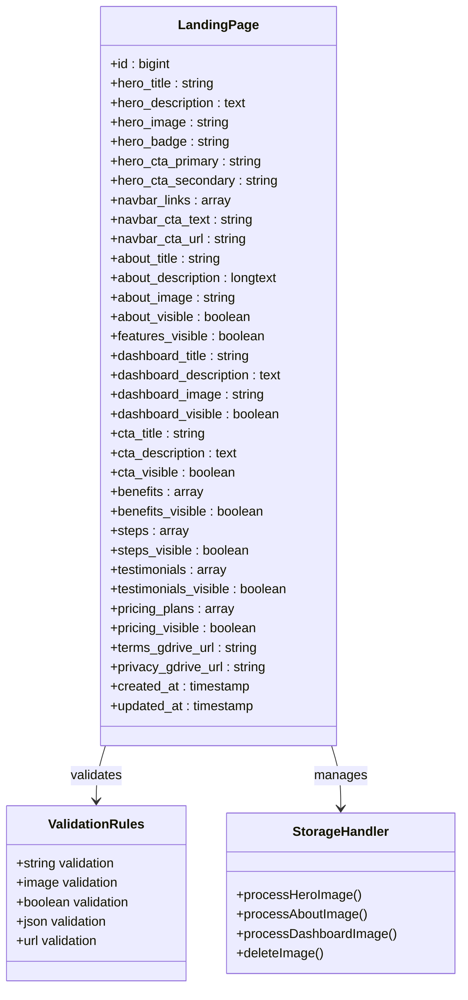
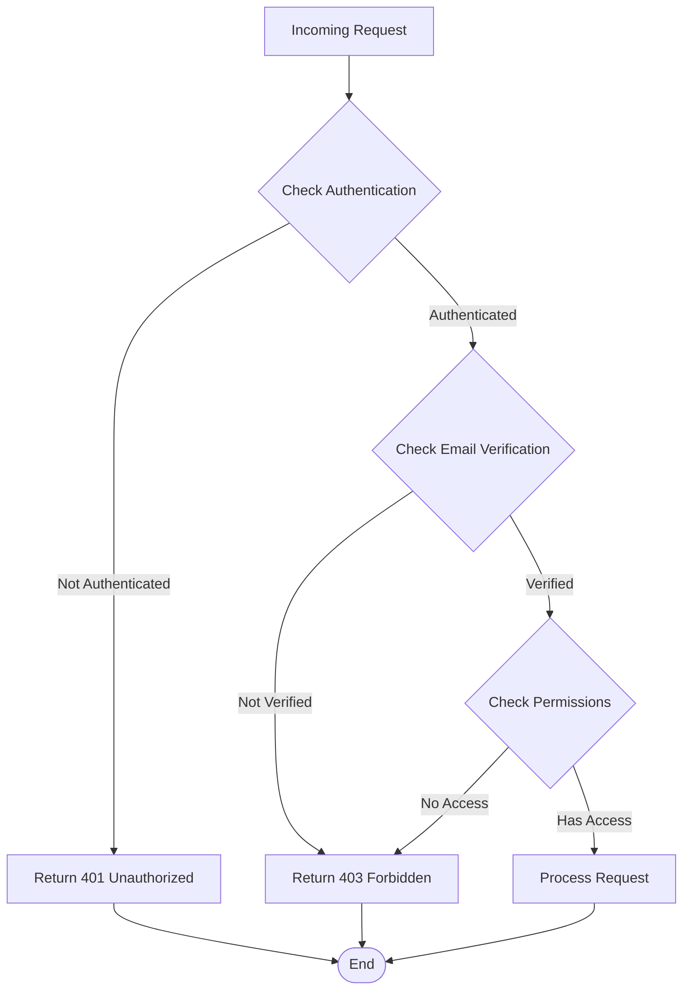
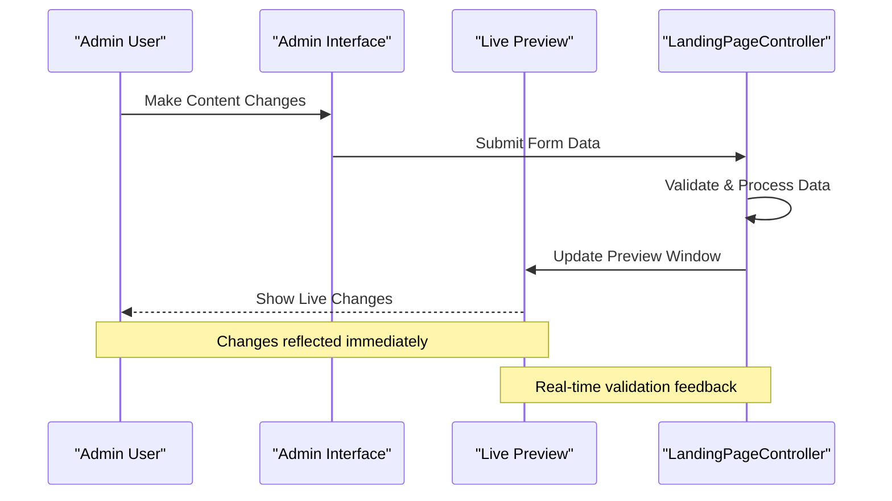
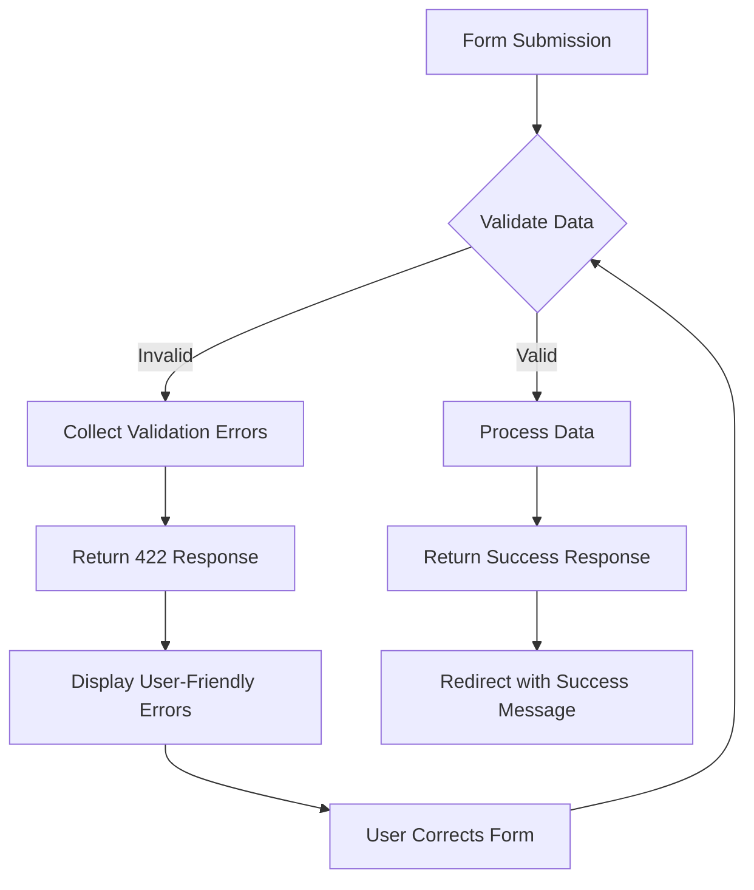

# Landing Page Management API

<cite>
**Referenced Files in This Document**
- [LandingPageController.php](file://app/Http/Controllers/LandingPageController.php)
- [LandingPage.php](file://app/Models/LandingPage.php)
- [web.php](file://routes/web.php)
- [2026_06_17_031941_create_landing_pages_table.php](file://database/migrations/2026_06_17_031941_create_landing_pages_table.php)
- [2026_06_18_023000_add_images_to_landing_pages_table.php](file://database/migrations/2026_06_18_023000_add_images_to_landing_pages_table.php)
- [2026_06_18_035802_add_dashboard_and_navbar_to_landing_pages_table.php](file://database/migrations/2026_06_18_035802_add_dashboard_and_navbar_to_landing_pages_table.php)
- [2026_06_18_040000_add_all_sections_to_landing_pages_table.php](file://database/migrations/2026_06_18_040000_add_all_sections_to_landing_pages_table.php)
- [2026_06_22_022549_add_section_visibility_to_landing_pages.php](file://database/migrations/2026_06_22_022549_add_section_visibility_to_landing_pages.php)
- [2026_06_18_064300_add_testimonials_visible_to_landing_pages.php](file://database/migrations/2026_06_18_064300_add_testimonials_visible_to_landing_pages.php)
- [2026_06_22_031700_add_gdrive_links_to_landing_pages.php](file://database/migrations/2026_06_22_031700_add_gdrive_links_to_landing_pages.php)
- [landingpage.blade.php](file://resources/views/admin/landingpage.blade.php)
</cite>

## Table of Contents
1. [Introduction](#introduction)
2. [Project Structure](#project-structure)
3. [Core Components](#core-components)
4. [Architecture Overview](#architecture-overview)
5. [Detailed Component Analysis](#detailed-component-analysis)
6. [API Specifications](#api-specifications)
7. [Authentication and Authorization](#authentication-and-authorization)
8. [Data Validation Rules](#data-validation-rules)
9. [Real-time Preview Functionality](#real-time-preview-functionality)
10. [Practical Examples](#practical-examples)
11. [Error Handling Patterns](#error-handling-patterns)
12. [Performance Considerations](#performance-considerations)
13. [Troubleshooting Guide](#troubleshooting-guide)
14. [Conclusion](#conclusion)

## Introduction

The Landing Page Management API provides comprehensive content management capabilities for ClinicalLog's homepage. This system enables administrators to manage all aspects of the landing page including hero sections, about content, feature displays, dashboard settings, testimonials visibility, pricing plans, and navigation configuration. The API supports both retrieval and modification of landing page content with robust validation, image upload handling, and real-time preview functionality.

The system is built on Laravel framework with a focus on providing a seamless content management experience through both web interface and programmatic API access. The implementation follows modern Laravel practices including Eloquent ORM for database operations, validation rules for data integrity, and proper error handling patterns.

## Project Structure

The landing page management system is organized around several key architectural components:



**Diagram sources**
- [web.php:53-54](file://routes/web.php#L53-L54)
- [LandingPageController.php:9-17](file://app/Http/Controllers/LandingPageController.php#L9-L17)
- [LandingPage.php:7-58](file://app/Models/LandingPage.php#L7-L58)

**Section sources**
- [web.php:53-54](file://routes/web.php#L53-L54)
- [LandingPageController.php:9-17](file://app/Http/Controllers/LandingPageController.php#L9-L17)
- [LandingPage.php:7-58](file://app/Models/LandingPage.php#L7-L58)

## Core Components

### LandingPageController
The controller serves as the primary interface for landing page management operations. It handles both GET requests for retrieving current configurations and PUT requests for updating content. The controller implements comprehensive validation, image processing, and data serialization for complex content structures.

### LandingPage Model
The Eloquent model defines the data structure and relationships for landing page content. It includes fillable attributes for all configurable fields, JSON casting for structured content arrays, and boolean casting for visibility toggles.

### Database Migrations
Multiple migrations progressively build the landing pages table structure, adding sections incrementally from basic hero content to advanced features like testimonials, pricing plans, and Google Drive integration.

**Section sources**
- [LandingPageController.php:19-223](file://app/Http/Controllers/LandingPageController.php#L19-L223)
- [LandingPage.php:9-57](file://app/Models/LandingPage.php#L9-L57)

## Architecture Overview

The landing page management system follows a layered architecture pattern with clear separation of concerns:



**Diagram sources**
- [web.php:53-54](file://routes/web.php#L53-L54)
- [LandingPageController.php:11-223](file://app/Http/Controllers/LandingPageController.php#L11-L223)

## Detailed Component Analysis

### Data Model Architecture

The LandingPage model implements a flexible JSON-based content structure supporting various content types:



**Diagram sources**
- [LandingPage.php:9-57](file://app/Models/LandingPage.php#L9-L57)
- [LandingPageController.php:21-47](file://app/Http/Controllers/LandingPageController.php#L21-L47)

### Content Sections Structure

The landing page supports multiple content sections, each with specific validation rules and processing logic:

| Section | Fields | Validation Type | Purpose |
|---------|--------|----------------|---------|
| Hero | title, description, badge, CTA buttons, image | String, Image | Primary landing content |
| Navigation | navbar links, CTA text/url | Array, String | Site navigation structure |
| About | title, description, image | String, Image | Company/about information |
| Dashboard | title, description, image | String, Image | Product preview section |
| Benefits | icon, title | Array | Feature highlights |
| Steps | icon, title, description | Array | Process explanation |
| Testimonials | quote, name, role, img | Array | Social proof |
| Pricing | tier, name, price, features | Array | Subscription plans |

**Section sources**
- [LandingPageController.php:51-212](file://app/Http/Controllers/LandingPageController.php#L51-L212)
- [LandingPage.php:43-57](file://app/Models/LandingPage.php#L43-L57)

## API Specifications

### GET /admin/landing-page

**Endpoint**: `GET /admin/landing-page`

**Description**: Retrieves the current landing page configuration for display in the admin interface.

**Authentication**: Required (authenticated and verified users only)

**Response**: HTML response containing the admin landing page interface with current configuration data pre-populated.

**Success Response**: `200 OK` with HTML content

**Error Responses**:
- `401 Unauthorized`: User not authenticated
- `403 Forbidden`: User lacks proper verification
- `500 Internal Server Error`: Server-side processing error

### PUT /admin/landing-page

**Endpoint**: `PUT /admin/landing-page`

**Description**: Updates the landing page configuration with new content and settings.

**Authentication**: Required (authenticated and verified users only)

**Content-Type**: `application/x-www-form-urlencoded` or `multipart/form-data`

**Request Parameters**:

| Parameter | Type | Validation | Description |
|-----------|------|------------|-------------|
| hero_title | string | nullable, max:500 | Hero section main title |
| hero_description | string | nullable | Hero section description |
| hero_badge | string | nullable, max:255 | Hero badge text |
| hero_cta_primary | string | nullable, max:100 | Primary call-to-action button |
| hero_cta_secondary | string | nullable, max:100 | Secondary call-to-action button |
| navbar_cta_text | string | nullable, max:100 | Navigation CTA button text |
| navbar_cta_url | string | nullable, max:255 | Navigation CTA button URL |
| about_title | string | nullable, max:255 | About section title |
| about_description | string | nullable | About section description |
| dashboard_title | string | nullable, max:255 | Dashboard section title |
| dashboard_description | string | nullable | Dashboard section description |
| cta_title | string | nullable, max:500 | CTA section title |
| cta_description | string | nullable | CTA section description |
| hero_image | file | nullable, image, mimes:jpg,jpeg,png,webp,svg, max:2048KB | Hero section image |
| about_image | file | nullable, image, mimes:jpg,jpeg,png,webp,svg, max:2048KB | About section image |
| dashboard_image | file | nullable, image, mimes:jpg,jpeg,png,webp,svg, max:2048KB | Dashboard section image |
| delete_hero_image | integer | nullable, in:0,1 | Flag to delete hero image |
| delete_about_image | integer | nullable, in:0,1 | Flag to delete about image |
| delete_dashboard_image | integer | nullable, in:0,1 | Flag to delete dashboard image |
| about_visible | boolean | nullable | Show/hide about section |
| features_visible | boolean | nullable | Show/hide features section |
| benefits_visible | boolean | nullable | Show/hide benefits section |
| dashboard_visible | boolean | nullable | Show/hide dashboard section |
| steps_visible | boolean | nullable | Show/hide steps section |
| pricing_visible | boolean | nullable | Show/hide pricing section |
| cta_visible | boolean | nullable | Show/hide CTA section |
| testimonials_visible | boolean | nullable | Show/hide testimonials section |
| navbar_links | array | nullable | Navigation menu items |
| benefits | array | nullable | Benefit items |
| steps | array | nullable | Step items |
| testimonials | array | nullable | Testimonial items |
| pricing_plans | array | nullable | Pricing plan items |
| terms_gdrive_url | string | nullable, max:2000 | Terms document Google Drive URL |
| privacy_gdrive_url | string | nullable, max:2000 | Privacy policy Google Drive URL |

**Success Response**: `302 Found` with success message

**Error Responses**:
- `401 Unauthorized`: User not authenticated
- `403 Forbidden`: User lacks proper verification
- `422 Unprocessable Entity`: Validation errors
- `500 Internal Server Error`: Server-side processing error

**Section sources**
- [web.php:53-54](file://routes/web.php#L53-L54)
- [LandingPageController.php:19-47](file://app/Http/Controllers/LandingPageController.php#L19-L47)

## Authentication and Authorization

The landing page management endpoints are protected by Laravel Breeze authentication middleware:



**Diagram sources**
- [web.php:37-74](file://routes/web.php#L37-L74)

**Authentication Requirements**:
- User must be authenticated (`auth` middleware)
- User's email must be verified (`verified` middleware)
- User must have appropriate permissions for content management

**Authorization Pattern**:
- Routes are wrapped in middleware groups for protection
- Access controlled through Laravel's built-in authentication guards
- Session-based authentication with CSRF protection

**Section sources**
- [web.php:37-74](file://routes/web.php#L37-L74)
- [auth.php:38-59](file://routes/auth.php#L38-L59)

## Data Validation Rules

The system implements comprehensive validation rules for all landing page content:

### Text Validation
- Maximum length limits for all text fields
- Optional field handling for flexible content management
- Proper sanitization of user input

### Image Validation
- MIME type restrictions (jpg, jpeg, png, webp, svg)
- File size limits (2MB maximum)
- Format-specific validation for different image types

### Boolean Validation
- Strict boolean conversion using `has()` method
- Default values for visibility toggles
- Automatic casting to boolean type

### JSON Structure Validation
- Array validation for complex content sections
- Nested field validation for structured data
- Optional processing for empty arrays

### URL Validation
- Google Drive URL format validation
- Maximum length constraints
- Proper URL sanitization

**Section sources**
- [LandingPageController.php:21-47](file://app/Http/Controllers/LandingPageController.php#L21-L47)
- [LandingPage.php:43-57](file://app/Models/LandingPage.php#L43-L57)

## Real-time Preview Functionality

The system provides real-time preview capabilities through the admin interface:



**Diagram sources**
- [landingpage.blade.php:1040-1052](file://resources/views/admin/landingpage.blade.php#L1040-L1052)

### Preview Features
- Tabbed interface for different content sections
- Real-time image upload previews
- Toggle visibility controls with live feedback
- Dynamic content validation and error display
- Responsive design for different screen sizes

### JavaScript Implementation
- Tab switching with smooth animations
- Drag-and-drop image upload functionality
- Dynamic form element generation
- Real-time validation feedback
- State management for visibility toggles

**Section sources**
- [landingpage.blade.php:1057-1442](file://resources/views/admin/landingpage.blade.php#L1057-L1442)

## Practical Examples

### Basic Content Update

**Request**: PUT `/admin/landing-page`
**Headers**: `Content-Type: application/x-www-form-urlencoded`
**Body**:
```
hero_title=Transform Your Medical Education
hero_description=Complete digital solution for medical logbook management
about_title=About ClinicalLog
about_description=Leading platform for medical education documentation
```

**Expected Response**: `302 Found` with success message

### Bulk Section Visibility Toggle

**Request**: PUT `/admin/landing-page`
**Body**:
```
about_visible=1
features_visible=0
benefits_visible=1
dashboard_visible=0
```

**Expected Outcome**: Selected sections will be hidden while others remain visible

### Image Upload and Replacement

**Request**: PUT `/admin/landing-page`
**Headers**: `Content-Type: multipart/form-data`
**Body**:
```
hero_image=[uploaded-file]
delete_about_image=1
about_image=[new-file]
```

**Expected Outcome**: Hero image updated, about image deleted, new about image uploaded

### Complex Pricing Plan Configuration

**Request**: PUT `/admin/landing-page`
**Body**:
```
pricing_plans[0][tier]=Starter
pricing_plans[0][name]=Basic Department
pricing_plans[0][price]=Rp25Juta
pricing_plans[0][featured]=1
pricing_plans[0][features_text]=Maks 100 mahasiswa\nMaks 5 dosen\nDashboard basic

pricing_plans[1][tier]=Enterprise
pricing_plans[1][name]=University
pricing_plans[1][price]=Rp75Juta
pricing_plans[1][featured]=0
pricing_plans[1][features_text]=Multi-fakultas\nCentral Admin\nCustom Reporting
```

**Expected Outcome**: Two pricing plans created with proper feature formatting

## Error Handling Patterns

### Validation Error Handling
The system implements comprehensive error handling for validation failures:



**Diagram sources**
- [LandingPageController.php:21-47](file://app/Http/Controllers/LandingPageController.php#L21-L47)

### Image Processing Errors
- Unsupported file formats: Return validation error
- File size exceeded: Return validation error  
- Upload failures: Return server error
- Storage permission issues: Log error and return failure response

### Database Operation Errors
- Duplicate entries: Handle gracefully with user feedback
- Constraint violations: Return appropriate error codes
- Transaction failures: Rollback and retry mechanism

**Section sources**
- [LandingPageController.php:77-114](file://app/Http/Controllers/LandingPageController.php#L77-L114)

## Performance Considerations

### Image Optimization
- Maximum file size limit of 2MB prevents memory issues
- Supported formats optimized for web delivery
- Automatic cleanup of deleted images prevents storage bloat

### Database Efficiency
- Single record pattern reduces query complexity
- JSON fields enable flexible content structure
- Proper indexing on frequently accessed fields

### Memory Management
- Stream-based file processing prevents memory overflow
- Batch operations for bulk updates
- Efficient caching of static assets

### Scalability Factors
- Horizontal scaling through database replication
- CDN integration for static assets
- Load balancing for high-traffic scenarios

## Troubleshooting Guide

### Common Issues and Solutions

**Authentication Problems**
- Symptom: 401 Unauthorized responses
- Solution: Ensure user is logged in and email is verified
- Prevention: Implement proper login flow and verification checks

**File Upload Issues**
- Symptom: Images not uploading or displaying incorrectly
- Solution: Check file format compatibility and size limits
- Prevention: Validate file types client-side before upload

**Validation Errors**
- Symptom: 422 Unprocessable Entity responses
- Solution: Review validation rules and adjust input accordingly
- Prevention: Implement client-side validation for better UX

**Database Connection Issues**
- Symptom: 500 Internal Server errors during updates
- Solution: Check database connectivity and permissions
- Prevention: Implement connection pooling and retry mechanisms

### Debug Information

**Logging Configuration**
- Error logging enabled for all exceptions
- Validation errors captured with context
- Performance metrics tracked for optimization

**Monitoring Capabilities**
- Request/response logging for debugging
- Database query performance monitoring
- File upload progress tracking

**Section sources**
- [LandingPageController.php:77-114](file://app/Http/Controllers/LandingPageController.php#L77-L114)

## Conclusion

The Landing Page Management API provides a comprehensive solution for managing ClinicalLog's homepage content. The system offers robust validation, flexible content structures, real-time preview capabilities, and secure authentication. Its modular architecture supports easy maintenance and future enhancements while maintaining excellent performance characteristics.

Key strengths include:
- Comprehensive validation system ensuring data integrity
- Flexible JSON-based content structure supporting complex layouts
- Real-time preview functionality enhancing user experience
- Secure authentication with proper authorization controls
- Scalable architecture supporting growth and maintenance

The implementation demonstrates best practices in Laravel development, including proper separation of concerns, comprehensive error handling, and user-friendly interfaces. The system is well-suited for ongoing content management needs and can accommodate future feature additions.