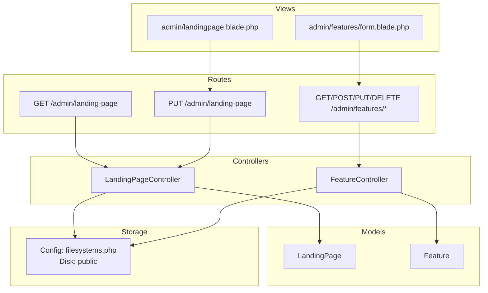
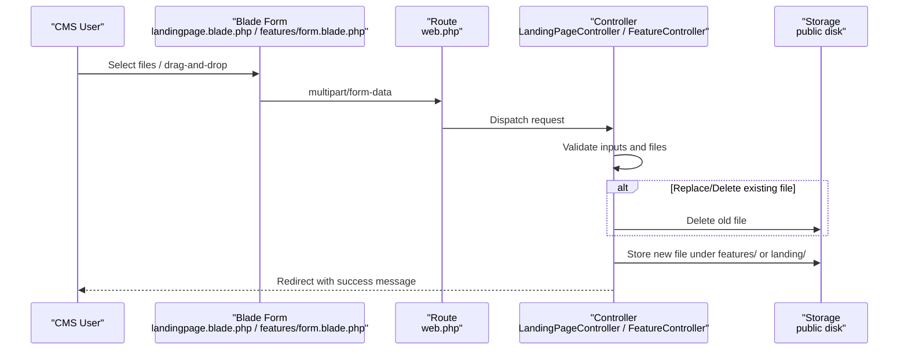
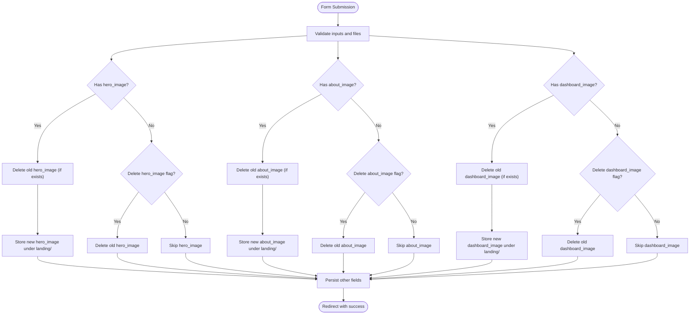
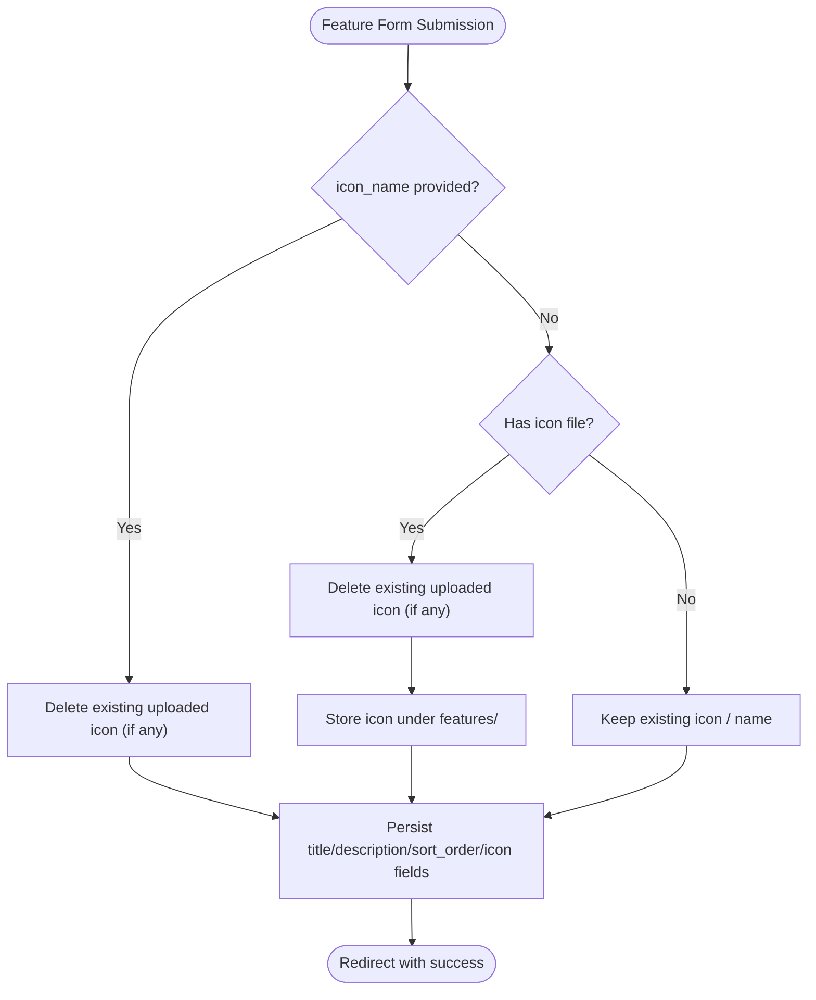
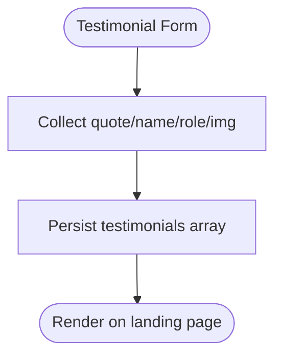
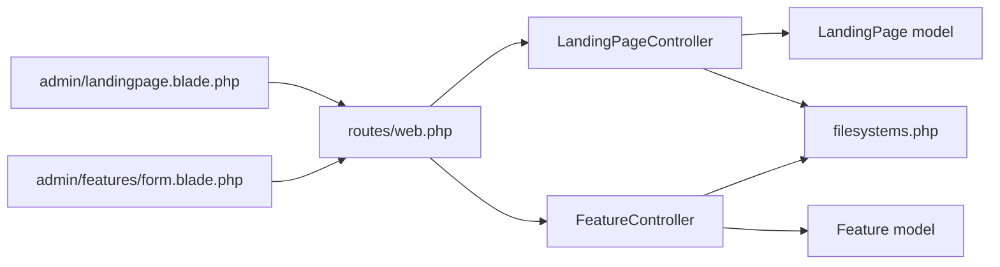

# File Upload & Media APIs

<cite>
**Referenced Files in This Document**
- [LandingPageController.php](file://app/Http/Controllers/LandingPageController.php)
- [FeatureController.php](file://app/Http/Controllers/FeatureController.php)
- [web.php](file://routes/web.php)
- [filesystems.php](file://config/filesystems.php)
- [LandingPage.php](file://app/Models/LandingPage.php)
- [Feature.php](file://app/Models/Feature.php)
- [2026_06_18_023000_add_images_to_landing_pages_table.php](file://database/migrations/2026_06_18_023000_add_images_to_landing_pages_table.php)
- [2026_06_18_060800_add_icon_name_to_features_table.php](file://database/migrations/2026_06_18_060800_add_icon_name_to_features_table.php)
- [landingpage.blade.php](file://resources/views/admin/landingpage.blade.php)
- [features/form.blade.php](file://resources/views/admin/features/form.blade.php)
</cite>

## Table of Contents
1. [Introduction](#introduction)
2. [Project Structure](#project-structure)
3. [Core Components](#core-components)
4. [Architecture Overview](#architecture-overview)
5. [Detailed Component Analysis](#detailed-component-analysis)
6. [Dependency Analysis](#dependency-analysis)
7. [Performance Considerations](#performance-considerations)
8. [Troubleshooting Guide](#troubleshooting-guide)
9. [Conclusion](#conclusion)

## Introduction
This document describes the file upload and media management capabilities for the ClinicalLog CMS, focusing on:
- Image upload endpoints for landing page sections (hero, about, dashboard)
- Feature icon upload and management (including Lucide icon name fallback)
- Testimonial media handling via URL fields
- Supported file types, size limits, and validation rules
- File storage operations, URL generation, and media optimization strategies
- multipart/form-data handling, progress tracking, and error reporting
- Examples of upload workflows, batch operations, and media management
- Security considerations and storage optimization strategies

## Project Structure
The CMS exposes media-related functionality through dedicated controllers and Blade forms. Routes bind to controller actions that validate, persist, and manage uploaded files. Storage is handled via Laravel’s filesystem abstraction with a public disk for serving media.

**Diagram sources**
- [web.php:52-62](file://routes/web.php#L52-L62)
- [LandingPageController.php:11-22](file://app/Http/Controllers/LandingPageController.php#L11-L22)
- [FeatureController.php:11-20](file://app/Http/Controllers/FeatureController.php#L11-L20)
- [filesystems.php:41-48](file://config/filesystems.php#L41-L48)

**Section sources**
- [web.php:52-62](file://routes/web.php#L52-L62)
- [filesystems.php:41-48](file://config/filesystems.php#L41-L48)

## Core Components
- Landing Page CMS endpoint
  - Route: PUT /admin/landing-page
  - Purpose: Update landing page content and images (hero, about, dashboard)
  - Validation: image mime types jpg, jpeg, png, webp, svg with max 2048 KB
  - Storage: stores under landing/ in public disk; supports deletion via checkbox
- Feature CMS endpoint
  - Routes: GET/POST/PUT/DELETE /admin/features/*
  - Purpose: Manage feature items with icon (uploaded SVG/PNG/JPG or Lucide icon name)
  - Validation: image mime types svg, png, jpg, jpeg with max 2MB
  - Storage: stores under features/ in public disk; supports deletion via checkbox
- Storage configuration
  - Public disk URL: /storage
  - Asset URLs generated via storage symlink to public/storage

**Section sources**
- [LandingPageController.php:19-47](file://app/Http/Controllers/LandingPageController.php#L19-L47)
- [LandingPageController.php:77-114](file://app/Http/Controllers/LandingPageController.php#L77-L114)
- [FeatureController.php:22-54](file://app/Http/Controllers/FeatureController.php#L22-L54)
- [FeatureController.php:64-92](file://app/Http/Controllers/FeatureController.php#L64-L92)
- [filesystems.php:41-48](file://config/filesystems.php#L41-L48)
- [landingpage.blade.php:148-162](file://resources/views/admin/landingpage.blade.php#L148-L162)
- [features/form.blade.php:111-123](file://resources/views/admin/features/form.blade.php#L111-L123)

## Architecture Overview
The upload pipeline follows a consistent pattern:
- Client submits multipart/form-data via HTML forms
- Laravel validates inputs and files
- Uploaded files are stored to the public disk
- Existing files are removed when replaced or when deletion flags are set
- URLs are generated using the public disk base URL

**Diagram sources**
- [web.php:52-62](file://routes/web.php#L52-L62)
- [LandingPageController.php:77-114](file://app/Http/Controllers/LandingPageController.php#L77-L114)
- [FeatureController.php:28-30](file://app/Http/Controllers/FeatureController.php#L28-L30)
- [filesystems.php:41-48](file://config/filesystems.php#L41-L48)

## Detailed Component Analysis

### Landing Page Image Uploads
Endpoints:
- GET /admin/landing-page (renders form)
- PUT /admin/landing-page (updates content and images)

Supported images:
- Hero image
- About image
- Dashboard image

Validation rules:
- image type validation
- Allowed MIME types: jpg, jpeg, png, webp, svg
- Max file size: 2048 KB

Processing logic:
- If a new file is present, the controller deletes the previous file (if any) and stores the new file under landing/ in the public disk
- If a delete checkbox is checked, the controller removes the current file and clears the field
- Non-image fields are sanitized and persisted as arrays/booleans/strings

URL generation:
- Stored paths are prefixed with storage/ for asset resolution
- Public disk base URL is /storage

**Diagram sources**
- [LandingPageController.php:19-47](file://app/Http/Controllers/LandingPageController.php#L19-L47)
- [LandingPageController.php:77-114](file://app/Http/Controllers/LandingPageController.php#L77-L114)
- [LandingPage.php:9-41](file://app/Models/LandingPage.php#L9-L41)
- [2026_06_18_023000_add_images_to_landing_pages_table.php:11-14](file://database/migrations/2026_06_18_023000_add_images_to_landing_pages_table.php#L11-L14)
- [landingpage.blade.php:148-162](file://resources/views/admin/landingpage.blade.php#L148-L162)

**Section sources**
- [LandingPageController.php:19-47](file://app/Http/Controllers/LandingPageController.php#L19-L47)
- [LandingPageController.php:77-114](file://app/Http/Controllers/LandingPageController.php#L77-L114)
- [LandingPage.php:9-41](file://app/Models/LandingPage.php#L9-L41)
- [2026_06_18_023000_add_images_to_landing_pages_table.php:11-14](file://database/migrations/2026_06_18_023000_add_images_to_landing_pages_table.php#L11-L14)
- [landingpage.blade.php:148-162](file://resources/views/admin/landingpage.blade.php#L148-L162)

### Feature Icon Uploads
Endpoints:
- GET /admin/features (index)
- GET /admin/features/create (create form)
- POST /admin/features (store)
- GET/PUT/DELETE /admin/features/{id} (edit/update/destroy)

Icon options:
- Lucide icon name (preferred): no file upload required
- Uploaded icon: SVG, PNG, JPG, JPEG up to 2MB

Processing logic:
- If Lucide icon name is provided, remove any previously uploaded icon file
- If a file is uploaded and no Lucide name, store under features/ in the public disk
- Deletion via checkbox removes the uploaded file and clears fields
- Sorting updates adjust subsequent entries to maintain order

**Diagram sources**
- [FeatureController.php:22-54](file://app/Http/Controllers/FeatureController.php#L22-L54)
- [FeatureController.php:64-92](file://app/Http/Controllers/FeatureController.php#L64-L92)
- [Feature.php:9-15](file://app/Models/Feature.php#L9-L15)
- [2026_06_18_060800_add_icon_name_to_features_table.php:14-15](file://database/migrations/2026_06_18_060800_add_icon_name_to_features_table.php#L14-L15)
- [features/form.blade.php:111-123](file://resources/views/admin/features/form.blade.php#L111-L123)

**Section sources**
- [FeatureController.php:22-54](file://app/Http/Controllers/FeatureController.php#L22-L54)
- [FeatureController.php:64-92](file://app/Http/Controllers/FeatureController.php#L64-L92)
- [Feature.php:9-15](file://app/Models/Feature.php#L9-L15)
- [2026_06_18_060800_add_icon_name_to_features_table.php:14-15](file://database/migrations/2026_06_18_060800_add_icon_name_to_features_table.php#L14-L15)
- [features/form.blade.php:111-123](file://resources/views/admin/features/form.blade.php#L111-L123)

### Testimonial Media Management
Testimonials support storing a media URL per entry. The backend accepts an img field that is persisted as part of the testimonials array. No file upload is performed server-side for testimonials; the URL is stored as-is.

**Diagram sources**
- [LandingPageController.php:169-186](file://app/Http/Controllers/LandingPageController.php#L169-L186)
- [LandingPage.php:35-38](file://app/Models/LandingPage.php#L35-L38)

**Section sources**
- [LandingPageController.php:169-186](file://app/Http/Controllers/LandingPageController.php#L169-L186)
- [LandingPage.php:35-38](file://app/Models/LandingPage.php#L35-L38)

## Dependency Analysis
- Routes depend on controllers for handling requests
- Controllers depend on models for persistence and on the filesystem for storage
- Views depend on routes for form actions and on storage URLs for previews
- Storage depends on filesystem configuration for disk and URL generation

**Diagram sources**
- [web.php:52-62](file://routes/web.php#L52-L62)
- [LandingPageController.php:11-22](file://app/Http/Controllers/LandingPageController.php#L11-L22)
- [FeatureController.php:11-20](file://app/Http/Controllers/FeatureController.php#L11-L20)
- [filesystems.php:41-48](file://config/filesystems.php#L41-L48)

**Section sources**
- [web.php:52-62](file://routes/web.php#L52-L62)
- [filesystems.php:41-48](file://config/filesystems.php#L41-L48)

## Performance Considerations
- File size limits reduce bandwidth and storage overhead; consider enabling client-side size checks before upload
- Using the public disk with a single storage symlink simplifies asset delivery; ensure CDN or reverse proxy caching is configured for static assets
- For high-volume uploads, consider asynchronous processing and background jobs to avoid blocking requests
- Image optimization (resize, compress) can be integrated at upload time to reduce payload sizes

## Troubleshooting Guide
Common issues and resolutions:
- Validation errors on images
  - Ensure MIME types match allowed list (jpg, jpeg, png, webp, svg for landing; svg, png, jpg, jpeg for features)
  - Ensure file size does not exceed 2048 KB for landing images or 2 MB for feature icons
- File replacement not taking effect
  - Verify that the delete checkbox is selected when replacing an existing image
  - Confirm that the new file is attached in the multipart request
- Old files not removed
  - Controllers remove previous files only when a new file is uploaded or when the delete flag is set; ensure either condition is met
- Asset URL not resolving
  - Confirm the public/storage symlink exists and points to storage/app/public
  - Ensure the stored path is prefixed with storage/ in templates

**Section sources**
- [LandingPageController.php:24-25](file://app/Http/Controllers/LandingPageController.php#L24-L25)
- [FeatureController.php:28-30](file://app/Http/Controllers/FeatureController.php#L28-L30)
- [filesystems.php:76-78](file://config/filesystems.php#L76-L78)

## Conclusion
ClinicalLog CMS provides robust, form-driven media management for landing page imagery and feature icons. It enforces strict validation, manages file replacement and deletion, and integrates seamlessly with Laravel’s filesystem and asset pipeline. By adhering to the documented validation rules and leveraging the provided UI patterns, administrators can efficiently manage media assets while maintaining performance and security.