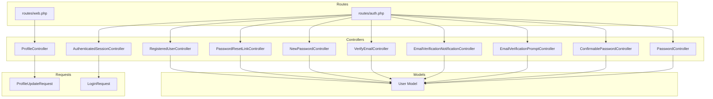
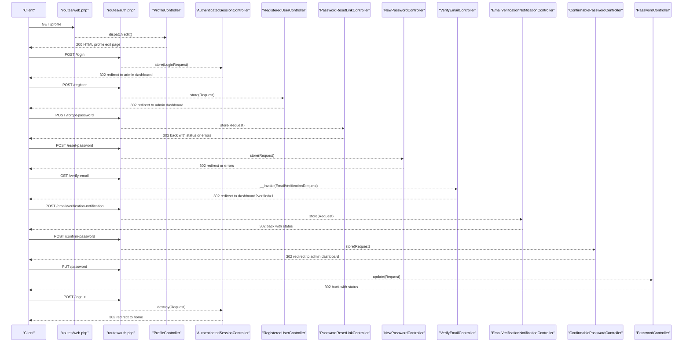
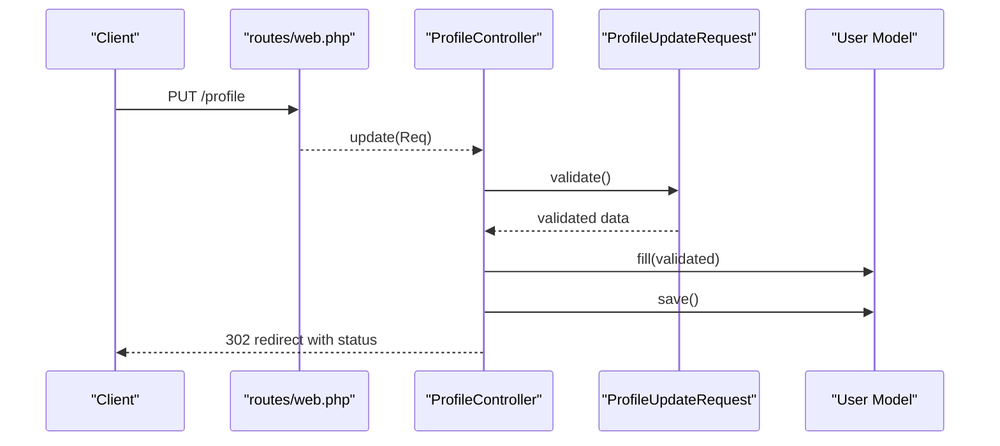
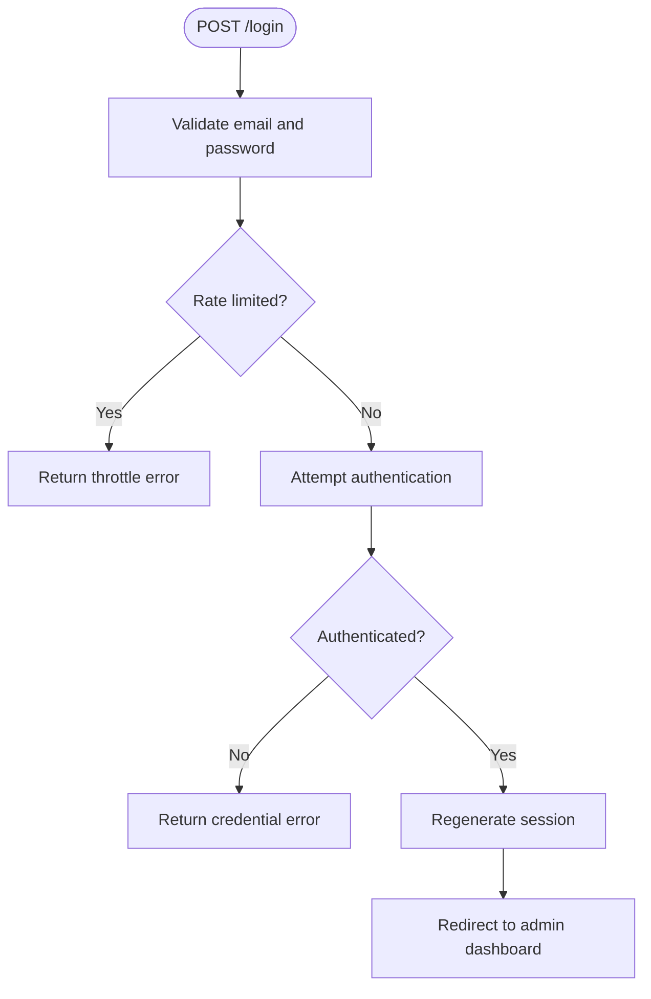
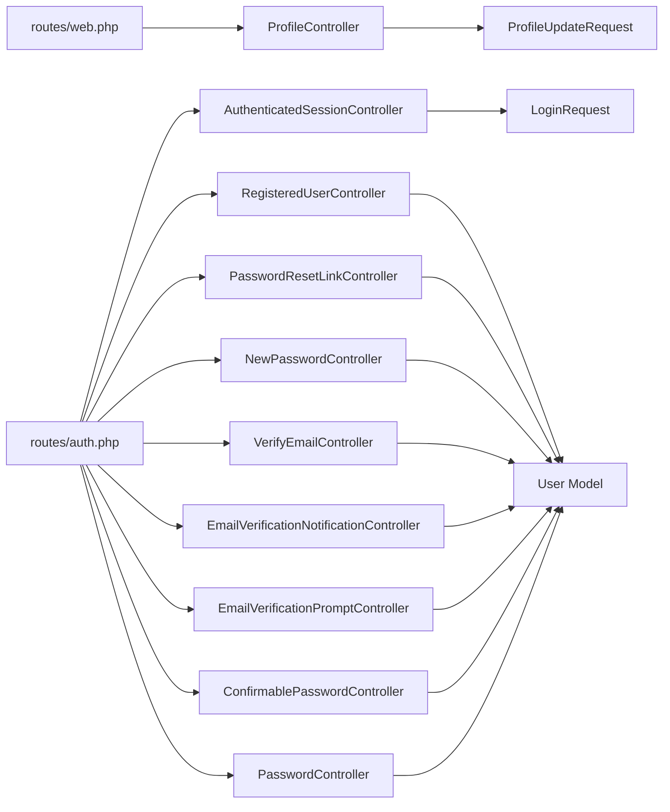

# User Management APIs

<cite>
**Referenced Files in This Document**
- [routes/web.php](file://routes/web.php)
- [routes/auth.php](file://routes/auth.php)
- [app/Http/Controllers/ProfileController.php](file://app/Http/Controllers/ProfileController.php)
- [app/Http/Controllers/Auth/AuthenticatedSessionController.php](file://app/Http/Controllers/Auth/AuthenticatedSessionController.php)
- [app/Http/Controllers/Auth/RegisteredUserController.php](file://app/Http/Controllers/Auth/RegisteredUserController.php)
- [app/Http/Controllers/Auth/PasswordResetLinkController.php](file://app/Http/Controllers/Auth/PasswordResetLinkController.php)
- [app/Http/Controllers/Auth/NewPasswordController.php](file://app/Http/Controllers/Auth/NewPasswordController.php)
- [app/Http/Controllers/Auth/VerifyEmailController.php](file://app/Http/Controllers/Auth/VerifyEmailController.php)
- [app/Http/Controllers/Auth/EmailVerificationNotificationController.php](file://app/Http/Controllers/Auth/EmailVerificationNotificationController.php)
- [app/Http/Controllers/Auth/EmailVerificationPromptController.php](file://app/Http/Controllers/Auth/EmailVerificationPromptController.php)
- [app/Http/Controllers/Auth/ConfirmablePasswordController.php](file://app/Http/Controllers/Auth/ConfirmablePasswordController.php)
- [app/Http/Controllers/Auth/PasswordController.php](file://app/Http/Controllers/Auth/PasswordController.php)
- [app/Http/Requests/ProfileUpdateRequest.php](file://app/Http/Requests/ProfileUpdateRequest.php)
- [app/Http/Requests/Auth/LoginRequest.php](file://app/Http/Requests/Auth/LoginRequest.php)
- [app/Models/User.php](file://app/Models/User.php)
- [config/auth.php](file://config/auth.php)
- [database/migrations/0001_01_01_000000_create_users_table.php](file://database/migrations/0001_01_01_000000_create_users_table.php)
</cite>

## Table of Contents
1. [Introduction](#introduction)
2. [Project Structure](#project-structure)
3. [Core Components](#core-components)
4. [Architecture Overview](#architecture-overview)
5. [Detailed Component Analysis](#detailed-component-analysis)
6. [Dependency Analysis](#dependency-analysis)
7. [Performance Considerations](#performance-considerations)
8. [Troubleshooting Guide](#troubleshooting-guide)
9. [Conclusion](#conclusion)

## Introduction
This document describes the user management and authentication APIs in ClinicalLog CMS. It covers profile management endpoints (GET/PUT/DELETE for user information updates, password changes, and account deletion), authentication endpoints for login, registration, password reset, and email verification, along with request validation schemas, response formats, and security considerations. It also explains role-based access control, session management, user validation rules, password security requirements, and account lifecycle management.

## Project Structure
The user management and authentication features are implemented using Laravel’s controller and request validation layers, with routes grouped by middleware (guest vs auth). The routes define the HTTP surface, while controllers encapsulate business logic and request validation ensures robust input handling.

**Diagram sources**
- [routes/web.php:47-50](file://routes/web.php#L47-L50)
- [routes/auth.php:14-59](file://routes/auth.php#L14-L59)
- [app/Http/Controllers/ProfileController.php:12-60](file://app/Http/Controllers/ProfileController.php#L12-L60)
- [app/Http/Controllers/Auth/AuthenticatedSessionController.php:12-47](file://app/Http/Controllers/Auth/AuthenticatedSessionController.php#L12-L47)
- [app/Http/Controllers/Auth/RegisteredUserController.php:16-51](file://app/Http/Controllers/Auth/RegisteredUserController.php#L16-L51)
- [app/Http/Controllers/Auth/PasswordResetLinkController.php:12-45](file://app/Http/Controllers/Auth/PasswordResetLinkController.php#L12-L45)
- [app/Http/Controllers/Auth/NewPasswordController.php:17-63](file://app/Http/Controllers/Auth/NewPasswordController.php#L17-L63)
- [app/Http/Controllers/Auth/VerifyEmailController.php:10-27](file://app/Http/Controllers/Auth/VerifyEmailController.php#L10-L27)
- [app/Http/Controllers/Auth/EmailVerificationNotificationController.php:9-24](file://app/Http/Controllers/Auth/EmailVerificationNotificationController.php#L9-L24)
- [app/Http/Controllers/Auth/EmailVerificationPromptController.php:10-21](file://app/Http/Controllers/Auth/EmailVerificationPromptController.php#L10-L21)
- [app/Http/Controllers/Auth/ConfirmablePasswordController.php:12-40](file://app/Http/Controllers/Auth/ConfirmablePasswordController.php#L12-L40)
- [app/Http/Controllers/Auth/PasswordController.php:11-29](file://app/Http/Controllers/Auth/PasswordController.php#L11-L29)
- [app/Http/Requests/ProfileUpdateRequest.php:10-31](file://app/Http/Requests/ProfileUpdateRequest.php#L10-L31)
- [app/Http/Requests/Auth/LoginRequest.php:13-86](file://app/Http/Requests/Auth/LoginRequest.php#L13-L86)
- [app/Models/User.php:15-32](file://app/Models/User.php#L15-L32)

**Section sources**
- [routes/web.php:47-50](file://routes/web.php#L47-L50)
- [routes/auth.php:14-59](file://routes/auth.php#L14-L59)

## Core Components
- Profile Management
  - GET /profile: Returns the user profile editing page.
  - PUT/PATCH /profile: Updates user profile information after validation.
  - DELETE /profile: Deletes the authenticated user’s account after confirming current password.
- Authentication
  - POST /login: Authenticates a user and regenerates session.
  - POST /logout: Logs out the authenticated user and invalidates session.
  - POST /register: Registers a new user with validated credentials.
  - POST /forgot-password: Sends a password reset link to the provided email.
  - POST /reset-password: Resets the password using a token and email.
  - GET /verify-email: Prompts for email verification if not yet verified.
  - GET /verify-email/{id}/{hash}: Verifies the user’s email via signed link.
  - POST /email/verification-notification: Resends the email verification link.
  - GET /confirm-password: Shows password confirmation view.
  - POST /confirm-password: Confirms the user’s password for sensitive actions.
  - PUT /password: Updates the user’s password after validating current password and applying password rules.

Validation and Security
- Request validation enforces field presence, type, length, uniqueness, and current password checks.
- Rate limiting for login attempts and verification throttling.
- Session regeneration and token invalidation on logout and account deletion.
- Password hashing and secure reset token handling.

**Section sources**
- [app/Http/Controllers/ProfileController.php:17-59](file://app/Http/Controllers/ProfileController.php#L17-L59)
- [app/Http/Controllers/Auth/AuthenticatedSessionController.php:25-46](file://app/Http/Controllers/Auth/AuthenticatedSessionController.php#L25-L46)
- [app/Http/Controllers/Auth/RegisteredUserController.php:33-49](file://app/Http/Controllers/Auth/RegisteredUserController.php#L33-L49)
- [app/Http/Controllers/Auth/PasswordResetLinkController.php:29-43](file://app/Http/Controllers/Auth/PasswordResetLinkController.php#L29-L43)
- [app/Http/Controllers/Auth/NewPasswordController.php:34-61](file://app/Http/Controllers/Auth/NewPasswordController.php#L34-L61)
- [app/Http/Controllers/Auth/VerifyEmailController.php:15-26](file://app/Http/Controllers/Auth/VerifyEmailController.php#L15-L26)
- [app/Http/Controllers/Auth/EmailVerificationNotificationController.php:14-23](file://app/Http/Controllers/Auth/EmailVerificationNotificationController.php#L14-L23)
- [app/Http/Controllers/Auth/EmailVerificationPromptController.php:15-20](file://app/Http/Controllers/Auth/EmailVerificationPromptController.php#L15-L20)
- [app/Http/Controllers/Auth/ConfirmablePasswordController.php:25-39](file://app/Http/Controllers/Auth/ConfirmablePasswordController.php#L25-L39)
- [app/Http/Controllers/Auth/PasswordController.php:16-28](file://app/Http/Controllers/Auth/PasswordController.php#L16-L28)
- [app/Http/Requests/ProfileUpdateRequest.php:17-30](file://app/Http/Requests/ProfileUpdateRequest.php#L17-L30)
- [app/Http/Requests/Auth/LoginRequest.php:41-77](file://app/Http/Requests/Auth/LoginRequest.php#L41-L77)

## Architecture Overview
The system uses route groups with middleware to separate guest-only endpoints (registration, login, forgot password, reset password) from authenticated endpoints (profile, password update, logout, email verification). Controllers coordinate request validation, authentication checks, and persistence, while the User model manages attributes and notifications.

**Diagram sources**
- [routes/web.php:47-50](file://routes/web.php#L47-L50)
- [routes/auth.php:14-59](file://routes/auth.php#L14-L59)
- [app/Http/Controllers/ProfileController.php:17-38](file://app/Http/Controllers/ProfileController.php#L17-L38)
- [app/Http/Controllers/Auth/AuthenticatedSessionController.php:25-46](file://app/Http/Controllers/Auth/AuthenticatedSessionController.php#L25-L46)
- [app/Http/Controllers/Auth/RegisteredUserController.php:31-49](file://app/Http/Controllers/Auth/RegisteredUserController.php#L31-L49)
- [app/Http/Controllers/Auth/PasswordResetLinkController.php:27-43](file://app/Http/Controllers/Auth/PasswordResetLinkController.php#L27-L43)
- [app/Http/Controllers/Auth/NewPasswordController.php:32-61](file://app/Http/Controllers/Auth/NewPasswordController.php#L32-L61)
- [app/Http/Controllers/Auth/VerifyEmailController.php:15-26](file://app/Http/Controllers/Auth/VerifyEmailController.php#L15-L26)
- [app/Http/Controllers/Auth/EmailVerificationNotificationController.php:14-23](file://app/Http/Controllers/Auth/EmailVerificationNotificationController.php#L14-L23)
- [app/Http/Controllers/Auth/ConfirmablePasswordController.php:25-39](file://app/Http/Controllers/Auth/ConfirmablePasswordController.php#L25-L39)
- [app/Http/Controllers/Auth/PasswordController.php:16-28](file://app/Http/Controllers/Auth/PasswordController.php#L16-L28)

## Detailed Component Analysis

### Profile Management Endpoints
- Endpoint: GET /profile
  - Purpose: Load the user profile editing page.
  - Access: Requires authentication and verified email.
  - Response: HTML view rendering profile form.
  - Notes: Uses the ProfileController edit action.
  
  **Section sources**
  - [routes/web.php:48](file://routes/web.php#L48)
  - [app/Http/Controllers/ProfileController.php:17-22](file://app/Http/Controllers/ProfileController.php#L17-L22)

- Endpoint: PUT/PATCH /profile
  - Purpose: Update user profile information (name, email).
  - Access: Requires authentication and verified email.
  - Validation: Name required, max length; email required, unique per user, lowercase, valid format.
  - Behavior: On email change, clears verification status; persists changes.
  - Response: Redirect to profile edit with success status.
  
  **Section sources**
  - [routes/web.php:49](file://routes/web.php#L49)
  - [app/Http/Controllers/ProfileController.php:27-38](file://app/Http/Controllers/ProfileController.php#L27-L38)
  - [app/Http/Requests/ProfileUpdateRequest.php:17-30](file://app/Http/Requests/ProfileUpdateRequest.php#L17-L30)

- Endpoint: DELETE /profile
  - Purpose: Delete the authenticated user’s account.
  - Access: Requires authentication and verified email.
  - Validation: Requires current password confirmation.
  - Behavior: Logs out, deletes user, invalidates session, regenerates CSRF token.
  - Response: Redirect to home page.
  
  **Section sources**
  - [routes/web.php:50](file://routes/web.php#L50)
  - [app/Http/Controllers/ProfileController.php:43-59](file://app/Http/Controllers/ProfileController.php#L43-L59)

**Diagram sources**
- [routes/web.php:49](file://routes/web.php#L49)
- [app/Http/Controllers/ProfileController.php:27-38](file://app/Http/Controllers/ProfileController.php#L27-L38)
- [app/Http/Requests/ProfileUpdateRequest.php:17-30](file://app/Http/Requests/ProfileUpdateRequest.php#L17-L30)
- [app/Models/User.php:15-32](file://app/Models/User.php#L15-L32)

### Authentication Endpoints
- Endpoint: POST /login
  - Purpose: Authenticate user and establish session.
  - Access: Available to guests.
  - Validation: Email and password required; rate-limited.
  - Behavior: On success, regenerates session; redirects to admin dashboard.
  - Response: Redirect on success; throws validation errors on failure.
  
  **Section sources**
  - [routes/auth.php:20-23](file://routes/auth.php#L20-L23)
  - [app/Http/Controllers/Auth/AuthenticatedSessionController.php:25-32](file://app/Http/Controllers/Auth/AuthenticatedSessionController.php#L25-L32)
  - [app/Http/Requests/Auth/LoginRequest.php:41-77](file://app/Http/Requests/Auth/LoginRequest.php#L41-L77)

- Endpoint: POST /logout
  - Purpose: Terminate authenticated session.
  - Access: Requires authentication.
  - Behavior: Logs out, invalidates session, regenerates CSRF token.
  - Response: Redirect to home.
  
  **Section sources**
  - [routes/auth.php:57-58](file://routes/auth.php#L57-L58)
  - [app/Http/Controllers/Auth/AuthenticatedSessionController.php:37-46](file://app/Http/Controllers/Auth/AuthenticatedSessionController.php#L37-L46)

- Endpoint: POST /register
  - Purpose: Register a new user.
  - Access: Available to guests.
  - Validation: Name required; email required, unique, lowercase, valid format; password confirmed and meeting defaults.
  - Behavior: Creates user with hashed password, fires registered event, logs in user.
  - Response: Redirect to admin dashboard.
  
  **Section sources**
  - [routes/auth.php:15-18](file://routes/auth.php#L15-L18)
  - [app/Http/Controllers/Auth/RegisteredUserController.php:31-49](file://app/Http/Controllers/Auth/RegisteredUserController.php#L31-L49)

- Endpoint: POST /forgot-password
  - Purpose: Send password reset link to email.
  - Access: Available to guests.
  - Validation: Email required and valid.
  - Behavior: Uses password broker to send reset link; returns status or error.
  - Response: Back with status or errors.
  
  **Section sources**
  - [routes/auth.php:25-29](file://routes/auth.php#L25-L29)
  - [app/Http/Controllers/Auth/PasswordResetLinkController.php:27-43](file://app/Http/Controllers/Auth/PasswordResetLinkController.php#L27-L43)

- Endpoint: POST /reset-password
  - Purpose: Reset password using token and email.
  - Access: Available to guests.
  - Validation: Token required; email required and valid; password confirmed and meeting defaults.
  - Behavior: Resets password via broker, fires password reset event, redirects on success.
  - Response: Redirect to login with status or back with errors.
  
  **Section sources**
  - [routes/auth.php:31-35](file://routes/auth.php#L31-L35)
  - [app/Http/Controllers/Auth/NewPasswordController.php:32-61](file://app/Http/Controllers/Auth/NewPasswordController.php#L32-L61)

- Endpoint: GET /verify-email
  - Purpose: Prompt for email verification if not yet verified.
  - Access: Requires authentication.
  - Behavior: Shows verification prompt or redirects to dashboard if verified.
  - Response: HTML view or redirect.
  
  **Section sources**
  - [routes/auth.php:38-40](file://routes/auth.php#L38-L40)
  - [app/Http/Controllers/Auth/EmailVerificationPromptController.php:15-20](file://app/Http/Controllers/Auth/EmailVerificationPromptController.php#L15-L20)

- Endpoint: GET /verify-email/{id}/{hash}
  - Purpose: Verify user email via signed link.
  - Access: Requires authentication and signed, throttled link.
  - Behavior: Marks email as verified and fires verified event; redirects to dashboard.
  - Response: Redirect.
  
  **Section sources**
  - [routes/auth.php:42-44](file://routes/auth.php#L42-L44)
  - [app/Http/Controllers/Auth/VerifyEmailController.php:15-26](file://app/Http/Controllers/Auth/VerifyEmailController.php#L15-L26)

- Endpoint: POST /email/verification-notification
  - Purpose: Resend email verification link.
  - Access: Requires authentication.
  - Behavior: Sends verification notification if not already verified.
  - Response: Back with status.
  
  **Section sources**
  - [routes/auth.php:46-48](file://routes/auth.php#L46-L48)
  - [app/Http/Controllers/Auth/EmailVerificationNotificationController.php:14-23](file://app/Http/Controllers/Auth/EmailVerificationNotificationController.php#L14-L23)

- Endpoint: GET /confirm-password
  - Purpose: Show password confirmation view for sensitive actions.
  - Access: Requires authentication.
  - Response: HTML view.
  
  **Section sources**
  - [routes/auth.php:50-53](file://routes/auth.php#L50-L53)
  - [app/Http/Controllers/Auth/ConfirmablePasswordController.php:17-20](file://app/Http/Controllers/Auth/ConfirmablePasswordController.php#L17-L20)

- Endpoint: POST /confirm-password
  - Purpose: Confirm user’s password to proceed with sensitive actions.
  - Access: Requires authentication.
  - Behavior: Validates current password and stores confirmation timestamp in session.
  - Response: Redirect to admin dashboard.
  
  **Section sources**
  - [routes/auth.php:50-53](file://routes/auth.php#L50-L53)
  - [app/Http/Controllers/Auth/ConfirmablePasswordController.php:25-39](file://app/Http/Controllers/Auth/ConfirmablePasswordController.php#L25-L39)

- Endpoint: PUT /password
  - Purpose: Update user’s password.
  - Access: Requires authentication.
  - Validation: Current password required; new password confirmed and meeting defaults.
  - Behavior: Hashes and updates password; emits password reset event.
  - Response: Back with status.
  
  **Section sources**
  - [routes/auth.php:55](file://routes/auth.php#L55)
  - [app/Http/Controllers/Auth/PasswordController.php:16-28](file://app/Http/Controllers/Auth/PasswordController.php#L16-L28)

**Diagram sources**
- [app/Http/Controllers/Auth/AuthenticatedSessionController.php:25-32](file://app/Http/Controllers/Auth/AuthenticatedSessionController.php#L25-L32)
- [app/Http/Requests/Auth/LoginRequest.php:41-77](file://app/Http/Requests/Auth/LoginRequest.php#L41-L77)

### Role-Based Access Control and Session Management
- Middleware
  - guest: Restricts registration, login, forgot password, reset password to unauthenticated users.
  - auth: Restricts profile, password update, logout, email verification, password confirmation to authenticated users.
  - verified: Ensures users have verified email for dashboard access.
- Session Management
  - Session regeneration on login and password confirmation.
  - Session invalidation and CSRF token regeneration on logout and account deletion.
- Password Confirmation Timeout
  - Configurable timeout for password confirmation prompts.

**Section sources**
- [routes/auth.php:14-59](file://routes/auth.php#L14-L59)
- [routes/web.php:35](file://routes/web.php#L35)
- [config/auth.php:115](file://config/auth.php#L115)

### Data Models and Persistence
- User Model
  - Fillable attributes: name, email, password.
  - Hidden attributes: password, remember_token.
  - Casts: email_verified_at as datetime, password as hashed.
- Database Schema
  - users: id, name, email (unique), email_verified_at, password, remember_token, timestamps.
  - password_reset_tokens: email (pk), token, created_at.
  - sessions: id (pk), user_id, ip_address, user_agent, payload, last_activity.

**Section sources**
- [app/Models/User.php:13-31](file://app/Models/User.php#L13-L31)
- [database/migrations/0001_01_01_000000_create_users_table.php:14-37](file://database/migrations/0001_01_01_000000_create_users_table.php#L14-L37)

## Dependency Analysis

**Diagram sources**
- [routes/web.php:47-50](file://routes/web.php#L47-L50)
- [routes/auth.php:14-59](file://routes/auth.php#L14-L59)
- [app/Http/Controllers/ProfileController.php:12-60](file://app/Http/Controllers/ProfileController.php#L12-L60)
- [app/Http/Controllers/Auth/AuthenticatedSessionController.php:12-47](file://app/Http/Controllers/Auth/AuthenticatedSessionController.php#L12-L47)
- [app/Http/Controllers/Auth/RegisteredUserController.php:16-51](file://app/Http/Controllers/Auth/RegisteredUserController.php#L16-L51)
- [app/Http/Controllers/Auth/PasswordResetLinkController.php:12-45](file://app/Http/Controllers/Auth/PasswordResetLinkController.php#L12-L45)
- [app/Http/Controllers/Auth/NewPasswordController.php:17-63](file://app/Http/Controllers/Auth/NewPasswordController.php#L17-L63)
- [app/Http/Controllers/Auth/VerifyEmailController.php:10-27](file://app/Http/Controllers/Auth/VerifyEmailController.php#L10-L27)
- [app/Http/Controllers/Auth/EmailVerificationNotificationController.php:9-24](file://app/Http/Controllers/Auth/EmailVerificationNotificationController.php#L9-L24)
- [app/Http/Controllers/Auth/EmailVerificationPromptController.php:10-21](file://app/Http/Controllers/Auth/EmailVerificationPromptController.php#L10-L21)
- [app/Http/Controllers/Auth/ConfirmablePasswordController.php:12-40](file://app/Http/Controllers/Auth/ConfirmablePasswordController.php#L12-L40)
- [app/Http/Controllers/Auth/PasswordController.php:11-29](file://app/Http/Controllers/Auth/PasswordController.php#L11-L29)
- [app/Http/Requests/ProfileUpdateRequest.php:10-31](file://app/Http/Requests/ProfileUpdateRequest.php#L10-L31)
- [app/Http/Requests/Auth/LoginRequest.php:13-86](file://app/Http/Requests/Auth/LoginRequest.php#L13-L86)
- [app/Models/User.php:15-32](file://app/Models/User.php#L15-L32)

**Section sources**
- [routes/web.php:47-50](file://routes/web.php#L47-L50)
- [routes/auth.php:14-59](file://routes/auth.php#L14-L59)

## Performance Considerations
- Prefer PATCH/PUT over POST for idempotent updates to reduce overhead.
- Use pagination for user listings to limit memory usage.
- Leverage database indexing on email for fast lookups during authentication and verification.
- Keep password reset token lifetimes short to minimize exposure windows.

## Troubleshooting Guide
- Login Failures
  - Cause: Incorrect credentials or rate limiting.
  - Resolution: Retry after cooldown; verify email format and ensure account exists.
- Password Reset Issues
  - Cause: Invalid or expired token, wrong email, or rate limits.
  - Resolution: Re-request reset link; ensure token freshness; check spam/junk folders.
- Email Verification Problems
  - Cause: Expired or tampered links, or missing signed middleware.
  - Resolution: Resend verification link; ensure client follows signed URLs.
- Password Update Errors
  - Cause: Current password mismatch or new password not meeting requirements.
  - Resolution: Confirm current password; ensure new password meets policy; retry.
- Account Deletion Failures
  - Cause: Missing current password confirmation.
  - Resolution: Provide correct current password; ensure session remains valid.

**Section sources**
- [app/Http/Requests/Auth/LoginRequest.php:61-77](file://app/Http/Requests/Auth/LoginRequest.php#L61-L77)
- [app/Http/Controllers/Auth/PasswordController.php:18-28](file://app/Http/Controllers/Auth/PasswordController.php#L18-L28)
- [app/Http/Controllers/Auth/PasswordResetLinkController.php:29-43](file://app/Http/Controllers/Auth/PasswordResetLinkController.php#L29-L43)
- [app/Http/Controllers/Auth/NewPasswordController.php:34-61](file://app/Http/Controllers/Auth/NewPasswordController.php#L34-L61)
- [app/Http/Controllers/Auth/VerifyEmailController.php:15-26](file://app/Http/Controllers/Auth/VerifyEmailController.php#L15-L26)
- [app/Http/Controllers/ProfileController.php:45-59](file://app/Http/Controllers/ProfileController.php#L45-L59)

## Conclusion
ClinicalLog CMS provides a comprehensive set of user management and authentication endpoints secured by Laravel’s validation, rate limiting, and session controls. Profile endpoints support safe updates and deletion with appropriate validations, while authentication endpoints cover registration, login/logout, password reset, and email verification. The design emphasizes security, usability, and maintainability through middleware-driven access control and robust request validation.