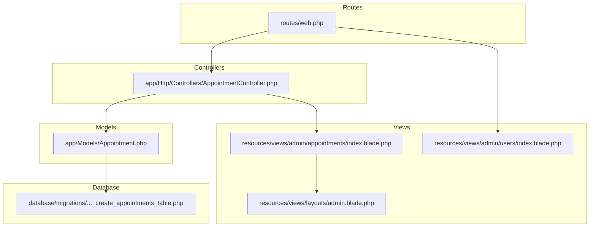
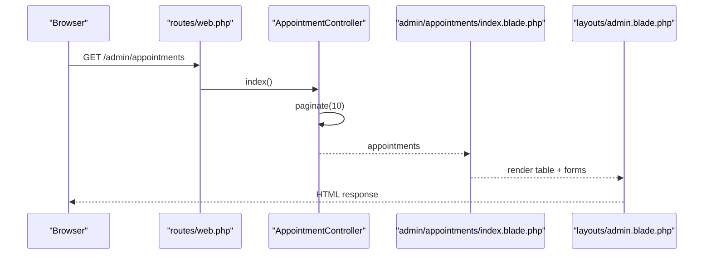
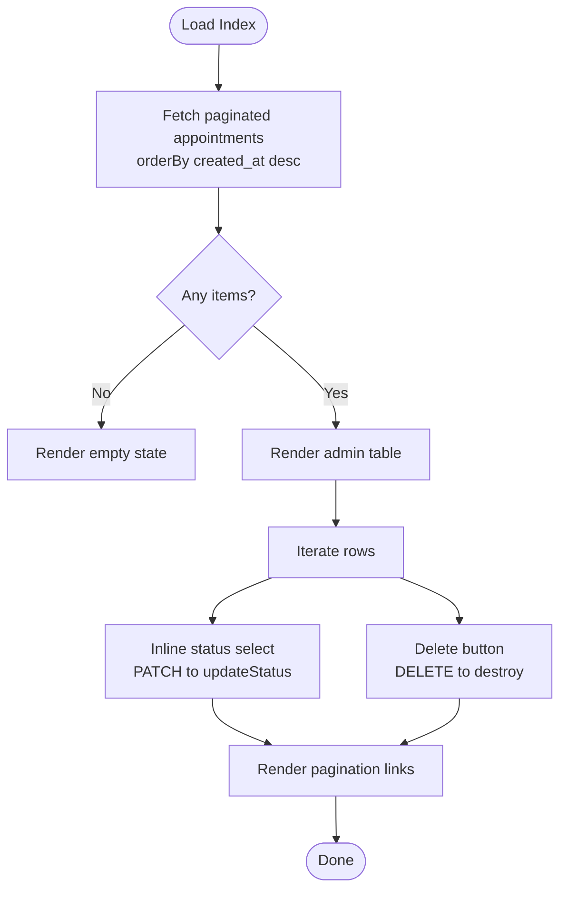
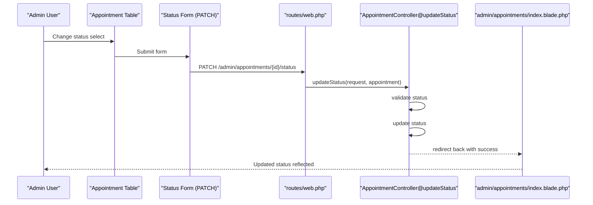
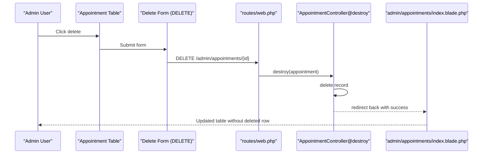
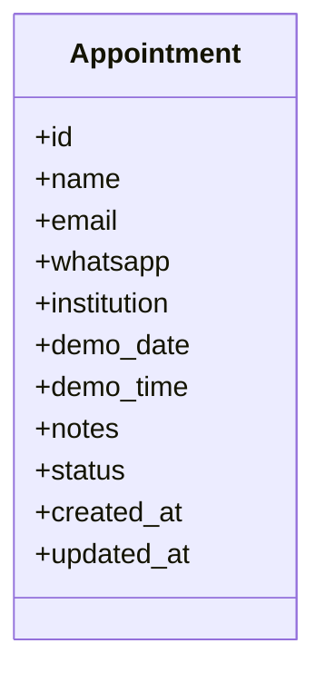
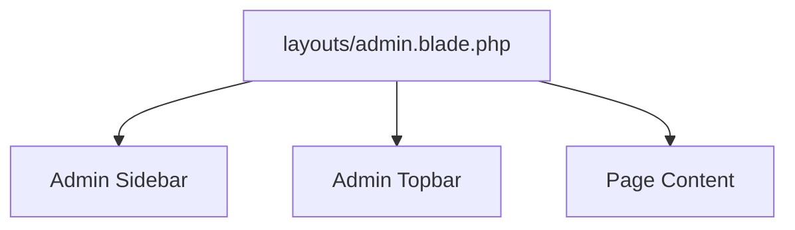
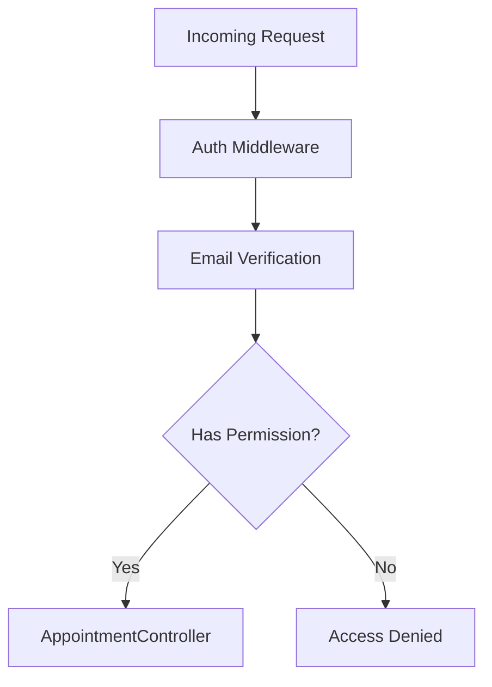
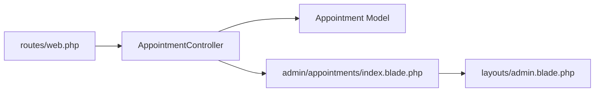

# Administrative Interface

<cite>
**Referenced Files in This Document**
- [AppointmentController.php](file://app/Http/Controllers/AppointmentController.php)
- [index.blade.php](file://resources/views/admin/appointments/index.blade.php)
- [admin.blade.php](file://resources/views/layouts/admin.blade.php)
- [web.php](file://routes/web.php)
- [2026_06_22_024652_create_appointments_table.php](file://database/migrations/2026_06_22_024652_create_appointments_table.php)
- [Appointment.php](file://app/Models/Appointment.php)
- [auth.php](file://config/auth.php)
- [User.php](file://app/Models/User.php)
- [users/index.blade.php](file://resources/views/admin/users/index.blade.php)
- [clinicallog.css](file://resources/css/clinicallog.css)
- [dropdown.blade.php](file://resources/views/components/dropdown.blade.php)
</cite>

## Table of Contents
1. [Introduction](#introduction)
2. [Project Structure](#project-structure)
3. [Core Components](#core-components)
4. [Architecture Overview](#architecture-overview)
5. [Detailed Component Analysis](#detailed-component-analysis)
6. [Dependency Analysis](#dependency-analysis)
7. [Performance Considerations](#performance-considerations)
8. [Troubleshooting Guide](#troubleshooting-guide)
9. [Conclusion](#conclusion)
10. [Appendices](#appendices)

## Introduction
This document describes the administrative interface for managing appointment requests within the CMS dashboard. It covers the appointment listing page, including pagination, sorting, and filtering capabilities; the status update interface; bulk operations; and appointment deletion processes. It also documents the user interface components, data tables, and administrative controls, along with examples for customizing the admin layout, adding search functionality, and implementing export features. Finally, it addresses role-based access control and administrative permissions.

## Project Structure
The administrative interface for appointments is organized around a dedicated controller, Blade views, routing, and a shared admin layout. The data model persists appointment records with status tracking. The admin layout provides navigation, flash messaging, and responsive design.

**Diagram sources**
- [web.php:64-67](file://routes/web.php#L64-L67)
- [AppointmentController.php:9-76](file://app/Http/Controllers/AppointmentController.php#L9-L76)
- [index.blade.php:1-93](file://resources/views/admin/appointments/index.blade.php#L1-L93)
- [admin.blade.php:1-150](file://resources/views/layouts/admin.blade.php#L1-L150)
- [users/index.blade.php:1-63](file://resources/views/admin/users/index.blade.php#L1-L63)
- [Appointment.php:1-20](file://app/Models/Appointment.php#L1-L20)
- [2026_06_22_024652_create_appointments_table.php:14-25](file://database/migrations/2026_06_22_024652_create_appointments_table.php#L14-L25)

**Section sources**
- [web.php:64-67](file://routes/web.php#L64-L67)
- [admin.blade.php:27-97](file://resources/views/layouts/admin.blade.php#L27-L97)

## Core Components
- Appointment listing page: Displays a paginated table of appointment requests with status selection and delete actions per row.
- Status update interface: Inline select-based status updates via PATCH requests.
- Deletion process: Row-level delete actions via DELETE requests.
- Admin layout: Shared sidebar navigation, topbar, and responsive design.
- Data model: Eloquent model with fillable attributes and timestamps.
- Routing: Dedicated admin routes for index, status update, and delete.

Key implementation references:
- Listing and pagination: [index.blade.php:86-88](file://resources/views/admin/appointments/index.blade.php#L86-L88)
- Status update form: [index.blade.php:60-68](file://resources/views/admin/appointments/index.blade.php#L60-L68)
- Delete form: [index.blade.php:71-79](file://resources/views/admin/appointments/index.blade.php#L71-L79)
- Controller actions: [AppointmentController.php:46-75](file://app/Http/Controllers/AppointmentController.php#L46-L75)
- Model definition: [Appointment.php:9-18](file://app/Models/Appointment.php#L9-L18)
- Route definitions: [web.php:64-67](file://routes/web.php#L64-L67)

**Section sources**
- [index.blade.php:22-88](file://resources/views/admin/appointments/index.blade.php#L22-L88)
- [AppointmentController.php:46-75](file://app/Http/Controllers/AppointmentController.php#L46-L75)
- [Appointment.php:9-18](file://app/Models/Appointment.php#L9-L18)
- [web.php:64-67](file://routes/web.php#L64-L67)

## Architecture Overview
The admin appointment management follows a standard MVC pattern with explicit routes and Blade templates. The controller orchestrates data retrieval, validation, and persistence operations, while the view renders the table and interactive controls.

**Diagram sources**
- [web.php:64-67](file://routes/web.php#L64-L67)
- [AppointmentController.php:46-50](file://app/Http/Controllers/AppointmentController.php#L46-L50)
- [index.blade.php:1-93](file://resources/views/admin/appointments/index.blade.php#L1-L93)
- [admin.blade.php:1-150](file://resources/views/layouts/admin.blade.php#L1-L150)

## Detailed Component Analysis

### Appointment Listing Page
- Purpose: Present all appointment requests in a sortable, paginated table with inline status controls and delete actions.
- Data source: Eloquent model with default descending creation order and pagination.
- Controls:
  - Status select per row triggers PATCH to update status.
  - Delete button per row triggers DELETE after confirmation.
  - Pagination links rendered via paginator.
- Styling: Uses shared admin table and glass card classes.

**Diagram sources**
- [AppointmentController.php:46-50](file://app/Http/Controllers/AppointmentController.php#L46-L50)
- [index.blade.php:14-88](file://resources/views/admin/appointments/index.blade.php#L14-L88)

**Section sources**
- [index.blade.php:14-88](file://resources/views/admin/appointments/index.blade.php#L14-L88)
- [AppointmentController.php:46-50](file://app/Http/Controllers/AppointmentController.php#L46-L50)

### Status Update Interface
- Mechanism: Each row contains a form with a select element bound to the status field. Changing the selection submits the form via PATCH.
- Validation: Controller enforces allowed status values.
- Feedback: Redirect with success message.

**Diagram sources**
- [index.blade.php:60-68](file://resources/views/admin/appointments/index.blade.php#L60-L68)
- [web.php:66-66](file://routes/web.php#L66-L66)
- [AppointmentController.php:55-66](file://app/Http/Controllers/AppointmentController.php#L55-L66)

**Section sources**
- [index.blade.php:60-68](file://resources/views/admin/appointments/index.blade.php#L60-L68)
- [AppointmentController.php:55-66](file://app/Http/Controllers/AppointmentController.php#L55-L66)

### Bulk Operations
- Current state: No bulk operation UI exists on the listing page.
- Recommended approach:
  - Add checkboxes per row.
  - Provide a dropdown or toolbar with actions (e.g., “Update status”, “Delete”).
  - Implement a controller action to handle batch updates/deletes with validation and CSRF protection.
  - Use a single form with hidden inputs or AJAX to send selected IDs.

[No sources needed since this section proposes enhancements not currently present in the codebase]

### Appointment Deletion Process
- Mechanism: Each row includes a delete button that posts a DELETE request to the destroy route.
- Confirmation: JavaScript confirmation dialog prompts for user consent.
- Behavior: On success, redirects back with a success message.

**Diagram sources**
- [index.blade.php:71-79](file://resources/views/admin/appointments/index.blade.php#L71-L79)
- [web.php:67-67](file://routes/web.php#L67-L67)
- [AppointmentController.php:71-75](file://app/Http/Controllers/AppointmentController.php#L71-L75)

**Section sources**
- [index.blade.php:71-79](file://resources/views/admin/appointments/index.blade.php#L71-L79)
- [AppointmentController.php:71-75](file://app/Http/Controllers/AppointmentController.php#L71-L75)

### Data Model and Persistence
- Model: Eloquent model with fillable attributes for appointment fields and default timestamps.
- Migration: Defines the appointments table with status default set to pending.

**Diagram sources**
- [Appointment.php:9-18](file://app/Models/Appointment.php#L9-L18)
- [2026_06_22_024652_create_appointments_table.php:14-25](file://database/migrations/2026_06_22_024652_create_appointments_table.php#L14-L25)

**Section sources**
- [Appointment.php:9-18](file://app/Models/Appointment.php#L9-L18)
- [2026_06_22_024652_create_appointments_table.php:14-25](file://database/migrations/2026_06_22_024652_create_appointments_table.php#L14-L25)

### Administrative Controls and Layout
- Navigation: Sidebar includes links to dashboard, landing page, appointments, users, and external website preview.
- Topbar: Page title and subtitle; flash success/error messages.
- Components: Reusable Blade components such as dropdowns support advanced UI patterns.

**Diagram sources**
- [admin.blade.php:27-128](file://resources/views/layouts/admin.blade.php#L27-L128)
- [dropdown.blade.php:1-36](file://resources/views/components/dropdown.blade.php#L1-L36)

**Section sources**
- [admin.blade.php:27-128](file://resources/views/layouts/admin.blade.php#L27-L128)
- [dropdown.blade.php:1-36](file://resources/views/components/dropdown.blade.php#L1-L36)

### Sorting and Filtering Capabilities
- Sorting: The listing orders by created_at descending by default.
- Filtering: No server-side filters are implemented on the listing page.
- Recommendations:
  - Add query parameters for date range, status, and institution search.
  - Extend controller index method to accept filters and apply Eloquent scopes or where clauses.
  - Update the view to preserve filter state in the URL and render filter inputs.

[No sources needed since this section proposes enhancements not currently present in the codebase]

### Search Functionality
- Current state: No dedicated search UI exists on the appointment listing page.
- Implementation ideas:
  - Add a search input that triggers a filtered index action.
  - Use LIKE queries or full-text search depending on database capabilities.
  - Maintain pagination and sorting alongside filters.

[No sources needed since this section proposes enhancements not currently present in the codebase]

### Export Features
- Current state: No export functionality is implemented.
- Implementation ideas:
  - Add export buttons (CSV, XLSX) that trigger a controller action to generate downloadable files.
  - Apply filters and pagination limits to exports.
  - Consider background jobs for large datasets.

[No sources needed since this section proposes enhancements not currently present in the codebase]

### Role-Based Access Control and Permissions
- Authentication: Routes are protected by auth middleware groups.
- Guard and provider: Default session-based guard with Eloquent user provider.
- Recommendation: Introduce roles/permissions (e.g., Administrator, Editor) and gate/policy checks for appointment management routes.

**Diagram sources**
- [web.php:37-74](file://routes/web.php#L37-L74)
- [auth.php:40-44](file://config/auth.php#L40-L44)
- [User.php:15-32](file://app/Models/User.php#L15-L32)

**Section sources**
- [web.php:37-74](file://routes/web.php#L37-L74)
- [auth.php:40-44](file://config/auth.php#L40-L44)
- [User.php:15-32](file://app/Models/User.php#L15-L32)

## Dependency Analysis
- Controller depends on the Appointment model and uses Laravel’s request validation and redirect helpers.
- Views depend on the shared admin layout and CSS classes for consistent styling.
- Routes bind controller actions to URLs for listing, updating status, and deleting.

**Diagram sources**
- [AppointmentController.php:7-7](file://app/Http/Controllers/AppointmentController.php#L7-L7)
- [Appointment.php:7-18](file://app/Models/Appointment.php#L7-L18)
- [index.blade.php:1-93](file://resources/views/admin/appointments/index.blade.php#L1-L93)
- [admin.blade.php:1-150](file://resources/views/layouts/admin.blade.php#L1-L150)
- [web.php:64-67](file://routes/web.php#L64-L67)

**Section sources**
- [AppointmentController.php:7-7](file://app/Http/Controllers/AppointmentController.php#L7-L7)
- [index.blade.php:1-93](file://resources/views/admin/appointments/index.blade.php#L1-L93)
- [web.php:64-67](file://routes/web.php#L64-L67)

## Performance Considerations
- Pagination: Already paginated; keep per-page count reasonable (e.g., 10–50).
- Selective fields: Consider selecting only needed columns for large lists.
- Indexes: Ensure appropriate database indexes on frequently filtered/sorted columns (e.g., status, created_at).
- Rendering: Minimize heavy computations inside Blade loops; precompute values in the controller.

[No sources needed since this section provides general guidance]

## Troubleshooting Guide
- Status update fails:
  - Verify allowed status values and route binding.
  - Check CSRF token presence in forms.
- Delete confirmation not working:
  - Confirm JavaScript confirmation is enabled and form method override is present.
- Pagination not visible:
  - Ensure the paginator instance is passed to the view and links are rendered.
- Flash messages not shown:
  - Confirm redirect with success or error session keys.

**Section sources**
- [index.blade.php:60-79](file://resources/views/admin/appointments/index.blade.php#L60-L79)
- [AppointmentController.php:55-75](file://app/Http/Controllers/AppointmentController.php#L55-L75)

## Conclusion
The administrative interface for managing appointment requests is centered on a clean, paginated table with inline status updates and row-level deletion. The current implementation provides a solid foundation for administrators to monitor and act on appointment requests. Enhancements such as bulk operations, filtering, search, and export would further improve operational efficiency. Role-based access control should be introduced to enforce permissions on sensitive actions.

[No sources needed since this section summarizes without analyzing specific files]

## Appendices

### UI Components and Styling References
- Admin layout and navigation: [admin.blade.php:27-128](file://resources/views/layouts/admin.blade.php#L27-L128)
- Admin table styles: [clinicallog.css:715-729](file://resources/css/clinicallog.css#L715-L729)
- Dropdown component: [dropdown.blade.php:1-36](file://resources/views/components/dropdown.blade.php#L1-L36)
- Users listing for comparison: [users/index.blade.php:1-63](file://resources/views/admin/users/index.blade.php#L1-L63)

**Section sources**
- [admin.blade.php:27-128](file://resources/views/layouts/admin.blade.php#L27-L128)
- [clinicallog.css:715-729](file://resources/css/clinicallog.css#L715-L729)
- [dropdown.blade.php:1-36](file://resources/views/components/dropdown.blade.php#L1-L36)
- [users/index.blade.php:1-63](file://resources/views/admin/users/index.blade.php#L1-L63)