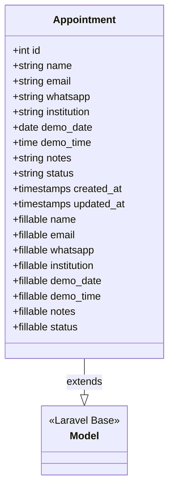
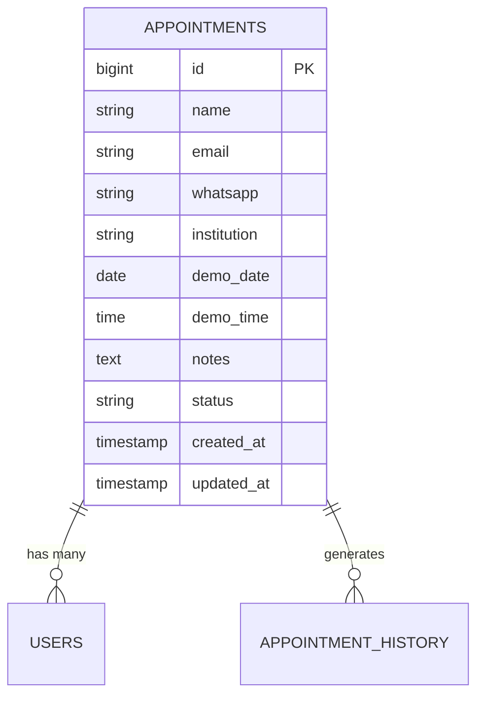
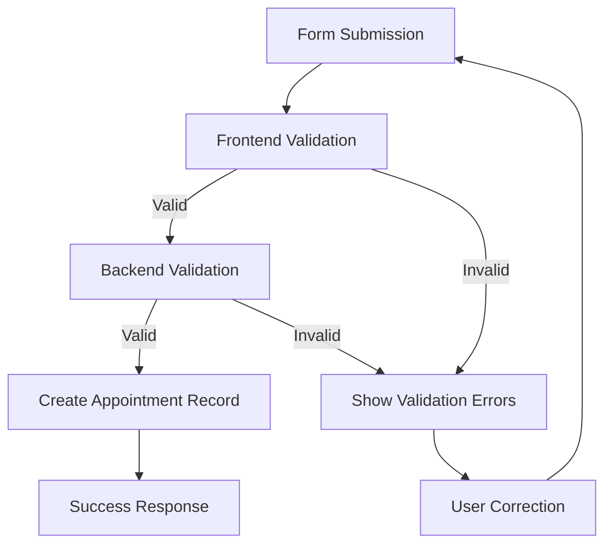
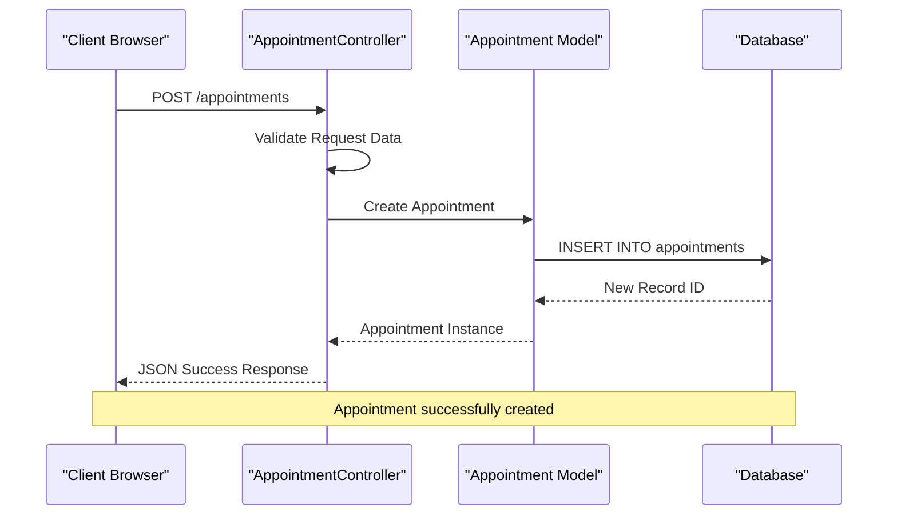
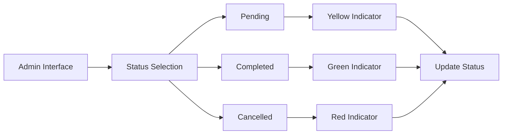

# Appointment Data Model

<cite>
**Referenced Files in This Document**
- [Appointment.php](file://app/Models/Appointment.php)
- [2026_06_22_024652_create_appointments_table.php](file://database/migrations/2026_06_22_024652_create_appointments_table.php)
- [AppointmentController.php](file://app/Http/Controllers/AppointmentController.php)
- [web.php](file://routes/web.php)
- [index.blade.php](file://resources/views/admin/appointments/index.blade.php)
- [app.blade.php](file://resources/views/layouts/app.blade.php)
</cite>

## Table of Contents
1. [Introduction](#introduction)
2. [Model Architecture](#model-architecture)
3. [Database Schema](#database-schema)
4. [Field Specifications](#field-specifications)
5. [Validation Rules](#validation-rules)
6. [Controller Implementation](#controller-implementation)
7. [Admin Interface](#admin-interface)
8. [Query Examples](#query-examples)
9. [Data Lifecycle Management](#data-lifecycle-management)
10. [Performance Considerations](#performance-considerations)
11. [Troubleshooting Guide](#troubleshooting-guide)
12. [Conclusion](#conclusion)

## Introduction

The Appointment data model represents demo appointment requests in the ClinicalLog CMS system. This model manages customer appointment scheduling for product demonstrations, tracking contact information, scheduling preferences, and appointment status. The system handles appointment creation through both frontend forms and administrative interfaces, with comprehensive validation and status management capabilities.

## Model Architecture

The Appointment model is a standard Laravel Eloquent model that extends the base Model class. It implements basic CRUD operations through Laravel's built-in ORM capabilities without requiring additional relationships or complex configurations.



**Diagram sources**
- [Appointment.php:7-19](file://app/Models/Appointment.php#L7-L19)

**Section sources**
- [Appointment.php:1-20](file://app/Models/Appointment.php#L1-L20)

## Database Schema

The appointments table follows Laravel's conventional naming and structure patterns, implementing a straightforward schema optimized for appointment management.



**Diagram sources**
- [2026_06_22_024652_create_appointments_table.php:14-25](file://database/migrations/2026_06_22_024652_create_appointments_table.php#L14-L25)

**Section sources**
- [2026_06_22_024652_create_appointments_table.php:1-35](file://database/migrations/2026_06_22_024652_create_appointments_table.php#L1-L35)

## Field Specifications

### Required Fields
- **name**: String field with maximum 255 characters, required for all appointments
- **email**: Email validation with maximum 255 characters, required for contact identification
- **whatsapp**: String field with maximum 25 characters, required for communication
- **institution**: String field with maximum 255 characters, required for organizational context

### Scheduling Fields
- **demo_date**: Date field with minimum date validation set to current day or future dates
- **demo_time**: String field representing scheduled time (format: HH:MM)

### Optional Fields
- **notes**: Text field with maximum 1000 characters, nullable for additional information

### Status Management
- **status**: String field with default value 'pending', accepts only predefined values

**Section sources**
- [Appointment.php:9-18](file://app/Models/Appointment.php#L9-L18)
- [2026_06_22_024652_create_appointments_table.php:16-23](file://database/migrations/2026_06_22_024652_create_appointments_table.php#L16-L23)

## Validation Rules

The system implements comprehensive validation at multiple levels to ensure data integrity and user experience.

### Frontend Validation
- Real-time form validation through HTML5 attributes
- JavaScript validation with user feedback
- Minimum date restriction for demo_date field

### Backend Validation
- Strict server-side validation in the AppointmentController
- Comprehensive rule enforcement for all appointment fields
- Status validation with predefined acceptable values



**Diagram sources**
- [AppointmentController.php:16-24](file://app/Http/Controllers/AppointmentController.php#L16-L24)
- [app.blade.php:242](file://resources/views/layouts/app.blade.php#L242)

**Section sources**
- [AppointmentController.php:14-41](file://app/Http/Controllers/AppointmentController.php#L14-L41)
- [app.blade.php:214-255](file://resources/views/layouts/app.blade.php#L214-L255)

## Controller Implementation

The AppointmentController provides comprehensive CRUD operations for managing appointment records through RESTful endpoints.

### Primary Operations

#### Store Operation
Handles new appointment creation with complete validation and automatic status assignment.

#### Index Operation  
Provides paginated listing of appointments ordered by creation date for administrative review.

#### Update Status Operation
Manages appointment status changes with strict validation against predefined status values.

#### Destroy Operation
Handles appointment deletion with proper cleanup procedures.



**Diagram sources**
- [AppointmentController.php:14-41](file://app/Http/Controllers/AppointmentController.php#L14-L41)
- [web.php:26](file://routes/web.php#L26)

**Section sources**
- [AppointmentController.php:9-77](file://app/Http/Controllers/AppointmentController.php#L9-L77)
- [web.php:64-67](file://routes/web.php#L64-L67)

## Admin Interface

The administrative interface provides comprehensive management capabilities for appointment oversight and status management.

### Dashboard Features
- Paginated appointment listing with 10 items per page
- Real-time status filtering and updates
- Contact information display with quick communication links
- Date and time formatting for improved readability
- Responsive design supporting various screen sizes

### Status Management
Dynamic status selection with visual indicators:
- Pending: Yellow status with warning styling
- Completed: Green status with success styling  
- Cancelled: Red status with error styling



**Diagram sources**
- [index.blade.php:59-69](file://resources/views/admin/appointments/index.blade.php#L59-L69)

**Section sources**
- [index.blade.php:1-93](file://resources/views/admin/appointments/index.blade.php#L1-L93)

## Query Examples

### Basic Queries

#### Get All Appointments
```php
// Returns paginated results ordered by newest first
$appointments = Appointment::orderBy('created_at', 'desc')->paginate(10);
```

#### Filter by Status
```php
// Get pending appointments only
$pending = Appointment::where('status', 'pending')->get();

// Get completed or cancelled appointments
$completed = Appointment::whereIn('status', ['done', 'cancelled'])->get();
```

#### Date Range Queries
```php
// Get appointments for today
$todays = Appointment::whereDate('demo_date', today())->get();

// Get appointments for next 7 days
$future = Appointment::whereBetween('demo_date', [today(), today()->addDays(7)])->get();
```

#### Search Operations
```php
// Search by institution name
$search = Appointment::where('institution', 'LIKE', '%clinic%')->get();

// Search by contact information
$contactSearch = Appointment::where('email', 'LIKE', '%@hospital.com%')
                           ->orWhere('whatsapp', 'LIKE', '%628%')
                           ->get();
```

**Section sources**
- [AppointmentController.php:46-50](file://app/Http/Controllers/AppointmentController.php#L46-L50)

## Data Lifecycle Management

### Creation Process
1. **Form Submission**: User submits appointment request via landing page
2. **Validation**: Dual-layer validation (frontend + backend)
3. **Status Assignment**: Automatic 'pending' status assignment
4. **Storage**: Record persistence in database
5. **Response**: Confirmation message to user

### Status Management
The system maintains four distinct states:
- **pending**: Initial state after submission
- **done**: Appointment completed successfully
- **cancelled**: Appointment terminated by user/admin
- **deleted**: Permanently removed records

### Deletion Handling
The current implementation uses standard soft delete behavior through Laravel's Eloquent model, allowing for potential restoration of deleted records if needed.

**Section sources**
- [AppointmentController.php:55-76](file://app/Http/Controllers/AppointmentController.php#L55-L76)
- [2026_06_22_024652_create_appointments_table.php:23](file://database/migrations/2026_06_22_024652_create_appointments_table.php#L23)

## Performance Considerations

### Database Optimization
- **Index Strategy**: No explicit indexes defined; consider adding indexes for frequently queried fields
- **Pagination**: Built-in pagination reduces memory usage for large datasets
- **Query Efficiency**: Simple queries with minimal joins for optimal performance

### Frontend Performance
- **AJAX Submission**: Asynchronous form submission prevents page reloads
- **Client-Side Validation**: Reduces server load through early validation
- **Responsive Design**: Optimized for mobile and desktop experiences

### Scalability Recommendations
- Implement database indexes for `demo_date` and `status` fields
- Add composite indexes for common query patterns
- Consider partitioning for historical data management
- Implement caching for frequently accessed appointment statistics

## Troubleshooting Guide

### Common Issues

#### Validation Errors
- **Email Format**: Ensure proper email address format
- **Date Validation**: Verify demo_date is not in the past
- **Phone Number**: Check whatsapp number format (international standards)
- **Character Limits**: Monitor field length restrictions

#### Status Update Failures
- **Invalid Status Values**: Only 'pending', 'done', 'cancelled' are accepted
- **Permission Issues**: Ensure administrative access for status changes
- **Concurrent Updates**: Handle race conditions in high-traffic scenarios

#### Display Issues
- **Time Formatting**: Verify demo_time displays correctly (HH:MM format)
- **Date Localization**: Check date formatting for different locales
- **Mobile Responsiveness**: Test on various device sizes

### Debug Procedures
1. **Enable Logging**: Check Laravel logs for validation errors
2. **Database Inspection**: Verify record creation in database
3. **Frontend Console**: Monitor JavaScript errors in browser console
4. **Network Analysis**: Inspect API responses for error details

**Section sources**
- [AppointmentController.php:57-59](file://app/Http/Controllers/AppointmentController.php#L57-L59)
- [app.blade.php:345-390](file://resources/views/layouts/app.blade.php#L345-L390)

## Conclusion

The Appointment data model provides a robust foundation for managing demo appointment requests in the ClinicalLog CMS system. Its clean architecture, comprehensive validation, and intuitive administrative interface support efficient appointment management workflows. The model's simplicity enables easy maintenance while providing sufficient flexibility for current operational needs.

Key strengths include:
- **Clean Implementation**: Minimal code with maximum functionality
- **Comprehensive Validation**: Multi-layer validation ensures data quality
- **Intuitive Interface**: User-friendly administrative controls
- **Scalable Design**: Foundation supports future enhancements

Future enhancements could include advanced search capabilities, automated notification systems, and enhanced reporting features to further improve the appointment management experience.