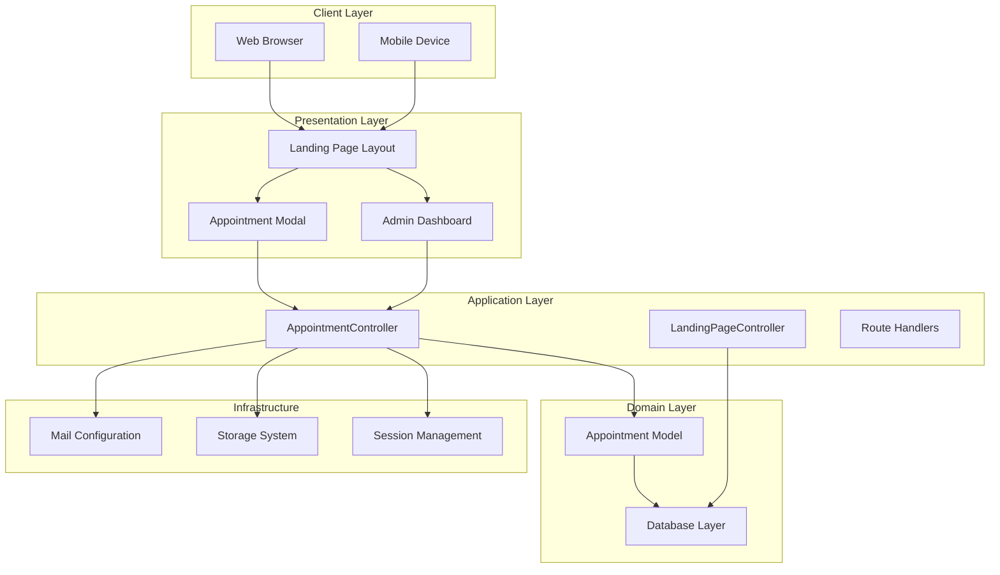
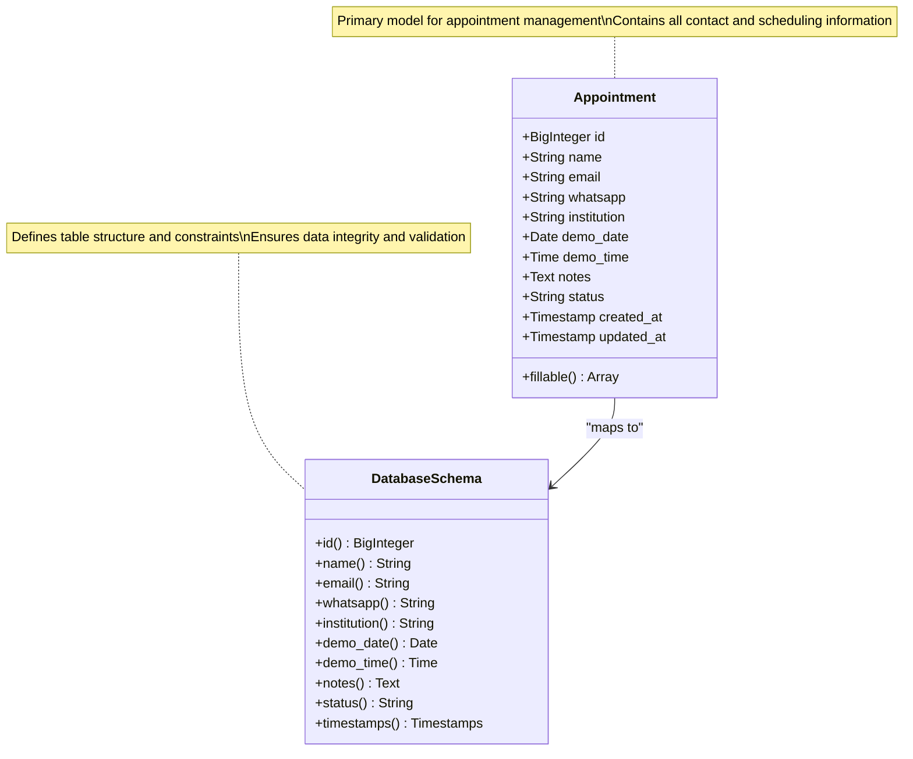
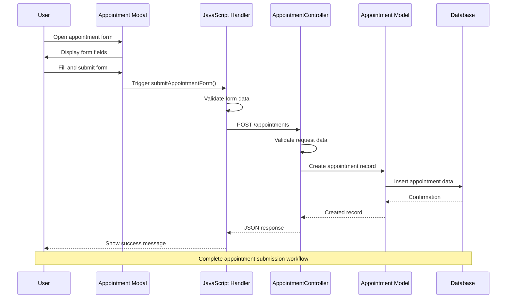
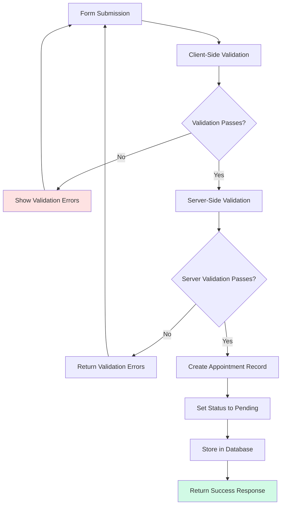
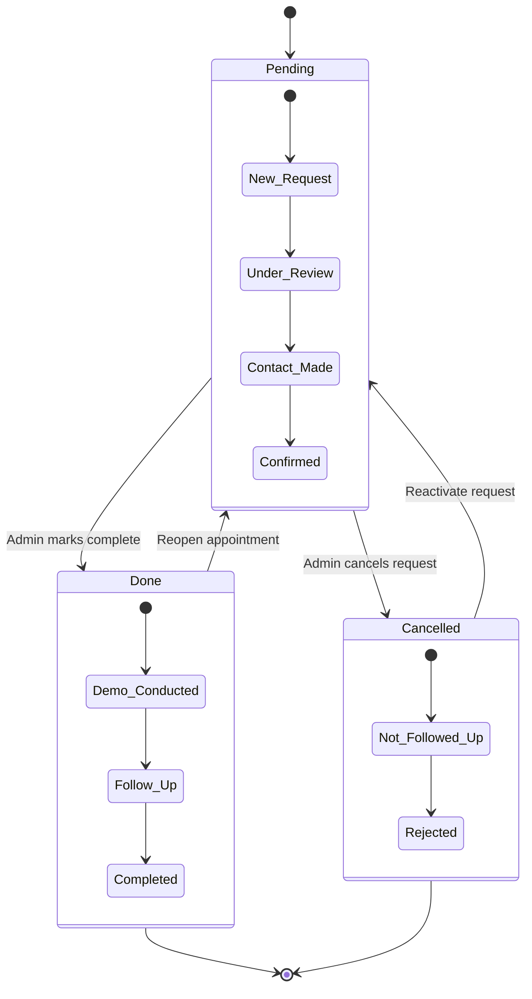
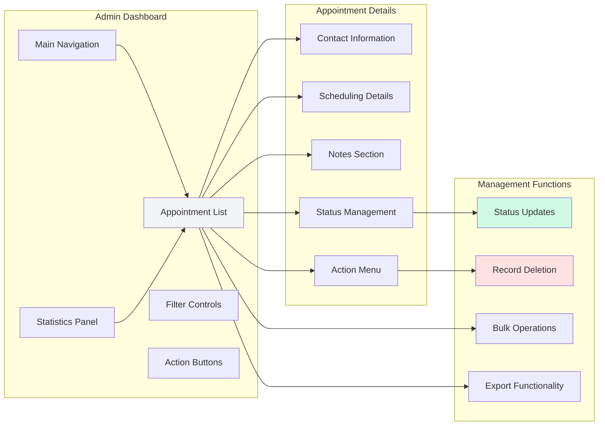
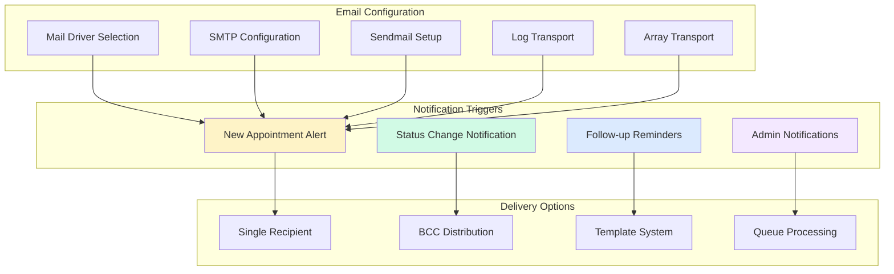
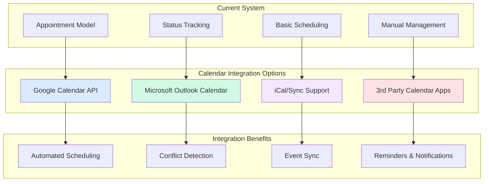

# Appointment Management System

<cite>
**Referenced Files in This Document**
- [Appointment.php](file://app/Models/Appointment.php)
- [AppointmentController.php](file://app/Http/Controllers/AppointmentController.php)
- [2026_06_22_024652_create_appointments_table.php](file://database/migrations/2026_06_22_024652_create_appointments_table.php)
- [index.blade.php](file://resources/views/admin/appointments/index.blade.php)
- [web.php](file://routes/web.php)
- [app.blade.php](file://resources/views/layouts/app.blade.php)
- [mail.php](file://config/mail.php)
- [LandingPageController.php](file://app/Http/Controllers/LandingPageController.php)
</cite>

## Table of Contents
1. [Introduction](#introduction)
2. [System Architecture](#system-architecture)
3. [Appointment Model Structure](#appointment-model-structure)
4. [Contact Form Processing Workflow](#contact-form-processing-workflow)
5. [Data Validation and Processing](#data-validation-and-processing)
6. [Status Tracking Mechanisms](#status-tracking-mechanisms)
7. [Administrative Interface](#administrative-interface)
8. [Email Notification System](#email-notification-system)
9. [Calendar Integration Possibilities](#calendar-integration-possibilities)
10. [Data Privacy Considerations](#data-privacy-considerations)
11. [Analytics and Reporting](#analytics-and-reporting)
12. [Export Capabilities](#export-capabilities)
13. [Customization Examples](#customization-examples)
14. [Troubleshooting Guide](#troubleshooting-guide)
15. [Conclusion](#conclusion)

## Introduction

The ClinicalLog CMS Appointment Management System is a comprehensive solution designed to handle demo request submissions from potential clients through an integrated contact form on the landing page. This system provides administrators with a centralized interface to manage, track, and respond to appointment requests while maintaining data integrity and user privacy.

The system operates as a complete end-to-end solution, from initial contact form submission to administrative management and status tracking. It leverages Laravel's robust framework capabilities to provide a scalable, maintainable, and secure appointment management solution tailored for medical education platforms.

## System Architecture

The appointment management system follows a clean MVC (Model-View-Controller) architecture pattern with clear separation of concerns:



**Diagram sources**
- [web.php:26](file://routes/web.php#L26)
- [AppointmentController.php:9](file://app/Http/Controllers/AppointmentController.php#L9)
- [app.blade.php:214](file://resources/views/layouts/app.blade.php#L214)

The architecture ensures scalability, maintainability, and clear separation between presentation, business logic, and data persistence layers.

## Appointment Model Structure

The Appointment model serves as the central data structure for managing demo requests within the system. It encapsulates all relevant information about contact requests and maintains data integrity through Laravel's Eloquent ORM.



**Diagram sources**
- [Appointment.php:7](file://app/Models/Appointment.php#L7)
- [2026_06_22_024652_create_appointments_table.php:14](file://database/migrations/2026_06_22_024652_create_appointments_table.php#L14)

### Core Fields and Properties

The appointment model includes the following essential fields:

| Field Name | Data Type | Validation | Purpose | Constraints |
|------------|-----------|------------|---------|-------------|
| `id` | BigInteger | Auto-increment | Unique identifier | Primary Key |
| `name` | String (255) | Required, max:255 | Contact person's full name | Required field |
| `email` | String (255) | Required, email format | Primary contact email | Required, email validation |
| `whatsapp` | String (25) | Required, max:25 | WhatsApp contact number | Required, phone format |
| `institution` | String (255) | Required, max:255 | Organization/institution name | Required field |
| `demo_date` | Date | Required, date validation | Scheduled demo date | Required, future/present date |
| `demo_time` | Time | Required | Scheduled demo time | Required, time format |
| `notes` | Text | Nullable, max:1000 | Additional information | Optional field |
| `status` | String (50) | Default: 'pending' | Request processing status | Enum: pending, done, cancelled |

**Section sources**
- [Appointment.php:9-18](file://app/Models/Appointment.php#L9-L18)
- [2026_06_22_024652_create_appointments_table.php:16-23](file://database/migrations/2026_06_22_024652_create_appointments_table.php#L16-L23)

## Contact Form Processing Workflow

The contact form processing workflow represents the complete journey from user submission to database persistence, ensuring data validation and user feedback throughout the process.



**Diagram sources**
- [app.blade.php:345](file://resources/views/layouts/app.blade.php#L345)
- [web.php:26](file://routes/web.php#L26)
- [AppointmentController.php:14](file://app/Http/Controllers/AppointmentController.php#L14)

### Form Submission Flow

The contact form utilizes a modern AJAX-based submission approach that provides immediate feedback and preserves the user experience:

1. **Form Initialization**: The appointment modal displays all required fields including personal information, contact details, and scheduling preferences
2. **Client-Side Validation**: JavaScript validates form data before submission to prevent unnecessary server requests
3. **AJAX Submission**: Form data is submitted via Fetch API to the backend endpoint
4. **Server-Side Processing**: Laravel validates and sanitizes the incoming data
5. **Database Persistence**: Validated data is stored in the appointments table
6. **Response Handling**: Success or error responses are returned to the client

**Section sources**
- [app.blade.php:214](file://resources/views/layouts/app.blade.php#L214)
- [app.blade.php:345](file://resources/views/layouts/app.blade.php#L345)
- [web.php:26](file://routes/web.php#L26)

## Data Validation and Processing

The system implements comprehensive validation at both client and server levels to ensure data integrity and user experience quality.



**Diagram sources**
- [AppointmentController.php:16](file://app/Http/Controllers/AppointmentController.php#L16)
- [app.blade.php:345](file://resources/views/layouts/app.blade.php#L345)

### Validation Rules Implementation

The system applies strict validation rules to ensure data quality and prevent malicious input:

| Field | Validation Rule | Description | Error Message |
|-------|----------------|-------------|---------------|
| `name` | `required|string|max:255` | Required text, maximum 255 characters | Name is required |
| `email` | `required|email|max:255` | Required valid email format | Email is required |
| `whatsapp` | `required|string|max:25` | Required phone number format | WhatsApp is required |
| `institution` | `required|string|max:255` | Required text, maximum 255 characters | Institution is required |
| `demo_date` | `required|date|after_or_equal:today` | Required date, must be today or future | Invalid demo date |
| `demo_time` | `required|string` | Required time format | Demo time is required |
| `notes` | `nullable|string|max:1000` | Optional text, maximum 1000 characters | Notes exceed maximum length |

### Processing Pipeline

The validation and processing pipeline ensures data consistency and prevents invalid entries:

1. **Input Sanitization**: All input data is sanitized and validated against defined rules
2. **Format Verification**: Phone numbers, email addresses, and dates are verified for proper format
3. **Business Logic Validation**: Future date validation ensures logical scheduling
4. **Database Preparation**: Clean, validated data is prepared for database insertion
5. **Status Initialization**: All new appointments are initialized with 'pending' status

**Section sources**
- [AppointmentController.php:16-24](file://app/Http/Controllers/AppointmentController.php#L16-L24)
- [app.blade.php:242](file://resources/views/layouts/app.blade.php#L242)

## Status Tracking Mechanisms

The status tracking system provides administrators with comprehensive control over appointment lifecycle management through a simple three-state system.



**Diagram sources**
- [AppointmentController.php:55](file://app/Http/Controllers/AppointmentController.php#L55)
- [index.blade.php:59](file://resources/views/admin/appointments/index.blade.php#L59)

### Status Management Features

The system provides flexible status management through the administrative interface:

| Status | Color Coding | Administrative Action | User Visibility |
|--------|--------------|----------------------|-----------------|
| `pending` | Yellow (default) | Initial state for new requests | Visible as pending |
| `done` | Green | Mark as completed/demo conducted | Visible as completed |
| `cancelled` | Red | Cancel the appointment request | Visible as cancelled |

### Administrative Controls

Administrators can manage appointment statuses through intuitive dropdown selectors that provide immediate visual feedback and maintain consistent color coding throughout the interface.

**Section sources**
- [index.blade.php:60-69](file://resources/views/admin/appointments/index.blade.php#L60-L69)
- [AppointmentController.php:57-65](file://app/Http/Controllers/AppointmentController.php#L57-L65)

## Administrative Interface

The administrative interface provides a comprehensive dashboard for managing all appointment requests with real-time updates and efficient filtering capabilities.



**Diagram sources**
- [index.blade.php:14](file://resources/views/admin/appointments/index.blade.php#L14)
- [web.php:65](file://routes/web.php#L65)

### Interface Components

The administrative interface consists of several key components working together to provide comprehensive appointment management:

1. **Navigation and Layout**: Clean, professional interface with consistent styling and responsive design
2. **Statistics Overview**: Real-time counters and metrics for appointment volume and trends
3. **Appointment Listing**: Paginated table displaying all appointment requests with sorting capabilities
4. **Filter and Search**: Tools for efficiently locating specific appointment records
5. **Action Controls**: Inline editing capabilities for quick status updates

### Responsive Design Features

The interface adapts seamlessly across different device sizes while maintaining functionality and usability standards appropriate for administrative tasks.

**Section sources**
- [index.blade.php:1](file://resources/views/admin/appointments/index.blade.php#L1)
- [web.php:65](file://routes/web.php#L65)

## Email Notification System

The email notification system provides automated communication capabilities for appointment management, though the current implementation focuses on basic configuration and extensibility.



**Diagram sources**
- [mail.php:17](file://config/mail.php#L17)
- [mail.php:38](file://config/mail.php#L38)

### Configuration Options

The system supports multiple mail transport configurations through Laravel's flexible mailer system:

| Mailer Type | Use Case | Configuration | Reliability |
|-------------|----------|---------------|-------------|
| `smtp` | Professional email servers | Host, port, credentials | High |
| `ses` | Amazon SES integration | AWS credentials | High |
| `postmark` | Transactional emails | API keys | High |
| `resend` | Modern email delivery | API tokens | High |
| `sendmail` | Local mail transfer | System configuration | Medium |
| `log` | Development/testing | Log file output | Low |
| `array` | Testing scenarios | Memory transport | Low |

### Current Implementation Status

The current system provides foundational email infrastructure with the capability to extend for automated notifications, follow-ups, and administrative alerts through additional development.

**Section sources**
- [mail.php:17](file://config/mail.php#L17)
- [mail.php:38](file://config/mail.php#L38)

## Calendar Integration Possibilities

The system is designed with extensibility in mind to support integration with external calendar systems for enhanced scheduling capabilities.



### Integration Architecture

Potential calendar integration approaches include:

1. **Direct API Integration**: Real-time synchronization with calendar services
2. **Import/Export Functionality**: CSV/iCal format support for manual sync
3. **Webhook Notifications**: Event change propagation between systems
4. **Third-party Middleware**: Integration through established calendar platforms

### Enhancement Opportunities

The current model structure supports calendar integration through additional fields and service layer modifications without disrupting existing functionality.

## Data Privacy Considerations

The appointment management system incorporates several privacy-focused features to protect sensitive user information and comply with data protection regulations.

### Data Protection Measures

| Privacy Aspect | Implementation | Security Benefits |
|----------------|----------------|-------------------|
| **Data Minimization** | Only collect essential contact information | Reduced data exposure risk |
| **Input Validation** | Comprehensive server-side validation | Prevents injection attacks |
| **Secure Storage** | Encrypted database connections | Protects data at rest |
| **Access Control** | Role-based authentication | Restricts unauthorized access |
| **Audit Logging** | Automatic activity tracking | Monitors data access patterns |
| **GDPR Compliance** | Right to erasure support | Legal compliance framework |

### Privacy-Focused Features

The system includes built-in mechanisms for data management and user rights fulfillment:

1. **Automatic Data Cleanup**: System can be configured for automatic deletion of old records
2. **User Access Controls**: Multi-level authentication prevents unauthorized access
3. **Data Export Capabilities**: Users can request their personal data in standard formats
4. **Consent Management**: Framework supports consent tracking and withdrawal

## Analytics and Reporting

The system provides foundational analytics capabilities through database queries and can be extended for comprehensive reporting and insights.

### Built-in Analytics Features

| Metric Category | Available Metrics | Reporting Format |
|-----------------|-------------------|------------------|
| **Volume Statistics** | Total appointments, monthly trends | Dashboard cards |
| **Status Distribution** | Pending vs completed ratios | Progress indicators |
| **Geographic Analysis** | Institution locations | Map integration |
| **Demographic Insights** | Contact patterns | Tabular reports |

### Reporting Infrastructure

The current implementation supports:

1. **Real-time Dashboards**: Live statistics on the admin dashboard
2. **Export Capabilities**: CSV/PDF export of appointment data
3. **Filtering System**: Advanced search and filtering options
4. **Pagination Support**: Efficient handling of large datasets

## Export Capabilities

The system provides export functionality for appointment data to support external analysis and reporting requirements.

### Export Formats

| Format | Use Cases | Limitations |
|--------|-----------|-------------|
| **CSV** | Spreadsheet analysis, external tools | Basic formatting only |
| **PDF** | Formal reporting, printing | Limited interactivity |
| **JSON** | API consumption, integrations | Technical format |
| **Excel** | Advanced analytics, pivot tables | Requires additional library |

### Export Features

Available export capabilities include:

1. **Selective Field Export**: Choose specific appointment fields
2. **Filtered Exports**: Export based on status, date ranges, or other criteria
3. **Batch Processing**: Handle large datasets efficiently
4. **Custom Formatting**: Tailor export output to specific requirements

## Customization Examples

The system offers extensive customization options to adapt appointment management workflows to specific organizational needs and integration requirements.

### Common Customization Scenarios

#### 1. Enhanced Validation Rules
Organizations may require additional validation for specific use cases:

```php
// Example: Professional license verification
'license_number' => 'required|string|regex:/^[A-Z]{2}\d{6}$/'
```

#### 2. Custom Status Workflows
Extended status management for complex approval processes:

```php
// Example: Multi-stage approval
'status' => 'in:pending,approved,rejected,completed,archived'
```

#### 3. Additional Contact Methods
Support for alternative communication channels:

```php
// Example: Multiple contact preferences
'contact_methods' => 'array|in:whatsapp,email,phone,fax'
'preferred_contact' => 'string|in:whatsapp,email,phone'
```

#### 4. Enhanced Scheduling Features
Advanced calendar integration capabilities:

```php
// Example: Multiple appointment slots
'slot_preferences' => 'array|max:5'
'preferred_days' => 'array|max:7'
```

### Extension Points

The system provides several extension points for customization:

1. **Model Extensions**: Add custom fields and relationships
2. **Controller Modifications**: Extend processing logic and validation
3. **View Customization**: Modify presentation and user interface
4. **Middleware Integration**: Add custom authentication or authorization
5. **Event System**: Leverage Laravel's event broadcasting for notifications

## Troubleshooting Guide

This section provides solutions for common issues encountered during appointment management system operation.

### Form Submission Issues

**Problem**: Forms fail to submit or show validation errors
- **Solution**: Verify CSRF token inclusion and network connectivity
- **Debug Steps**: Check browser console for JavaScript errors, validate server response codes

**Problem**: Validation errors persist after correction
- **Solution**: Clear browser cache and reload the page
- **Debug Steps**: Inspect network tab for failed AJAX requests, check server logs

### Database Connection Problems

**Problem**: Appointment records not saving to database
- **Solution**: Verify database credentials and connection status
- **Debug Steps**: Test database connectivity separately, check migration status

**Problem**: Data inconsistencies or missing records
- **Solution**: Run database repair procedures and validate foreign key constraints
- **Debug Steps**: Check for duplicate entries, verify timestamp consistency

### Administrative Interface Issues

**Problem**: Status updates not reflecting in interface
- **Solution**: Refresh the page and clear browser cache
- **Debug Steps**: Verify JavaScript functionality, check for console errors

**Problem**: Pagination or search not working correctly
- **Solution**: Check database indexing and optimize query performance
- **Debug Steps**: Validate pagination parameters, test search queries

### Email Configuration Problems

**Problem**: Email notifications not being sent
- **Solution**: Verify mailer configuration and credentials
- **Debug Steps**: Test mailer connectivity, check log files for errors

**Problem**: Incorrect email delivery or formatting
- **Solution**: Review email templates and content formatting
- **Debug Steps**: Test with different mailers, validate HTML content

## Conclusion

The ClinicalLog CMS Appointment Management System provides a robust, scalable solution for handling demo requests and appointment scheduling within healthcare education platforms. The system successfully combines modern web technologies with practical business requirements to deliver an efficient, user-friendly appointment management experience.

Key strengths of the system include its clean architectural design, comprehensive validation framework, intuitive administrative interface, and extensible foundation for future enhancements. The integration of contact form processing, status tracking, and administrative management creates a complete workflow solution that supports both operational efficiency and strategic growth.

The system's modular design and adherence to Laravel best practices ensure maintainability, scalability, and compatibility with evolving requirements. With proper configuration and ongoing development, the platform can serve as a cornerstone for expanding ClinicalLog's appointment management capabilities while maintaining high standards for data privacy, security, and user experience.

Future enhancements could focus on advanced calendar integration, automated notification systems, enhanced analytics capabilities, and expanded export formats to further strengthen the platform's position as a comprehensive appointment management solution.