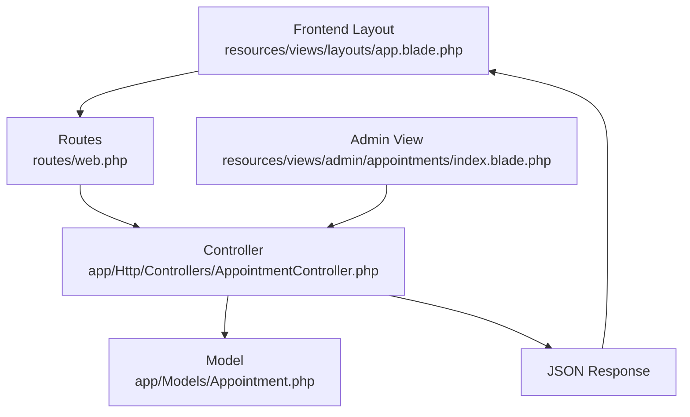
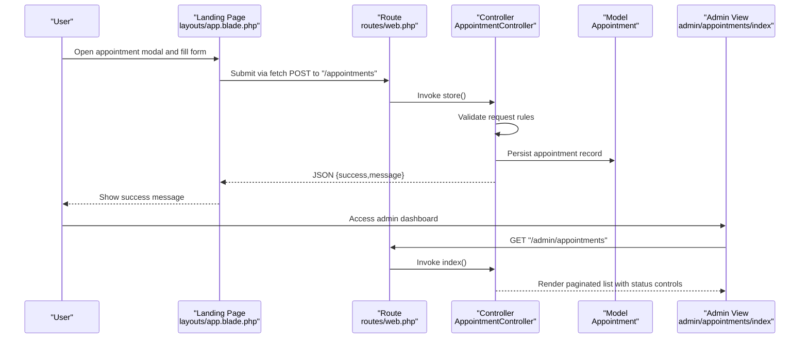
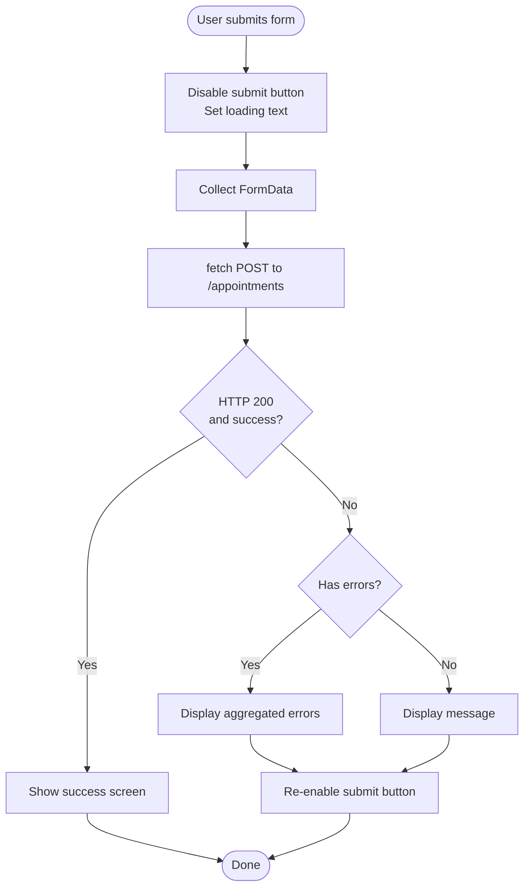
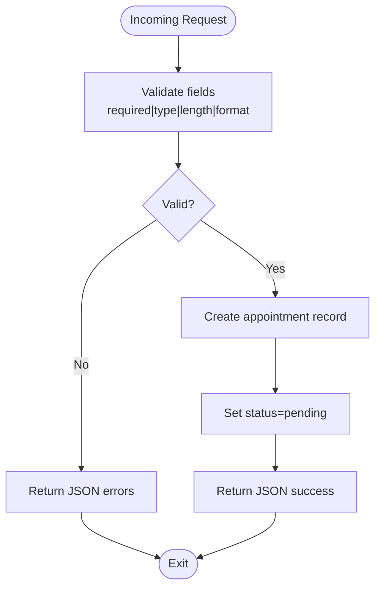
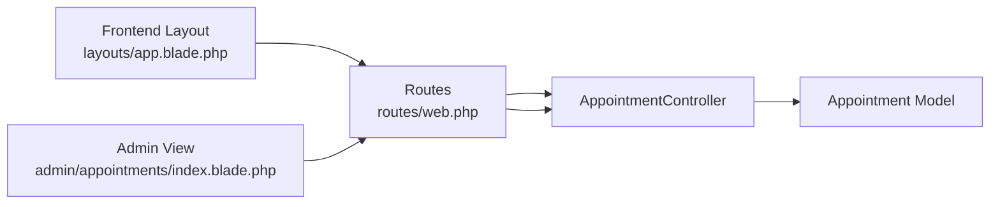

# Contact Form Processing

<cite>
**Referenced Files in This Document**
- [AppointmentController.php](file://app/Http/Controllers/AppointmentController.php)
- [web.php](file://routes/web.php)
- [app.blade.php](file://resources/views/layouts/app.blade.php)
- [landing.blade.php](file://resources/views/landing.blade.php)
- [Appointment.php](file://app/Models/Appointment.php)
- [app.blade.php](file://resources/views/admin/appointments/index.blade.php)
- [LoginRequest.php](file://app/Http/Requests/Auth/LoginRequest.php)
</cite>

## Table of Contents
1. [Introduction](#introduction)
2. [Project Structure](#project-structure)
3. [Core Components](#core-components)
4. [Architecture Overview](#architecture-overview)
5. [Detailed Component Analysis](#detailed-component-analysis)
6. [Dependency Analysis](#dependency-analysis)
7. [Performance Considerations](#performance-considerations)
8. [Security Considerations](#security-considerations)
9. [Troubleshooting Guide](#troubleshooting-guide)
10. [Conclusion](#conclusion)

## Introduction
This document explains the contact form processing component for the appointment management system. It covers validation rules, request handling, data persistence, frontend-to-backend workflow via AJAX, JSON responses, and practical guidance for customization (validation rules, new fields, CAPTCHA). It also addresses security considerations, rate limiting, and spam prevention measures.

## Project Structure
The contact/demo request flow spans frontend Blade templates, routing, controller validation, model creation, and admin UI for review.

**Diagram sources**
- [app.blade.php:204-261](file://resources/views/layouts/app.blade.php#L204-L261)
- [web.php:26](file://routes/web.php#L26)
- [AppointmentController.php:14-41](file://app/Http/Controllers/AppointmentController.php#L14-L41)
- [Appointment.php:9-18](file://app/Models/Appointment.php#L9-L18)
- [app.blade.php:358-390](file://resources/views/layouts/app.blade.php#L358-L390)
- [app.blade.php:264-273](file://resources/views/layouts/app.blade.php#L264-L273)
- [app.blade.php:690-701](file://resources/views/layouts/app.blade.php#L690-L701)

**Section sources**
- [web.php:26](file://routes/web.php#L26)
- [app.blade.php:204-261](file://resources/views/layouts/app.blade.php#L204-L261)
- [app.blade.php:358-390](file://resources/views/layouts/app.blade.php#L358-L390)

## Core Components
- Frontend form and AJAX submission: Modal form with CSRF token, client-side fetch submission, and JSON response handling.
- Backend controller: Validates incoming request, persists appointment, and returns JSON success message.
- Model: Defines fillable attributes for mass assignment.
- Admin interface: Lists appointments with status controls for updates.

Key implementation references:
- Frontend form and JS handler: [app.blade.php:204-261](file://resources/views/layouts/app.blade.php#L204-L261), [app.blade.php:345-390](file://resources/views/layouts/app.blade.php#L345-L390)
- Route binding: [web.php:26](file://routes/web.php#L26)
- Controller validation and persistence: [AppointmentController.php:14-41](file://app/Http/Controllers/AppointmentController.php#L14-L41)
- Model fillable attributes: [Appointment.php:9-18](file://app/Models/Appointment.php#L9-L18)
- Admin listing and status update: [app.blade.php:264-273](file://resources/views/layouts/app.blade.php#L264-L273), [app.blade.php:690-701](file://resources/views/layouts/app.blade.php#L690-L701)

**Section sources**
- [app.blade.php:204-261](file://resources/views/layouts/app.blade.php#L204-L261)
- [app.blade.php:345-390](file://resources/views/layouts/app.blade.php#L345-L390)
- [web.php:26](file://routes/web.php#L26)
- [AppointmentController.php:14-41](file://app/Http/Controllers/AppointmentController.php#L14-L41)
- [Appointment.php:9-18](file://app/Models/Appointment.php#L9-L18)
- [app.blade.php:264-273](file://resources/views/layouts/app.blade.php#L264-L273)
- [app.blade.php:690-701](file://resources/views/layouts/app.blade.php#L690-L701)

## Architecture Overview
End-to-end flow from user interaction to data persistence and feedback.

**Diagram sources**
- [app.blade.php:204-261](file://resources/views/layouts/app.blade.php#L204-L261)
- [app.blade.php:358-390](file://resources/views/layouts/app.blade.php#L358-L390)
- [web.php:26](file://routes/web.php#L26)
- [AppointmentController.php:14-41](file://app/Http/Controllers/AppointmentController.php#L14-L41)
- [Appointment.php:9-18](file://app/Models/Appointment.php#L9-L18)
- [app.blade.php:264-273](file://resources/views/layouts/app.blade.php#L264-L273)

## Detailed Component Analysis

### Frontend Form and AJAX Submission
- Modal form includes CSRF token and required fields: name, email, WhatsApp, institution, demo date/time, and optional notes.
- JavaScript handles submission via fetch POST to the appointments endpoint, disables submit button during send, and displays success or error messages based on JSON response.
- On success, the modal switches to a success screen; on validation errors, it shows aggregated error messages.

Implementation references:
- Form HTML and structure: [app.blade.php:204-261](file://resources/views/layouts/app.blade.php#L204-L261)
- Fetch submission and response handling: [app.blade.php:345-390](file://resources/views/layouts/app.blade.php#L345-L390)

**Diagram sources**
- [app.blade.php:345-390](file://resources/views/layouts/app.blade.php#L345-L390)

**Section sources**
- [app.blade.php:204-261](file://resources/views/layouts/app.blade.php#L204-L261)
- [app.blade.php:345-390](file://resources/views/layouts/app.blade.php#L345-L390)

### Backend Controller: Validation, Sanitization, and Persistence
- Validation rules enforce required fields, length limits, email format, date constraints, and optional notes.
- Data is persisted to the appointments table with a default status.
- JSON response is returned for AJAX handling.

Validation rules and persistence:
- [AppointmentController.php:16-24](file://app/Http/Controllers/AppointmentController.php#L16-L24)
- [AppointmentController.php:26-35](file://app/Http/Controllers/AppointmentController.php#L26-L35)
- [AppointmentController.php:37-41](file://app/Http/Controllers/AppointmentController.php#L37-L41)

**Diagram sources**
- [AppointmentController.php:16-24](file://app/Http/Controllers/AppointmentController.php#L16-L24)
- [AppointmentController.php:26-35](file://app/Http/Controllers/AppointmentController.php#L26-L35)
- [AppointmentController.php:37-41](file://app/Http/Controllers/AppointmentController.php#L37-L41)

**Section sources**
- [AppointmentController.php:16-24](file://app/Http/Controllers/AppointmentController.php#L16-L24)
- [AppointmentController.php:26-35](file://app/Http/Controllers/AppointmentController.php#L26-L35)
- [AppointmentController.php:37-41](file://app/Http/Controllers/AppointmentController.php#L37-L41)

### Model and Fillable Attributes
- The model defines which attributes are mass assignable, ensuring only intended fields are persisted.

References:
- [Appointment.php:9-18](file://app/Models/Appointment.php#L9-L18)

**Section sources**
- [Appointment.php:9-18](file://app/Models/Appointment.php#L9-L18)

### Admin Dashboard and Status Management
- Admin view lists recent appointments with pagination and allows changing status via a select control.
- Status updates are handled by a PATCH endpoint bound to the controller.

References:
- Admin listing and controls: [app.blade.php:264-273](file://resources/views/layouts/app.blade.php#L264-L273)
- Status update route and controller method: [web.php:66](file://routes/web.php#L66), [AppointmentController.php:55-66](file://app/Http/Controllers/AppointmentController.php#L55-L66)

**Section sources**
- [app.blade.php:264-273](file://resources/views/layouts/app.blade.php#L264-L273)
- [web.php:66](file://routes/web.php#L66)
- [AppointmentController.php:55-66](file://app/Http/Controllers/AppointmentController.php#L55-L66)

## Dependency Analysis
High-level dependencies among components.

**Diagram sources**
- [app.blade.php:204-261](file://resources/views/layouts/app.blade.php#L204-L261)
- [web.php:26](file://routes/web.php#L26)
- [AppointmentController.php:14-41](file://app/Http/Controllers/AppointmentController.php#L14-L41)
- [Appointment.php:9-18](file://app/Models/Appointment.php#L9-L18)
- [app.blade.php:264-273](file://resources/views/layouts/app.blade.php#L264-L273)

**Section sources**
- [web.php:26](file://routes/web.php#L26)
- [app.blade.php:204-261](file://resources/views/layouts/app.blade.php#L204-L261)
- [app.blade.php:264-273](file://resources/views/layouts/app.blade.php#L264-L273)
- [AppointmentController.php:14-41](file://app/Http/Controllers/AppointmentController.php#L14-L41)
- [Appointment.php:9-18](file://app/Models/Appointment.php#L9-L18)

## Performance Considerations
- Keep validation rules minimal and efficient; avoid overly expensive checks.
- Use pagination in admin listings to limit DOM rendering and database load.
- Consider caching frequently accessed landing page content to reduce server overhead.
- Monitor database queries for the appointments listing and add indexes if needed on frequently filtered/sorted columns.

## Security Considerations
- CSRF protection: The frontend form includes a CSRF meta tag and uses a form element; ensure the backend verifies CSRF automatically via middleware.
- Input validation: The controller enforces strict validation rules for all fields.
- JSON responses: The controller returns structured JSON suitable for AJAX consumption.
- Rate limiting: While the appointment form does not currently implement rate limiting, the authentication system demonstrates a robust pattern using Laravel’s built-in throttling helpers. This pattern can be adapted for the appointment endpoint.

Adopting rate limiting for the appointment endpoint:
- Use Laravel’s built-in rate limiter similar to the login request throttling pattern.
- Define a dedicated limiter key combining IP and email to prevent abuse while allowing legitimate users.

References for rate limiting pattern:
- [LoginRequest.php:61-85](file://app/Http/Requests/Auth/LoginRequest.php#L61-L85)

**Section sources**
- [LoginRequest.php:61-85](file://app/Http/Requests/Auth/LoginRequest.php#L61-L85)

## Troubleshooting Guide
Common issues and resolutions:
- Validation errors not displayed: Ensure the frontend checks for the presence of errors in the JSON response and renders them appropriately.
- Empty or malformed responses: Verify the controller returns a JSON object with a success flag and message.
- Duplicate submissions: Implement client-side disabling of the submit button and consider server-side deduplication or rate limiting.
- Admin status updates failing: Confirm the PATCH route exists and the form method is set to PATCH with CSRF tokens.

References:
- Frontend error handling: [app.blade.php:370-380](file://resources/views/layouts/app.blade.php#L370-L380)
- Controller response: [AppointmentController.php:37-41](file://app/Http/Controllers/AppointmentController.php#L37-L41)
- Admin status update: [web.php:66](file://routes/web.php#L66), [app.blade.php:690-701](file://resources/views/layouts/app.blade.php#L690-L701)

**Section sources**
- [app.blade.php:370-380](file://resources/views/layouts/app.blade.php#L370-L380)
- [AppointmentController.php:37-41](file://app/Http/Controllers/AppointmentController.php#L37-L41)
- [web.php:66](file://routes/web.php#L66)
- [app.blade.php:690-701](file://resources/views/layouts/app.blade.php#L690-L701)

## Conclusion
The contact form processing pipeline integrates a clean frontend modal with AJAX submission, robust backend validation and persistence, and an admin interface for oversight. By following the outlined validation rules, response handling, and security practices—including adopting rate limiting—the system remains reliable, user-friendly, and secure. Extensibility is straightforward: adjust validation rules, expand the model fillable attributes, and integrate additional anti-spam measures as needed.