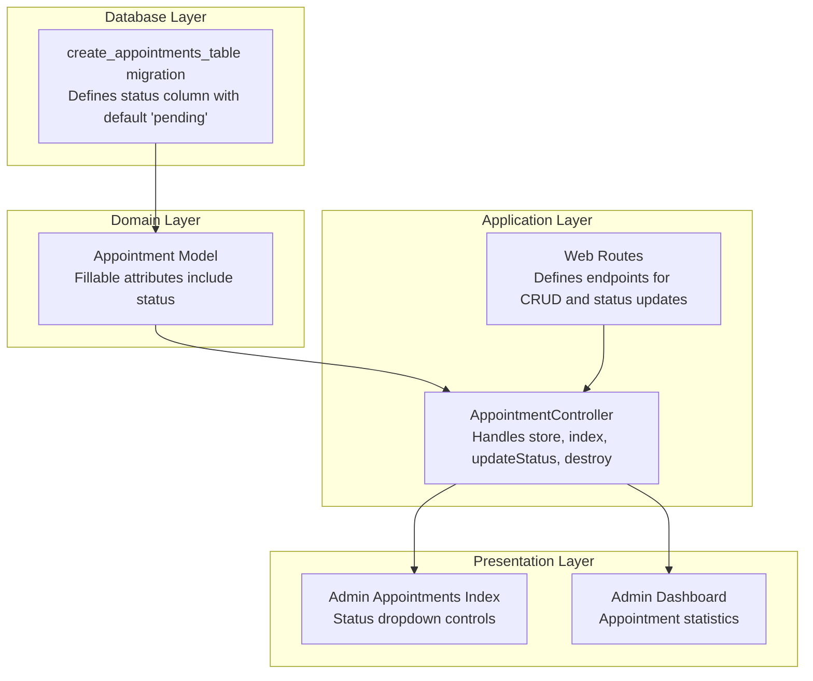
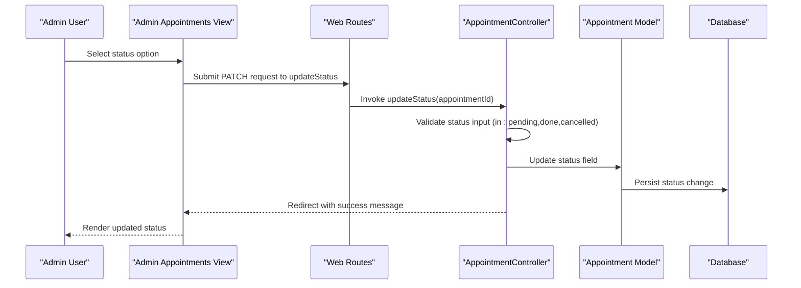
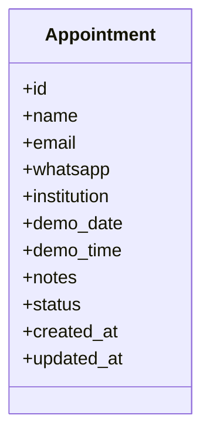
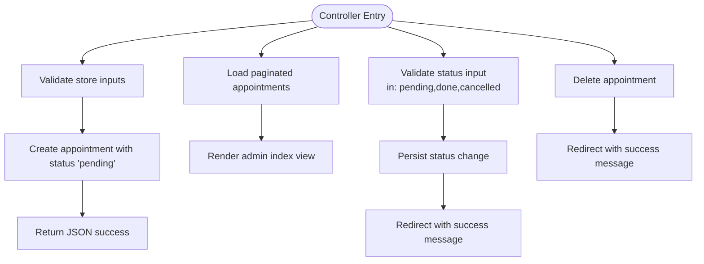
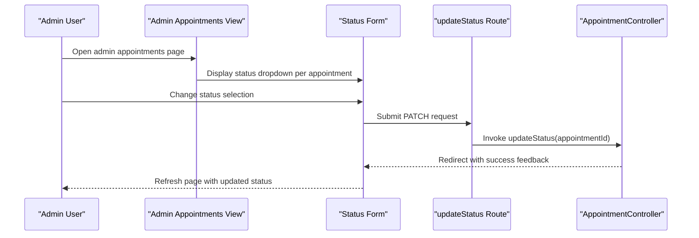
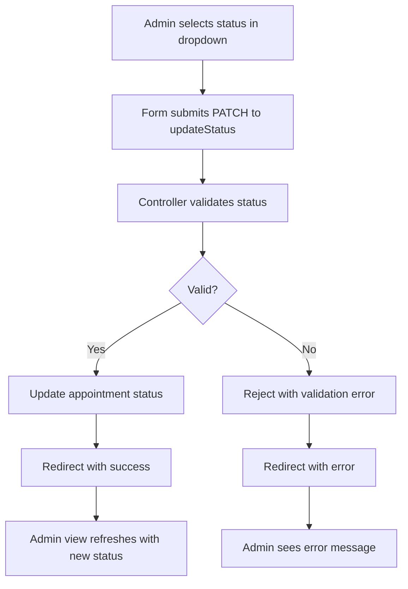
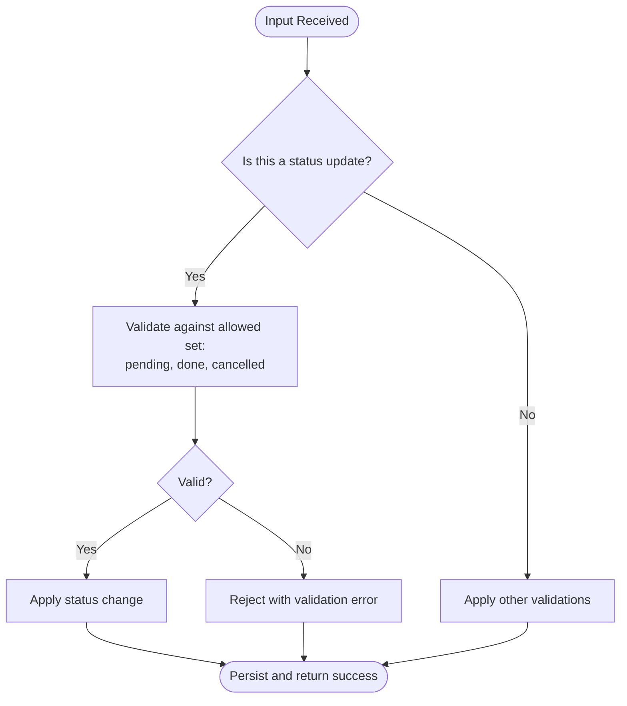
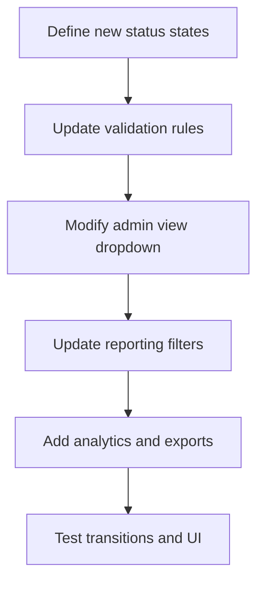

# Status Management System

<cite>
**Referenced Files in This Document**
- [Appointment.php](file://app/Models/Appointment.php)
- [AppointmentController.php](file://app/Http/Controllers/AppointmentController.php)
- [2026_06_22_024652_create_appointments_table.php](file://database/migrations/2026_06_22_024652_create_appointments_table.php)
- [index.blade.php](file://resources/views/admin/appointments/index.blade.php)
- [web.php](file://routes/web.php)
- [dashboard.blade.php](file://resources/views/admin/dashboard.blade.php)
</cite>

## Table of Contents
1. [Introduction](#introduction)
2. [Project Structure](#project-structure)
3. [Core Components](#core-components)
4. [Architecture Overview](#architecture-overview)
5. [Detailed Component Analysis](#detailed-component-analysis)
6. [Status States and Definitions](#status-states-and-definitions)
7. [Status Update Workflow](#status-update-workflow)
8. [Validation Rules and Transition Logic](#validation-rules-and-transition-logic)
9. [Notifications and Audit Trails](#notifications-and-audit-trails)
10. [Reporting and Analytics](#reporting-and-analytics)
11. [Custom Status Implementation](#custom-status-implementation)
12. [Performance Considerations](#performance-considerations)
13. [Troubleshooting Guide](#troubleshooting-guide)
14. [Conclusion](#conclusion)

## Introduction
This document provides comprehensive documentation for the appointment status management system within the ClinicalLog CMS. The system manages three distinct status states—pending, done, and cancelled—covering their meanings, validation rules, transition logic, and integration points with notifications, audit trails, and reporting. It also includes guidance for extending the system with custom status states, automated transitions, and advanced analytics.

## Project Structure
The status management system spans several Laravel components:
- Database migration defining the appointments table and default status field
- Eloquent model representing appointment records
- Controller handling creation, listing, status updates, and deletion
- Blade templates rendering administrative interfaces and status controls
- Routing configuration connecting HTTP endpoints to controller actions

**Diagram sources**
- [2026_06_22_024652_create_appointments_table.php:14-25](file://database/migrations/2026_06_22_024652_create_appointments_table.php#L14-L25)
- [Appointment.php:9-18](file://app/Models/Appointment.php#L9-L18)
- [web.php:26, 65-67](file://routes/web.php#L26,L65-L67)
- [AppointmentController.php:14, 46, 55, 71](file://app/Http/Controllers/AppointmentController.php#L14,L46,L55,L71)
- [index.blade.php:60-68](file://resources/views/admin/appointments/index.blade.php#L60-L68)
- [dashboard.blade.php:40-42](file://resources/views/admin/dashboard.blade.php#L40-L42)

**Section sources**
- [2026_06_22_024652_create_appointments_table.php:14-25](file://database/migrations/2026_06_22_024652_create_appointments_table.php#L14-L25)
- [Appointment.php:9-18](file://app/Models/Appointment.php#L9-L18)
- [web.php:26, 65-67](file://routes/web.php#L26,L65-L67)
- [AppointmentController.php:14, 46, 55, 71](file://app/Http/Controllers/AppointmentController.php#L14,L46,L55,L71)
- [index.blade.php:60-68](file://resources/views/admin/appointments/index.blade.php#L60-L68)
- [dashboard.blade.php:40-42](file://resources/views/admin/dashboard.blade.php#L40-L42)

## Core Components
- Database migration establishes the appointments table with a status column defaulting to 'pending'.
- The Appointment model defines fillable attributes including status.
- The AppointmentController provides endpoints for storing new appointments, listing them, updating status, and deleting records.
- The admin appointments index view renders a status dropdown allowing administrators to change appointment statuses.
- Routes connect HTTP requests to controller actions for status management.

Key implementation references:
- Status column definition and default value
- Fillable attributes including status
- Status update endpoint and validation
- Status dropdown rendering in admin interface

**Section sources**
- [2026_06_22_024652_create_appointments_table.php:23](file://database/migrations/2026_06_22_024652_create_appointments_table.php#L23)
- [Appointment.php:17](file://app/Models/Appointment.php#L17)
- [AppointmentController.php:34](file://app/Http/Controllers/AppointmentController.php#L34)
- [web.php:66](file://routes/web.php#L66)
- [index.blade.php:63-67](file://resources/views/admin/appointments/index.blade.php#L63-L67)

## Architecture Overview
The status management follows a layered architecture:
- Data Access: Eloquent model interacts with the appointments table via migration-defined schema.
- Business Logic: Controller validates inputs, applies constraints, and persists status changes.
- Presentation: Blade templates render administrative controls for status updates and display aggregated statistics.

**Diagram sources**
- [web.php:66](file://routes/web.php#L66)
- [AppointmentController.php:55-66](file://app/Http/Controllers/AppointmentController.php#L55-L66)
- [index.blade.php:60-68](file://resources/views/admin/appointments/index.blade.php#L60-L68)

## Detailed Component Analysis

### Database Schema and Model
The appointments table includes a status field with a default value of 'pending'. The Appointment model declares fillable attributes, ensuring the status field can be mass-assigned during creation and updates.

**Diagram sources**
- [2026_06_22_024652_create_appointments_table.php:14-25](file://database/migrations/2026_06_22_024652_create_appointments_table.php#L14-L25)
- [Appointment.php:9-18](file://app/Models/Appointment.php#L9-L18)

**Section sources**
- [2026_06_22_024652_create_appointments_table.php:23](file://database/migrations/2026_06_22_024652_create_appointments_table.php#L23)
- [Appointment.php:17](file://app/Models/Appointment.php#L17)

### Controller Operations
The AppointmentController implements four primary operations:
- Store: Validates appointment inputs and creates a new record with status set to 'pending'.
- Index: Retrieves paginated appointments for the admin dashboard.
- Update Status: Validates and applies status changes using the in:pending,done,cancelled constraint.
- Destroy: Deletes an appointment record.

**Diagram sources**
- [AppointmentController.php:14-41](file://app/Http/Controllers/AppointmentController.php#L14-L41)
- [AppointmentController.php:46-50](file://app/Http/Controllers/AppointmentController.php#L46-L50)
- [AppointmentController.php:55-66](file://app/Http/Controllers/AppointmentController.php#L55-L66)
- [AppointmentController.php:71-75](file://app/Http/Controllers/AppointmentController.php#L71-L75)

**Section sources**
- [AppointmentController.php:14-41](file://app/Http/Controllers/AppointmentController.php#L14-L41)
- [AppointmentController.php:46-50](file://app/Http/Controllers/AppointmentController.php#L46-L50)
- [AppointmentController.php:55-66](file://app/Http/Controllers/AppointmentController.php#L55-L66)
- [AppointmentController.php:71-75](file://app/Http/Controllers/AppointmentController.php#L71-L75)

### Administrative Interface
The admin appointments index view provides:
- A paginated table of appointments with key details
- An inline status dropdown allowing administrators to change status via PATCH submission
- Visual indicators for status states (pending, done, cancelled)

**Diagram sources**
- [index.blade.php:60-68](file://resources/views/admin/appointments/index.blade.php#L60-L68)
- [web.php:66](file://routes/web.php#L66)
- [AppointmentController.php:55-66](file://app/Http/Controllers/AppointmentController.php#L55-L66)

**Section sources**
- [index.blade.php:60-68](file://resources/views/admin/appointments/index.blade.php#L60-L68)
- [web.php:66](file://routes/web.php#L66)
- [AppointmentController.php:55-66](file://app/Http/Controllers/AppointmentController.php#L55-L66)

## Status States and Definitions
The system currently supports three status states:

- Pending
  - Meaning: Appointment has been submitted but not yet processed or completed.
  - Implications: Remains visible in admin lists; eligible for further action (mark as done or cancelled).
  - Default initial state upon creation.

- Done
  - Meaning: Appointment has been completed or finalized.
  - Implications: Indicates successful completion; may be used for reporting and analytics.

- Cancelled
  - Meaning: Appointment has been cancelled by an administrator.
  - Implications: Marks the record as inactive for active processing; useful for historical tracking.

These states are enforced through validation rules and reflected in the admin interface dropdown.

**Section sources**
- [2026_06_22_024652_create_appointments_table.php:23](file://database/migrations/2026_06_22_024652_create_appointments_table.php#L23)
- [AppointmentController.php:34](file://app/Http/Controllers/AppointmentController.php#L34)
- [AppointmentController.php:58](file://app/Http/Controllers/AppointmentController.php#L58)
- [index.blade.php:65-67](file://resources/views/admin/appointments/index.blade.php#L65-L67)

## Status Update Workflow
The status update workflow is initiated from the admin interface and processed server-side:

1. Administrator selects a new status from the dropdown in the admin appointments view.
2. The view submits a PATCH request to the updateStatus endpoint.
3. The controller validates the incoming status against the allowed set.
4. The controller updates the appointment record with the new status.
5. The controller redirects back to the admin view with a success message.
6. The view re-renders with the updated status indicator.

**Diagram sources**
- [index.blade.php:60-68](file://resources/views/admin/appointments/index.blade.php#L60-L68)
- [web.php:66](file://routes/web.php#L66)
- [AppointmentController.php:55-66](file://app/Http/Controllers/AppointmentController.php#L55-L66)

**Section sources**
- [index.blade.php:60-68](file://resources/views/admin/appointments/index.blade.php#L60-L68)
- [web.php:66](file://routes/web.php#L66)
- [AppointmentController.php:55-66](file://app/Http/Controllers/AppointmentController.php#L55-L66)

## Validation Rules and Transition Logic
Validation ensures data integrity and controlled state transitions:

- Creation validation includes status with a default value of 'pending'.
- Status update validation enforces the status to be one of the allowed values: pending, done, or cancelled.

Transition logic:
- The system does not implement automatic transitions based on time or external conditions.
- Administrators manually select the appropriate status from the dropdown.

**Diagram sources**
- [AppointmentController.php:26-35](file://app/Http/Controllers/AppointmentController.php#L26-L35)
- [AppointmentController.php:57-63](file://app/Http/Controllers/AppointmentController.php#L57-L63)

**Section sources**
- [AppointmentController.php:26-35](file://app/Http/Controllers/AppointmentController.php#L26-L35)
- [AppointmentController.php:57-63](file://app/Http/Controllers/AppointmentController.php#L57-L63)

## Notifications and Audit Trails
Current implementation:
- No explicit notification or audit trail mechanisms are implemented in the codebase for status changes.

Recommendations for future enhancement:
- Integrate notifications (email/SMS) triggered upon status changes.
- Implement an audit log capturing who changed the status, when, and to what value.
- Add event-driven hooks for extensibility.

[No sources needed since this section provides recommendations without analyzing specific files]

## Reporting and Analytics
Current reporting:
- The admin dashboard displays a "Total Appointment" statistic, indicating basic counting capability.
- No built-in status-based filtering or analytics are present in the current codebase.

Potential enhancements:
- Add status-based filters in the admin appointments index.
- Implement analytics dashboards showing counts per status over time.
- Provide export capabilities for filtered appointment datasets.

**Section sources**
- [dashboard.blade.php:40-42](file://resources/views/admin/dashboard.blade.php#L40-L42)

## Custom Status Implementation
Extending the system to support additional status states involves modifying multiple components:

1. Database migration
   - Add new status values to the allowed set in validation rules.
   - Ensure backward compatibility if maintaining existing states.

2. Model and controller
   - Update validation rules to include new status values.
   - Modify admin view dropdown options to reflect new states.

3. Frontend
   - Extend the status dropdown to include new options.
   - Update visual indicators and styling as needed.

4. Reporting and analytics
   - Update dashboards and filters to accommodate new states.
   - Add metrics and charts for new status distributions.

[No sources needed since this diagram shows conceptual workflow, not actual code structure]

## Performance Considerations
- Database queries for the admin index use pagination to limit result sets.
- Status updates are lightweight database writes with minimal overhead.
- Recommendations:
  - Add database indexes on frequently queried columns (e.g., status, created_at).
  - Implement caching for dashboard statistics if data volume grows.
  - Use database query logging to monitor slow queries.

[No sources needed since this section provides general guidance]

## Troubleshooting Guide
Common issues and resolutions:
- Status update fails validation
  - Cause: Invalid status value submitted.
  - Resolution: Ensure the selected value is one of pending, done, or cancelled.

- Empty admin appointments list
  - Cause: No appointment records exist.
  - Resolution: Submit a new appointment or verify data population.

- Redirect loops after status update
  - Cause: Form submission errors or missing CSRF tokens.
  - Resolution: Verify CSRF middleware and form authenticity.

**Section sources**
- [AppointmentController.php:57-63](file://app/Http/Controllers/AppointmentController.php#L57-L63)
- [index.blade.php:60-68](file://resources/views/admin/appointments/index.blade.php#L60-L68)

## Conclusion
The appointment status management system provides a clean foundation for tracking appointment lifecycle states with a simple, maintainable architecture. Current capabilities include three predefined states, robust validation, and an intuitive admin interface for manual status updates. Future enhancements should focus on automated transitions, notifications, audit trails, and advanced reporting to support scalable operations and compliance requirements.