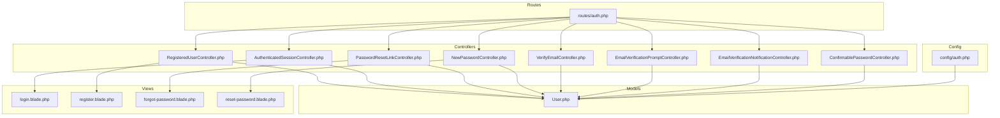
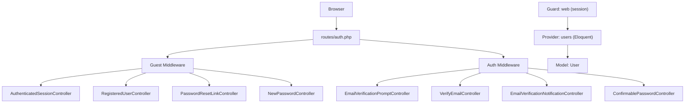
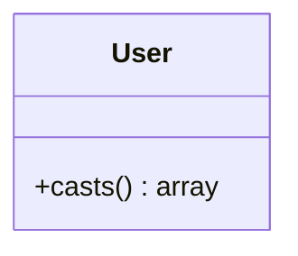
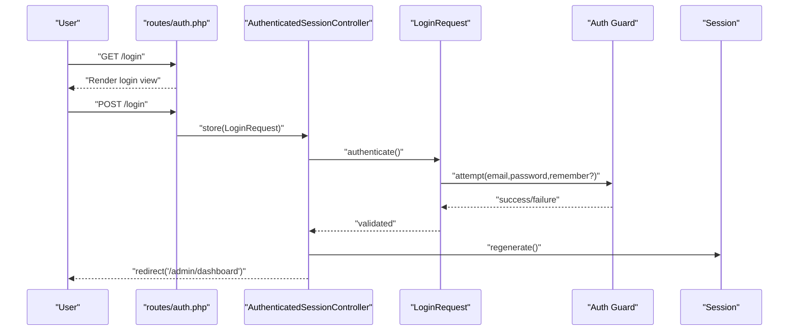
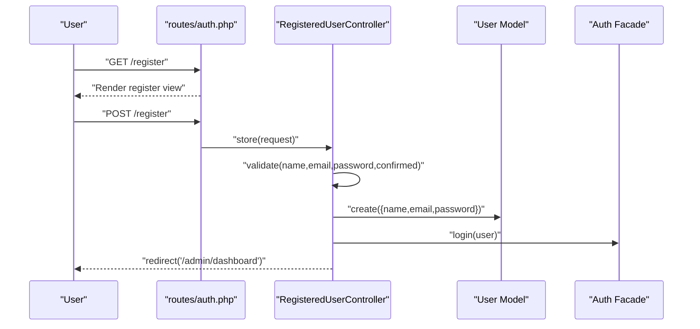
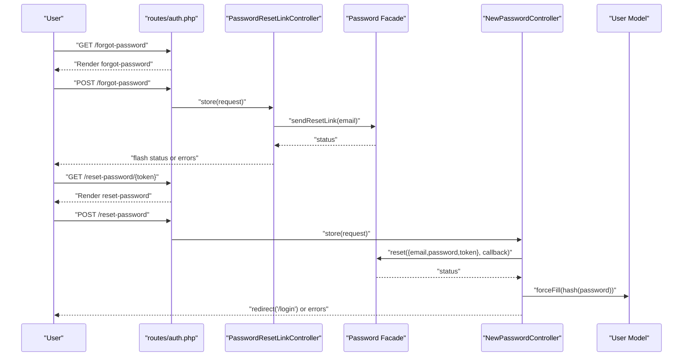
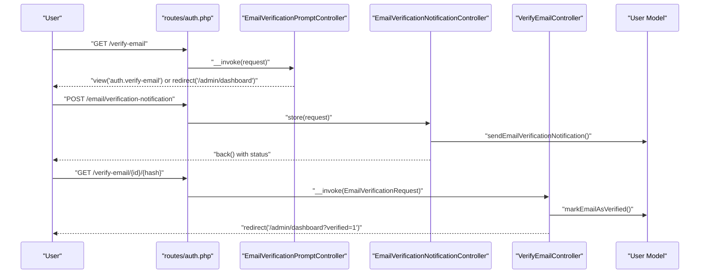
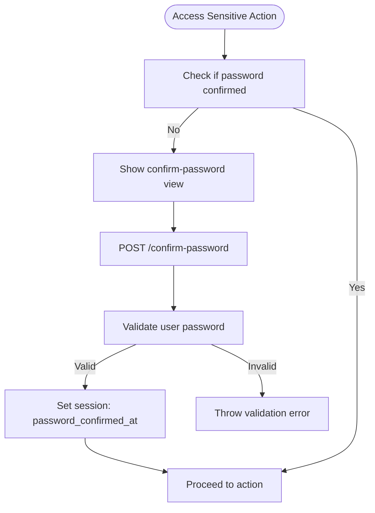
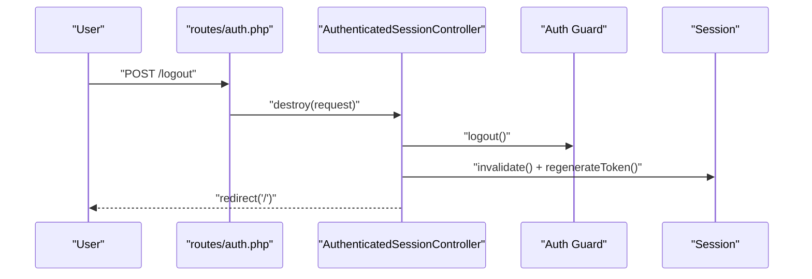
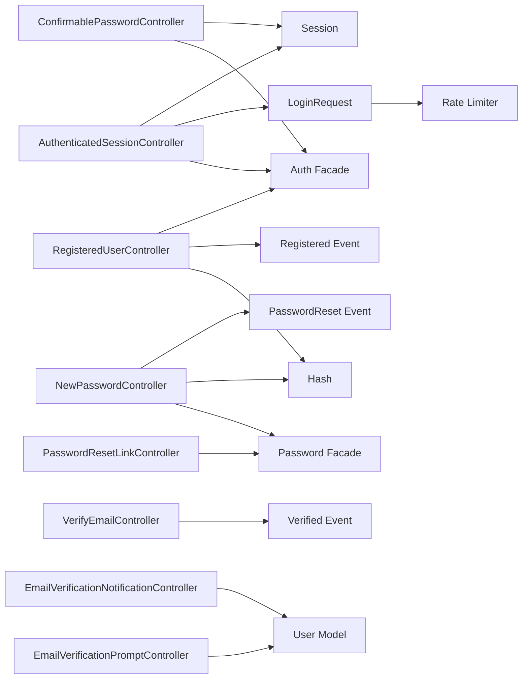

# Authentication & Authorization

<cite>
**Referenced Files in This Document**
- [User.php](file://app/Models/User.php)
- [auth.php](file://config/auth.php)
- [AuthenticatedSessionController.php](file://app/Http/Controllers/Auth/AuthenticatedSessionController.php)
- [RegisteredUserController.php](file://app/Http/Controllers/Auth/RegisteredUserController.php)
- [PasswordResetLinkController.php](file://app/Http/Controllers/Auth/PasswordResetLinkController.php)
- [NewPasswordController.php](file://app/Http/Controllers/Auth/NewPasswordController.php)
- [VerifyEmailController.php](file://app/Http/Controllers/Auth/VerifyEmailController.php)
- [EmailVerificationNotificationController.php](file://app/Http/Controllers/Auth/EmailVerificationNotificationController.php)
- [EmailVerificationPromptController.php](file://app/Http/Controllers/Auth/EmailVerificationPromptController.php)
- [ConfirmablePasswordController.php](file://app/Http/Controllers/Auth/ConfirmablePasswordController.php)
- [LoginRequest.php](file://app/Http/Requests/Auth/LoginRequest.php)
- [auth.php](file://routes/auth.php)
- [login.blade.php](file://resources/views/auth/login.blade.php)
- [register.blade.php](file://resources/views/auth/register.blade.php)
- [forgot-password.blade.php](file://resources/views/auth/forgot-password.blade.php)
- [reset-password.blade.php](file://resources/views/auth/reset-password.blade.php)
</cite>

## Table of Contents
1. [Introduction](#introduction)
2. [Project Structure](#project-structure)
3. [Core Components](#core-components)
4. [Architecture Overview](#architecture-overview)
5. [Detailed Component Analysis](#detailed-component-analysis)
6. [Dependency Analysis](#dependency-analysis)
7. [Performance Considerations](#performance-considerations)
8. [Troubleshooting Guide](#troubleshooting-guide)
9. [Conclusion](#conclusion)
10. [Appendices](#appendices)

## Introduction
This document provides comprehensive authentication and authorization documentation for ClinicalLog CMS. It details the Laravel Breeze-based authentication implementation, covering login, registration, password reset, and email verification flows. It also explains the user model structure, session management, middleware protection, and security measures such as rate limiting and password policies. Administrative user management and integration points for extending the system are included.

## Project Structure
The authentication system is organized around Laravel Breeze conventions with controllers under app/Http/Controllers/Auth, Blade views under resources/views/auth, and routing under routes/auth.php. Configuration is centralized in config/auth.php and validated by form requests such as LoginRequest.

**Diagram sources**
- [auth.php:1-60](file://routes/auth.php#L1-L60)
- [RegisteredUserController.php:1-52](file://app/Http/Controllers/Auth/RegisteredUserController.php#L1-L52)
- [AuthenticatedSessionController.php:1-48](file://app/Http/Controllers/Auth/AuthenticatedSessionController.php#L1-L48)
- [PasswordResetLinkController.php:1-46](file://app/Http/Controllers/Auth/PasswordResetLinkController.php#L1-L46)
- [NewPasswordController.php:1-64](file://app/Http/Controllers/Auth/NewPasswordController.php#L1-L64)
- [VerifyEmailController.php:1-28](file://app/Http/Controllers/Auth/VerifyEmailController.php#L1-L28)
- [EmailVerificationPromptController.php:1-22](file://app/Http/Controllers/Auth/EmailVerificationPromptController.php#L1-L22)
- [EmailVerificationNotificationController.php:1-25](file://app/Http/Controllers/Auth/EmailVerificationNotificationController.php#L1-L25)
- [ConfirmablePasswordController.php:1-41](file://app/Http/Controllers/Auth/ConfirmablePasswordController.php#L1-L41)
- [User.php:1-33](file://app/Models/User.php#L1-L33)
- [auth.php:1-118](file://config/auth.php#L1-L118)
- [login.blade.php:1-94](file://resources/views/auth/login.blade.php#L1-L94)
- [register.blade.php:1-103](file://resources/views/auth/register.blade.php#L1-L103)
- [forgot-password.blade.php:1-26](file://resources/views/auth/forgot-password.blade.php#L1-L26)
- [reset-password.blade.php:1-40](file://resources/views/auth/reset-password.blade.php#L1-L40)

**Section sources**
- [auth.php:1-60](file://routes/auth.php#L1-L60)
- [auth.php:1-118](file://config/auth.php#L1-L118)

## Core Components
- User Model: Defines the authenticated model, casting for email verification and password hashing, and notification capability.
- Authentication Controllers: Handle login, logout, registration, password reset, email verification, and password confirmation.
- Request Validation: LoginRequest enforces validation and rate limiting during authentication attempts.
- Routes: Grouped by middleware (guest vs auth) to protect endpoints and enforce access control.
- Views: Blade templates for login, registration, forgot-password, and reset-password flows.

**Section sources**
- [User.php:1-33](file://app/Models/User.php#L1-L33)
- [AuthenticatedSessionController.php:1-48](file://app/Http/Controllers/Auth/AuthenticatedSessionController.php#L1-L48)
- [RegisteredUserController.php:1-52](file://app/Http/Controllers/Auth/RegisteredUserController.php#L1-L52)
- [PasswordResetLinkController.php:1-46](file://app/Http/Controllers/Auth/PasswordResetLinkController.php#L1-L46)
- [NewPasswordController.php:1-64](file://app/Http/Controllers/Auth/NewPasswordController.php#L1-L64)
- [VerifyEmailController.php:1-28](file://app/Http/Controllers/Auth/VerifyEmailController.php#L1-L28)
- [EmailVerificationPromptController.php:1-22](file://app/Http/Controllers/Auth/EmailVerificationPromptController.php#L1-L22)
- [EmailVerificationNotificationController.php:1-25](file://app/Http/Controllers/Auth/EmailVerificationNotificationController.php#L1-L25)
- [ConfirmablePasswordController.php:1-41](file://app/Http/Controllers/Auth/ConfirmablePasswordController.php#L1-L41)
- [LoginRequest.php:1-87](file://app/Http/Requests/Auth/LoginRequest.php#L1-L87)
- [auth.php:1-60](file://routes/auth.php#L1-L60)

## Architecture Overview
The authentication architecture follows Laravel’s guard/provider pattern with a session-based web guard and Eloquent user provider. Routes are grouped by middleware to separate guest-only actions (register, login, forgot password, reset) from authenticated actions (verification prompts, resend notifications, password confirmation, logout).

**Diagram sources**
- [auth.php:14-59](file://routes/auth.php#L14-L59)
- [auth.php:40-74](file://config/auth.php#L40-L74)
- [User.php:15-18](file://app/Models/User.php#L15-L18)

**Section sources**
- [auth.php:1-118](file://config/auth.php#L1-L118)
- [auth.php:1-60](file://routes/auth.php#L1-L60)

## Detailed Component Analysis

### User Model
- Purpose: Represents the authenticated entity with notification support and secure attribute casting.
- Security: Passwords are hashed automatically; sensitive attributes are hidden from serialization.
- Verification: Email verification timestamp is cast to a datetime for validation logic.

**Diagram sources**
- [User.php:25-31](file://app/Models/User.php#L25-L31)

**Section sources**
- [User.php:1-33](file://app/Models/User.php#L1-L33)

### Login Flow
- Endpoint: GET /login (guest), POST /login (guest).
- Process:
  - Validates credentials using LoginRequest.
  - Applies rate limiting and lockout handling.
  - Regenerates session and redirects to admin dashboard.
- Security: Rate limiter throttles repeated failed attempts; remember-me supported.

**Diagram sources**
- [auth.php:20-23](file://routes/auth.php#L20-L23)
- [AuthenticatedSessionController.php:25-31](file://app/Http/Controllers/Auth/AuthenticatedSessionController.php#L25-L31)
- [LoginRequest.php:41-54](file://app/Http/Requests/Auth/LoginRequest.php#L41-L54)

**Section sources**
- [AuthenticatedSessionController.php:1-48](file://app/Http/Controllers/Auth/AuthenticatedSessionController.php#L1-L48)
- [LoginRequest.php:1-87](file://app/Http/Requests/Auth/LoginRequest.php#L1-L87)
- [login.blade.php:1-94](file://resources/views/auth/login.blade.php#L1-L94)

### Registration Flow
- Endpoint: GET /register (guest), POST /register (guest).
- Process:
  - Validates name, email uniqueness, and password confirmation.
  - Enforces Laravel password rules via Rules\Password defaults.
  - Creates user, fires registered event, logs in, and redirects to admin dashboard.

**Diagram sources**
- [auth.php:14-18](file://routes/auth.php#L14-L18)
- [RegisteredUserController.php:31-49](file://app/Http/Controllers/Auth/RegisteredUserController.php#L31-L49)
- [User.php:15-18](file://app/Models/User.php#L15-L18)

**Section sources**
- [RegisteredUserController.php:1-52](file://app/Http/Controllers/Auth/RegisteredUserController.php#L1-L52)
- [register.blade.php:1-103](file://resources/views/auth/register.blade.php#L1-L103)

### Password Reset Flow
- Forgot Password:
  - Endpoint: GET /forgot-password (guest), POST /forgot-password (guest).
  - Validates email and sends reset link via Password facade.
- Reset Password:
  - Endpoint: GET /reset-password/{token} (guest), POST /reset-password (guest).
  - Validates token, email, and new password; resets password and emits event.

**Diagram sources**
- [auth.php:25-35](file://routes/auth.php#L25-L35)
- [PasswordResetLinkController.php:27-43](file://app/Http/Controllers/Auth/PasswordResetLinkController.php#L27-L43)
- [NewPasswordController.php:32-53](file://app/Http/Controllers/Auth/NewPasswordController.php#L32-L53)
- [forgot-password.blade.php:1-26](file://resources/views/auth/forgot-password.blade.php#L1-L26)
- [reset-password.blade.php:1-40](file://resources/views/auth/reset-password.blade.php#L1-L40)

**Section sources**
- [PasswordResetLinkController.php:1-46](file://app/Http/Controllers/Auth/PasswordResetLinkController.php#L1-L46)
- [NewPasswordController.php:1-64](file://app/Http/Controllers/Auth/NewPasswordController.php#L1-L64)
- [forgot-password.blade.php:1-26](file://resources/views/auth/forgot-password.blade.php#L1-L26)
- [reset-password.blade.php:1-40](file://resources/views/auth/reset-password.blade.php#L1-L40)

### Email Verification
- Prompt:
  - Endpoint: GET /verify-email (auth).
  - Shows verification prompt if not verified; otherwise redirects to dashboard.
- Resend Notification:
  - Endpoint: POST /email/verification-notification (auth throttle:6,1).
  - Sends a new verification email if not verified.
- Verify Link:
  - Endpoint: GET /verify-email/{id}/{hash} (signed, throttle:6,1).
  - Marks email as verified and emits verified event.

**Diagram sources**
- [auth.php:38-48](file://routes/auth.php#L38-L48)
- [EmailVerificationPromptController.php:15-19](file://app/Http/Controllers/Auth/EmailVerificationPromptController.php#L15-L19)
- [EmailVerificationNotificationController.php:14-22](file://app/Http/Controllers/Auth/EmailVerificationNotificationController.php#L14-L22)
- [VerifyEmailController.php:15-25](file://app/Http/Controllers/Auth/VerifyEmailController.php#L15-L25)

**Section sources**
- [EmailVerificationPromptController.php:1-22](file://app/Http/Controllers/Auth/EmailVerificationPromptController.php#L1-L22)
- [EmailVerificationNotificationController.php:1-25](file://app/Http/Controllers/Auth/EmailVerificationNotificationController.php#L1-L25)
- [VerifyEmailController.php:1-28](file://app/Http/Controllers/Auth/VerifyEmailController.php#L1-L28)

### Password Confirmation
- Endpoint: GET /confirm-password (auth), POST /confirm-password (auth).
- Purpose: Re-authenticate the user for sensitive actions; stores confirmation timestamp in session.

**Diagram sources**
- [auth.php:50-53](file://routes/auth.php#L50-L53)
- [ConfirmablePasswordController.php:25-38](file://app/Http/Controllers/Auth/ConfirmablePasswordController.php#L25-L38)

**Section sources**
- [ConfirmablePasswordController.php:1-41](file://app/Http/Controllers/Auth/ConfirmablePasswordController.php#L1-L41)

### Logout
- Endpoint: POST /logout (auth).
- Process: Logs out current guard, invalidates session, regenerates CSRF token, and redirects to home.

**Diagram sources**
- [auth.php:57-58](file://routes/auth.php#L57-L58)
- [AuthenticatedSessionController.php:37-45](file://app/Http/Controllers/Auth/AuthenticatedSessionController.php#L37-L45)

**Section sources**
- [AuthenticatedSessionController.php:1-48](file://app/Http/Controllers/Auth/AuthenticatedSessionController.php#L1-L48)

## Dependency Analysis
- Controllers depend on:
  - Illuminate\Support\Facades\Auth for guard operations.
  - Illuminate\Support\Facades\Password for password reset orchestration.
  - Illuminate\Support\Facades\Hash for password hashing.
  - Illuminate\Validation\ValidationException for error handling.
- Models depend on:
  - Illuminate\Foundation\Auth\User as Authenticatable.
  - Illuminate\Notifications\Notifiable for email notifications.
- Routes depend on middleware:
  - guest for unauthenticated access.
  - auth for authenticated access.
  - signed and throttle for verification links.

**Diagram sources**
- [AuthenticatedSessionController.php:9-31](file://app/Http/Controllers/Auth/AuthenticatedSessionController.php#L9-L31)
- [RegisteredUserController.php:10-47](file://app/Http/Controllers/Auth/RegisteredUserController.php#L10-L47)
- [PasswordResetLinkController.php:8-43](file://app/Http/Controllers/Auth/PasswordResetLinkController.php#L8-L43)
- [NewPasswordController.php:10-51](file://app/Http/Controllers/Auth/NewPasswordController.php#L10-L51)
- [VerifyEmailController.php:6-22](file://app/Http/Controllers/Auth/VerifyEmailController.php#L6-L22)
- [EmailVerificationPromptController.php:15-19](file://app/Http/Controllers/Auth/EmailVerificationPromptController.php#L15-L19)
- [EmailVerificationNotificationController.php:14-22](file://app/Http/Controllers/Auth/EmailVerificationNotificationController.php#L14-L22)
- [ConfirmablePasswordController.php:27-38](file://app/Http/Controllers/Auth/ConfirmablePasswordController.php#L27-L38)
- [LoginRequest.php:45-53](file://app/Http/Requests/Auth/LoginRequest.php#L45-L53)

**Section sources**
- [auth.php:1-118](file://config/auth.php#L1-L118)
- [auth.php:1-60](file://routes/auth.php#L1-L60)

## Performance Considerations
- Rate Limiting: Login attempts are throttled to prevent brute force; adjust limits via rate limiter configuration.
- Session Regeneration: Sessions are regenerated after login to mitigate session fixation.
- Password Hashing: Automatic hashing ensures strong cryptographic storage.
- Middleware Efficiency: Grouped routes minimize overhead by applying middleware only where needed.

[No sources needed since this section provides general guidance]

## Troubleshooting Guide
- Login Failures:
  - Exceeding rate limit triggers a throttle error; check IP/email throttle key and retry timing.
  - Incorrect credentials throw a validation error; verify email/password combination.
- Password Reset Issues:
  - Invalid or expired token leads to reset failure; ensure the correct token and matching email.
  - Reset link not sent indicates validation or mail configuration problems.
- Email Verification:
  - Verification prompt appears if email is not marked verified; resend verification if needed.
  - Signed link throttling prevents abuse; ensure correct hash and timing.
- Password Confirmation:
  - Re-authentication required for sensitive actions; confirm password and retry.

**Section sources**
- [LoginRequest.php:61-76](file://app/Http/Requests/Auth/LoginRequest.php#L61-L76)
- [PasswordResetLinkController.php:36-43](file://app/Http/Controllers/Auth/PasswordResetLinkController.php#L36-L43)
- [NewPasswordController.php:43-53](file://app/Http/Controllers/Auth/NewPasswordController.php#L43-L53)
- [EmailVerificationPromptController.php:17-19](file://app/Http/Controllers/Auth/EmailVerificationPromptController.php#L17-L19)
- [EmailVerificationNotificationController.php:16-18](file://app/Http/Controllers/Auth/EmailVerificationNotificationController.php#L16-L18)
- [ConfirmablePasswordController.php:27-34](file://app/Http/Controllers/Auth/ConfirmablePasswordController.php#L27-L34)

## Conclusion
ClinicalLog CMS implements a robust, Breeze-aligned authentication system with clear separation of concerns, strong security defaults (rate limiting, hashed passwords, session regeneration), and comprehensive user lifecycle management. Administrators can manage users and access via standardized routes and controllers, while developers can extend behavior through events, middleware, and configuration.

[No sources needed since this section summarizes without analyzing specific files]

## Appendices

### Role-Based Access Control and Permissions
- Current Implementation: The provided controllers and routes focus on user authentication and verification. There is no explicit role or permission model present in the referenced files.
- Recommendations:
  - Introduce a roles/permissions package (e.g., Spatie Laravel Permission) and attach policies or gates for resource-level controls.
  - Add middleware for role checks and integrate with existing auth guard.
  - Extend the User model with role/permission relationships and apply gates/policies in controllers.

[No sources needed since this section provides general guidance]

### Password Policies
- Enforced via Rules\Password defaults during registration and password reset.
- Includes minimum length, character variety, and confirmation requirement.
- Consider adding additional constraints (recent history checks, dictionary word checks) through custom validation rules.

**Section sources**
- [RegisteredUserController.php:36-36](file://app/Http/Controllers/Auth/RegisteredUserController.php#L36-L36)
- [NewPasswordController.php:37-37](file://app/Http/Controllers/Auth/NewPasswordController.php#L37-L37)

### Email Verification Requirements
- Optional verification prompt for authenticated users; verification links are signed and throttled.
- Administrators can resend verification notifications when needed.

**Section sources**
- [EmailVerificationPromptController.php:15-19](file://app/Http/Controllers/Auth/EmailVerificationPromptController.php#L15-L19)
- [EmailVerificationNotificationController.php:14-22](file://app/Http/Controllers/Auth/EmailVerificationNotificationController.php#L14-L22)
- [VerifyEmailController.php:15-25](file://app/Http/Controllers/Auth/VerifyEmailController.php#L15-L25)

### Session Management and Middleware Protection
- Guard: session-based web guard with Eloquent user provider.
- Middleware:
  - guest: restricts access to registration/login/forgot/reset endpoints.
  - auth: protects verification, confirmation, password updates, and logout.
  - signed/throttle: applied to verification links to prevent abuse.

**Section sources**
- [auth.php:40-44](file://config/auth.php#L40-L44)
- [auth.php:14-59](file://routes/auth.php#L14-L59)

### Administrative User Management
- Administrative dashboard routes are used for redirection after login and verification.
- User CRUD and management are handled within admin views; ensure appropriate middleware and authorization checks are enforced for admin-only routes.

[No sources needed since this section provides general guidance]

### Customizing Authentication Behavior
- Events:
  - Registered, PasswordReset, Verified are dispatched during respective flows; listen to customize behavior (e.g., sending welcome emails, audit logs).
- Configuration:
  - Adjust guards/providers/password reset settings in config/auth.php.
- Extending Providers:
  - Switch to database provider or add additional providers for multi-model authentication.

**Section sources**
- [RegisteredUserController.php:45-45](file://app/Http/Controllers/Auth/RegisteredUserController.php#L45-L45)
- [NewPasswordController.php:51-51](file://app/Http/Controllers/Auth/NewPasswordController.php#L51-L51)
- [VerifyEmailController.php:22-22](file://app/Http/Controllers/Auth/VerifyEmailController.php#L22-L22)
- [auth.php:64-74](file://config/auth.php#L64-L74)

### Integrating External Authentication Providers
- Steps:
  - Install and configure Socialite provider package.
  - Define provider credentials in environment configuration.
  - Create login controller methods to handle provider callbacks.
  - Merge provider user data with local User model and log in.
- Notes:
  - Ensure email uniqueness and verification requirements are met for external accounts.
  - Apply rate limiting and security checks similar to internal login.

[No sources needed since this section provides general guidance]