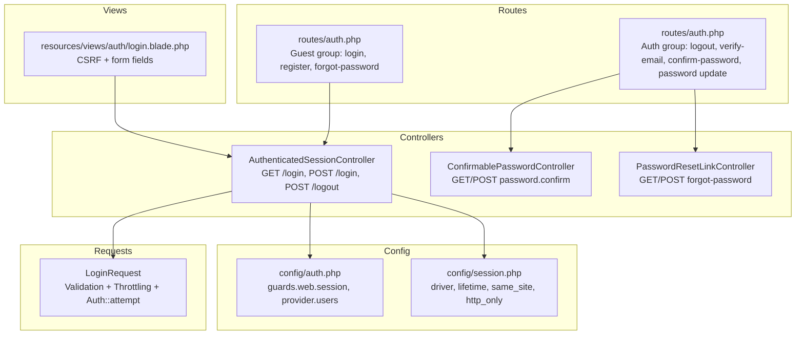
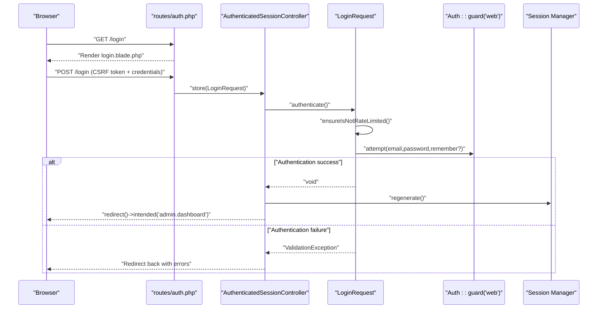
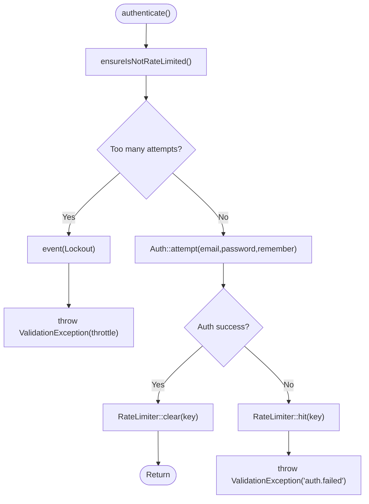
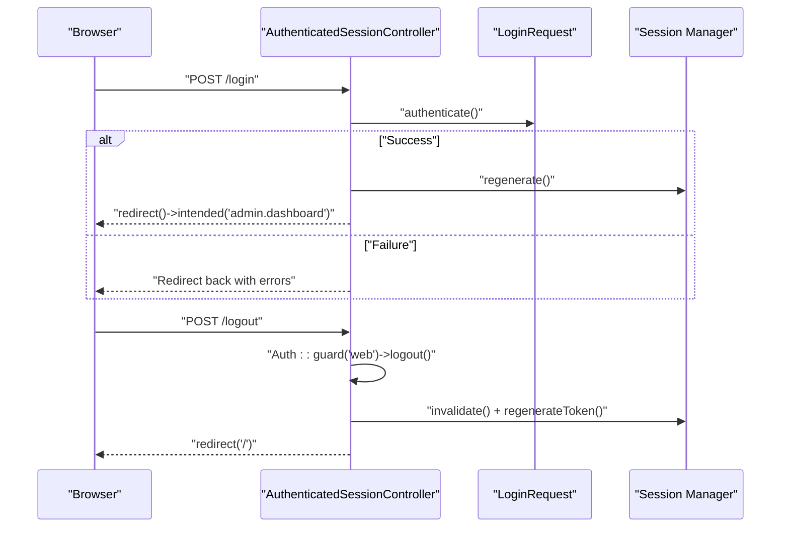
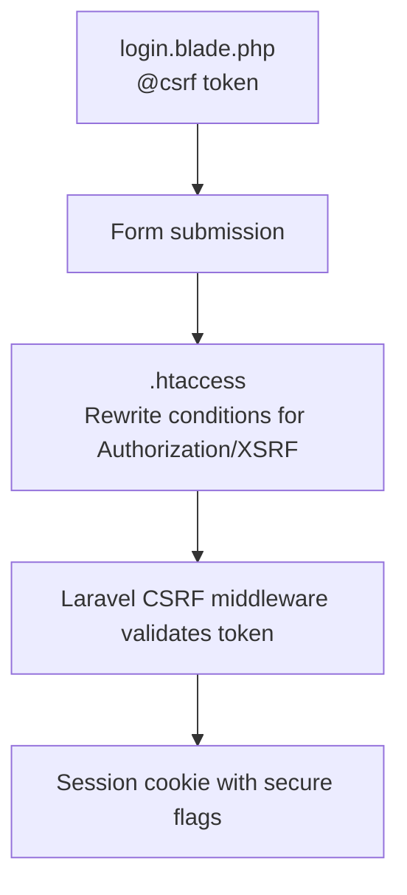
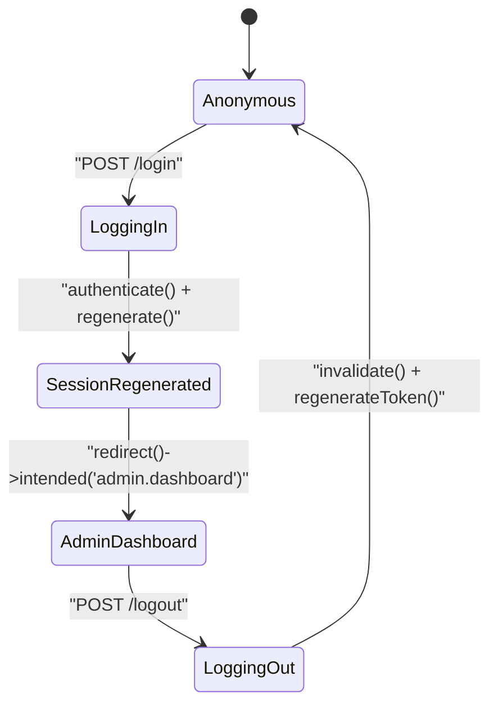
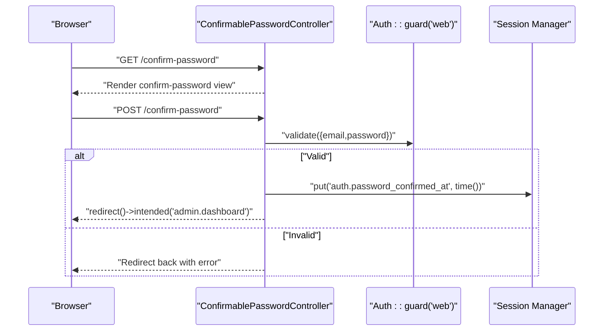
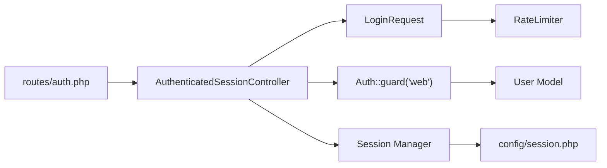

# Authentication Flow

<cite>
**Referenced Files in This Document**
- [LoginRequest.php](file://app/Http/Requests/Auth/LoginRequest.php)
- [AuthenticatedSessionController.php](file://app/Http/Controllers/Auth/AuthenticatedSessionController.php)
- [auth.php](file://routes/auth.php)
- [auth.php](file://config/auth.php)
- [session.php](file://config/session.php)
- [login.blade.php](file://resources/views/auth/login.blade.php)
- [ConfirmablePasswordController.php](file://app/Http/Controllers/Auth/ConfirmablePasswordController.php)
- [PasswordResetLinkController.php](file://app/Http/Controllers/Auth/PasswordResetLinkController.php)
- [User.php](file://app/Models/User.php)
- [.htaccess](file://public/.htaccess)
</cite>

## Table of Contents
1. [Introduction](#introduction)
2. [Project Structure](#project-structure)
3. [Core Components](#core-components)
4. [Architecture Overview](#architecture-overview)
5. [Detailed Component Analysis](#detailed-component-analysis)
6. [Dependency Analysis](#dependency-analysis)
7. [Performance Considerations](#performance-considerations)
8. [Troubleshooting Guide](#troubleshooting-guide)
9. [Conclusion](#conclusion)

## Introduction
This document explains the authentication flow in ClinicalLog CMS, focusing on the complete login process from request initiation to session establishment. It documents the LoginRequest validation class, authentication controller, session management, CSRF protection, and security measures. It also covers error handling for failed authentication attempts, throttling, and the intended redirection logic to the admin dashboard. Logout procedures, session lifecycle, and integration points with Laravel’s authentication guards and session configuration are included.

## Project Structure
Authentication in ClinicalLog CMS is organized around:
- Routes grouped by middleware (guest vs auth)
- A dedicated LoginRequest form request for validation and throttling
- An AuthenticatedSessionController handling login/logout and session regeneration
- Blade templates rendering the login form with CSRF protection
- Configuration files defining guards, providers, session behavior, and password reset policies

**Diagram sources**
- [auth.php:14-59](file://routes/auth.php#L14-L59)
- [AuthenticatedSessionController.php:12-47](file://app/Http/Controllers/Auth/AuthenticatedSessionController.php#L12-L47)
- [LoginRequest.php:13-86](file://app/Http/Requests/Auth/LoginRequest.php#L13-L86)
- [login.blade.php:47-82](file://resources/views/auth/login.blade.php#L47-L82)
- [auth.php:40-45](file://config/auth.php#L40-L45)
- [session.php:21-232](file://config/session.php#L21-L232)

**Section sources**
- [auth.php:14-59](file://routes/auth.php#L14-L59)
- [AuthenticatedSessionController.php:12-47](file://app/Http/Controllers/Auth/AuthenticatedSessionController.php#L12-L47)
- [login.blade.php:47-82](file://resources/views/auth/login.blade.php#L47-L82)
- [auth.php:40-45](file://config/auth.php#L40-L45)
- [session.php:21-232](file://config/session.php#L21-L232)

## Core Components
- LoginRequest: Validates credentials, enforces rate limiting, triggers throttling events, and attempts authentication. It clears rate limiter on success and throws validation errors on failure.
- AuthenticatedSessionController: Renders the login page, authenticates via LoginRequest, regenerates the session, and redirects to the intended destination. Handles logout by clearing guard state, invalidating the session, and regenerating CSRF tokens.
- Routes: Define guest-only login endpoints and authenticated-only logout and verification endpoints.
- Session Configuration: Controls driver, lifetime, cookie security attributes, and CSRF-related headers.
- Blade Login Template: Provides the HTML form with CSRF token and field validation feedback.

**Section sources**
- [LoginRequest.php:28-54](file://app/Http/Requests/Auth/LoginRequest.php#L28-L54)
- [AuthenticatedSessionController.php:25-46](file://app/Http/Controllers/Auth/AuthenticatedSessionController.php#L25-L46)
- [auth.php:14-59](file://routes/auth.php#L14-L59)
- [session.php:21-232](file://config/session.php#L21-L232)
- [login.blade.php:47-82](file://resources/views/auth/login.blade.php#L47-L82)

## Architecture Overview
The authentication flow integrates routing, form validation, throttling, session management, and CSRF protection. The diagram below maps the actual components and their interactions during login and logout.

**Diagram sources**
- [auth.php:20-35](file://routes/auth.php#L20-L35)
- [AuthenticatedSessionController.php:25-32](file://app/Http/Controllers/Auth/AuthenticatedSessionController.php#L25-L32)
- [LoginRequest.php:41-54](file://app/Http/Requests/Auth/LoginRequest.php#L41-L54)

## Detailed Component Analysis

### LoginRequest Validation and Throttling
- Validation rules enforce presence of email and password.
- authenticate() calls ensureIsNotRateLimited(), attempts Auth::attempt with optional remember flag, and clears rate limiter on success.
- ensureIsNotRateLimited() checks attempts per throttle key and emits a Lockout event; otherwise throws a validation error with throttle message.
- throttleKey() builds a normalized key from email and client IP.

**Diagram sources**
- [LoginRequest.php:41-77](file://app/Http/Requests/Auth/LoginRequest.php#L41-L77)

**Section sources**
- [LoginRequest.php:28-86](file://app/Http/Requests/Auth/LoginRequest.php#L28-L86)

### AuthenticatedSessionController: Login and Logout
- create(): Returns the login view.
- store(LoginRequest): Calls authenticate(), regenerates session, and redirects to intended admin dashboard.
- destroy(Request): Logs out via guard, invalidates session, regenerates CSRF token, and redirects to home.

**Diagram sources**
- [AuthenticatedSessionController.php:25-46](file://app/Http/Controllers/Auth/AuthenticatedSessionController.php#L25-L46)

**Section sources**
- [AuthenticatedSessionController.php:17-46](file://app/Http/Controllers/Auth/AuthenticatedSessionController.php#L17-L46)

### CSRF Protection and Security Measures
- Blade login template includes @csrf and renders field-specific validation messages.
- .htaccess sets up rewrite conditions for Authorization and X-XSRF-Token headers, aiding CSRF token handling in AJAX scenarios.
- Session configuration controls cookie security attributes (http_only, same_site), lifetime, and serialization.

**Diagram sources**
- [login.blade.php:47-48](file://resources/views/auth/login.blade.php#L47-L48)
- [.htaccess:8-14](file://public/.htaccess#L8-L14)
- [session.php:184-202](file://config/session.php#L184-L202)

**Section sources**
- [login.blade.php:47-48](file://resources/views/auth/login.blade.php#L47-L48)
- [.htaccess:8-14](file://public/.htaccess#L8-L14)
- [session.php:184-202](file://config/session.php#L184-L202)

### Session Management and Redirection Logic
- After successful authentication, the session is regenerated to prevent fixation.
- redirect()->intended('admin.dashboard') ensures the user returns to the originally requested page or falls back to the admin dashboard.
- Logout invalidates the session and regenerates the CSRF token to prevent session fixation.

**Diagram sources**
- [AuthenticatedSessionController.php:29-31](file://app/Http/Controllers/Auth/AuthenticatedSessionController.php#L29-L31)
- [AuthenticatedSessionController.php:37-46](file://app/Http/Controllers/Auth/AuthenticatedSessionController.php#L37-L46)

**Section sources**
- [AuthenticatedSessionController.php:25-46](file://app/Http/Controllers/Auth/AuthenticatedSessionController.php#L25-L46)

### Additional Authentication Flows
- Password confirmation: Confirms user password and records confirmation timestamp for subsequent protected actions.
- Password reset link: Validates email and dispatches reset notifications.

**Diagram sources**
- [ConfirmablePasswordController.php:25-39](file://app/Http/Controllers/Auth/ConfirmablePasswordController.php#L25-L39)

**Section sources**
- [ConfirmablePasswordController.php:17-39](file://app/Http/Controllers/Auth/ConfirmablePasswordController.php#L17-L39)
- [PasswordResetLinkController.php:27-44](file://app/Http/Controllers/Auth/PasswordResetLinkController.php#L27-L44)

### Security Logging and Account Lockout
- LoginRequest emits a Lockout event when throttling activates, enabling downstream listeners to log lockouts.
- RateLimiter tracks attempts per throttleKey and returns the wait time in seconds; the UI displays a human-friendly minute value.

**Section sources**
- [LoginRequest.php:67-76](file://app/Http/Requests/Auth/LoginRequest.php#L67-L76)

## Dependency Analysis
- Routes bind guest and auth middleware groups to controllers.
- AuthenticatedSessionController depends on LoginRequest for validation and Auth guard for credential verification.
- Session configuration influences CSRF behavior and cookie attributes.
- User model integrates hashing and notification traits for authentication and communication.

**Diagram sources**
- [auth.php:14-59](file://routes/auth.php#L14-L59)
- [AuthenticatedSessionController.php:25-32](file://app/Http/Controllers/Auth/AuthenticatedSessionController.php#L25-L32)
- [LoginRequest.php:41-54](file://app/Http/Requests/Auth/LoginRequest.php#L41-L54)
- [User.php:15-32](file://app/Models/User.php#L15-L32)
- [session.php:21-232](file://config/session.php#L21-L232)

**Section sources**
- [auth.php:14-59](file://routes/auth.php#L14-L59)
- [AuthenticatedSessionController.php:25-32](file://app/Http/Controllers/Auth/AuthenticatedSessionController.php#L25-L32)
- [LoginRequest.php:41-54](file://app/Http/Requests/Auth/LoginRequest.php#L41-L54)
- [User.php:15-32](file://app/Models/User.php#L15-L32)
- [session.php:21-232](file://config/session.php#L21-L232)

## Performance Considerations
- Session lifetime and driver selection impact memory/CPU usage and persistence overhead.
- Rate limiting reduces brute-force attempts and protects backend resources.
- Regenerating sessions after login mitigates session fixation risks.

[No sources needed since this section provides general guidance]

## Troubleshooting Guide
Common issues and remedies:
- Login fails with “auth.failed”: Verify credentials and ensure the user exists. Check rate limiting and throttle messages.
- Excessive login attempts: Wait for the throttle cooldown indicated by the UI; review Lockout event handling.
- CSRF token mismatch: Ensure @csrf is present in forms and cookies are accepted by the browser.
- Stuck on login page: Confirm guest middleware on login route and that intended redirect resolves to admin dashboard.
- Logout not effective: Ensure invalidate() and regenerateToken() are executed and that session cookies are cleared.

**Section sources**
- [LoginRequest.php:48-51](file://app/Http/Requests/Auth/LoginRequest.php#L48-L51)
- [AuthenticatedSessionController.php:37-46](file://app/Http/Controllers/Auth/AuthenticatedSessionController.php#L37-L46)
- [login.blade.php:47-48](file://resources/views/auth/login.blade.php#L47-L48)

## Conclusion
ClinicalLog CMS implements a robust, layered authentication flow centered on a dedicated LoginRequest validator with integrated throttling, a session-aware controller for login/logout, and strong CSRF protections via Blade and .htaccess configurations. The system leverages Laravel’s guard and session configuration to maintain security and reliability, while intended redirection ensures a smooth user experience to the admin dashboard.