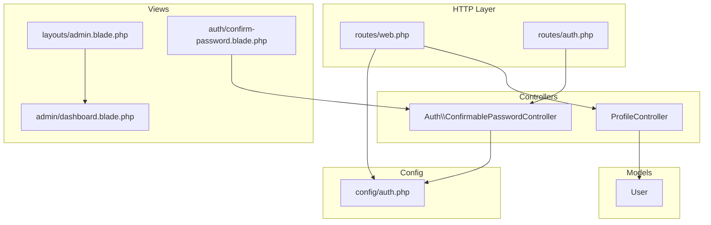
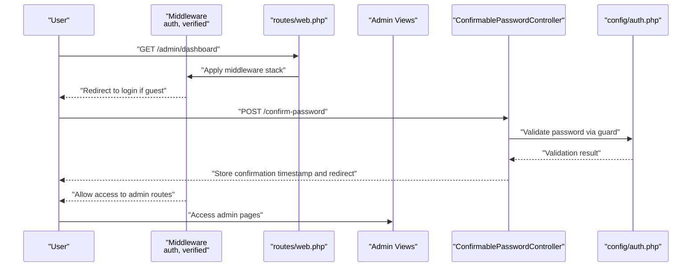
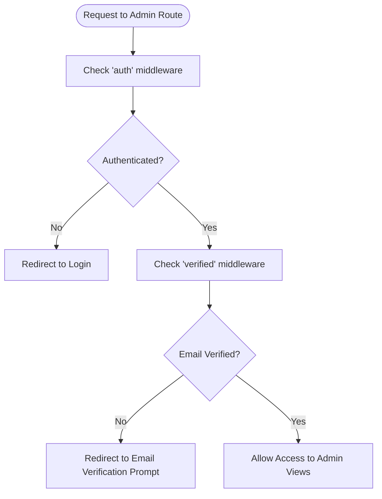
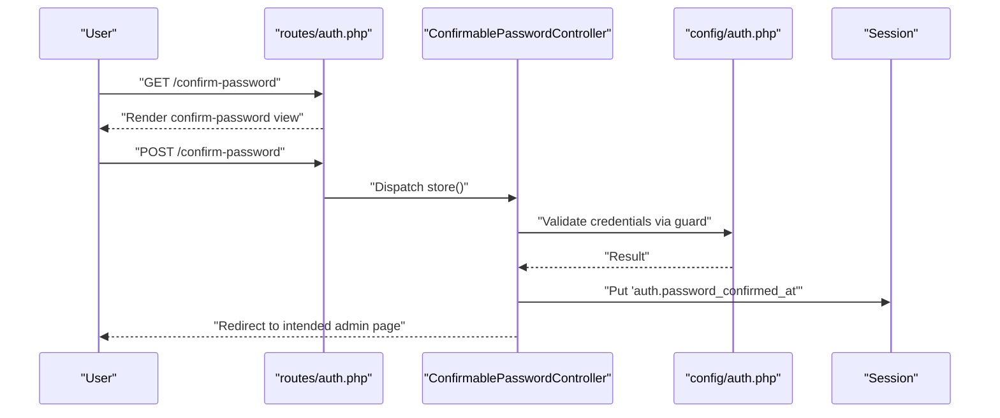
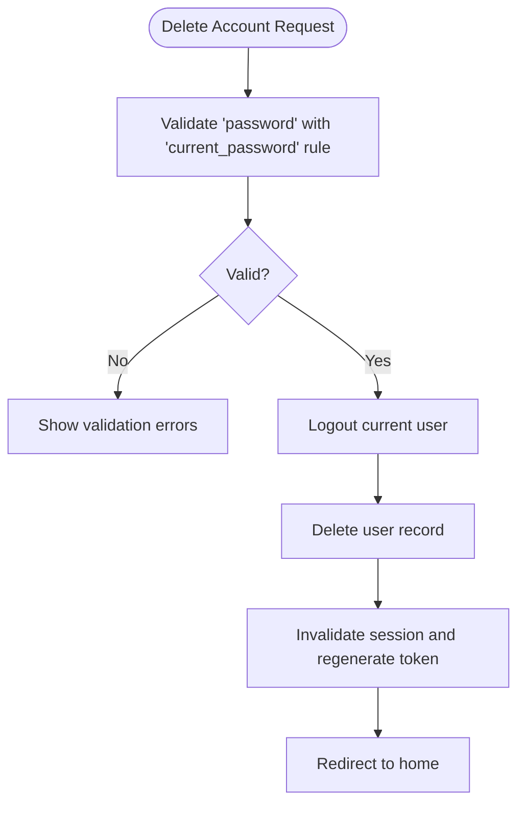
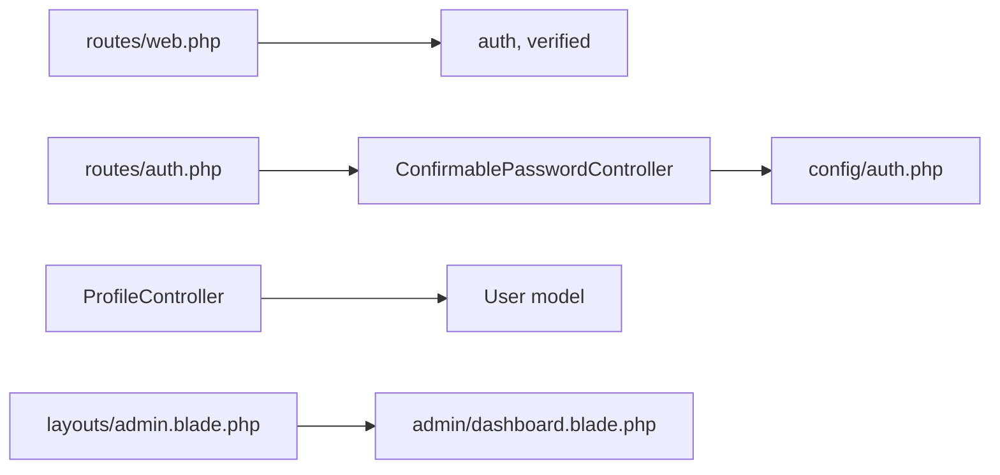

# Authorization Controls

<cite>
**Referenced Files in This Document**
- [routes/web.php](file://routes/web.php)
- [routes/auth.php](file://routes/auth.php)
- [config/auth.php](file://config/auth.php)
- [app/Http/Controllers/Auth/ConfirmablePasswordController.php](file://app/Http/Controllers/Auth/ConfirmablePasswordController.php)
- [app/Http/Controllers/ProfileController.php](file://app/Http/Controllers/ProfileController.php)
- [app/Models/User.php](file://app/Models/User.php)
- [resources/views/admin/dashboard.blade.php](file://resources/views/admin/dashboard.blade.php)
- [resources/views/layouts/admin.blade.php](file://resources/views/layouts/admin.blade.php)
- [resources/views/auth/confirm-password.blade.php](file://resources/views/auth/confirm-password.blade.php)
- [tests/Feature/Auth/PasswordConfirmationTest.php](file://tests/Feature/Auth/PasswordConfirmationTest.php)
</cite>

## Table of Contents
1. [Introduction](#introduction)
2. [Project Structure](#project-structure)
3. [Core Components](#core-components)
4. [Architecture Overview](#architecture-overview)
5. [Detailed Component Analysis](#detailed-component-analysis)
6. [Dependency Analysis](#dependency-analysis)
7. [Performance Considerations](#performance-considerations)
8. [Troubleshooting Guide](#troubleshooting-guide)
9. [Conclusion](#conclusion)

## Introduction
This document explains authorization controls and access management in ClinicalLog CMS. It covers authentication guards, password confirmation requirements, middleware protection, and view-level access control. It also documents how sensitive operations are secured, how administrators are protected during privileged actions, and how to extend authorization with custom logic and policies.

## Project Structure
Authorization in ClinicalLog CMS is implemented through:
- Route-level middleware groups protecting admin areas
- Authentication guard configuration
- Password confirmation controller and view
- Profile controller enforcing current password for destructive actions
- Blade templates rendering admin-only content and navigation

**Diagram sources**
- [routes/web.php:37-74](file://routes/web.php#L37-L74)
- [routes/auth.php:38-59](file://routes/auth.php#L38-L59)
- [config/auth.php:40-45](file://config/auth.php#L40-L45)
- [app/Http/Controllers/Auth/ConfirmablePasswordController.php:12-40](file://app/Http/Controllers/Auth/ConfirmablePasswordController.php#L12-L40)
- [app/Http/Controllers/ProfileController.php:12-61](file://app/Http/Controllers/ProfileController.php#L12-L61)
- [app/Models/User.php:15-33](file://app/Models/User.php#L15-L33)
- [resources/views/layouts/admin.blade.php:1-150](file://resources/views/layouts/admin.blade.php#L1-L150)
- [resources/views/admin/dashboard.blade.php:1-128](file://resources/views/admin/dashboard.blade.php#L1-L128)
- [resources/views/auth/confirm-password.blade.php:1-27](file://resources/views/auth/confirm-password.blade.php#L1-L27)

**Section sources**
- [routes/web.php:37-74](file://routes/web.php#L37-L74)
- [routes/auth.php:38-59](file://routes/auth.php#L38-L59)
- [config/auth.php:40-45](file://config/auth.php#L40-L45)

## Core Components
- Authentication guard and defaults: Session-based guard for the web application.
- Middleware protection: Admin routes are grouped under auth and verified middlewares.
- Password confirmation: Dedicated controller and view for confirming credentials before accessing sensitive areas.
- Profile updates: Validation ensures current password is supplied for destructive actions.
- User model: Standard Eloquent authentication model with hashed passwords.

Key implementation references:
- Authentication guard definition: [config/auth.php:40-45](file://config/auth.php#L40-L45)
- Admin route group with auth and email verification: [routes/web.php:37-74](file://routes/web.php#L37-L74)
- Password confirmation controller: [app/Http/Controllers/Auth/ConfirmablePasswordController.php:12-40](file://app/Http/Controllers/Auth/ConfirmablePasswordController.php#L12-L40)
- Profile update controller enforcing current password: [app/Http/Controllers/ProfileController.php:43-59](file://app/Http/Controllers/ProfileController.php#L43-L59)
- User model password hashing: [app/Models/User.php:25-31](file://app/Models/User.php#L25-L31)

**Section sources**
- [config/auth.php:18-21](file://config/auth.php#L18-L21)
- [routes/web.php:37-74](file://routes/web.php#L37-L74)
- [app/Http/Controllers/Auth/ConfirmablePasswordController.php:12-40](file://app/Http/Controllers/Auth/ConfirmablePasswordController.php#L12-L40)
- [app/Http/Controllers/ProfileController.php:43-59](file://app/Http/Controllers/ProfileController.php#L43-L59)
- [app/Models/User.php:25-31](file://app/Models/User.php#L25-L31)

## Architecture Overview
The authorization architecture combines route-level middleware, authentication configuration, and controller-level checks to protect admin pages and sensitive operations.

**Diagram sources**
- [routes/web.php:37-45](file://routes/web.php#L37-L45)
- [routes/auth.php:50-53](file://routes/auth.php#L50-L53)
- [app/Http/Controllers/Auth/ConfirmablePasswordController.php:25-39](file://app/Http/Controllers/Auth/ConfirmablePasswordController.php#L25-L39)
- [config/auth.php:115](file://config/auth.php#L115)

## Detailed Component Analysis

### Authentication Guard and Defaults
- Default guard is configured as session-based for the web guard.
- Password broker is set for the users table.
- Password confirmation timeout is configurable.

Implementation highlights:
- Defaults: [config/auth.php:18-21](file://config/auth.php#L18-L21)
- Guard definition: [config/auth.php:40-45](file://config/auth.php#L40-L45)
- Password broker: [config/auth.php:95-102](file://config/auth.php#L95-L102)
- Password confirmation timeout: [config/auth.php:115](file://config/auth.php#L115)

**Section sources**
- [config/auth.php:18-21](file://config/auth.php#L18-L21)
- [config/auth.php:40-45](file://config/auth.php#L40-L45)
- [config/auth.php:95-102](file://config/auth.php#L95-L102)
- [config/auth.php:115](file://config/auth.php#L115)

### Middleware Protection for Admin Routes
- Admin dashboard and CMS routes are protected by auth and verified middleware.
- The middleware group encapsulates all admin endpoints.

References:
- Middleware group and admin routes: [routes/web.php:37-74](file://routes/web.php#L37-L74)

**Diagram sources**
- [routes/web.php:37-74](file://routes/web.php#L37-L74)

**Section sources**
- [routes/web.php:37-74](file://routes/web.php#L37-L74)

### Password Confirmation for Sensitive Operations
- A dedicated route exposes a password confirmation screen.
- On successful confirmation, the application stores a confirmation timestamp in the session.
- The confirmation timeout is governed by configuration.

References:
- Route registration: [routes/auth.php:50-53](file://routes/auth.php#L50-L53)
- Controller logic: [app/Http/Controllers/Auth/ConfirmablePasswordController.php:25-39](file://app/Http/Controllers/Auth/ConfirmablePasswordController.php#L25-L39)
- Configuration: [config/auth.php:115](file://config/auth.php#L115)
- Blade view: [resources/views/auth/confirm-password.blade.php:1-27](file://resources/views/auth/confirm-password.blade.php#L1-L27)

**Diagram sources**
- [routes/auth.php:50-53](file://routes/auth.php#L50-L53)
- [app/Http/Controllers/Auth/ConfirmablePasswordController.php:25-39](file://app/Http/Controllers/Auth/ConfirmablePasswordController.php#L25-L39)
- [config/auth.php:115](file://config/auth.php#L115)

**Section sources**
- [routes/auth.php:50-53](file://routes/auth.php#L50-L53)
- [app/Http/Controllers/Auth/ConfirmablePasswordController.php:17-39](file://app/Http/Controllers/Auth/ConfirmablePasswordController.php#L17-L39)
- [config/auth.php:115](file://config/auth.php#L115)
- [resources/views/auth/confirm-password.blade.php:1-27](file://resources/views/auth/confirm-password.blade.php#L1-L27)

### Profile Update Security Measures
- Profile editing and updating are protected by the auth middleware group.
- Account deletion requires confirmation of the current password using the built-in validator.

References:
- Protected profile routes: [routes/web.php:48-50](file://routes/web.php#L48-L50)
- Current password validation for deletion: [app/Http/Controllers/ProfileController.php:45-47](file://app/Http/Controllers/ProfileController.php#L45-L47)

**Diagram sources**
- [app/Http/Controllers/ProfileController.php:43-59](file://app/Http/Controllers/ProfileController.php#L43-L59)

**Section sources**
- [routes/web.php:48-50](file://routes/web.php#L48-L50)
- [app/Http/Controllers/ProfileController.php:43-59](file://app/Http/Controllers/ProfileController.php#L43-L59)

### View-Level Access Control
- Admin layout renders navigation and content blocks only when a user is authenticated.
- Navigation items reflect admin-only routes.

References:
- Admin layout rendering navigation and logout: [resources/views/layouts/admin.blade.php:40-96](file://resources/views/layouts/admin.blade.php#L40-L96)
- Admin dashboard content: [resources/views/admin/dashboard.blade.php:1-128](file://resources/views/admin/dashboard.blade.php#L1-L128)

**Section sources**
- [resources/views/layouts/admin.blade.php:40-96](file://resources/views/layouts/admin.blade.php#L40-L96)
- [resources/views/admin/dashboard.blade.php:1-128](file://resources/views/admin/dashboard.blade.php#L1-L128)

### Password Policy Enforcement and Security Prompts
- Password reset tokens are stored in a dedicated table with expiration and throttling.
- Password confirmation timeout is configurable to reduce exposure windows.

References:
- Password broker configuration: [config/auth.php:95-102](file://config/auth.php#L95-L102)
- Confirmation timeout: [config/auth.php:115](file://config/auth.php#L115)

**Section sources**
- [config/auth.php:95-102](file://config/auth.php#L95-L102)
- [config/auth.php:115](file://config/auth.php#L115)

### Examples of Custom Authorization Logic and Extensibility
- Role-based access control: Extend the User model with roles and gates/policies to enforce permissions per route or resource.
- Permission inheritance: Define abilities and map them to roles; cascade permissions to controllers and views.
- Access control customization: Add custom middleware to check roles before entering admin groups.

Note: The current repository does not include explicit roles or policies. The above describes recommended extensions to implement RBAC and fine-grained permissions.

[No sources needed since this section provides conceptual guidance]

## Dependency Analysis
The authorization subsystem depends on:
- Route middleware stacks for protecting admin routes
- Authentication configuration for guard and broker settings
- Controller actions for password confirmation and profile operations
- Blade templates for rendering admin UI and prompts

**Diagram sources**
- [routes/web.php:37-74](file://routes/web.php#L37-L74)
- [routes/auth.php:38-59](file://routes/auth.php#L38-L59)
- [config/auth.php:40-45](file://config/auth.php#L40-L45)
- [app/Http/Controllers/ProfileController.php:12-61](file://app/Http/Controllers/ProfileController.php#L12-L61)
- [app/Models/User.php:15-33](file://app/Models/User.php#L15-L33)
- [resources/views/layouts/admin.blade.php:1-150](file://resources/views/layouts/admin.blade.php#L1-L150)
- [resources/views/admin/dashboard.blade.php:1-128](file://resources/views/admin/dashboard.blade.php#L1-L128)

**Section sources**
- [routes/web.php:37-74](file://routes/web.php#L37-L74)
- [routes/auth.php:38-59](file://routes/auth.php#L38-L59)
- [config/auth.php:40-45](file://config/auth.php#L40-L45)
- [app/Http/Controllers/ProfileController.php:12-61](file://app/Http/Controllers/ProfileController.php#L12-L61)
- [app/Models/User.php:15-33](file://app/Models/User.php#L15-L33)
- [resources/views/layouts/admin.blade.php:1-150](file://resources/views/layouts/admin.blade.php#L1-L150)
- [resources/views/admin/dashboard.blade.php:1-128](file://resources/views/admin/dashboard.blade.php#L1-L128)

## Performance Considerations
- Keep password confirmation timeout aligned with operational needs to balance security and UX.
- Use caching judiciously for frequently accessed admin dashboards while ensuring stale data is avoided for sensitive operations.
- Minimize heavy computations in middleware; rely on guard and session checks.

[No sources needed since this section provides general guidance]

## Troubleshooting Guide
Common issues and resolutions:
- Users redirected to login despite being authenticated:
  - Verify the session and cookie domain settings; ensure the web guard uses the session driver.
  - References: [config/auth.php:40-45](file://config/auth.php#L40-L45)
- Email verification blocking admin access:
  - Ensure the user’s email is verified; the verified middleware will redirect unverified users.
  - References: [routes/web.php:37-74](file://routes/web.php#L37-L74)
- Password confirmation failing:
  - Confirm the password matches the stored hash; review validation messages and session confirmation timestamp.
  - References: [app/Http/Controllers/Auth/ConfirmablePasswordController.php:25-39](file://app/Http/Controllers/Auth/ConfirmablePasswordController.php#L25-L39), [config/auth.php:115](file://config/auth.php#L115)
- Account deletion not working:
  - Ensure the current password is provided; the controller validates against the current password rule.
  - References: [app/Http/Controllers/ProfileController.php:45-47](file://app/Http/Controllers/ProfileController.php#L45-L47)
- Test coverage for password confirmation:
  - See feature tests validating render, success, and failure scenarios.
  - References: [tests/Feature/Auth/PasswordConfirmationTest.php:13-43](file://tests/Feature/Auth/PasswordConfirmationTest.php#L13-L43)

**Section sources**
- [config/auth.php:40-45](file://config/auth.php#L40-L45)
- [routes/web.php:37-74](file://routes/web.php#L37-L74)
- [app/Http/Controllers/Auth/ConfirmablePasswordController.php:25-39](file://app/Http/Controllers/Auth/ConfirmablePasswordController.php#L25-L39)
- [config/auth.php:115](file://config/auth.php#L115)
- [app/Http/Controllers/ProfileController.php:45-47](file://app/Http/Controllers/ProfileController.php#L45-L47)
- [tests/Feature/Auth/PasswordConfirmationTest.php:13-43](file://tests/Feature/Auth/PasswordConfirmationTest.php#L13-L43)

## Conclusion
ClinicalLog CMS implements robust authorization through route-level middleware, a session-based authentication guard, and a password confirmation mechanism for sensitive operations. Admin access is protected by authentication and email verification, while profile updates require current password validation. Extending the system with roles, gates, and policies enables fine-grained RBAC and permission inheritance. Adhering to the outlined best practices and troubleshooting steps ensures secure and maintainable access control.