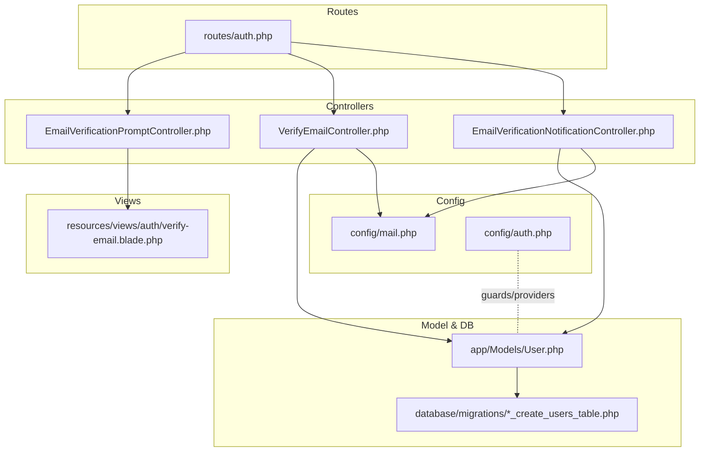
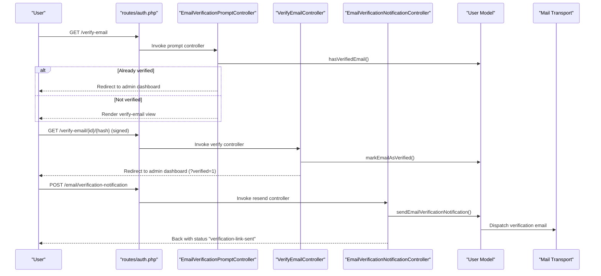
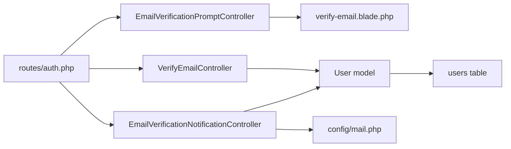
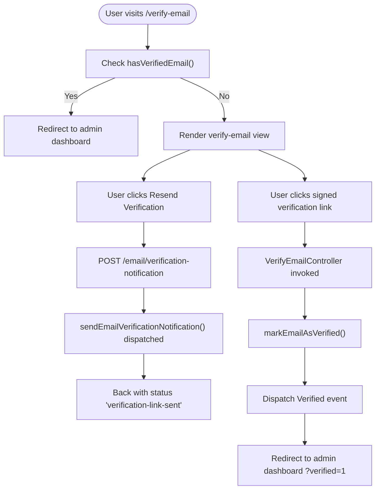

# Email Verification

<cite>
**Referenced Files in This Document**
- [VerifyEmailController.php](file://app/Http/Controllers/Auth/VerifyEmailController.php)
- [EmailVerificationPromptController.php](file://app/Http/Controllers/Auth/EmailVerificationPromptController.php)
- [EmailVerificationNotificationController.php](file://app/Http/Controllers/Auth/EmailVerificationNotificationController.php)
- [verify-email.blade.php](file://resources/views/auth/verify-email.blade.php)
- [auth.php](file://routes/auth.php)
- [User.php](file://app/Models/User.php)
- [0001_01_01_000000_create_users_table.php](file://database/migrations/0001_01_01_000000_create_users_table.php)
- [EmailVerificationTest.php](file://tests/Feature/Auth/EmailVerificationTest.php)
- [mail.php](file://config/mail.php)
- [auth.php](file://config/auth.php)
</cite>

## Table of Contents
1. [Introduction](#introduction)
2. [Project Structure](#project-structure)
3. [Core Components](#core-components)
4. [Architecture Overview](#architecture-overview)
5. [Detailed Component Analysis](#detailed-component-analysis)
6. [Dependency Analysis](#dependency-analysis)
7. [Performance Considerations](#performance-considerations)
8. [Troubleshooting Guide](#troubleshooting-guide)
9. [Conclusion](#conclusion)
10. [Appendices](#appendices)

## Introduction
This document explains the email verification system in ClinicalLog CMS. It covers the end-to-end workflow: verification link generation, email dispatch, and account activation. It documents the controllers responsible for verification, the prompt page, and resending notifications. It also describes token management, throttling, verification status tracking, and user experience enhancements. Guidance is included for customizing templates, integrating with email delivery services, and addressing security considerations.

## Project Structure
The email verification feature spans controllers, routes, Blade views, the User model, and supporting configuration and tests.

**Diagram sources**
- [auth.php:38-48](file://routes/auth.php#L38-L48)
- [VerifyEmailController.php:10-26](file://app/Http/Controllers/Auth/VerifyEmailController.php#L10-L26)
- [EmailVerificationPromptController.php:10-20](file://app/Http/Controllers/Auth/EmailVerificationPromptController.php#L10-L20)
- [EmailVerificationNotificationController.php:9-23](file://app/Http/Controllers/Auth/EmailVerificationNotificationController.php#L9-L23)
- [verify-email.blade.php:1-31](file://resources/views/auth/verify-email.blade.php#L1-L31)
- [User.php:15-31](file://app/Models/User.php#L15-L31)
- [0001_01_01_000000_create_users_table.php:14-22](file://database/migrations/0001_01_01_000000_create_users_table.php#L14-L22)
- [mail.php:17-118](file://config/mail.php#L17-L118)
- [auth.php:40-74](file://config/auth.php#L40-L74)

**Section sources**
- [auth.php:38-48](file://routes/auth.php#L38-L48)
- [verify-email.blade.php:1-31](file://resources/views/auth/verify-email.blade.php#L1-L31)
- [User.php:15-31](file://app/Models/User.php#L15-L31)
- [0001_01_01_000000_create_users_table.php:14-22](file://database/migrations/0001_01_01_000000_create_users_table.php#L14-L22)
- [mail.php:17-118](file://config/mail.php#L17-L118)
- [auth.php:40-74](file://config/auth.php#L40-L74)

## Core Components
- EmailVerificationPromptController: Renders the verification prompt page or redirects if already verified.
- VerifyEmailController: Processes signed verification URLs and marks the user's email as verified.
- EmailVerificationNotificationController: Resends the verification email to unverified users.
- Verification Prompt View: Provides a user-friendly interface to resend verification and log out.
- Routes: Define the verification endpoints, middleware, and throttling.
- Model and Migration: Track verification status and support the verification process.
- Configuration: Configure mail transport and authentication behavior.

**Section sources**
- [EmailVerificationPromptController.php:10-20](file://app/Http/Controllers/Auth/EmailVerificationPromptController.php#L10-L20)
- [VerifyEmailController.php:10-26](file://app/Http/Controllers/Auth/VerifyEmailController.php#L10-L26)
- [EmailVerificationNotificationController.php:9-23](file://app/Http/Controllers/Auth/EmailVerificationNotificationController.php#L9-L23)
- [verify-email.blade.php:1-31](file://resources/views/auth/verify-email.blade.php#L1-L31)
- [auth.php:38-48](file://routes/auth.php#L38-L48)
- [User.php:25-31](file://app/Models/User.php#L25-L31)
- [0001_01_01_000000_create_users_table.php:14-22](file://database/migrations/0001_01_01_000000_create_users_table.php#L14-L22)

## Architecture Overview
The system uses signed, time-limited URLs for verification. Users are prompted to verify their email after registration or when visiting the verification route. They can resend the verification email if needed. Upon successful verification, the user is redirected to the dashboard with a success indicator.

**Diagram sources**
- [auth.php:38-48](file://routes/auth.php#L38-L48)
- [EmailVerificationPromptController.php:15-19](file://app/Http/Controllers/Auth/EmailVerificationPromptController.php#L15-L19)
- [VerifyEmailController.php:15-25](file://app/Http/Controllers/Auth/VerifyEmailController.php#L15-L25)
- [EmailVerificationNotificationController.php:14-22](file://app/Http/Controllers/Auth/EmailVerificationNotificationController.php#L14-L22)
- [User.php:15-31](file://app/Models/User.php#L15-L31)
- [mail.php:17-118](file://config/mail.php#L17-L118)

## Detailed Component Analysis

### EmailVerificationPromptController
Responsibilities:
- Determine whether the current user has verified their email.
- Redirect to the admin dashboard if verified.
- Otherwise, render the verification prompt view.

Behavior highlights:
- Uses the authenticated user’s verification status to decide the response.
- Returns a view for unverified users to take action.

**Section sources**
- [EmailVerificationPromptController.php:10-20](file://app/Http/Controllers/Auth/EmailVerificationPromptController.php#L10-L20)
- [auth.php:39-40](file://routes/auth.php#L39-L40)

### VerifyEmailController
Responsibilities:
- Accept a signed verification request containing user ID and hash.
- Check if the user is already verified; if so, redirect appropriately.
- Mark the user’s email as verified and emit a verification event.
- Redirect to the admin dashboard with a success parameter.

Security and flow:
- Relies on signed routes and a throttle middleware to prevent abuse.
- Uses an EmailVerificationRequest to validate the signed payload.

**Section sources**
- [VerifyEmailController.php:10-26](file://app/Http/Controllers/Auth/VerifyEmailController.php#L10-L26)
- [auth.php:42-44](file://routes/auth.php#L42-L44)

### EmailVerificationNotificationController
Responsibilities:
- Resend the email verification notification to the authenticated user.
- Prevent resending if the user is already verified.
- Provide feedback via a session status message.

User experience:
- After resending, the user sees a success message on the verification prompt page.

**Section sources**
- [EmailVerificationNotificationController.php:9-23](file://app/Http/Controllers/Auth/EmailVerificationNotificationController.php#L9-L23)
- [verify-email.blade.php:6-9](file://resources/views/auth/verify-email.blade.php#L6-L9)
- [auth.php:46-48](file://routes/auth.php#L46-L48)

### Verification Prompt View
Responsibilities:
- Display a friendly message explaining the need to verify the email.
- Provide a button to resend the verification email.
- Offer a logout option.

User experience:
- Uses a status flash message to inform users after resending the verification link.

**Section sources**
- [verify-email.blade.php:1-31](file://resources/views/auth/verify-email.blade.php#L1-L31)

### Routes and Middleware
Endpoints and behavior:
- GET /verify-email → prompt controller
- GET /verify-email/{id}/{hash} → verify controller (signed, throttled)
- POST /email/verification-notification → resend controller (throttled)

Throttling:
- Limits requests per minute to mitigate spam or abuse.

**Section sources**
- [auth.php:38-48](file://routes/auth.php#L38-L48)

### Model and Database
Verification tracking:
- The User model tracks email verification via a timestamp field.
- The users table schema includes a unique email and an optional email verification timestamp.

Casting:
- The email_verified_at field is cast to a datetime for reliable comparisons.

**Section sources**
- [User.php:25-31](file://app/Models/User.php#L25-L31)
- [0001_01_01_000000_create_users_table.php:14-22](file://database/migrations/0001_01_01_000000_create_users_table.php#L14-L22)

### Email Delivery Configuration
Supported transports:
- SMTP, SES, Postmark, Resend, Sendmail, Log, Array, Failover, Roundrobin.

Defaults and overrides:
- Default mailer is configurable via environment variables.
- Global sender identity is configurable.

Integration:
- The resend controller triggers the built-in notification mechanism, which uses the configured mailer.

**Section sources**
- [mail.php:17-118](file://config/mail.php#L17-L118)
- [EmailVerificationNotificationController.php:20-20](file://app/Http/Controllers/Auth/EmailVerificationNotificationController.php#L20-L20)

## Dependency Analysis
High-level dependencies:
- Controllers depend on the User model for verification checks and updates.
- Routes bind controllers to endpoints and apply middleware.
- Views depend on route names and controller actions for forms and links.
- Configuration influences mail transport and authentication behavior.

**Diagram sources**
- [auth.php:38-48](file://routes/auth.php#L38-L48)
- [EmailVerificationPromptController.php:15-19](file://app/Http/Controllers/Auth/EmailVerificationPromptController.php#L15-L19)
- [VerifyEmailController.php:15-25](file://app/Http/Controllers/Auth/VerifyEmailController.php#L15-L25)
- [EmailVerificationNotificationController.php:14-22](file://app/Http/Controllers/Auth/EmailVerificationNotificationController.php#L14-L22)
- [verify-email.blade.php:1-31](file://resources/views/auth/verify-email.blade.php#L1-L31)
- [User.php:15-31](file://app/Models/User.php#L15-L31)
- [0001_01_01_000000_create_users_table.php:14-22](file://database/migrations/0001_01_01_000000_create_users_table.php#L14-L22)
- [mail.php:17-118](file://config/mail.php#L17-L118)

**Section sources**
- [auth.php:38-48](file://routes/auth.php#L38-L48)
- [User.php:15-31](file://app/Models/User.php#L15-L31)
- [mail.php:17-118](file://config/mail.php#L17-L118)

## Performance Considerations
- Throttling: The verification endpoints are throttled to limit repeated requests, reducing load and preventing abuse.
- Signed URLs: Using signed, time-limited URLs avoids storing long-lived tokens in the database.
- Minimal controller logic: Controllers delegate verification and notification tasks to the User model and framework mechanisms, keeping processing lightweight.

[No sources needed since this section provides general guidance]

## Troubleshooting Guide
Common issues and resolutions:
- Link does not work or shows invalid hash:
  - Ensure the signed URL uses the correct user ID and hash.
  - Confirm the route name and signature match the expected pattern.
- Email not received:
  - Verify the configured mailer and credentials.
  - Check logs for delivery failures.
- Already verified but still prompted:
  - The prompt controller checks verification status and redirects accordingly.
- Resend has no effect:
  - Ensure the user is unverified and the resend endpoint is called with proper throttling allowance.

Validation and tests:
- The test suite verifies rendering of the prompt, successful verification with a valid hash, and non-verification with an invalid hash.

**Section sources**
- [EmailVerificationTest.php:16-57](file://tests/Feature/Auth/EmailVerificationTest.php#L16-L57)
- [VerifyEmailController.php:15-25](file://app/Http/Controllers/Auth/VerifyEmailController.php#L15-L25)
- [EmailVerificationPromptController.php:15-19](file://app/Http/Controllers/Auth/EmailVerificationPromptController.php#L15-L19)
- [EmailVerificationNotificationController.php:14-22](file://app/Http/Controllers/Auth/EmailVerificationNotificationController.php#L14-L22)

## Conclusion
ClinicalLog CMS implements a secure and user-friendly email verification system. It leverages signed, time-limited URLs, throttling, and a dedicated prompt page with resend capability. The controllers integrate cleanly with the User model and the configured mail transport, ensuring robust verification and a smooth user experience.

[No sources needed since this section summarizes without analyzing specific files]

## Appendices

### Verification Workflow Flowchart

**Diagram sources**
- [auth.php:38-48](file://routes/auth.php#L38-L48)
- [EmailVerificationPromptController.php:15-19](file://app/Http/Controllers/Auth/EmailVerificationPromptController.php#L15-L19)
- [EmailVerificationNotificationController.php:14-22](file://app/Http/Controllers/Auth/EmailVerificationNotificationController.php#L14-L22)
- [VerifyEmailController.php:15-25](file://app/Http/Controllers/Auth/VerifyEmailController.php#L15-L25)
- [verify-email.blade.php:12-21](file://resources/views/auth/verify-email.blade.php#L12-L21)

### Security Considerations
- Signed routes: Verification links are signed and time-limited, preventing replay attacks.
- Throttling: Limits the rate of verification attempts and resend requests.
- Verified event: Emits a framework event upon successful verification for downstream integrations.
- Hash validation: The verification controller validates the user-provided hash against the stored email.

**Section sources**
- [auth.php:42-44](file://routes/auth.php#L42-L44)
- [VerifyEmailController.php:15-25](file://app/Http/Controllers/Auth/VerifyEmailController.php#L15-L25)

### Template Customization
- Prompt view: Modify the Blade view to adjust messaging, branding, and layout.
- Status messages: Use the session status key to reflect resend outcomes.
- Forms: Ensure form actions align with named routes for verification and resend.

**Section sources**
- [verify-email.blade.php:1-31](file://resources/views/auth/verify-email.blade.php#L1-L31)
- [auth.php:39-48](file://routes/auth.php#L39-L48)

### Batch Verification Processes
- The provided controllers operate per-user. For batch scenarios, implement a queued job that iterates over unverified users and dispatches individual verification notifications using the existing notification mechanism.

[No sources needed since this section provides general guidance]

### Integration with Email Delivery Services
- Configure the desired mailer in the mail configuration.
- Use environment variables to set credentials and transport-specific options.
- Monitor logs or use a dedicated mailer channel for production reliability.

**Section sources**
- [mail.php:17-118](file://config/mail.php#L17-L118)