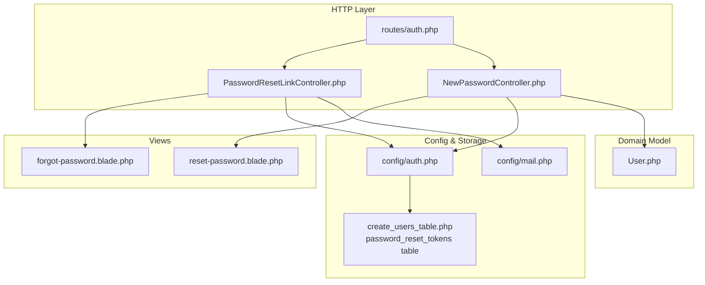
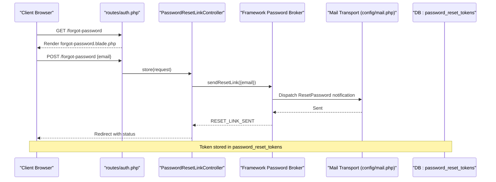
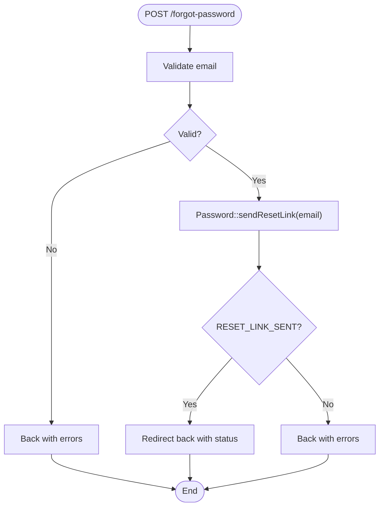
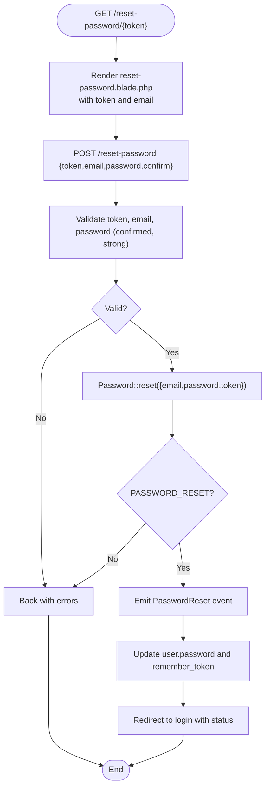
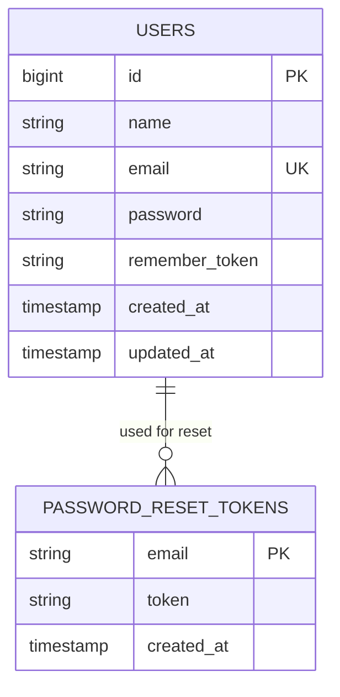
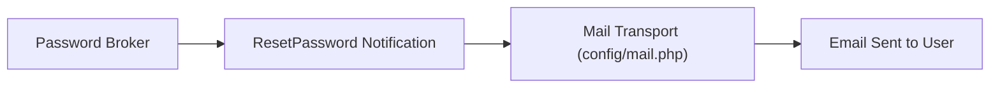
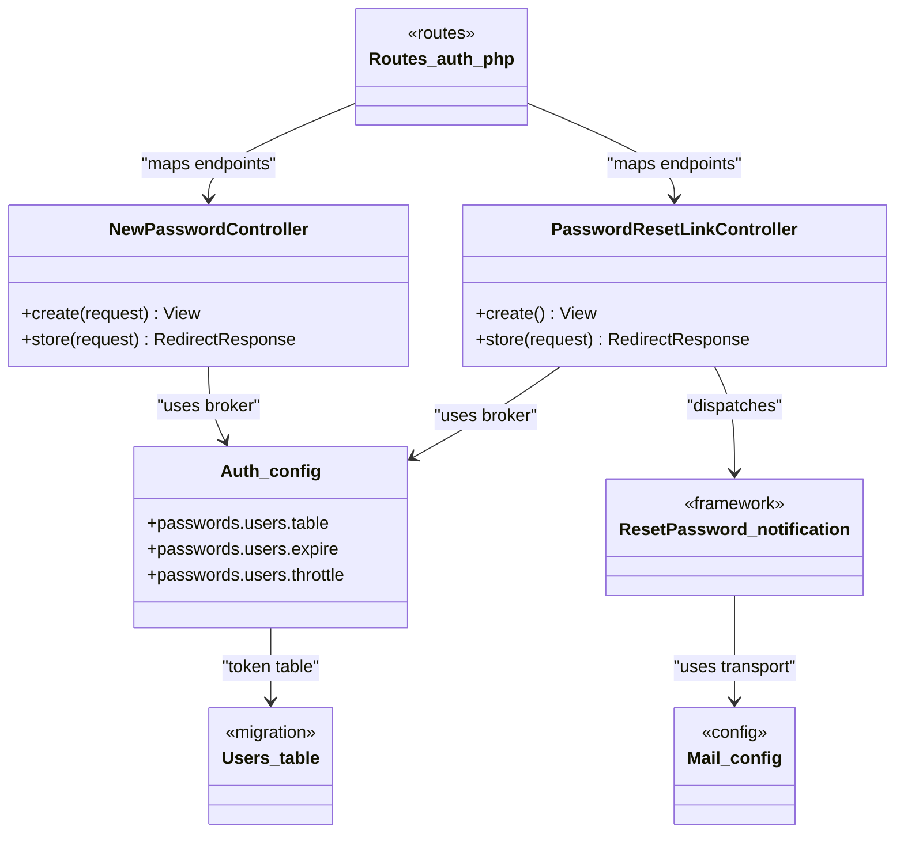

# Password Reset System

<cite>
**Referenced Files in This Document**
- [PasswordResetLinkController.php](file://app/Http/Controllers/Auth/PasswordResetLinkController.php)
- [NewPasswordController.php](file://app/Http/Controllers/Auth/NewPasswordController.php)
- [auth.php](file://config/auth.php)
- [routes/auth.php](file://routes/auth.php)
- [forgot-password.blade.php](file://resources/views/auth/forgot-password.blade.php)
- [reset-password.blade.php](file://resources/views/auth/reset-password.blade.php)
- [create_users_table.php](file://database/migrations/0001_01_01_000000_create_users_table.php)
- [PasswordResetTest.php](file://tests/Feature/Auth/PasswordResetTest.php)
- [mail.php](file://config/mail.php)
- [User.php](file://app/Models/User.php)
</cite>

## Table of Contents
1. [Introduction](#introduction)
2. [Project Structure](#project-structure)
3. [Core Components](#core-components)
4. [Architecture Overview](#architecture-overview)
5. [Detailed Component Analysis](#detailed-component-analysis)
6. [Dependency Analysis](#dependency-analysis)
7. [Performance Considerations](#performance-considerations)
8. [Troubleshooting Guide](#troubleshooting-guide)
9. [Conclusion](#conclusion)

## Introduction
This document describes the password reset system in ClinicalLog CMS. It covers the end-to-end workflow from initiating a password reset request to validating the token and updating the user's password. It documents the ForgotPasswordController and NewPasswordController implementations, validation rules, security measures, email service integration, token storage, expiration handling, and rate limiting. It also provides guidance for customization, multi-step verification enhancements, and troubleshooting.

## Project Structure
The password reset feature spans controllers, routes, Blade templates, configuration, migrations, and tests. The following diagram shows how these pieces fit together.

**Diagram sources**
- [routes/auth.php:14-36](file://routes/auth.php#L14-L36)
- [PasswordResetLinkController.php:17-44](file://app/Http/Controllers/Auth/PasswordResetLinkController.php#L17-L44)
- [NewPasswordController.php:22-62](file://app/Http/Controllers/Auth/NewPasswordController.php#L22-L62)
- [forgot-password.blade.php:1-26](file://resources/views/auth/forgot-password.blade.php#L1-L26)
- [reset-password.blade.php:1-40](file://resources/views/auth/reset-password.blade.php#L1-L40)
- [auth.php:95-102](file://config/auth.php#L95-L102)
- [mail.php:17-119](file://config/mail.php#L17-L119)
- [create_users_table.php:24-28](file://database/migrations/0001_01_01_000000_create_users_table.php#L24-L28)
- [User.php:13-32](file://app/Models/User.php#L13-L32)

**Section sources**
- [routes/auth.php:14-36](file://routes/auth.php#L14-L36)
- [PasswordResetLinkController.php:17-44](file://app/Http/Controllers/Auth/PasswordResetLinkController.php#L17-L44)
- [NewPasswordController.php:22-62](file://app/Http/Controllers/Auth/NewPasswordController.php#L22-L62)
- [forgot-password.blade.php:1-26](file://resources/views/auth/forgot-password.blade.php#L1-L26)
- [reset-password.blade.php:1-40](file://resources/views/auth/reset-password.blade.php#L1-L40)
- [auth.php:95-102](file://config/auth.php#L95-L102)
- [mail.php:17-119](file://config/mail.php#L17-L119)
- [create_users_table.php:24-28](file://database/migrations/0001_01_01_000000_create_users_table.php#L24-L28)
- [User.php:13-32](file://app/Models/User.php#L13-L32)

## Core Components
- PasswordResetLinkController: Handles the initial request to generate and send a password reset link. Validates the email and delegates to the framework’s Password broker to send the reset link.
- NewPasswordController: Renders the reset-password form and validates/updates the user’s password using the token, email, and new password.
- Routes: Define the endpoints for requesting a reset link and submitting the new password.
- Views: Provide the user interface for entering email and setting a new password.
- Configuration: Defines the password reset broker, token table, expiration, and throttling.
- Migration: Creates the password_reset_tokens table used to store reset tokens.
- Tests: Verify the end-to-end flow, including link rendering, token-based reset, and redirection behavior.

**Section sources**
- [PasswordResetLinkController.php:17-44](file://app/Http/Controllers/Auth/PasswordResetLinkController.php#L17-L44)
- [NewPasswordController.php:22-62](file://app/Http/Controllers/Auth/NewPasswordController.php#L22-L62)
- [routes/auth.php:25-35](file://routes/auth.php#L25-L35)
- [forgot-password.blade.php:1-26](file://resources/views/auth/forgot-password.blade.php#L1-L26)
- [reset-password.blade.php:1-40](file://resources/views/auth/reset-password.blade.php#L1-L40)
- [auth.php:95-102](file://config/auth.php#L95-L102)
- [create_users_table.php:24-28](file://database/migrations/0001_01_01_000000_create_users_table.php#L24-L28)
- [PasswordResetTest.php:15-72](file://tests/Feature/Auth/PasswordResetTest.php#L15-L72)

## Architecture Overview
The password reset flow integrates HTTP controllers, routing, validation, the Password broker, notifications, and the database. The following sequence diagram maps the actual code paths.

**Diagram sources**
- [routes/auth.php:25-29](file://routes/auth.php#L25-L29)
- [PasswordResetLinkController.php:27-44](file://app/Http/Controllers/Auth/PasswordResetLinkController.php#L27-L44)
- [auth.php:95-102](file://config/auth.php#L95-L102)
- [mail.php:17-119](file://config/mail.php#L17-L119)
- [create_users_table.php:24-28](file://database/migrations/0001_01_01_000000_create_users_table.php#L24-L28)

## Detailed Component Analysis

### Password Reset Link Request Flow
- Endpoint: GET /forgot-password renders the form; POST /forgot-password triggers the request.
- Validation: Requires a valid email address.
- Execution: Delegates to the Password broker to send a reset link. On success, redirects back with a status; otherwise, returns errors.
- Security: Uses the configured password broker with token table and throttling.

**Diagram sources**
- [PasswordResetLinkController.php:27-44](file://app/Http/Controllers/Auth/PasswordResetLinkController.php#L27-L44)
- [routes/auth.php:25-29](file://routes/auth.php#L25-L29)

**Section sources**
- [PasswordResetLinkController.php:17-44](file://app/Http/Controllers/Auth/PasswordResetLinkController.php#L17-L44)
- [routes/auth.php:25-29](file://routes/auth.php#L25-L29)
- [forgot-password.blade.php:9-24](file://resources/views/auth/forgot-password.blade.php#L9-L24)

### Password Reset Form and Submission
- Endpoint: GET /reset-password/{token} renders the reset-password form with hidden token and prefilled email; POST /reset-password submits the new password.
- Validation: Requires token, email, and a confirmed, strong password.
- Execution: Uses the Password broker to reset the password. On success, clears the token and emits a PasswordReset event; redirects to login with a status. On failure, returns errors.
- Security: Enforces password strength rules and updates the remember token.

**Diagram sources**
- [routes/auth.php:31-35](file://routes/auth.php#L31-L35)
- [NewPasswordController.php:32-62](file://app/Http/Controllers/Auth/NewPasswordController.php#L32-L62)
- [reset-password.blade.php:5-37](file://resources/views/auth/reset-password.blade.php#L5-L37)

**Section sources**
- [NewPasswordController.php:22-62](file://app/Http/Controllers/Auth/NewPasswordController.php#L22-L62)
- [routes/auth.php:31-35](file://routes/auth.php#L31-L35)
- [reset-password.blade.php:1-40](file://resources/views/auth/reset-password.blade.php#L1-L40)

### Token Generation, Storage, and Expiration
- Token storage: The migration creates a password_reset_tokens table with email as primary key, token, and created_at.
- Expiration policy: The auth configuration sets expire to 60 minutes, meaning tokens are valid for 60 minutes after creation.
- Throttling: The auth configuration sets throttle to 60 seconds, limiting how frequently reset links can be generated per user.

**Diagram sources**
- [create_users_table.php:24-28](file://database/migrations/0001_01_01_000000_create_users_table.php#L24-L28)
- [auth.php:98-100](file://config/auth.php#L98-L100)

**Section sources**
- [create_users_table.php:24-28](file://database/migrations/0001_01_01_000000_create_users_table.php#L24-L28)
- [auth.php:95-102](file://config/auth.php#L95-L102)

### Email Notification and Template Customization
- Delivery: The Password broker dispatches a ResetPassword notification through the configured mail transport.
- Templates: The notification class is part of the framework and is responsible for building the email body and subject. To customize the email content, extend or override the notification class and publish/modify the corresponding views.
- Configuration: The mail configuration supports multiple transports (SMTP, SES, Postmark, Resend, Log, Array) and global From address/name settings.

**Diagram sources**
- [PasswordResetLinkController.php:36-38](file://app/Http/Controllers/Auth/PasswordResetLinkController.php#L36-L38)
- [mail.php:17-119](file://config/mail.php#L17-L119)

**Section sources**
- [PasswordResetLinkController.php:36-38](file://app/Http/Controllers/Auth/PasswordResetLinkController.php#L36-L38)
- [mail.php:17-119](file://config/mail.php#L17-L119)

### Validation Rules and Security Measures
- Validation:
  - Email must be present and valid.
  - New password must be confirmed and meet framework defaults (length, character requirements).
  - Token must be present.
- Security:
  - Password hashing is handled automatically during reset.
  - remember_token is regenerated upon successful reset.
  - Token expiration enforced by the broker using the configured expire value.
  - Throttling limits reset link generation frequency.

**Section sources**
- [PasswordResetLinkController.php:29-31](file://app/Http/Controllers/Auth/PasswordResetLinkController.php#L29-L31)
- [NewPasswordController.php:34-38](file://app/Http/Controllers/Auth/NewPasswordController.php#L34-L38)
- [auth.php:98-100](file://config/auth.php#L98-L100)
- [User.php:29](file://app/Models/User.php#L29)

### Multi-Step Verification and Rate Limiting
- Multi-step verification: The existing reset flow is single-step (request link → click link → set password). To add multi-step verification (e.g., CAPTCHA or secondary factor), integrate middleware or pre-validate steps before invoking the Password broker.
- Rate limiting:
  - Password reset link generation is throttled by the broker’s throttle setting.
  - Additional rate limiting can be applied at the route level using Laravel’s throttle middleware if needed.

**Section sources**
- [auth.php:100](file://config/auth.php#L100)
- [routes/auth.php:14-36](file://routes/auth.php#L14-L36)

## Dependency Analysis
The following diagram shows the key dependencies among components involved in the password reset process.

**Diagram sources**
- [routes/auth.php:14-36](file://routes/auth.php#L14-L36)
- [PasswordResetLinkController.php:17-44](file://app/Http/Controllers/Auth/PasswordResetLinkController.php#L17-L44)
- [NewPasswordController.php:22-62](file://app/Http/Controllers/Auth/NewPasswordController.php#L22-L62)
- [auth.php:95-102](file://config/auth.php#L95-L102)
- [create_users_table.php:24-28](file://database/migrations/0001_01_01_000000_create_users_table.php#L24-L28)
- [mail.php:17-119](file://config/mail.php#L17-L119)

**Section sources**
- [routes/auth.php:14-36](file://routes/auth.php#L14-L36)
- [PasswordResetLinkController.php:17-44](file://app/Http/Controllers/Auth/PasswordResetLinkController.php#L17-L44)
- [NewPasswordController.php:22-62](file://app/Http/Controllers/Auth/NewPasswordController.php#L22-L62)
- [auth.php:95-102](file://config/auth.php#L95-L102)
- [create_users_table.php:24-28](file://database/migrations/0001_01_01_000000_create_users_table.php#L24-L28)
- [mail.php:17-119](file://config/mail.php#L17-L119)

## Performance Considerations
- Token table indexing: The password_reset_tokens table uses email as the primary key, which is efficient for lookups by email.
- Expiration cleanup: Consider periodic cleanup of expired tokens to keep the table small and queries fast.
- Queueing notifications: For high-volume deployments, ensure mail transport is configured appropriately and consider queuing notifications to avoid blocking requests.

## Troubleshooting Guide
- Link not received:
  - Verify mail transport configuration and credentials.
  - Confirm the ResetPassword notification is dispatched and delivered.
- Invalid or expired token:
  - Tokens expire after 60 minutes; regenerate a new link if the token is stale.
  - Ensure the token matches the stored token for the user’s email.
- Rate limit exceeded:
  - The throttle setting prevents rapid successive reset link requests; wait for the cooldown period.
- Password reset fails validation:
  - Ensure the password meets strength requirements and confirmation matches.
  - Confirm the token and email are present and correct.

**Section sources**
- [auth.php:98-100](file://config/auth.php#L98-L100)
- [PasswordResetTest.php:22-72](file://tests/Feature/Auth/PasswordResetTest.php#L22-L72)

## Conclusion
ClinicalLog CMS implements a secure and straightforward password reset system using Laravel’s built-in Password broker. The flow is robust: request a reset link, receive an email with a tokenized URL, enter a new password meeting validation rules, and be redirected to the login page. Configuration governs token storage, expiration, and throttling, while the mail configuration enables flexible delivery channels. Extensibility points exist for customizing email templates and adding multi-step verification as needed.