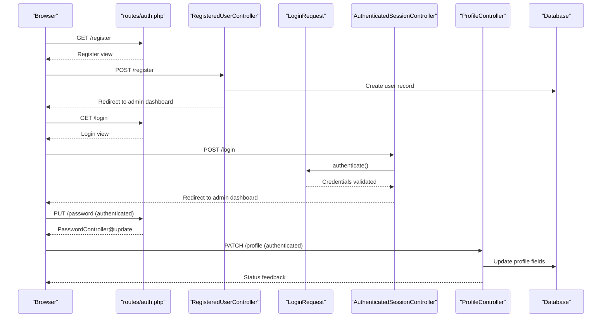
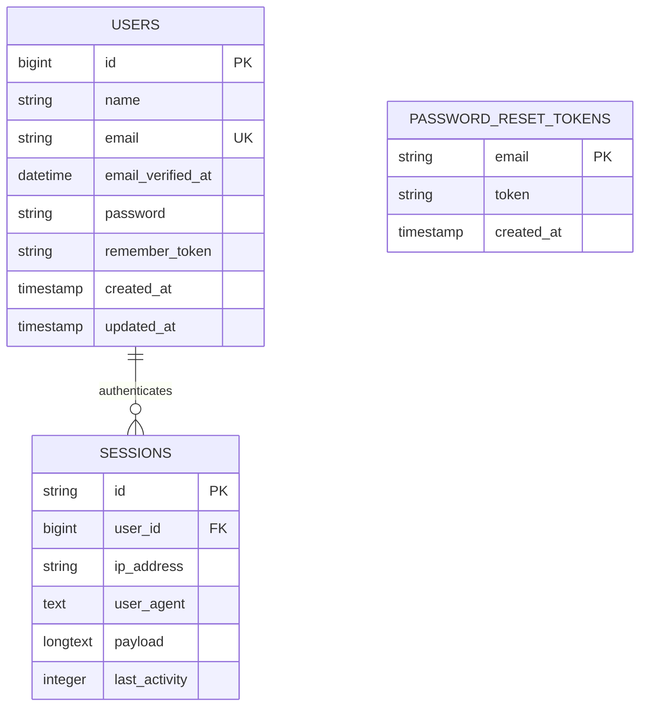
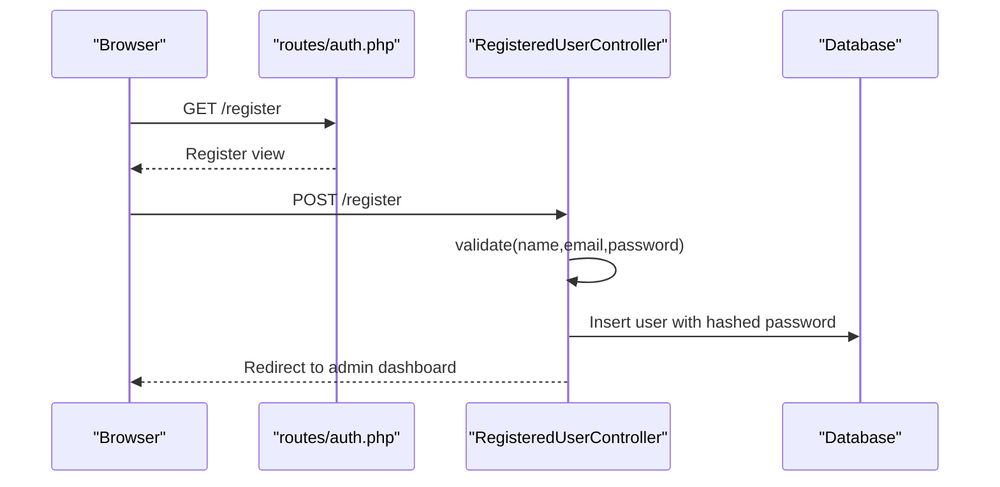
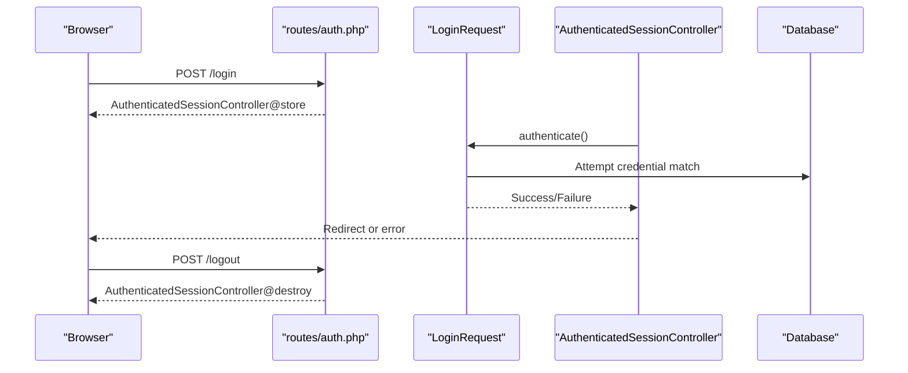
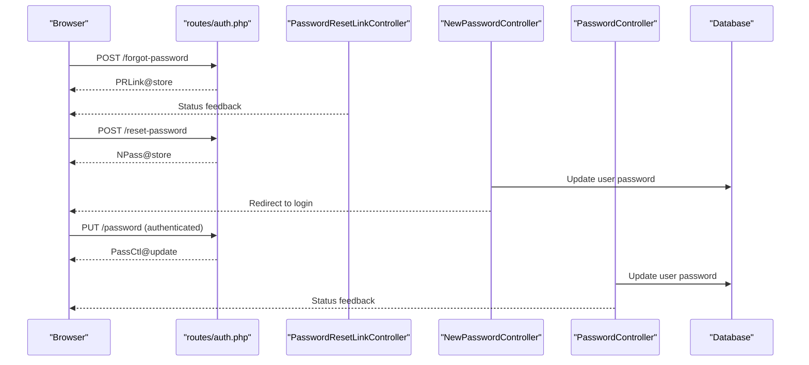
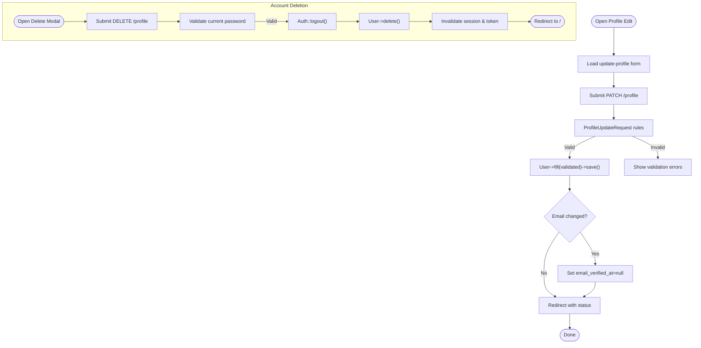
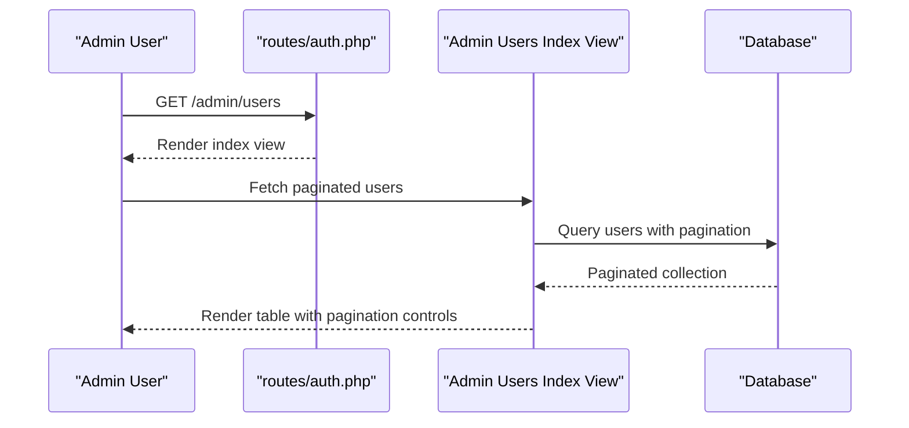
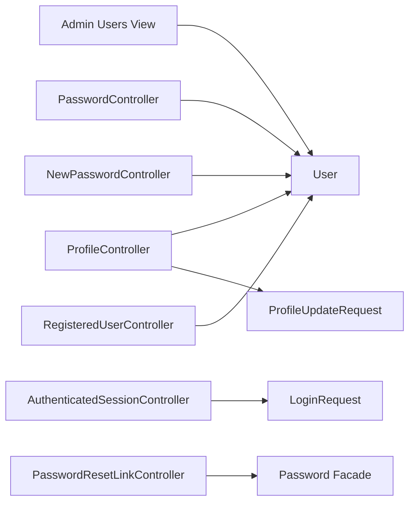

# User Management

<cite>
**Referenced Files in This Document**
- [User.php](file://app/Models/User.php)
- [0001_01_01_000000_create_users_table.php](file://database/migrations/0001_01_01_000000_create_users_table.php)
- [UserFactory.php](file://database/factories/UserFactory.php)
- [RegisteredUserController.php](file://app/Http/Controllers/Auth/RegisteredUserController.php)
- [AuthenticatedSessionController.php](file://app/Http/Controllers/Auth/AuthenticatedSessionController.php)
- [LoginRequest.php](file://app/Http/Requests/Auth/LoginRequest.php)
- [ProfileController.php](file://app/Http/Controllers/ProfileController.php)
- [ProfileUpdateRequest.php](file://app/Http/Requests/ProfileUpdateRequest.php)
- [PasswordController.php](file://app/Http/Controllers/Auth/PasswordController.php)
- [PasswordResetLinkController.php](file://app/Http/Controllers/Auth/PasswordResetLinkController.php)
- [NewPasswordController.php](file://app/Http/Controllers/Auth/NewPasswordController.php)
- [ConfirmablePasswordController.php](file://app/Http/Controllers/Auth/ConfirmablePasswordController.php)
- [auth.php](file://routes/auth.php)
- [index.blade.php](file://resources/views/admin/users/index.blade.php)
- [update-profile-information-form.blade.php](file://resources/views/profile/partials/update-profile-information-form.blade.php)
- [update-password-form.blade.php](file://resources/views/profile/partials/update-password-form.blade.php)
- [delete-user-form.blade.php](file://resources/views/profile/partials/delete-user-form.blade.php)
</cite>

## Table of Contents
1. [Introduction](#introduction)
2. [Project Structure](#project-structure)
3. [Core Components](#core-components)
4. [Architecture Overview](#architecture-overview)
5. [Detailed Component Analysis](#detailed-component-analysis)
6. [Dependency Analysis](#dependency-analysis)
7. [Performance Considerations](#performance-considerations)
8. [Troubleshooting Guide](#troubleshooting-guide)
9. [Conclusion](#conclusion)
10. [Appendices](#appendices)

## Introduction
This document describes the user management system in ClinicalLog CMS. It covers the User model, database schema, registration and authentication flows, profile management, password operations, and administrative user listing. It also outlines validation rules, security measures, and operational guidance for administrators.

## Project Structure
The user management system spans models, migrations, controllers, requests, Blade views, and routing. The following diagram shows how these pieces fit together.

```mermaid
graph TB
subgraph "Model"
U["User Model<br/>app/Models/User.php"]
end
subgraph "Database"
M["Users Migration<br/>database/migrations/..._create_users_table.php"]
F["User Factory<br/>database/factories/UserFactory.php"]
end
subgraph "Auth Controllers"
RUC["RegisteredUserController<br/>app/Http/Controllers/Auth/RegisteredUserController.php"]
ASC["AuthenticatedSessionController<br/>app/Http/Controllers/Auth/AuthenticatedSessionController.php"]
PRC["PasswordResetLinkController<br/>app/Http/Controllers/Auth/PasswordResetLinkController.php"]
NPC["NewPasswordController<br/>app/Http/Controllers/Auth/NewPasswordController.php"]
PC["PasswordController<br/>app/Http/Controllers/Auth/PasswordController.php"]
CPC["ConfirmablePasswordController<br/>app/Http/Controllers/Auth/ConfirmablePasswordController.php"]
end
subgraph "Profile & Forms"
PRCtl["ProfileController<br/>app/Http/Controllers/ProfileController.php"]
PUR["ProfileUpdateRequest<br/>app/Http/Requests/ProfileUpdateRequest.php"]
PF["Profile Views<br/>resources/views/profile/partials/*.blade.php"]
end
subgraph "Routing"
RT["Auth Routes<br/>routes/auth.php"]
end
subgraph "Admin UI"
AUI["Admin Users List<br/>resources/views/admin/users/index.blade.php"]
end
M --> U
F --> U
RT --> RUC
RT --> ASC
RT --> PRC
RT --> NPC
RT --> PC
RT --> CPC
PUR --> PRCtl
PF --> PRCtl
AUI --> U
```

**Diagram sources**
- [User.php:13-31](file://app/Models/User.php#L13-L31)
- [0001_01_01_000000_create_users_table.php:14-22](file://database/migrations/0001_01_01_000000_create_users_table.php#L14-L22)
- [UserFactory.php:25-34](file://database/factories/UserFactory.php#L25-L34)
- [RegisteredUserController.php:31-49](file://app/Http/Controllers/Auth/RegisteredUserController.php#L31-L49)
- [AuthenticatedSessionController.php:25-31](file://app/Http/Controllers/Auth/AuthenticatedSessionController.php#L25-L31)
- [PasswordResetLinkController.php:27-43](file://app/Http/Controllers/Auth/PasswordResetLinkController.php#L27-L43)
- [NewPasswordController.php:32-61](file://app/Http/Controllers/Auth/NewPasswordController.php#L32-L61)
- [PasswordController.php:16-27](file://app/Http/Controllers/Auth/PasswordController.php#L16-L27)
- [ConfirmablePasswordController.php:25-38](file://app/Http/Controllers/Auth/ConfirmablePasswordController.php#L25-L38)
- [ProfileController.php:27-37](file://app/Http/Controllers/ProfileController.php#L27-L37)
- [ProfileUpdateRequest.php:17-29](file://app/Http/Requests/ProfileUpdateRequest.php#L17-L29)
- [auth.php:14-59](file://routes/auth.php#L14-L59)
- [index.blade.php:15-59](file://resources/views/admin/users/index.blade.php#L15-L59)
- [update-profile-information-form.blade.php:16-62](file://resources/views/profile/partials/update-profile-information-form.blade.php#L16-L62)
- [update-password-form.blade.php:12-47](file://resources/views/profile/partials/update-password-form.blade.php#L12-L47)
- [delete-user-form.blade.php:17-54](file://resources/views/profile/partials/delete-user-form.blade.php#L17-L54)

**Section sources**
- [auth.php:14-59](file://routes/auth.php#L14-L59)

## Core Components
- User model: Defines fillable and hidden attributes, and type casting for sensitive fields.
- Database schema: Provides the users table, password reset tokens table, and sessions table.
- Factories: Generate realistic test users for development and testing.
- Authentication controllers: Handle registration, login, logout, password resets, and password confirmation.
- Profile controller and requests: Manage profile updates, password changes, and account deletion.
- Administrative UI: Lists users with pagination and basic metadata.

**Section sources**
- [User.php:13-31](file://app/Models/User.php#L13-L31)
- [0001_01_01_000000_create_users_table.php:14-37](file://database/migrations/0001_01_01_000000_create_users_table.php#L14-L37)
- [UserFactory.php:25-44](file://database/factories/UserFactory.php#L25-L44)
- [RegisteredUserController.php:31-49](file://app/Http/Controllers/Auth/RegisteredUserController.php#L31-L49)
- [AuthenticatedSessionController.php:25-31](file://app/Http/Controllers/Auth/AuthenticatedSessionController.php#L25-L31)
- [ProfileController.php:27-59](file://app/Http/Controllers/ProfileController.php#L27-L59)
- [ProfileUpdateRequest.php:17-29](file://app/Http/Requests/ProfileUpdateRequest.php#L17-L29)
- [PasswordController.php:16-27](file://app/Http/Controllers/Auth/PasswordController.php#L16-L27)
- [PasswordResetLinkController.php:27-43](file://app/Http/Controllers/Auth/PasswordResetLinkController.php#L27-L43)
- [NewPasswordController.php:32-61](file://app/Http/Controllers/Auth/NewPasswordController.php#L32-L61)
- [ConfirmablePasswordController.php:25-38](file://app/Http/Controllers/Auth/ConfirmablePasswordController.php#L25-L38)
- [index.blade.php:15-59](file://resources/views/admin/users/index.blade.php#L15-L59)

## Architecture Overview
The user management system follows Laravel’s MVC pattern with dedicated controllers for authentication and profile operations, form requests for validation, and Blade templates for rendering views. Routing groups separate guest and authenticated flows.

**Diagram sources**
- [auth.php:14-59](file://routes/auth.php#L14-L59)
- [RegisteredUserController.php:31-49](file://app/Http/Controllers/Auth/RegisteredUserController.php#L31-L49)
- [LoginRequest.php:41-54](file://app/Http/Requests/Auth/LoginRequest.php#L41-L54)
- [AuthenticatedSessionController.php:25-31](file://app/Http/Controllers/Auth/AuthenticatedSessionController.php#L25-L31)
- [ProfileController.php:27-37](file://app/Http/Controllers/ProfileController.php#L27-L37)
- [PasswordController.php:16-27](file://app/Http/Controllers/Auth/PasswordController.php#L16-L27)

## Detailed Component Analysis

### User Model and Database Schema
- Model attributes:
  - Fillable: name, email, password
  - Hidden: password, remember_token
  - Casts: email_verified_at as datetime, password as hashed
- Database schema:
  - users table: id, name, email (unique), email_verified_at, password, remember_token, timestamps
  - password_reset_tokens table: email (PK), token, created_at
  - sessions table: id (PK), user_id (FK), ip_address, user_agent, payload, last_activity (indexed)

**Diagram sources**
- [User.php:13-31](file://app/Models/User.php#L13-L31)
- [0001_01_01_000000_create_users_table.php:14-37](file://database/migrations/0001_01_01_000000_create_users_table.php#L14-L37)

**Section sources**
- [User.php:13-31](file://app/Models/User.php#L13-L31)
- [0001_01_01_000000_create_users_table.php:14-37](file://database/migrations/0001_01_01_000000_create_users_table.php#L14-L37)

### User Registration
- Validates name, email (unique), and password confirmation against defaults.
- Creates a hashed password and triggers a registered event.
- Logs the user in and redirects to the admin dashboard.

**Diagram sources**
- [RegisteredUserController.php:31-49](file://app/Http/Controllers/Auth/RegisteredUserController.php#L31-L49)
- [auth.php:14-18](file://routes/auth.php#L14-L18)

**Section sources**
- [RegisteredUserController.php:31-49](file://app/Http/Controllers/Auth/RegisteredUserController.php#L31-L49)

### Authentication and Session Management
- Login validates credentials, enforces rate limiting, and regenerates session on success.
- Logout clears the guard, invalidates the session, and regenerates the CSRF token.
- Password confirmation ensures secure actions requiring current credentials.

**Diagram sources**
- [AuthenticatedSessionController.php:25-46](file://app/Http/Controllers/Auth/AuthenticatedSessionController.php#L25-L46)
- [LoginRequest.php:41-76](file://app/Http/Requests/Auth/LoginRequest.php#L41-L76)
- [auth.php:38-59](file://routes/auth.php#L38-L59)

**Section sources**
- [AuthenticatedSessionController.php:25-46](file://app/Http/Controllers/Auth/AuthenticatedSessionController.php#L25-L46)
- [LoginRequest.php:41-76](file://app/Http/Requests/Auth/LoginRequest.php#L41-L76)
- [ConfirmablePasswordController.php:25-38](file://app/Http/Controllers/Auth/ConfirmablePasswordController.php#L25-L38)

### Password Reset and Management
- Forgot password sends a reset link via the Password facade.
- Reset password form validates token, email, and new password, then updates the user’s password and fires a reset event.
- Change password requires the current password and confirms the new password.

**Diagram sources**
- [PasswordResetLinkController.php:27-43](file://app/Http/Controllers/Auth/PasswordResetLinkController.php#L27-L43)
- [NewPasswordController.php:32-61](file://app/Http/Controllers/Auth/NewPasswordController.php#L32-L61)
- [PasswordController.php:16-27](file://app/Http/Controllers/Auth/PasswordController.php#L16-L27)
- [auth.php:25-55](file://routes/auth.php#L25-L55)

**Section sources**
- [PasswordResetLinkController.php:27-43](file://app/Http/Controllers/Auth/PasswordResetLinkController.php#L27-L43)
- [NewPasswordController.php:32-61](file://app/Http/Controllers/Auth/NewPasswordController.php#L32-L61)
- [PasswordController.php:16-27](file://app/Http/Controllers/Auth/PasswordController.php#L16-L27)

### Profile Management
- Edit profile page renders fields for name and email, including verification prompts when applicable.
- Update profile validates uniqueness of email per user and resets email verification if changed.
- Delete account requires current password confirmation, logs out the user, invalidates the session, and deletes the record.

**Diagram sources**
- [ProfileController.php:27-59](file://app/Http/Controllers/ProfileController.php#L27-L59)
- [ProfileUpdateRequest.php:17-29](file://app/Http/Requests/ProfileUpdateRequest.php#L17-L29)
- [update-profile-information-form.blade.php:16-62](file://resources/views/profile/partials/update-profile-information-form.blade.php#L16-L62)
- [delete-user-form.blade.php:17-54](file://resources/views/profile/partials/delete-user-form.blade.php#L17-L54)

**Section sources**
- [ProfileController.php:17-59](file://app/Http/Controllers/ProfileController.php#L17-L59)
- [ProfileUpdateRequest.php:17-29](file://app/Http/Requests/ProfileUpdateRequest.php#L17-L29)
- [update-profile-information-form.blade.php:16-62](file://resources/views/profile/partials/update-profile-information-form.blade.php#L16-L62)
- [delete-user-form.blade.php:17-54](file://resources/views/profile/partials/delete-user-form.blade.php#L17-L54)

### Administrative User Listing
- Admin view lists users with initials, full name, email, and registration date.
- Supports pagination via the paginator links helper.
- Displays empty state when no users are present.

**Diagram sources**
- [index.blade.php:15-59](file://resources/views/admin/users/index.blade.php#L15-L59)
- [auth.php:38-59](file://routes/auth.php#L38-L59)

**Section sources**
- [index.blade.php:15-59](file://resources/views/admin/users/index.blade.php#L15-L59)

## Dependency Analysis
- Controllers depend on:
  - Eloquent model for persistence
  - Form requests for validation
  - Laravel’s Auth, Hash, Password facades, and RateLimiter
- Views depend on:
  - Blade components and form helpers
  - Route helpers for form actions
- Routes group:
  - Guest middleware for registration/login/reset
  - Auth middleware for verified and authenticated flows

**Diagram sources**
- [RegisteredUserController.php:31-49](file://app/Http/Controllers/Auth/RegisteredUserController.php#L31-L49)
- [AuthenticatedSessionController.php:25-31](file://app/Http/Controllers/Auth/AuthenticatedSessionController.php#L25-L31)
- [PasswordResetLinkController.php:27-43](file://app/Http/Controllers/Auth/PasswordResetLinkController.php#L27-L43)
- [NewPasswordController.php:32-61](file://app/Http/Controllers/Auth/NewPasswordController.php#L32-L61)
- [PasswordController.php:16-27](file://app/Http/Controllers/Auth/PasswordController.php#L16-L27)
- [ProfileController.php:27-37](file://app/Http/Controllers/ProfileController.php#L27-L37)
- [ProfileUpdateRequest.php:17-29](file://app/Http/Requests/ProfileUpdateRequest.php#L17-L29)
- [index.blade.php:15-59](file://resources/views/admin/users/index.blade.php#L15-L59)

**Section sources**
- [auth.php:14-59](file://routes/auth.php#L14-L59)

## Performance Considerations
- Use database indexing on frequently filtered columns (e.g., email) as defined in the migration.
- Prefer batch operations for bulk updates/deletions using chunking to avoid memory spikes.
- Cache infrequently changing user metadata where appropriate.
- Keep password hashing costs aligned with infrastructure capacity to balance security and performance.

## Troubleshooting Guide
- Login throttling: Excessive failed attempts trigger rate limiting; check throttle key composition and IP handling.
- Email verification: Changing the email resets verification; ensure resend flow is triggered after updates.
- Password reset failures: Validate token presence, email correctness, and password policy compliance.
- Session invalidation: After account deletion, ensure logout and token regeneration occur to prevent session hijacking.
- Validation errors: Review form request rules and error bag names used in views.

**Section sources**
- [LoginRequest.php:61-76](file://app/Http/Requests/Auth/LoginRequest.php#L61-L76)
- [ProfileController.php:31-33](file://app/Http/Controllers/ProfileController.php#L31-L33)
- [PasswordResetLinkController.php:27-43](file://app/Http/Controllers/Auth/PasswordResetLinkController.php#L27-L43)
- [NewPasswordController.php:32-61](file://app/Http/Controllers/Auth/NewPasswordController.php#L32-L61)
- [AuthenticatedSessionController.php:37-46](file://app/Http/Controllers/Auth/AuthenticatedSessionController.php#L37-L46)
- [delete-user-form.blade.php:45-56](file://resources/views/profile/partials/delete-user-form.blade.php#L45-L56)

## Conclusion
ClinicalLog CMS implements a robust, standards-aligned user management system with strong validation, secure authentication, and clear separation of concerns across controllers, models, and views. Administrators can manage users through the provided UI, while end users can update profiles, change passwords, and delete accounts securely.

## Appendices

### User Data Validation Rules
- Registration: name required, email required/unique, password required and confirmed with defaults.
- Login: email and password required; throttled on failure.
- Profile update: name required, email required, lowercase, email, max length, unique per user.
- Password change: current password required, new password required and confirmed with defaults.
- Account deletion: password confirmation required.

**Section sources**
- [RegisteredUserController.php:33-37](file://app/Http/Controllers/Auth/RegisteredUserController.php#L33-L37)
- [LoginRequest.php:28-34](file://app/Http/Requests/Auth/LoginRequest.php#L28-L34)
- [ProfileUpdateRequest.php:19-29](file://app/Http/Requests/ProfileUpdateRequest.php#L19-L29)
- [PasswordController.php:18-21](file://app/Http/Controllers/Auth/PasswordController.php#L18-L21)
- [ProfileController.php:45-47](file://app/Http/Controllers/ProfileController.php#L45-L47)

### Security and Privacy Notes
- Passwords are hashed upon creation and updates.
- Sensitive attributes are hidden from mass assignment and JSON serialization.
- Sessions are stored with indexed activity for efficient cleanup.
- Email verification is enforced; changing the email resets verification until re-confirmation.
- Rate limiting protects login attempts; logout invalidates sessions and regenerates tokens.

**Section sources**
- [User.php:13-31](file://app/Models/User.php#L13-L31)
- [0001_01_01_000000_create_users_table.php:14-37](file://database/migrations/0001_01_01_000000_create_users_table.php#L14-L37)
- [LoginRequest.php:61-76](file://app/Http/Requests/Auth/LoginRequest.php#L61-L76)
- [AuthenticatedSessionController.php:37-46](file://app/Http/Controllers/Auth/AuthenticatedSessionController.php#L37-L46)
- [ProfileController.php:31-33](file://app/Http/Controllers/ProfileController.php#L31-L33)