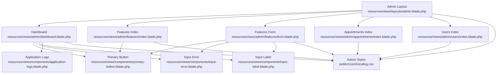
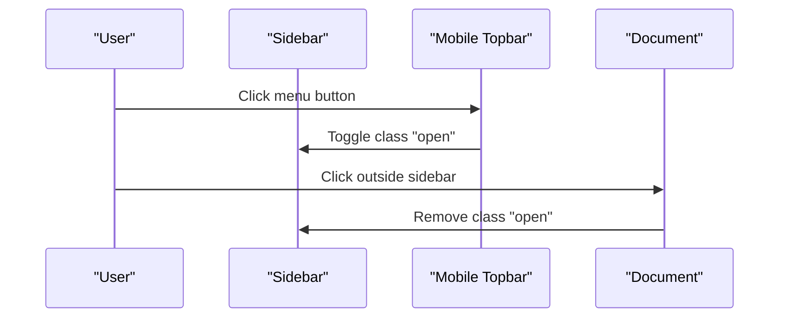
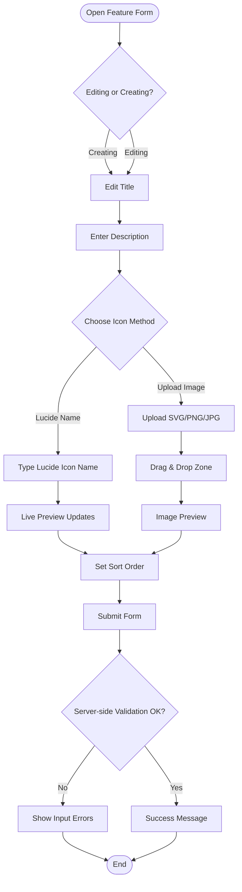
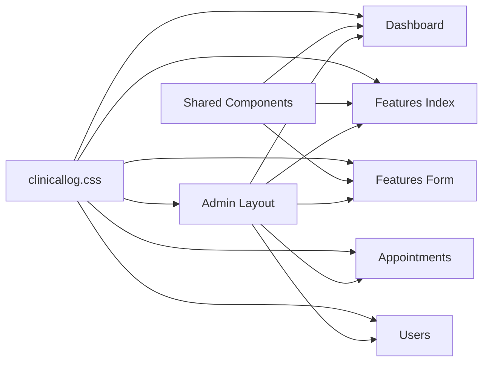

# Administrative Interface & User Experience

<cite>
**Referenced Files in This Document**
- [admin.blade.php](file://resources/views/layouts/admin.blade.php)
- [dashboard.blade.php](file://resources/views/admin/dashboard.blade.php)
- [features/index.blade.php](file://resources/views/admin/features/index.blade.php)
- [features/form.blade.php](file://resources/views/admin/features/form.blade.php)
- [appointments/index.blade.php](file://resources/views/admin/appointments/index.blade.php)
- [users/index.blade.php](file://resources/views/admin/users/index.blade.php)
- [clinicallog.css](file://public/css/clinicallog.css)
- [application-logo.blade.php](file://resources/views/components/application-logo.blade.php)
- [input-error.blade.php](file://resources/views/components/input-error.blade.php)
- [input-label.blade.php](file://resources/views/components/input-label.blade.php)
- [primary-button.blade.php](file://resources/views/components/primary-button.blade.php)
- [navigation.blade.php](file://resources/views/layouts/navigation.blade.php)
- [dropdown.blade.php](file://resources/views/components/dropdown.blade.php)
- [modal.blade.php](file://resources/views/components/modal.blade.php)
- [nav-link.blade.php](file://resources/views/components/nav-link.blade.php)
</cite>

## Table of Contents
1. [Introduction](#introduction)
2. [Project Structure](#project-structure)
3. [Core Components](#core-components)
4. [Architecture Overview](#architecture-overview)
5. [Detailed Component Analysis](#detailed-component-analysis)
6. [Dependency Analysis](#dependency-analysis)
7. [Performance Considerations](#performance-considerations)
8. [Troubleshooting Guide](#troubleshooting-guide)
9. [Conclusion](#conclusion)

## Introduction
This document describes the administrative interface and user experience design of the content management system. It focuses on the Blade template structure, component integration, responsive design, form validation feedback, success/error messaging, and user interaction patterns. It also documents the integration with Tailwind CSS for styling, Alpine.js for interactive elements, and the overall admin layout structure. Examples of common administrative tasks, navigation patterns, accessibility considerations, browser compatibility, mobile responsiveness, and performance optimization are included.

## Project Structure
The admin interface is built with Blade templates organized under the resources/views directory. The admin layout extends a base admin template that provides the sidebar, topbar, flash messages, and responsive behavior. Individual admin pages (dashboard, features, appointments, users) extend the admin layout and render domain-specific content. Shared UI components (buttons, inputs, dropdowns, modals) are implemented as Blade components for reuse.

```mermaid
graph TB
subgraph "Admin Layout"
A["resources/views/layouts/admin.blade.php"]
end
subgraph "Admin Pages"
D["resources/views/admin/dashboard.blade.php"]
FIdx["resources/views/admin/features/index.blade.php"]
FFrm["resources/views/admin/features/form.blade.php"]
Apts["resources/views/admin/appointments/index.blade.php"]
UIdx["resources/views/admin/users/index.blade.php"]
end
subgraph "Shared Components"
Btn["resources/views/components/primary-button.blade.php"]
InErr["resources/views/components/input-error.blade.php"]
InLbl["resources/views/components/input-label.blade.php"]
Logo["resources/views/components/application-logo.blade.php"]
Drop["resources/views/components/dropdown.blade.php"]
Modal["resources/views/components/modal.blade.php"]
NavLink["resources/views/components/nav-link.blade.php"]
end
subgraph "Styling"
CSS["public/css/clinicallog.css"]
end
A --> D
A --> FIdx
A --> FFrm
A --> Apts
A --> UIdx
D --> Btn
D --> InErr
D --> InLbl
D --> Logo
FIdx --> Btn
FFrm --> Btn
FFrm --> InErr
FFrm --> InLbl
A --> CSS
D --> CSS
FIdx --> CSS
FFrm --> CSS
Apts --> CSS
UIdx --> CSS
```

**Diagram sources**
- [admin.blade.php:1-150](file://resources/views/layouts/admin.blade.php#L1-L150)
- [dashboard.blade.php:1-128](file://resources/views/admin/dashboard.blade.php#L1-L128)
- [features/index.blade.php:1-109](file://resources/views/admin/features/index.blade.php#L1-L109)
- [features/form.blade.php:1-298](file://resources/views/admin/features/form.blade.php#L1-L298)
- [appointments/index.blade.php:1-93](file://resources/views/admin/appointments/index.blade.php#L1-L93)
- [users/index.blade.php:1-63](file://resources/views/admin/users/index.blade.php#L1-L63)
- [clinicallog.css:669-796](file://public/css/clinicallog.css#L669-L796)
- [primary-button.blade.php:1-4](file://resources/views/components/primary-button.blade.php#L1-L4)
- [input-error.blade.php:1-10](file://resources/views/components/input-error.blade.php#L1-L10)
- [input-label.blade.php:1-6](file://resources/views/components/input-label.blade.php#L1-L6)
- [application-logo.blade.php:1-4](file://resources/views/components/application-logo.blade.php#L1-L4)
- [dropdown.blade.php:1-36](file://resources/views/components/dropdown.blade.php#L1-L36)
- [modal.blade.php:1-79](file://resources/views/components/modal.blade.php#L1-L79)
- [nav-link.blade.php:1-12](file://resources/views/components/nav-link.blade.php#L1-L12)

**Section sources**
- [admin.blade.php:1-150](file://resources/views/layouts/admin.blade.php#L1-L150)
- [clinicallog.css:669-796](file://public/css/clinicallog.css#L669-L796)

## Core Components
- Admin layout: Provides the sidebar navigation, topbar, mobile toggle, flash message rendering, and script stack for icons and behavior.
- Admin pages: Dashboard, Features (index and form), Appointments, and Users pages extend the admin layout and render domain-specific content.
- Shared components: Buttons, input label/error, and application logo enable consistent UI across forms and lists.
- Styling: Tailwind-based CSS with custom tokens and admin-specific styles for glass cards, tables, forms, and responsive breakpoints.

Key responsibilities:
- Layout: Manage global navigation, branding, user profile, logout, and responsive sidebar behavior.
- Pages: Render domain data, forms, pagination, and actions.
- Components: Encapsulate reusable UI elements with consistent styling and behavior.
- Styles: Provide responsive design, glass effects, and admin-specific layout utilities.

**Section sources**
- [admin.blade.php:1-150](file://resources/views/layouts/admin.blade.php#L1-L150)
- [dashboard.blade.php:1-128](file://resources/views/admin/dashboard.blade.php#L1-L128)
- [features/index.blade.php:1-109](file://resources/views/admin/features/index.blade.php#L1-L109)
- [features/form.blade.php:1-298](file://resources/views/admin/features/form.blade.php#L1-L298)
- [appointments/index.blade.php:1-93](file://resources/views/admin/appointments/index.blade.php#L1-L93)
- [users/index.blade.php:1-63](file://resources/views/admin/users/index.blade.php#L1-L63)
- [clinicallog.css:669-796](file://public/css/clinicallog.css#L669-L796)
- [primary-button.blade.php:1-4](file://resources/views/components/primary-button.blade.php#L1-L4)
- [input-error.blade.php:1-10](file://resources/views/components/input-error.blade.php#L1-L10)
- [input-label.blade.php:1-6](file://resources/views/components/input-label.blade.php#L1-L6)
- [application-logo.blade.php:1-4](file://resources/views/components/application-logo.blade.php#L1-L4)

## Architecture Overview
The admin architecture follows a layered Blade pattern:
- Base layout defines the shell and shared behavior.
- Domain pages encapsulate presentation logic and data rendering.
- Components encapsulate reusable UI elements.
- Styles define responsive and theme-consistent visuals.

**Diagram sources**
- [admin.blade.php:1-150](file://resources/views/layouts/admin.blade.php#L1-L150)
- [dashboard.blade.php:1-128](file://resources/views/admin/dashboard.blade.php#L1-L128)
- [features/index.blade.php:1-109](file://resources/views/admin/features/index.blade.php#L1-L109)
- [features/form.blade.php:1-298](file://resources/views/admin/features/form.blade.php#L1-L298)
- [appointments/index.blade.php:1-93](file://resources/views/admin/appointments/index.blade.php#L1-L93)
- [users/index.blade.php:1-63](file://resources/views/admin/users/index.blade.php#L1-L63)
- [clinicallog.css:669-796](file://public/css/clinicallog.css#L669-L796)
- [primary-button.blade.php:1-4](file://resources/views/components/primary-button.blade.php#L1-L4)
- [input-error.blade.php:1-10](file://resources/views/components/input-error.blade.php#L1-L10)
- [input-label.blade.php:1-6](file://resources/views/components/input-label.blade.php#L1-L6)
- [application-logo.blade.php:1-4](file://resources/views/components/application-logo.blade.php#L1-L4)

## Detailed Component Analysis

### Admin Layout and Navigation
The admin layout sets up the global structure:
- Head includes CSRF meta tag, Inter font, and Tailwind CDN.
- Body renders background orbs, admin layout container, sidebar, and main content area.
- Sidebar contains brand, navigation links, grouped sections, and user profile with logout.
- Mobile topbar toggles the sidebar on small screens.
- Flash messages render success and error notifications.
- Scripts load Lucide icons and attach click-outside behavior to close the sidebar.

Responsive behavior:
- Sidebar transforms off-screen on small screens and becomes overlay when opened.
- Mobile topbar displays a menu button and title.

Accessibility:
- Navigation has roles and labels for assistive technologies.
- Logout uses a semantic form submission.

**Diagram sources**
- [admin.blade.php:103-145](file://resources/views/layouts/admin.blade.php#L103-L145)

**Section sources**
- [admin.blade.php:1-150](file://resources/views/layouts/admin.blade.php#L1-L150)

### Dashboard
The dashboard page:
- Extends the admin layout and sets the page title.
- Renders a topbar with page title and quick action button.
- Displays stat cards with counts and icons.
- Shows quick actions and recent features table with edit links.
- Uses a grid layout for responsive arrangement.

Common tasks:
- Add new feature via quick action.
- Navigate to recent feature edit.
- View statistics overview.

**Section sources**
- [dashboard.blade.php:1-128](file://resources/views/admin/dashboard.blade.php#L1-L128)

### Features Management
Feature index page:
- Lists features with sortable columns, icon previews, and actions.
- Supports pagination and empty state.
- Actions include edit and delete with confirmation.

Feature form page:
- Two-column layout: form on the left, tips panel on the right.
- Form supports saving and canceling, with validation feedback.
- Icon selection supports Lucide icon name input with live preview or image upload with drag-and-drop and preview.
- Sort order field with dynamic min/max and hints.
- Tips panel provides writing guidelines and Lucide icon examples.
- Delete section for removing features with confirmation.

Validation feedback:
- Input labels and errors rendered via shared components.
- Validation messages displayed below fields.

**Diagram sources**
- [features/form.blade.php:1-298](file://resources/views/admin/features/form.blade.php#L1-L298)
- [input-error.blade.php:1-10](file://resources/views/components/input-error.blade.php#L1-L10)
- [input-label.blade.php:1-6](file://resources/views/components/input-label.blade.php#L1-L6)

**Section sources**
- [features/index.blade.php:1-109](file://resources/views/admin/features/index.blade.php#L1-L109)
- [features/form.blade.php:1-298](file://resources/views/admin/features/form.blade.php#L1-L298)
- [input-error.blade.php:1-10](file://resources/views/components/input-error.blade.php#L1-L10)
- [input-label.blade.php:1-6](file://resources/views/components/input-label.blade.php#L1-L6)

### Appointments Management
The appointments page:
- Displays a table of appointment requests with contact info, schedule, notes, and status.
- Status is updated via an inline select with immediate submit.
- Supports deleting appointments with confirmation.
- Includes pagination and empty state.

User interactions:
- Inline status change updates server state immediately.
- Confirmation dialogs prevent accidental deletions.

**Section sources**
- [appointments/index.blade.php:1-93](file://resources/views/admin/appointments/index.blade.php#L1-L93)

### Users Management
The users page:
- Lists registered users with initials avatar, name, email, and registration date.
- Supports pagination and empty state.

**Section sources**
- [users/index.blade.php:1-63](file://resources/views/admin/users/index.blade.php#L1-L63)

### Shared Components
- Primary button: Standardized submit button with hover/focus states.
- Input label and error: Consistent labeling and validation messaging.
- Application logo: Reusable SVG logo component.
- Dropdown and modal: Alpine-driven components for menus and dialogs.
- Navigation link: Active state styling for navigation items.

Integration:
- Components are used across admin pages to maintain consistency.
- Alpine.js directives power interactive behaviors in navigation and modals.

**Section sources**
- [primary-button.blade.php:1-4](file://resources/views/components/primary-button.blade.php#L1-L4)
- [input-label.blade.php:1-6](file://resources/views/components/input-label.blade.php#L1-L6)
- [input-error.blade.php:1-10](file://resources/views/components/input-error.blade.php#L1-L10)
- [application-logo.blade.php:1-4](file://resources/views/components/application-logo.blade.php#L1-L4)
- [dropdown.blade.php:1-36](file://resources/views/components/dropdown.blade.php#L1-L36)
- [modal.blade.php:1-79](file://resources/views/components/modal.blade.php#L1-L79)
- [nav-link.blade.php:1-12](file://resources/views/components/nav-link.blade.php#L1-L12)
- [navigation.blade.php:1-101](file://resources/views/layouts/navigation.blade.php#L1-L101)

## Dependency Analysis
The admin pages depend on the admin layout and share components. Styling is centralized in the CSS file with admin-specific selectors. Alpine.js is used for navigation and modal behaviors.

**Diagram sources**
- [admin.blade.php:1-150](file://resources/views/layouts/admin.blade.php#L1-L150)
- [dashboard.blade.php:1-128](file://resources/views/admin/dashboard.blade.php#L1-L128)
- [features/index.blade.php:1-109](file://resources/views/admin/features/index.blade.php#L1-L109)
- [features/form.blade.php:1-298](file://resources/views/admin/features/form.blade.php#L1-L298)
- [appointments/index.blade.php:1-93](file://resources/views/admin/appointments/index.blade.php#L1-L93)
- [users/index.blade.php:1-63](file://resources/views/admin/users/index.blade.php#L1-L63)
- [clinicallog.css:669-796](file://public/css/clinicallog.css#L669-L796)
- [primary-button.blade.php:1-4](file://resources/views/components/primary-button.blade.php#L1-L4)
- [input-error.blade.php:1-10](file://resources/views/components/input-error.blade.php#L1-L10)
- [input-label.blade.php:1-6](file://resources/views/components/input-label.blade.php#L1-L6)

**Section sources**
- [admin.blade.php:1-150](file://resources/views/layouts/admin.blade.php#L1-L150)
- [clinicallog.css:669-796](file://public/css/clinicallog.css#L669-L796)

## Performance Considerations
- Asset delivery: Tailwind CSS is loaded from CDN; consider bundling for production to reduce latency.
- Font loading: Inter font is preconnected; ensure efficient caching.
- JavaScript: Lucide icons are initialized once; avoid redundant re-initialization.
- Images: Feature icon uploads support SVG/PNG/JPG; enforce size limits server-side.
- Rendering: Large tables and lists benefit from pagination; keep rows minimal per page.
- CSS: Centralized admin styles reduce duplication; avoid excessive inline styles.

[No sources needed since this section provides general guidance]

## Troubleshooting Guide
Common issues and resolutions:
- Flash messages not visible: Ensure session keys "success" and "error" are set before rendering the admin layout.
- Sidebar not closing on mobile: Verify click-outside event handler targets the sidebar and toggle elements.
- Icon preview not updating: Confirm Lucide initialization is called after DOM updates and debounced input handling.
- Form validation errors not shown: Ensure validation messages are passed to the input-error component and rendered below fields.
- Status updates not applying: Confirm the inline select triggers form submission and server endpoint handles PATCH.

**Section sources**
- [admin.blade.php:112-125](file://resources/views/layouts/admin.blade.php#L112-L125)
- [admin.blade.php:137-144](file://resources/views/layouts/admin.blade.php#L137-L144)
- [features/form.blade.php:235-296](file://resources/views/admin/features/form.blade.php#L235-L296)
- [input-error.blade.php:1-10](file://resources/views/components/input-error.blade.php#L1-L10)
- [appointments/index.blade.php:60-69](file://resources/views/admin/appointments/index.blade.php#L60-L69)

## Conclusion
The administrative interface leverages a clean Blade-based architecture with a cohesive layout, reusable components, and a tailored stylesheet. It provides responsive navigation, robust form interactions with validation feedback, and accessible user controls powered by Alpine.js. By following the documented patterns and best practices, administrators can efficiently manage content while maintaining a consistent, performant, and accessible experience.