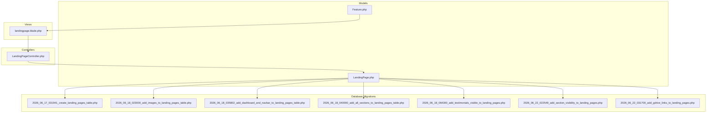
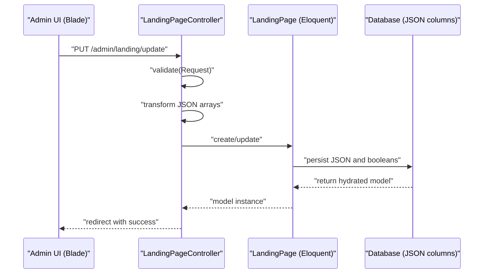
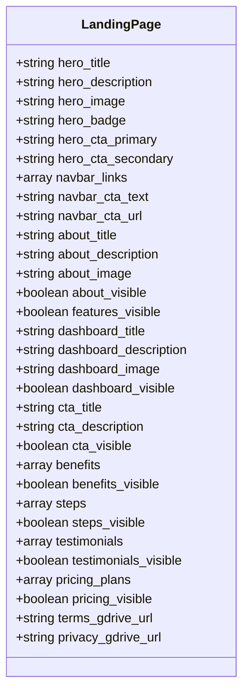
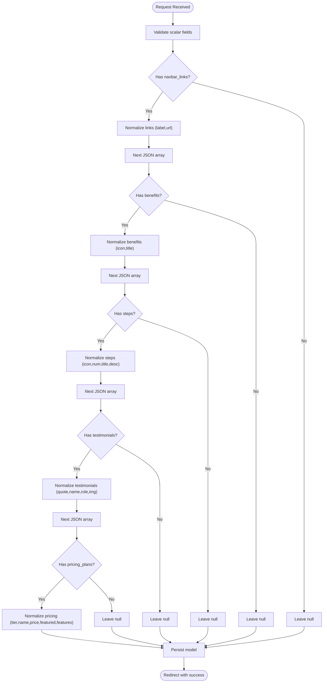
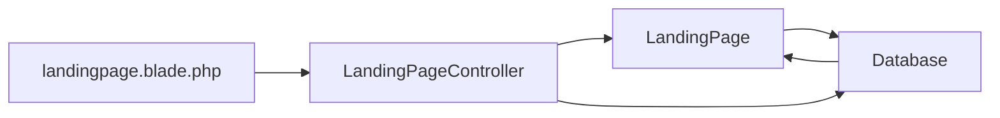

# Content Data Models & JSON Structures

<cite>
**Referenced Files in This Document**
- [LandingPage.php](file://app/Models/LandingPage.php)
- [LandingPageController.php](file://app/Http/Controllers/LandingPageController.php)
- [2026_06_17_031941_create_landing_pages_table.php](file://database/migrations/2026_06_17_031941_create_landing_pages_table.php)
- [2026_06_18_023000_add_images_to_landing_pages_table.php](file://database/migrations/2026_06_18_023000_add_images_to_landing_pages_table.php)
- [2026_06_18_035802_add_dashboard_and_navbar_to_landing_pages_table.php](file://database/migrations/2026_06_18_035802_add_dashboard_and_navbar_to_landing_pages_table.php)
- [2026_06_18_040000_add_all_sections_to_landing_pages_table.php](file://database/migrations/2026_06_18_040000_add_all_sections_to_landing_pages_table.php)
- [2026_06_18_064300_add_testimonials_visible_to_landing_pages.php](file://database/migrations/2026_06_18_064300_add_testimonials_visible_to_landing_pages.php)
- [2026_06_22_022549_add_section_visibility_to_landing_pages.php](file://database/migrations/2026_06_22_022549_add_section_visibility_to_landing_pages.php)
- [2026_06_22_031700_add_gdrive_links_to_landing_pages.php](file://database/migrations/2026_06_22_031700_add_gdrive_links_to_landing_pages.php)
- [Feature.php](file://app/Models/Feature.php)
- [landingpage.blade.php](file://resources/views/admin/landingpage.blade.php)
</cite>

## Table of Contents
1. [Introduction](#introduction)
2. [Project Structure](#project-structure)
3. [Core Components](#core-components)
4. [Architecture Overview](#architecture-overview)
5. [Detailed Component Analysis](#detailed-component-analysis)
6. [Dependency Analysis](#dependency-analysis)
7. [Performance Considerations](#performance-considerations)
8. [Troubleshooting Guide](#troubleshooting-guide)
9. [Conclusion](#conclusion)

## Introduction
This document explains the content data models and JSON structure handling in the content management system. It focuses on the LandingPage model’s JSON casting capabilities, how complex content structures are stored and retrieved, and the automatic JSON processing performed by the LandingPageController for dynamic content arrays. It also documents the JSON schemas for navbar links, benefits, steps, testimonials, and pricing plans, including field definitions, validation rules, and data transformation processes. Finally, it provides examples of data structure modifications, validation patterns, troubleshooting data integrity issues, and performance considerations for large JSON content.

## Project Structure
The content management system centers around a dedicated LandingPage model and controller, with database migrations defining the underlying schema. Blade templates render the CMS interface for editing content, including structured JSON arrays for dynamic sections.

**Diagram sources**
- [LandingPage.php:1-59](file://app/Models/LandingPage.php#L1-L59)
- [LandingPageController.php:1-224](file://app/Http/Controllers/LandingPageController.php#L1-L224)
- [2026_06_17_031941_create_landing_pages_table.php:1-32](file://database/migrations/2026_06_17_031941_create_landing_pages_table.php#L1-L32)
- [2026_06_18_023000_add_images_to_landing_pages_table.php:1-24](file://database/migrations/2026_06_18_023000_add_images_to_landing_pages_table.php#L1-L24)
- [2026_06_18_035802_add_dashboard_and_navbar_to_landing_pages_table.php:1-44](file://database/migrations/2026_06_18_035802_add_dashboard_and_navbar_to_landing_pages_table.php#L1-L44)
- [2026_06_18_040000_add_all_sections_to_landing_pages_table.php:1-46](file://database/migrations/2026_06_18_040000_add_all_sections_to_landing_pages_table.php#L1-L46)
- [2026_06_18_064300_add_testimonials_visible_to_landing_pages.php:1-23](file://database/migrations/2026_06_18_064300_add_testimonials_visible_to_landing_pages.php#L1-L23)
- [2026_06_22_022549_add_section_visibility_to_landing_pages.php:1-43](file://database/migrations/2026_06_22_022549_add_section_visibility_to_landing_pages.php#L1-L43)
- [2026_06_22_031700_add_gdrive_links_to_landing_pages.php:1-30](file://database/migrations/2026_06_22_031700_add_gdrive_links_to_landing_pages.php#L1-L30)
- [landingpage.blade.php:1-1441](file://resources/views/admin/landingpage.blade.php#L1-L1441)

**Section sources**
- [LandingPage.php:1-59](file://app/Models/LandingPage.php#L1-L59)
- [LandingPageController.php:1-224](file://app/Http/Controllers/LandingPageController.php#L1-L224)
- [landingpage.blade.php:1-1441](file://resources/views/admin/landingpage.blade.php#L1-L1441)

## Core Components
- LandingPage model: Defines fillable attributes and JSON casts for dynamic content arrays. Also includes boolean visibility flags for sections.
- LandingPageController: Handles form validation, image uploads/deletes, and transforms raw JSON arrays into normalized structures before persisting.
- Database migrations: Define the landing pages table schema, including JSON columns for complex content and boolean flags for section visibility.
- Blade template: Provides the CMS UI for editing all sections, including repeater-based forms for JSON arrays.

Key implementation highlights:
- JSON casting ensures that arrays are automatically decoded/encoded when reading/writing to the database.
- The controller performs targeted transformations for each JSON array to normalize missing fields and enforce defaults.
- Visibility toggles are persisted as booleans to control frontend rendering.

**Section sources**
- [LandingPage.php:9-57](file://app/Models/LandingPage.php#L9-L57)
- [LandingPageController.php:19-222](file://app/Http/Controllers/LandingPageController.php#L19-L222)
- [2026_06_18_040000_add_all_sections_to_landing_pages_table.php:21-25](file://database/migrations/2026_06_18_040000_add_all_sections_to_landing_pages_table.php#L21-L25)
- [2026_06_22_022549_add_section_visibility_to_landing_pages.php:14-21](file://database/migrations/2026_06_22_022549_add_section_visibility_to_landing_pages.php#L14-L21)

## Architecture Overview
The content management flow follows a standard MVC pattern with explicit JSON normalization and persistence.

**Diagram sources**
- [LandingPageController.php:19-222](file://app/Http/Controllers/LandingPageController.php#L19-L222)
- [LandingPage.php:9-57](file://app/Models/LandingPage.php#L9-L57)
- [2026_06_18_040000_add_all_sections_to_landing_pages_table.php:21-25](file://database/migrations/2026_06_18_040000_add_all_sections_to_landing_pages_table.php#L21-L25)

## Detailed Component Analysis

### LandingPage Model
- Fillable attributes include both scalar fields and JSON arrays for dynamic content.
- Casts define automatic decoding/encoding for JSON arrays and boolean flags.
- Visibility flags enable/disable sections in the frontend.

**Diagram sources**
- [LandingPage.php:9-57](file://app/Models/LandingPage.php#L9-L57)

**Section sources**
- [LandingPage.php:9-57](file://app/Models/LandingPage.php#L9-L57)

### LandingPageController: JSON Processing and Validation
The controller validates incoming requests and transforms raw JSON arrays into normalized structures before saving.

- Navbar links: Ensures label is present; defaults url to a safe fallback if empty.
- Benefits: Requires title; defaults icon to a known Lucide icon if missing.
- Steps: Requires title; auto-generates zero-padded numeric labels; defaults icon and description if missing.
- Testimonials: Requires name; collects quote, role, and img; allows partial entries.
- Pricing plans: Requires name; extracts features from newline-separated text; supports a featured flag.

**Diagram sources**
- [LandingPageController.php:116-211](file://app/Http/Controllers/LandingPageController.php#L116-L211)

**Section sources**
- [LandingPageController.php:19-222](file://app/Http/Controllers/LandingPageController.php#L19-L222)

### JSON Schemas and Field Definitions

#### Navbar Links
- Fields: label (required), url (optional, defaults to a safe anchor if empty).
- Validation: No strict URL enforcement; accepts anchors and external URLs.
- Transformation: Filters out entries without label; ensures url presence.

**Section sources**
- [LandingPageController.php:116-131](file://app/Http/Controllers/LandingPageController.php#L116-L131)
- [landingpage.blade.php:229-269](file://resources/views/admin/landingpage.blade.php#L229-L269)

#### Benefits
- Fields: icon (optional, defaults to a known Lucide icon), title (required).
- Validation: Title is mandatory; icon is sanitized to a default if missing.
- Transformation: Normalizes each benefit to a minimal representation.

**Section sources**
- [LandingPageController.php:133-148](file://app/Http/Controllers/LandingPageController.php#L133-L148)
- [landingpage.blade.php:563-599](file://resources/views/admin/landingpage.blade.php#L563-L599)

#### Steps
- Fields: icon (optional, defaults to a known Lucide icon), num (auto-generated), title (required), desc (optional).
- Validation: Title is mandatory; num is generated based on position.
- Transformation: Adds zero-padded numeric labels; ensures icon and description defaults.

**Section sources**
- [LandingPageController.php:150-167](file://app/Http/Controllers/LandingPageController.php#L150-L167)
- [landingpage.blade.php:747-789](file://resources/views/admin/landingpage.blade.php#L747-L789)

#### Testimonials
- Fields: quote (optional), name (required), role (optional), img (optional).
- Validation: Name is mandatory; other fields are optional.
- Transformation: Collects all fields into a normalized record.

**Section sources**
- [LandingPageController.php:169-186](file://app/Http/Controllers/LandingPageController.php#L169-L186)
- [landingpage.blade.php:834-881](file://resources/views/admin/landingpage.blade.php#L834-L881)

#### Pricing Plans
- Fields: tier (optional), name (required), price (optional), featured (boolean), features (derived from newline-separated text).
- Validation: Name is mandatory; features are parsed from a multiline text area.
- Transformation: Converts newline-delimited features into an array; sets featured flag if checked.

**Section sources**
- [LandingPageController.php:188-211](file://app/Http/Controllers/LandingPageController.php#L188-L211)
- [landingpage.blade.php:928-984](file://resources/views/admin/landingpage.blade.php#L928-L984)

### Automatic JSON Processing in LandingPageController
The controller performs targeted transformations for each dynamic array:
- Validates presence of required fields.
- Applies sensible defaults for optional fields.
- Normalizes ordering and numbering for ordered lists.
- Converts free-text feature lists into arrays.

These transformations ensure consistent data shapes for frontend consumption while preserving flexibility in the CMS UI.

**Section sources**
- [LandingPageController.php:116-211](file://app/Http/Controllers/LandingPageController.php#L116-L211)

### Data Integrity and Validation Patterns
- Scalar validations: Length limits, MIME types for images, and boolean toggles.
- JSON array validations: Presence checks for required keys; defaults for optional keys.
- Visibility toggles: Stored as booleans to control section rendering.

Common validation patterns:
- Use has() checks to detect presence of arrays before processing.
- Use array filtering to remove invalid entries.
- Use default values to ensure backward compatibility.

**Section sources**
- [LandingPageController.php:21-47](file://app/Http/Controllers/LandingPageController.php#L21-L47)
- [LandingPageController.php:65-72](file://app/Http/Controllers/LandingPageController.php#L65-L72)

### Examples of Data Structure Modifications
- Navbar links: Add a new link by appending an object with label and url; the controller will normalize it.
- Benefits: Add a new benefit by appending an object with title; icon defaults if omitted.
- Steps: Add a new step by appending an object with title; icon and num are auto-assigned.
- Testimonials: Add a new testimonial by appending an object with name; quote, role, and img are optional.
- Pricing plans: Add a new plan by appending an object with name; features are derived from newline-separated text.

**Section sources**
- [landingpage.blade.php:1117-1309](file://resources/views/admin/landingpage.blade.php#L1117-L1309)

## Dependency Analysis
The LandingPage model depends on Laravel’s Eloquent ORM and database schema defined by migrations. The controller orchestrates validation and transformation before persisting to the model. The Blade template renders the CMS UI and binds form inputs to the expected JSON array names.

**Diagram sources**
- [LandingPageController.php:19-222](file://app/Http/Controllers/LandingPageController.php#L19-L222)
- [LandingPage.php:9-57](file://app/Models/LandingPage.php#L9-L57)
- [landingpage.blade.php:1-1441](file://resources/views/admin/landingpage.blade.php#L1-L1441)

**Section sources**
- [LandingPage.php:9-57](file://app/Models/LandingPage.php#L9-L57)
- [LandingPageController.php:19-222](file://app/Http/Controllers/LandingPageController.php#L19-L222)
- [landingpage.blade.php:1-1441](file://resources/views/admin/landingpage.blade.php#L1-L1441)

## Performance Considerations
- JSON column sizes: Large JSON arrays increase row size and can impact query performance. Consider pagination or splitting frequently accessed arrays into separate tables if growth becomes significant.
- Casting overhead: Automatic JSON casting adds minor overhead on read/write; keep arrays reasonably sized.
- Image storage: Images are stored on the public disk; ensure appropriate disk quotas and CDN caching for scalability.
- Visibility flags: Boolean flags reduce conditional logic in views and improve rendering performance.
- Indexing: JSON columns are not indexed by default; consider adding indexes on frequently filtered scalar fields (e.g., visibility flags) if querying by them becomes frequent.

[No sources needed since this section provides general guidance]

## Troubleshooting Guide
Common issues and resolutions:
- Missing required fields in JSON arrays:
  - Symptoms: Entries disappear after save.
  - Resolution: Ensure label/title/name is present for the respective array.
  - Reference: [LandingPageController.php:121-127](file://app/Http/Controllers/LandingPageController.php#L121-L127), [LandingPageController.php:139-144](file://app/Http/Controllers/LandingPageController.php#L139-L144), [LandingPageController.php:156-162](file://app/Http/Controllers/LandingPageController.php#L156-L162), [LandingPageController.php:175-181](file://app/Http/Controllers/LandingPageController.php#L175-L181), [LandingPageController.php:194-206](file://app/Http/Controllers/LandingPageController.php#L194-L206)
- Unexpected null arrays:
  - Symptoms: Sections appear empty.
  - Resolution: Ensure the form sends the array keys; the controller sets null if the array is empty after normalization.
  - Reference: [LandingPageController.php:130](file://app/Http/Controllers/LandingPageController.php#L130), [LandingPageController.php:147](file://app/Http/Controllers/LandingPageController.php#L147), [LandingPageController.php:166](file://app/Http/Controllers/LandingPageController.php#L166), [LandingPageController.php:185](file://app/Http/Controllers/LandingPageController.php#L185), [LandingPageController.php:210](file://app/Http/Controllers/LandingPageController.php#L210)
- Image upload errors:
  - Symptoms: Upload fails or preview does not show.
  - Resolution: Verify file type and size constraints; check storage permissions.
  - Reference: [LandingPageController.php:77-88](file://app/Http/Controllers/LandingPageController.php#L77-L88), [LandingPageController.php:90-114](file://app/Http/Controllers/LandingPageController.php#L90-L114)
- Visibility toggle not taking effect:
  - Symptoms: Section still visible or hidden regardless of toggle.
  - Resolution: Ensure the boolean flag is posted; verify the visibility migration columns exist.
  - Reference: [2026_06_22_022549_add_section_visibility_to_landing_pages.php:14-21](file://database/migrations/2026_06_22_022549_add_section_visibility_to_landing_pages.php#L14-L21), [LandingPage.php:49-57](file://app/Models/LandingPage.php#L49-L57)

**Section sources**
- [LandingPageController.php:77-114](file://app/Http/Controllers/LandingPageController.php#L77-L114)
- [LandingPageController.php:121-211](file://app/Http/Controllers/LandingPageController.php#L121-L211)
- [2026_06_22_022549_add_section_visibility_to_landing_pages.php:14-21](file://database/migrations/2026_06_22_022549_add_section_visibility_to_landing_pages.php#L14-L21)
- [LandingPage.php:49-57](file://app/Models/LandingPage.php#L49-L57)

## Conclusion
The content management system leverages Laravel’s Eloquent JSON casting and a dedicated controller to normalize complex content structures. The LandingPage model and controller provide robust handling for navbar links, benefits, steps, testimonials, and pricing plans, with sensible defaults and validation. The Blade template offers a flexible CMS interface for managing these arrays. For large-scale deployments, monitor JSON column sizes, consider indexing scalar fields, and evaluate separation of frequently accessed arrays to maintain performance.