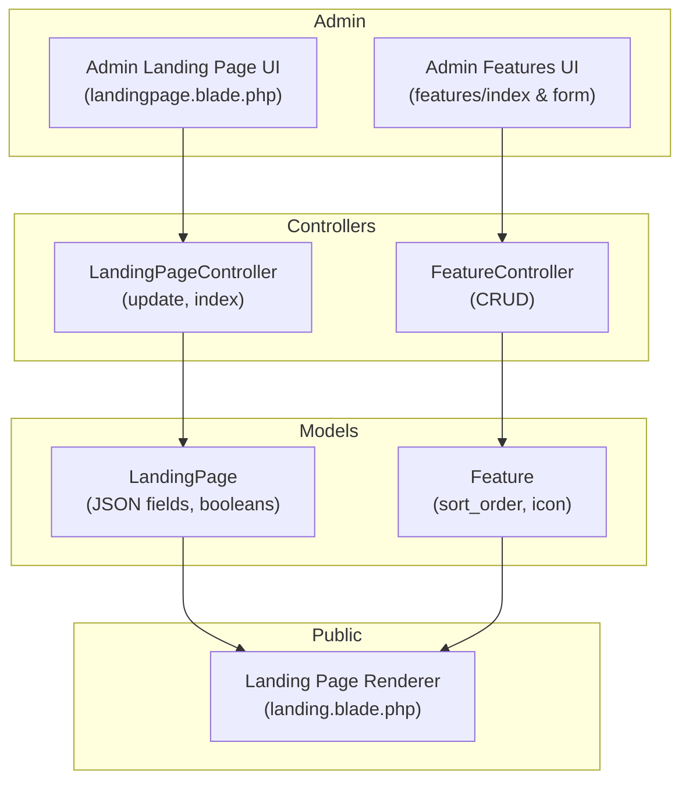
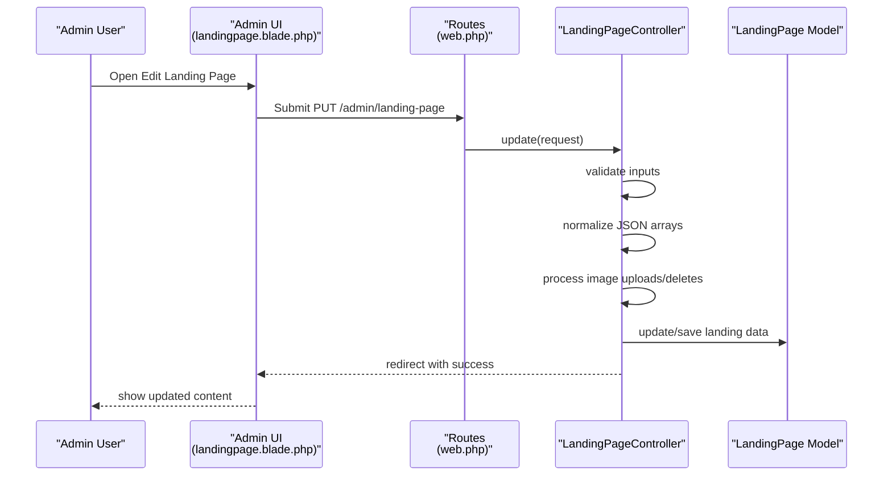
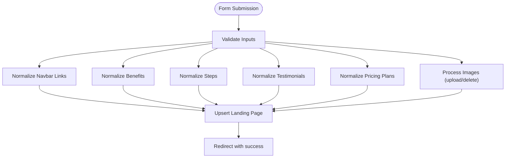
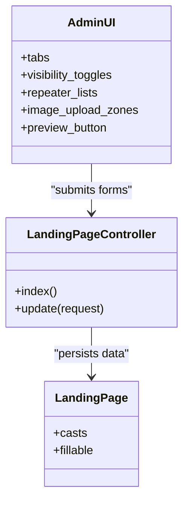
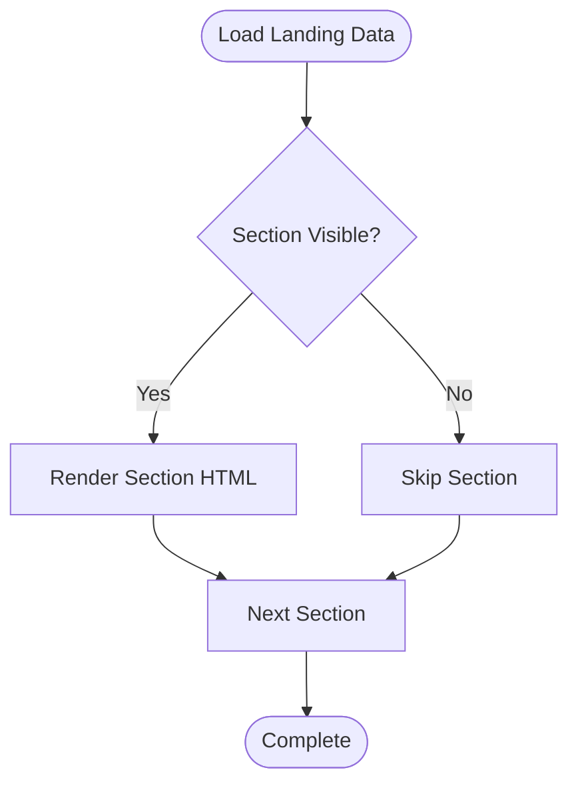
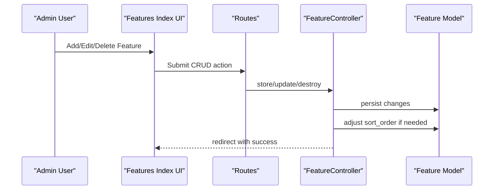
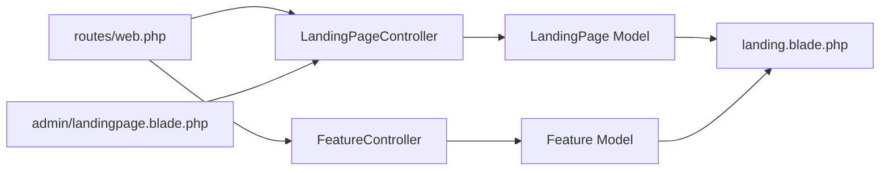

# Content Management System

<cite>
**Referenced Files in This Document**
- [LandingPageController.php](file://app/Http/Controllers/LandingPageController.php)
- [LandingPage.php](file://app/Models/LandingPage.php)
- [FeatureController.php](file://app/Http/Controllers/FeatureController.php)
- [Feature.php](file://app/Models/Feature.php)
- [landingpage.blade.php](file://resources/views/admin/landingpage.blade.php)
- [landing.blade.php](file://resources/views/landing.blade.php)
- [web.php](file://routes/web.php)
- [2026_06_17_031941_create_landing_pages_table.php](file://database/migrations/2026_06_17_031941_create_landing_pages_table.php)
- [2026_06_18_023000_add_images_to_landing_pages_table.php](file://database/migrations/2026_06_18_023000_add_images_to_landing_pages_table.php)
- [2026_06_18_035802_add_dashboard_and_navbar_to_landing_pages_table.php](file://database/migrations/2026_06_18_035802_add_dashboard_and_navbar_to_landing_pages_table.php)
- [2026_06_18_040000_add_all_sections_to_landing_pages_table.php](file://database/migrations/2026_06_18_040000_add_all_sections_to_landing_pages_table.php)
- [2026_06_22_022549_add_section_visibility_to_landing_pages.php](file://database/migrations/2026_06_22_022549_add_section_visibility_to_landing_pages.php)
- [2026_06_22_031700_add_gdrive_links_to_landing_pages.php](file://database/migrations/2026_06_22_031700_add_gdrive_links_to_landing_pages.php)
</cite>

## Table of Contents
1. [Introduction](#introduction)
2. [Project Structure](#project-structure)
3. [Core Components](#core-components)
4. [Architecture Overview](#architecture-overview)
5. [Detailed Component Analysis](#detailed-component-analysis)
6. [Dependency Analysis](#dependency-analysis)
7. [Performance Considerations](#performance-considerations)
8. [Troubleshooting Guide](#troubleshooting-guide)
9. [Conclusion](#conclusion)
10. [Appendices](#appendices)

## Introduction
This document describes the Content Management System (CMS) for ClinicalLog’s landing page. It covers multi-section content editing, real-time preview, section visibility controls, JSON-based data models, dynamic rendering, administrative editing interface, WYSIWYG-like editing via rich text areas, validation, image management, Google Drive document linking, and responsive design. It also outlines content versioning, publishing workflows, scheduling, and practical modification scenarios with troubleshooting guidance.

## Project Structure
The CMS centers around a dedicated landing page model and controller, with Blade templates for administration and public rendering. Features are managed separately and rendered dynamically on the landing page. Routes bind admin endpoints to controllers, while the home route renders the landing page with current content.

**Diagram sources**
- [web.php:19-77](file://routes/web.php#L19-L77)
- [LandingPageController.php:9-223](file://app/Http/Controllers/LandingPageController.php#L9-L223)
- [FeatureController.php:9-158](file://app/Http/Controllers/FeatureController.php#L9-L158)
- [LandingPage.php:7-59](file://app/Models/LandingPage.php#L7-L59)
- [Feature.php:7-17](file://app/Models/Feature.php#L7-L17)
- [landingpage.blade.php:1-1332](file://resources/views/admin/landingpage.blade.php#L1-L1332)
- [landing.blade.php:1-597](file://resources/views/landing.blade.php#L1-L597)

**Section sources**
- [web.php:19-77](file://routes/web.php#L19-L77)
- [landingpage.blade.php:1-1332](file://resources/views/admin/landingpage.blade.php#L1-L1332)
- [landing.blade.php:1-597](file://resources/views/landing.blade.php#L1-L597)

## Core Components
- LandingPage model stores hero, navigation, sections, testimonials, pricing, and visibility flags. JSON fields handle structured arrays for benefits, steps, testimonials, and pricing plans. Visibility booleans control section rendering.
- LandingPageController handles admin edits, validates inputs, processes images, and normalizes JSON arrays for navbar links, benefits, steps, testimonials, and pricing plans.
- Feature model and FeatureController manage feature items with icons (Lucide name or uploaded image) and sortable order.
- Admin UI (Blade) provides tabbed editing, drag-and-drop uploads, repeater lists, and visibility toggles.
- Public landing renderer conditionally displays sections based on visibility flags and renders JSON content.

**Section sources**
- [LandingPage.php:7-59](file://app/Models/LandingPage.php#L7-L59)
- [LandingPageController.php:18-221](file://app/Http/Controllers/LandingPageController.php#L18-L221)
- [Feature.php:7-17](file://app/Models/Feature.php#L7-L17)
- [FeatureController.php:11-158](file://app/Http/Controllers/FeatureController.php#L11-L158)
- [landingpage.blade.php:18-1332](file://resources/views/admin/landingpage.blade.php#L18-L1332)
- [landing.blade.php:10-597](file://resources/views/landing.blade.php#L10-L597)

## Architecture Overview
The CMS follows MVC with explicit separation of concerns:
- Routes define admin endpoints for landing and features.
- Controllers orchestrate validation, normalization, persistence, and redirects.
- Models define fillable attributes and casts for JSON and booleans.
- Blade templates render admin forms and public landing content.

**Diagram sources**
- [web.php:52-54](file://routes/web.php#L52-L54)
- [LandingPageController.php:18-221](file://app/Http/Controllers/LandingPageController.php#L18-L221)
- [LandingPage.php:9-57](file://app/Models/LandingPage.php#L9-L57)
- [landingpage.blade.php:18-221](file://resources/views/admin/landingpage.blade.php#L18-L221)

## Detailed Component Analysis

### Landing Page Data Model and Normalization
- Fillable attributes include hero, navigation, dashboard, CTA, and JSON arrays for benefits, steps, testimonials, pricing plans. Visibility booleans are cast to booleans.
- Controller normalizes:
  - Navbar links: filters entries with empty labels, ensures url defaults.
  - Benefits: requires title, defaults icon.
  - Steps: requires title, auto-numbering, optional desc and icon.
  - Testimonials: requires name, optional quote, role, img.
  - Pricing plans: parses multi-line feature list into array, optional tier/name/price/featured flag.
- Images: supports upload and delete flags per hero/about/dashboard; existing files are removed before storing new ones.

**Diagram sources**
- [LandingPageController.php:20-221](file://app/Http/Controllers/LandingPageController.php#L20-L221)
- [LandingPage.php:9-57](file://app/Models/LandingPage.php#L9-L57)

**Section sources**
- [LandingPageController.php:18-221](file://app/Http/Controllers/LandingPageController.php#L18-L221)
- [LandingPage.php:9-57](file://app/Models/LandingPage.php#L9-L57)

### Administrative Editing Interface
- Tabbed UI organizes sections: Hero, Navigation, About, Features, Benefits, Dashboard, Steps, Testimonials, Pricing, CTA.
- Visibility toggles per section provide immediate feedback and persist boolean flags.
- Repeater lists enable adding/removing/reordering items for benefits, steps, testimonials, and pricing plans.
- Image upload zones support click/drag-and-drop and live previews; delete checkboxes remove existing images upon save.
- Navigation links support anchors and external URLs; guidance cards explain anchor targets.

**Diagram sources**
- [landingpage.blade.php:22-1332](file://resources/views/admin/landingpage.blade.php#L22-L1332)
- [LandingPageController.php:11-221](file://app/Http/Controllers/LandingPageController.php#L11-L221)
- [LandingPage.php:9-57](file://app/Models/LandingPage.php#L9-L57)

**Section sources**
- [landingpage.blade.php:22-1332](file://resources/views/admin/landingpage.blade.php#L22-L1332)

### Dynamic Rendering and Visibility Controls
- Public landing renderer checks visibility flags and renders sections accordingly.
- JSON arrays (benefits, steps, testimonials, pricing) are iterated to build cards and grids.
- Navigation anchors map to section IDs for smooth scrolling.

**Diagram sources**
- [landing.blade.php:130-470](file://resources/views/landing.blade.php#L130-L470)
- [LandingPage.php:43-57](file://app/Models/LandingPage.php#L43-L57)

**Section sources**
- [landing.blade.php:10-597](file://resources/views/landing.blade.php#L10-L597)

### Features Management (WYSIWYG Editing and Ordering)
- Features are stored with sortable order and icons (Lucide name or uploaded image).
- Admin UI allows adding, editing, deleting, and reordering features.
- Sorting updates maintain contiguous order and shifts others accordingly.

**Diagram sources**
- [web.php:56-62](file://routes/web.php#L56-L62)
- [FeatureController.php:24-158](file://app/Http/Controllers/FeatureController.php#L24-L158)
- [Feature.php:9-15](file://app/Models/Feature.php#L9-L15)

**Section sources**
- [FeatureController.php:11-158](file://app/Http/Controllers/FeatureController.php#L11-L158)
- [Feature.php:7-17](file://app/Models/Feature.php#L7-L17)

### Image Management Integration
- Upload zones for hero, about, and dashboard images with previews and drag-and-drop.
- Delete checkboxes remove existing images when confirmed by saving.
- Images are stored under the public disk in the landing folder.

**Section sources**
- [LandingPageController.php:76-113](file://app/Http/Controllers/LandingPageController.php#L76-L113)
- [landingpage.blade.php:109-140](file://resources/views/admin/landingpage.blade.php#L109-L140)
- [landingpage.blade.php:334-371](file://resources/views/admin/landingpage.blade.php#L334-L371)
- [landingpage.blade.php:562-599](file://resources/views/admin/landingpage.blade.php#L562-L599)

### Google Drive Document Linking
- Terms and privacy links are stored as strings and validated for length and format.
- Admin UI provides dedicated fields for Google Drive shareable links.

**Section sources**
- [LandingPageController.php:44-46](file://app/Http/Controllers/LandingPageController.php#L44-L46)
- [landingpage.blade.php:260-272](file://resources/views/admin/landingpage.blade.php#L260-L272)

### Responsive Design Considerations
- Tailwind-based layout with grid and responsive breakpoints.
- Sections use containers and responsive typography.
- Media queries and flex/grid layouts adapt to mobile and desktop.

**Section sources**
- [landing.blade.php:10-597](file://resources/views/landing.blade.php#L10-L597)

### Content Versioning, Publishing, and Scheduling
- Current implementation persists latest content directly without explicit versioning or draft/publish workflows.
- No built-in scheduling fields exist; future enhancements could add scheduled_at/published_at fields and visibility toggles.

[No sources needed since this section provides general guidance]

## Dependency Analysis
- Routes depend on controllers for admin endpoints.
- Controllers depend on models for persistence and normalization.
- Views depend on models for rendering and on controllers for form actions.
- Migrations define the underlying schema for landing pages and features.

**Diagram sources**
- [web.php:19-77](file://routes/web.php#L19-L77)
- [LandingPageController.php:9-223](file://app/Http/Controllers/LandingPageController.php#L9-L223)
- [FeatureController.php:9-158](file://app/Http/Controllers/FeatureController.php#L9-L158)
- [LandingPage.php:7-59](file://app/Models/LandingPage.php#L7-L59)
- [Feature.php:7-17](file://app/Models/Feature.php#L7-L17)
- [landing.blade.php:10-597](file://resources/views/landing.blade.php#L10-L597)
- [landingpage.blade.php:18-1332](file://resources/views/admin/landingpage.blade.php#L18-L1332)

**Section sources**
- [web.php:19-77](file://routes/web.php#L19-L77)

## Performance Considerations
- JSON normalization occurs per request; keep array sizes reasonable to avoid heavy processing.
- Image uploads are limited by validation; ensure appropriate CDN or storage configuration for production.
- Repeater lists can grow; pagination and client-side virtualization may help for very large datasets.

[No sources needed since this section provides general guidance]

## Troubleshooting Guide
Common issues and resolutions:
- Validation errors on images: ensure supported formats and size limits; check error blocks in the admin UI.
- JSON arrays not saving: verify required fields (e.g., benefit title, step title) and proper array structure.
- Visibility toggles not applying: confirm boolean values are persisted and template checks use correct flags.
- Missing icons: if using Lucide names, ensure names match available icons; otherwise upload SVG/PNG/JPG.
- Deleted images remain visible: ensure delete checkboxes are checked and “Save All Changes” is clicked.

**Section sources**
- [LandingPageController.php:20-46](file://app/Http/Controllers/LandingPageController.php#L20-L46)
- [landingpage.blade.php:109-140](file://resources/views/admin/landingpage.blade.php#L109-L140)
- [landingpage.blade.php:334-371](file://resources/views/admin/landingpage.blade.php#L334-L371)
- [landingpage.blade.php:562-599](file://resources/views/admin/landingpage.blade.php#L562-L599)

## Conclusion
ClinicalLog CMS provides a robust, tabbed, JSON-backed landing page editor with visibility controls, image management, and dynamic feature rendering. Administrators can efficiently manage content, preview changes, and publish updates immediately. Future enhancements could introduce formal versioning, drafts, and scheduling to support editorial workflows.

## Appendices

### Data Model Reference
- LandingPage fields include hero, navigation, dashboard, CTA, testimonials, pricing plans, and visibility flags. JSON fields are cast to arrays; visibility flags are cast to booleans.

**Section sources**
- [LandingPage.php:9-57](file://app/Models/LandingPage.php#L9-L57)

### Migration History
- Initial landing pages table with hero and about content.
- Added images for hero and about.
- Added navbar links, CTA, dashboard, and JSON sections.
- Added visibility flags for all major sections.
- Added Google Drive links for legal documents.

**Section sources**
- [2026_06_17_031941_create_landing_pages_table.php:11-21](file://database/migrations/2026_06_17_031941_create_landing_pages_table.php#L11-L21)
- [2026_06_18_023000_add_images_to_landing_pages_table.php:11-14](file://database/migrations/2026_06_18_023000_add_images_to_landing_pages_table.php#L11-L14)
- [2026_06_18_035802_add_dashboard_and_navbar_to_landing_pages_table.php:14-24](file://database/migrations/2026_06_18_035802_add_dashboard_and_navbar_to_landing_pages_table.php#L14-L24)
- [2026_06_18_040000_add_all_sections_to_landing_pages_table.php:11-26](file://database/migrations/2026_06_18_040000_add_all_sections_to_landing_pages_table.php#L11-L26)
- [2026_06_22_022549_add_section_visibility_to_landing_pages.php:14-22](file://database/migrations/2026_06_22_022549_add_section_visibility_to_landing_pages.php#L14-L22)
- [2026_06_22_031700_add_gdrive_links_to_landing_pages.php:14-17](file://database/migrations/2026_06_22_031700_add_gdrive_links_to_landing_pages.php#L14-L17)

### Practical Modification Scenarios
- Modify Hero headline with multi-line text: use textarea in Hero tab; preview updates immediately.
- Hide About section: toggle visibility switch; section disappears from public view.
- Add a new feature: navigate to Features, add via form; set sort order to control display position.
- Replace hero image: use upload zone; existing image is removed on save when delete checkbox is selected.
- Link to legal documents: paste Google Drive shareable URLs in Navigation tab.

**Section sources**
- [landingpage.blade.php:62-146](file://resources/views/admin/landingpage.blade.php#L62-L146)
- [landingpage.blade.php:281-373](file://resources/views/admin/landingpage.blade.php#L281-L373)
- [landingpage.blade.php:507-601](file://resources/views/admin/landingpage.blade.php#L507-L601)
- [landing.blade.php:10-124](file://resources/views/landing.blade.php#L10-L124)