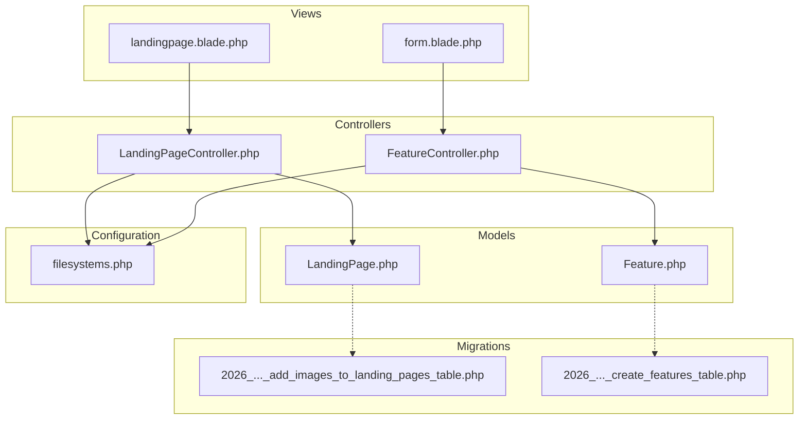
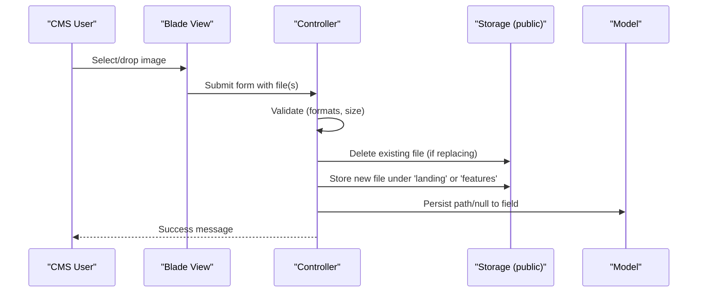
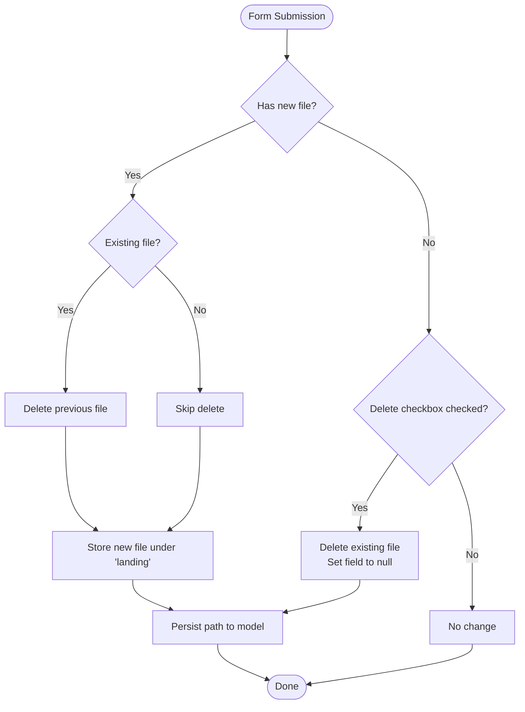
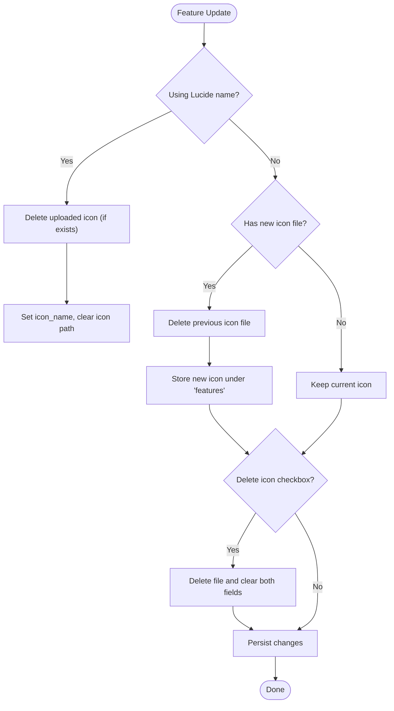
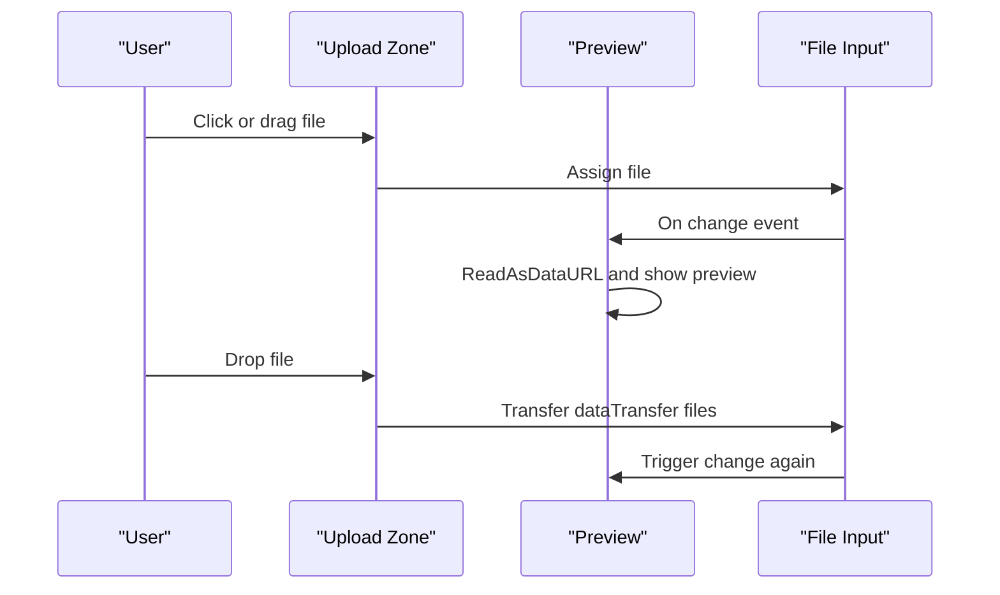
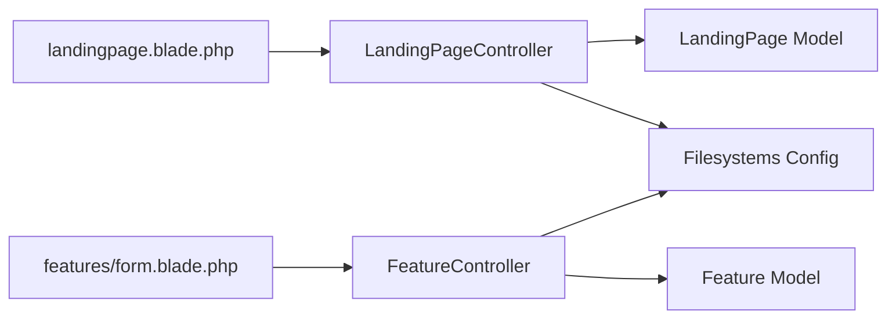

# Image & Media Management

<cite>
**Referenced Files in This Document**
- [LandingPageController.php](file://app/Http/Controllers/LandingPageController.php)
- [FeatureController.php](file://app/Http/Controllers/FeatureController.php)
- [LandingPage.php](file://app/Models/LandingPage.php)
- [Feature.php](file://app/Models/Feature.php)
- [filesystems.php](file://config/filesystems.php)
- [2026_06_18_023000_add_images_to_landing_pages_table.php](file://database/migrations/2026_06_18_023000_add_images_to_landing_pages_table.php)
- [2026_06_17_060200_create_features_table.php](file://database/migrations/2026_06_17_060200_create_features_table.php)
- [landingpage.blade.php](file://resources/views/admin/landingpage.blade.php)
- [form.blade.php](file://resources/views/admin/features/form.blade.php)
</cite>

## Table of Contents
1. [Introduction](#introduction)
2. [Project Structure](#project-structure)
3. [Core Components](#core-components)
4. [Architecture Overview](#architecture-overview)
5. [Detailed Component Analysis](#detailed-component-analysis)
6. [Dependency Analysis](#dependency-analysis)
7. [Performance Considerations](#performance-considerations)
8. [Troubleshooting Guide](#troubleshooting-guide)
9. [Security Considerations](#security-considerations)
10. [Storage Management Best Practices](#storage-management-best-practices)
11. [Conclusion](#conclusion)

## Introduction
This document provides comprehensive documentation for the image and media management system within the content management interface. It covers upload validation, supported formats and size limits, automatic storage workflows, file naming, deletion and replacement mechanisms, and cleanup procedures. It also includes practical examples, troubleshooting guidance, performance optimization tips, and security considerations.

## Project Structure
The image/media management spans three main areas:
- Validation and processing logic in controllers
- Data model definitions for persisted image metadata
- Frontend UI with drag-and-drop previews and delete checkboxes
- Filesystem configuration for storage and URL generation

**Diagram sources**
- [LandingPageController.php:1-224](file://app/Http/Controllers/LandingPageController.php#L1-L224)
- [FeatureController.php:1-156](file://app/Http/Controllers/FeatureController.php#L1-L156)
- [LandingPage.php:1-59](file://app/Models/LandingPage.php#L1-L59)
- [Feature.php:1-17](file://app/Models/Feature.php#L1-L17)
- [filesystems.php:1-81](file://config/filesystems.php#L1-L81)
- [2026_06_18_023000_add_images_to_landing_pages_table.php:1-24](file://database/migrations/2026_06_18_023000_add_images_to_landing_pages_table.php#L1-L24)
- [2026_06_17_060200_create_features_table.php:1-34](file://database/migrations/2026_06_17_060200_create_features_table.php#L1-L34)
- [landingpage.blade.php](file://resources/views/admin/landingpage.blade.php)
- [form.blade.php](file://resources/views/admin/features/form.blade.php)

**Section sources**
- [LandingPageController.php:1-224](file://app/Http/Controllers/LandingPageController.php#L1-L224)
- [FeatureController.php:1-156](file://app/Http/Controllers/FeatureController.php#L1-L156)
- [filesystems.php:1-81](file://config/filesystems.php#L1-L81)

## Core Components
- Landing page image management: Hero, About, and Dashboard images with validation and replace/delete logic.
- Feature icon management: Upload icons to the 'features' directory or use Lucide icon names; supports replace/delete.
- Storage backend: Public local disk with URL generation via symlink to public/storage.
- Frontend UX: Drag-and-drop upload zones, live previews, and delete checkboxes.

Key capabilities:
- Validation: Formats include JPG, JPEG, PNG, WEBP, SVG; max 2MB per image.
- Storage: Files stored under 'landing' or 'features' directories on the public disk.
- Cleanup: Existing files are removed before storing new ones or when delete flags are set.

**Section sources**
- [LandingPageController.php:21-47](file://app/Http/Controllers/LandingPageController.php#L21-L47)
- [FeatureController.php:22-30](file://app/Http/Controllers/FeatureController.php#L22-L30)
- [filesystems.php:41-48](file://config/filesystems.php#L41-L48)

## Architecture Overview
The system follows a straightforward MVC pattern:
- Controllers validate and process uploads, manage replacements/deletions, and persist metadata.
- Models define fillable attributes and casting for arrays and booleans.
- Views render upload zones, previews, and delete controls.
- Filesystem configuration defines the public disk and URL generation.

**Diagram sources**
- [LandingPageController.php:77-114](file://app/Http/Controllers/LandingPageController.php#L77-L114)
- [FeatureController.php:64-92](file://app/Http/Controllers/FeatureController.php#L64-L92)
- [filesystems.php:41-48](file://config/filesystems.php#L41-L48)

## Detailed Component Analysis

### Landing Page Images (Hero, About, Dashboard)
- Validation enforces image type and size for hero, about, and dashboard images.
- Replace workflow: if a new file is present, the controller deletes the previous file and stores the new one.
- Delete workflow: if the delete checkbox is checked, the controller removes the current file and sets the field to null.
- Storage location: 'landing' directory on the public disk.
- URL generation: public disk serves files under /storage with a symlink from public/storage.

**Diagram sources**
- [LandingPageController.php:77-114](file://app/Http/Controllers/LandingPageController.php#L77-L114)

**Section sources**
- [LandingPageController.php:21-47](file://app/Http/Controllers/LandingPageController.php#L21-L47)
- [LandingPageController.php:77-114](file://app/Http/Controllers/LandingPageController.php#L77-L114)
- [LandingPage.php:9-41](file://app/Models/LandingPage.php#L9-L41)
- [2026_06_18_023000_add_images_to_landing_pages_table.php:11-14](file://database/migrations/2026_06_18_023000_add_images_to_landing_pages_table.php#L11-L14)
- [landingpage.blade.php:131-371](file://resources/views/admin/landingpage.blade.php#L131-L371)

### Feature Icons (Upload vs Lucide Name)
- Two modes:
  - Upload: Save icon file to the 'features' directory on the public disk.
  - Lucide name: Provide icon_name to use a Lucide icon without uploading a file.
- Replace workflow: If switching from upload to Lucide name, remove the uploaded file; if switching from Lucide to upload, remove the Lucide association and upload a new file.
- Delete workflow: Check the delete icon checkbox to remove the current icon (either uploaded file or Lucide name).
- Storage location: 'features' directory on the public disk.

**Diagram sources**
- [FeatureController.php:64-92](file://app/Http/Controllers/FeatureController.php#L64-L92)
- [FeatureController.php:71-92](file://app/Http/Controllers/FeatureController.php#L71-L92)

**Section sources**
- [FeatureController.php:22-30](file://app/Http/Controllers/FeatureController.php#L22-L30)
- [FeatureController.php:64-92](file://app/Http/Controllers/FeatureController.php#L64-L92)
- [Feature.php:9-15](file://app/Models/Feature.php#L9-L15)
- [2026_06_17_060200_create_features_table.php:14-23](file://database/migrations/2026_06_17_060200_create_features_table.php#L14-L23)
- [form.blade.php:103-127](file://resources/views/admin/features/form.blade.php#L103-L127)

### Frontend Upload UX
- Drag-and-drop upload zones with click-to-select support.
- Live preview of selected file (image data URL) with filename display.
- Accept attributes restrict uploads to SVG, PNG, JPG, and JPEG.
- Delete checkboxes trigger removal of current images/icons when saving.

**Diagram sources**
- [landingpage.blade.php:1086-1114](file://resources/views/admin/landingpage.blade.php#L1086-L1114)
- [landingpage.blade.php:1113-1141](file://resources/views/admin/landingpage.blade.php#L1113-L1141)
- [form.blade.php:111-123](file://resources/views/admin/features/form.blade.php#L111-L123)

**Section sources**
- [landingpage.blade.php:1086-1114](file://resources/views/admin/landingpage.blade.php#L1086-L1114)
- [landingpage.blade.php:1113-1141](file://resources/views/admin/landingpage.blade.php#L1113-L1141)
- [form.blade.php:111-123](file://resources/views/admin/features/form.blade.php#L111-L123)

## Dependency Analysis
- Controllers depend on:
  - Validation rules defined in the controller methods.
  - Storage facade to delete and store files on the public disk.
  - Models to persist image paths or null.
- Views depend on:
  - Asset URLs generated by the public disk configuration.
  - Checkbox inputs to signal deletion.
- Configuration depends on:
  - Public disk root and URL generation for serving files.

**Diagram sources**
- [LandingPageController.php:1-224](file://app/Http/Controllers/LandingPageController.php#L1-L224)
- [FeatureController.php:1-156](file://app/Http/Controllers/FeatureController.php#L1-L156)
- [filesystems.php:41-48](file://config/filesystems.php#L41-L48)
- [LandingPage.php:1-59](file://app/Models/LandingPage.php#L1-L59)
- [Feature.php:1-17](file://app/Models/Feature.php#L1-L17)
- [landingpage.blade.php](file://resources/views/admin/landingpage.blade.php)
- [form.blade.php](file://resources/views/admin/features/form.blade.php)

**Section sources**
- [LandingPageController.php:1-224](file://app/Http/Controllers/LandingPageController.php#L1-L224)
- [FeatureController.php:1-156](file://app/Http/Controllers/FeatureController.php#L1-L156)
- [filesystems.php:41-48](file://config/filesystems.php#L41-L48)

## Performance Considerations
- Optimize image sizes before upload to reduce storage and bandwidth usage.
- Prefer modern formats (WEBP where supported) for smaller file sizes.
- Serve compressed images and leverage browser caching via appropriate headers.
- Monitor storage growth and implement periodic cleanup of unused files.
- Consider offloading static assets to a CDN for improved global delivery.

## Troubleshooting Guide
Common issues and resolutions:
- Upload rejected due to format or size:
  - Ensure files are JPG, JPEG, PNG, WEBP, or SVG and under 2MB.
  - Check validation messages returned by the form.
- Previous image not replaced:
  - Verify that a new file is selected and submitted.
  - Confirm the delete checkbox is not inadvertently checked.
- Delete checkbox has no effect:
  - Ensure the save action is performed after checking the box.
  - Confirm the field is included in the form submission.
- File not found after save:
  - Confirm the public disk symlink exists and is accessible.
  - Check that the stored path is not corrupted in the database.

**Section sources**
- [LandingPageController.php:21-47](file://app/Http/Controllers/LandingPageController.php#L21-L47)
- [LandingPageController.php:77-114](file://app/Http/Controllers/LandingPageController.php#L77-L114)
- [FeatureController.php:64-92](file://app/Http/Controllers/FeatureController.php#L64-L92)
- [filesystems.php:76-78](file://config/filesystems.php#L76-L78)

## Security Considerations
- Content validation: Enforce allowed MIME types and file extensions server-side.
- Size limits: Restrict maximum file size to prevent resource exhaustion.
- Sanitization: For SVGs, consider sanitization to mitigate XSS risks.
- Access control: Serve files from the public disk with appropriate permissions.
- Input hygiene: Always validate and sanitize user-provided filenames and paths.
- Logging: Track upload attempts and errors for auditing.

## Storage Management Best Practices
- Directory organization: Keep images organized under 'landing' and 'features' directories.
- Cleanup policy: Periodically remove orphaned files that are no longer referenced by models.
- Backups: Include storage/app/public in backups as needed.
- Monitoring: Watch disk usage and alert on thresholds.
- Rotation: Implement retention policies for temporary or outdated assets.

## Conclusion
The CMS provides a robust, user-friendly image and media management system with strong validation, clear replace/delete workflows, and secure storage using the public disk. By following the guidelines in this document—especially around validation, security, and storage practices—you can maintain a reliable and performant media pipeline.