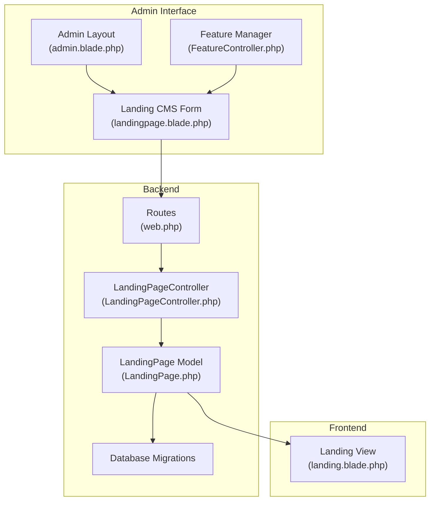
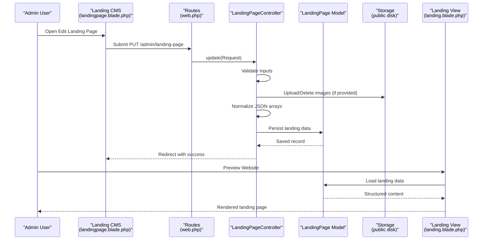
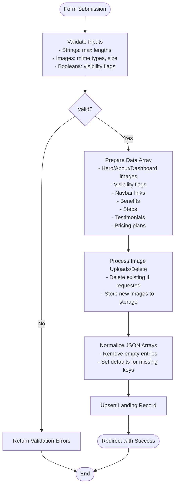
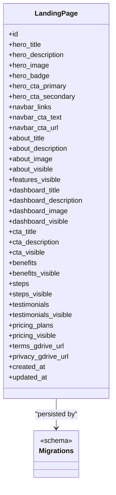
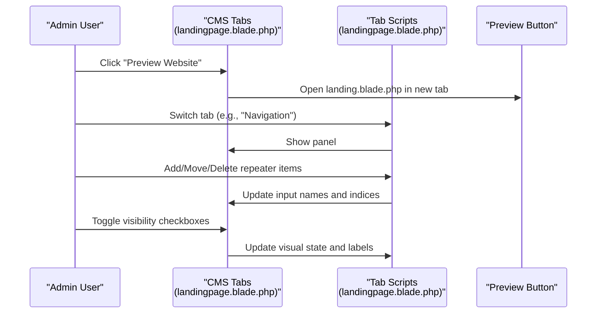
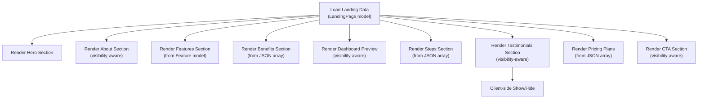
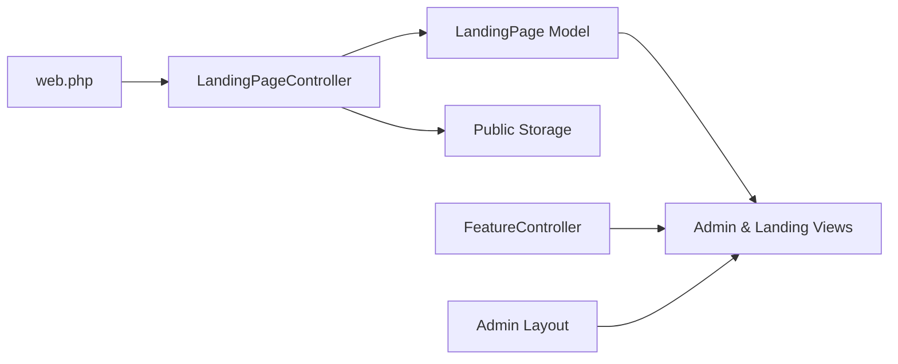

# Landing Page Management

<cite>
**Referenced Files in This Document**
- [LandingPageController.php](file://app/Http/Controllers/LandingPageController.php)
- [LandingPage.php](file://app/Models/LandingPage.php)
- [landingpage.blade.php](file://resources/views/admin/landingpage.blade.php)
- [landing.blade.php](file://resources/views/landing.blade.php)
- [2026_06_17_031941_create_landing_pages_table.php](file://database/migrations/2026_06_17_031941_create_landing_pages_table.php)
- [2026_06_18_023000_add_images_to_landing_pages_table.php](file://database/migrations/2026_06_18_023000_add_images_to_landing_pages_table.php)
- [2026_06_18_035802_add_dashboard_and_navbar_to_landing_pages_table.php](file://database/migrations/2026_06_18_035802_add_dashboard_and_navbar_to_landing_pages_table.php)
- [2026_06_18_040000_add_all_sections_to_landing_pages_table.php](file://database/migrations/2026_06_18_040000_add_all_sections_to_landing_pages_table.php)
- [2026_06_18_064300_add_testimonials_visible_to_landing_pages.php](file://database/migrations/2026_06_18_064300_add_testimonials_visible_to_landing_pages.php)
- [2026_06_22_022549_add_section_visibility_to_landing_pages.php](file://database/migrations/2026_06_22_022549_add_section_visibility_to_landing_pages.php)
- [web.php](file://routes/web.php)
- [admin.blade.php](file://resources/views/layouts/admin.blade.php)
- [Feature.php](file://app/Models/Feature.php)
- [FeatureController.php](file://app/Http/Controllers/FeatureController.php)
</cite>

## Table of Contents
1. [Introduction](#introduction)
2. [Project Structure](#project-structure)
3. [Core Components](#core-components)
4. [Architecture Overview](#architecture-overview)
5. [Detailed Component Analysis](#detailed-component-analysis)
6. [Dependency Analysis](#dependency-analysis)
7. [Performance Considerations](#performance-considerations)
8. [Troubleshooting Guide](#troubleshooting-guide)
9. [Conclusion](#conclusion)

## Introduction
This document describes the centralized landing page management system that enables administrators to edit all landing page sections in a single interface. It covers the multi-section editing capabilities (hero, navigation, about, features, benefits, dashboard preview, steps, testimonials, pricing, and CTA), real-time preview functionality, section visibility controls, validation rules, image upload handling, and the JSON-based data structure used for complex content. Practical workflows and troubleshooting guidance are included to help administrators manage content efficiently.

## Project Structure
The landing page management system spans controllers, models, Blade templates, migrations, and routing. The admin interface consolidates editing for all sections in one view, while the frontend renders the live landing page using the stored data.

**Diagram sources**
- [admin.blade.php:1-150](file://resources/views/layouts/admin.blade.php#L1-L150)
- [landingpage.blade.php:1-1410](file://resources/views/admin/landingpage.blade.php#L1-L1410)
- [web.php:52-54](file://routes/web.php#L52-L54)
- [LandingPageController.php:9-224](file://app/Http/Controllers/LandingPageController.php#L9-L224)
- [LandingPage.php:7-59](file://app/Models/LandingPage.php#L7-L59)
- [landing.blade.php:1-597](file://resources/views/landing.blade.php#L1-L597)
- [FeatureController.php:9-156](file://app/Http/Controllers/FeatureController.php#L9-L156)

**Section sources**
- [web.php:19-77](file://routes/web.php#L19-L77)
- [admin.blade.php:37-70](file://resources/views/layouts/admin.blade.php#L37-L70)
- [landingpage.blade.php:18-1030](file://resources/views/admin/landingpage.blade.php#L18-L1030)

## Core Components
- Centralized editing controller: Handles validation, image uploads, JSON processing, and persistence for all landing page sections.
- Landing page model: Defines fillable attributes and JSON casts for structured content.
- Admin CMS view: Provides tabbed editing interface with repeater fields, image previews, and visibility toggles.
- Frontend landing view: Renders the live landing page using stored data and supports visibility flags.
- Feature manager: Integrates with the landing CMS to manage feature cards displayed in the features section.

Key responsibilities:
- Validation: Enforces length limits, MIME types, and size constraints for images; ensures presence of required fields where applicable.
- JSON processing: Normalizes arrays for navbar links, benefits, steps, testimonials, and pricing plans.
- Image handling: Uploads, replaces, deletes, and previews hero, about, and dashboard images.
- Visibility controls: Per-section booleans to show/hide content regions.

**Section sources**
- [LandingPageController.php:19-224](file://app/Http/Controllers/LandingPageController.php#L19-L224)
- [LandingPage.php:9-57](file://app/Models/LandingPage.php#L9-L57)
- [landingpage.blade.php:22-1030](file://resources/views/admin/landingpage.blade.php#L22-L1030)
- [landing.blade.php:10-548](file://resources/views/landing.blade.php#L10-L548)
- [FeatureController.php:11-156](file://app/Http/Controllers/FeatureController.php#L11-L156)

## Architecture Overview
The system follows a classic MVC pattern with a dedicated CMS controller managing updates and a model persisting structured content. The admin view posts to the controller via PUT, which validates inputs, processes images, normalizes JSON arrays, and saves to the database. The landing view reads the persisted data to render the public site.

**Diagram sources**
- [web.php:52-54](file://routes/web.php#L52-L54)
- [LandingPageController.php:19-224](file://app/Http/Controllers/LandingPageController.php#L19-L224)
- [LandingPage.php:9-57](file://app/Models/LandingPage.php#L9-L57)
- [landingpage.blade.php:18-1030](file://resources/views/admin/landingpage.blade.php#L18-L1030)
- [landing.blade.php:10-548](file://resources/views/landing.blade.php#L10-L548)

## Detailed Component Analysis

### Centralized Editing Controller
The controller coordinates validation, image handling, and JSON normalization for all sections. It supports:
- Hero section: badge, title, description, CTAs, and hero image upload/delete.
- Navigation section: navbar CTA text/url and dynamic navbar links array.
- About section: title, description, image, and visibility toggle.
- Features section: integrates with the feature manager; visibility toggle.
- Benefits section: array of items with icon and title; visibility toggle.
- Dashboard preview section: title, description, image, and visibility toggle.
- Steps section: ordered list with icon, number, title, and description; visibility toggle.
- Testimonials section: array of quote/name/role/img; visibility toggle.
- Pricing section: array of plans with tier, name, price, featured flag, and feature list; visibility toggle.
- CTA section: title and description, plus visibility toggle.
- Documents: Terms and Privacy Google Drive URLs.

Validation rules include string length limits, optional booleans, and image constraints (mime types and max size). JSON arrays are sanitized to ensure required fields are present before saving.

**Diagram sources**
- [LandingPageController.php:21-47](file://app/Http/Controllers/LandingPageController.php#L21-L47)
- [LandingPageController.php:77-211](file://app/Http/Controllers/LandingPageController.php#L77-L211)

**Section sources**
- [LandingPageController.php:19-224](file://app/Http/Controllers/LandingPageController.php#L19-L224)

### Landing Page Model and Data Structure
The model defines fillable attributes and JSON casts for structured content. Visibility flags are cast to booleans. The database schema evolves through migrations to add new fields progressively.

**Diagram sources**
- [LandingPage.php:9-57](file://app/Models/LandingPage.php#L9-L57)
- [2026_06_17_031941_create_landing_pages_table.php:11-21](file://database/migrations/2026_06_17_031941_create_landing_pages_table.php#L11-L21)
- [2026_06_18_023000_add_images_to_landing_pages_table.php:11-14](file://database/migrations/2026_06_18_023000_add_images_to_landing_pages_table.php#L11-L14)
- [2026_06_18_035802_add_dashboard_and_navbar_to_landing_pages_table.php:14-24](file://database/migrations/2026_06_18_035802_add_dashboard_and_navbar_to_landing_pages_table.php#L14-L24)
- [2026_06_18_040000_add_all_sections_to_landing_pages_table.php:11-26](file://database/migrations/2026_06_18_040000_add_all_sections_to_landing_pages_table.php#L11-L26)
- [2026_06_18_064300_add_testimonials_visible_to_landing_pages.php:11-12](file://database/migrations/2026_06_18_064300_add_testimonials_visible_to_landing_pages.php#L11-L12)
- [2026_06_22_022549_add_section_visibility_to_landing_pages.php:14-21](file://database/migrations/2026_06_22_022549_add_section_visibility_to_landing_pages.php#L14-L21)

**Section sources**
- [LandingPage.php:9-57](file://app/Models/LandingPage.php#L9-L57)
- [2026_06_17_031941_create_landing_pages_table.php:11-21](file://database/migrations/2026_06_17_031941_create_landing_pages_table.php#L11-L21)
- [2026_06_18_023000_add_images_to_landing_pages_table.php:11-14](file://database/migrations/2026_06_18_023000_add_images_to_landing_pages_table.php#L11-L14)
- [2026_06_18_035802_add_dashboard_and_navbar_to_landing_pages_table.php:14-24](file://database/migrations/2026_06_18_035802_add_dashboard_and_navbar_to_landing_pages_table.php#L14-L24)
- [2026_06_18_040000_add_all_sections_to_landing_pages_table.php:11-26](file://database/migrations/2026_06_18_040000_add_all_sections_to_landing_pages_table.php#L11-L26)
- [2026_06_18_064300_add_testimonials_visible_to_landing_pages.php:11-12](file://database/migrations/2026_06_18_064300_add_testimonials_visible_to_landing_pages.php#L11-L12)
- [2026_06_22_022549_add_section_visibility_to_landing_pages.php:14-21](file://database/migrations/2026_06_22_022549_add_section_visibility_to_landing_pages.php#L14-L21)

### Admin CMS Interface
The CMS view organizes editing into tabs for each section. It includes:
- Real-time preview: A "Preview Website" button opens the live site.
- Tab switching: JavaScript toggles visible panels.
- Image upload zones with drag-and-drop and preview.
- Repeater fields for dynamic arrays (navbar links, benefits, steps, testimonials, pricing plans).
- Visibility toggles per section with live feedback.

**Diagram sources**
- [landingpage.blade.php:12-16](file://resources/views/admin/landingpage.blade.php#L12-L16)
- [landingpage.blade.php:22-56](file://resources/views/admin/landingpage.blade.php#L22-L56)
- [landingpage.blade.php:1034-1408](file://resources/views/admin/landingpage.blade.php#L1034-L1408)

**Section sources**
- [landingpage.blade.php:18-1030](file://resources/views/admin/landingpage.blade.php#L18-L1030)
- [landingpage.blade.php:1034-1408](file://resources/views/admin/landingpage.blade.php#L1034-L1408)

### Frontend Rendering
The landing view renders the public site using the saved data. Visibility flags control whether sections are shown. Dynamic arrays populate benefits, steps, testimonials, and pricing plans. The testimonials section includes client-side toggles to show/hide cards.

**Diagram sources**
- [landing.blade.php:10-548](file://resources/views/landing.blade.php#L10-L548)
- [LandingPage.php:43-57](file://app/Models/LandingPage.php#L43-L57)

**Section sources**
- [landing.blade.php:10-548](file://resources/views/landing.blade.php#L10-L548)

### Multi-Section Editing Capabilities
- Hero: Badge, title, description, CTAs, and hero image upload with delete option.
- Navigation: Navbar CTA text/url and dynamic navbar links array with label/target pairs.
- About: Title, description, image, and visibility toggle.
- Features: Managed via the feature manager; visibility toggle.
- Benefits: Array of items with icon and title; visibility toggle.
- Dashboard Preview: Title, description, image, and visibility toggle.
- Steps: Ordered list with icon, number, title, and description; visibility toggle.
- Testimonials: Array of quote/name/role/img; visibility toggle.
- Pricing: Array of plans with tier, name, price, featured flag, and newline-separated features; visibility toggle.
- CTA: Title and description, plus visibility toggle.
- Documents: Terms and Privacy Google Drive URLs.

**Section sources**
- [landingpage.blade.php:62-146](file://resources/views/admin/landingpage.blade.php#L62-L146)
- [landingpage.blade.php:152-275](file://resources/views/admin/landingpage.blade.php#L152-L275)
- [landingpage.blade.php:281-373](file://resources/views/admin/landingpage.blade.php#L281-L373)
- [landingpage.blade.php:498-579](file://resources/views/admin/landingpage.blade.php#L498-L579)
- [landingpage.blade.php:584-679](file://resources/views/admin/landingpage.blade.php#L584-L679)
- [landingpage.blade.php:684-768](file://resources/views/admin/landingpage.blade.php#L684-L768)
- [landingpage.blade.php:773-860](file://resources/views/admin/landingpage.blade.php#L773-L860)
- [landingpage.blade.php:865-963](file://resources/views/admin/landingpage.blade.php#L865-L963)
- [landingpage.blade.php:968-1014](file://resources/views/admin/landingpage.blade.php#L968-L1014)

### Real-Time Preview and Visibility Controls
- Real-time preview: The admin view includes a "Preview Website" button linking to the live landing page.
- Visibility controls: Each section has a toggle switch that immediately updates the UI and persists a boolean flag. The frontend checks these flags before rendering sections.

**Section sources**
- [landingpage.blade.php:12-16](file://resources/views/admin/landingpage.blade.php#L12-L16)
- [landingpage.blade.php:1034-1408](file://resources/views/admin/landingpage.blade.php#L1034-L1408)
- [landing.blade.php:130-194](file://resources/views/landing.blade.php#L130-L194)
- [landing.blade.php:200-233](file://resources/views/landing.blade.php#L200-L233)
- [landing.blade.php:239-269](file://resources/views/landing.blade.php#L239-L269)
- [landing.blade.php:275-305](file://resources/views/landing.blade.php#L275-L305)
- [landing.blade.php:311-366](file://resources/views/landing.blade.php#L311-L366)
- [landing.blade.php:372-439](file://resources/views/landing.blade.php#L372-L439)
- [landing.blade.php:445-470](file://resources/views/landing.blade.php#L445-L470)
- [landing.blade.php:476-548](file://resources/views/landing.blade.php#L476-L548)

### Validation Rules and Image Handling
Validation rules enforced server-side:
- Hero: title/description/badge/CTAs (strings with max lengths), hero image (image, specific mimes, max size).
- Navigation: navbar CTA text/url (strings with max lengths).
- About: title/description (strings with max lengths), about image (image, specific mimes, max size).
- Dashboard: title/description (strings with max lengths), dashboard image (image, specific mimes, max size).
- CTA: title/description (strings with max lengths).
- Visibility: boolean flags for each section.
- Documents: Terms/Privacy Google Drive URLs (strings with max lengths).

Image handling:
- Upload zones trigger file selection or drag-and-drop.
- Preview displays selected image before saving.
- Delete checkboxes remove current images when saving.
- Storage uses the public disk under the landing directory.

**Section sources**
- [LandingPageController.php:21-47](file://app/Http/Controllers/LandingPageController.php#L21-L47)
- [LandingPageController.php:77-114](file://app/Http/Controllers/LandingPageController.php#L77-L114)
- [landingpage.blade.php:1047-1084](file://resources/views/admin/landingpage.blade.php#L1047-L1084)

### JSON-Based Data Structures
Structured content is stored as JSON arrays:
- Navbar links: Array of objects with label and url.
- Benefits: Array of objects with icon and title.
- Steps: Array of objects with icon, zero-padded num, title, and desc.
- Testimonials: Array of objects with quote, name, role, img.
- Pricing plans: Array of objects with tier, name, price, featured flag, and feature list derived from newline-separated text.

Normalization ensures required fields are present and defaults are applied when missing.

**Section sources**
- [LandingPageController.php:116-211](file://app/Http/Controllers/LandingPageController.php#L116-L211)
- [LandingPage.php:43-48](file://app/Models/LandingPage.php#L43-L48)

### Practical Workflows

#### Editing the Hero Section
- Navigate to the Hero tab in the CMS.
- Enter badge, title, description, and CTA text.
- Upload hero image via click or drag-and-drop; preview appears.
- Save changes; preview the website to see updates.

**Section sources**
- [landingpage.blade.php:62-146](file://resources/views/admin/landingpage.blade.php#L62-L146)
- [LandingPageController.php:77-88](file://app/Http/Controllers/LandingPageController.php#L77-L88)

#### Managing Navigation Links
- Go to the Navigation tab.
- Add or edit navbar links with label and target (anchor or external URL).
- Adjust order using move up/down buttons.
- Save; verify links appear in the live site navigation.

**Section sources**
- [landingpage.blade.php:152-275](file://resources/views/admin/landingpage.blade.php#L152-L275)
- [LandingPageController.php:116-131](file://app/Http/Controllers/LandingPageController.php#L116-L131)

#### Updating Benefits
- Open the Benefits tab.
- Add items with icon and title; icons come from Lucide icon names.
- Reorder items as needed.
- Save; benefits render on the live site.

**Section sources**
- [landingpage.blade.php:498-579](file://resources/views/admin/landingpage.blade.php#L498-L579)
- [LandingPageController.php:133-148](file://app/Http/Controllers/LandingPageController.php#L133-L148)

#### Managing Testimonials
- Visit the Testimonials tab.
- Add testimonials with name, role, quote, and image URL.
- Toggle visibility to show/hide the section.
- Save; testimonials can be toggled on the live site.

**Section sources**
- [landingpage.blade.php:773-860](file://resources/views/admin/landingpage.blade.php#L773-L860)
- [landing.blade.php:372-439](file://resources/views/landing.blade.php#L372-L439)

#### Configuring Pricing Plans
- Open the Pricing tab.
- Add plans with tier, name, price, and feature list (one feature per line).
- Mark popular plans with the featured flag.
- Save; pricing section renders on the live site.

**Section sources**
- [landingpage.blade.php:865-963](file://resources/views/admin/landingpage.blade.php#L865-L963)
- [LandingPageController.php:188-211](file://app/Http/Controllers/LandingPageController.php#L188-L211)

#### Feature Management Integration
- Use the Features tab to manage feature cards displayed in the features section.
- Add, edit, reorder, or delete features; the landing view pulls from the Feature model.

**Section sources**
- [landingpage.blade.php:378-495](file://resources/views/admin/landingpage.blade.php#L378-L495)
- [FeatureController.php:11-156](file://app/Http/Controllers/FeatureController.php#L11-L156)
- [landing.blade.php:200-233](file://resources/views/landing.blade.php#L200-L233)

## Dependency Analysis
The system exhibits clear separation of concerns:
- Routes define entry points for the CMS.
- Controller handles validation, image processing, and JSON normalization.
- Model persists structured data with appropriate casts.
- Views render admin and public interfaces.
- Feature manager integrates with the CMS for feature cards.

**Diagram sources**
- [web.php:52-54](file://routes/web.php#L52-L54)
- [LandingPageController.php:9-224](file://app/Http/Controllers/LandingPageController.php#L9-L224)
- [LandingPage.php:9-57](file://app/Models/LandingPage.php#L9-L57)
- [admin.blade.php:37-70](file://resources/views/layouts/admin.blade.php#L37-L70)
- [FeatureController.php:9-156](file://app/Http/Controllers/FeatureController.php#L9-L156)

**Section sources**
- [web.php:52-54](file://routes/web.php#L52-L54)
- [LandingPageController.php:9-224](file://app/Http/Controllers/LandingPageController.php#L9-L224)
- [LandingPage.php:9-57](file://app/Models/LandingPage.php#L9-L57)
- [admin.blade.php:37-70](file://resources/views/layouts/admin.blade.php#L37-L70)
- [FeatureController.php:9-156](file://app/Http/Controllers/FeatureController.php#L9-L156)

## Performance Considerations
- Image processing: Limit image sizes and formats to reduce storage and bandwidth costs.
- JSON arrays: Keep arrays concise to minimize payload sizes.
- Visibility toggles: Use boolean flags to avoid rendering unnecessary DOM elements.
- Pagination: Features are paginated to keep the CMS responsive.

## Troubleshooting Guide
Common issues and resolutions:
- Image upload errors: Ensure file format is among supported types and size does not exceed the limit. Use the preview area to confirm selection.
- JSON parsing issues: Verify that required fields are present in arrays (e.g., label/url for navbar links, title for benefits/steps/testimonials/pricing).
- Visibility not updating: Confirm the visibility checkbox is checked and saved; the frontend conditionally renders sections based on these flags.
- Navigation anchors: Use proper anchor IDs (#beranda, #tentang, etc.) for internal links; external URLs must be complete.
- Feature ordering: When reordering features, ensure positions clamp to valid ranges; the feature manager adjusts sort orders accordingly.

**Section sources**
- [LandingPageController.php:21-47](file://app/Http/Controllers/LandingPageController.php#L21-L47)
- [landingpage.blade.php:177-193](file://resources/views/admin/landingpage.blade.php#L177-L193)
- [FeatureController.php:94-121](file://app/Http/Controllers/FeatureController.php#L94-L121)

## Conclusion
The landing page management system provides a centralized, efficient interface for administrators to edit all landing page sections in one place. With robust validation, flexible JSON structures, image handling, and visibility controls, it supports rapid content iteration and accurate public rendering. The integrated feature manager and real-time preview streamline content creation and review workflows.