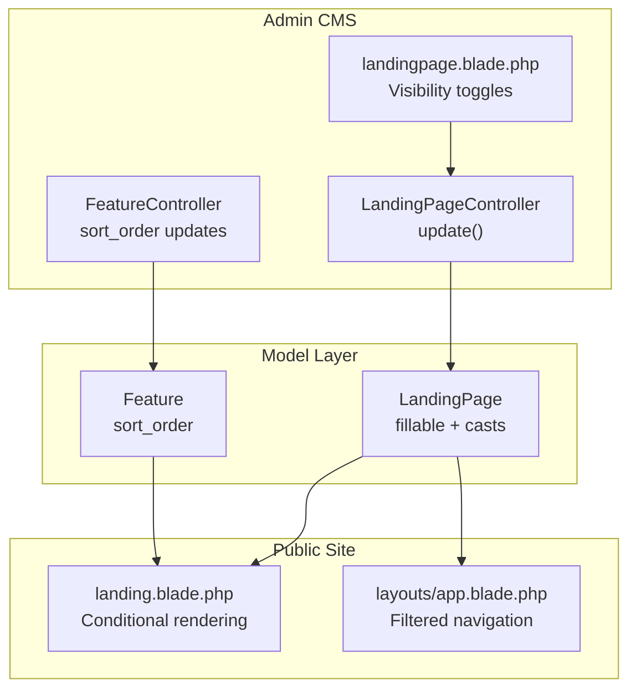
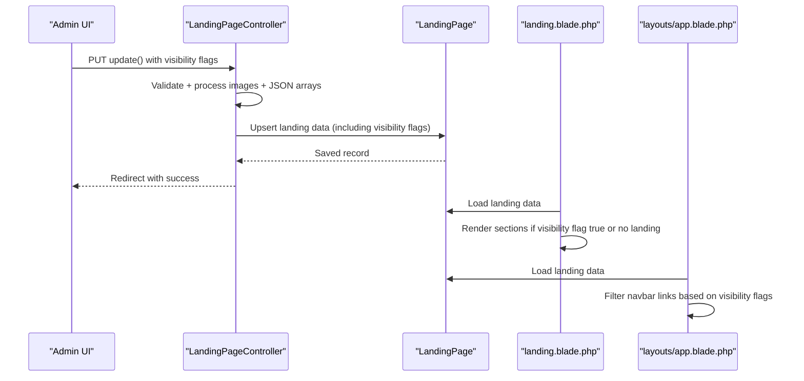
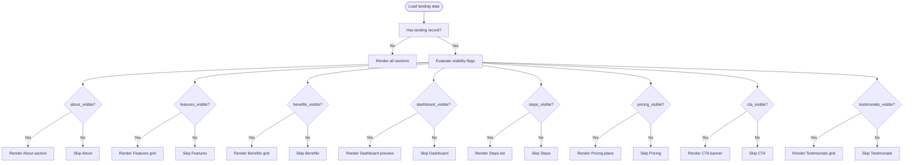
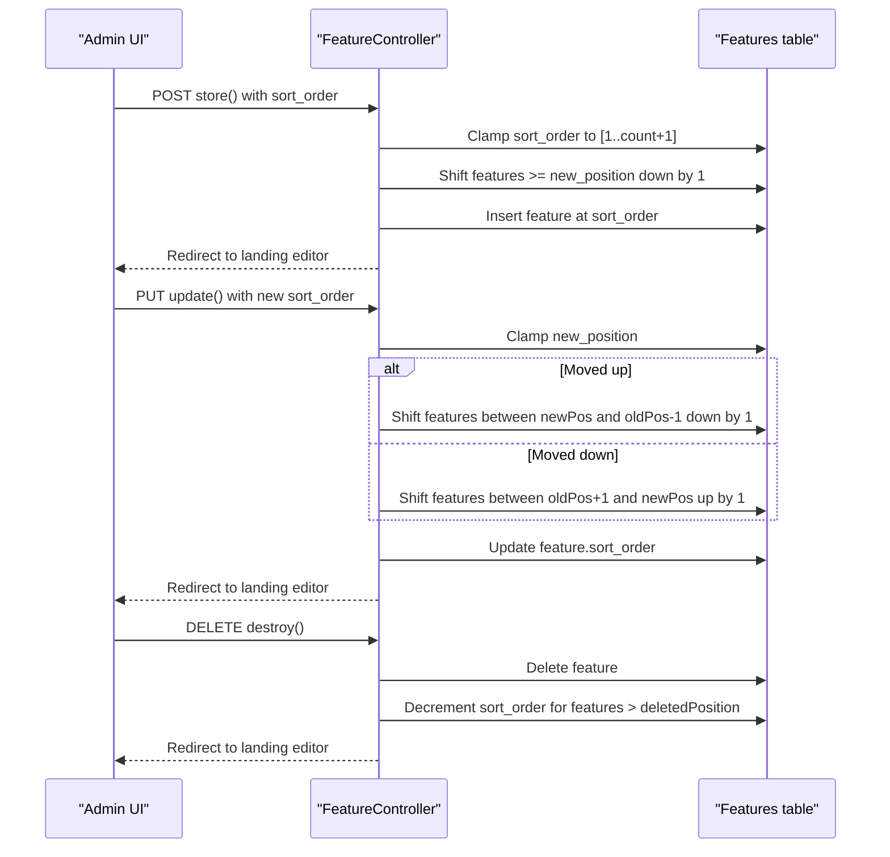
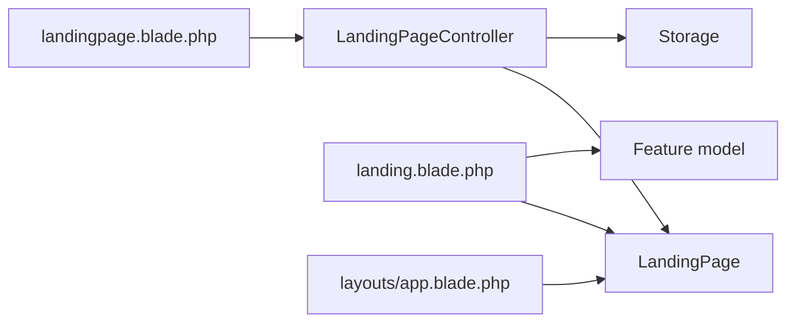

# Section Configuration & Visibility

<cite>
**Referenced Files in This Document**
- [LandingPage.php](file://app/Models/LandingPage.php)
- [LandingPageController.php](file://app/Http/Controllers/LandingPageController.php)
- [landingpage.blade.php](file://resources/views/admin/landingpage.blade.php)
- [landing.blade.php](file://resources/views/landing.blade.php)
- [app.blade.php](file://resources/views/layouts/app.blade.php)
- [Feature.php](file://app/Models/Feature.php)
- [FeatureController.php](file://app/Http/Controllers/FeatureController.php)
- [add_section_visibility_to_landing_pages.php](file://database/migrations/2026_06_22_022549_add_section_visibility_to_landing_pages.php)
- [add_testimonials_visible_to_landing_pages.php](file://database/migrations/2026_06_18_064300_add_testimonials_visible_to_landing_pages.php)
</cite>

## Table of Contents
1. [Introduction](#introduction)
2. [Project Structure](#project-structure)
3. [Core Components](#core-components)
4. [Architecture Overview](#architecture-overview)
5. [Detailed Component Analysis](#detailed-component-analysis)
6. [Dependency Analysis](#dependency-analysis)
7. [Performance Considerations](#performance-considerations)
8. [Troubleshooting Guide](#troubleshooting-guide)
9. [Conclusion](#conclusion)

## Introduction
This document explains how section configuration and visibility controls work within the content management system for the landing page. It covers:
- Boolean-based visibility toggles for each landing page section (about, features, benefits, dashboard, steps, pricing, CTA, testimonials)
- How visibility settings affect the public-facing landing page layout and navigation
- Configuration options for each section (titles, descriptions, images, pricing plans, testimonials)
- Section ordering system for features
- Activation workflows, visibility impact on rendering, best practices, and troubleshooting

## Project Structure
The landing page configuration spans models, controllers, Blade templates, and migrations:
- Model defines fillable attributes and boolean casts for visibility toggles
- Controller validates and persists section content and visibility flags
- Admin UI exposes per-section visibility toggles and content editors
- Public landing page renders sections conditionally based on visibility flags
- Navigation links are filtered dynamically based on visibility flags

**Diagram sources**
- [LandingPageController.php:19-222](file://app/Http/Controllers/LandingPageController.php#L19-L222)
- [landingpage.blade.php:40-1441](file://resources/views/admin/landingpage.blade.php#L40-L1441)
- [FeatureController.php:22-154](file://app/Http/Controllers/FeatureController.php#L22-L154)
- [LandingPage.php:9-57](file://app/Models/LandingPage.php#L9-L57)
- [Feature.php:9-16](file://app/Models/Feature.php#L9-L16)
- [landing.blade.php:130-470](file://resources/views/landing.blade.php#L130-L470)
- [app.blade.php:32-71](file://resources/views/layouts/app.blade.php#L32-L71)

**Section sources**
- [LandingPage.php:9-57](file://app/Models/LandingPage.php#L9-L57)
- [LandingPageController.php:19-222](file://app/Http/Controllers/LandingPageController.php#L19-L222)
- [landingpage.blade.php:40-1441](file://resources/views/admin/landingpage.blade.php#L40-L1441)
- [landing.blade.php:130-470](file://resources/views/landing.blade.php#L130-L470)
- [app.blade.php:32-71](file://resources/views/layouts/app.blade.php#L32-L71)
- [FeatureController.php:22-154](file://app/Http/Controllers/FeatureController.php#L22-L154)
- [Feature.php:9-16](file://app/Models/Feature.php#L9-L16)
- [add_section_visibility_to_landing_pages.php:14-22](file://database/migrations/2026_06_22_022549_add_section_visibility_to_landing_pages.php#L14-L22)
- [add_testimonials_visible_to_landing_pages.php:11-12](file://database/migrations/2026_06_18_064300_add_testimonials_visible_to_landing_pages.php#L11-L12)

## Core Components
- LandingPage model: Defines fillable attributes and boolean casts for visibility toggles. Visibility flags are stored as booleans in the database.
- LandingPageController: Validates and persists section content and visibility flags. Handles image uploads/deletes and JSON arrays for benefits, steps, testimonials, and pricing plans.
- Admin UI (landingpage.blade.php): Provides per-section visibility toggles and content editors. Each section tab includes a toggle that switches between active/inactive states.
- Public landing page (landing.blade.php): Renders sections only when their visibility flag is true (or when no landing record exists).
- Navigation filtering (layouts/app.blade.php): Removes navigation links that point to hidden sections.
- Feature model and controller: Manage feature ordering via sort_order and integrate with the features section.

Key visibility flags:
- about_visible
- features_visible
- benefits_visible
- dashboard_visible
- steps_visible
- pricing_visible
- cta_visible
- testimonials_visible

**Section sources**
- [LandingPage.php:9-57](file://app/Models/LandingPage.php#L9-L57)
- [LandingPageController.php:19-222](file://app/Http/Controllers/LandingPageController.php#L19-L222)
- [landingpage.blade.php:300-1036](file://resources/views/admin/landingpage.blade.php#L300-L1036)
- [landing.blade.php:130-470](file://resources/views/landing.blade.php#L130-L470)
- [app.blade.php:32-71](file://resources/views/layouts/app.blade.php#L32-L71)
- [FeatureController.php:22-154](file://app/Http/Controllers/FeatureController.php#L22-L154)
- [Feature.php:9-16](file://app/Models/Feature.php#L9-L16)

## Architecture Overview
The visibility system operates on a simple principle: each section has a boolean flag. On the public site, sections render only if the flag is true or if no landing record exists. Navigation links are filtered server-side to exclude anchors pointing to hidden sections.

**Diagram sources**
- [LandingPageController.php:19-222](file://app/Http/Controllers/LandingPageController.php#L19-L222)
- [LandingPage.php:9-57](file://app/Models/LandingPage.php#L9-L57)
- [landing.blade.php:130-470](file://resources/views/landing.blade.php#L130-L470)
- [app.blade.php:32-71](file://resources/views/layouts/app.blade.php#L32-L71)

## Detailed Component Analysis

### Visibility Flags and Rendering
- Visibility flags are boolean fields persisted in the landing_pages table.
- Public rendering checks each section’s visibility flag and conditionally renders it.
- Navigation filtering removes anchors to hidden sections.

**Diagram sources**
- [landing.blade.php:130-470](file://resources/views/landing.blade.php#L130-L470)
- [app.blade.php:32-71](file://resources/views/layouts/app.blade.php#L32-L71)

**Section sources**
- [landing.blade.php:130-470](file://resources/views/landing.blade.php#L130-L470)
- [app.blade.php:32-71](file://resources/views/layouts/app.blade.php#L32-L71)

### Admin Visibility Controls
Each section tab includes a toggle switch that updates the corresponding visibility flag. The UI reflects the current state with dynamic labels and styling.

- About: Toggle under the “Tentang” tab
- Features: Toggle under the “Fitur” tab
- Benefits: Toggle under the “Keunggulan” tab
- Dashboard: Toggle under the “Dashboard” tab
- Steps: Toggle under the “Cara Kerja” tab
- Testimonials: Toggle under the “Testimoni” tab
- Pricing: Toggle under the “Harga” tab
- CTA: Toggle under the “CTA” tab

The controller accepts these flags via request validation and stores them as booleans. The UI uses JavaScript helpers to update the toggle visuals and labels.

**Section sources**
- [landingpage.blade.php:300-1036](file://resources/views/admin/landingpage.blade.php#L300-L1036)
- [LandingPageController.php:38-72](file://app/Http/Controllers/LandingPageController.php#L38-L72)

### Section Ordering System (Features)
Features are ordered by sort_order. The FeatureController manages insertion, updates, and deletions while maintaining a contiguous sequence.

- Insertion clamps the requested position within valid bounds and shifts existing features accordingly.
- Updates handle moving features up/down and adjust sort_order of affected records.
- Deletion decrements sort_order for subsequent features.

**Diagram sources**
- [FeatureController.php:22-154](file://app/Http/Controllers/FeatureController.php#L22-L154)
- [Feature.php:9-16](file://app/Models/Feature.php#L9-L16)

**Section sources**
- [FeatureController.php:22-154](file://app/Http/Controllers/FeatureController.php#L22-L154)
- [Feature.php:9-16](file://app/Models/Feature.php#L9-L16)

### Configuration Options by Section
- Hero: title, description, badge, CTA buttons, hero image upload/delete
- Navigation: navbar CTA text/url, navigation links (label + URL/anchor)
- About: title, description, image upload/delete
- Features: managed via dedicated feature entries with icon/name or uploaded image, ordered by sort_order
- Benefits: array of items with icon and title
- Dashboard: title, description, image upload/delete
- Steps: array of items with icon, number, title, and description
- Testimonials: array of items with quote, name, role, and image URL
- Pricing: array of plans with tier, name, price, featured flag, and feature list (newline-separated)
- CTA: title and description
- Navigation filtering: anchors removed when corresponding sections are hidden

**Section sources**
- [LandingPageController.php:21-222](file://app/Http/Controllers/LandingPageController.php#L21-L222)
- [landingpage.blade.php:80-1036](file://resources/views/admin/landingpage.blade.php#L80-L1036)
- [landing.blade.php:10-548](file://resources/views/landing.blade.php#L10-L548)
- [app.blade.php:32-71](file://resources/views/layouts/app.blade.php#L32-L71)

### Activation Workflows and Best Practices
- Activate a section: Enable the corresponding visibility toggle in the admin UI; save changes.
- Visibility impact: Sections appear on the public landing page only when their visibility flag is true or when no landing record exists.
- Navigation impact: Hidden sections remove their anchors from the navbar.
- Best practices:
  - Keep visibility flags aligned with navigation links to avoid broken anchors.
  - Use testimonials_visible carefully since testimonials are rendered client-side with a separate toggle.
  - Maintain logical ordering for features using sort_order.
  - Use Lucide icon names for consistent visuals; fallback to uploaded images when needed.

**Section sources**
- [landingpage.blade.php:300-1036](file://resources/views/admin/landingpage.blade.php#L300-L1036)
- [landing.blade.php:130-470](file://resources/views/landing.blade.php#L130-L470)
- [app.blade.php:32-71](file://resources/views/layouts/app.blade.php#L32-L71)

## Dependency Analysis
- LandingPageController depends on LandingPage model and Laravel Storage for image handling.
- Admin UI depends on JavaScript helpers to manage toggles and repeaters.
- Public landing page depends on LandingPage model and Feature model for rendering.
- Navigation filtering depends on LandingPage visibility flags.

**Diagram sources**
- [LandingPageController.php:19-222](file://app/Http/Controllers/LandingPageController.php#L19-L222)
- [LandingPage.php:9-57](file://app/Models/LandingPage.php#L9-L57)
- [landingpage.blade.php:40-1441](file://resources/views/admin/landingpage.blade.php#L40-L1441)
- [landing.blade.php:130-470](file://resources/views/landing.blade.php#L130-L470)
- [app.blade.php:32-71](file://resources/views/layouts/app.blade.php#L32-L71)
- [Feature.php:9-16](file://app/Models/Feature.php#L9-L16)

**Section sources**
- [LandingPageController.php:19-222](file://app/Http/Controllers/LandingPageController.php#L19-L222)
- [landingpage.blade.php:40-1441](file://resources/views/admin/landingpage.blade.php#L40-L1441)
- [landing.blade.php:130-470](file://resources/views/landing.blade.php#L130-L470)
- [app.blade.php:32-71](file://resources/views/layouts/app.blade.php#L32-L71)
- [Feature.php:9-16](file://app/Models/Feature.php#L9-L16)

## Performance Considerations
- Visibility checks are simple boolean comparisons; negligible overhead.
- Image uploads/deletes involve disk I/O; batch operations should be avoided during peak traffic.
- Navigation filtering occurs server-side once per request; keep the number of navigation links reasonable.
- Feature sorting involves database updates; avoid frequent reordering during high load.

## Troubleshooting Guide
Common visibility-related issues and resolutions:
- Section does not appear on the public page:
  - Ensure the corresponding visibility flag is enabled in the admin UI.
  - Verify the landing record exists; if not, the system defaults to rendering sections.
- Navigation link missing:
  - Confirm the section is visible; hidden sections remove their anchors from the navbar.
- Testimonials toggle not working:
  - testimonials_visible controls whether testimonials are rendered; however, testimonials also have a client-side toggle in the public view. Ensure both visibility flags and client-side toggle are configured as intended.
- Image upload errors:
  - Check file type and size constraints; ensure the storage disk is writable.
- Feature ordering anomalies:
  - Reorder features using the sort_order field; ensure positions are within valid bounds.

**Section sources**
- [landingpage.blade.php:300-1036](file://resources/views/admin/landingpage.blade.php#L300-L1036)
- [landing.blade.php:130-470](file://resources/views/landing.blade.php#L130-L470)
- [app.blade.php:32-71](file://resources/views/layouts/app.blade.php#L32-L71)
- [LandingPageController.php:77-114](file://app/Http/Controllers/LandingPageController.php#L77-L114)
- [FeatureController.php:32-154](file://app/Http/Controllers/FeatureController.php#L32-L154)

## Conclusion
The landing page visibility system provides granular control over each section’s presence on the public site and in navigation. Admins can enable/disable sections and configure content through a unified interface. The public rendering respects visibility flags, and navigation is automatically filtered to match the current configuration. Features ordering is handled separately via sort_order, ensuring predictable presentation of feature cards. Following the best practices and troubleshooting tips outlined here will help maintain a consistent and user-friendly landing page experience.