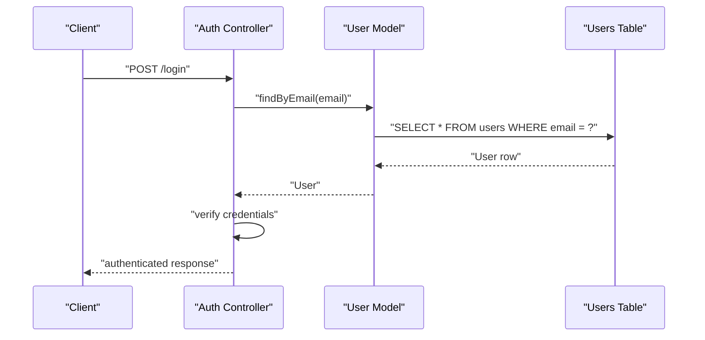
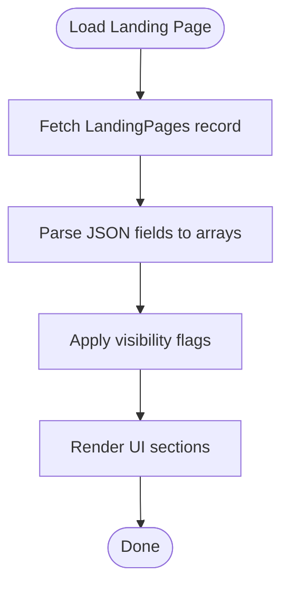
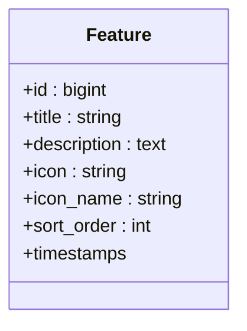
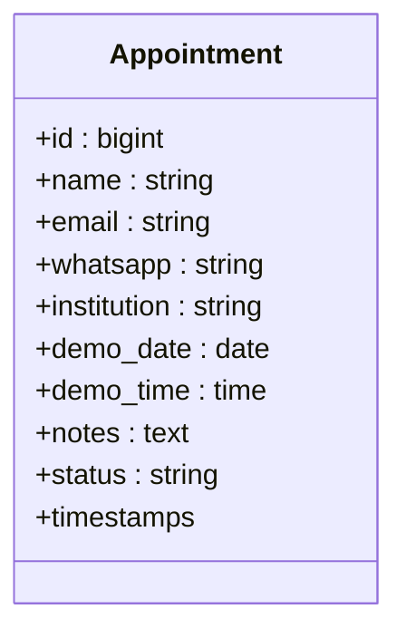
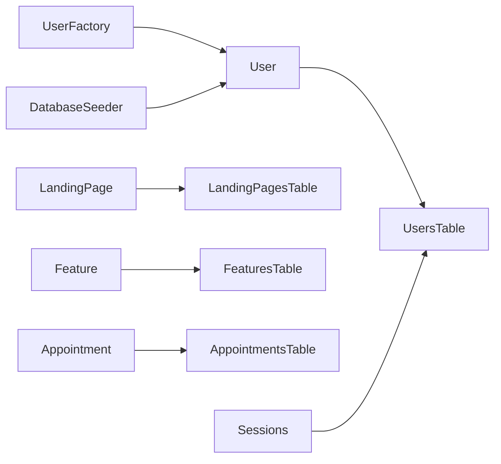

# Database Schema & Models

<cite>
**Referenced Files in This Document**
- [0001_01_01_000000_create_users_table.php](file://database/migrations/0001_01_01_000000_create_users_table.php)
- [2026_06_17_031941_create_landing_pages_table.php](file://database/migrations/2026_06_17_031941_create_landing_pages_table.php)
- [2026_06_17_060200_create_features_table.php](file://database/migrations/2026_06_17_060200_create_features_table.php)
- [2026_06_17_073934_add_icon_and_sort_to_features_table.php](file://database/migrations/2026_06_17_073934_add_icon_and_sort_to_features_table.php)
- [2026_06_18_023000_add_images_to_landing_pages_table.php](file://database/migrations/2026_06_18_023000_add_images_to_landing_pages_table.php)
- [2026_06_18_035802_add_dashboard_and_navbar_to_landing_pages_table.php](file://database/migrations/2026_06_18_035802_add_dashboard_and_navbar_to_landing_pages_table.php)
- [2026_06_18_040000_add_all_sections_to_landing_pages_table.php](file://database/migrations/2026_06_18_040000_add_all_sections_to_landing_pages_table.php)
- [2026_06_18_060800_add_icon_name_to_features_table.php](file://database/migrations/2026_06_18_060800_add_icon_name_to_features_table.php)
- [2026_06_18_064300_add_testimonials_visible_to_landing_pages.php](file://database/migrations/2026_06_18_064300_add_testimonials_visible_to_landing_pages.php)
- [2026_06_22_022549_add_section_visibility_to_landing_pages.php](file://database/migrations/2026_06_22_022549_add_section_visibility_to_landing_pages.php)
- [2026_06_22_024652_create_appointments_table.php](file://database/migrations/2026_06_22_024652_create_appointments_table.php)
- [User.php](file://app/Models/User.php)
- [LandingPage.php](file://app/Models/LandingPage.php)
- [Feature.php](file://app/Models/Feature.php)
- [Appointment.php](file://app/Models/Appointment.php)
- [UserFactory.php](file://database/factories/UserFactory.php)
- [DatabaseSeeder.php](file://database/seeders/DatabaseSeeder.php)
</cite>

## Table of Contents
1. [Introduction](#introduction)
2. [Project Structure](#project-structure)
3. [Core Components](#core-components)
4. [Architecture Overview](#architecture-overview)
5. [Detailed Component Analysis](#detailed-component-analysis)
6. [Dependency Analysis](#dependency-analysis)
7. [Performance Considerations](#performance-considerations)
8. [Troubleshooting Guide](#troubleshooting-guide)
9. [Conclusion](#conclusion)
10. [Appendices](#appendices)

## Introduction
This document provides comprehensive database schema documentation for ClinicalLog CMS, detailing all database tables, their relationships, and field definitions. It explains migration files that define schema evolution, indexing strategies, and foreign key constraints. It also documents Eloquent model relationships, data casting for JSON fields, and model fillable attributes. Entity relationship diagrams illustrate table connections, and data flow patterns are explained. Database performance considerations, query optimization strategies, and data integrity measures are addressed. Factory and seeder implementations for testing and development are documented, along with examples of customizing models and extending the database schema.

## Project Structure
The database schema is primarily defined by Laravel migration files under the database/migrations directory and represented by Eloquent models under app/Models. Factories and seeders support testing and development.

```mermaid
graph TB
subgraph "Migrations"
M1["0001_01_01_000000_create_users_table.php"]
M2["2026_06_17_031941_create_landing_pages_table.php"]
M3["2026_06_17_060200_create_features_table.php"]
M4["2026_06_17_073934_add_icon_and_sort_to_features_table.php"]
M5["2026_06_18_023000_add_images_to_landing_pages_table.php"]
M6["2026_06_18_035802_add_dashboard_and_navbar_to_landing_pages_table.php"]
M7["2026_06_18_040000_add_all_sections_to_landing_pages_table.php"]
M8["2026_06_18_060800_add_icon_name_to_features_table.php"]
M9["2026_06_18_064300_add_testimonials_visible_to_landing_pages.php"]
M10["2026_06_22_022549_add_section_visibility_to_landing_pages.php"]
M11["2026_06_22_024652_create_appointments_table.php"]
end
subgraph "Models"
U["User.php"]
LP["LandingPage.php"]
F["Feature.php"]
A["Appointment.php"]
end
subgraph "Factories & Seeders"
UF["UserFactory.php"]
DS["DatabaseSeeder.php"]
end
M1 --> U
M2 --> LP
M3 --> F
M11 --> A
UF --> U
DS --> U
```



**Diagram sources**
- [0001_01_01_000000_create_users_table.php:1-50](file://database/migrations/0001_01_01_000000_create_users_table.php#L1-L50)
- [2026_06_17_031941_create_landing_pages_table.php:1-32](file://database/migrations/2026_06_17_031941_create_landing_pages_table.php#L1-L32)
- [2026_06_17_060200_create_features_table.php:1-34](file://database/migrations/2026_06_17_060200_create_features_table.php#L1-L34)
- [2026_06_17_073934_add_icon_and_sort_to_features_table.php:1-30](file://database/migrations/2026_06_17_073934_add_icon_and_sort_to_features_table.php#L1-L30)
- [2026_06_18_023000_add_images_to_landing_pages_table.php:1-24](file://database/migrations/2026_06_18_023000_add_images_to_landing_pages_table.php#L1-L24)
- [2026_06_18_035802_add_dashboard_and_navbar_to_landing_pages_table.php:1-44](file://database/migrations/2026_06_18_035802_add_dashboard_and_navbar_to_landing_pages_table.php#L1-L44)
- [2026_06_18_040000_add_all_sections_to_landing_pages_table.php:1-46](file://database/migrations/2026_06_18_040000_add_all_sections_to_landing_pages_table.php#L1-L46)
- [2026_06_18_060800_add_icon_name_to_features_table.php:1-29](file://database/migrations/2026_06_18_060800_add_icon_name_to_features_table.php#L1-L29)
- [2026_06_18_064300_add_testimonials_visible_to_landing_pages.php:1-23](file://database/migrations/2026_06_18_064300_add_testimonials_visible_to_landing_pages.php#L1-L23)
- [2026_06_22_022549_add_section_visibility_to_landing_pages.php:1-43](file://database/migrations/2026_06_22_022549_add_section_visibility_to_landing_pages.php#L1-L43)
- [2026_06_22_024652_create_appointments_table.php:1-36](file://database/migrations/2026_06_22_024652_create_appointments_table.php#L1-L36)
- [User.php:1-33](file://app/Models/User.php#L1-L33)
- [LandingPage.php:1-59](file://app/Models/LandingPage.php#L1-L59)
- [Feature.php:1-17](file://app/Models/Feature.php#L1-L17)
- [Appointment.php:1-20](file://app/Models/Appointment.php#L1-L20)
- [UserFactory.php](file://database/factories/UserFactory.php)
- [DatabaseSeeder.php](file://database/seeders/DatabaseSeeder.php)

**Section sources**
- [0001_01_01_000000_create_users_table.php:1-50](file://database/migrations/0001_01_01_000000_create_users_table.php#L1-L50)
- [2026_06_17_031941_create_landing_pages_table.php:1-32](file://database/migrations/2026_06_17_031941_create_landing_pages_table.php#L1-L32)
- [2026_06_17_060200_create_features_table.php:1-34](file://database/migrations/2026_06_17_060200_create_features_table.php#L1-L34)
- [2026_06_22_024652_create_appointments_table.php:1-36](file://database/migrations/2026_06_22_024652_create_appointments_table.php#L1-L36)
- [User.php:1-33](file://app/Models/User.php#L1-L33)
- [LandingPage.php:1-59](file://app/Models/LandingPage.php#L1-L59)
- [Feature.php:1-17](file://app/Models/Feature.php#L1-L17)
- [Appointment.php:1-20](file://app/Models/Appointment.php#L1-L20)
- [UserFactory.php](file://database/factories/UserFactory.php)
- [DatabaseSeeder.php](file://database/seeders/DatabaseSeeder.php)

## Core Components
This section outlines the database schema, focusing on tables, fields, constraints, and indexes derived from migration files, and how Eloquent models map to these tables.

- Users table
  - Purpose: Stores user accounts with authentication and session metadata.
  - Fields: id, name, email (unique), email_verified_at, password, remember_token, timestamps.
  - Indexes: email unique index; sessions.user_id indexed; sessions.last_activity indexed.
  - Notes: Includes password_reset_tokens and sessions companion tables for password resets and session management.

- Landing pages table
  - Purpose: Manages dynamic landing page content and sections.
  - Fields: id, hero_title, hero_description, hero_image, hero_badge, hero_cta_primary, hero_cta_secondary, navbar_links (JSON), navbar_cta_text, navbar_cta_url, about_title, about_description, about_image, dashboard_title, dashboard_description, dashboard_image, cta_title, cta_description, benefits (JSON), steps (JSON), testimonials (JSON), pricing_plans (JSON), visibility booleans for sections (about_visible, features_visible, benefits_visible, dashboard_visible, steps_visible, pricing_visible, cta_visible, testimonials_visible), gdrive links, timestamps.
  - Notes: Extensive JSON and boolean fields for flexible content management.

- Features table
  - Purpose: Stores feature entries for the landing page.
  - Fields: id, title, description, icon, icon_name, sort_order, timestamps.
  - Notes: Supports icons, names, and ordering.

- Appointments table
  - Purpose: Records appointment requests with contact and scheduling details.
  - Fields: id, name, email, whatsapp, institution, demo_date, demo_time, notes, status, timestamps.
  - Notes: Status defaults to pending; date/time stored separately.

**Section sources**
- [0001_01_01_000000_create_users_table.php:14-37](file://database/migrations/0001_01_01_000000_create_users_table.php#L14-L37)
- [2026_06_17_031941_create_landing_pages_table.php:11-21](file://database/migrations/2026_06_17_031941_create_landing_pages_table.php#L11-L21)
- [2026_06_17_060200_create_features_table.php:14-23](file://database/migrations/2026_06_17_060200_create_features_table.php#L14-L23)
- [2026_06_17_073934_add_icon_and_sort_to_features_table.php:14-17](file://database/migrations/2026_06_17_073934_add_icon_and_sort_to_features_table.php#L14-L17)
- [2026_06_18_023000_add_images_to_landing_pages_table.php:11-14](file://database/migrations/2026_06_18_023000_add_images_to_landing_pages_table.php#L11-L14)
- [2026_06_18_035802_add_dashboard_and_navbar_to_landing_pages_table.php:14-24](file://database/migrations/2026_06_18_035802_add_dashboard_and_navbar_to_landing_pages_table.php#L14-L24)
- [2026_06_18_040000_add_all_sections_to_landing_pages_table.php:11-26](file://database/migrations/2026_06_18_040000_add_all_sections_to_landing_pages_table.php#L11-L26)
- [2026_06_18_060800_add_icon_name_to_features_table.php:14-16](file://database/migrations/2026_06_18_060800_add_icon_name_to_features_table.php#L14-L16)
- [2026_06_18_064300_add_testimonials_visible_to_landing_pages.php:11-12](file://database/migrations/2026_06_18_064300_add_testimonials_visible_to_landing_pages.php#L11-L12)
- [2026_06_22_022549_add_section_visibility_to_landing_pages.php:14-22](file://database/migrations/2026_06_22_022549_add_section_visibility_to_landing_pages.php#L14-L22)
- [2026_06_22_024652_create_appointments_table.php:14-25](file://database/migrations/2026_06_22_024652_create_appointments_table.php#L14-L25)

## Architecture Overview
The schema supports a content-driven landing page with modular sections, user authentication, and appointment management. The models encapsulate fillable attributes and data casting for JSON and boolean fields. Factories and seeders facilitate testing and development.

```mermaid
erDiagram
USERS {
bigint id PK
string name
string email UK
timestamp email_verified_at
string password
string remember_token
timestamps
}
SESSIONS {
string id PK
bigint user_id IDX
string ip_address
text user_agent
longtext payload
int last_activity IDX
}
PASSWORD_RESET_TOKENS {
string email PK
string token
timestamp created_at
}
LANDING_PAGES {
bigint id PK
string hero_title
text hero_description
string hero_image
string hero_badge
string hero_cta_primary
string hero_cta_secondary
json navbar_links
string navbar_cta_text
string navbar_cta_url
string dashboard_title
text dashboard_description
string dashboard_image
string about_title
longtext about_description
string about_image
string cta_title
text cta_description
json benefits
json steps
json testimonials
json pricing_plans
boolean about_visible
boolean features_visible
boolean benefits_visible
boolean dashboard_visible
boolean steps_visible
boolean pricing_visible
boolean cta_visible
boolean testimonials_visible
string terms_gdrive_url
string privacy_gdrive_url
timestamps
}
FEATURES {
bigint id PK
string title
text description
string icon
string icon_name
int sort_order
timestamps
}
APPOINTMENTS {
bigint id PK
string name
string email
string whatsapp
string institution
date demo_date
time demo_time
text notes
string status
timestamps
}
USERS ||--o{ SESSIONS : "has sessions"
FEATURES ||--o{ LANDING_PAGES : "referenced via JSON fields"
APPOINTMENTS ||--|| LANDING_PAGES : "no direct FK"
```

**Diagram sources**
- [0001_01_01_000000_create_users_table.php:14-37](file://database/migrations/0001_01_01_000000_create_users_table.php#L14-L37)
- [2026_06_17_031941_create_landing_pages_table.php:11-21](file://database/migrations/2026_06_17_031941_create_landing_pages_table.php#L11-L21)
- [2026_06_17_060200_create_features_table.php:14-23](file://database/migrations/2026_06_17_060200_create_features_table.php#L14-L23)
- [2026_06_22_024652_create_appointments_table.php:14-25](file://database/migrations/2026_06_22_024652_create_appointments_table.php#L14-L25)

## Detailed Component Analysis

### Users and Sessions
- Schema highlights
  - Unique index on email for fast lookups and integrity.
  - sessions.user_id is indexed for efficient user session retrieval.
  - sessions.last_activity is indexed to optimize cleanup and activity queries.
- Model mapping
  - User model defines fillable and hidden attributes and uses hashed casting for passwords and datetime casting for email verification.
- Security and integrity
  - Password hashing via model casting ensures secure storage.
  - Sessions table supports session-based authentication lifecycle.



**Diagram sources**
- [0001_01_01_000000_create_users_table.php:14-37](file://database/migrations/0001_01_01_000000_create_users_table.php#L14-L37)
- [User.php:25-31](file://app/Models/User.php#L25-L31)

**Section sources**
- [0001_01_01_000000_create_users_table.php:14-37](file://database/migrations/0001_01_01_000000_create_users_table.php#L14-L37)
- [User.php:13-31](file://app/Models/User.php#L13-L31)

### Landing Pages
- Schema highlights
  - JSON fields for structured content (benefits, steps, testimonials, pricing_plans).
  - Boolean flags to toggle section visibility.
  - Additional fields for images and navigation bar configuration.
- Model mapping
  - Fillable attributes include all editable fields.
  - Casts convert JSON strings to arrays and visibility flags to booleans.
- Content flexibility
  - JSON fields enable dynamic content editing without schema changes.
  - Visibility flags allow administrators to show/hide sections.



**Diagram sources**
- [2026_06_18_040000_add_all_sections_to_landing_pages_table.php:22-25](file://database/migrations/2026_06_18_040000_add_all_sections_to_landing_pages_table.php#L22-L25)
- [2026_06_22_022549_add_section_visibility_to_landing_pages.php:15-21](file://database/migrations/2026_06_22_022549_add_section_visibility_to_landing_pages.php#L15-L21)
- [LandingPage.php:43-57](file://app/Models/LandingPage.php#L43-L57)

**Section sources**
- [2026_06_17_031941_create_landing_pages_table.php:11-21](file://database/migrations/2026_06_17_031941_create_landing_pages_table.php#L11-L21)
- [2026_06_18_023000_add_images_to_landing_pages_table.php:11-14](file://database/migrations/2026_06_18_023000_add_images_to_landing_pages_table.php#L11-L14)
- [2026_06_18_035802_add_dashboard_and_navbar_to_landing_pages_table.php:14-24](file://database/migrations/2026_06_18_035802_add_dashboard_and_navbar_to_landing_pages_table.php#L14-L24)
- [2026_06_18_040000_add_all_sections_to_landing_pages_table.php:11-26](file://database/migrations/2026_06_18_040000_add_all_sections_to_landing_pages_table.php#L11-L26)
- [2026_06_18_064300_add_testimonials_visible_to_landing_pages.php:11-12](file://database/migrations/2026_06_18_064300_add_testimonials_visible_to_landing_pages.php#L11-L12)
- [2026_06_22_022549_add_section_visibility_to_landing_pages.php:14-22](file://database/migrations/2026_06_22_022549_add_section_visibility_to_landing_pages.php#L14-L22)
- [LandingPage.php:9-57](file://app/Models/LandingPage.php#L9-L57)

### Features
- Schema highlights
  - Icon and icon_name support for visual indicators.
  - sort_order enables configurable presentation order.
- Model mapping
  - Fillable includes title, description, icon, icon_name, and sort_order.



**Diagram sources**
- [2026_06_17_060200_create_features_table.php:14-23](file://database/migrations/2026_06_17_060200_create_features_table.php#L14-L23)
- [2026_06_17_073934_add_icon_and_sort_to_features_table.php:14-17](file://database/migrations/2026_06_17_073934_add_icon_and_sort_to_features_table.php#L14-L17)
- [2026_06_18_060800_add_icon_name_to_features_table.php:14-16](file://database/migrations/2026_06_18_060800_add_icon_name_to_features_table.php#L14-L16)
- [Feature.php:9-16](file://app/Models/Feature.php#L9-L16)

**Section sources**
- [2026_06_17_060200_create_features_table.php:14-23](file://database/migrations/2026_06_17_060200_create_features_table.php#L14-L23)
- [2026_06_17_073934_add_icon_and_sort_to_features_table.php:14-17](file://database/migrations/2026_06_17_073934_add_icon_and_sort_to_features_table.php#L14-L17)
- [2026_06_18_060800_add_icon_name_to_features_table.php:14-16](file://database/migrations/2026_06_18_060800_add_icon_name_to_features_table.php#L14-L16)
- [Feature.php:9-16](file://app/Models/Feature.php#L9-L16)

### Appointments
- Schema highlights
  - Contact and institutional information.
  - Separate date and time fields for scheduling.
  - Status field with default value for workflow tracking.
- Model mapping
  - Fillable attributes include all request fields.



**Diagram sources**
- [2026_06_22_024652_create_appointments_table.php:14-25](file://database/migrations/2026_06_22_024652_create_appointments_table.php#L14-L25)
- [Appointment.php:9-18](file://app/Models/Appointment.php#L9-L18)

**Section sources**
- [2026_06_22_024652_create_appointments_table.php:14-25](file://database/migrations/2026_06_22_024652_create_appointments_table.php#L14-L25)
- [Appointment.php:9-18](file://app/Models/Appointment.php#L9-L18)

### Eloquent Models and Casting
- User model
  - Uses attributes-based annotations to declare fillable and hidden fields.
  - Casts email_verified_at to datetime and password to hashed.
- LandingPage model
  - Declares fillable attributes for all editable fields.
  - Casts JSON fields to arrays and visibility booleans to booleans.
- Feature model
  - Declares fillable attributes for feature content and metadata.
- Appointment model
  - Declares fillable attributes for appointment request data.

**Section sources**
- [User.php:13-31](file://app/Models/User.php#L13-L31)
- [LandingPage.php:9-57](file://app/Models/LandingPage.php#L9-L57)
- [Feature.php:9-16](file://app/Models/Feature.php#L9-L16)
- [Appointment.php:9-18](file://app/Models/Appointment.php#L9-L18)

### Factory and Seeder Implementation
- Factories
  - UserFactory exists to support model generation during testing and seeding.
- Seeders
  - DatabaseSeeder exists as the entry point for seeding the database.

**Section sources**
- [UserFactory.php](file://database/factories/UserFactory.php)
- [DatabaseSeeder.php](file://database/seeders/DatabaseSeeder.php)

## Dependency Analysis
- Internal dependencies
  - Models depend on their respective tables and Laravel’s Eloquent ORM.
  - Factories depend on models to generate test data.
  - Seeders depend on factories and models to populate initial data.
- External dependencies
  - Database drivers and schema management via Laravel migrations.
  - Session and password reset tables complement the users table.



**Diagram sources**
- [UserFactory.php](file://database/factories/UserFactory.php)
- [DatabaseSeeder.php](file://database/seeders/DatabaseSeeder.php)
- [User.php:15-18](file://app/Models/User.php#L15-L18)
- [LandingPage.php:7-8](file://app/Models/LandingPage.php#L7-L8)
- [Feature.php:7-8](file://app/Models/Feature.php#L7-L8)
- [Appointment.php:7-8](file://app/Models/Appointment.php#L7-L8)
- [0001_01_01_000000_create_users_table.php:14-37](file://database/migrations/0001_01_01_000000_create_users_table.php#L14-L37)

**Section sources**
- [UserFactory.php](file://database/factories/UserFactory.php)
- [DatabaseSeeder.php](file://database/seeders/DatabaseSeeder.php)
- [User.php:15-18](file://app/Models/User.php#L15-L18)
- [LandingPage.php:7-8](file://app/Models/LandingPage.php#L7-L8)
- [Feature.php:7-8](file://app/Models/Feature.php#L7-L8)
- [Appointment.php:7-8](file://app/Models/Appointment.php#L7-L8)
- [0001_01_01_000000_create_users_table.php:14-37](file://database/migrations/0001_01_01_000000_create_users_table.php#L14-L37)

## Performance Considerations
- Indexing strategies
  - Unique index on users.email for fast authentication and deduplication.
  - sessions.user_id and sessions.last_activity indexed to optimize session queries and cleanup.
- JSON and boolean fields
  - JSON fields in landing_pages enable flexible content but require careful parsing; consider normalization if frequent joins or filtering by nested fields become necessary.
  - Boolean flags simplify rendering logic and can be indexed if used in frequent filters.
- Query optimization
  - Use selective field retrieval via fillable attributes to minimize payload.
  - Leverage Eager Loading when fetching related records to reduce N+1 queries.
  - Consider adding indexes on frequently filtered or ordered columns (e.g., appointments.status, features.sort_order).
- Data integrity
  - Model casting ensures consistent data types for JSON and booleans.
  - Unique constraints on emails protect account integrity.
  - Default values (e.g., appointments.status, visibility flags) maintain consistent state.

## Troubleshooting Guide
- Common issues
  - JSON parsing errors: Validate JSON fields before casting; handle malformed JSON gracefully.
  - Missing indexes: Add indexes for high-cardinality filters (e.g., status, timestamps).
  - Session cleanup: Ensure scheduled tasks remove expired sessions using last_activity thresholds.
- Debugging tips
  - Enable query logging during development to identify slow queries.
  - Use tinker to inspect model casts and fillable attributes.
  - Validate factory-generated data against model expectations.

## Conclusion
ClinicalLog CMS employs a flexible schema centered around a dynamic landing page with JSON-backed content and boolean visibility toggles, complemented by user authentication and appointment management. Migrations define clear table structures, indexes, and constraints. Eloquent models encapsulate fillable attributes and data casting for robust type safety. Factories and seeders support efficient testing and development. Performance and integrity are maintained through strategic indexing, default values, and model-level casting.

## Appendices
- Customization examples
  - Adding a new landing page section: Extend the landing_pages table with a new JSON or text column and update the model’s fillable and casts accordingly.
  - Introducing a new feature property: Add a column to the features table and include it in the model’s fillable list.
  - Enhancing appointment tracking: Add additional status transitions or timestamps and adjust model validation rules.