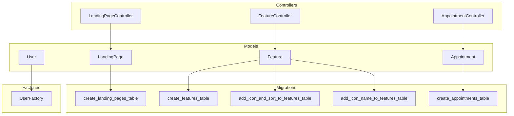
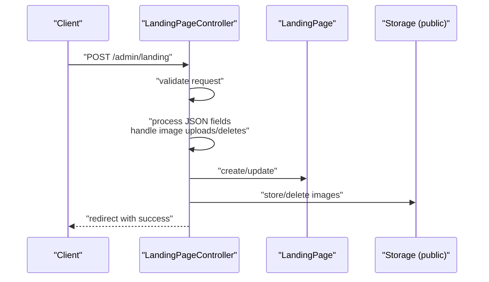
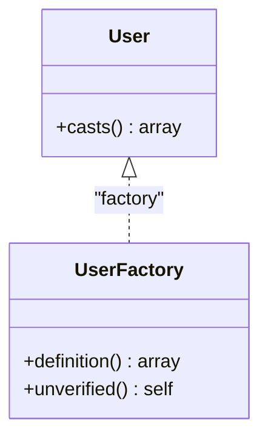
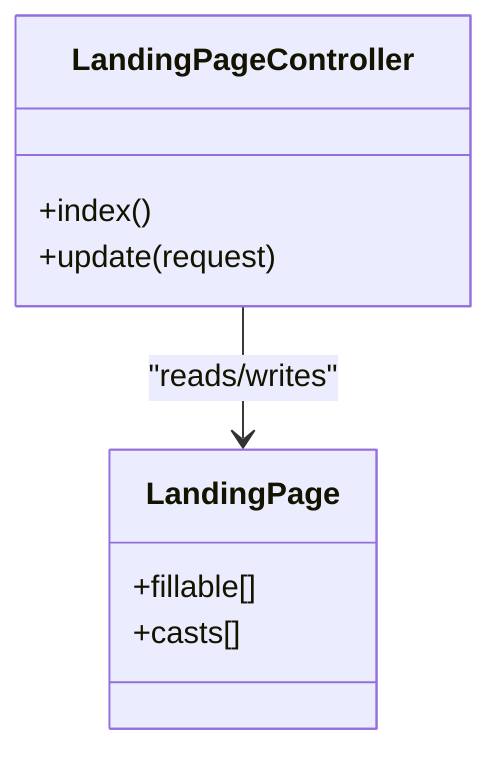
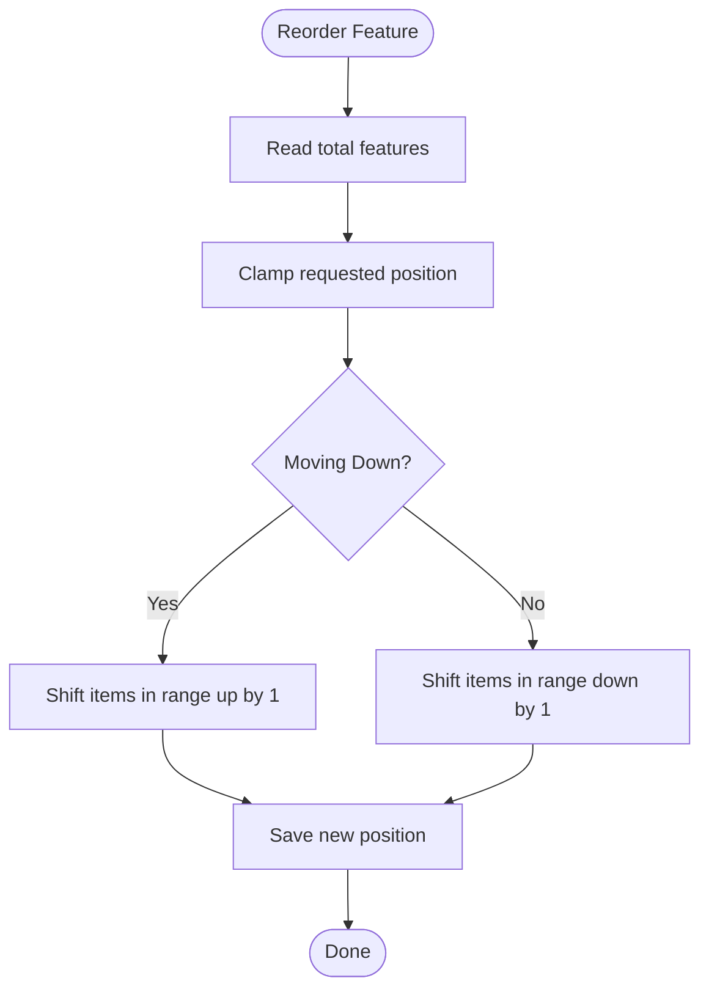
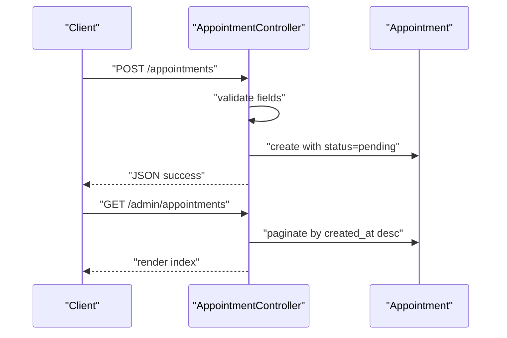
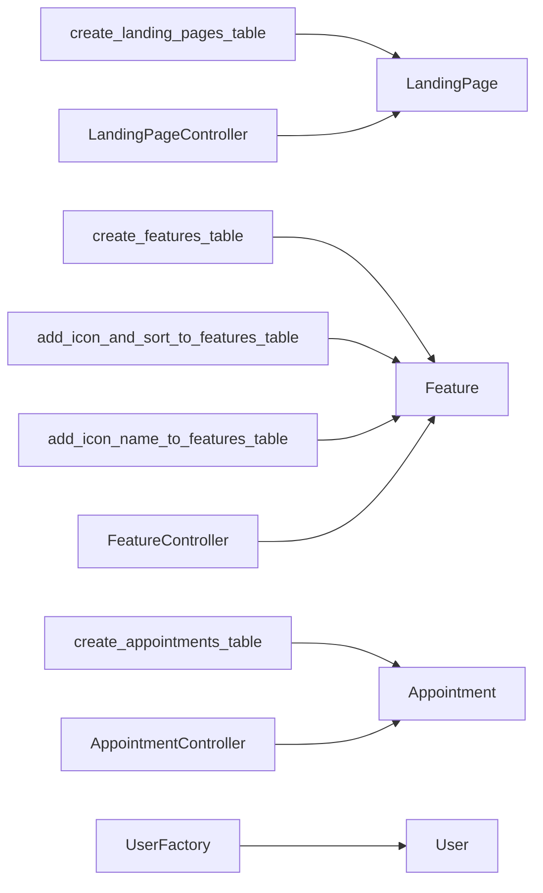

# Eloquent Models & Relationships

<cite>
**Referenced Files in This Document**
- [User.php](file://app/Models/User.php)
- [LandingPage.php](file://app/Models/LandingPage.php)
- [Feature.php](file://app/Models/Feature.php)
- [Appointment.php](file://app/Models/Appointment.php)
- [UserFactory.php](file://database/factories/UserFactory.php)
- [LandingPageController.php](file://app/Http/Controllers/LandingPageController.php)
- [FeatureController.php](file://app/Http/Controllers/FeatureController.php)
- [AppointmentController.php](file://app/Http/Controllers/AppointmentController.php)
- [2026_06_17_031941_create_landing_pages_table.php](file://database/migrations/2026_06_17_031941_create_landing_pages_table.php)
- [2026_06_17_060200_create_features_table.php](file://database/migrations/2026_06_17_060200_create_features_table.php)
- [2026_06_17_073934_add_icon_and_sort_to_features_table.php](file://database/migrations/2026_06_17_073934_add_icon_and_sort_to_features_table.php)
- [2026_06_18_060800_add_icon_name_to_features_table.php](file://database/migrations/2026_06_18_060800_add_icon_name_to_features_table.php)
- [2026_06_22_024652_create_appointments_table.php](file://database/migrations/2026_06_22_024652_create_appointments_table.php)
</cite>

## Table of Contents
1. [Introduction](#introduction)
2. [Project Structure](#project-structure)
3. [Core Components](#core-components)
4. [Architecture Overview](#architecture-overview)
5. [Detailed Component Analysis](#detailed-component-analysis)
6. [Dependency Analysis](#dependency-analysis)
7. [Performance Considerations](#performance-considerations)
8. [Troubleshooting Guide](#troubleshooting-guide)
9. [Conclusion](#conclusion)
10. [Appendices](#appendices)

## Introduction
This document explains the Eloquent models used in the ClinicalLog CMS, focusing on structure, relationships, validation rules, data casting, accessors/mutators, scopes, and query builders. It covers:
- User model for authentication
- LandingPage model with JSON/array casting for dynamic content
- Feature model with position-based ordering
- Appointment model for contact/demo management

It also documents model factories, controller usage, and guidance for extending models and adding custom business logic.

## Project Structure
The models are located under app/Models and are accompanied by migrations under database/migrations. Factories live under database/factories. Controllers orchestrate model usage and enforce validation rules.

**Diagram sources**
- [User.php:1-33](file://app/Models/User.php#L1-L33)
- [LandingPage.php:1-59](file://app/Models/LandingPage.php#L1-L59)
- [Feature.php:1-17](file://app/Models/Feature.php#L1-L17)
- [Appointment.php:1-20](file://app/Models/Appointment.php#L1-L20)
- [UserFactory.php:1-46](file://database/factories/UserFactory.php#L1-L46)
- [2026_06_17_031941_create_landing_pages_table.php:1-32](file://database/migrations/2026_06_17_031941_create_landing_pages_table.php#L1-L32)
- [2026_06_17_060200_create_features_table.php:1-34](file://database/migrations/2026_06_17_060200_create_features_table.php#L1-L34)
- [2026_06_17_073934_add_icon_and_sort_to_features_table.php:1-29](file://database/migrations/2026_06_17_073934_add_icon_and_sort_to_features_table.php#L1-L29)
- [2026_06_18_060800_add_icon_name_to_features_table.php:1-28](file://database/migrations/2026_06_18_060800_add_icon_name_to_features_table.php#L1-L28)
- [2026_06_22_024652_create_appointments_table.php:1-36](file://database/migrations/2026_06_22_024652_create_appointments_table.php#L1-L36)
- [LandingPageController.php:1-224](file://app/Http/Controllers/LandingPageController.php#L1-L224)
- [FeatureController.php:1-156](file://app/Http/Controllers/FeatureController.php#L1-L156)
- [AppointmentController.php:1-77](file://app/Http/Controllers/AppointmentController.php#L1-L77)

**Section sources**
- [User.php:1-33](file://app/Models/User.php#L1-L33)
- [LandingPage.php:1-59](file://app/Models/LandingPage.php#L1-L59)
- [Feature.php:1-17](file://app/Models/Feature.php#L1-L17)
- [Appointment.php:1-20](file://app/Models/Appointment.php#L1-L20)
- [UserFactory.php:1-46](file://database/factories/UserFactory.php#L1-L46)
- [2026_06_17_031941_create_landing_pages_table.php:1-32](file://database/migrations/2026_06_17_031941_create_landing_pages_table.php#L1-L32)
- [2026_06_17_060200_create_features_table.php:1-34](file://database/migrations/2026_06_17_060200_create_features_table.php#L1-L34)
- [2026_06_17_073934_add_icon_and_sort_to_features_table.php:1-29](file://database/migrations/2026_06_17_073934_add_icon_and_sort_to_features_table.php#L1-L29)
- [2026_06_18_060800_add_icon_name_to_features_table.php:1-28](file://database/migrations/2026_06_18_060800_add_icon_name_to_features_table.php#L1-L28)
- [2026_06_22_024652_create_appointments_table.php:1-36](file://database/migrations/2026_06_22_024652_create_appointments_table.php#L1-L36)
- [LandingPageController.php:1-224](file://app/Http/Controllers/LandingPageController.php#L1-L224)
- [FeatureController.php:1-156](file://app/Http/Controllers/FeatureController.php#L1-L156)
- [AppointmentController.php:1-77](file://app/Http/Controllers/AppointmentController.php#L1-L77)

## Core Components
- User: Authentication backbone with fillable and hidden attributes and hashed password casting.
- LandingPage: Dynamic content container with JSON/array casting for structured fields and visibility toggles.
- Feature: Content feature with optional icon file or icon name, ordered by sort_order.
- Appointment: Contact/demo request with validation and status management.

Key characteristics:
- Mass assignment protection via guarded/fillable arrays.
- Data casting for dates, booleans, and JSON fields.
- Controller-driven validation and persistence logic.
- No explicit model relationships defined in the models themselves; relationships are inferred from migrations and usage.

**Section sources**
- [User.php:13-31](file://app/Models/User.php#L13-L31)
- [LandingPage.php:9-57](file://app/Models/LandingPage.php#L9-L57)
- [Feature.php:9-15](file://app/Models/Feature.php#L9-L15)
- [Appointment.php:9-18](file://app/Models/Appointment.php#L9-L18)
- [LandingPageController.php:21-47](file://app/Http/Controllers/LandingPageController.php#L21-L47)
- [FeatureController.php:22-54](file://app/Http/Controllers/FeatureController.php#L22-L54)
- [AppointmentController.php:16-24](file://app/Http/Controllers/AppointmentController.php#L16-L24)

## Architecture Overview
The models are used by controllers to handle requests, apply validation, manage uploads, and persist data. LandingPageController coordinates updates to complex JSON structures and images. FeatureController manages ordering and icon handling. AppointmentController handles creation, listing, and status updates.

**Diagram sources**
- [LandingPageController.php:19-222](file://app/Http/Controllers/LandingPageController.php#L19-L222)
- [LandingPage.php:9-57](file://app/Models/LandingPage.php#L9-L57)

**Section sources**
- [LandingPageController.php:1-224](file://app/Http/Controllers/LandingPageController.php#L1-L224)
- [LandingPage.php:1-59](file://app/Models/LandingPage.php#L1-L59)

## Detailed Component Analysis

### User Model
Purpose:
- Authentication and authorization foundation.
- Defines fillable attributes and sensitive fields to hide.
- Casts datetime and password fields.

Attributes and casting:
- Fillable: name, email, password.
- Hidden: password, remember_token.
- Casts: email_verified_at to datetime, password to hashed.

Validation and factory:
- Validation is handled by Form Requests in controllers.
- Factory seeds default user data and supports unverified state.

Extensibility:
- Add roles/permissions via additional attributes and policies.
- Extend authentication guards or middleware as needed.

**Diagram sources**
- [User.php:13-31](file://app/Models/User.php#L13-L31)
- [UserFactory.php:25-44](file://database/factories/UserFactory.php#L25-L44)

**Section sources**
- [User.php:13-31](file://app/Models/User.php#L13-L31)
- [UserFactory.php:25-44](file://database/factories/UserFactory.php#L25-L44)

### LandingPage Model
Purpose:
- Centralized configuration for the marketing page.
- Stores structured content as arrays/JSON.

Attributes and casting:
- Fillable includes hero/about/dashboard/CTA sections, navbar links, testimonials, benefits, steps, pricing plans, and visibility flags.
- Casts several JSON fields to array and visibility flags to boolean.

Controller usage:
- LandingPageController validates and normalizes JSON inputs (navbar_links, benefits, steps, testimonials, pricing_plans).
- Handles image uploads and deletions for hero, about, and dashboard images.

Extensibility:
- Add new sections by extending fillable and adding migrations.
- Introduce accessors/mutators for computed fields or derived values.

**Diagram sources**
- [LandingPage.php:9-57](file://app/Models/LandingPage.php#L9-L57)
- [LandingPageController.php:11-222](file://app/Http/Controllers/LandingPageController.php#L11-L222)

**Section sources**
- [LandingPage.php:9-57](file://app/Models/LandingPage.php#L9-L57)
- [LandingPageController.php:19-222](file://app/Http/Controllers/LandingPageController.php#L19-L222)

### Feature Model
Purpose:
- Manage feature cards displayed on the landing page.
- Supports two icon modes: uploaded file or icon name (Lucide).

Attributes and ordering:
- Fillable includes title, description, icon path/name, and sort_order.
- sort_order defaults to 0 and is used for positioning.

Controller logic:
- FeatureController enforces position clamping and shifts existing items to maintain gaps.
- Handles icon uploads, switching between file and name, and deletion.

Extensibility:
- Add scopes for visibility or category filters.
- Introduce accessors for computed icon display logic.

**Diagram sources**
- [FeatureController.php:94-121](file://app/Http/Controllers/FeatureController.php#L94-L121)
- [Feature.php:9-15](file://app/Models/Feature.php#L9-L15)

**Section sources**
- [Feature.php:9-15](file://app/Models/Feature.php#L9-L15)
- [FeatureController.php:22-154](file://app/Http/Controllers/FeatureController.php#L22-L154)

### Appointment Model
Purpose:
- Capture contact/demo requests with validation and status tracking.

Attributes:
- Fillable includes personal info, institution, date/time, notes, and status with default pending.

Controller usage:
- Validates required fields, ensures future or present date, and creates records.
- Provides listing and status update endpoints for admin.

Extensibility:
- Add scopes for status/date filtering.
- Introduce enums or constants for status values.

**Diagram sources**
- [AppointmentController.php:14-75](file://app/Http/Controllers/AppointmentController.php#L14-L75)
- [Appointment.php:9-18](file://app/Models/Appointment.php#L9-L18)

**Section sources**
- [Appointment.php:9-18](file://app/Models/Appointment.php#L9-L18)
- [AppointmentController.php:14-75](file://app/Http/Controllers/AppointmentController.php#L14-L75)

## Dependency Analysis
- Models depend on migrations for schema definition.
- Controllers depend on models for persistence and on Storage for media handling.
- Factories depend on models for seeding.

**Diagram sources**
- [2026_06_17_031941_create_landing_pages_table.php:11-21](file://database/migrations/2026_06_17_031941_create_landing_pages_table.php#L11-L21)
- [2026_06_17_060200_create_features_table.php:14-23](file://database/migrations/2026_06_17_060200_create_features_table.php#L14-L23)
- [2026_06_17_073934_add_icon_and_sort_to_features_table.php:14-16](file://database/migrations/2026_06_17_073934_add_icon_and_sort_to_features_table.php#L14-L16)
- [2026_06_18_060800_add_icon_name_to_features_table.php:14-15](file://database/migrations/2026_06_18_060800_add_icon_name_to_features_table.php#L14-L15)
- [2026_06_22_024652_create_appointments_table.php:14-24](file://database/migrations/2026_06_22_024652_create_appointments_table.php#L14-L24)
- [LandingPageController.php:11-16](file://app/Http/Controllers/LandingPageController.php#L11-L16)
- [FeatureController.php:11-20](file://app/Http/Controllers/FeatureController.php#L11-L20)
- [AppointmentController.php:46-50](file://app/Http/Controllers/AppointmentController.php#L46-L50)
- [UserFactory.php:25-33](file://database/factories/UserFactory.php#L25-L33)

**Section sources**
- [2026_06_17_031941_create_landing_pages_table.php:11-21](file://database/migrations/2026_06_17_031941_create_landing_pages_table.php#L11-L21)
- [2026_06_17_060200_create_features_table.php:14-23](file://database/migrations/2026_06_17_060200_create_features_table.php#L14-L23)
- [2026_06_17_073934_add_icon_and_sort_to_features_table.php:14-16](file://database/migrations/2026_06_17_073934_add_icon_and_sort_to_features_table.php#L14-L16)
- [2026_06_18_060800_add_icon_name_to_features_table.php:14-15](file://database/migrations/2026_06_18_060800_add_icon_name_to_features_table.php#L14-L15)
- [2026_06_22_024652_create_appointments_table.php:14-24](file://database/migrations/2026_06_22_024652_create_appointments_table.php#L14-L24)
- [LandingPageController.php:11-16](file://app/Http/Controllers/LandingPageController.php#L11-L16)
- [FeatureController.php:11-20](file://app/Http/Controllers/FeatureController.php#L11-L20)
- [AppointmentController.php:46-50](file://app/Http/Controllers/AppointmentController.php#L46-L50)
- [UserFactory.php:25-33](file://database/factories/UserFactory.php#L25-L33)

## Performance Considerations
- Use pagination for lists (e.g., features and appointments).
- Minimize unnecessary JSON transformations; process only when required.
- Batch updates for reordering to reduce round-trips.
- Store images on efficient disk setups and consider CDN for production.

## Troubleshooting Guide
Common issues and resolutions:
- Image upload failures: Ensure public disk write permissions and correct MIME/type constraints.
- JSON field normalization errors: Validate input shape before assigning to array-cast fields.
- Ordering anomalies: Confirm clamp logic and that reordering queries target the correct ranges.
- Status transitions: Enforce allowed values via validation rules.

**Section sources**
- [LandingPageController.php:77-114](file://app/Http/Controllers/LandingPageController.php#L77-L114)
- [FeatureController.php:94-121](file://app/Http/Controllers/FeatureController.php#L94-L121)
- [AppointmentController.php:57-59](file://app/Http/Controllers/AppointmentController.php#L57-L59)

## Conclusion
The models in ClinicalLog CMS are intentionally lightweight and complemented by robust controller logic for validation, uploads, and data shaping. LandingPage centralizes dynamic content with JSON/array casting, Feature supports flexible ordering and icons, and Appointment manages contact/demo workflows. Extending these models involves adding attributes, casting, validation, and controller handlers while preserving mass assignment safety and data integrity.

## Appendices

### Model Attributes and Casting Reference
- User
  - Fillable: name, email, password
  - Hidden: password, remember_token
  - Casts: email_verified_at (datetime), password (hashed)
- LandingPage
  - Fillable: hero_* fields, about_* fields, dashboard_* fields, cta_* fields, testimonials, benefits, steps, pricing_plans, visibility flags, gdrive URLs
  - Casts: navbar_links, benefits, steps, testimonials, pricing_plans (array), visibility flags (boolean)
- Feature
  - Fillable: title, description, icon, icon_name, sort_order
- Appointment
  - Fillable: name, email, whatsapp, institution, demo_date, demo_time, notes, status

**Section sources**
- [User.php:13-31](file://app/Models/User.php#L13-L31)
- [LandingPage.php:9-57](file://app/Models/LandingPage.php#L9-L57)
- [Feature.php:9-15](file://app/Models/Feature.php#L9-L15)
- [Appointment.php:9-18](file://app/Models/Appointment.php#L9-L18)

### Validation Rules by Model
- LandingPageController.update: comprehensive field validation and image rules
- FeatureController.store/update: icon handling and sort order validation
- AppointmentController.store: required fields, date validation, status default
- AppointmentController.updateStatus: status enum validation

**Section sources**
- [LandingPageController.php:21-47](file://app/Http/Controllers/LandingPageController.php#L21-L47)
- [FeatureController.php:22-54](file://app/Http/Controllers/FeatureController.php#L22-L54)
- [AppointmentController.php:16-24](file://app/Http/Controllers/AppointmentController.php#L16-L24)
- [AppointmentController.php:57-59](file://app/Http/Controllers/AppointmentController.php#L57-L59)