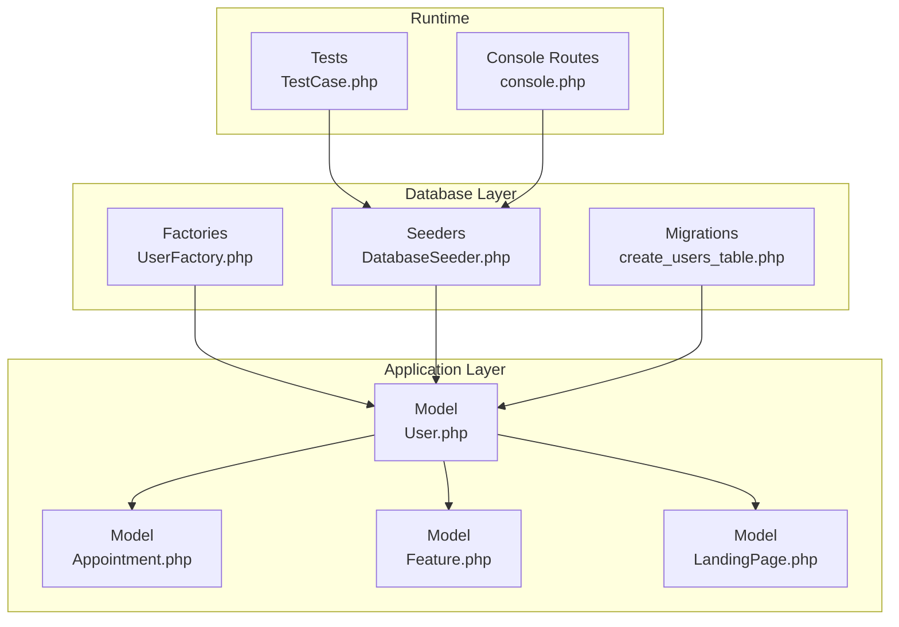
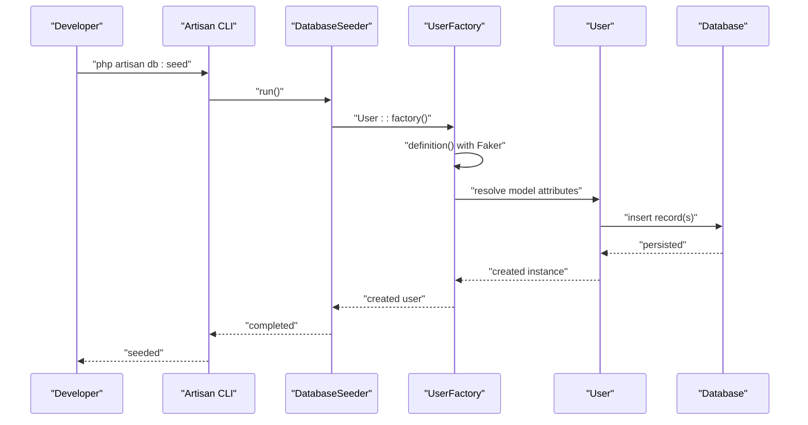
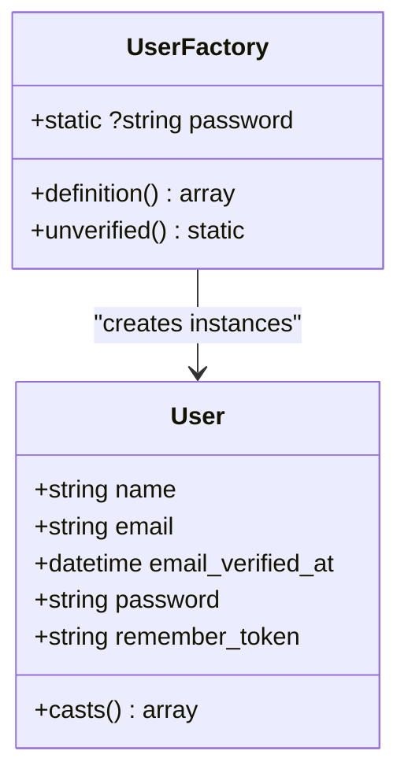
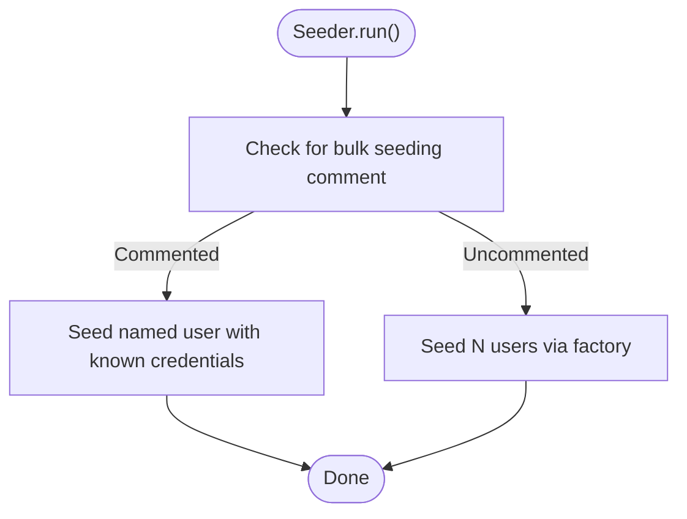
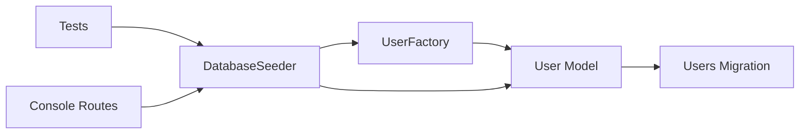

# Factories & Seeders

<cite>
**Referenced Files in This Document**
- [UserFactory.php](file://database/factories/UserFactory.php)
- [DatabaseSeeder.php](file://database/seeders/DatabaseSeeder.php)
- [User.php](file://app/Models/User.php)
- [0001_01_01_000000_create_users_table.php](file://database/migrations/0001_01_01_000000_create_users_table.php)
- [Appointment.php](file://app/Models/Appointment.php)
- [Feature.php](file://app/Models/Feature.php)
- [LandingPage.php](file://app/Models/LandingPage.php)
- [console.php](file://routes/console.php)
- [TestCase.php](file://tests/TestCase.php)
</cite>

## Table of Contents
1. [Introduction](#introduction)
2. [Project Structure](#project-structure)
3. [Core Components](#core-components)
4. [Architecture Overview](#architecture-overview)
5. [Detailed Component Analysis](#detailed-component-analysis)
6. [Dependency Analysis](#dependency-analysis)
7. [Performance Considerations](#performance-considerations)
8. [Troubleshooting Guide](#troubleshooting-guide)
9. [Conclusion](#conclusion)

## Introduction
This document explains the database factories and seeders in ClinicalLog CMS, focusing on how test users are generated via the UserFactory and how the DatabaseSeeder orchestrates initial data population. It also covers factory states, Faker integration, and practical guidance for extending factories to new models, creating related data, and implementing conditional seeding strategies for development, testing, and production environments.

## Project Structure
The factories and seeders live under the database directory, while Eloquent models reside under app/Models. Migrations define the schema for tables such as users, and models declare fillable attributes and casting behavior. The seeder currently seeds a single verified user account for convenience during development.

**Diagram sources**
- [UserFactory.php:1-46](file://database/factories/UserFactory.php#L1-L46)
- [DatabaseSeeder.php:1-26](file://database/seeders/DatabaseSeeder.php#L1-L26)
- [User.php:1-33](file://app/Models/User.php#L1-L33)
- [0001_01_01_000000_create_users_table.php:1-50](file://database/migrations/0001_01_01_000000_create_users_table.php#L1-L50)
- [Appointment.php:1-20](file://app/Models/Appointment.php#L1-L20)
- [Feature.php:1-17](file://app/Models/Feature.php#L1-L17)
- [LandingPage.php:1-59](file://app/Models/LandingPage.php#L1-L59)
- [console.php:1-9](file://routes/console.php#L1-L9)
- [TestCase.php:1-11](file://tests/TestCase.php#L1-L11)

**Section sources**
- [UserFactory.php:1-46](file://database/factories/UserFactory.php#L1-L46)
- [DatabaseSeeder.php:1-26](file://database/seeders/DatabaseSeeder.php#L1-L26)
- [User.php:1-33](file://app/Models/User.php#L1-L33)
- [0001_01_01_000000_create_users_table.php:1-50](file://database/migrations/0001_01_01_000000_create_users_table.php#L1-L50)
- [console.php:1-9](file://routes/console.php#L1-L9)
- [TestCase.php:1-11](file://tests/TestCase.php#L1-L11)

## Core Components
- UserFactory: Generates realistic user records using Faker, sets default verified state, and exposes an unverified state for testing email verification flows.
- DatabaseSeeder: Orchestrates seeding of the application database; currently seeds a single verified user record for quick development setup.
- User model: Declares fillable and hidden attributes, casting for timestamps and hashed passwords, and integrates with the UserFactory.
- Migrations: Define the users table schema, including unique email, timestamps, and remember tokens.

Key capabilities demonstrated:
- Faker integration for realistic names and unique emails.
- Default password hashing and shared password caching for efficiency.
- Factory state customization via unverified().
- Seeding a named user record for deterministic testing.

**Section sources**
- [UserFactory.php:25-44](file://database/factories/UserFactory.php#L25-L44)
- [DatabaseSeeder.php:16-24](file://database/seeders/DatabaseSeeder.php#L16-L24)
- [User.php:13-31](file://app/Models/User.php#L13-L31)
- [0001_01_01_000000_create_users_table.php:14-22](file://database/migrations/0001_01_01_000000_create_users_table.php#L14-L22)

## Architecture Overview
The factory-to-seeder pipeline leverages Laravel’s Eloquent factories and seeders to produce consistent, reproducible datasets for development and testing.

**Diagram sources**
- [DatabaseSeeder.php:16-24](file://database/seeders/DatabaseSeeder.php#L16-L24)
- [UserFactory.php:25-34](file://database/factories/UserFactory.php#L25-L34)
- [User.php:17-18](file://app/Models/User.php#L17-L18)

## Detailed Component Analysis

### UserFactory
Implements realistic user generation with:
- Default verified state for immediate usability.
- Unique email generation to avoid migration failures.
- Shared default password for simplicity in development.
- State customization to simulate unverified accounts.

**Diagram sources**
- [UserFactory.php:13-45](file://database/factories/UserFactory.php#L13-L45)
- [User.php:15-31](file://app/Models/User.php#L15-L31)

Implementation highlights:
- Default state composition via definition() returns attributes compatible with the users table schema.
- unverified() overrides email verification timestamp to null, enabling tests around verification flows.
- Password hashing is centralized to reduce overhead across multiple records.

**Section sources**
- [UserFactory.php:25-34](file://database/factories/UserFactory.php#L25-L34)
- [UserFactory.php:39-44](file://database/factories/UserFactory.php#L39-L44)
- [0001_01_01_000000_create_users_table.php:14-22](file://database/migrations/0001_01_01_000000_create_users_table.php#L14-L22)

### DatabaseSeeder
Seeding orchestration:
- Uses WithoutModelEvents trait to suppress model events during seeding for speed.
- Seeds a single named user with a known email for deterministic testing scenarios.
- Provides commented example of bulk seeding for quick iteration.

**Diagram sources**
- [DatabaseSeeder.php:16-24](file://database/seeders/DatabaseSeeder.php#L16-L24)

Operational guidance:
- To seed many users for load testing, uncomment the bulk seeding line and adjust count.
- For CI or production-like environments, prefer targeted seeding of minimal viable data.

**Section sources**
- [DatabaseSeeder.php:11-24](file://database/seeders/DatabaseSeeder.php#L11-L24)

### Model Attributes and Casting
The User model declares:
- Fillable attributes for mass assignment safety.
- Hidden attributes to exclude sensitive fields from serialization.
- Casts for email verification timestamp and password hashing.

These declarations ensure factories and seeders write compatible data and that runtime behavior remains consistent.

**Section sources**
- [User.php:13-31](file://app/Models/User.php#L13-L31)

### Extending Factories for New Models
To add factories for other models:
- Create a dedicated factory class under database/factories for each model.
- Reference the model class and define a definition() method returning attributes aligned with the model’s fillable fields and migration schema.
- Add state methods for common variations (e.g., pending, expired, inactive).
- Use sequences for unique numeric identifiers or incrementing counters.
- Leverage Faker providers for realistic data (names, addresses, dates).

Example extension pattern:
- For a model with timestamps and enums, define states for each enum value.
- For related models, compose factories to create parent-child relationships.

Note: This section provides conceptual guidance; refer to existing UserFactory for concrete patterns.

### Creating Related Data Through Factory Relationships
Factories can create related records by invoking another factory within definition() or by chaining creates. For example:
- A User factory can create associated Appointment records.
- A LandingPage factory can create Feature records.

This enables realistic dataset creation for end-to-end testing.

Note: This section provides conceptual guidance; adapt patterns to your models’ relationships.

### Conditional Seeding Strategies
Environment-aware seeding:
- Development: Seed small, realistic datasets with verified users and optional demo content.
- Testing: Use WithoutModelEvents and deterministic seeds for fast, repeatable runs.
- Production: Avoid seeding via seeders; use migrations for schema and controlled data provisioning outside the application.

Integration points:
- Use environment checks inside run() to branch seeding logic.
- For large datasets, prefer raw SQL or specialized commands.

Note: This section provides conceptual guidance; tailor to your deployment needs.

### Customizing Seed Data for Specific Use Cases
- Known credentials: Seed a user with a fixed name and email for manual testing.
- Variants: Use factory states to generate users with different roles or verification statuses.
- Bulk generation: Adjust counts per environment to match testing requirements.

**Section sources**
- [DatabaseSeeder.php:18-23](file://database/seeders/DatabaseSeeder.php#L18-L23)
- [UserFactory.php:39-44](file://database/factories/UserFactory.php#L39-L44)

## Dependency Analysis
Relationships among components:
- UserFactory depends on the User model and Faker for attribute generation.
- DatabaseSeeder depends on UserFactory and the User model to persist records.
- User model depends on migrations for schema correctness and casting for attribute handling.
- Test suite and console routes can trigger seeding for local development and CI.

**Diagram sources**
- [UserFactory.php:5-8](file://database/factories/UserFactory.php#L5-L8)
- [DatabaseSeeder.php:5-7](file://database/seeders/DatabaseSeeder.php#L5-L7)
- [User.php:6-18](file://app/Models/User.php#L6-L18)
- [0001_01_01_000000_create_users_table.php:14-22](file://database/migrations/0001_01_01_000000_create_users_table.php#L14-L22)
- [console.php:1-9](file://routes/console.php#L1-L9)
- [TestCase.php:1-11](file://tests/TestCase.php#L1-L11)

**Section sources**
- [UserFactory.php:5-8](file://database/factories/UserFactory.php#L5-L8)
- [DatabaseSeeder.php:5-7](file://database/seeders/DatabaseSeeder.php#L5-L7)
- [User.php:6-18](file://app/Models/User.php#L6-L18)
- [0001_01_01_000000_create_users_table.php:14-22](file://database/migrations/0001_01_01_000000_create_users_table.php#L14-L22)
- [console.php:1-9](file://routes/console.php#L1-L9)
- [TestCase.php:1-11](file://tests/TestCase.php#L1-L11)

## Performance Considerations
- Use WithoutModelEvents during seeding to minimize event overhead.
- Prefer targeted counts for development; reserve bulk seeding for performance testing.
- Centralize default values in factories to reduce repeated computation.
- Avoid unnecessary model hydration in seeders; focus on essential attributes.

## Troubleshooting Guide
Common issues and resolutions:
- Duplicate emails: Ensure uniqueness constraints are respected; the UserFactory uses unique emails to prevent migration errors.
- Verification state mismatches: Use the unverified state to simulate pending verification flows.
- Missing factories: Confirm the model declares HasFactory and references the correct factory class.
- Environment-specific failures: Guard seeding logic with environment checks to avoid unintended data mutations in production.

**Section sources**
- [UserFactory.php:29](file://database/factories/UserFactory.php#L29)
- [UserFactory.php:41-43](file://database/factories/UserFactory.php#L41-L43)
- [User.php:17-18](file://app/Models/User.php#L17-L18)

## Conclusion
ClinicalLog CMS provides a concise foundation for generating realistic test users and seeding initial data. The UserFactory delivers consistent, verifiable records with minimal boilerplate, while the DatabaseSeeder offers a simple entry point for development and testing. By extending factories for new models, leveraging states and Faker, and adopting conditional seeding strategies, teams can maintain efficient, reliable test environments tailored to their workflows.