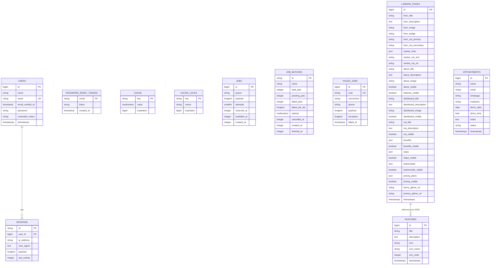
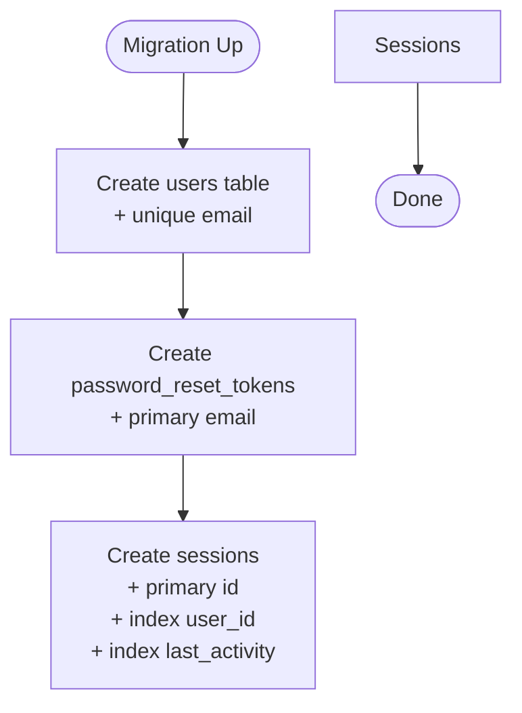
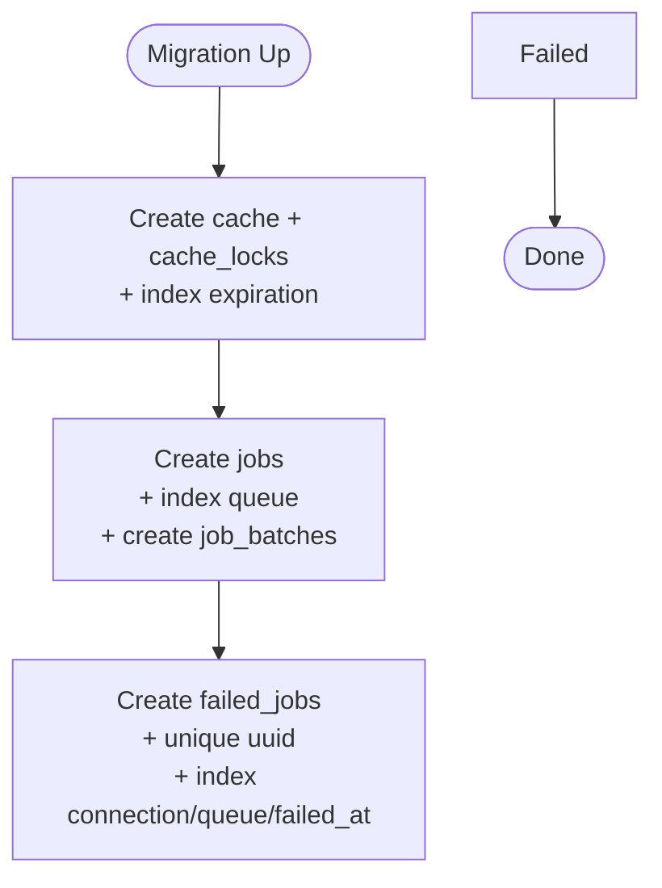
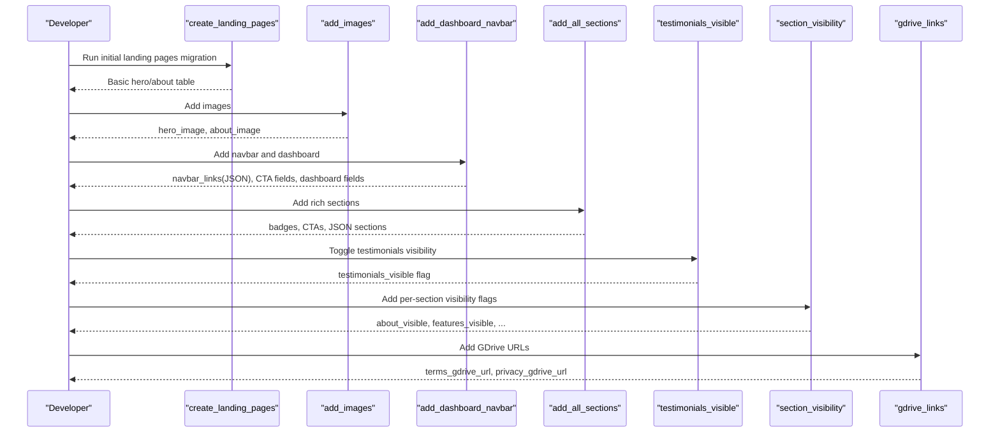
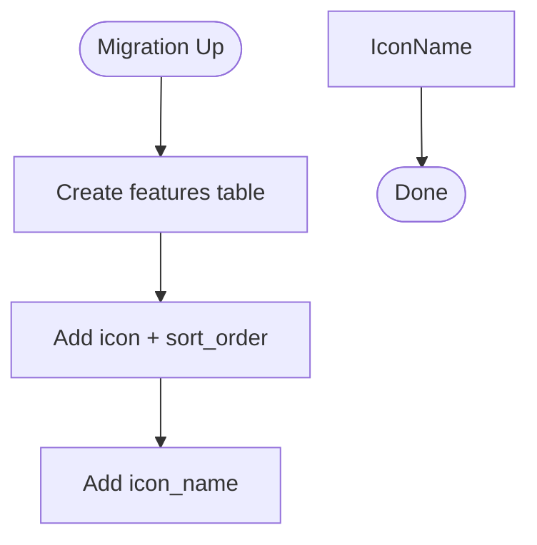
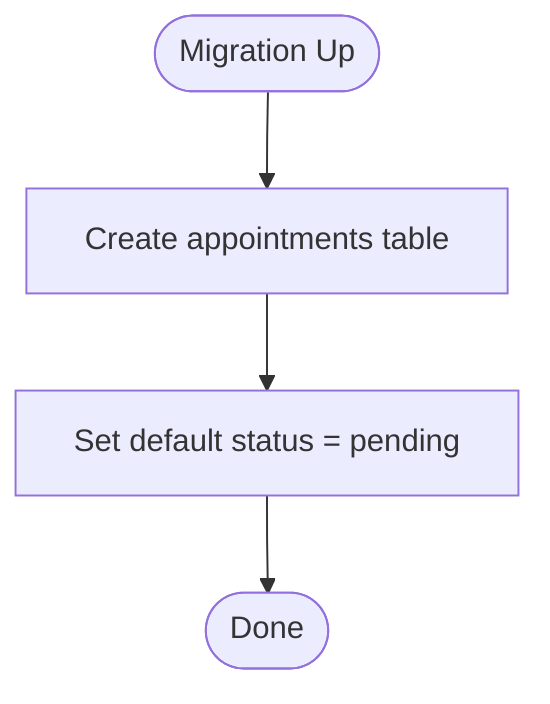
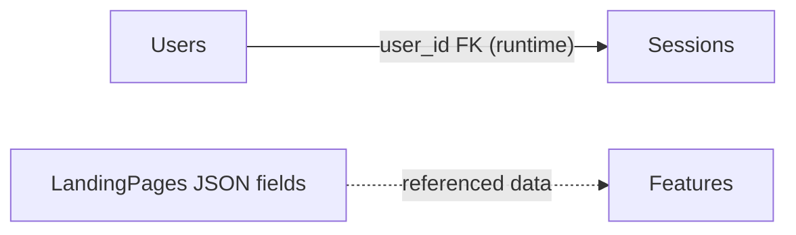

# Migration Files & Schema Evolution

<cite>
**Referenced Files in This Document**
- [0001_01_01_000000_create_users_table.php](file://database/migrations/0001_01_01_000000_create_users_table.php)
- [0001_01_01_000001_create_cache_table.php](file://database/migrations/0001_01_01_000001_create_cache_table.php)
- [0001_01_01_000002_create_jobs_table.php](file://database/migrations/0001_01_01_000002_create_jobs_table.php)
- [2026_06_17_031941_create_landing_pages_table.php](file://database/migrations/2026_06_17_031941_create_landing_pages_table.php)
- [2026_06_17_060200_create_features_table.php](file://database/migrations/2026_06_17_060200_create_features_table.php)
- [2026_06_17_073934_add_icon_and_sort_to_features_table.php](file://database/migrations/2026_06_17_073934_add_icon_and_sort_to_features_table.php)
- [2026_06_18_023000_add_images_to_landing_pages_table.php](file://database/migrations/2026_06_18_023000_add_images_to_landing_pages_table.php)
- [2026_06_18_035802_add_dashboard_and_navbar_to_landing_pages_table.php](file://database/migrations/2026_06_18_035802_add_dashboard_and_navbar_to_landing_pages_table.php)
- [2026_06_18_040000_add_all_sections_to_landing_pages_table.php](file://database/migrations/2026_06_18_040000_add_all_sections_to_landing_pages_table.php)
- [2026_06_18_060800_add_icon_name_to_features_table.php](file://database/migrations/2026_06_18_060800_add_icon_name_to_features_table.php)
- [2026_06_18_064300_add_testimonials_visible_to_landing_pages.php](file://database/migrations/2026_06_18_064300_add_testimonials_visible_to_landing_pages.php)
- [2026_06_22_022549_add_section_visibility_to_landing_pages.php](file://database/migrations/2026_06_22_022549_add_section_visibility_to_landing_pages.php)
- [2026_06_22_024652_create_appointments_table.php](file://database/migrations/2026_06_22_024652_create_appointments_table.php)
- [2026_06_22_031700_add_gdrive_links_to_landing_pages.php](file://database/migrations/2026_06_22_031700_add_gdrive_links_to_landing_pages.php)
- [User.php](file://app/Models/User.php)
- [LandingPage.php](file://app/Models/LandingPage.php)
- [Feature.php](file://app/Models/Feature.php)
- [Appointment.php](file://app/Models/Appointment.php)
</cite>

## Table of Contents
1. [Introduction](#introduction)
2. [Project Structure](#project-structure)
3. [Core Components](#core-components)
4. [Architecture Overview](#architecture-overview)
5. [Detailed Component Analysis](#detailed-component-analysis)
6. [Dependency Analysis](#dependency-analysis)
7. [Performance Considerations](#performance-considerations)
8. [Troubleshooting Guide](#troubleshooting-guide)
9. [Conclusion](#conclusion)
10. [Appendices](#appendices)

## Introduction
This document explains the ClinicalLog CMS migration files and the database schema evolution. It details each migration’s purpose, table structure, field definitions, and relationships. It also covers indexing strategies, foreign keys, data type choices, rollback procedures, schema modification patterns, and best practices for maintaining consistency during development. Examples are provided for adding new tables, modifying existing schemas, and handling backward compatibility.

## Project Structure
The database schema is primarily defined by Laravel migration files under database/migrations. The evolution adds foundational tables (users, cache, jobs) and progressively enriches the landing page model with images, navigation, dashboard, CTAs, JSON sections, visibility toggles, and Google Drive links. A dedicated appointments table supports demo scheduling.

```mermaid
graph TB
subgraph "Migrations"
M0["0001_01_01_000000_create_users_table.php"]
M1["0001_01_01_000001_create_cache_table.php"]
M2["0001_01_01_000002_create_jobs_table.php"]
ML1["2026_06_17_031941_create_landing_pages_table.php"]
MF1["2026_06_17_060200_create_features_table.php"]
MF2["2026_06_17_073934_add_icon_and_sort_to_features_table.php"]
MF3["2026_06_18_060800_add_icon_name_to_features_table.php"]
ML2["2026_06_18_023000_add_images_to_landing_pages_table.php"]
ML3["2026_06_18_035802_add_dashboard_and_navbar_to_landing_pages_table.php"]
ML4["2026_06_18_040000_add_all_sections_to_landing_pages_table.php"]
ML5["2026_06_18_064300_add_testimonials_visible_to_landing_pages.php"]
ML6["2026_06_22_022549_add_section_visibility_to_landing_pages.php"]
MA["2026_06_22_024652_create_appointments_table.php"]
ML7["2026_06_22_031700_add_gdrive_links_to_landing_pages.php"]
end
M0 --> ML1
M0 --> MF1
MF1 --> MF2
MF2 --> MF3
ML1 --> ML2
ML2 --> ML3
ML3 --> ML4
ML4 --> ML5
ML5 --> ML6
ML6 --> ML7
M0 --> MA
```

**Diagram sources**
- [0001_01_01_000000_create_users_table.php:1-50](file://database/migrations/0001_01_01_000000_create_users_table.php#L1-L50)
- [0001_01_01_000001_create_cache_table.php:1-36](file://database/migrations/0001_01_01_000001_create_cache_table.php#L1-L36)
- [0001_01_01_000002_create_jobs_table.php:1-60](file://database/migrations/0001_01_01_000002_create_jobs_table.php#L1-L60)
- [2026_06_17_031941_create_landing_pages_table.php:1-32](file://database/migrations/2026_06_17_031941_create_landing_pages_table.php#L1-L32)
- [2026_06_17_060200_create_features_table.php:1-34](file://database/migrations/2026_06_17_060200_create_features_table.php#L1-L34)
- [2026_06_17_073934_add_icon_and_sort_to_features_table.php:1-30](file://database/migrations/2026_06_17_073934_add_icon_and_sort_to_features_table.php#L1-L30)
- [2026_06_18_060800_add_icon_name_to_features_table.php:1-29](file://database/migrations/2026_06_18_060800_add_icon_name_to_features_table.php#L1-L29)
- [2026_06_18_023000_add_images_to_landing_pages_table.php:1-24](file://database/migrations/2026_06_18_023000_add_images_to_landing_pages_table.php#L1-L24)
- [2026_06_18_035802_add_dashboard_and_navbar_to_landing_pages_table.php:1-44](file://database/migrations/2026_06_18_035802_add_dashboard_and_navbar_to_landing_pages_table.php#L1-L44)
- [2026_06_18_040000_add_all_sections_to_landing_pages_table.php:1-46](file://database/migrations/2026_06_18_040000_add_all_sections_to_landing_pages_table.php#L1-L46)
- [2026_06_18_064300_add_testimonials_visible_to_landing_pages.php:1-23](file://database/migrations/2026_06_18_064300_add_testimonials_visible_to_landing_pages.php#L1-L23)
- [2026_06_22_022549_add_section_visibility_to_landing_pages.php:1-43](file://database/migrations/2026_06_22_022549_add_section_visibility_to_landing_pages.php#L1-L43)
- [2026_06_22_024652_create_appointments_table.php:1-36](file://database/migrations/2026_06_22_024652_create_appointments_table.php#L1-L36)
- [2026_06_22_031700_add_gdrive_links_to_landing_pages.php:1-30](file://database/migrations/2026_06_22_031700_add_gdrive_links_to_landing_pages.php#L1-L30)

**Section sources**
- [0001_01_01_000000_create_users_table.php:1-50](file://database/migrations/0001_01_01_000000_create_users_table.php#L1-L50)
- [0001_01_01_000001_create_cache_table.php:1-36](file://database/migrations/0001_01_01_000001_create_cache_table.php#L1-L36)
- [0001_01_01_000002_create_jobs_table.php:1-60](file://database/migrations/0001_01_01_000002_create_jobs_table.php#L1-L60)

## Core Components
- Users and Sessions: Foundation user account and session persistence tables with timestamps and remember tokens.
- Cache and Locks: Application-level cache and distributed lock tables with indexed expiration fields.
- Jobs and Queues: Background job infrastructure with batch support and failed job tracking.
- Landing Pages: Central content hub evolving from basic hero/about to a rich, JSON-driven layout with visibility controls and Google Drive links.
- Features: Feature list entries with icon metadata and ordering.
- Appointments: Demo appointment requests with status tracking.

**Section sources**
- [0001_01_01_000000_create_users_table.php:14-37](file://database/migrations/0001_01_01_000000_create_users_table.php#L14-L37)
- [0001_01_01_000001_create_cache_table.php:14-24](file://database/migrations/0001_01_01_000001_create_cache_table.php#L14-L24)
- [0001_01_01_000002_create_jobs_table.php:14-47](file://database/migrations/0001_01_01_000002_create_jobs_table.php#L14-L47)
- [2026_06_17_031941_create_landing_pages_table.php:11-21](file://database/migrations/2026_06_17_031941_create_landing_pages_table.php#L11-L21)
- [2026_06_17_060200_create_features_table.php:14-23](file://database/migrations/2026_06_17_060200_create_features_table.php#L14-L23)
- [2026_06_22_024652_create_appointments_table.php:14-25](file://database/migrations/2026_06_22_024652_create_appointments_table.php#L14-L25)

## Architecture Overview
The schema evolution follows a logical progression:
- Initial foundation: users, sessions, password reset tokens, cache, and job infrastructure.
- Content platform: landing pages and features tables.
- Advanced content: image fields, navbar/dashboard, JSON sections, visibility toggles, and Google Drive links.
- Business feature: appointments table for demo scheduling.

**Diagram sources**
- [0001_01_01_000000_create_users_table.php:14-37](file://database/migrations/0001_01_01_000000_create_users_table.php#L14-L37)
- [0001_01_01_000001_create_cache_table.php:14-24](file://database/migrations/0001_01_01_000001_create_cache_table.php#L14-L24)
- [0001_01_01_000002_create_jobs_table.php:14-47](file://database/migrations/0001_01_01_000002_create_jobs_table.php#L14-L47)
- [2026_06_17_031941_create_landing_pages_table.php:11-21](file://database/migrations/2026_06_17_031941_create_landing_pages_table.php#L11-L21)
- [2026_06_17_060200_create_features_table.php:14-23](file://database/migrations/2026_06_17_060200_create_features_table.php#L14-L23)
- [2026_06_22_024652_create_appointments_table.php:14-25](file://database/migrations/2026_06_22_024652_create_appointments_table.php#L14-L25)

## Detailed Component Analysis

### Users and Sessions
- Purpose: Store user credentials, verification timestamps, and session records.
- Key fields: id, name, email (unique), email_verified_at, password, remember_token, timestamps.
- Indexing: email uniqueness enforced at DB level; sessions table indexes user_id and last_activity.
- Rollback: Drops users, password_reset_tokens, and sessions tables.

**Diagram sources**
- [0001_01_01_000000_create_users_table.php:14-37](file://database/migrations/0001_01_01_000000_create_users_table.php#L14-L37)

**Section sources**
- [0001_01_01_000000_create_users_table.php:14-37](file://database/migrations/0001_01_01_000000_create_users_table.php#L14-L37)
- [User.php:13-31](file://app/Models/User.php#L13-L31)

### Cache and Job Infrastructure
- Purpose: Application caching and queued job management.
- Cache table: key (PK), value, expiration (indexed).
- Cache locks: key (PK), owner, expiration (indexed).
- Jobs: queue index, payload, attempts, reserved/available timestamps, created_at.
- Job batches: batch metadata and progress tracking.
- Failed jobs: UUID (unique), connection, queue, payload, exception, failed_at (indexed by connection/queue/failed_at).
- Rollback: Drops all four tables.

**Diagram sources**
- [0001_01_01_000001_create_cache_table.php:14-24](file://database/migrations/0001_01_01_000001_create_cache_table.php#L14-L24)
- [0001_01_01_000002_create_jobs_table.php:14-47](file://database/migrations/0001_01_01_000002_create_jobs_table.php#L14-L47)

**Section sources**
- [0001_01_01_000001_create_cache_table.php:14-24](file://database/migrations/0001_01_01_000001_create_cache_table.php#L14-L24)
- [0001_01_01_000002_create_jobs_table.php:14-47](file://database/migrations/0001_01_01_000002_create_jobs_table.php#L14-L47)

### Landing Pages: From Basic to Rich Content
- Initial table: hero and about sections with timestamps.
- Images: hero_image, about_image added later.
- Navigation and Dashboard: navbar_links (JSON), CTA text/url; dashboard_title/description/image.
- Sections: hero_badge, hero CTA buttons, cta_title/description, plus JSON arrays for benefits, steps, testimonials, pricing_plans.
- Visibility: per-section booleans to toggle rendering.
- Testimonials visibility flag.
- Google Drive links for legal documents.

**Diagram sources**
- [2026_06_17_031941_create_landing_pages_table.php:11-21](file://database/migrations/2026_06_17_031941_create_landing_pages_table.php#L11-L21)
- [2026_06_18_023000_add_images_to_landing_pages_table.php:11-14](file://database/migrations/2026_06_18_023000_add_images_to_landing_pages_table.php#L11-L14)
- [2026_06_18_035802_add_dashboard_and_navbar_to_landing_pages_table.php:14-24](file://database/migrations/2026_06_18_035802_add_dashboard_and_navbar_to_landing_pages_table.php#L14-L24)
- [2026_06_18_040000_add_all_sections_to_landing_pages_table.php:11-26](file://database/migrations/2026_06_18_040000_add_all_sections_to_landing_pages_table.php#L11-L26)
- [2026_06_18_064300_add_testimonials_visible_to_landing_pages.php:11-12](file://database/migrations/2026_06_18_064300_add_testimonials_visible_to_landing_pages.php#L11-L12)
- [2026_06_22_022549_add_section_visibility_to_landing_pages.php:14-22](file://database/migrations/2026_06_22_022549_add_section_visibility_to_landing_pages.php#L14-L22)
- [2026_06_22_031700_add_gdrive_links_to_landing_pages.php:14-17](file://database/migrations/2026_06_22_031700_add_gdrive_links_to_landing_pages.php#L14-L17)

**Section sources**
- [2026_06_17_031941_create_landing_pages_table.php:11-21](file://database/migrations/2026_06_17_031941_create_landing_pages_table.php#L11-L21)
- [2026_06_18_023000_add_images_to_landing_pages_table.php:11-14](file://database/migrations/2026_06_18_023000_add_images_to_landing_pages_table.php#L11-L14)
- [2026_06_18_035802_add_dashboard_and_navbar_to_landing_pages_table.php:14-24](file://database/migrations/2026_06_18_035802_add_dashboard_and_navbar_to_landing_pages_table.php#L14-L24)
- [2026_06_18_040000_add_all_sections_to_landing_pages_table.php:11-26](file://database/migrations/2026_06_18_040000_add_all_sections_to_landing_pages_table.php#L11-L26)
- [2026_06_18_064300_add_testimonials_visible_to_landing_pages.php:11-12](file://database/migrations/2026_06_18_064300_add_testimonials_visible_to_landing_pages.php#L11-L12)
- [2026_06_22_022549_add_section_visibility_to_landing_pages.php:14-22](file://database/migrations/2026_06_22_022549_add_section_visibility_to_landing_pages.php#L14-L22)
- [2026_06_22_031700_add_gdrive_links_to_landing_pages.php:14-17](file://database/migrations/2026_06_22_031700_add_gdrive_links_to_landing_pages.php#L14-L17)
- [LandingPage.php:9-57](file://app/Models/LandingPage.php#L9-L57)

### Features: Icons, Ordering, and Names
- Initial table: title and description.
- Enhancements: icon (nullable), sort_order (default 0), icon_name (nullable).
- These additions preserve backward compatibility by using nullable fields and defaults.

**Diagram sources**
- [2026_06_17_060200_create_features_table.php:14-23](file://database/migrations/2026_06_17_060200_create_features_table.php#L14-L23)
- [2026_06_17_073934_add_icon_and_sort_to_features_table.php:14-17](file://database/migrations/2026_06_17_073934_add_icon_and_sort_to_features_table.php#L14-L17)
- [2026_06_18_060800_add_icon_name_to_features_table.php:14-16](file://database/migrations/2026_06_18_060800_add_icon_name_to_features_table.php#L14-L16)

**Section sources**
- [2026_06_17_060200_create_features_table.php:14-23](file://database/migrations/2026_06_17_060200_create_features_table.php#L14-L23)
- [2026_06_17_073934_add_icon_and_sort_to_features_table.php:14-17](file://database/migrations/2026_06_17_073934_add_icon_and_sort_to_features_table.php#L14-L17)
- [2026_06_18_060800_add_icon_name_to_features_table.php:14-16](file://database/migrations/2026_06_18_060800_add_icon_name_to_features_table.php#L14-L16)
- [Feature.php:9-15](file://app/Models/Feature.php#L9-L15)

### Appointments: Demo Scheduling
- Purpose: Capture demo request details and status.
- Fields: name, email, whatsapp, institution, demo_date, demo_time, notes (nullable), status (default pending).
- Rollback: Drop appointments table.

**Diagram sources**
- [2026_06_22_024652_create_appointments_table.php:14-25](file://database/migrations/2026_06_22_024652_create_appointments_table.php#L14-L25)

**Section sources**
- [2026_06_22_024652_create_appointments_table.php:14-25](file://database/migrations/2026_06_22_024652_create_appointments_table.php#L14-L25)
- [Appointment.php:9-18](file://app/Models/Appointment.php#L9-L18)

## Dependency Analysis
- No explicit foreign keys are defined in the migrations reviewed here.
- The landing pages table references features via JSON fields (benefits, steps, testimonials, pricing_plans), which are cast to arrays in the model.
- Sessions reference users via user_id; this relationship is enforced at runtime/application level rather than at the SQL DDL level.

**Diagram sources**
- [0001_01_01_000000_create_users_table.php:30-36](file://database/migrations/0001_01_01_000000_create_users_table.php#L30-L36)
- [2026_06_17_031941_create_landing_pages_table.php:11-21](file://database/migrations/2026_06_17_031941_create_landing_pages_table.php#L11-L21)
- [2026_06_17_060200_create_features_table.php:14-23](file://database/migrations/2026_06_17_060200_create_features_table.php#L14-L23)

**Section sources**
- [0001_01_01_000000_create_users_table.php:30-36](file://database/migrations/0001_01_01_000000_create_users_table.php#L30-L36)
- [LandingPage.php:43-48](file://app/Models/LandingPage.php#L43-L48)
- [Feature.php:1-17](file://app/Models/Feature.php#L1-L17)

## Performance Considerations
- Indexes:
  - sessions.user_id and sessions.last_activity improve session lookup and cleanup.
  - cache.expiration and cache_locks.expiration enable efficient TTL scans.
  - jobs.queue index accelerates queue-specific operations.
  - failed_jobs.connection, queue, failed_at index optimizes failure analytics.
- Data types:
  - JSON fields in landing_pages accommodate flexible content structures without rigid relational joins.
  - Boolean flags reduce branching logic and simplify rendering.
  - Nullable fields allow gradual rollout of new features without breaking existing rows.
- Casting:
  - JSON fields cast to arrays in the model streamline content consumption.
  - Boolean flags cast to booleans ensure consistent evaluation in templates.

[No sources needed since this section provides general guidance]

## Troubleshooting Guide
- Rolling back migrations:
  - Use the down method in each migration to drop tables/columns in reverse order.
  - For column alterations, ensure the down method either drops the column or reverts to a compatible state.
- Backward compatibility:
  - Add nullable columns with sensible defaults to avoid breaking existing data.
  - Prefer additive changes (new columns/tables) over destructive ones.
- Validation and casting:
  - Keep fillable lists aligned with migrations to prevent mass assignment errors.
  - Cast JSON and boolean fields in models to ensure consistent behavior across environments.

**Section sources**
- [2026_06_17_073934_add_icon_and_sort_to_features_table.php:23-27](file://database/migrations/2026_06_17_073934_add_icon_and_sort_to_features_table.php#L23-L27)
- [2026_06_18_060800_add_icon_name_to_features_table.php:23-26](file://database/migrations/2026_06_18_060800_add_icon_name_to_features_table.php#L23-L26)
- [2026_06_18_023000_add_images_to_landing_pages_table.php:17-21](file://database/migrations/2026_06_18_023000_add_images_to_landing_pages_table.php#L17-L21)
- [2026_06_18_035802_add_dashboard_and_navbar_to_landing_pages_table.php:29-41](file://database/migrations/2026_06_18_035802_add_dashboard_and_navbar_to_landing_pages_table.php#L29-L41)
- [2026_06_18_040000_add_all_sections_to_landing_pages_table.php:29-43](file://database/migrations/2026_06_18_040000_add_all_sections_to_landing_pages_table.php#L29-L43)
- [2026_06_18_064300_add_testimonials_visible_to_landing_pages.php:16-20](file://database/migrations/2026_06_18_064300_add_testimonials_visible_to_landing_pages.php#L16-L20)
- [2026_06_22_022549_add_section_visibility_to_landing_pages.php:28-39](file://database/migrations/2026_06_22_022549_add_section_visibility_to_landing_pages.php#L28-L39)
- [2026_06_22_031700_add_gdrive_links_to_landing_pages.php:23-27](file://database/migrations/2026_06_22_031700_add_gdrive_links_to_landing_pages.php#L23-L27)
- [2026_06_22_024652_create_appointments_table.php:30-34](file://database/migrations/2026_06_22_024652_create_appointments_table.php#L30-L34)

## Conclusion
The ClinicalLog CMS schema evolved from a minimal user/session foundation to a feature-rich landing page engine with JSON-driven content, visibility controls, and integrations, complemented by a dedicated appointments module. The migrations demonstrate careful additive changes, nullable fields, and model-level casting to maintain backward compatibility and operational stability.

[No sources needed since this section summarizes without analyzing specific files]

## Appendices

### Migration Rollback Procedures
- Users and Sessions: drop users, password_reset_tokens, sessions.
- Cache and Locks: drop cache, cache_locks.
- Jobs and Queues: drop jobs, job_batches, failed_jobs.
- Landing Pages: drop columns in reverse order of addition.
- Features: drop icon_name, then icon and sort_order.
- Appointments: drop appointments.

**Section sources**
- [0001_01_01_000000_create_users_table.php:43-48](file://database/migrations/0001_01_01_000000_create_users_table.php#L43-L48)
- [0001_01_01_000001_create_cache_table.php:30-34](file://database/migrations/0001_01_01_000001_create_cache_table.php#L30-L34)
- [0001_01_01_000002_create_jobs_table.php:53-58](file://database/migrations/0001_01_01_000002_create_jobs_table.php#L53-L58)
- [2026_06_18_023000_add_images_to_landing_pages_table.php:17-21](file://database/migrations/2026_06_18_023000_add_images_to_landing_pages_table.php#L17-L21)
- [2026_06_18_035802_add_dashboard_and_navbar_to_landing_pages_table.php:29-41](file://database/migrations/2026_06_18_035802_add_dashboard_and_navbar_to_landing_pages_table.php#L29-L41)
- [2026_06_18_040000_add_all_sections_to_landing_pages_table.php:29-43](file://database/migrations/2026_06_18_040000_add_all_sections_to_landing_pages_table.php#L29-L43)
- [2026_06_18_064300_add_testimonials_visible_to_landing_pages.php:16-20](file://database/migrations/2026_06_18_064300_add_testimonials_visible_to_landing_pages.php#L16-L20)
- [2026_06_22_022549_add_section_visibility_to_landing_pages.php:28-39](file://database/migrations/2026_06_22_022549_add_section_visibility_to_landing_pages.php#L28-L39)
- [2026_06_22_031700_add_gdrive_links_to_landing_pages.php:23-27](file://database/migrations/2026_06_22_031700_add_gdrive_links_to_landing_pages.php#L23-L27)
- [2026_06_17_073934_add_icon_and_sort_to_features_table.php:23-27](file://database/migrations/2026_06_17_073934_add_icon_and_sort_to_features_table.php#L23-L27)
- [2026_06_18_060800_add_icon_name_to_features_table.php:23-26](file://database/migrations/2026_06_18_060800_add_icon_name_to_features_table.php#L23-L26)
- [2026_06_22_024652_create_appointments_table.php:30-34](file://database/migrations/2026_06_22_024652_create_appointments_table.php#L30-L34)

### Best Practices for Schema Modifications
- Always add nullable columns with defaults when extending existing tables.
- Use JSON fields for semi-structured content to minimize schema churn.
- Keep fillable lists in Eloquent models synchronized with migration definitions.
- Add indexes on frequently filtered/sorted columns (e.g., queue, last_activity, expiration).
- Provide reversible down methods for every change.

[No sources needed since this section provides general guidance]