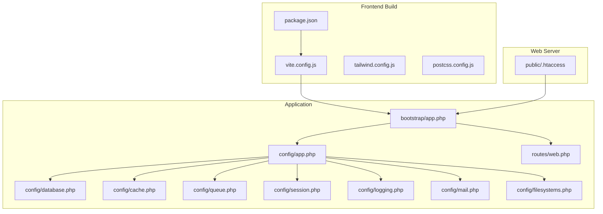
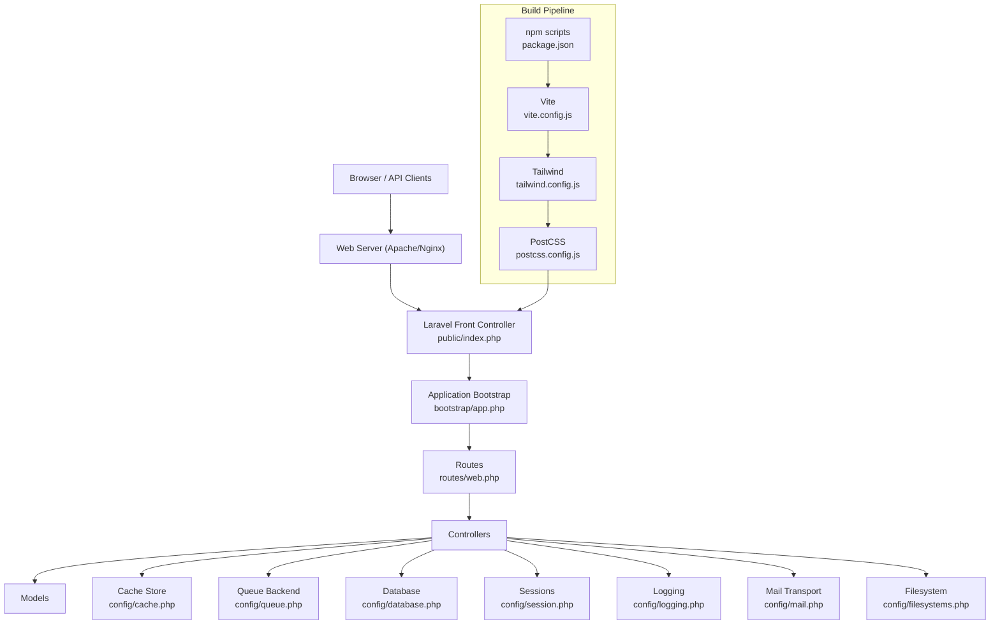
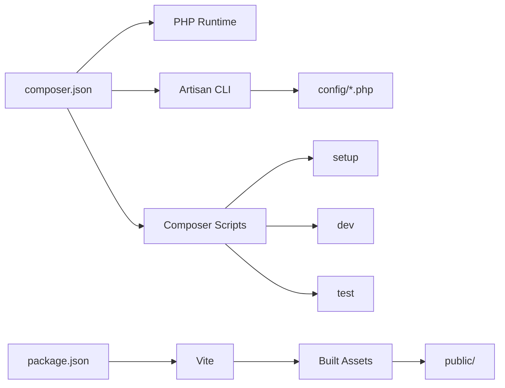

# Deployment & Configuration

<cite>
**Referenced Files in This Document**
- [composer.json](file://composer.json)
- [package.json](file://package.json)
- [vite.config.js](file://vite.config.js)
- [tailwind.config.js](file://tailwind.config.js)
- [postcss.config.js](file://postcss.config.js)
- [public/.htaccess](file://public/.htaccess)
- [bootstrap/app.php](file://bootstrap/app.php)
- [config/app.php](file://config/app.php)
- [config/database.php](file://config/database.php)
- [config/cache.php](file://config/cache.php)
- [config/queue.php](file://config/queue.php)
- [config/session.php](file://config/session.php)
- [config/logging.php](file://config/logging.php)
- [config/mail.php](file://config/mail.php)
- [config/filesystems.php](file://config/filesystems.php)
- [routes/web.php](file://routes/web.php)
</cite>

## Table of Contents
1. [Introduction](#introduction)
2. [Project Structure](#project-structure)
3. [Core Components](#core-components)
4. [Architecture Overview](#architecture-overview)
5. [Detailed Component Analysis](#detailed-component-analysis)
6. [Dependency Analysis](#dependency-analysis)
7. [Performance Considerations](#performance-considerations)
8. [Troubleshooting Guide](#troubleshooting-guide)
9. [Conclusion](#conclusion)
10. [Appendices](#appendices)

## Introduction
This document provides comprehensive deployment and configuration guidance for ClinicalLog CMS. It covers production environment setup, server requirements, security hardening, environment variable configuration, database optimization, caching strategies, deployment workflows, rollback procedures, monitoring, performance tuning, load balancing, scaling, SSL/TLS, backups, disaster recovery, CI/CD automation, and operational troubleshooting. The guidance is grounded in the repository’s configuration and build tooling.

## Project Structure
ClinicalLog CMS is a Laravel 13 application with frontend asset tooling powered by Vite and Tailwind CSS. The repository includes:
- Laravel configuration under config/
- Frontend build under vite.config.js, tailwind.config.js, postcss.config.js, and package.json
- Public web server rewrite rules under public/.htaccess
- Application bootstrap and routing under bootstrap/app.php and routes/web.php
- Composer-managed runtime and development dependencies under composer.json

**Diagram sources**
- [bootstrap/app.php:8-24](file://bootstrap/app.php#L8-L24)
- [routes/web.php:1-77](file://routes/web.php#L1-L77)
- [config/app.php:16-126](file://config/app.php#L16-L126)
- [config/database.php:20-184](file://config/database.php#L20-L184)
- [config/cache.php:18-136](file://config/cache.php#L18-L136)
- [config/queue.php:16-129](file://config/queue.php#L16-L129)
- [config/session.php:21-233](file://config/session.php#L21-L233)
- [config/logging.php:21-132](file://config/logging.php#L21-L132)
- [config/mail.php:17-118](file://config/mail.php#L17-L118)
- [config/filesystems.php:16-80](file://config/filesystems.php#L16-L80)
- [public/.htaccess:1-26](file://public/.htaccess#L1-L26)
- [package.json:1-21](file://package.json#L1-L21)
- [vite.config.js:1-12](file://vite.config.js#L1-L12)
- [tailwind.config.js:1-22](file://tailwind.config.js#L1-L22)
- [postcss.config.js:1-7](file://postcss.config.js#L1-L7)

**Section sources**
- [bootstrap/app.php:8-24](file://bootstrap/app.php#L8-L24)
- [routes/web.php:1-77](file://routes/web.php#L1-L77)
- [config/app.php:16-126](file://config/app.php#L16-L126)
- [config/database.php:20-184](file://config/database.php#L20-L184)
- [config/cache.php:18-136](file://config/cache.php#L18-L136)
- [config/queue.php:16-129](file://config/queue.php#L16-L129)
- [config/session.php:21-233](file://config/session.php#L21-L233)
- [config/logging.php:21-132](file://config/logging.php#L21-L132)
- [config/mail.php:17-118](file://config/mail.php#L17-L118)
- [config/filesystems.php:16-80](file://config/filesystems.php#L16-L80)
- [public/.htaccess:1-26](file://public/.htaccess#L1-L26)
- [package.json:1-21](file://package.json#L1-L21)
- [vite.config.js:1-12](file://vite.config.js#L1-L12)
- [tailwind.config.js:1-22](file://tailwind.config.js#L1-L22)
- [postcss.config.js:1-7](file://postcss.config.js#L1-L7)

## Core Components
- Application bootstrap and routing: Defines health check endpoint, middleware redirection, and JSON rendering for API requests.
- Configuration layers:
  - Environment-driven app behavior (name, environment, debug, URL, timezone, locale, encryption key, maintenance driver/store).
  - Database connections (SQLite, MySQL/MariaDB, PostgreSQL, SQL Server) with SSL/TLS options and Redis.
  - Cache stores (database, file, memcached, redis, dynamodb, octane, failover).
  - Queues (sync, database, beanstalkd, SQS, redis, failover).
  - Sessions (file, cookie, database, memcached, redis, dynamodb).
  - Logging channels (stack, single, daily, slack, syslog, stderr, papertrail).
  - Mail transporters (SMTP, SES, Postmark, Resend, sendmail, log, array, failover, roundrobin).
  - Filesystems (local, public, S3).
- Frontend toolchain: Vite with Laravel plugin, Tailwind CSS, PostCSS, and npm scripts for dev/build.

Key deployment-relevant configuration highlights:
- Environment variables drive all major subsystems (database, cache, queue, session, logging, mail, filesystems).
- Health check endpoint is exposed at /up.
- Default SQLite connection is enabled for local development; production should switch to MySQL/MariaDB/PostgreSQL/SQL Server with Redis.

**Section sources**
- [bootstrap/app.php:8-24](file://bootstrap/app.php#L8-L24)
- [config/app.php:16-126](file://config/app.php#L16-L126)
- [config/database.php:20-184](file://config/database.php#L20-L184)
- [config/cache.php:18-136](file://config/cache.php#L18-L136)
- [config/queue.php:16-129](file://config/queue.php#L16-L129)
- [config/session.php:21-233](file://config/session.php#L21-L233)
- [config/logging.php:21-132](file://config/logging.php#L21-L132)
- [config/mail.php:17-118](file://config/mail.php#L17-L118)
- [config/filesystems.php:16-80](file://config/filesystems.php#L16-L80)
- [package.json:5-8](file://package.json#L5-L8)
- [vite.config.js:4-10](file://vite.config.js#L4-L10)

## Architecture Overview
The application follows a standard Laravel MVC pattern with configurable persistence and runtime services. The frontend assets are built via Vite and served through the Laravel front controller.

**Diagram sources**
- [bootstrap/app.php:8-24](file://bootstrap/app.php#L8-L24)
- [routes/web.php:1-77](file://routes/web.php#L1-L77)
- [config/cache.php:18-136](file://config/cache.php#L18-L136)
- [config/queue.php:16-129](file://config/queue.php#L16-L129)
- [config/database.php:20-184](file://config/database.php#L20-L184)
- [config/session.php:21-233](file://config/session.php#L21-L233)
- [config/logging.php:21-132](file://config/logging.php#L21-L132)
- [config/mail.php:17-118](file://config/mail.php#L17-L118)
- [config/filesystems.php:16-80](file://config/filesystems.php#L16-L80)
- [package.json:5-8](file://package.json#L5-L8)
- [vite.config.js:4-10](file://vite.config.js#L4-L10)
- [tailwind.config.js:6-21](file://tailwind.config.js#L6-L21)
- [postcss.config.js:1-7](file://postcss.config.js#L1-L7)

## Detailed Component Analysis

### Environment Variables and Secrets
- Application identity and behavior are controlled via environment variables defined in config/*.php and consumed by bootstrap/app.php.
- Critical variables include:
  - App: APP_NAME, APP_ENV, APP_DEBUG, APP_URL, APP_KEY, APP_PREVIOUS_KEYS, APP_LOCALE, APP_FALLBACK_LOCALE, APP_MAINTENANCE_DRIVER, APP_MAINTENANCE_STORE.
  - Database: DB_CONNECTION, DB_URL, DB_HOST, DB_PORT, DB_DATABASE, DB_USERNAME, DB_PASSWORD, DB_SOCKET, DB_CHARSET, DB_COLLATION, MYSQL_ATTR_SSL_CA, DB_SSLMODE, DB_ENCRYPT, DB_TRUST_SERVER_CERTIFICATE.
  - Cache: CACHE_STORE, DB_CACHE_CONNECTION, DB_CACHE_TABLE, CACHE_STORAGE_DISK, CACHE_STORAGE_PATH, CACHE_PREFIX, REDIS_CACHE_CONNECTION, REDIS_CACHE_LOCK_CONNECTION.
  - Queue: QUEUE_CONNECTION, DB_QUEUE_CONNECTION, DB_QUEUE_TABLE, DB_QUEUE, DB_QUEUE_RETRY_AFTER, BEANSTALKD_QUEUE_HOST, SQS_* variables, REDIS_QUEUE_CONNECTION, REDIS_QUEUE, REDIS_QUEUE_RETRY_AFTER, QUEUE_FAILED_DRIVER.
  - Session: SESSION_DRIVER, SESSION_LIFETIME, SESSION_EXPIRE_ON_CLOSE, SESSION_ENCRYPT, SESSION_CONNECTION, SESSION_TABLE, SESSION_STORE, SESSION_COOKIE, SESSION_PATH, SESSION_DOMAIN, SESSION_SECURE_COOKIE, SESSION_HTTP_ONLY, SESSION_SAME_SITE, SESSION_PARTITIONED_COOKIE.
  - Logging: LOG_CHANNEL, LOG_STACK, LOG_LEVEL, LOG_DAILY_DAYS, LOG_SLACK_WEBHOOK_URL, LOG_SLACK_USERNAME, LOG_SLACK_EMOJI, LOG_STDERR_FORMATTER, PAPERTRAIL_URL, PAPERTRAIL_PORT.
  - Mail: MAIL_MAILER, MAIL_URL, MAIL_SCHEME, MAIL_HOST, MAIL_PORT, MAIL_USERNAME, MAIL_PASSWORD, MAIL_EHLO_DOMAIN, MAIL_FROM_ADDRESS, MAIL_FROM_NAME, AWS_* variables.
  - Filesystems: FILESYSTEM_DISK, AWS_* variables for S3.
  - Redis: REDIS_CLIENT, REDIS_CLUSTER, REDIS_PREFIX, REDIS_PERSISTENT, REDIS_URL, REDIS_HOST, REDIS_USERNAME, REDIS_PASSWORD, REDIS_PORT, REDIS_DB, REDIS_CACHE_DB, REDIS_MAX_RETRIES, REDIS_BACKOFF_ALGORITHM, REDIS_BACKOFF_BASE, REDIS_BACKOFF_CAP.

Security hardening recommendations:
- Set APP_ENV to production and APP_DEBUG to false in production.
- Rotate APP_KEY regularly and maintain APP_PREVIOUS_KEYS during key rotation.
- Enforce HTTPS-only cookies by setting SESSION_SECURE_COOKIE appropriately.
- Configure SameSite policies per deployment needs (SESSION_SAME_SITE).
- Use strong credentials for DB_* and AWS_* variables.
- Restrict filesystem permissions for storage/app/public and storage/framework.

**Section sources**
- [config/app.php:16-126](file://config/app.php#L16-L126)
- [config/database.php:20-184](file://config/database.php#L20-L184)
- [config/cache.php:18-136](file://config/cache.php#L18-L136)
- [config/queue.php:16-129](file://config/queue.php#L16-L129)
- [config/session.php:21-233](file://config/session.php#L21-L233)
- [config/logging.php:21-132](file://config/logging.php#L21-L132)
- [config/mail.php:17-118](file://config/mail.php#L17-L118)
- [config/filesystems.php:16-80](file://config/filesystems.php#L16-L80)

### Database Configuration and Optimization
- Default connection is SQLite for development; production should use MySQL/MariaDB, PostgreSQL, or SQL Server.
- SSL/TLS options are available for MySQL/MariaDB (SSL CA) and PostgreSQL (sslmode).
- Redis is configured for both cache and queue backends with separate logical databases and retry/backoff settings.
- Recommended production settings:
  - Use MySQL/MariaDB or PostgreSQL with persistent connections and appropriate charset/collation.
  - Enable SSL/TLS for external database connectivity.
  - Use Redis cluster for high availability and horizontal scaling.
  - Tune database engine and connection pooling at the database server level.

Operational notes:
- Migrations repository table is named migrations.
- Redis prefix is derived from APP_NAME to avoid cross-application collisions.

**Section sources**
- [config/database.php:20-184](file://config/database.php#L20-L184)
- [config/redis:146-182](file://config/database.php#L146-L182)

### Caching Strategies
- Default cache store is database; production should consider Redis or Octane for performance.
- Cache key prefix is derived from APP_NAME to prevent collisions.
- Failover cache store can fallback to array for resilience.
- Redis-backed cache supports lock connections for distributed locking.

Optimization tips:
- Prefer Redis for high-throughput scenarios.
- Use cache tagging and TTL-aware operations where applicable.
- Monitor cache hit rates and tune store selection accordingly.

**Section sources**
- [config/cache.php:18-136](file://config/cache.php#L18-L136)
- [config/database.php:146-182](file://config/database.php#L146-L182)

### Queueing and Background Jobs
- Default queue driver is database; production should use Redis or SQS for scalability.
- Failed job logging supports database-uuids, DynamoDB, file, and null drivers.
- Retry intervals and block-for settings are configurable per driver.

Operational guidance:
- Run dedicated queue workers in production.
- Monitor failed job tables and implement alerting.
- Use Redis queues for low-latency workloads.

**Section sources**
- [config/queue.php:16-129](file://config/queue.php#L16-L129)

### Sessions
- Default session driver is database; production should use Redis or database with proper cleanup.
- Cookie security attributes (secure, httpOnly, sameSite) are configurable.
- Session lifetime and expiration on close are configurable.

**Section sources**
- [config/session.php:21-233](file://config/session.php#L21-L233)

### Logging
- Default stack includes multiple channels; production should route to daily, syslog, or centralized systems (Papertrail/Slack).
- Deprecation logging can be isolated to a dedicated channel.

**Section sources**
- [config/logging.php:21-132](file://config/logging.php#L21-L132)

### Mail Delivery
- Default mailer is log; production should use SMTP, SES, Postmark, or Resend.
- Global From address and name are configurable.

**Section sources**
- [config/mail.php:17-118](file://config/mail.php#L17-L118)

### Filesystems
- Local and public disks are configured; S3 support is available via AWS_* variables.
- Storage symlink is created from public/storage to storage/app/public.

**Section sources**
- [config/filesystems.php:16-80](file://config/filesystems.php#L16-L80)

### Frontend Asset Pipeline
- Vite builds assets defined in vite.config.js using Laravel plugin.
- Tailwind CSS and PostCSS are integrated via tailwind.config.js and postcss.config.js.
- npm scripts provide dev and build tasks.

**Section sources**
- [package.json:5-8](file://package.json#L5-L8)
- [vite.config.js:4-10](file://vite.config.js#L4-L10)
- [tailwind.config.js:6-21](file://tailwind.config.js#L6-L21)
- [postcss.config.js:1-7](file://postcss.config.js#L1-L7)

### Web Server and Routing
- Apache mod_rewrite handles Authorization/X-XSRF-Token headers and removes trailing slashes.
- Front controller rewrite sends unmatched requests to index.php.
- Laravel bootstrap exposes a health check endpoint at /up.

**Section sources**
- [public/.htaccess:1-26](file://public/.htaccess#L1-L26)
- [bootstrap/app.php:12](file://bootstrap/app.php#L12)

## Dependency Analysis
The application depends on Laravel framework and optional development tools. Composer scripts automate setup, dev, and test workflows. The frontend build pipeline depends on npm scripts and Vite.

**Diagram sources**
- [composer.json:35-69](file://composer.json#L35-L69)
- [package.json:5-8](file://package.json#L5-L8)

**Section sources**
- [composer.json:35-69](file://composer.json#L35-L69)
- [package.json:5-8](file://package.json#L5-L8)

## Performance Considerations
- Use Redis for cache and queues to reduce database load.
- Enable opcode caching (OPcache) and optimize PHP-FPM process model.
- Serve static assets via CDN and enable long-lived caching headers.
- Minimize view compilation overhead by precompiling assets and enabling production optimizations.
- Use database connection pooling and tune query execution plans.
- Monitor queue backlog and scale worker processes horizontally.

[No sources needed since this section provides general guidance]

## Troubleshooting Guide
Common deployment issues and resolutions:
- Health check failures (/up): Verify web server rewrite rules and application bootstrap configuration.
- 404s on API routes: Ensure Authorization/XSRF headers are forwarded and rewrites are enabled.
- Asset build errors: Confirm npm install ran and Vite dev/build scripts succeed.
- Database connection errors: Validate DB_* environment variables and SSL/TLS settings.
- Session/cookie issues: Check SESSION_SECURE_COOKIE, SESSION_SAME_SITE, and domain/path settings.
- Logging anomalies: Review LOG_CHANNEL and channel-specific configs (daily/syslog/slack).
- Mail delivery failures: Switch from log mailer to SMTP/SES/Postmark/Resend and verify credentials.

**Section sources**
- [public/.htaccess:8-24](file://public/.htaccess#L8-L24)
- [bootstrap/app.php:12](file://bootstrap/app.php#L12)
- [config/mail.php:17-118](file://config/mail.php#L17-L118)
- [config/session.php:130-202](file://config/session.php#L130-L202)
- [config/logging.php:53-132](file://config/logging.php#L53-L132)

## Conclusion
ClinicalLog CMS is designed for flexible deployment across environments. Production readiness hinges on selecting appropriate database and cache/queue backends, securing environment variables, optimizing logging and mail delivery, and leveraging the frontend build pipeline. The included configuration files provide a solid foundation for robust deployments, monitoring, and scaling.

[No sources needed since this section summarizes without analyzing specific files]

## Appendices

### Production Checklist
- Set APP_ENV=production and APP_DEBUG=false.
- Generate and rotate APP_KEY with APP_PREVIOUS_KEYS during transitions.
- Choose production-grade DB driver and enable SSL/TLS where applicable.
- Configure Redis for cache and queues; set prefixes and logical databases.
- Select session driver (database/Redis) and secure cookie attributes.
- Configure logging channels for production (daily/syslog/Papertrail/Slack).
- Set up mailer (SMTP/SES/Postmark/Resend) and global From address.
- Build assets with npm run build and deploy to public/.
- Validate web server rewrites and health check endpoint.

**Section sources**
- [config/app.php:29-100](file://config/app.php#L29-L100)
- [config/database.php:20-184](file://config/database.php#L20-L184)
- [config/cache.php:18-136](file://config/cache.php#L18-L136)
- [config/queue.php:16-129](file://config/queue.php#L16-L129)
- [config/session.php:21-202](file://config/session.php#L21-L202)
- [config/logging.php:21-132](file://config/logging.php#L21-L132)
- [config/mail.php:17-118](file://config/mail.php#L17-L118)
- [package.json:6-7](file://package.json#L6-L7)
- [public/.htaccess:1-26](file://public/.htaccess#L1-L26)
- [bootstrap/app.php:12](file://bootstrap/app.php#L12)