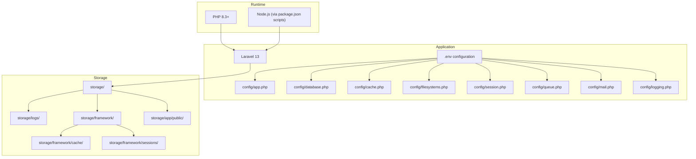
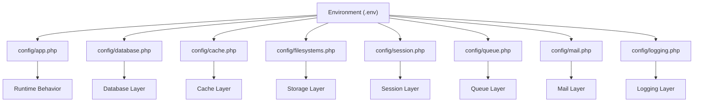
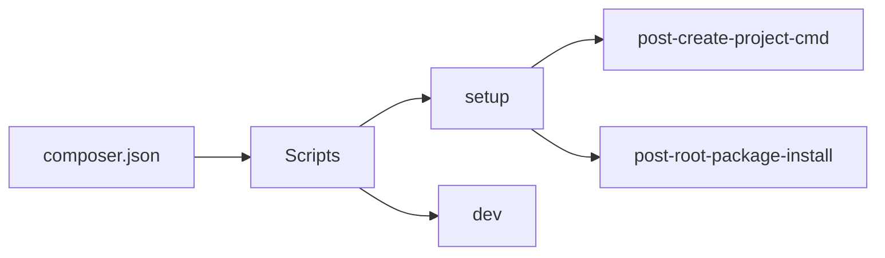

# Environment Setup & Requirements

<cite>
**Referenced Files in This Document**
- [composer.json](file://composer.json)
- [.env.example](file://.env.example)
- [config/app.php](file://config/app.php)
- [config/cache.php](file://config/cache.php)
- [config/database.php](file://config/database.php)
- [config/filesystems.php](file://config/filesystems.php)
- [config/session.php](file://config/session.php)
- [config/queue.php](file://config/queue.php)
- [config/mail.php](file://config/mail.php)
- [config/logging.php](file://config/logging.php)
- [bootstrap/app.php](file://bootstrap/app.php)
- [package.json](file://package.json)
- [storage/](file://storage/)
- [.gitignore](file://.gitignore)
</cite>

## Table of Contents
1. [Introduction](#introduction)
2. [Project Structure](#project-structure)
3. [Core Components](#core-components)
4. [Architecture Overview](#architecture-overview)
5. [Detailed Component Analysis](#detailed-component-analysis)
6. [Dependency Analysis](#dependency-analysis)
7. [Performance Considerations](#performance-considerations)
8. [Troubleshooting Guide](#troubleshooting-guide)
9. [Conclusion](#conclusion)
10. [Appendices](#appendices)

## Introduction
This document provides a comprehensive environment setup guide for deploying ClinicalLog CMS. It covers server requirements, system prerequisites, hardware recommendations, network requirements, environment variable configuration, timezone and locale settings, application key generation, step-by-step installation procedures across Linux, Windows, and macOS, permission requirements for storage and cache directories, and validation steps to ensure a properly configured environment before deployment.

## Project Structure
ClinicalLog CMS is a Laravel 13 application. The environment setup centers around:
- PHP runtime and Composer for dependency management
- Database connectivity (SQLite by default; MySQL/MariaDB supported)
- Node.js and Vite for asset compilation
- Laravel configuration files controlling environment variables and runtime behavior
- Storage and cache directories requiring write permissions

**Diagram sources**
- [composer.json:8-12](file://composer.json#L8-L12)
- [package.json:1-21](file://package.json#L1-L21)
- [config/app.php:16-100](file://config/app.php#L16-L100)
- [config/database.php:20-45](file://config/database.php#L20-L45)
- [config/cache.php:18-60](file://config/cache.php#L18-L60)
- [config/filesystems.php:16-78](file://config/filesystems.php#L16-L78)
- [config/session.php:21-104](file://config/session.php#L21-L104)
- [config/queue.php:16-45](file://config/queue.php#L16-L45)
- [config/mail.php:17-116](file://config/mail.php#L17-L116)
- [config/logging.php:21-130](file://config/logging.php#L21-L130)
- [storage/](file://storage/)

**Section sources**
- [composer.json:8-12](file://composer.json#L8-L12)
- [package.json:1-21](file://package.json#L1-L21)
- [config/app.php:16-100](file://config/app.php#L16-L100)
- [config/database.php:20-45](file://config/database.php#L20-L45)
- [config/cache.php:18-60](file://config/cache.php#L18-L60)
- [config/filesystems.php:16-78](file://config/filesystems.php#L16-L78)
- [config/session.php:21-104](file://config/session.php#L21-L104)
- [config/queue.php:16-45](file://config/queue.php#L16-L45)
- [config/mail.php:17-116](file://config/mail.php#L17-L116)
- [config/logging.php:21-130](file://config/logging.php#L21-L130)
- [storage/](file://storage/)

## Core Components
- PHP runtime: Minimum requirement is PHP 8.3+ as declared in composer.json.
- Database: SQLite is default; MySQL and MariaDB are supported via PDO.
- Node.js/Vite: Asset pipeline managed via package.json scripts.
- Laravel configuration: Environment variables are loaded via config files and .env.
- Storage and cache: Writable directories under storage/ are required for logs, cache, sessions, and public storage.

Key environment variables and defaults:
- APP_ENV: defaults to production; recommended local development value is local.
- APP_DEBUG: defaults to false; enable during development.
- APP_KEY: must be generated after installation.
- APP_URL: base URL for the application.
- APP_LOCALE, APP_FALLBACK_LOCALE, APP_FAKER_LOCALE: localization defaults.
- DB_CONNECTION: sqlite by default; can be mysql or mariadb.
- CACHE_STORE: database by default; file, redis, memcached, and others supported.
- SESSION_DRIVER: database by default; file, redis, memcached, and others supported.
- QUEUE_CONNECTION: database by default; sync, database, redis, sqs, beanstalkd, and others supported.
- FILESYSTEM_DISK: local by default; public disk maps to storage/app/public/.
- LOG_CHANNEL: stack by default; single, daily, slack, syslog, errorlog, stderr supported.

**Section sources**
- [composer.json:8-12](file://composer.json#L8-L12)
- [config/app.php:16-100](file://config/app.php#L16-L100)
- [.env.example:1-66](file://.env.example#L1-L66)
- [config/database.php:20-85](file://config/database.php#L20-L85)
- [config/cache.php:18-122](file://config/cache.php#L18-L122)
- [config/session.php:21-104](file://config/session.php#L21-L104)
- [config/queue.php:16-90](file://config/queue.php#L16-L90)
- [config/filesystems.php:16-78](file://config/filesystems.php#L16-L78)
- [config/logging.php:21-130](file://config/logging.php#L21-L130)

## Architecture Overview
The environment configuration influences how Laravel resolves services and stores data. The following diagram maps configuration files to their runtime impact.

**Diagram sources**
- [config/app.php:16-100](file://config/app.php#L16-L100)
- [config/database.php:20-184](file://config/database.php#L20-L184)
- [config/cache.php:18-136](file://config/cache.php#L18-L136)
- [config/filesystems.php:16-80](file://config/filesystems.php#L16-L80)
- [config/session.php:21-233](file://config/session.php#L21-L233)
- [config/queue.php:16-129](file://config/queue.php#L16-L129)
- [config/mail.php:17-118](file://config/mail.php#L17-L118)
- [config/logging.php:21-132](file://config/logging.php#L21-L132)

## Detailed Component Analysis

### Server Requirements
- PHP: 8.3+ (required)
- Web server: Apache/Nginx with PHP-FPM recommended for production
- Database: SQLite (default), MySQL 5.7+/8.0+ or MariaDB 10.2+ supported
- Node.js: Required for asset compilation (Vite); version aligned with package.json scripts
- Composer: For PHP dependency management

**Section sources**
- [composer.json:8-12](file://composer.json#L8-L12)
- [config/database.php:47-85](file://config/database.php#L47-L85)
- [package.json:1-21](file://package.json#L1-L21)

### System Prerequisites
- Operating systems: Linux, Windows, macOS
- Required PHP extensions: pdo, openssl, tokenizer, xml, ctype, mbstring, json, tokenizer, curl
- Optional PHP extensions: gd, imagick (for image processing), intl (for i18n)
- Node.js: Latest LTS recommended for asset builds

**Section sources**
- [composer.json:8-12](file://composer.json#L8-L12)
- [config/database.php:62-64](file://config/database.php#L62-L64)

### Hardware Recommendations
- CPU: Multi-core processor (2+ cores minimum; 4+ cores recommended for development)
- RAM: 2 GB minimum; 4 GB+ recommended for development
- Disk: SSD preferred; 20 GB+ free space for OS, dependencies, and application data
- Network: Stable internet connection for Composer and npm installs

[No sources needed since this section provides general guidance]

### Network Requirements
- Outbound access to Packagist (Composer), npm registry (Node.js)
- Optional: SMTP server for mail delivery; Redis/Memcached endpoints if enabled
- Localhost ports: 8000 (artisan serve), 3306 (MySQL), 6379 (Redis), 5432 (PostgreSQL if used)

**Section sources**
- [config/mail.php:40-71](file://config/mail.php#L40-L71)
- [config/database.php:146-180](file://config/database.php#L146-L180)

### Environment Variables Configuration
Primary variables and defaults:
- APP_ENV: production (default); set to local for development
- APP_DEBUG: false (default); set to true for development
- APP_KEY: must be generated after setup
- APP_URL: http://localhost (default)
- APP_LOCALE, APP_FALLBACK_LOCALE, APP_FAKER_LOCALE: en defaults
- DB_CONNECTION: sqlite (default); set to mysql or mariadb for production
- CACHE_STORE: database (default); file, redis, memcached supported
- SESSION_DRIVER: database (default); file, redis, memcached supported
- QUEUE_CONNECTION: database (default); sync, database, redis, sqs, beanstalkd supported
- FILESYSTEM_DISK: local (default); public disk maps to storage/app/public/
- LOG_CHANNEL: stack (default); single, daily, slack, syslog, errorlog, stderr supported

Recommended minimal .env for local development:
- APP_ENV=local
- APP_DEBUG=true
- APP_KEY=<generated>
- APP_URL=http://localhost
- DB_CONNECTION=sqlite
- CACHE_STORE=database
- SESSION_DRIVER=database
- QUEUE_CONNECTION=database
- FILESYSTEM_DISK=local
- LOG_CHANNEL=stack

**Section sources**
- [.env.example:1-66](file://.env.example#L1-L66)
- [config/app.php:29-100](file://config/app.php#L29-L100)
- [config/database.php:20-45](file://config/database.php#L20-L45)
- [config/cache.php:18-60](file://config/cache.php#L18-L60)
- [config/session.php:21-104](file://config/session.php#L21-L104)
- [config/queue.php:16-45](file://config/queue.php#L16-L45)
- [config/filesystems.php:16-78](file://config/filesystems.php#L16-L78)
- [config/logging.php:21-130](file://config/logging.php#L21-L130)

### Timezone and Locale Settings
- Timezone: UTC by default in config/app.php; adjust to your region (e.g., America/New_York)
- Locale: APP_LOCALE and APP_FALLBACK_LOCALE default to en; set to desired locale (e.g., es, fr)
- Faker locale: APP_FAKER_LOCALE defaults to en_US; adjust for test data generation

**Section sources**
- [config/app.php:68](file://config/app.php#L68)
- [config/app.php:81-85](file://config/app.php#L81-L85)

### Application Key Generation
- Generate APP_KEY using the Laravel Artisan command after copying .env.example to .env
- The composer setup script includes key:generate for convenience

**Section sources**
- [.env.example:3](file://.env.example#L3)
- [composer.json:39](file://composer.json#L39)

### Step-by-Step Installation Procedures

#### Linux
1. Install PHP 8.3+ and required extensions
2. Install Composer
3. Install Node.js and npm
4. Clone repository and navigate to project directory
5. Copy .env.example to .env
6. Run Composer install
7. Generate APP_KEY
8. Configure database (sqlite by default; set DB_CONNECTION=mysql/mariadb for production)
9. Run migrations
10. Install Node dependencies and build assets
11. Start development server (artisan serve) or configure web server

**Section sources**
- [composer.json:36-43](file://composer.json#L36-L43)
- [config/database.php:20-45](file://config/database.php#L20-L45)

#### Windows
1. Install PHP 8.3+ and required extensions
2. Install Composer
3. Install Node.js and npm
4. Open terminal/command prompt in project directory
5. Copy .env.example to .env
6. Run Composer install
7. Generate APP_KEY
8. Configure database (sqlite by default; set DB_CONNECTION=mysql/mariadb for production)
9. Run migrations
10. Install Node dependencies and build assets
11. Start development server (artisan serve) or configure IIS/Apache

**Section sources**
- [composer.json:36-43](file://composer.json#L36-L43)
- [config/database.php:20-45](file://config/database.php#L20-L45)

#### macOS
1. Install PHP 8.3+ and required extensions (Homebrew recommended)
2. Install Composer
3. Install Node.js and npm
4. Open Terminal in project directory
5. Copy .env.example to .env
6. Run Composer install
7. Generate APP_KEY
8. Configure database (sqlite by default; set DB_CONNECTION=mysql/mariadb for production)
9. Run migrations
10. Install Node dependencies and build assets
11. Start development server (artisan serve) or configure Apache/Nginx

**Section sources**
- [composer.json:36-43](file://composer.json#L36-L43)
- [config/database.php:20-45](file://config/database.php#L20-L45)

### Permission Requirements for Storage and Cache
- Writable directories:
  - storage/logs
  - storage/framework/cache/data
  - storage/framework/sessions
  - storage/app/public
- Ensure the web server user/group has write permissions to these directories
- Symbolic link: public/storage should point to storage/app/public

**Section sources**
- [config/filesystems.php:76-78](file://config/filesystems.php#L76-L78)
- [storage/](file://storage/)

### Validation Steps
- Verify PHP version meets minimum requirement
- Confirm APP_KEY is set
- Test database connectivity (sqlite/mysql/mariadb)
- Ensure storage and cache directories are writable
- Build assets and verify frontend loads
- Run basic routes and admin pages
- Review logs in storage/logs for errors

**Section sources**
- [composer.json:8-12](file://composer.json#L8-L12)
- [config/app.php:100](file://config/app.php#L100)
- [config/database.php:20-45](file://config/database.php#L20-L45)
- [config/filesystems.php:76-78](file://config/filesystems.php#L76-L78)
- [config/logging.php:63-74](file://config/logging.php#L63-L74)

## Dependency Analysis
The environment setup depends on Composer and npm scripts to orchestrate installation and asset builds.

**Diagram sources**
- [composer.json:35-69](file://composer.json#L35-L69)

**Section sources**
- [composer.json:35-69](file://composer.json#L35-L69)

## Performance Considerations
- Use Redis or Memcached for cache and session stores in production
- Enable OPcache and short_open_tag in PHP for performance
- Use production-ready database engines (MySQL/MariaDB) with proper indexing
- Minimize asset rebuilds; use Vite’s dev server during development and build for production

[No sources needed since this section provides general guidance]

## Troubleshooting Guide
Common environment issues and resolutions:
- PHP version mismatch: Upgrade to PHP 8.3+ as required by composer.json
- Missing APP_KEY: Generate using Artisan key:generate
- Database connection failures: Verify DB_CONNECTION and credentials; ensure PDO drivers are installed
- Storage permission denied: Grant write permissions to storage/ and cache directories
- Asset build failures: Reinstall Node dependencies and rebuild assets
- Logging issues: Check LOG_CHANNEL and storage/logs permissions

**Section sources**
- [composer.json:8-12](file://composer.json#L8-L12)
- [config/app.php:100](file://config/app.php#L100)
- [config/database.php:20-45](file://config/database.php#L20-L45)
- [config/filesystems.php:76-78](file://config/filesystems.php#L76-L78)
- [config/logging.php:21-130](file://config/logging.php#L21-L130)

## Conclusion
By adhering to the server requirements, configuring environment variables appropriately, ensuring writable storage directories, and validating each step, you can deploy ClinicalLog CMS reliably across Linux, Windows, and macOS. Use the provided configuration references and validation steps to guarantee a smooth setup process.

## Appendices

### Appendix A: Environment Variable Reference
- APP_ENV: application environment
- APP_DEBUG: debug mode toggle
- APP_KEY: application encryption key
- APP_URL: base URL
- APP_LOCALE, APP_FALLBACK_LOCALE, APP_FAKER_LOCALE: localization
- DB_CONNECTION: database driver (sqlite/mysql/mariadb/pgsql/sqlsrv)
- CACHE_STORE: cache driver (database/file/redis/memcached/etc.)
- SESSION_DRIVER: session driver (file/database/redis/memcached/etc.)
- QUEUE_CONNECTION: queue driver (sync/database/redis/sqs/beanstalkd/etc.)
- FILESYSTEM_DISK: default filesystem disk
- LOG_CHANNEL: logging channel

**Section sources**
- [.env.example:1-66](file://.env.example#L1-L66)
- [config/app.php:29-100](file://config/app.php#L29-L100)
- [config/database.php:20-184](file://config/database.php#L20-L184)
- [config/cache.php:18-136](file://config/cache.php#L18-L136)
- [config/session.php:21-233](file://config/session.php#L21-L233)
- [config/queue.php:16-129](file://config/queue.php#L16-L129)
- [config/filesystems.php:16-80](file://config/filesystems.php#L16-L80)
- [config/logging.php:21-132](file://config/logging.php#L21-L132)