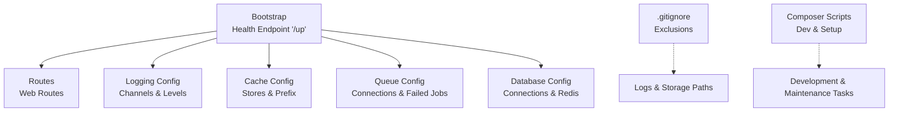
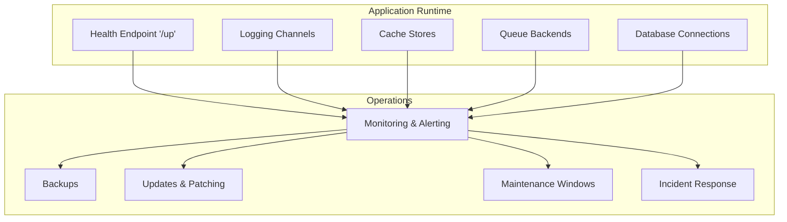
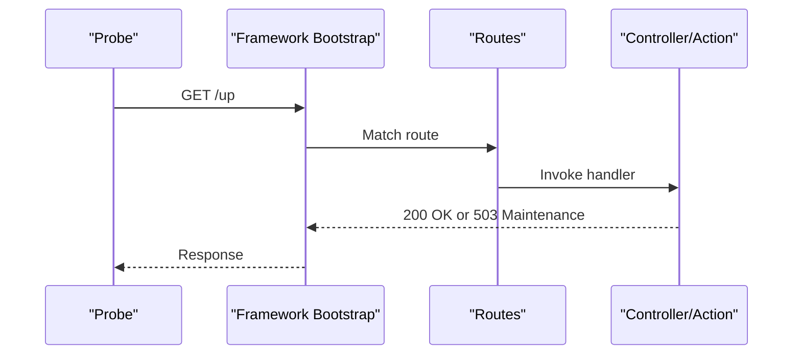
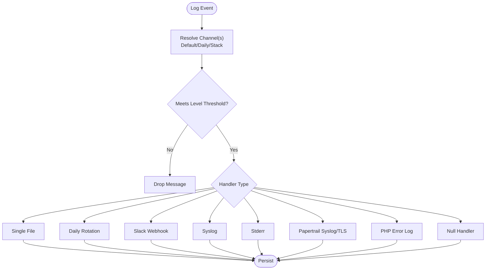
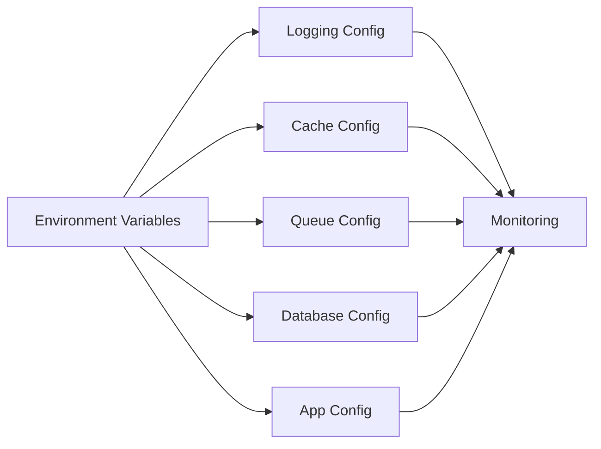

# Monitoring & Maintenance

<cite>
**Referenced Files in This Document**
- [app.php](file://bootstrap/app.php)
- [web.php](file://routes/web.php)
- [console.php](file://routes/console.php)
- [logging.php](file://config/logging.php)
- [app.php](file://config/app.php)
- [cache.php](file://config/cache.php)
- [database.php](file://config/database.php)
- [queue.php](file://config/queue.php)
- [.gitignore](file://.gitignore)
- [composer.json](file://composer.json)
- [maintenance.php](file://storage/framework/maintenance.php)
- [framework.gitignore](file://storage/framework/.gitignore)
</cite>

## Table of Contents
1. [Introduction](#introduction)
2. [Project Structure](#project-structure)
3. [Core Components](#core-components)
4. [Architecture Overview](#architecture-overview)
5. [Detailed Component Analysis](#detailed-component-analysis)
6. [Dependency Analysis](#dependency-analysis)
7. [Performance Considerations](#performance-considerations)
8. [Troubleshooting Guide](#troubleshooting-guide)
9. [Conclusion](#conclusion)
10. [Appendices](#appendices)

## Introduction
This document provides comprehensive monitoring and maintenance guidance for the ClinicalLog CMS production deployment. It covers logging configuration and rotation, error tracking and alerting, health checks and uptime monitoring, performance metrics collection, backups for database, files, and application code, automatic updates and patch management, security update procedures, maintenance windows and downtime scheduling, rollback procedures, database maintenance tasks, cache clearing, storage cleanup, incident response procedures, troubleshooting workflows, escalation protocols, capacity planning, resource monitoring, and cost optimization strategies.

## Project Structure
The application exposes a health endpoint and integrates routing, middleware, and exception handling through the framework bootstrap. Logging, caching, queues, and database connectivity are configured via dedicated configuration files. Environment-sensitive behavior is controlled through environment variables.

**Diagram sources**
- [app.php:8-24](file://bootstrap/app.php#L8-L24)
- [web.php:1-77](file://routes/web.php#L1-L77)
- [logging.php:53-132](file://config/logging.php#L53-L132)
- [cache.php:18-121](file://config/cache.php#L18-L121)
- [queue.php:16-127](file://config/queue.php#L16-L127)
- [database.php:20-184](file://config/database.php#L20-L184)
- [.gitignore:1-27](file://.gitignore#L1-L27)
- [composer.json:35-69](file://composer.json#L35-L69)

**Section sources**
- [app.php:8-24](file://bootstrap/app.php#L8-L24)
- [web.php:1-77](file://routes/web.php#L1-L77)
- [logging.php:53-132](file://config/logging.php#L53-L132)
- [cache.php:18-121](file://config/cache.php#L18-L121)
- [queue.php:16-127](file://config/queue.php#L16-L127)
- [database.php:20-184](file://config/database.php#L20-L184)
- [.gitignore:1-27](file://.gitignore#L1-L27)
- [composer.json:35-69](file://composer.json#L35-L69)

## Core Components
- Health endpoint: The framework bootstrap registers a health endpoint at "/up". This is the canonical uptime probe location for load balancers and monitoring systems.
- Logging: Centralized logging configuration supports daily rotation, Slack alerts, syslog, stderr, and Papertrail integrations. Deprecation logging is configurable.
- Caching: Multiple cache stores are supported, including database-backed cache with configurable tables and lock settings.
- Queues: Queue backends include database, Redis, SQS, and Beanstalkd. Failed job storage is configurable.
- Database: Multiple drivers are supported (SQLite, MySQL, MariaDB, PostgreSQL, SQL Server). Redis options include clustering and key prefixing.
- Maintenance mode: Maintenance driver and store are configurable, enabling centralized maintenance signaling.

**Section sources**
- [app.php:12-13](file://bootstrap/app.php#L12-L13)
- [logging.php:53-132](file://config/logging.php#L53-L132)
- [cache.php:35-108](file://config/cache.php#L35-L108)
- [queue.php:32-127](file://config/queue.php#L32-L127)
- [database.php:33-117](file://config/database.php#L33-L117)
- [app.php:121-124](file://config/app.php#L121-L124)

## Architecture Overview
The monitoring and maintenance architecture leverages framework-provided health checks, environment-driven logging/alerting, and configurable cache/queue/database backends. Deployment artifacts and logs are excluded from version control per repository configuration.

**Diagram sources**
- [app.php:12-13](file://bootstrap/app.php#L12-L13)
- [logging.php:53-132](file://config/logging.php#L53-L132)
- [cache.php:35-108](file://config/cache.php#L35-L108)
- [queue.php:32-127](file://config/queue.php#L32-L127)
- [database.php:33-117](file://config/database.php#L33-L117)

## Detailed Component Analysis

### Health Checks and Uptime Monitoring
- Health endpoint: "/up" is registered during bootstrap. Use this endpoint for uptime probes, load balancer health checks, and synthetic monitoring.
- Middleware redirection: Redirects for guests/users are configured; ensure monitoring systems bypass auth redirects by targeting the "/up" route directly.
- Exception handling: JSON rendering for API requests is enabled; health checks returning HTML are normal for web requests.

**Diagram sources**
- [app.php:12-13](file://bootstrap/app.php#L12-L13)
- [web.php:1-77](file://routes/web.php#L1-L77)

**Section sources**
- [app.php:12-13](file://bootstrap/app.php#L12-L13)
- [web.php:37-74](file://routes/web.php#L37-L74)

### Logging, Rotation, Error Tracking, and Alerting
- Default channel and deprecation logging: Default channel selection and deprecation channel/tracing are configurable.
- Daily rotation: The "daily" channel rotates logs and retains a configurable number of days.
- Slack alerts: Slack webhook URL and metadata are configurable for critical-level events.
- Papertrail integration: TLS syslog handler with host/port and processor configuration.
- Stderr/syslog/errorlog/null handlers: Support for container/stdout logging and system logging.
- Placeholders and levels: Path resolution and log level thresholds are environment-driven.

**Diagram sources**
- [logging.php:53-132](file://config/logging.php#L53-L132)

**Section sources**
- [logging.php:21-21](file://config/logging.php#L21-L21)
- [logging.php:34-37](file://config/logging.php#L34-L37)
- [logging.php:68-74](file://config/logging.php#L68-L74)
- [logging.php:76-83](file://config/logging.php#L76-L83)
- [logging.php:85-95](file://config/logging.php#L85-L95)
- [logging.php:97-119](file://config/logging.php#L97-L119)
- [logging.php:121-128](file://config/logging.php#L121-L128)

### Caching and Cache Clearing
- Default store: Database cache is default; supports custom connection, table, lock connection/table.
- Other stores: File, Redis, DynamoDB, Memcached, Octane, Failover, Array, Storage, Session, and Null.
- Key prefix: Cache keys are prefixed using the application name slug to avoid collisions.
- Serializable classes: Defaults to preventing deserialization for security.

Operational guidance:
- Schedule periodic cache invalidation during maintenance windows.
- For database cache, monitor table growth and prune expired entries as part of routine maintenance.
- For Redis/Memcached, ensure cluster health and memory limits are monitored.

**Section sources**
- [cache.php:18-18](file://config/cache.php#L18-L18)
- [cache.php:42-48](file://config/cache.php#L42-L48)
- [cache.php:121-121](file://config/cache.php#L121-L121)
- [cache.php:134-134](file://config/cache.php#L134-L134)

### Queues and Failed Jobs
- Default connection: Database queue with configurable table, queue name, retry timing, and commit behavior.
- Alternative backends: Redis, SQS, Beanstalkd, Sync, Deferred, Background, Failover.
- Failed jobs: Configurable driver (database-uuids, DynamoDB, file, null) and target table/connection.

Operational guidance:
- Monitor failed_jobs table for recurring failures.
- Scale queue workers according to job throughput and retry policies.
- For Redis/SQS backends, ensure credentials and network ACLs are up to date.

**Section sources**
- [queue.php:16-16](file://config/queue.php#L16-L16)
- [queue.php:38-45](file://config/queue.php#L38-L45)
- [queue.php:67-74](file://config/queue.php#L67-L74)
- [queue.php:123-127](file://config/queue.php#L123-L127)

### Database Connectivity and Maintenance
- Supported drivers: SQLite, MySQL/MariaDB, PostgreSQL, SQL Server.
- Redis options: Client type, clustering, key prefix, persistence, retries, backoff.
- Migration repository: Dedicated table for migration tracking.

Operational guidance:
- Use appropriate driver for production scale and compliance requirements.
- For SQLite, ensure file permissions and disk space; for remote RDBMS, configure SSL CA and strict modes.
- Monitor Redis latency and memory; tune backoff and max retries for reliability.

**Section sources**
- [database.php:20-20](file://config/database.php#L20-L20)
- [database.php:35-45](file://config/database.php#L35-L45)
- [database.php:67-85](file://config/database.php#L67-L85)
- [database.php:146-180](file://config/database.php#L146-L180)

### Maintenance Mode and Downtime Scheduling
- Maintenance driver/store: Configurable driver ("file" or "cache") and store backend.
- Framework runtime marker: The presence of a maintenance file in the framework directory indicates maintenance mode.

Operational guidance:
- Plan maintenance windows and communicate downtime schedules.
- Use cache-backed maintenance mode for multi-instance deployments.
- During maintenance, ensure the health endpoint returns a non-200 status to prevent traffic.

**Section sources**
- [app.php:121-124](file://config/app.php#L121-L124)
- [maintenance.php:1-200](file://storage/framework/maintenance.php#L1-L200)

### Backup Procedures
Scope:
- Database: Back up the configured database connection(s) using native tools (e.g., mysqldump, pg_dump, sqlite .backup).
- Files: Back up storage/app/public and storage/app/private directories.
- Application code: Back up the application root excluding logs, vendor, and build artifacts per repository exclusions.

Guidance:
- Schedule regular backups and verify restore procedures periodically.
- Encrypt backups at rest and in transit; rotate encryption keys.
- Test restoration in a staging environment mirroring production configuration.

**Section sources**
- [database.php:20-20](file://config/database.php#L20-L20)
- [database.php:35-45](file://config/database.php#L35-L45)
- [database.php:67-85](file://config/database.php#L67-L85)
- [.gitignore:1-27](file://.gitignore#L1-L27)

### Automatic Updates, Patch Management, and Security Updates
- Composer-based dependency management: Use Composer to update packages and review changelogs.
- Scripted development workflow: The "dev" script runs server, queue listener, log tailing, and asset bundling concurrently.
- Security updates: Pin major/minor versions where feasible; apply security patches promptly and test in staging.

**Section sources**
- [composer.json:8-22](file://composer.json#L8-L22)
- [composer.json:44-47](file://composer.json#L44-L47)

### Capacity Planning, Resource Monitoring, and Cost Optimization
- Resource monitoring: Track CPU, memory, disk I/O, and network utilization on the host/container.
- Cache sizing: Adjust cache store capacity and TTLs based on traffic patterns.
- Queue scaling: Scale queue workers horizontally; monitor backlog and retry rates.
- Database scaling: Optimize queries, add indexes, and consider read replicas for reporting.
- Cost optimization: Right-size instances, leverage reserved capacity, enable compression, and archive old logs and backups.

[No sources needed since this section provides general guidance]

### Incident Response, Troubleshooting, and Escalation
- Health endpoint verification: Confirm "/up" returns expected status; investigate non-200 responses.
- Logs analysis: Use daily rotation and Slack/Papertrail integrations to surface errors; correlate timestamps with incidents.
- Queue failures: Inspect failed_jobs records; reprocess or notify operators.
- Cache issues: Validate cache store connectivity and key prefixes; clear selectively during maintenance.
- Database problems: Review connection settings, SSL CA, and driver-specific configurations.

Escalation protocol:
- Tier 1: On-call engineer investigates logs and health status.
- Tier 2: Senior engineer reviews database/cache/queue backends.
- Tier 3: Platform/database/cloud specialists for infrastructure issues.

**Section sources**
- [app.php:12-13](file://bootstrap/app.php#L12-L13)
- [logging.php:53-132](file://config/logging.php#L53-L132)
- [queue.php:123-127](file://config/queue.php#L123-L127)
- [cache.php:121-121](file://config/cache.php#L121-L121)
- [database.php:146-180](file://config/database.php#L146-L180)

## Dependency Analysis
The monitoring and maintenance configuration depends on environment variables and framework defaults. Coupling is low due to environment-driven settings; however, misconfiguration can impact observability and reliability.

**Diagram sources**
- [logging.php:53-132](file://config/logging.php#L53-L132)
- [cache.php:18-121](file://config/cache.php#L18-L121)
- [queue.php:16-127](file://config/queue.php#L16-L127)
- [database.php:20-184](file://config/database.php#L20-L184)
- [app.php:121-124](file://config/app.php#L121-L124)

**Section sources**
- [logging.php:53-132](file://config/logging.php#L53-L132)
- [cache.php:18-121](file://config/cache.php#L18-L121)
- [queue.php:16-127](file://config/queue.php#L16-L127)
- [database.php:20-184](file://config/database.php#L20-L184)
- [app.php:121-124](file://config/app.php#L121-L124)

## Performance Considerations
- Logging: Prefer daily rotation with appropriate retention; offload critical logs to external systems (Slack/Papertrail) to reduce local I/O.
- Caching: Tune cache store for workload; monitor hit ratios and evictions; use failover stores for resilience.
- Queues: Configure retry-after and block-for appropriately; monitor failed job rates.
- Database: Enable SSL where applicable; optimize queries and indexes; consider read replicas for reporting.

[No sources needed since this section provides general guidance]

## Troubleshooting Guide
Common issues and resolutions:
- Health endpoint returns 503: Verify maintenance mode file presence and remove if unintentional.
- Excessive logs: Reduce log level or adjust daily retention; ensure external log aggregation is active.
- Queue backlog grows: Increase worker count, inspect failed_jobs, and tune retry policies.
- Cache misses: Validate store connectivity and key prefix; clear cache during maintenance windows.
- Database connectivity errors: Confirm credentials, SSL CA, and network ACLs; test connection outside the app.

**Section sources**
- [maintenance.php:1-200](file://storage/framework/maintenance.php#L1-L200)
- [logging.php:68-74](file://config/logging.php#L68-L74)
- [queue.php:123-127](file://config/queue.php#L123-L127)
- [cache.php:121-121](file://config/cache.php#L121-L121)
- [database.php:62-64](file://config/database.php#L62-L64)

## Conclusion
ClinicalLog CMS provides a robust foundation for production monitoring and maintenance through its health endpoint, flexible logging, caching, queue, and database configurations. By leveraging environment-driven settings, establishing clear backup and update procedures, and implementing disciplined maintenance windows and incident response processes, teams can achieve reliable uptime, strong observability, and efficient operations.

## Appendices
- Development and maintenance scripts: The Composer scripts automate setup, development, and testing workflows.
- Console commands: A placeholder inspiration command is defined for demonstration.

**Section sources**
- [composer.json:35-69](file://composer.json#L35-L69)
- [console.php:6-8](file://routes/console.php#L6-L8)