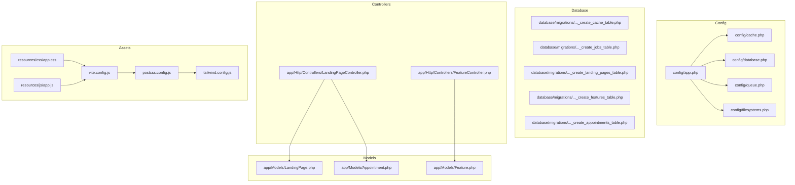
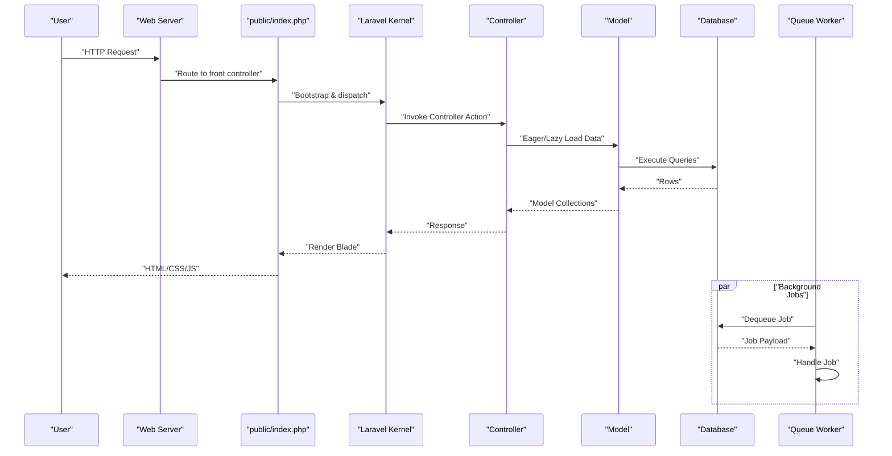
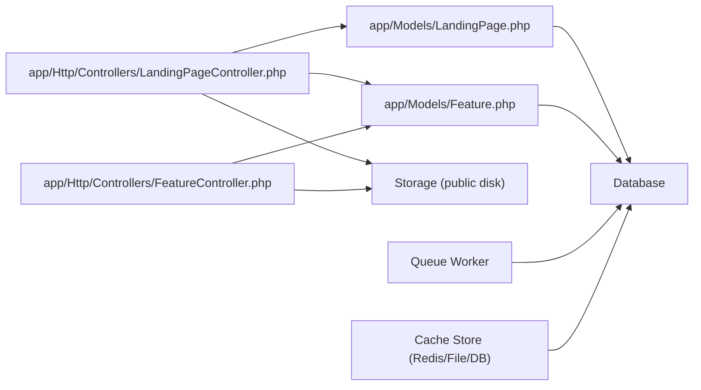

# Performance Optimization

<cite>
**Referenced Files in This Document**
- [config/app.php](file://config/app.php)
- [config/cache.php](file://config/cache.php)
- [config/database.php](file://config/database.php)
- [config/queue.php](file://config/queue.php)
- [config/filesystems.php](file://config/filesystems.php)
- [database/migrations/0001_01_01_000001_create_cache_table.php](file://database/migrations/0001_01_01_000001_create_cache_table.php)
- [database/migrations/0001_01_01_000002_create_jobs_table.php](file://database/migrations/0001_01_01_000002_create_jobs_table.php)
- [database/migrations/2026_06_17_031941_create_landing_pages_table.php](file://database/migrations/2026_06_17_031941_create_landing_pages_table.php)
- [database/migrations/2026_06_17_060200_create_features_table.php](file://database/migrations/2026_06_17_060200_create_features_table.php)
- [database/migrations/2026_06_22_024652_create_appointments_table.php](file://database/migrations/2026_06_22_024652_create_appointments_table.php)
- [app/Models/LandingPage.php](file://app/Models/LandingPage.php)
- [app/Models/Feature.php](file://app/Models/Feature.php)
- [app/Models/Appointment.php](file://app/Models/Appointment.php)
- [app/Http/Controllers/LandingPageController.php](file://app/Http/Controllers/LandingPageController.php)
- [app/Http/Controllers/FeatureController.php](file://app/Http/Controllers/FeatureController.php)
- [resources/css/app.css](file://resources/css/app.css)
- [resources/js/app.js](file://resources/js/app.js)
- [vite.config.js](file://vite.config.js)
- [tailwind.config.js](file://tailwind.config.js)
- [postcss.config.js](file://postcss.config.js)
- [public/.htaccess](file://public/.htaccess)
- [public/index.php](file://public/index.php)
- [routes/web.php](file://routes/web.php)
- [bootstrap/app.php](file://bootstrap/app.php)
- [composer.json](file://composer.json)
</cite>

## Table of Contents
1. [Introduction](#introduction)
2. [Project Structure](#project-structure)
3. [Core Components](#core-components)
4. [Architecture Overview](#architecture-overview)
5. [Detailed Component Analysis](#detailed-component-analysis)
6. [Dependency Analysis](#dependency-analysis)
7. [Performance Considerations](#performance-considerations)
8. [Troubleshooting Guide](#troubleshooting-guide)
9. [Conclusion](#conclusion)
10. [Appendices](#appendices)

## Introduction
This document provides a production-grade performance optimization guide for the ClinicalLog CMS built on Laravel. It focuses on database optimization, caching strategies, asset pipeline tuning, queue and background job configuration, browser and HTTP/2 optimizations, load balancing, monitoring, and scaling. The recommendations are grounded in the repository’s configuration and code structure.

## Project Structure
ClinicalLog CMS follows a standard Laravel layout with configuration under config/, database migrations under database/migrations/, models under app/Models/, controllers under app/Http/Controllers/, frontend assets under resources/, and compiled assets under public/.

**Diagram sources**
- [config/app.php:1-127](file://config/app.php#L1-L127)
- [config/cache.php:1-137](file://config/cache.php#L1-L137)
- [config/database.php:1-185](file://config/database.php#L1-L185)
- [config/queue.php:1-130](file://config/queue.php#L1-L130)
- [config/filesystems.php:1-81](file://config/filesystems.php#L1-L81)
- [database/migrations/0001_01_01_000001_create_cache_table.php:1-36](file://database/migrations/0001_01_01_000001_create_cache_table.php#L1-L36)
- [database/migrations/0001_01_01_000002_create_jobs_table.php:1-60](file://database/migrations/0001_01_01_000002_create_jobs_table.php#L1-L60)
- [database/migrations/2026_06_17_031941_create_landing_pages_table.php:1-32](file://database/migrations/2026_06_17_031941_create_landing_pages_table.php#L1-L32)
- [database/migrations/2026_06_17_060200_create_features_table.php:1-34](file://database/migrations/2026_06_17_060200_create_features_table.php#L1-L34)
- [database/migrations/2026_06_22_024652_create_appointments_table.php:1-36](file://database/migrations/2026_06_22_024652_create_appointments_table.php#L1-L36)
- [app/Models/LandingPage.php:1-59](file://app/Models/LandingPage.php#L1-L59)
- [app/Models/Feature.php:1-17](file://app/Models/Feature.php#L1-L17)
- [app/Models/Appointment.php:1-20](file://app/Models/Appointment.php#L1-L20)
- [app/Http/Controllers/LandingPageController.php:1-224](file://app/Http/Controllers/LandingPageController.php#L1-L224)
- [app/Http/Controllers/FeatureController.php:1-156](file://app/Http/Controllers/FeatureController.php#L1-L156)
- [resources/css/app.css](file://resources/css/app.css)
- [resources/js/app.js](file://resources/js/app.js)
- [vite.config.js](file://vite.config.js)
- [tailwind.config.js](file://tailwind.config.js)
- [postcss.config.js](file://postcss.config.js)

**Section sources**
- [config/app.php:1-127](file://config/app.php#L1-L127)
- [config/cache.php:1-137](file://config/cache.php#L1-L137)
- [config/database.php:1-185](file://config/database.php#L1-L185)
- [config/queue.php:1-130](file://config/queue.php#L1-L130)
- [config/filesystems.php:1-81](file://config/filesystems.php#L1-L81)

## Core Components
- Application configuration defines environment, debug, maintenance mode, and cache/store selection.
- Cache subsystem supports database, file, Redis, Memcached, DynamoDB, Octane, failover, and array stores.
- Database subsystem supports SQLite, MySQL/MariaDB, PostgreSQL, SQL Server, with Redis options and SSL CA support.
- Queue subsystem supports sync, database, Beanstalkd, SQS, Redis, failover, and deferred/backgound drivers.
- Filesystems define local and S3 disks; public storage symlink is configured.
- Asset pipeline uses Vite with PostCSS and Tailwind for build-time optimization.

Key production implications:
- Default cache store is database; Redis/Memcached require explicit configuration.
- Default queue driver is database; Redis recommended for production throughput.
- Assets are served via public/index.php; ensure proper caching headers and CDN integration.

**Section sources**
- [config/app.php:1-127](file://config/app.php#L1-L127)
- [config/cache.php:18](file://config/cache.php#L18)
- [config/database.php:20](file://config/database.php#L20)
- [config/queue.php:16](file://config/queue.php#L16)
- [config/filesystems.php:16](file://config/filesystems.php#L16)
- [vite.config.js](file://vite.config.js)

## Architecture Overview
High-level runtime flow for CMS requests and background processing:

**Diagram sources**
- [public/index.php](file://public/index.php)
- [app/Http/Controllers/LandingPageController.php:11-17](file://app/Http/Controllers/LandingPageController.php#L11-L17)
- [app/Models/LandingPage.php:1-59](file://app/Models/LandingPage.php#L1-L59)
- [database/migrations/2026_06_17_031941_create_landing_pages_table.php:11-21](file://database/migrations/2026_06_17_031941_create_landing_pages_table.php#L11-L21)
- [config/queue.php:38-45](file://config/queue.php#L38-L45)

## Detailed Component Analysis

### Database Optimization
- Current state:
  - Default connection is SQLite; production should switch to MySQL/MariaDB/PostgreSQL.
  - Cache and queue tables exist; ensure appropriate indexes and partitioning strategies as data grows.
  - No explicit indexes on landing pages/features/appointments beyond primary keys; consider selective indexes for frequent filters/sorts.

- Recommended actions:
  - Switch default connection to MySQL/MariaDB/PostgreSQL and tune engine/collation per workload.
  - Add indexes for:
    - appointments(status, demo_date, created_at)
    - features(sort_order)
    - landing_pages timestamps for analytics queries
  - Enable query log slow threshold and analyze slow queries periodically.
  - Use read replicas for read-heavy dashboards.
  - Tune connection pool sizes and timeouts in the database client.

- Complexity and performance:
  - Pagination on features is used; ensure covering indexes to avoid key lookups.
  - Large text fields (e.g., longText) benefit from separate denormalized summary columns for reporting.

**Section sources**
- [config/database.php:20](file://config/database.php#L20)
- [database/migrations/2026_06_17_031941_create_landing_pages_table.php:11-21](file://database/migrations/2026_06_17_031941_create_landing_pages_table.php#L11-L21)
- [database/migrations/2026_06_17_060200_create_features_table.php:14-23](file://database/migrations/2026_06_17_060200_create_features_table.php#L14-L23)
- [database/migrations/2026_06_22_024652_create_appointments_table.php:14-25](file://database/migrations/2026_06_22_024652_create_appointments_table.php#L14-L25)
- [database/migrations/0001_01_01_000002_create_jobs_table.php:14-22](file://database/migrations/0001_01_01_000002_create_jobs_table.php#L14-L22)

### Caching Configuration
- Current state:
  - Default cache store is database; Redis/Memcached stores are available.
  - Cache prefix is derived from APP_NAME; consider unique prefixes across environments.
  - Failover store includes database/array fallback.

- Recommendations:
  - Use Redis for production cache and sessions; configure separate databases for cache vs. default.
  - Enable cache locks for distributed systems.
  - Use tag-based invalidation for landing page and feature updates.
  - For high-read landing pages, cache rendered blocks (hero, features grid) separately.
  - Consider Redis Streams for event-driven cache warming.

- Complexity and performance:
  - Database cache store is simple but slower than in-memory stores; Redis reduces latency and supports atomic operations.

**Section sources**
- [config/cache.php:18](file://config/cache.php#L18)
- [config/cache.php:81-85](file://config/cache.php#L81-L85)
- [config/cache.php:121](file://config/cache.php#L121)
- [config/cache.php:100-106](file://config/cache.php#L100-L106)
- [database/migrations/0001_01_01_000001_create_cache_table.php:14-18](file://database/migrations/0001_01_01_000001_create_cache_table.php#L14-L18)

### Queue Workers and Background Jobs
- Current state:
  - Default queue driver is database; retry_after and queue names configurable.
  - Redis queue connection available; recommended for production.
  - Failed jobs stored with UUIDs.

- Recommendations:
  - Run dedicated queue workers per queue type (critical/fast/background).
  - Use Redis queues with sharding by job type.
  - Configure supervisor/systemd to auto-restart workers.
  - Batch heavy operations (image resizing) and use job chaining/batching.
  - Monitor failed_jobs and alert on spikes.

- Complexity and performance:
  - Database-backed queues are simpler but can saturate the DB under load; Redis offloads contention.

**Section sources**
- [config/queue.php:16](file://config/queue.php#L16)
- [config/queue.php:38-45](file://config/queue.php#L38-L45)
- [config/queue.php:67-74](file://config/queue.php#L67-L74)
- [config/queue.php:123-127](file://config/queue.php#L123-L127)
- [database/migrations/0001_01_01_000002_create_jobs_table.php:14-22](file://database/migrations/0001_01_01_000002_create_jobs_table.php#L14-L22)

### Asset Optimization (CSS/JS/Image/CDN)
- Current state:
  - Vite compiles assets; Tailwind and PostCSS are configured.
  - Compiled assets land under public/; .htaccess sets basic caching.

- Recommendations:
  - Build with production mode and hashing; serve via CDN with immutable caching.
  - Minify CSS/JS during build; enable gzip/Brotli on server.
  - Compress images at source and serve WebP/AVIF variants with srcset.
  - Preload critical CSS/JS; defer non-critical scripts.
  - Use HTTP/2 push selectively for critical assets.

- Complexity and performance:
  - Build-time compression reduces runtime CPU and bandwidth.

**Section sources**
- [vite.config.js](file://vite.config.js)
- [tailwind.config.js](file://tailwind.config.js)
- [postcss.config.js](file://postcss.config.js)
- [public/.htaccess](file://public/.htaccess)

### Browser and HTTP/2 Optimization
- Current state:
  - Front controller serves all requests; ensure ETags/Last-Modified headers.
  - Basic .htaccess present.

- Recommendations:
  - Enable HTTP/2/HTTP/2 server push for critical assets.
  - Set far-future cache headers for static assets; short cache for HTML.
  - Use service workers for caching strategy (optional).
  - Implement resource hints (preconnect/dns-prefetch) for CDNs.

**Section sources**
- [public/.htaccess](file://public/.htaccess)
- [public/index.php](file://public/index.php)

### Load Balancing Setup
- Recommendations:
  - Stateless application behind a load balancer; store sessions in Redis or database.
  - Health checks on /health endpoint; sticky sessions only if required.
  - Scale horizontally by adding app servers; scale Redis/DB independently.

[No sources needed since this section provides general guidance]

### Monitoring, Bottlenecks, and Scaling
- Monitoring:
  - Use application metrics (response time, throughput, error rates).
  - Database query performance insights; slow query logs.
  - Queue depth and lag; failed job rate.
  - CDN metrics (latency, origin fetches).

- Bottlenecks:
  - Database contention on writes (appointments); consider sharding/partitioning.
  - Excessive ORM loads; eager load relations and paginate.
  - Unoptimized cache misses; warm hot paths.

- Scaling:
  - Scale out app servers; scale Redis and DB vertically/outward.
  - Offload media to S3; serve via CDN.

[No sources needed since this section provides general guidance]

## Dependency Analysis
Runtime dependencies and their impact on performance:

**Diagram sources**
- [app/Http/Controllers/LandingPageController.php:1-224](file://app/Http/Controllers/LandingPageController.php#L1-L224)
- [app/Http/Controllers/FeatureController.php:1-156](file://app/Http/Controllers/FeatureController.php#L1-L156)
- [app/Models/LandingPage.php:1-59](file://app/Models/LandingPage.php#L1-L59)
- [app/Models/Feature.php:1-17](file://app/Models/Feature.php#L1-L17)
- [config/filesystems.php:41-48](file://config/filesystems.php#L41-L48)
- [config/queue.php:38-45](file://config/queue.php#L38-L45)
- [config/cache.php:81-85](file://config/cache.php#L81-L85)

**Section sources**
- [app/Http/Controllers/LandingPageController.php:1-224](file://app/Http/Controllers/LandingPageController.php#L1-L224)
- [app/Http/Controllers/FeatureController.php:1-156](file://app/Http/Controllers/FeatureController.php#L1-L156)
- [app/Models/LandingPage.php:1-59](file://app/Models/LandingPage.php#L1-L59)
- [app/Models/Feature.php:1-17](file://app/Models/Feature.php#L1-L17)
- [config/filesystems.php:41-48](file://config/filesystems.php#L41-L48)
- [config/queue.php:38-45](file://config/queue.php#L38-L45)
- [config/cache.php:81-85](file://config/cache.php#L81-L85)

## Performance Considerations
- Database
  - Use appropriate collations and engines for write/read patterns.
  - Add targeted indexes; avoid over-indexing.
  - Consider materialized summaries for frequently accessed aggregates.

- Cache
  - Prefer Redis for low-latency cache and distributed locking.
  - Use cache tagging and TTL strategies aligned with content lifecycle.

- Queue
  - Separate queues by priority; use dead-letter exchanges for retries.
  - Monitor queue depth and worker concurrency.

- Assets
  - Build with production flags; compress and cache aggressively.
  - Serve via CDN with global edge caching.

- HTTP/2 and Browser
  - Enable HTTP/2; use server push sparingly.
  - Optimize critical rendering path; lazy-load non-critical assets.

[No sources needed since this section provides general guidance]

## Troubleshooting Guide
- Slow queries
  - Enable slow query log and analyze execution plans.
  - Add missing indexes for ORDER BY/GROUP BY filters.

- Cache misses
  - Verify cache store connectivity and TTL.
  - Use cache tagging to invalidate related entries.

- Queue backlog
  - Increase worker count; check retry_after and failed_jobs.
  - Move to Redis-backed queues for throughput.

- Asset serving
  - Confirm public/storage symlink and permissions.
  - Validate CDN cache invalidation and purge policies.

**Section sources**
- [database/migrations/0001_01_01_000002_create_jobs_table.php:37-47](file://database/migrations/0001_01_01_000002_create_jobs_table.php#L37-L47)
- [config/filesystems.php:76-78](file://config/filesystems.php#L76-L78)

## Conclusion
Optimizing ClinicalLog CMS for production requires aligning configuration with workload characteristics: choose MySQL/MariaDB/PostgreSQL, Redis for cache/queue, robust CDN and HTTP/2, and rigorous monitoring. Apply targeted indexing, pagination, and caching strategies to reduce database and render latencies. Scale horizontally with load balancing and separate media storage.

[No sources needed since this section summarizes without analyzing specific files]

## Appendices

### Benchmarking and Testing Methodology
- Synthetic benchmarks
  - Use HTTP load testing tools to simulate concurrent users.
  - Measure p50/p95/p99 response times and error rates.

- End-to-end tests
  - Automated UI tests for critical flows (login, landing page, feature CRUD).
  - Regression testing after cache/queue changes.

- Database stress tests
  - Simulate high appointment creation rates; monitor lock waits and deadlocks.

- CDN and asset tests
  - Validate cache hit ratios and origin fetches.
  - Test fallbacks when CDN is degraded.

[No sources needed since this section provides general guidance]