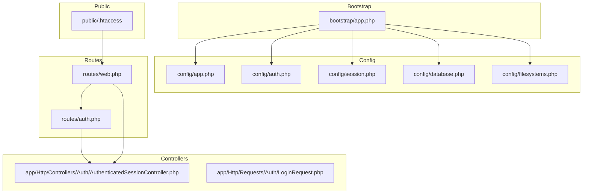
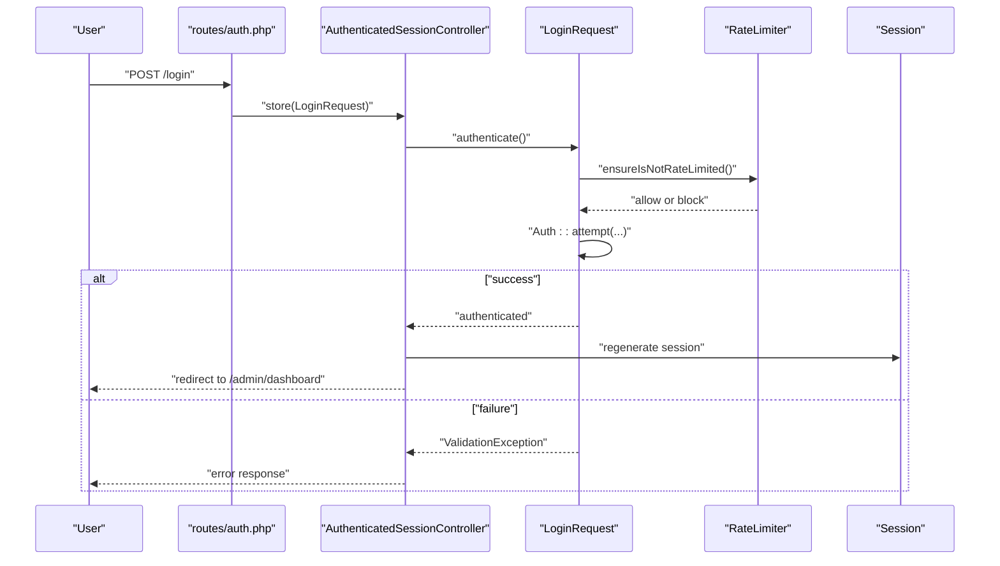
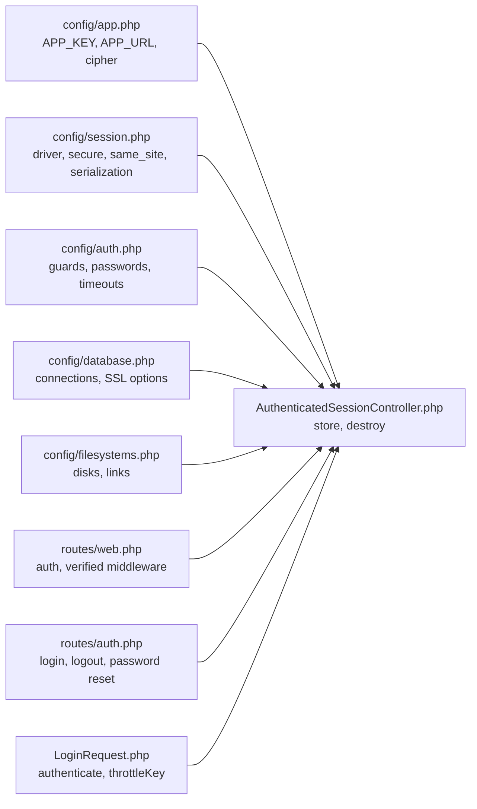

# Security Hardening & Configuration

<cite>
**Referenced Files in This Document**
- [app.php](file://bootstrap/app.php)
- [composer.json](file://composer.json)
- [.htaccess](file://public/.htaccess)
- [app.php](file://config/app.php)
- [auth.php](file://config/auth.php)
- [session.php](file://config/session.php)
- [database.php](file://config/database.php)
- [filesystems.php](file://config/filesystems.php)
- [AuthenticatedSessionController.php](file://app\Http\Controllers\Auth\AuthenticatedSessionController.php)
- [LoginRequest.php](file://app\Http\Requests\Auth\LoginRequest.php)
- [web.php](file://routes\web.php)
- [auth.php](file://routes\auth.php)
- [User.php](file://app\Models\User.php)
</cite>

## Table of Contents
1. [Introduction](#introduction)
2. [Project Structure](#project-structure)
3. [Core Components](#core-components)
4. [Architecture Overview](#architecture-overview)
5. [Detailed Component Analysis](#detailed-component-analysis)
6. [Dependency Analysis](#dependency-analysis)
7. [Performance Considerations](#performance-considerations)
8. [Troubleshooting Guide](#troubleshooting-guide)
9. [Conclusion](#conclusion)
10. [Appendices](#appendices)

## Introduction
This document provides comprehensive security hardening guidance for the ClinicalLog CMS production deployment. It focuses on secure configuration of application keys, encryption settings, and session management; HTTPS enforcement and security headers; CSRF protection; database security and credential management; file upload and image processing safety; authentication security including password policies, rate limiting, and two-factor authentication readiness; firewall and access control recommendations; and security audit procedures and vulnerability assessment guidelines.

## Project Structure
The application follows a standard Laravel structure with configuration under config/, routing under routes/, controllers under app/Http/Controllers, and models under app/Models/. Production hardening primarily involves environment-driven configuration, middleware redirection, and route-level protections.

**Diagram sources**
- [app.php:8-24](file://bootstrap/app.php#L8-L24)
- [app.php:1-127](file://config/app.php#L1-L127)
- [auth.php:1-118](file://config/auth.php#L1-L118)
- [session.php:1-234](file://config/session.php#L1-L234)
- [database.php:1-185](file://config/database.php#L1-L185)
- [filesystems.php:1-81](file://config/filesystems.php#L1-L81)
- [web.php:1-77](file://routes/web.php#L1-L77)
- [auth.php:1-60](file://routes/auth.php#L1-L60)
- [AuthenticatedSessionController.php:1-48](file://app\Http\Controllers\Auth\AuthenticatedSessionController.php#L1-L48)
- [LoginRequest.php:1-87](file://app\Http\Requests\Auth\LoginRequest.php#L1-L87)
- [.htaccess:1-26](file://public/.htaccess#L1-L26)

**Section sources**
- [app.php:8-24](file://bootstrap/app.php#L8-L24)
- [app.php:1-127](file://config/app.php#L1-L127)
- [auth.php:1-118](file://config/auth.php#L1-L118)
- [session.php:1-234](file://config/session.php#L1-L234)
- [database.php:1-185](file://config/database.php#L1-L185)
- [filesystems.php:1-81](file://config/filesystems.php#L1-L81)
- [web.php:1-77](file://routes/web.php#L1-L77)
- [auth.php:1-60](file://routes/auth.php#L1-L60)
- [AuthenticatedSessionController.php:1-48](file://app\Http\Controllers\Auth\AuthenticatedSessionController.php#L1-L48)
- [LoginRequest.php:1-87](file://app\Http\Requests\Auth\LoginRequest.php#L1-L87)
- [.htaccess:1-26](file://public/.htaccess#L1-L26)

## Core Components
- Application encryption key and cipher: AES-256-CBC with a 32-character key managed via environment variable.
- Session management: Database-backed sessions with configurable lifetime, secure cookie flags, SameSite policy, and JSON serialization.
- Authentication: Session guard with Eloquent provider, password reset policies, and password confirmation timeout.
- Database connectivity: Support for SQLite, MySQL/MariaDB, PostgreSQL, and SQL Server with SSL/TLS options exposed via environment variables.
- Filesystems: Local private and public disks with symlink support for public storage.
- Routing and middleware: Route groups enforcing authentication and email verification; redirect middleware for guest vs. authenticated users.

**Section sources**
- [app.php:98-106](file://config/app.php#L98-L106)
- [session.php:21-37](file://config/session.php#L21-L37)
- [session.php:172-202](file://config/session.php#L172-L202)
- [session.php:231-231](file://config/session.php#L231-L231)
- [auth.php:40-45](file://config/auth.php#L40-L45)
- [auth.php:95-102](file://config/auth.php#L95-L102)
- [auth.php:115-115](file://config/auth.php#L115-L115)
- [database.php:20-21](file://config/database.php#L20-L21)
- [database.php:47-65](file://config/database.php#L47-L65)
- [database.php:67-85](file://config/database.php#L67-L85)
- [database.php:87-100](file://config/database.php#L87-L100)
- [database.php:102-115](file://config/database.php#L102-L115)
- [filesystems.php:16-16](file://config/filesystems.php#L16-L16)
- [filesystems.php:31-62](file://config/filesystems.php#L31-L62)
- [web.php:37-74](file://routes/web.php#L37-L74)
- [auth.php:14-36](file://routes/auth.php#L14-L36)
- [app.php:14-19](file://bootstrap/app.php#L14-L19)

## Architecture Overview
The authentication and session flow integrates route-level middleware, controller actions, and request validation with rate limiting and CSRF handling at the framework level.

**Diagram sources**
- [auth.php:20-36](file://routes/auth.php#L20-L36)
- [AuthenticatedSessionController.php:25-32](file://app\Http\Controllers\Auth\AuthenticatedSessionController.php#L25-L32)
- [LoginRequest.php:41-54](file://app\Http\Requests\Auth\LoginRequest.php#L41-L54)
- [LoginRequest.php:61-77](file://app\Http\Requests\Auth\LoginRequest.php#L61-L77)

**Section sources**
- [auth.php:20-36](file://routes/auth.php#L20-L36)
- [AuthenticatedSessionController.php:25-32](file://app\Http\Controllers\Auth\AuthenticatedSessionController.php#L25-L32)
- [LoginRequest.php:41-54](file://app\Http\Requests\Auth\LoginRequest.php#L41-L54)
- [LoginRequest.php:61-77](file://app\Http\Requests\Auth\LoginRequest.php#L61-L77)

## Detailed Component Analysis

### Application Keys and Encryption
- Encryption key: Must be a 32-character random string set via environment variable. The cipher is AES-256-CBC.
- Previous keys: Supports rotation via previous keys list.
- Recommendations:
  - Generate and store the key securely in the hosting environment.
  - Rotate keys periodically and update previous keys accordingly.
  - Restrict access to key material and avoid committing secrets to version control.

**Section sources**
- [app.php:98-106](file://config/app.php#L98-L106)

### Session Management
- Driver: Database-backed sessions by default.
- Lifetime: Configurable minutes; consider short-lived sessions for admin areas.
- Secure cookies: Enable HTTPS-only cookies and HTTP-only flags.
- SameSite: Configure per application risk tolerance; strict for sensitive actions.
- Serialization: JSON serialization is enabled; avoid PHP serialization to mitigate gadget chain risks.
- Recommendations:
  - Enforce secure and same-site cookie policies in production.
  - Use partitioned cookies where applicable.
  - Store sessions in a dedicated, protected database with appropriate access controls.

**Section sources**
- [session.php:21-37](file://config/session.php#L21-L37)
- [session.php:172-202](file://config/session.php#L172-L202)
- [session.php:231-231](file://config/session.php#L231-L231)

### Authentication and Password Policies
- Guard: Session-based with Eloquent provider.
- Password reset: Token expiry and throttling configured.
- Password confirmation timeout: Three-hour window.
- Model hashing: Passwords are hashed via model casting.
- Recommendations:
  - Enforce strong password policies at registration/validation.
  - Consider adding password history and reuse policies.
  - Implement two-factor authentication using Laravel Breeze or similar packages.

**Section sources**
- [auth.php:40-45](file://config/auth.php#L40-L45)
- [auth.php:95-102](file://config/auth.php#L95-L102)
- [auth.php:115-115](file://config/auth.php#L115-L115)
- [User.php:25-31](file://app\Models\User.php#L25-L31)

### Rate Limiting and Brute Force Protection
- Login attempts are rate-limited; exceeding thresholds triggers lockout with throttling feedback.
- Throttle key combines normalized email and client IP.
- Recommendations:
  - Tune limits based on infrastructure capacity.
  - Add CAPTCHA or additional challenges after repeated failures.
  - Monitor and alert on sustained brute force attempts.

**Section sources**
- [LoginRequest.php:61-77](file://app\Http\Requests\Auth\LoginRequest.php#L61-L77)
- [LoginRequest.php:82-85](file://app\Http\Requests\Auth\LoginRequest.php#L82-L85)

### HTTPS Enforcement and Security Headers
- HTTPS enforcement: Ensure the application URL is HTTPS in production and reverse proxy terminates TLS.
- Security headers: Configure via web server or framework middleware (e.g., HSTS, CSP, X-Content-Type-Options, X-Frame-Options).
- CSRF handling: Laravel’s built-in CSRF protection via tokens and SameSite cookies.
- Recommendations:
  - Enforce HTTPS redirects at the load balancer or web server.
  - Implement Content Security Policy tailored to asset delivery.
  - Use HSTS header with preload considerations.

**Section sources**
- [app.php:55-55](file://config/app.php#L55-L55)
- [.htaccess:1-26](file://public/.htaccess#L1-L26)
- [session.php:202-202](file://config/session.php#L202-L202)

### Database Security and Credential Management
- Drivers: SQLite, MySQL/MariaDB, PostgreSQL, SQL Server.
- SSL/TLS: MySQL/MariaDB support for SSL CA; PostgreSQL sslmode; SQL Server placeholders for encryption and trust options.
- Recommendations:
  - Use least-privilege database accounts with minimal required permissions.
  - Enable transport encryption (SSL/TLS) for remote connections.
  - Store credentials in environment variables or secret managers.
  - Regularly rotate credentials and review connection strings.

**Section sources**
- [database.php:20-21](file://config/database.php#L20-L21)
- [database.php:47-65](file://config/database.php#L47-L65)
- [database.php:67-85](file://config/database.php#L67-L85)
- [database.php:87-100](file://config/database.php#L87-L100)
- [database.php:102-115](file://config/database.php#L102-L115)

### File Upload Security and Image Processing Safety
- Disks: Private and public local disks; public disk URL derived from APP_URL.
- Recommendations:
  - Store uploads on private disk; serve via signed URLs or controller actions.
  - Validate file types and sizes; reject executable or unsafe extensions.
  - Scan uploaded files for malware using external scanners.
  - Apply least privilege to upload directories and restrict write permissions.

**Section sources**
- [filesystems.php:16-16](file://config/filesystems.php#L16-L16)
- [filesystems.php:31-62](file://config/filesystems.php#L31-L62)

### Firewall Configuration and Access Control
- IP whitelisting: Restrict administrative routes to trusted IPs at the load balancer or firewall.
- Access control: Use route middleware to enforce authentication and verified email requirements.
- Recommendations:
  - Block administrative endpoints from public internet exposure.
  - Use WAF rules to mitigate common attack vectors.
  - Log and monitor access to admin routes.

**Section sources**
- [web.php:37-74](file://routes/web.php#L37-L74)
- [auth.php:14-36](file://routes/auth.php#L14-L36)

### Two-Factor Authentication Setup
- Current state: No 2FA package is included in the project dependencies.
- Recommendations:
  - Integrate Laravel Breeze or similar package for 2FA.
  - Enforce 2FA for admin users.
  - Provide backup codes and recovery mechanisms.

**Section sources**
- [composer.json:13-22](file://composer.json#L13-L22)

## Dependency Analysis
The runtime security posture depends on environment configuration and middleware redirection. The following diagram maps key dependencies among configuration, routes, and controllers.

**Diagram sources**
- [app.php:55-106](file://config/app.php#L55-L106)
- [session.php:21-202](file://config/session.php#L21-L202)
- [auth.php:40-115](file://config/auth.php#L40-L115)
- [database.php:47-115](file://config/database.php#L47-L115)
- [filesystems.php:31-62](file://config/filesystems.php#L31-L62)
- [web.php:37-74](file://routes/web.php#L37-L74)
- [auth.php:20-59](file://routes/auth.php#L20-L59)
- [AuthenticatedSessionController.php:25-46](file://app\Http\Controllers\Auth\AuthenticatedSessionController.php#L25-L46)
- [LoginRequest.php:41-85](file://app\Http\Requests\Auth\LoginRequest.php#L41-L85)

**Section sources**
- [app.php:55-106](file://config/app.php#L55-L106)
- [session.php:21-202](file://config/session.php#L21-L202)
- [auth.php:40-115](file://config/auth.php#L40-L115)
- [database.php:47-115](file://config/database.php#L47-L115)
- [filesystems.php:31-62](file://config/filesystems.php#L31-L62)
- [web.php:37-74](file://routes/web.php#L37-L74)
- [auth.php:20-59](file://routes/auth.php#L20-L59)
- [AuthenticatedSessionController.php:25-46](file://app\Http\Controllers\Auth\AuthenticatedSessionController.php#L25-L46)
- [LoginRequest.php:41-85](file://app\Http\Requests\Auth\LoginRequest.php#L41-L85)

## Performance Considerations
- Session storage: Database sessions add overhead; consider Redis for high-throughput environments.
- Rate limiting: Use caching backend to store throttle counters.
- HTTPS termination: Offload TLS to reverse proxy or CDN to reduce CPU load.
- Static assets: Serve via CDN with appropriate caching headers.

## Troubleshooting Guide
- Symptom: Login failures after threshold exceeded.
  - Cause: Rate limiter triggered.
  - Action: Wait for cooldown or adjust limits; verify throttle key generation.
- Symptom: Session cookies not secure.
  - Cause: Missing secure flag or wrong SameSite setting.
  - Action: Configure SESSION_SECURE_COOKIE and SESSION_SAME_SITE appropriately.
- Symptom: CSRF token mismatch.
  - Cause: Missing or stale CSRF token.
  - Action: Ensure forms include CSRF token and SameSite cookies are configured.

**Section sources**
- [LoginRequest.php:61-77](file://app\Http\Requests\Auth\LoginRequest.php#L61-L77)
- [session.php:172-202](file://config/session.php#L172-L202)

## Conclusion
ClinicalLog CMS leverages Laravel’s built-in security mechanisms. Production hardening hinges on correct environment configuration, HTTPS enforcement, robust session and database security, strict file handling, and access control. Implement rate limiting, CSRF protection, and consider 2FA for administrative access. Continuously audit configurations and perform vulnerability assessments aligned with organizational policies.

## Appendices

### Security Audit Procedures
- Review environment variables for secrets exposure.
- Validate encryption key presence and entropy.
- Confirm HTTPS termination and certificate validity.
- Audit session cookie flags and SameSite policies.
- Verify database credentials and transport encryption.
- Inspect filesystem permissions and upload restrictions.
- Test rate limiting and brute force mitigation.
- Review route middleware coverage for admin endpoints.

### Vulnerability Assessment Guidelines
- Static analysis: Scan for hardcoded secrets, weak cryptography, and insecure deserialization.
- Dynamic analysis: Penetration test authentication flows, CSRF, and parameter injection.
- Dependency review: Audit Composer dependencies for known vulnerabilities.
- Infrastructure review: Validate network ACLs, WAF rules, and firewall policies.