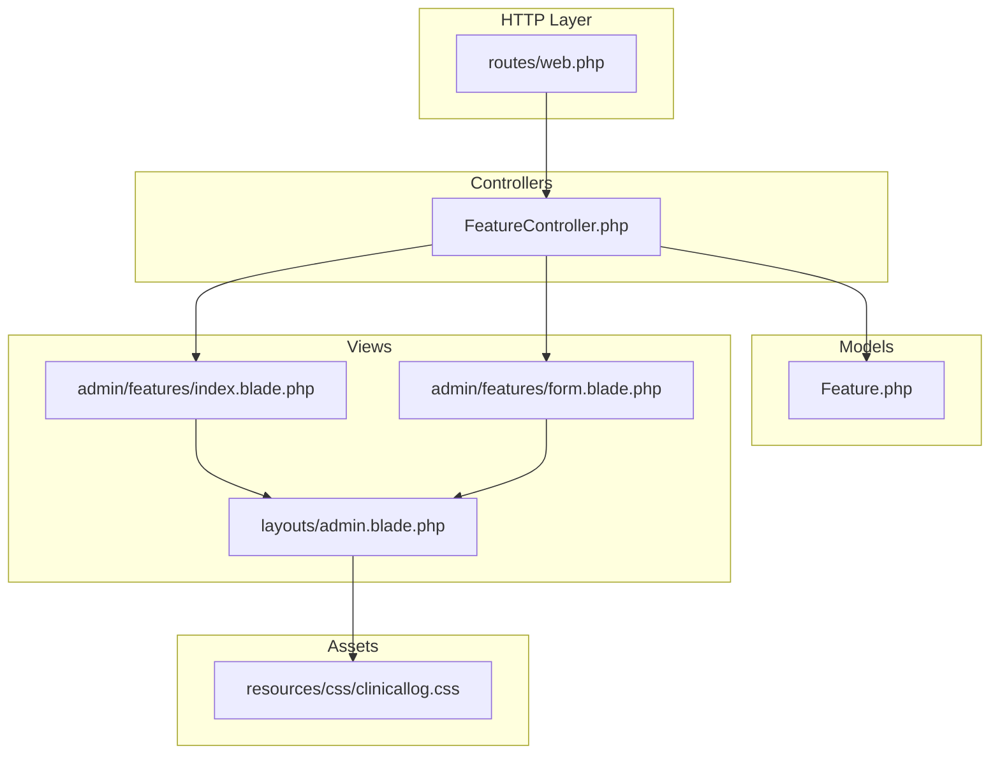
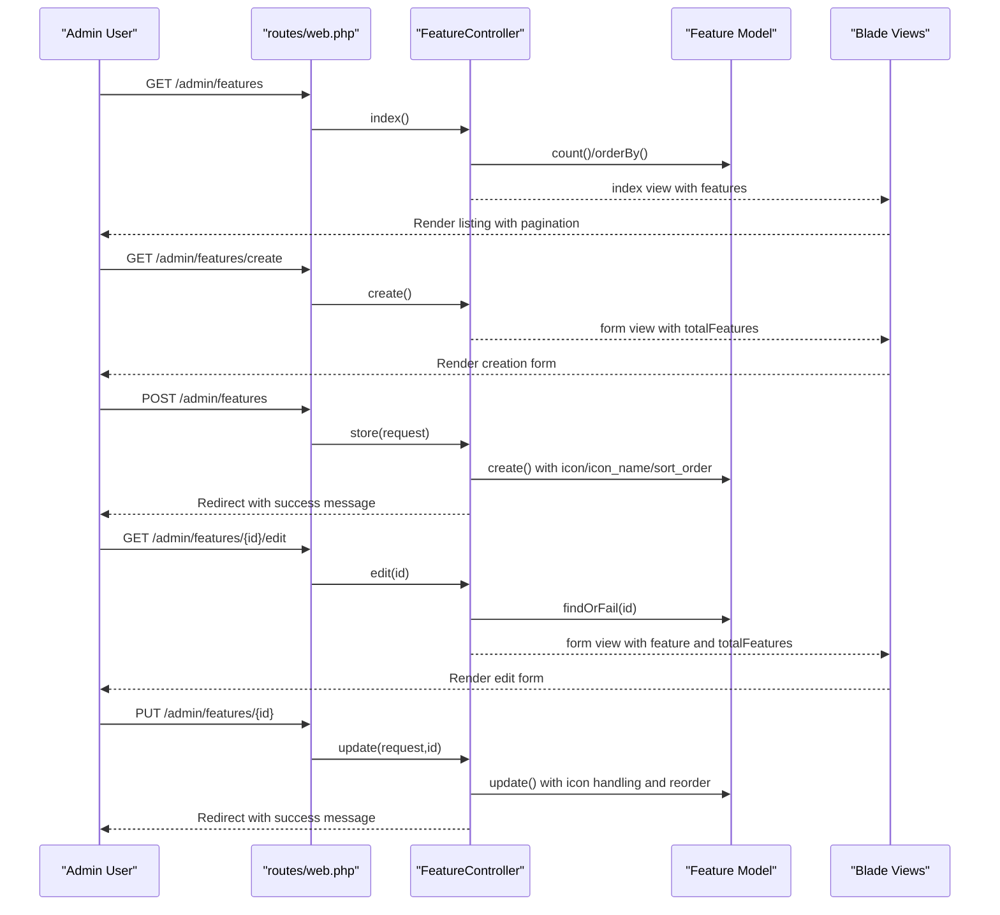
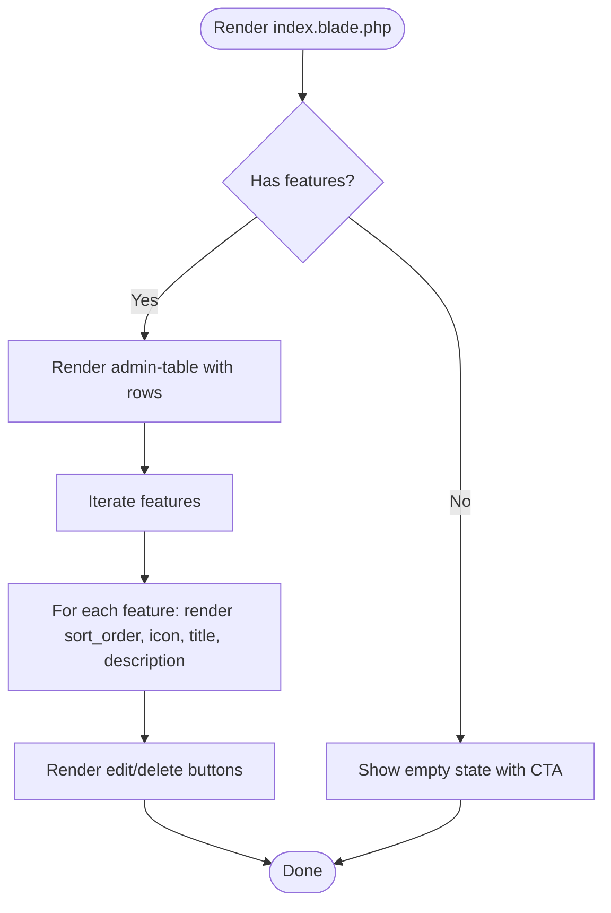
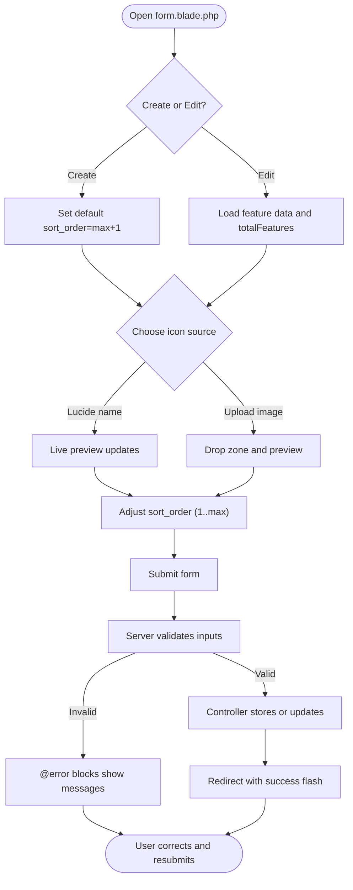
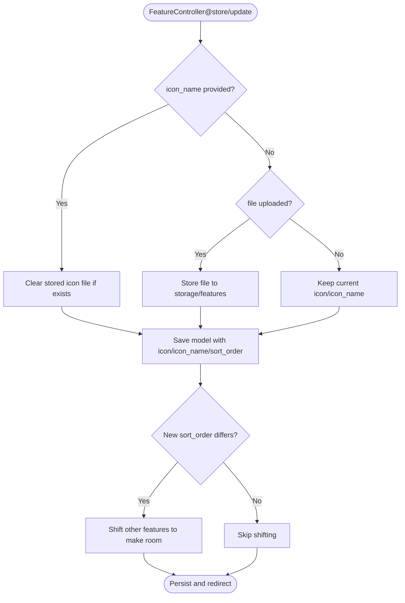
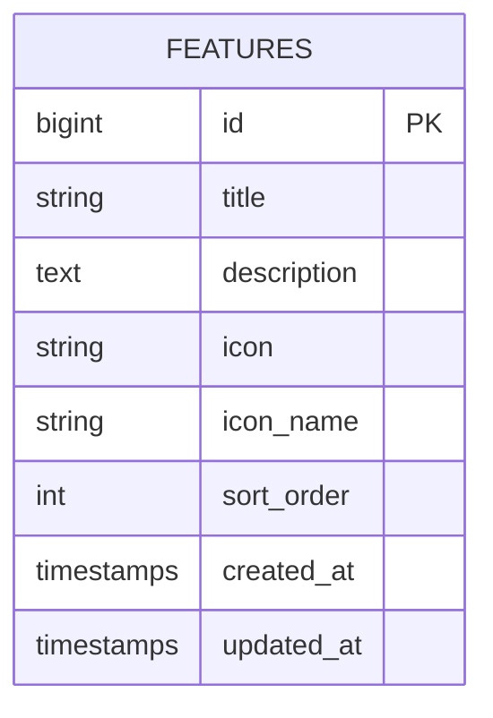
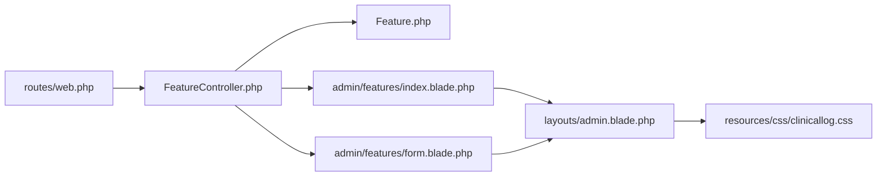

# Admin Interface Components

<cite>
**Referenced Files in This Document**
- [FeatureController.php](file://app/Http/Controllers/FeatureController.php)
- [Feature.php](file://app/Models/Feature.php)
- [index.blade.php](file://resources/views/admin/features/index.blade.php)
- [form.blade.php](file://resources/views/admin/features/form.blade.php)
- [admin.blade.php](file://resources/views/layouts/admin.blade.php)
- [clinicallog.css](file://resources/css/clinicallog.css)
- [web.php](file://routes/web.php)
- [2026_06_17_060200_create_features_table.php](file://database/migrations/2026_06_17_060200_create_features_table.php)
- [2026_06_17_073934_add_icon_and_sort_to_features_table.php](file://database/migrations/2026_06_17_073934_add_icon_and_sort_to_features_table.php)
- [2026_06_18_060800_add_icon_name_to_features_table.php](file://database/migrations/2026_06_18_060800_add_icon_name_to_features_table.php)
- [text-input.blade.php](file://resources/views/components/text-input.blade.php)
- [input-error.blade.php](file://resources/views/components/input-error.blade.php)
- [input-label.blade.php](file://resources/views/components/input-label.blade.php)
- [primary-button.blade.php](file://resources/views/components/primary-button.blade.php)
- [secondary-button.blade.php](file://resources/views/components/secondary-button.blade.php)
</cite>

## Table of Contents
1. [Introduction](#introduction)
2. [Project Structure](#project-structure)
3. [Core Components](#core-components)
4. [Architecture Overview](#architecture-overview)
5. [Detailed Component Analysis](#detailed-component-analysis)
6. [Dependency Analysis](#dependency-analysis)
7. [Performance Considerations](#performance-considerations)
8. [Troubleshooting Guide](#troubleshooting-guide)
9. [Conclusion](#conclusion)
10. [Appendices](#appendices)

## Introduction
This document describes the feature management admin interface components in the ClinicalLog CMS. It covers the feature listing page with pagination and actions, the creation and editing forms with validation and icon selection, the Blade template structure and component integration, responsive design and UX patterns, and guidance for customization and accessibility.

## Project Structure
The feature management functionality spans controllers, models, Blade templates, CSS styles, and routes:

- Controllers handle CRUD operations and ordering logic for features.
- Models define fillable attributes and persistence.
- Blade templates render the listing and forms with Lucide icons and previews.
- CSS defines responsive layouts, glass cards, and admin-specific styles.
- Routes expose admin endpoints for listing, creating, editing, updating, and deleting features.

**Diagram sources**
- [web.php:56-62](file://routes/web.php#L56-L62)
- [FeatureController.php:9-155](file://app/Http/Controllers/FeatureController.php#L9-L155)
- [Feature.php:7-16](file://app/Models/Feature.php#L7-L16)
- [index.blade.php:1-109](file://resources/views/admin/features/index.blade.php#L1-L109)
- [form.blade.php:1-298](file://resources/views/admin/features/form.blade.php#L1-L298)
- [admin.blade.php:1-150](file://resources/views/layouts/admin.blade.php#L1-L150)
- [clinicallog.css:671-763](file://resources/css/clinicallog.css#L671-L763)

**Section sources**
- [web.php:56-62](file://routes/web.php#L56-L62)
- [FeatureController.php:9-155](file://app/Http/Controllers/FeatureController.php#L9-L155)
- [Feature.php:7-16](file://app/Models/Feature.php#L7-L16)
- [index.blade.php:1-109](file://resources/views/admin/features/index.blade.php#L1-L109)
- [form.blade.php:1-298](file://resources/views/admin/features/form.blade.php#L1-L298)
- [admin.blade.php:1-150](file://resources/views/layouts/admin.blade.php#L1-L150)
- [clinicallog.css:671-763](file://resources/css/clinicallog.css#L671-L763)

## Core Components
- FeatureController: Implements listing redirection, creation, storage, editing, updates, and deletion with icon handling and sort-order reordering.
- Feature model: Defines fillable attributes for title, description, icon, icon_name, and sort_order.
- Listing view: Renders a sortable table of features with pagination and action buttons.
- Form view: Provides dual icon inputs (Lucide name or image upload), live preview, positioning controls, and validation feedback.
- Layout and styles: Admin layout with sidebar, flash messages, and CSS utilities for glass cards, tables, forms, and responsive breakpoints.

Key responsibilities:
- Data binding: Blade binds controller-provided data (features collection, feature instance, counts) to views.
- Validation feedback: Blade displays per-field errors via @error blocks.
- Ordering: The controller maintains sort_order integrity during create/update/delete.

**Section sources**
- [FeatureController.php:11-155](file://app/Http/Controllers/FeatureController.php#L11-L155)
- [Feature.php:9-15](file://app/Models/Feature.php#L9-L15)
- [index.blade.php:18-106](file://resources/views/admin/features/index.blade.php#L18-L106)
- [form.blade.php:21-157](file://resources/views/admin/features/form.blade.php#L21-L157)
- [admin.blade.php:19-146](file://resources/views/layouts/admin.blade.php#L19-L146)
- [clinicallog.css:715-763](file://resources/css/clinicallog.css#L715-L763)

## Architecture Overview
The feature management flow connects routes to controllers, models, and views:

**Diagram sources**
- [web.php:56-62](file://routes/web.php#L56-L62)
- [FeatureController.php:11-155](file://app/Http/Controllers/FeatureController.php#L11-L155)
- [Feature.php:7-16](file://app/Models/Feature.php#L7-L16)
- [index.blade.php:1-109](file://resources/views/admin/features/index.blade.php#L1-L109)
- [form.blade.php:1-298](file://resources/views/admin/features/form.blade.php#L1-L298)

## Detailed Component Analysis

### Feature Listing Page
- Purpose: Display all features in a sortable table with pagination and action controls.
- Data binding: Receives a paginated features collection; renders count and links to create/edit.
- Pagination: Uses Laravel’s built-in paginator links rendering.
- Actions: Edit and Delete buttons per row; confirm dialogs for destructive actions.
- Sorting: The table does not include explicit client-side sorting controls; ordering is managed server-side via sort_order.

**Diagram sources**
- [index.blade.php:18-106](file://resources/views/admin/features/index.blade.php#L18-L106)

**Section sources**
- [index.blade.php:1-109](file://resources/views/admin/features/index.blade.php#L1-L109)

### Feature Creation and Editing Forms
- Dual icon inputs:
  - Lucide icon name input with live preview powered by Lucide UMD.
  - Image upload zone with drag-and-drop support and preview.
- Position controls:
  - Numeric sort_order input with min/max clamped to available positions.
  - Automatic reordering of existing features when inserting/updating.
- Validation feedback:
  - @error blocks display field-specific messages.
  - Required attributes on inputs trigger HTML5 validation.
- Live preview and UX:
  - Debounced Lucide icon name preview updates.
  - Upload zone click and drag/drop handlers.
  - Tips panel with guidelines and quick-select Lucide examples.

**Diagram sources**
- [form.blade.php:21-157](file://resources/views/admin/features/form.blade.php#L21-L157)
- [FeatureController.php:22-132](file://app/Http/Controllers/FeatureController.php#L22-L132)

**Section sources**
- [form.blade.php:1-298](file://resources/views/admin/features/form.blade.php#L1-L298)
- [FeatureController.php:22-132](file://app/Http/Controllers/FeatureController.php#L22-L132)

### Controller Logic: Ordering and Icon Handling
- Creation:
  - Validates icon_name vs file upload; stores file if provided.
  - Clamps sort_order to [1, totalFeatures+1]; shifts existing entries down.
- Update:
  - Handles icon_name clearing, replacing uploads, and delete_icon checkbox.
  - Reorders around new position with directional shifts.
- Deletion:
  - Removes uploaded icon if present.
  - Shifts subsequent entries up by 1.

**Diagram sources**
- [FeatureController.php:22-132](file://app/Http/Controllers/FeatureController.php#L22-L132)

**Section sources**
- [FeatureController.php:22-154](file://app/Http/Controllers/FeatureController.php#L22-L154)

### Blade Template Structure and Component Integration
- Layout: admin.blade.php provides the shell with sidebar, navigation, flash messages, and Lucide initialization.
- Components: Built-in Blade components for inputs and buttons are available for reuse across the application.
- Data binding: Views receive data from controllers (features collection, feature instance, totals) and render accordingly.
- Styling: Uses clinicallog.css utilities for glass cards, tables, forms, and responsive breakpoints.

**Section sources**
- [admin.blade.php:1-150](file://resources/views/layouts/admin.blade.php#L1-L150)
- [text-input.blade.php:1-4](file://resources/views/components/text-input.blade.php#L1-L4)
- [input-error.blade.php:1-10](file://resources/views/components/input-error.blade.php#L1-L10)
- [input-label.blade.php:1-6](file://resources/views/components/input-label.blade.php#L1-L6)
- [primary-button.blade.php:1-4](file://resources/views/components/primary-button.blade.php#L1-L4)
- [secondary-button.blade.php:1-4](file://resources/views/components/secondary-button.blade.php#L1-L4)
- [clinicallog.css:671-763](file://resources/css/clinicallog.css#L671-L763)

### Data Model and Database Schema
- Model fillable fields include title, description, icon, icon_name, and sort_order.
- Migrations establish the base features table and add icon-related columns and sort_order.

**Diagram sources**
- [Feature.php:9-15](file://app/Models/Feature.php#L9-L15)
- [2026_06_17_060200_create_features_table.php:14-23](file://database/migrations/2026_06_17_060200_create_features_table.php#L14-L23)
- [2026_06_17_073934_add_icon_and_sort_to_features_table.php:14-17](file://database/migrations/2026_06_17_073934_add_icon_and_sort_to_features_table.php#L14-L17)
- [2026_06_18_060800_add_icon_name_to_features_table.php:14-16](file://database/migrations/2026_06_18_060800_add_icon_name_to_features_table.php#L14-L16)

**Section sources**
- [Feature.php:9-15](file://app/Models/Feature.php#L9-L15)
- [2026_06_17_060200_create_features_table.php:12-24](file://database/migrations/2026_06_17_060200_create_features_table.php#L12-L24)
- [2026_06_17_073934_add_icon_and_sort_to_features_table.php:12-17](file://database/migrations/2026_06_17_073934_add_icon_and_sort_to_features_table.php#L12-L17)
- [2026_06_18_060800_add_icon_name_to_features_table.php:12-16](file://database/migrations/2026_06_18_060800_add_icon_name_to_features_table.php#L12-L16)

## Dependency Analysis
- Routes depend on FeatureController methods.
- FeatureController depends on Feature model and storage disk.
- Views depend on layout and CSS utilities; form view additionally depends on Lucide UMD and local scripts.
- No circular dependencies observed among controllers, models, and views.

**Diagram sources**
- [web.php:56-62](file://routes/web.php#L56-L62)
- [FeatureController.php:5-7](file://app/Http/Controllers/FeatureController.php#L5-L7)
- [Feature.php:7-16](file://app/Models/Feature.php#L7-L16)
- [index.blade.php:1-109](file://resources/views/admin/features/index.blade.php#L1-L109)
- [form.blade.php:1-298](file://resources/views/admin/features/form.blade.php#L1-L298)
- [admin.blade.php:1-150](file://resources/views/layouts/admin.blade.php#L1-L150)
- [clinicallog.css:671-763](file://resources/css/clinicallog.css#L671-L763)

**Section sources**
- [web.php:56-62](file://routes/web.php#L56-L62)
- [FeatureController.php:5-7](file://app/Http/Controllers/FeatureController.php#L5-L7)
- [Feature.php:7-16](file://app/Models/Feature.php#L7-L16)
- [index.blade.php:1-109](file://resources/views/admin/features/index.blade.php#L1-L109)
- [form.blade.php:1-298](file://resources/views/admin/features/form.blade.php#L1-L298)
- [admin.blade.php:1-150](file://resources/views/layouts/admin.blade.php#L1-L150)
- [clinicallog.css:671-763](file://resources/css/clinicallog.css#L671-L763)

## Performance Considerations
- Sorting operations: The controller performs ordered updates for reordering; ensure appropriate indexing on sort_order for large datasets.
- File storage: Image uploads are stored under storage/public/features; consider CDN or optimized delivery for production.
- Rendering: The listing uses pagination; keep per-page limits reasonable to avoid heavy DOM rendering.
- JavaScript: Debounce is used for live icon preview; keep event handlers efficient to prevent UI lag.

## Troubleshooting Guide
Common issues and resolutions:
- Validation errors on form submission:
  - Ensure required fields (title, description) are filled; check @error blocks for messages.
  - Verify file type and size constraints for uploads.
- Icon not displaying:
  - For Lucide name, confirm the name exists and the preview script runs after DOM load.
  - For uploaded images, verify storage path and permissions.
- Ordering anomalies:
  - Confirm sort_order falls within [1, totalFeatures+1] for create and [1, totalFeatures] for update.
  - After updates, verify that other entries shifted correctly.

**Section sources**
- [form.blade.php:36-48](file://resources/views/admin/features/form.blade.php#L36-L48)
- [FeatureController.php:33-44](file://app/Http/Controllers/FeatureController.php#L33-L44)
- [FeatureController.php:96-121](file://app/Http/Controllers/FeatureController.php#L96-L121)

## Conclusion
The feature management admin interface integrates a robust controller with precise ordering logic, flexible icon inputs (Lucide or image), and a responsive Blade-based UI with clear validation feedback. The modular structure supports easy customization and extension while maintaining a consistent admin experience.

## Appendices

### Customization Examples
- Adding a new form field:
  - Extend the Feature model fillable array to include the new attribute.
  - Add a corresponding input in the form view with appropriate label and validation.
  - Update the controller store and update methods to persist the new attribute.
  - Reference paths:
    - [Feature.php:9-15](file://app/Models/Feature.php#L9-L15)
    - [form.blade.php:31-49](file://resources/views/admin/features/form.blade.php#L31-L49)
    - [FeatureController.php:46-52](file://app/Http/Controllers/FeatureController.php#L46-L52)
    - [FeatureController.php:123-129](file://app/Http/Controllers/FeatureController.php#L123-L129)

- Implementing additional validation rules:
  - Add Laravel validation rules in the controller store/update methods.
  - Display messages using @error blocks in the form view.
  - Reference paths:
    - [FeatureController.php:22-54](file://app/Http/Controllers/FeatureController.php#L22-L54)
    - [form.blade.php:36-48](file://resources/views/admin/features/form.blade.php#L36-L48)

- Enhancing responsive design:
  - Adjust CSS grid and media queries in clinicallog.css for optimal tablet/mobile layouts.
  - Reference paths:
    - [clinicallog.css:671-763](file://resources/css/clinicallog.css#L671-L763)

- Accessibility considerations:
  - Ensure labels are associated with inputs and screen-reader-friendly hints are present.
  - Provide keyboard navigation support for interactive elements (drag-and-drop zones).
  - Maintain sufficient color contrast for text and interactive components.
  - Reference paths:
    - [form.blade.php:33-45](file://resources/views/admin/features/form.blade.php#L33-L45)
    - [clinicallog.css:671-763](file://resources/css/clinicallog.css#L671-L763)

- Cross-browser compatibility:
  - Test drag-and-drop upload zone across browsers; polyfill or fallback if needed.
  - Validate Lucide icon rendering across environments; ensure UMD script loads reliably.
  - Reference paths:
    - [form.blade.php:280-295](file://resources/views/admin/features/form.blade.php#L280-L295)
    - [admin.blade.php:133-146](file://resources/views/layouts/admin.blade.php#L133-L146)