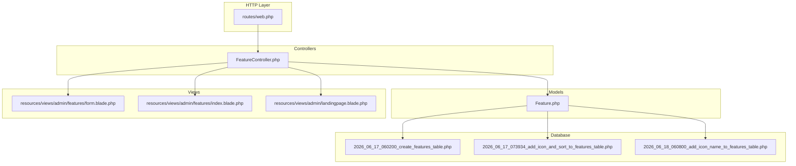
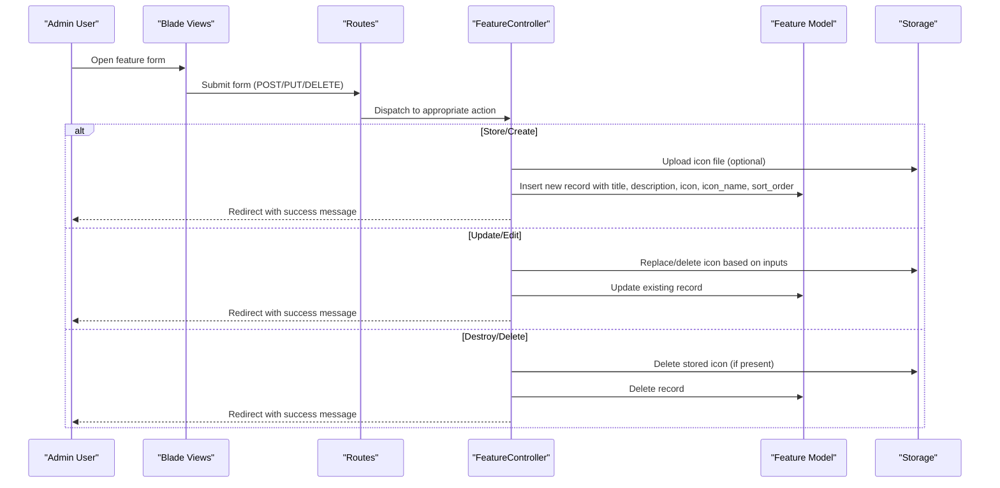
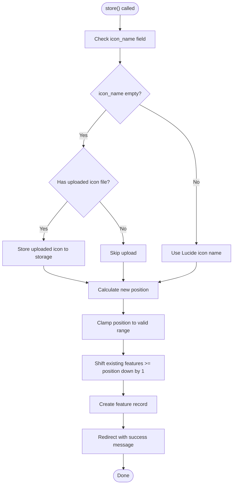
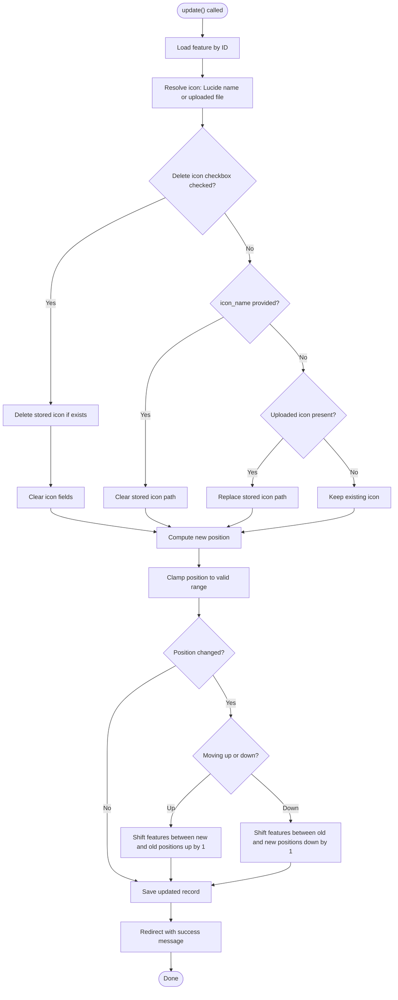
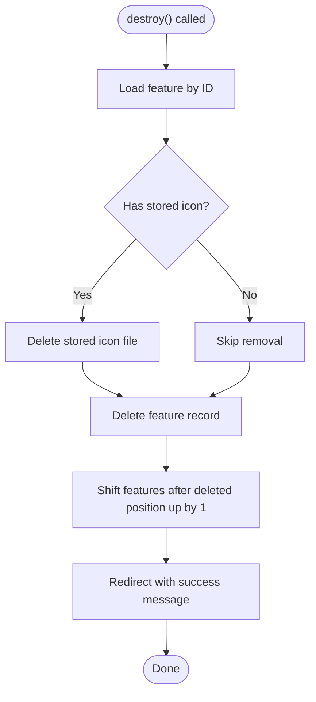
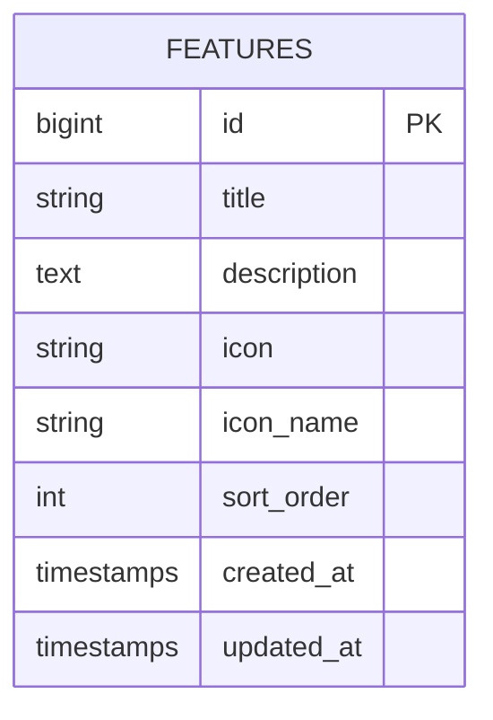
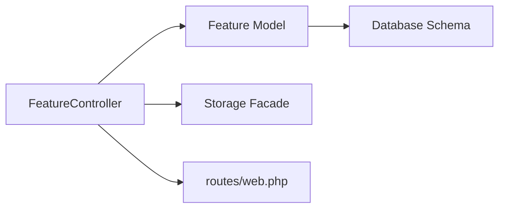

# Feature CRUD Operations

<cite>
**Referenced Files in This Document**
- [FeatureController.php](file://app/Http/Controllers/FeatureController.php)
- [Feature.php](file://app/Models/Feature.php)
- [form.blade.php](file://resources/views/admin/features/form.blade.php)
- [index.blade.php](file://resources/views/admin/features/index.blade.php)
- [landingpage.blade.php](file://resources/views/admin/landingpage.blade.php)
- [web.php](file://routes/web.php)
- [2026_06_17_060200_create_features_table.php](file://database/migrations/2026_06_17_060200_create_features_table.php)
- [2026_06_17_073934_add_icon_and_sort_to_features_table.php](file://database/migrations/2026_06_17_073934_add_icon_and_sort_to_features_table.php)
- [2026_06_18_060800_add_icon_name_to_features_table.php](file://database/migrations/2026_06_18_060800_add_icon_name_to_features_table.php)
</cite>

## Table of Contents
1. [Introduction](#introduction)
2. [Project Structure](#project-structure)
3. [Core Components](#core-components)
4. [Architecture Overview](#architecture-overview)
5. [Detailed Component Analysis](#detailed-component-analysis)
6. [Dependency Analysis](#dependency-analysis)
7. [Performance Considerations](#performance-considerations)
8. [Troubleshooting Guide](#troubleshooting-guide)
9. [Conclusion](#conclusion)

## Introduction
This document provides comprehensive coverage of the Feature CRUD operations in ClinicalLog CMS. It focuses on the FeatureController implementation, detailing create, read, update, and delete workflows. The documentation explains validation, positioning logic, icon handling (Lucide icons vs. uploaded images), error handling, success messaging, and integration with the admin interface.

## Project Structure
The Feature CRUD functionality spans controllers, models, Blade views, routes, and database migrations:

- Controller: Handles HTTP requests and orchestrates persistence and presentation logic
- Model: Defines fillable attributes and Eloquent behavior
- Views: Admin forms and listings for creating, editing, and deleting features
- Routes: Expose endpoints for feature management
- Migrations: Define database schema supporting features, icons, and ordering

**Diagram sources**
- [web.php:56-62](file://routes/web.php#L56-L62)
- [FeatureController.php:9-156](file://app/Http/Controllers/FeatureController.php#L9-L156)
- [Feature.php:7-16](file://app/Models/Feature.php#L7-L16)
- [form.blade.php:1-298](file://resources/views/admin/features/form.blade.php#L1-L298)
- [index.blade.php:1-109](file://resources/views/admin/features/index.blade.php#L1-L109)
- [landingpage.blade.php:378-495](file://resources/views/admin/landingpage.blade.php#L378-L495)
- [2026_06_17_060200_create_features_table.php:14-23](file://database/migrations/2026_06_17_060200_create_features_table.php#L14-L23)
- [2026_06_17_073934_add_icon_and_sort_to_features_table.php:14-17](file://database/migrations/2026_06_17_073934_add_icon_and_sort_to_features_table.php#L14-L17)
- [2026_06_18_060800_add_icon_name_to_features_table.php:14-16](file://database/migrations/2026_06_18_060800_add_icon_name_to_features_table.php#L14-L16)

**Section sources**
- [web.php:56-62](file://routes/web.php#L56-L62)
- [FeatureController.php:9-156](file://app/Http/Controllers/FeatureController.php#L9-L156)
- [Feature.php:7-16](file://app/Models/Feature.php#L7-L16)
- [form.blade.php:1-298](file://resources/views/admin/features/form.blade.php#L1-L298)
- [index.blade.php:1-109](file://resources/views/admin/features/index.blade.php#L1-L109)
- [landingpage.blade.php:378-495](file://resources/views/admin/landingpage.blade.php#L378-L495)
- [2026_06_17_060200_create_features_table.php:14-23](file://database/migrations/2026_06_17_060200_create_features_table.php#L14-L23)
- [2026_06_17_073934_add_icon_and_sort_to_features_table.php:14-17](file://database/migrations/2026_06_17_073934_add_icon_and_sort_to_features_table.php#L14-L17)
- [2026_06_18_060800_add_icon_name_to_features_table.php:14-16](file://database/migrations/2026_06_18_060800_add_icon_name_to_features_table.php#L14-L16)

## Core Components
- FeatureController: Implements index, create, store, edit, update, and destroy actions. Handles icon selection (Lucide name or uploaded file), position clamping and shifting, and success messages.
- Feature Model: Defines fillable attributes for title, description, icon path, Lucide icon name, and sort_order.
- Admin Views: Provide forms and lists for managing features, including icon previews and position controls.
- Routes: Expose endpoints for feature CRUD under the admin namespace.

Key implementation highlights:
- Position management ensures features are ordered correctly during creation and updates.
- Icon handling supports two modes: Lucide icon names or uploaded images, with optional deletion.
- Redirects with success messages integrate with the admin layout.

**Section sources**
- [FeatureController.php:11-156](file://app/Http/Controllers/FeatureController.php#L11-L156)
- [Feature.php:9-15](file://app/Models/Feature.php#L9-L15)
- [form.blade.php:23-157](file://resources/views/admin/features/form.blade.php#L23-L157)
- [index.blade.php:18-106](file://resources/views/admin/features/index.blade.php#L18-L106)
- [web.php:56-62](file://routes/web.php#L56-L62)

## Architecture Overview
The Feature CRUD follows a standard MVC pattern with explicit separation of concerns:

**Diagram sources**
- [FeatureController.php:22-55](file://app/Http/Controllers/FeatureController.php#L22-L55)
- [FeatureController.php:64-132](file://app/Http/Controllers/FeatureController.php#L64-L132)
- [FeatureController.php:134-154](file://app/Http/Controllers/FeatureController.php#L134-L154)
- [web.php:56-62](file://routes/web.php#L56-L62)

## Detailed Component Analysis

### FeatureController: Complete CRUD Implementation
The controller coordinates all feature operations with robust logic for positioning and icon handling.

- index(): Redirects to the landing page editor where features are managed alongside other sections.
- create(): Prepares the form with current feature count for position calculation.
- store(): Processes creation with:
  - Optional Lucide icon name or uploaded icon file
  - Position clamping and subsequent features shifted down
  - Creation of the new feature record
  - Success redirect to landing page editor
- edit(): Loads a feature for editing with current position context.
- update(): Processes edits with:
  - Icon replacement logic (Lucide name clears uploads; uploaded file replaces Lucide; delete checkbox removes both)
  - Position reordering with bidirectional shifting
  - Update of all fields and success redirect
- destroy(): Deletes a feature with:
  - Optional icon cleanup
  - Subsequent features shifted up
  - Success redirect to landing page editor

Validation and error handling:
- Validation is performed via Laravel’s request validation in other controllers (e.g., LandingPageController), while FeatureController relies on HTML-required attributes and server-side checks for icon uploads.
- Errors are surfaced in the views via Blade error blocks and handled gracefully with redirects.

Success messaging:
- All successful operations redirect with a success flash message indicating the operation outcome.

Integration with admin interface:
- Forms and lists render within the admin layout and connect to the landing page editor.

**Section sources**
- [FeatureController.php:11-156](file://app/Http/Controllers/FeatureController.php#L11-L156)
- [form.blade.php:31-157](file://resources/views/admin/features/form.blade.php#L31-L157)
- [index.blade.php:18-106](file://resources/views/admin/features/index.blade.php#L18-L106)
- [landingpage.blade.php:378-495](file://resources/views/admin/landingpage.blade.php#L378-L495)

### Store Operation (Create)
The store method handles new feature creation:

Key behaviors:
- If icon_name is provided, uploaded icon is ignored and cleared.
- If no icon_name and an icon file is present, it is stored in the public disk under the features directory.
- Position is clamped to [1, totalFeatures + 1], then existing features at and after the position are shifted down.
- A success message is shown upon completion.

**Diagram sources**
- [FeatureController.php:22-55](file://app/Http/Controllers/FeatureController.php#L22-L55)

**Section sources**
- [FeatureController.php:22-55](file://app/Http/Controllers/FeatureController.php#L22-L55)

### Update Operation (Modify)
The update method manages edits to existing features:

Key behaviors:
- If delete_icon is set, both stored icon and Lucide name are cleared.
- If icon_name is provided, stored icon is removed; if an uploaded file is present, it replaces the stored icon and icon_name is cleared.
- Position is recalculated and clamped; moving up/down triggers targeted shifts to maintain order.
- Updates are persisted and a success message is returned.

**Diagram sources**
- [FeatureController.php:64-132](file://app/Http/Controllers/FeatureController.php#L64-L132)

**Section sources**
- [FeatureController.php:64-132](file://app/Http/Controllers/FeatureController.php#L64-L132)

### Destroy Operation (Delete)
The destroy method removes a feature and adjusts positions:

Key behaviors:
- Stored icon is removed if present.
- The feature is deleted.
- Features after the deleted position are shifted up to fill the gap.
- A success message is shown.

**Diagram sources**
- [FeatureController.php:134-154](file://app/Http/Controllers/FeatureController.php#L134-L154)

**Section sources**
- [FeatureController.php:134-154](file://app/Http/Controllers/FeatureController.php#L134-L154)

### Data Model and Database Schema
The Feature model defines fillable attributes used across CRUD operations. The schema evolves through migrations to support icons and ordering:

Schema evolution:
- Initial creation includes title and description.
- Addition of icon and sort_order enables icon storage and ordering.
- Addition of icon_name allows Lucide icon usage.

**Diagram sources**
- [2026_06_17_060200_create_features_table.php:14-23](file://database/migrations/2026_06_17_060200_create_features_table.php#L14-L23)
- [2026_06_17_073934_add_icon_and_sort_to_features_table.php:14-17](file://database/migrations/2026_06_17_073934_add_icon_and_sort_to_features_table.php#L14-L17)
- [2026_06_18_060800_add_icon_name_to_features_table.php:14-16](file://database/migrations/2026_06_18_060800_add_icon_name_to_features_table.php#L14-L16)

**Section sources**
- [Feature.php:9-15](file://app/Models/Feature.php#L9-L15)
- [2026_06_17_060200_create_features_table.php:14-23](file://database/migrations/2026_06_17_060200_create_features_table.php#L14-L23)
- [2026_06_17_073934_add_icon_and_sort_to_features_table.php:14-17](file://database/migrations/2026_06_17_073934_add_icon_and_sort_to_features_table.php#L14-L17)
- [2026_06_18_060800_add_icon_name_to_features_table.php:14-16](file://database/migrations/2026_06_18_060800_add_icon_name_to_features_table.php#L14-L16)

### Admin Interface Integration
The admin interface provides seamless feature management:

- Feature listing displays icons (Lucide or uploaded), titles, descriptions, and actions (edit/delete).
- Feature form supports:
  - Required title and description fields
  - Lucide icon name input with live preview
  - Alternative icon upload with preview and delete option
  - Sort order input constrained by current counts
- Integration with the landing page editor allows toggling visibility and managing feature sections.

**Section sources**
- [index.blade.php:18-106](file://resources/views/admin/features/index.blade.php#L18-L106)
- [form.blade.php:23-157](file://resources/views/admin/features/form.blade.php#L23-L157)
- [landingpage.blade.php:378-495](file://resources/views/admin/landingpage.blade.php#L378-L495)

## Dependency Analysis
FeatureController depends on:
- Feature model for persistence
- Illuminate\Support\Facades\Storage for icon file management
- Laravel routing for endpoint exposure

**Diagram sources**
- [FeatureController.php:5-8](file://app/Http/Controllers/FeatureController.php#L5-L8)
- [web.php:56-62](file://routes/web.php#L56-L62)
- [Feature.php:7-16](file://app/Models/Feature.php#L7-L16)

**Section sources**
- [FeatureController.php:5-8](file://app/Http/Controllers/FeatureController.php#L5-L8)
- [web.php:56-62](file://routes/web.php#L56-L62)
- [Feature.php:7-16](file://app/Models/Feature.php#L7-L16)

## Performance Considerations
- Position shifting uses targeted queries with ordering to minimize overhead when inserting/updating features.
- Icon storage leverages the public disk; ensure appropriate file sizes and formats to avoid excessive I/O.
- Consider pagination for feature listings to reduce rendering load in the admin interface.

## Troubleshooting Guide
Common issues and resolutions:
- Icon not displaying:
  - If using Lucide icon name, ensure the name is valid and rendered via the Lucide library.
  - If uploading an icon, verify the file type and size constraints and that the storage path exists.
- Position conflicts:
  - Ensure sort_order is within the valid range; the controller clamps values automatically.
- Deletion anomalies:
  - Confirm that stored icons are removed when features are deleted or when the delete icon checkbox is selected.

**Section sources**
- [FeatureController.php:22-55](file://app/Http/Controllers/FeatureController.php#L22-L55)
- [FeatureController.php:64-132](file://app/Http/Controllers/FeatureController.php#L64-L132)
- [FeatureController.php:134-154](file://app/Http/Controllers/FeatureController.php#L134-L154)

## Conclusion
The Feature CRUD implementation in ClinicalLog CMS provides a robust, user-friendly system for managing feature content. It supports flexible icon choices, precise ordering, and clean integration with the admin interface. The controller’s logic for position management and icon handling ensures consistent behavior across create, update, and delete operations, while the admin views deliver intuitive workflows for content editors.