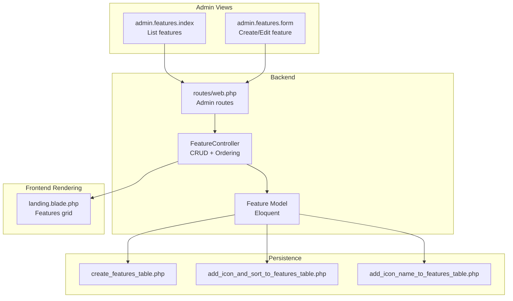
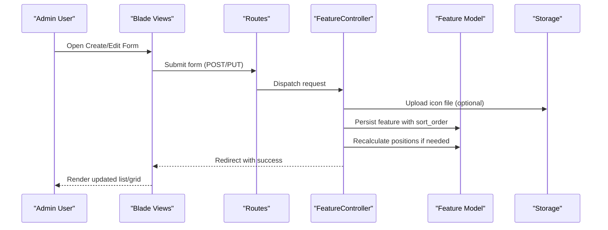
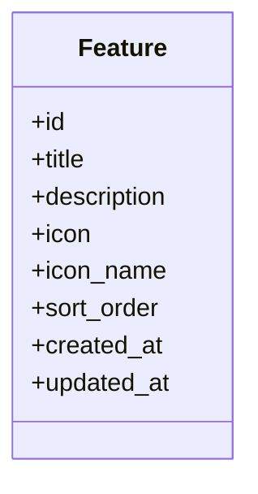
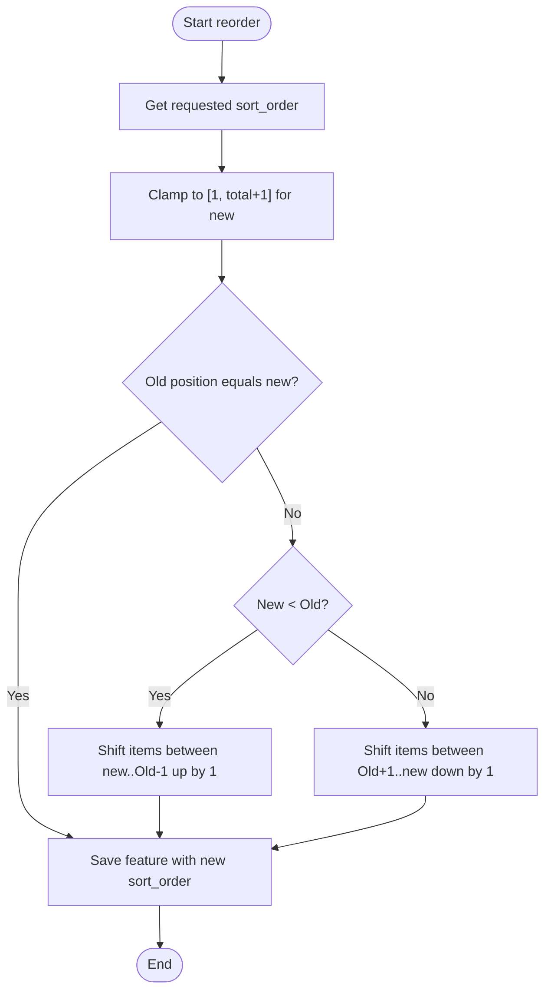
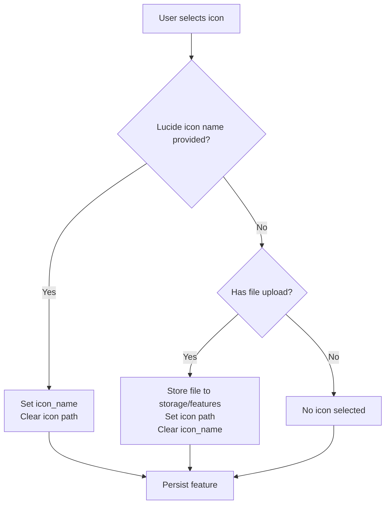
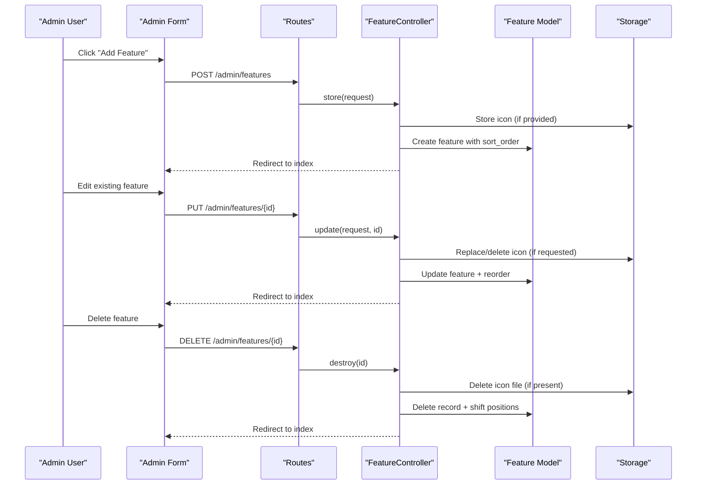
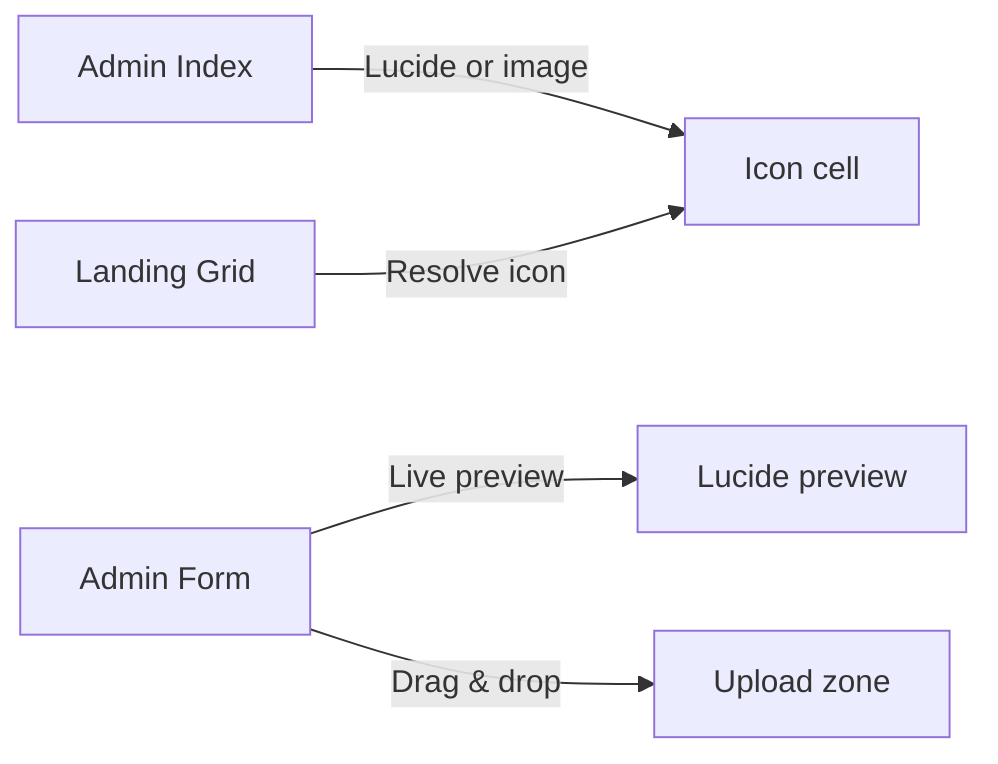
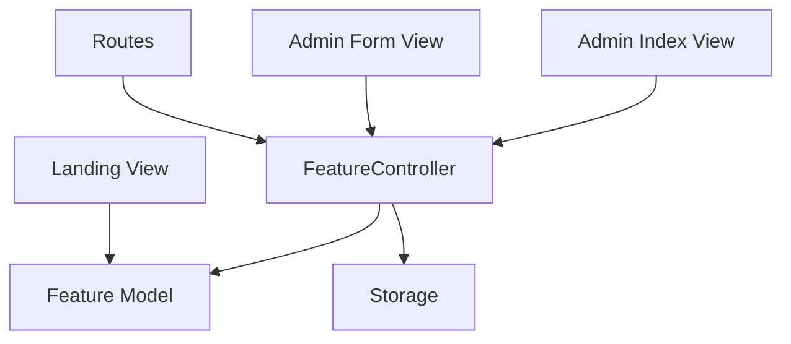

# Feature Management System

<cite>
**Referenced Files in This Document**
- [Feature.php](file://app/Models/Feature.php)
- [FeatureController.php](file://app/Http/Controllers/FeatureController.php)
- [create_features_table.php](file://database/migrations/2026_06_17_060200_create_features_table.php)
- [add_icon_and_sort_to_features_table.php](file://database/migrations/2026_06_17_073934_add_icon_and_sort_to_features_table.php)
- [add_icon_name_to_features_table.php](file://database/migrations/2026_06_18_060800_add_icon_name_to_features_table.php)
- [index.blade.php](file://resources/views/admin/features/index.blade.php)
- [form.blade.php](file://resources/views/admin/features/form.blade.php)
- [web.php](file://routes/web.php)
- [landing.blade.php](file://resources/views/landing.blade.php)
- [package.json](file://package.json)
</cite>

## Table of Contents
1. [Introduction](#introduction)
2. [Project Structure](#project-structure)
3. [Core Components](#core-components)
4. [Architecture Overview](#architecture-overview)
5. [Detailed Component Analysis](#detailed-component-analysis)
6. [Dependency Analysis](#dependency-analysis)
7. [Performance Considerations](#performance-considerations)
8. [Troubleshooting Guide](#troubleshooting-guide)
9. [Conclusion](#conclusion)

## Introduction
This document describes the Feature Management System for ClinicalLog CMS. It covers CRUD operations (create, read, update, delete), position-based ordering with automatic recalculation, Lucide icons integration, custom icon uploads, validation and persistence, and frontend rendering. It also outlines current capabilities and provides guidance for extending the system with bulk operations, categorization, and advanced search/filter features.

## Project Structure
The Feature Management System spans models, controllers, database migrations, Blade views, and routing. The system is organized by Laravel conventions:
- Models define the persisted entity and fillable attributes
- Controllers handle requests, enforce ordering logic, manage uploads, and coordinate persistence
- Migrations define the schema for features, including icon metadata and sort positions
- Blade views render the admin interface and landing page display
- Routes expose the admin CRUD endpoints and the landing page

**Diagram sources**
- [FeatureController.php:11-158](file://app/Http/Controllers/FeatureController.php#L11-L158)
- [Feature.php:7-16](file://app/Models/Feature.php#L7-L16)
- [create_features_table.php:14-23](file://database/migrations/2026_06_17_060200_create_features_table.php#L14-L23)
- [add_icon_and_sort_to_features_table.php:14-17](file://database/migrations/2026_06_17_073934_add_icon_and_sort_to_features_table.php#L14-L17)
- [add_icon_name_to_features_table.php:14-16](file://database/migrations/2026_06_18_060800_add_icon_name_to_features_table.php#L14-L16)
- [index.blade.php:19-106](file://resources/views/admin/features/index.blade.php#L19-L106)
- [form.blade.php:22-158](file://resources/views/admin/features/form.blade.php#L22-L158)
- [web.php:56-62](file://routes/web.php#L56-L62)
- [landing.blade.php:200-233](file://resources/views/landing.blade.php#L200-L233)

**Section sources**
- [FeatureController.php:11-158](file://app/Http/Controllers/FeatureController.php#L11-L158)
- [Feature.php:7-16](file://app/Models/Feature.php#L7-L16)
- [create_features_table.php:14-23](file://database/migrations/2026_06_17_060200_create_features_table.php#L14-L23)
- [add_icon_and_sort_to_features_table.php:14-17](file://database/migrations/2026_06_17_073934_add_icon_and_sort_to_features_table.php#L14-L17)
- [add_icon_name_to_features_table.php:14-16](file://database/migrations/2026_06_18_060800_add_icon_name_to_features_table.php#L14-L16)
- [index.blade.php:19-106](file://resources/views/admin/features/index.blade.php#L19-L106)
- [form.blade.php:22-158](file://resources/views/admin/features/form.blade.php#L22-L158)
- [web.php:56-62](file://routes/web.php#L56-L62)
- [landing.blade.php:200-233](file://resources/views/landing.blade.php#L200-L233)

## Core Components
- Feature model: Defines fillable attributes for title, description, icon path, Lucide icon name, and sort_order
- FeatureController: Implements CRUD, handles icon uploads/deletes, manages sort_order updates, and performs position clamping and shifting
- Admin views: Provide listing, creation/editing forms, and live previews for Lucide icons and uploads
- Landing page rendering: Displays features in sort_order sequence with icon resolution logic
- Routes: Expose admin endpoints for managing features

Key implementation references:
- Model fillable fields: [Feature.php:9-15](file://app/Models/Feature.php#L9-L15)
- Controller CRUD actions: [FeatureController.php:11-158](file://app/Http/Controllers/FeatureController.php#L11-L158)
- Admin listing view: [index.blade.php:19-106](file://resources/views/admin/features/index.blade.php#L19-L106)
- Admin form view: [form.blade.php:22-158](file://resources/views/admin/features/form.blade.php#L22-L158)
- Landing page features grid: [landing.blade.php:200-233](file://resources/views/landing.blade.php#L200-L233)
- Admin routes: [web.php:56-62](file://routes/web.php#L56-L62)

**Section sources**
- [Feature.php:7-16](file://app/Models/Feature.php#L7-L16)
- [FeatureController.php:11-158](file://app/Http/Controllers/FeatureController.php#L11-L158)
- [index.blade.php:19-106](file://resources/views/admin/features/index.blade.php#L19-L106)
- [form.blade.php:22-158](file://resources/views/admin/features/form.blade.php#L22-L158)
- [landing.blade.php:200-233](file://resources/views/landing.blade.php#L200-L233)
- [web.php:56-62](file://routes/web.php#L56-L62)

## Architecture Overview
The system follows a classic MVC pattern with explicit ordering logic in the controller and schema-driven persistence via migrations.

**Diagram sources**
- [FeatureController.php:24-57](file://app/Http/Controllers/FeatureController.php#L24-L57)
- [FeatureController.php:66-134](file://app/Http/Controllers/FeatureController.php#L66-L134)
- [FeatureController.php:136-156](file://app/Http/Controllers/FeatureController.php#L136-L156)
- [form.blade.php:23-29](file://resources/views/admin/features/form.blade.php#L23-L29)
- [web.php:56-62](file://routes/web.php#L56-L62)

## Detailed Component Analysis

### Feature Model
The Feature model defines the persisted entity and fillable attributes used by the controller during mass assignment.

**Diagram sources**
- [Feature.php:7-16](file://app/Models/Feature.php#L7-L16)

**Section sources**
- [Feature.php:7-16](file://app/Models/Feature.php#L7-L16)

### Position-Based Ordering System
The system maintains a continuous integer sort_order field and enforces clamped positions. When inserting or moving items, the controller shifts existing records to maintain uniqueness and continuity.

**Diagram sources**
- [FeatureController.php:34-54](file://app/Http/Controllers/FeatureController.php#L34-L54)
- [FeatureController.php:96-131](file://app/Http/Controllers/FeatureController.php#L96-L131)

**Section sources**
- [FeatureController.php:34-54](file://app/Http/Controllers/FeatureController.php#L34-L54)
- [FeatureController.php:96-131](file://app/Http/Controllers/FeatureController.php#L96-L131)

### Icon Management System
The system supports two icon sources:
- Lucide icon name: Stored in icon_name; rendered via data-lucide attributes on both admin and landing pages
- Custom icon upload: Stored as a path in icon; uploaded images are stored under storage/app/public/features and rendered as images

**Diagram sources**
- [FeatureController.php:26-32](file://app/Http/Controllers/FeatureController.php#L26-L32)
- [FeatureController.php:70-94](file://app/Http/Controllers/FeatureController.php#L70-L94)
- [form.blade.php:51-127](file://resources/views/admin/features/form.blade.php#L51-L127)
- [index.blade.php:39-55](file://resources/views/admin/features/index.blade.php#L39-L55)
- [landing.blade.php:214-224](file://resources/views/landing.blade.php#L214-L224)

**Section sources**
- [FeatureController.php:26-32](file://app/Http/Controllers/FeatureController.php#L26-L32)
- [FeatureController.php:70-94](file://app/Http/Controllers/FeatureController.php#L70-L94)
- [form.blade.php:51-127](file://resources/views/admin/features/form.blade.php#L51-L127)
- [index.blade.php:39-55](file://resources/views/admin/features/index.blade.php#L39-L55)
- [landing.blade.php:214-224](file://resources/views/landing.blade.php#L214-L224)

### CRUD Operations
- Create: Validates presence of title and description, resolves icon source, clamps sort_order, shifts existing items, persists feature
- Read: Lists features ordered by sort_order with pagination; landing page fetches all features ordered by sort_order
- Update: Handles icon updates (Lucide name, upload replacement, delete), recalculates positions, persists changes
- Delete: Removes feature and shifts subsequent items up by one

**Diagram sources**
- [FeatureController.php:24-57](file://app/Http/Controllers/FeatureController.php#L24-L57)
- [FeatureController.php:66-134](file://app/Http/Controllers/FeatureController.php#L66-L134)
- [FeatureController.php:136-156](file://app/Http/Controllers/FeatureController.php#L136-L156)
- [web.php:56-62](file://routes/web.php#L56-L62)

**Section sources**
- [FeatureController.php:24-57](file://app/Http/Controllers/FeatureController.php#L24-L57)
- [FeatureController.php:66-134](file://app/Http/Controllers/FeatureController.php#L66-L134)
- [FeatureController.php:136-156](file://app/Http/Controllers/FeatureController.php#L136-L156)
- [web.php:56-62](file://routes/web.php#L56-L62)

### Frontend Rendering
- Admin listing: Displays icon preview using Lucide or uploaded image, shows sort_order badge, and provides edit/delete actions
- Admin form: Provides Lucide icon name input with live preview and upload zone with drag-and-drop and file preview
- Landing page: Renders features grid in sort_order sequence, resolving icon source similarly

**Diagram sources**
- [index.blade.php:39-55](file://resources/views/admin/features/index.blade.php#L39-L55)
- [form.blade.php:51-127](file://resources/views/admin/features/form.blade.php#L51-L127)
- [landing.blade.php:214-224](file://resources/views/landing.blade.php#L214-L224)

**Section sources**
- [index.blade.php:19-106](file://resources/views/admin/features/index.blade.php#L19-L106)
- [form.blade.php:22-158](file://resources/views/admin/features/form.blade.php#L22-L158)
- [landing.blade.php:200-233](file://resources/views/landing.blade.php#L200-L233)

### Validation Rules and Data Persistence
- Required fields: title and description are required in the form
- Icon selection: Either icon_name (Lucide) or icon upload must be provided
- Persistence: Uses Eloquent mass assignment with fillable attributes defined in the model
- Sorting: Enforced via controller logic with clamping and cascading updates

References:
- Required fields in form: [form.blade.php:32-49](file://resources/views/admin/features/form.blade.php#L32-L49)
- Fillable attributes: [Feature.php:9-15](file://app/Models/Feature.php#L9-L15)
- Ordering logic: [FeatureController.php:34-54](file://app/Http/Controllers/FeatureController.php#L34-L54), [FeatureController.php:96-131](file://app/Http/Controllers/FeatureController.php#L96-L131)

**Section sources**
- [form.blade.php:32-49](file://resources/views/admin/features/form.blade.php#L32-L49)
- [Feature.php:9-15](file://app/Models/Feature.php#L9-L15)
- [FeatureController.php:34-54](file://app/Http/Controllers/FeatureController.php#L34-L54)
- [FeatureController.php:96-131](file://app/Http/Controllers/FeatureController.php#L96-L131)

### Search and Filtering
- Current implementation: No dedicated search or filter UI for features
- Recommendation: Add a search bar and optional category filter in the admin index view; apply where clauses on the query builder in the controller’s index method

[No sources needed since this section provides general guidance]

### Bulk Operations
- Current implementation: No bulk actions (e.g., bulk delete, bulk reorder)
- Recommendation: Introduce batch endpoints in the controller and corresponding UI controls in the admin index view to select multiple items and perform operations

[No sources needed since this section provides general guidance]

### Feature Categorization
- Current implementation: No categories for features
- Recommendation: Add a category field to the migration and model, and extend the admin form and listing to support categorization and filtering

[No sources needed since this section provides general guidance]

### Drag-and-Drop Reordering
- Current implementation: Uses numeric sort_order input with clamping and automatic shifting
- Recommendation: Implement drag-and-drop reordering via JavaScript and AJAX endpoints to update sort_order without page reloads

[No sources needed since this section provides general guidance]

## Dependency Analysis
The Feature Management System depends on:
- Laravel Eloquent ORM for persistence
- Laravel Storage for file uploads
- Blade templates for rendering
- Lucide icons library for icon rendering

**Diagram sources**
- [FeatureController.php:5-7](file://app/Http/Controllers/FeatureController.php#L5-L7)
- [Feature.php:5-6](file://app/Models/Feature.php#L5-L6)
- [index.blade.php:1-1](file://resources/views/admin/features/index.blade.php#L1-L1)
- [form.blade.php:1-1](file://resources/views/admin/features/form.blade.php#L1-L1)
- [landing.blade.php:1-1](file://resources/views/landing.blade.php#L1-L1)
- [web.php:6-7](file://routes/web.php#L6-L7)

**Section sources**
- [FeatureController.php:5-7](file://app/Http/Controllers/FeatureController.php#L5-L7)
- [Feature.php:5-6](file://app/Models/Feature.php#L5-L6)
- [index.blade.php:1-1](file://resources/views/admin/features/index.blade.php#L1-L1)
- [form.blade.php:1-1](file://resources/views/admin/features/form.blade.php#L1-L1)
- [landing.blade.php:1-1](file://resources/views/landing.blade.php#L1-L1)
- [web.php:6-7](file://routes/web.php#L6-L7)

## Performance Considerations
- Ordering operations: Each reorder triggers multiple updates; consider batching updates or using atomic operations for large datasets
- Image uploads: Validate file types and sizes server-side; limit concurrent uploads
- Pagination: Listing uses pagination; ensure appropriate page sizes for admin usability

[No sources needed since this section provides general guidance]

## Troubleshooting Guide
- Icon not displaying:
  - Verify icon_name exists in Lucide registry or icon file path is valid
  - Check storage permissions for public disk
- Sort order anomalies:
  - Ensure sort_order is an integer and within bounds
  - Confirm clamping logic is applied on create/update
- Upload issues:
  - Confirm file type and size limits
  - Verify storage/app/public is linked to public storage

**Section sources**
- [FeatureController.php:70-94](file://app/Http/Controllers/FeatureController.php#L70-L94)
- [FeatureController.php:96-131](file://app/Http/Controllers/FeatureController.php#L96-L131)
- [form.blade.php:110-127](file://resources/views/admin/features/form.blade.php#L110-L127)

## Conclusion
The Feature Management System provides a robust foundation for managing feature entries with Lucide icon integration and position-based ordering. The controller enforces data integrity through clamping and cascading updates, while the views deliver a clear admin experience and accurate landing page rendering. Extending the system with search/filter, bulk operations, categorization, and drag-and-drop reordering would further enhance usability and scalability.