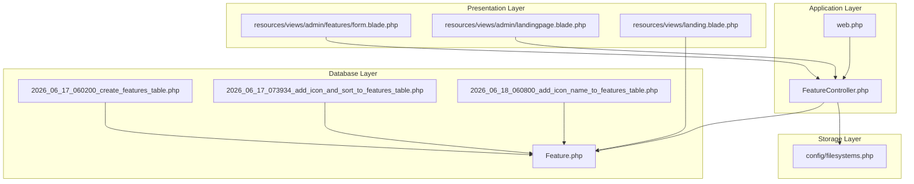
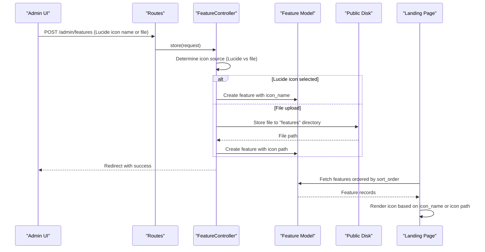
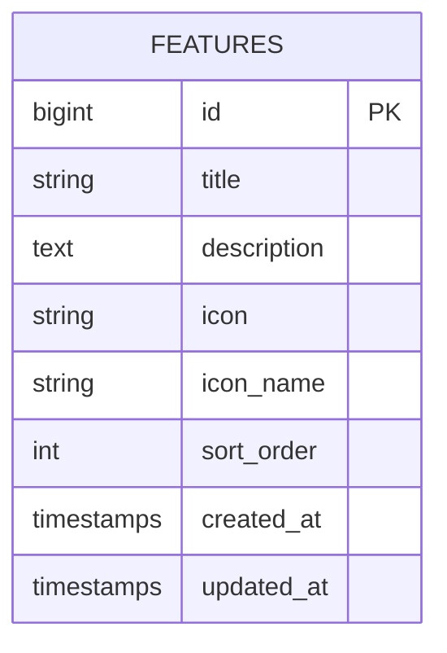
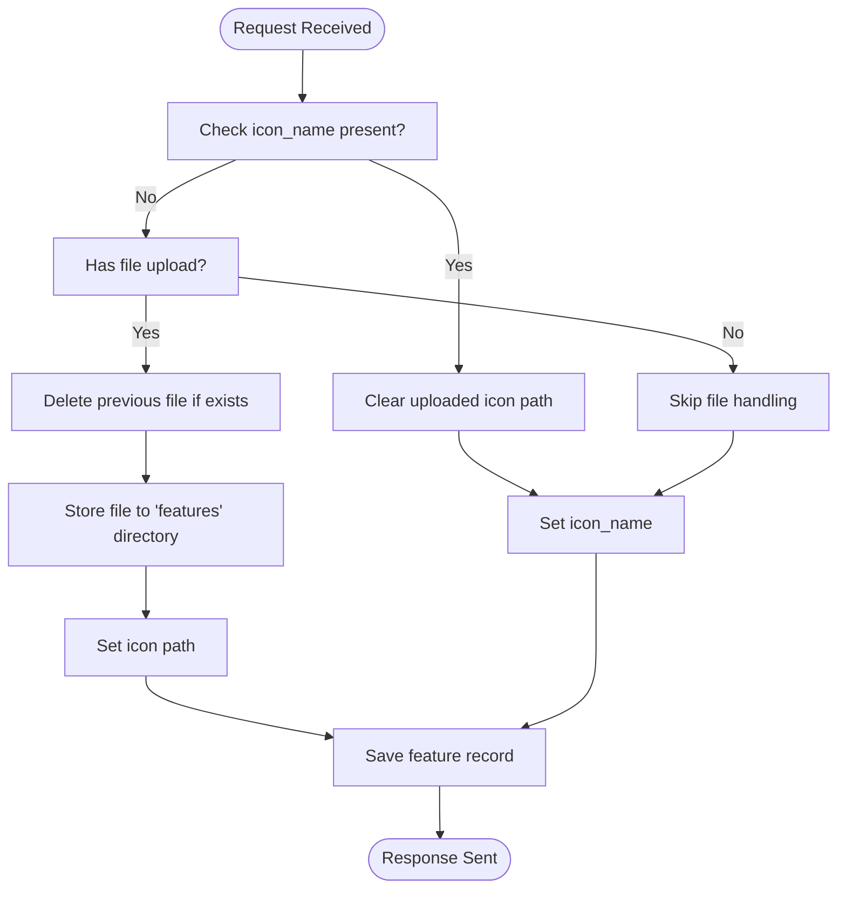
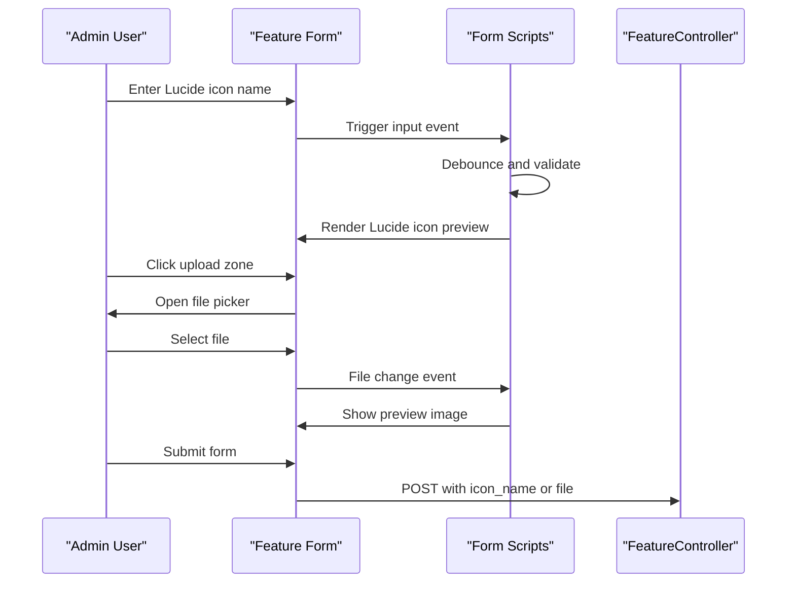
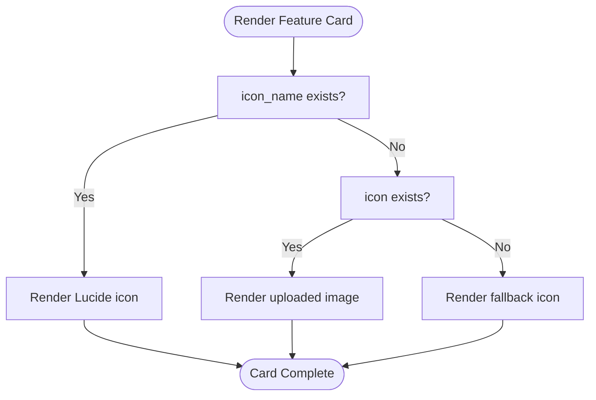
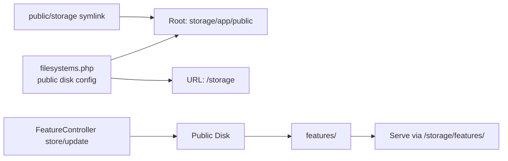
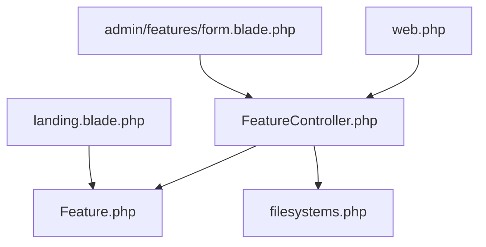

# Icon Management System

<cite>
**Referenced Files in This Document**
- [Feature.php](file://app/Models/Feature.php)
- [2026_06_17_060200_create_features_table.php](file://database/migrations/2026_06_17_060200_create_features_table.php)
- [2026_06_17_073934_add_icon_and_sort_to_features_table.php](file://database/migrations/2026_06_17_073934_add_icon_and_sort_to_features_table.php)
- [2026_06_18_060800_add_icon_name_to_features_table.php](file://database/migrations/2026_06_18_060800_add_icon_name_to_features_table.php)
- [FeatureController.php](file://app/Http/Controllers/FeatureController.php)
- [form.blade.php](file://resources/views/admin/features/form.blade.php)
- [landingpage.blade.php](file://resources/views/admin/landingpage.blade.php)
- [filesystems.php](file://config/filesystems.php)
- [web.php](file://routes/web.php)
- [landing.blade.php](file://resources/views/landing.blade.php)
</cite>

## Table of Contents
1. [Introduction](#introduction)
2. [Project Structure](#project-structure)
3. [Core Components](#core-components)
4. [Architecture Overview](#architecture-overview)
5. [Detailed Component Analysis](#detailed-component-analysis)
6. [Dependency Analysis](#dependency-analysis)
7. [Performance Considerations](#performance-considerations)
8. [Troubleshooting Guide](#troubleshooting-guide)
9. [Conclusion](#conclusion)

## Introduction
This document describes the dual icon management system used in the feature management module. The system supports two distinct icon sources:
- Lucide icons: server-side rendering via the Lucide icon library for crisp SVG delivery
- Uploaded images: file-based uploads stored on the filesystem with automatic cleanup

The system integrates seamlessly with Laravel's Eloquent ORM, routing, and Blade templating to provide a flexible and efficient icon management solution for the landing page features.

## Project Structure
The icon management spans several layers:
- Database schema with nullable icon fields and sort ordering
- Eloquent model with fillable attributes for icon-related fields
- Controller logic for storing, updating, replacing, and deleting icons
- Frontend forms for Lucide icon selection and file upload previews
- Public asset serving via Laravel's filesystem configuration

**Diagram sources**
- [2026_06_17_060200_create_features_table.php:1-34](file://database/migrations/2026_06_17_060200_create_features_table.php#L1-L34)
- [2026_06_17_073934_add_icon_and_sort_to_features_table.php:1-30](file://database/migrations/2026_06_17_073934_add_icon_and_sort_to_features_table.php#L1-L30)
- [2026_06_18_060800_add_icon_name_to_features_table.php:1-29](file://database/migrations/2026_06_18_060800_add_icon_name_to_features_table.php#L1-L29)
- [Feature.php:1-17](file://app/Models/Feature.php#L1-L17)
- [web.php:56-62](file://routes/web.php#L56-L62)
- [FeatureController.php:1-156](file://app/Http/Controllers/FeatureController.php#L1-L156)
- [form.blade.php:1-298](file://resources/views/admin/features/form.blade.php#L1-L298)
- [landingpage.blade.php:401-517](file://resources/views/admin/landingpage.blade.php#L401-L517)
- [landing.blade.php:210-233](file://resources/views/landing.blade.php#L210-L233)
- [filesystems.php:1-81](file://config/filesystems.php#L1-L81)

**Section sources**
- [Feature.php:1-17](file://app/Models/Feature.php#L1-L17)
- [2026_06_17_060200_create_features_table.php:1-34](file://database/migrations/2026_06_17_060200_create_features_table.php#L1-L34)
- [2026_06_17_073934_add_icon_and_sort_to_features_table.php:1-30](file://database/migrations/2026_06_17_073934_add_icon_and_sort_to_features_table.php#L1-L30)
- [2026_06_18_060800_add_icon_name_to_features_table.php:1-29](file://database/migrations/2026_06_18_060800_add_icon_name_to_features_table.php#L1-L29)
- [FeatureController.php:1-156](file://app/Http/Controllers/FeatureController.php#L1-L156)
- [form.blade.php:1-298](file://resources/views/admin/features/form.blade.php#L1-L298)
- [landingpage.blade.php:401-517](file://resources/views/admin/landingpage.blade.php#L401-L517)
- [landing.blade.php:210-233](file://resources/views/landing.blade.php#L210-L233)
- [filesystems.php:1-81](file://config/filesystems.php#L1-L81)
- [web.php:56-62](file://routes/web.php#L56-L62)

## Core Components
- Database schema: The features table includes:
  - icon: nullable string for uploaded file paths
  - icon_name: nullable string for Lucide icon names
  - sort_order: integer with default 0 for ordering
- Eloquent model: Fillable attributes include icon, icon_name, and sort_order
- Controller logic: Handles icon selection precedence, file storage, deletion, and sorting updates
- Frontend forms: Provide Lucide icon name input with live preview and file upload zone with drag-and-drop support
- Public asset serving: Uses Laravel's public disk with storage symlink for serving uploaded files

Key implementation references:
- [Feature.php:9-15](file://app/Models/Feature.php#L9-L15)
- [2026_06_17_073934_add_icon_and_sort_to_features_table.php:14-16](file://database/migrations/2026_06_17_073934_add_icon_and_sort_to_features_table.php#L14-L16)
- [2026_06_18_060800_add_icon_name_to_features_table.php:14-15](file://database/migrations/2026_06_18_060800_add_icon_name_to_features_table.php#L14-L15)
- [FeatureController.php:22-54](file://app/Http/Controllers/FeatureController.php#L22-L54)
- [form.blade.php:51-127](file://resources/views/admin/features/form.blade.php#L51-L127)
- [filesystems.php:41-48](file://config/filesystems.php#L41-L48)

**Section sources**
- [Feature.php:9-15](file://app/Models/Feature.php#L9-L15)
- [2026_06_17_073934_add_icon_and_sort_to_features_table.php:14-16](file://database/migrations/2026_06_17_073934_add_icon_and_sort_to_features_table.php#L14-L16)
- [2026_06_18_060800_add_icon_name_to_features_table.php:14-15](file://database/migrations/2026_06_18_060800_add_icon_name_to_features_table.php#L14-L15)
- [FeatureController.php:22-54](file://app/Http/Controllers/FeatureController.php#L22-L54)
- [form.blade.php:51-127](file://resources/views/admin/features/form.blade.php#L51-L127)
- [filesystems.php:41-48](file://config/filesystems.php#L41-L48)

## Architecture Overview
The icon management system follows a layered architecture:
- Data persistence: Eloquent model with nullable icon fields and sort ordering
- Business logic: Controller methods handle icon selection, storage, replacement, and cleanup
- Presentation: Blade templates render Lucide icons server-side and uploaded images client-side
- Storage: Public disk configuration enables file serving via storage symlink

**Diagram sources**
- [web.php:56-62](file://routes/web.php#L56-L62)
- [FeatureController.php:22-54](file://app/Http/Controllers/FeatureController.php#L22-L54)
- [Feature.php:9-15](file://app/Models/Feature.php#L9-L15)
- [landing.blade.php:210-233](file://resources/views/landing.blade.php#L210-L233)

## Detailed Component Analysis

### Database Schema and Model
The features table schema supports dual icon sources:
- icon: stores the uploaded file path under the public disk
- icon_name: stores the Lucide icon name for server-side rendering
- sort_order: integer for ordering features on the landing page

**Diagram sources**
- [2026_06_17_060200_create_features_table.php:14-22](file://database/migrations/2026_06_17_060200_create_features_table.php#L14-L22)
- [2026_06_17_073934_add_icon_and_sort_to_features_table.php:14-16](file://database/migrations/2026_06_17_073934_add_icon_and_sort_to_features_table.php#L14-L16)
- [2026_06_18_060800_add_icon_name_to_features_table.php:14-15](file://database/migrations/2026_06_18_060800_add_icon_name_to_features_table.php#L14-L15)

**Section sources**
- [2026_06_17_060200_create_features_table.php:14-22](file://database/migrations/2026_06_17_060200_create_features_table.php#L14-L22)
- [2026_06_17_073934_add_icon_and_sort_to_features_table.php:14-16](file://database/migrations/2026_06_17_073934_add_icon_and_sort_to_features_table.php#L14-L16)
- [2026_06_18_060800_add_icon_name_to_features_table.php:14-15](file://database/migrations/2026_06_18_060800_add_icon_name_to_features_table.php#L14-L15)
- [Feature.php:9-15](file://app/Models/Feature.php#L9-L15)

### Controller Logic: Icon Selection and Storage
The controller implements the dual icon workflow:
- Precedence: If icon_name is provided, uploaded icon is cleared and vice versa
- File upload: Stored under the "features" directory on the public disk
- Replacement: Previous file is deleted when replaced
- Deletion: Explicit delete flag clears both icon and icon_name
- Sorting: Maintains sort_order integrity during creation, updates, and deletions

**Diagram sources**
- [FeatureController.php:22-54](file://app/Http/Controllers/FeatureController.php#L22-L54)
- [FeatureController.php:64-132](file://app/Http/Controllers/FeatureController.php#L64-L132)
- [FeatureController.php:134-154](file://app/Http/Controllers/FeatureController.php#L134-L154)

**Section sources**
- [FeatureController.php:22-54](file://app/Http/Controllers/FeatureController.php#L22-L54)
- [FeatureController.php:64-132](file://app/Http/Controllers/FeatureController.php#L64-L132)
- [FeatureController.php:134-154](file://app/Http/Controllers/FeatureController.php#L134-L154)

### Frontend Forms: Lucide Icon Input and File Upload
The admin form provides:
- Lucide icon name input with live preview using Lucide CDN
- File upload zone with drag-and-drop and preview
- Conditional logic: if icon_name is set, file upload is ignored
- Delete option for uploaded icons

**Diagram sources**
- [form.blade.php:51-127](file://resources/views/admin/features/form.blade.php#L51-L127)
- [form.blade.php:235-298](file://resources/views/admin/features/form.blade.php#L235-L298)

**Section sources**
- [form.blade.php:51-127](file://resources/views/admin/features/form.blade.php#L51-L127)
- [form.blade.php:235-298](file://resources/views/admin/features/form.blade.php#L235-L298)

### Frontend Display: Rendering Icons on Landing Page
The landing page renders icons based on availability:
- If icon_name exists: server-side Lucide icon rendering
- Else if icon exists: uploaded image served via asset helper
- Otherwise: fallback icon

**Diagram sources**
- [landing.blade.php:210-233](file://resources/views/landing.blade.php#L210-L233)

**Section sources**
- [landing.blade.php:210-233](file://resources/views/landing.blade.php#L210-L233)

### Storage Configuration and Public Asset Serving
The system uses Laravel's public disk:
- Disk configuration defines root path and URL for public assets
- Storage symlink maps public/storage to storage/app/public
- Uploaded files are stored under the "features" directory on the public disk

**Diagram sources**
- [filesystems.php:41-48](file://config/filesystems.php#L41-L48)
- [FeatureController.php](file://app/Http/Controllers/FeatureController.php#L29)
- [FeatureController.php](file://app/Http/Controllers/FeatureController.php#L81)

**Section sources**
- [filesystems.php:41-48](file://config/filesystems.php#L41-L48)
- [FeatureController.php](file://app/Http/Controllers/FeatureController.php#L29)
- [FeatureController.php](file://app/Http/Controllers/FeatureController.php#L81)

## Dependency Analysis
The icon management system exhibits clear separation of concerns:
- Routes define the entry points for feature CRUD operations
- Controller depends on the Feature model and Storage facade
- Views depend on the Feature model and Lucide CDN for rendering
- Storage configuration affects file serving and cleanup

**Diagram sources**
- [web.php:56-62](file://routes/web.php#L56-L62)
- [FeatureController.php:1-156](file://app/Http/Controllers/FeatureController.php#L1-L156)
- [Feature.php:1-17](file://app/Models/Feature.php#L1-L17)
- [filesystems.php:1-81](file://config/filesystems.php#L1-L81)
- [form.blade.php:1-298](file://resources/views/admin/features/form.blade.php#L1-L298)
- [landing.blade.php:210-233](file://resources/views/landing.blade.php#L210-L233)

**Section sources**
- [web.php:56-62](file://routes/web.php#L56-L62)
- [FeatureController.php:1-156](file://app/Http/Controllers/FeatureController.php#L1-L156)
- [Feature.php:1-17](file://app/Models/Feature.php#L1-L17)
- [filesystems.php:1-81](file://config/filesystems.php#L1-L81)
- [form.blade.php:1-298](file://resources/views/admin/features/form.blade.php#L1-L298)
- [landing.blade.php:210-233](file://resources/views/landing.blade.php#L210-L233)

## Performance Considerations
- Lucide icons: Server-side rendering eliminates client-side JavaScript overhead and reduces bundle size
- File uploads: Store under dedicated "features" directory for easier management and cleanup
- Sorting updates: Minimize database writes by batching updates during reorder operations
- Asset serving: Use public disk with proper caching headers for uploaded images

## Troubleshooting Guide
Common issues and resolutions:
- Invalid file types: Ensure only accepted MIME types are processed
- File size limits: Respect maximum file size constraints
- Cleanup failures: Verify storage permissions and disk configuration
- Sorting anomalies: Confirm sort_order updates occur before rendering

Validation and error handling references:
- File upload validation occurs in the controller during store and update operations
- Error messages are surfaced in the admin form via Blade error blocks
- Storage exceptions are handled by the Storage facade configuration

**Section sources**
- [FeatureController.php:22-54](file://app/Http/Controllers/FeatureController.php#L22-L54)
- [FeatureController.php:64-132](file://app/Http/Controllers/FeatureController.php#L64-L132)
- [form.blade.php:123-126](file://resources/views/admin/features/form.blade.php#L123-L126)

## Conclusion
The dual icon management system provides a robust, flexible solution for feature icons:
- Lucide icons offer scalable, vector graphics with minimal bandwidth
- Uploaded images enable custom branding while maintaining clean storage management
- The controller enforces precedence rules, handles replacements, and maintains sort order
- The frontend integrates seamlessly with Lucide CDN and public asset serving

This architecture balances developer productivity with performance and maintainability, supporting both rapid prototyping and production-scale deployments.