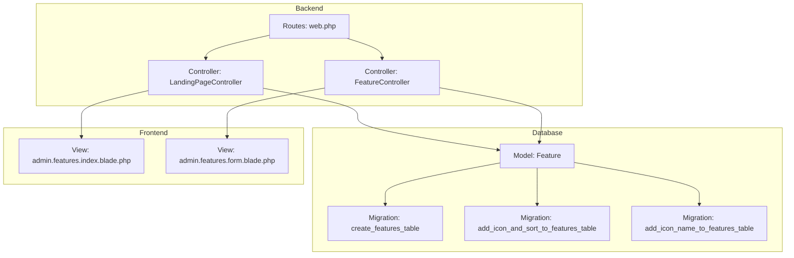
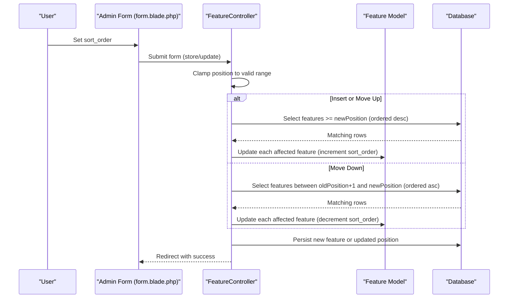
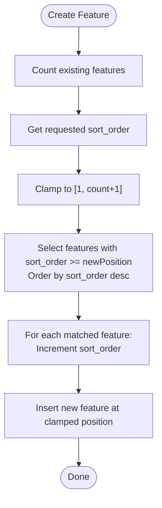
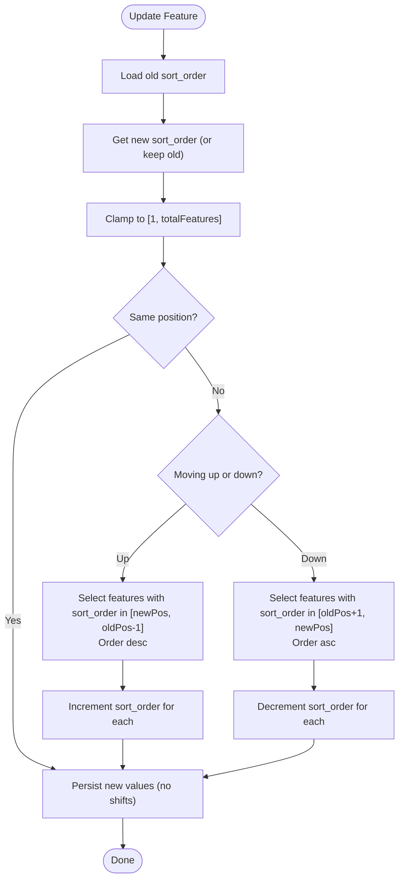
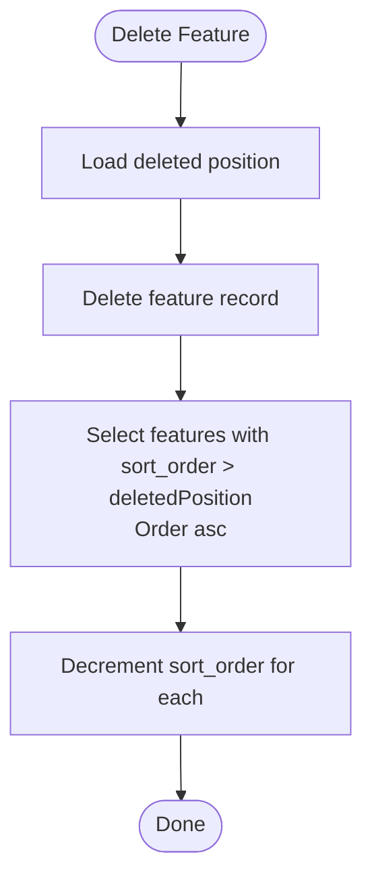
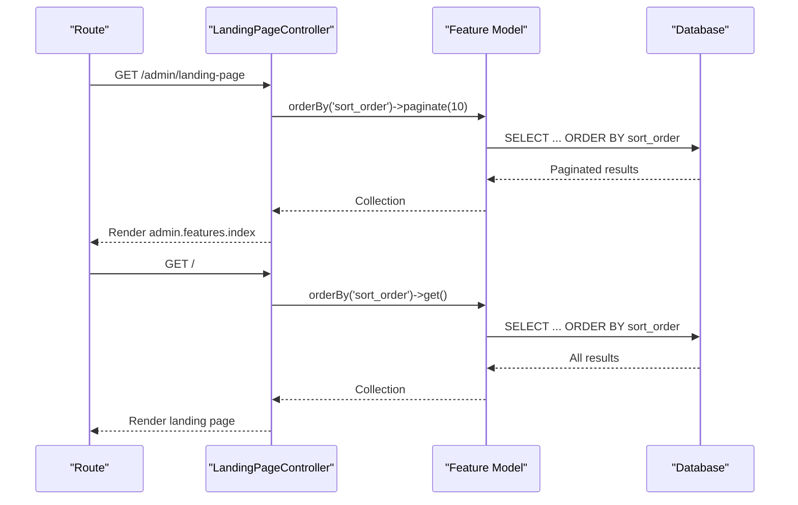
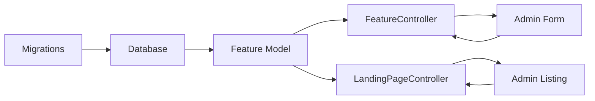

# Position and Sorting System

<cite>
**Referenced Files in This Document**
- [Feature.php](file://app/Models/Feature.php)
- [FeatureController.php](file://app/Http/Controllers/FeatureController.php)
- [LandingPageController.php](file://app/Http/Controllers/LandingPageController.php)
- [2026_06_17_073934_add_icon_and_sort_to_features_table.php](file://database/migrations/2026_06_17_073934_add_icon_and_sort_to_features_table.php)
- [2026_06_17_060200_create_features_table.php](file://database/migrations/2026_06_17_060200_create_features_table.php)
- [2026_06_18_060800_add_icon_name_to_features_table.php](file://database/migrations/2026_06_18_060800_add_icon_name_to_features_table.php)
- [web.php](file://routes/web.php)
- [index.blade.php](file://resources/views/admin/features/index.blade.php)
- [form.blade.php](file://resources/views/admin/features/form.blade.php)
</cite>

## Table of Contents
1. [Introduction](#introduction)
2. [Project Structure](#project-structure)
3. [Core Components](#core-components)
4. [Architecture Overview](#architecture-overview)
5. [Detailed Component Analysis](#detailed-component-analysis)
6. [Dependency Analysis](#dependency-analysis)
7. [Performance Considerations](#performance-considerations)
8. [Troubleshooting Guide](#troubleshooting-guide)
9. [Conclusion](#conclusion)

## Introduction
This document explains the position-based sorting system used in the Feature Management System. It covers the sort_order field implementation, automatic position calculation, position clamping logic, and the complex reordering mechanisms for moving features up and down. It also documents the database queries used for position updates, the orderBy('sort_order') pagination, and the impact of position changes on other features. Edge cases such as inserting at position 1, appending to the end, and bulk-like position updates are addressed, along with performance considerations and transaction handling during sorting operations.

## Project Structure
The sorting system spans three main areas:
- Database schema with the sort_order column
- Backend controller logic for creating, updating, and deleting features with position-aware operations
- Frontend views that render features ordered by sort_order and allow users to set positions

**Diagram sources**
- [web.php:19-77](file://routes/web.php#L19-L77)
- [LandingPageController.php:11-17](file://app/Http/Controllers/LandingPageController.php#L11-L17)
- [FeatureController.php:9-156](file://app/Http/Controllers/FeatureController.php#L9-L156)
- [Feature.php:7-16](file://app/Models/Feature.php#L7-L16)
- [2026_06_17_060200_create_features_table.php:14-23](file://database/migrations/2026_06_17_060200_create_features_table.php#L14-L23)
- [2026_06_17_073934_add_icon_and_sort_to_features_table.php:14-17](file://database/migrations/2026_06_17_073934_add_icon_and_sort_to_features_table.php#L14-L17)
- [2026_06_18_060800_add_icon_name_to_features_table.php:14-16](file://database/migrations/2026_06_18_060800_add_icon_name_to_features_table.php#L14-L16)
- [index.blade.php:18-106](file://resources/views/admin/features/index.blade.php#L18-L106)
- [form.blade.php:129-146](file://resources/views/admin/features/form.blade.php#L129-L146)

**Section sources**
- [web.php:19-77](file://routes/web.php#L19-L77)
- [LandingPageController.php:11-17](file://app/Http/Controllers/LandingPageController.php#L11-L17)
- [FeatureController.php:9-156](file://app/Http/Controllers/FeatureController.php#L9-L156)
- [Feature.php:7-16](file://app/Models/Feature.php#L7-L16)
- [2026_06_17_060200_create_features_table.php:14-23](file://database/migrations/2026_06_17_060200_create_features_table.php#L14-L23)
- [2026_06_17_073934_add_icon_and_sort_to_features_table.php:14-17](file://database/migrations/2026_06_17_073934_add_icon_and_sort_to_features_table.php#L14-L17)
- [2026_06_18_060800_add_icon_name_to_features_table.php:14-16](file://database/migrations/2026_06_18_060800_add_icon_name_to_features_table.php#L14-L16)
- [index.blade.php:18-106](file://resources/views/admin/features/index.blade.php#L18-L106)
- [form.blade.php:129-146](file://resources/views/admin/features/form.blade.php#L129-L146)

## Core Components
- Database schema: The features table includes sort_order as an integer with a default value. Icon-related columns support both Lucide icon names and uploaded images.
- Model: The Feature model defines fillable attributes including sort_order.
- Controllers:
  - FeatureController handles creation, update, and deletion with position-aware logic.
  - LandingPageController retrieves features ordered by sort_order for display.
- Views:
  - Admin feature listing displays sort_order and supports pagination.
  - Admin feature form allows setting sort_order with clamped bounds.

Key implementation references:
- sort_order column definition and defaults
- Automatic position clamping and shifting logic
- orderBy('sort_order') retrieval and pagination
- Impact of insertions, updates, and deletions on other features

**Section sources**
- [2026_06_17_073934_add_icon_and_sort_to_features_table.php:14-17](file://database/migrations/2026_06_17_073934_add_icon_and_sort_to_features_table.php#L14-L17)
- [Feature.php:9-15](file://app/Models/Feature.php#L9-L15)
- [FeatureController.php:22-55](file://app/Http/Controllers/FeatureController.php#L22-L55)
- [FeatureController.php:64-132](file://app/Http/Controllers/FeatureController.php#L64-L132)
- [FeatureController.php:134-154](file://app/Http/Controllers/FeatureController.php#L134-L154)
- [LandingPageController.php:11-17](file://app/Http/Controllers/LandingPageController.php#L11-L17)
- [index.blade.php:31-82](file://resources/views/admin/features/index.blade.php#L31-L82)
- [form.blade.php:129-146](file://resources/views/admin/features/form.blade.php#L129-L146)

## Architecture Overview
The sorting system follows a straightforward pattern:
- Users set or change sort_order via the admin form.
- The backend clamps the requested position to valid bounds.
- Depending on whether the move is upward or downward, adjacent features are shifted accordingly.
- Features are retrieved from the database ordered by sort_order for display.

**Diagram sources**
- [form.blade.php:129-146](file://resources/views/admin/features/form.blade.php#L129-L146)
- [FeatureController.php:22-55](file://app/Http/Controllers/FeatureController.php#L22-L55)
- [FeatureController.php:64-132](file://app/Http/Controllers/FeatureController.php#L64-L132)

## Detailed Component Analysis

### Database Schema and Field Definition
- The features table includes sort_order as an integer with a default value.
- Additional columns support icons via either Lucide icon names or uploaded images.
- The initial features table lacks sort_order; it is added later via migration.

Implementation highlights:
- Column presence and defaults
- Migration sequence ensuring backward compatibility

**Section sources**
- [2026_06_17_073934_add_icon_and_sort_to_features_table.php:14-17](file://database/migrations/2026_06_17_073934_add_icon_and_sort_to_features_table.php#L14-L17)
- [2026_06_17_060200_create_features_table.php:14-23](file://database/migrations/2026_06_17_060200_create_features_table.php#L14-L23)
- [2026_06_18_060800_add_icon_name_to_features_table.php:14-16](file://database/migrations/2026_06_18_060800_add_icon_name_to_features_table.php#L14-L16)

### Model Definition
- The Feature model declares fillable attributes including sort_order, enabling mass assignment for position updates.

**Section sources**
- [Feature.php:9-15](file://app/Models/Feature.php#L9-L15)

### Creation Workflow with Automatic Position Calculation
When creating a new feature:
- The system counts existing features to compute valid insertion bounds.
- The requested sort_order is clamped to [1, totalFeatures + 1].
- All features at or after the new position are shifted down by incrementing their sort_order.
- The new feature is inserted at the clamped position.

**Diagram sources**
- [FeatureController.php:22-55](file://app/Http/Controllers/FeatureController.php#L22-L55)

**Section sources**
- [FeatureController.php:22-55](file://app/Http/Controllers/FeatureController.php#L22-L55)

### Update Workflow: Moving Features Up and Down
When updating an existing feature:
- The system determines old and new positions and clamps the new position to [1, totalFeatures].
- If moving up (newPosition < oldPosition):
  - Select features between newPosition and oldPosition - 1 (inclusive), excluding the moving feature itself.
  - Order by sort_order descending and increment their sort_order.
- If moving down (newPosition > oldPosition):
  - Select features between oldPosition + 1 and newPosition (inclusive), excluding the moving feature.
  - Order by sort_order ascending and decrement their sort_order.
- Finally, persist the updated position.

**Diagram sources**
- [FeatureController.php:64-132](file://app/Http/Controllers/FeatureController.php#L64-L132)

**Section sources**
- [FeatureController.php:64-132](file://app/Http/Controllers/FeatureController.php#L64-L132)

### Deletion Workflow and Position Shifting
When deleting a feature:
- The system removes the feature record.
- All features positioned after the deleted position are shifted up by decrementing their sort_order.

**Diagram sources**
- [FeatureController.php:134-154](file://app/Http/Controllers/FeatureController.php#L134-L154)

**Section sources**
- [FeatureController.php:134-154](file://app/Http/Controllers/FeatureController.php#L134-L154)

### Display and Pagination with orderBy('sort_order')
- Features are retrieved ordered by sort_order for both paginated admin listing and public landing page rendering.
- The admin listing uses pagination; the public home route fetches all features.

**Diagram sources**
- [LandingPageController.php:11-17](file://app/Http/Controllers/LandingPageController.php#L11-L17)
- [web.php:19-24](file://routes/web.php#L19-L24)

**Section sources**
- [LandingPageController.php:11-17](file://app/Http/Controllers/LandingPageController.php#L11-L17)
- [web.php:19-24](file://routes/web.php#L19-L24)

### Frontend Integration and User Experience
- The admin form dynamically computes the maximum allowed position and sets a default insertion position.
- The admin listing displays sort_order prominently and supports pagination controls.

**Section sources**
- [form.blade.php:129-146](file://resources/views/admin/features/form.blade.php#L129-L146)
- [index.blade.php:31-82](file://resources/views/admin/features/index.blade.php#L31-L82)

## Dependency Analysis
The sorting system depends on:
- Database migrations defining sort_order and related columns
- Feature model allowing mass assignment of sort_order
- FeatureController implementing position clamping and shifting logic
- LandingPageController retrieving features ordered by sort_order
- Views rendering positions and enabling user-driven ordering

**Diagram sources**
- [2026_06_17_073934_add_icon_and_sort_to_features_table.php:14-17](file://database/migrations/2026_06_17_073934_add_icon_and_sort_to_features_table.php#L14-L17)
- [Feature.php:9-15](file://app/Models/Feature.php#L9-L15)
- [FeatureController.php:22-55](file://app/Http/Controllers/FeatureController.php#L22-L55)
- [FeatureController.php:64-132](file://app/Http/Controllers/FeatureController.php#L64-L132)
- [FeatureController.php:134-154](file://app/Http/Controllers/FeatureController.php#L134-L154)
- [LandingPageController.php:11-17](file://app/Http/Controllers/LandingPageController.php#L11-L17)
- [index.blade.php:31-82](file://resources/views/admin/features/index.blade.php#L31-L82)
- [form.blade.php:129-146](file://resources/views/admin/features/form.blade.php#L129-L146)

**Section sources**
- [FeatureController.php:22-55](file://app/Http/Controllers/FeatureController.php#L22-L55)
- [FeatureController.php:64-132](file://app/Http/Controllers/FeatureController.php#L64-L132)
- [FeatureController.php:134-154](file://app/Http/Controllers/FeatureController.php#L134-L154)
- [LandingPageController.php:11-17](file://app/Http/Controllers/LandingPageController.php#L11-L17)
- [index.blade.php:31-82](file://resources/views/admin/features/index.blade.php#L31-L82)
- [form.blade.php:129-146](file://resources/views/admin/features/form.blade.php#L129-L146)

## Performance Considerations
- Current implementation performs per-row updates using each loops after query selection. This scales linearly with the number of affected rows.
- For frequent reordering operations, consider:
  - Batch updates to minimize round-trips
  - Single atomic UPDATE with CASE/WHEN expressions to avoid row-by-row iteration
  - Indexing on sort_order to optimize ORDER BY and WHERE clauses
  - Using transactions to ensure consistency during multi-step reorder operations
- Pagination uses a fixed page size in admin listings; large reorder operations still trigger multiple individual updates.

[No sources needed since this section provides general guidance]

## Troubleshooting Guide
Common issues and resolutions:
- Duplicate positions after bulk operations: Ensure clamping and shifting occur in the correct order and that the moving feature is excluded from intermediate selections.
- Gaps in positions after deletions: The deletion handler decrements positions after the deleted slot; verify that no stale references remain.
- Unexpected ordering on frontend: Confirm that queries consistently use orderBy('sort_order') and that cached views are cleared if necessary.
- Transaction safety: Wrap reorder operations in database transactions to prevent inconsistent states during partial failures.

**Section sources**
- [FeatureController.php:94-121](file://app/Http/Controllers/FeatureController.php#L94-L121)
- [FeatureController.php:146-151](file://app/Http/Controllers/FeatureController.php#L146-L151)

## Conclusion
The Feature Management System’s position-based sorting relies on a robust, predictable mechanism:
- sort_order is the single source of truth for ordering
- Clamping ensures positions remain valid
- Upward and downward moves trigger targeted shifts to maintain uniqueness
- Queries consistently order by sort_order for both admin and public views
- The current implementation is clear and functional but can benefit from batched updates and transactional safety for improved performance and reliability under frequent reordering.