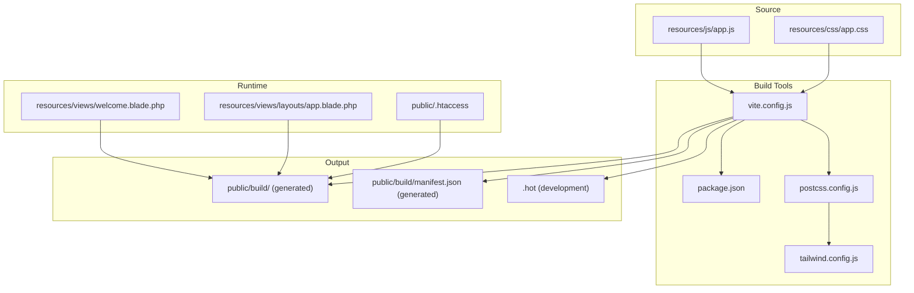
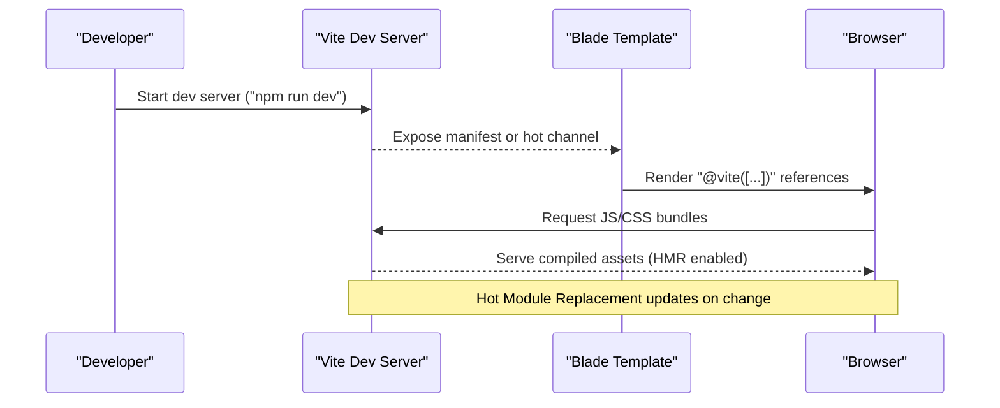
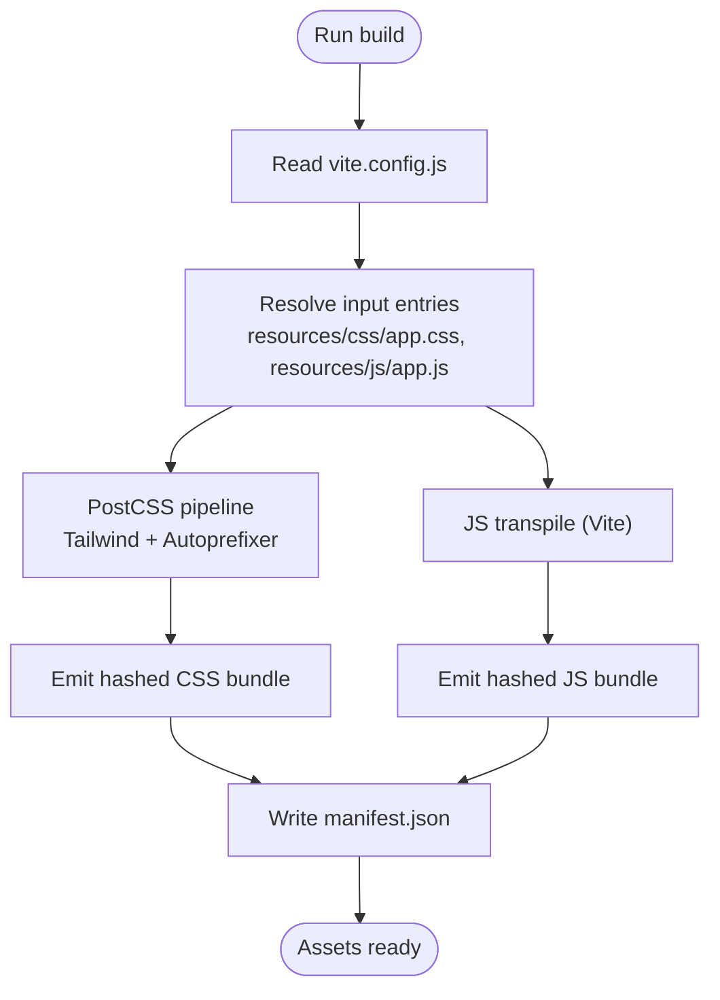
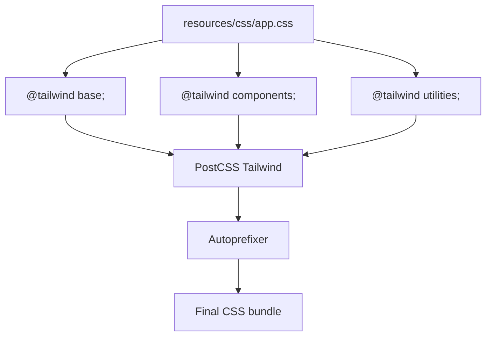
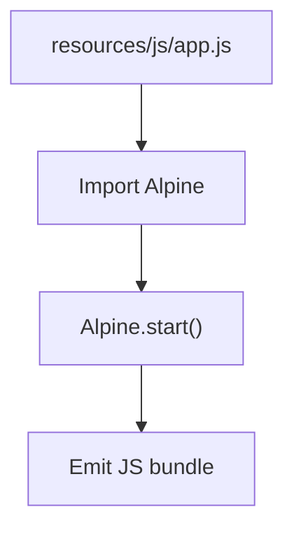
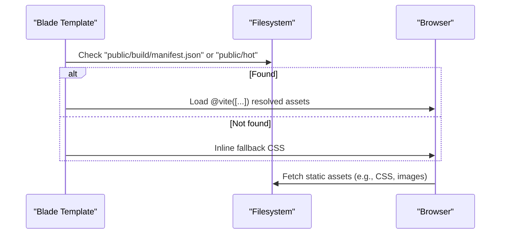
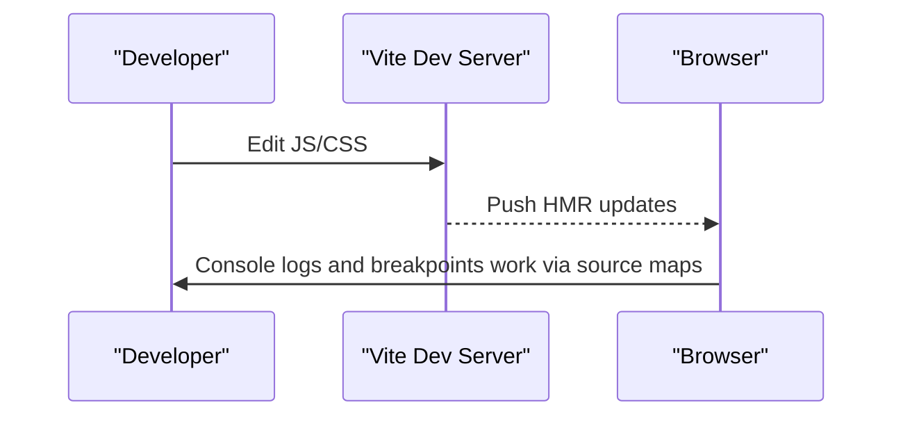
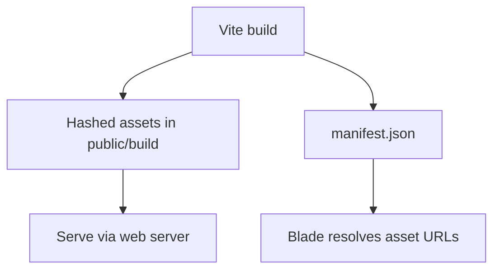
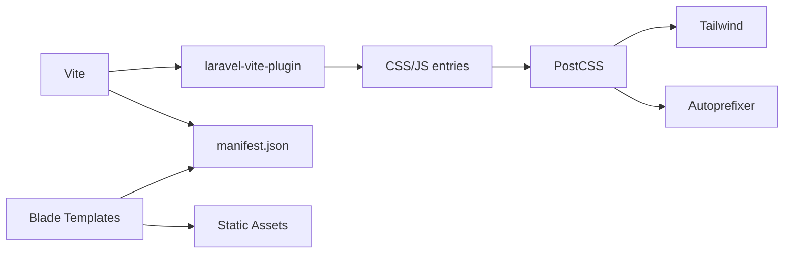

# Asset Management

<cite>
**Referenced Files in This Document**
- [vite.config.js](file://vite.config.js)
- [package.json](file://package.json)
- [postcss.config.js](file://postcss.config.js)
- [tailwind.config.js](file://tailwind.config.js)
- [resources/js/app.js](file://resources/js/app.js)
- [resources/css/app.css](file://resources/css/app.css)
- [resources/views/welcome.blade.php](file://resources/views/welcome.blade.php)
- [resources/views/layouts/app.blade.php](file://resources/views/layouts/app.blade.php)
- [public/.htaccess](file://public/.htaccess)
- [config/app.php](file://config/app.php)
- [config/filesystems.php](file://config/filesystems.php)
- [bootstrap/app.php](file://bootstrap/app.php)
</cite>

## Table of Contents
1. [Introduction](#introduction)
2. [Project Structure](#project-structure)
3. [Core Components](#core-components)
4. [Architecture Overview](#architecture-overview)
5. [Detailed Component Analysis](#detailed-component-analysis)
6. [Dependency Analysis](#dependency-analysis)
7. [Performance Considerations](#performance-considerations)
8. [Troubleshooting Guide](#troubleshooting-guide)
9. [Conclusion](#conclusion)

## Introduction
This document explains the asset management system for the ClinicalLog CMS. It covers Vite configuration for asset compilation, development server setup, and production optimization. It also documents the build pipeline (CSS preprocessing, JavaScript transpilation), asset fingerprinting and cache busting, asset serving strategy, CDN integration possibilities, development workflow (hot module replacement, source maps, debugging), and production deployment considerations including caching and monitoring.

## Project Structure
The asset pipeline centers around Vite with Laravel’s Vite plugin, Tailwind CSS via PostCSS, and Blade templates that conditionally load compiled assets or fallback styles.

**Diagram sources**
- [vite.config.js:1-12](file://vite.config.js#L1-L12)
- [package.json:1-21](file://package.json#L1-L21)
- [postcss.config.js:1-7](file://postcss.config.js#L1-L7)
- [tailwind.config.js:1-22](file://tailwind.config.js#L1-L22)
- [resources/js/app.js:1-8](file://resources/js/app.js#L1-L8)
- [resources/css/app.css:1-3](file://resources/css/app.css#L1-L3)
- [resources/views/welcome.blade.php:13-14](file://resources/views/welcome.blade.php#L13-L14)
- [resources/views/layouts/app.blade.php:16](file://resources/views/layouts/app.blade.php#L16)
- [public/.htaccess:1-25](file://public/.htaccess#L1-L25)

**Section sources**
- [vite.config.js:1-12](file://vite.config.js#L1-L12)
- [package.json:1-21](file://package.json#L1-L21)
- [postcss.config.js:1-7](file://postcss.config.js#L1-L7)
- [tailwind.config.js:1-22](file://tailwind.config.js#L1-L22)
- [resources/js/app.js:1-8](file://resources/js/app.js#L1-L8)
- [resources/css/app.css:1-3](file://resources/css/app.css#L1-L3)
- [resources/views/welcome.blade.php:13-14](file://resources/views/welcome.blade.php#L13-L14)
- [resources/views/layouts/app.blade.php:16](file://resources/views/layouts/app.blade.php#L16)
- [public/.htaccess:1-25](file://public/.htaccess#L1-L25)

## Core Components
- Vite configuration defines the Laravel plugin, entry points, and dev-time hot module replacement.
- Tailwind CSS is wired through PostCSS with a dedicated Tailwind plugin and autoprefixer.
- Blade templates dynamically choose between Vite-managed assets and a fallback stylesheet when Vite is not available.
- Public server configuration handles routing and asset delivery.

Key implementation references:
- Vite plugin and entries: [vite.config.js:5-10](file://vite.config.js#L5-L10)
- Build scripts: [package.json:5-8](file://package.json#L5-L8)
- PostCSS pipeline: [postcss.config.js:1-6](file://postcss.config.js#L1-L6)
- Tailwind configuration: [tailwind.config.js:6-21](file://tailwind.config.js#L6-L21)
- JavaScript entry: [resources/js/app.js:3-7](file://resources/js/app.js#L3-L7)
- CSS entry: [resources/css/app.css:1-3](file://resources/css/app.css#L1-L3)
- Blade asset selection: [resources/views/welcome.blade.php:13-14](file://resources/views/welcome.blade.php#L13-L14), [resources/views/layouts/app.blade.php:16](file://resources/views/layouts/app.blade.php#L16)
- Public rewrite rules: [public/.htaccess:21-24](file://public/.htaccess#L21-L24)

**Section sources**
- [vite.config.js:1-12](file://vite.config.js#L1-L12)
- [package.json:1-21](file://package.json#L1-L21)
- [postcss.config.js:1-7](file://postcss.config.js#L1-L7)
- [tailwind.config.js:1-22](file://tailwind.config.js#L1-L22)
- [resources/js/app.js:1-8](file://resources/js/app.js#L1-L8)
- [resources/css/app.css:1-3](file://resources/css/app.css#L1-L3)
- [resources/views/welcome.blade.php:13-14](file://resources/views/welcome.blade.php#L13-L14)
- [resources/views/layouts/app.blade.php:16](file://resources/views/layouts/app.blade.php#L16)
- [public/.htaccess:1-25](file://public/.htaccess#L1-L25)

## Architecture Overview
The asset architecture integrates Vite with Laravel Blade. During development, Vite serves assets and injects a hot channel. In production, Vite emits hashed filenames and a manifest consumed by Blade to resolve assets.

**Diagram sources**
- [vite.config.js:5-10](file://vite.config.js#L5-L10)
- [resources/views/welcome.blade.php:13-14](file://resources/views/welcome.blade.php#L13-L14)

**Section sources**
- [vite.config.js:1-12](file://vite.config.js#L1-L12)
- [resources/views/welcome.blade.php:13-14](file://resources/views/welcome.blade.php#L13-L14)

## Detailed Component Analysis

### Vite Configuration and Build Pipeline
- Plugin: Laravel Vite plugin registers entries and enables dev-time refresh.
- Entries: CSS and JS entries are declared for bundling.
- Output: Vite writes hashed assets and a manifest into public/build during production builds.

**Diagram sources**
- [vite.config.js:5-10](file://vite.config.js#L5-L10)
- [postcss.config.js:1-6](file://postcss.config.js#L1-L6)
- [tailwind.config.js:6-21](file://tailwind.config.js#L6-L21)
- [resources/js/app.js:3-7](file://resources/js/app.js#L3-L7)
- [resources/css/app.css:1-3](file://resources/css/app.css#L1-L3)

**Section sources**
- [vite.config.js:1-12](file://vite.config.js#L1-L12)
- [postcss.config.js:1-7](file://postcss.config.js#L1-L7)
- [tailwind.config.js:1-22](file://tailwind.config.js#L1-L22)
- [resources/js/app.js:1-8](file://resources/js/app.js#L1-L8)
- [resources/css/app.css:1-3](file://resources/css/app.css#L1-L3)

### CSS Preprocessing and Tailwind Integration
- Tailwind directives are imported in the CSS entry.
- Tailwind scans Blade templates and vendor views for class usage.
- PostCSS runs Tailwind and autoprefixer to produce optimized CSS.

**Diagram sources**
- [resources/css/app.css:1-3](file://resources/css/app.css#L1-L3)
- [postcss.config.js:1-6](file://postcss.config.js#L1-L6)
- [tailwind.config.js:6-21](file://tailwind.config.js#L6-L21)

**Section sources**
- [resources/css/app.css:1-3](file://resources/css/app.css#L1-L3)
- [postcss.config.js:1-7](file://postcss.config.js#L1-L7)
- [tailwind.config.js:1-22](file://tailwind.config.js#L1-L22)

### JavaScript Transpilation and Alpine Integration
- The JS entry imports Alpine and starts it globally.
- Vite transpiles modern JS to browser-compatible code as part of the build process.

**Diagram sources**
- [resources/js/app.js:3-7](file://resources/js/app.js#L3-L7)

**Section sources**
- [resources/js/app.js:1-8](file://resources/js/app.js#L1-L8)

### Asset Serving Strategy and Blade Integration
- Blade templates check for the presence of Vite’s manifest or hot channel to decide whether to load compiled assets via @vite or fall back to a prebuilt stylesheet.
- Static assets referenced in layouts (e.g., CSS and images) are served directly from public.

**Diagram sources**
- [resources/views/welcome.blade.php:13-14](file://resources/views/welcome.blade.php#L13-L14)
- [resources/views/layouts/app.blade.php:16](file://resources/views/layouts/app.blade.php#L16)

**Section sources**
- [resources/views/welcome.blade.php:13-14](file://resources/views/welcome.blade.php#L13-L14)
- [resources/views/layouts/app.blade.php:16](file://resources/views/layouts/app.blade.php#L16)

### Development Workflow (HMR, Source Maps, Debugging)
- Hot Module Replacement: Enabled via the Laravel Vite plugin in dev mode.
- Source maps: Controlled by Vite defaults; adjust build options in vite.config.js if needed.
- Debugging: Use browser devtools to inspect network requests and source maps; Alpine debugging is available through global window access.

**Diagram sources**
- [vite.config.js:5-10](file://vite.config.js#L5-L10)

**Section sources**
- [vite.config.js:1-12](file://vite.config.js#L1-L12)

### Production Optimization and Asset Fingerprinting
- Hashed filenames: Vite emits hashed assets and a manifest for cache busting.
- Manifest consumption: Blade resolves asset URLs using the manifest.
- Static assets: Additional static assets under public are served as-is.

**Diagram sources**
- [resources/views/welcome.blade.php:13-14](file://resources/views/welcome.blade.php#L13-L14)
- [public/.htaccess:21-24](file://public/.htaccess#L21-L24)

**Section sources**
- [resources/views/welcome.blade.php:13-14](file://resources/views/welcome.blade.php#L13-L14)
- [public/.htaccess:1-25](file://public/.htaccess#L1-L25)

### CDN Integration Possibilities
- Configure APP_URL to a CDN domain in environment settings to serve assets from CDN origins.
- Ensure proper CORS and TLS for CDN-hosted assets.
- Keep local public directory synchronized with generated assets for fallback.

[No sources needed since this section provides general guidance]

## Dependency Analysis
The asset pipeline depends on Vite, the Laravel Vite plugin, Tailwind CSS, and PostCSS. Blade templates depend on the presence of Vite artifacts to resolve assets.

**Diagram sources**
- [vite.config.js:5-10](file://vite.config.js#L5-L10)
- [postcss.config.js:1-6](file://postcss.config.js#L1-L6)
- [tailwind.config.js:6-21](file://tailwind.config.js#L6-L21)
- [resources/views/welcome.blade.php:13-14](file://resources/views/welcome.blade.php#L13-L14)

**Section sources**
- [vite.config.js:1-12](file://vite.config.js#L1-L12)
- [postcss.config.js:1-7](file://postcss.config.js#L1-L7)
- [tailwind.config.js:1-22](file://tailwind.config.js#L1-L22)
- [resources/views/welcome.blade.php:13-14](file://resources/views/welcome.blade.php#L13-L14)

## Performance Considerations
- Enable long-term caching for hashed assets and short caching for the manifest.
- Use HTTP/2 or HTTP/3 with server push for critical assets.
- Compress assets with gzip or Brotli.
- Minimize render-blocking CSS; defer non-critical CSS.
- Monitor First Contentful Paint (FCP), Largest Contentful Paint (LCP), and Total Blocking Time (TBT) for asset delivery performance.

[No sources needed since this section provides general guidance]

## Troubleshooting Guide
- Missing manifest or hot channel: Blade falls back to a prebuilt stylesheet. Ensure Vite is running in development or build artifacts exist in production.
- Incorrect asset URLs: Verify APP_URL and that public/.htaccess rewrites reach index.php.
- Tailwind classes not applied: Confirm Tailwind scanning globs include your views and that PostCSS runs during build.

**Section sources**
- [resources/views/welcome.blade.php:13-14](file://resources/views/welcome.blade.php#L13-L14)
- [public/.htaccess:21-24](file://public/.htaccess#L21-L24)
- [tailwind.config.js:6-21](file://tailwind.config.js#L6-L21)

## Conclusion
The ClinicalLog CMS leverages Vite with the Laravel plugin for a streamlined asset pipeline. Tailwind CSS and PostCSS handle CSS preprocessing, while Blade templates adapt to development and production environments. By aligning server configuration, manifest usage, and CDN settings, teams can achieve fast, reliable asset delivery with robust caching and observability.