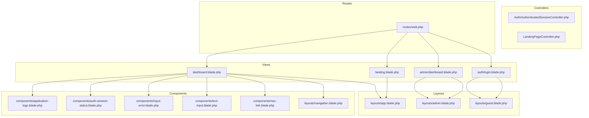
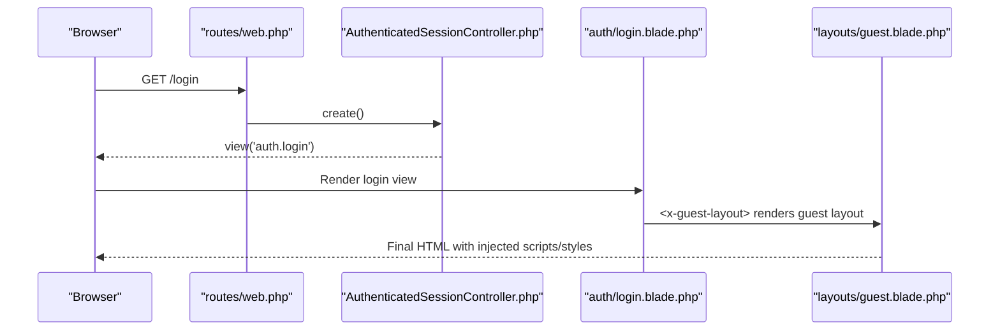
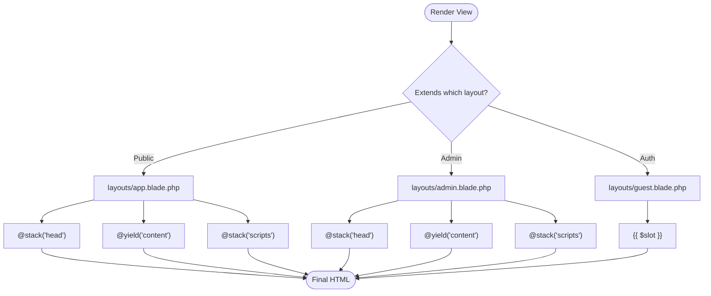
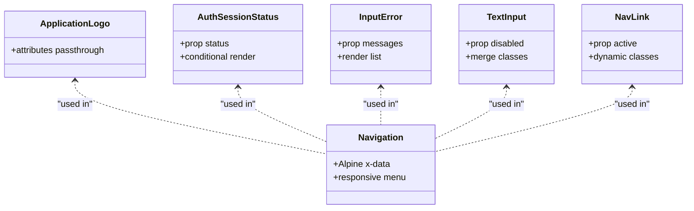
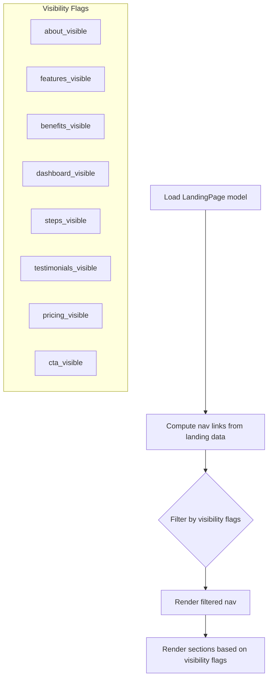
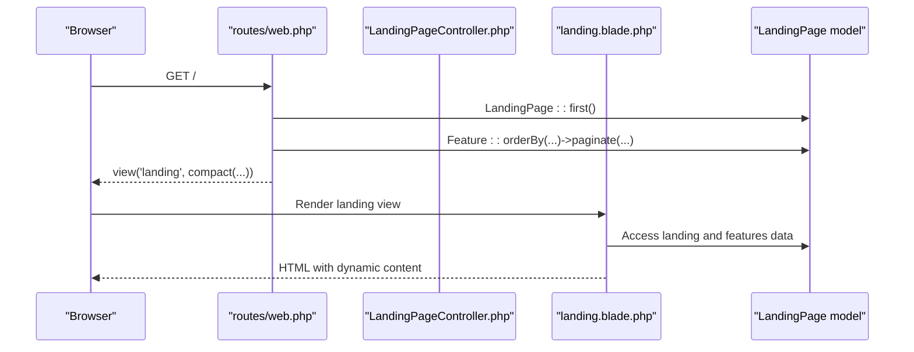
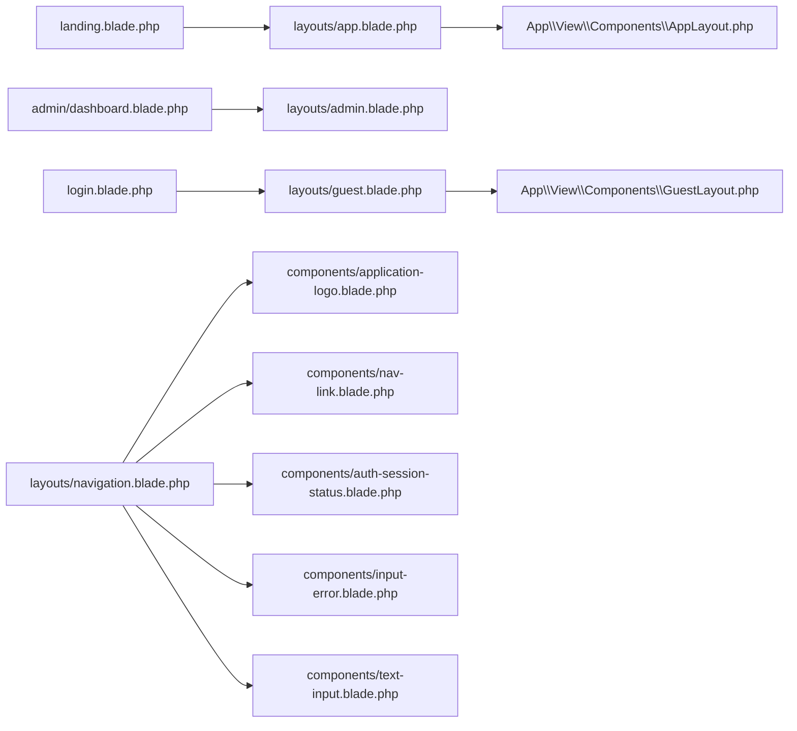

# Blade Templating System

<cite>
**Referenced Files in This Document**
- [app.blade.php](file://resources/views/layouts/app.blade.php)
- [admin.blade.php](file://resources/views/layouts/admin.blade.php)
- [guest.blade.php](file://resources/views/layouts/guest.blade.php)
- [AppLayout.php](file://app/View/Components/AppLayout.php)
- [GuestLayout.php](file://app/View/Components/GuestLayout.php)
- [application-logo.blade.php](file://resources/views/components/application-logo.blade.php)
- [auth-session-status.blade.php](file://resources/views/components/auth-session-status.blade.php)
- [input-error.blade.php](file://resources/views/components/input-error.blade.php)
- [text-input.blade.php](file://resources/views/components/text-input.blade.php)
- [nav-link.blade.php](file://resources/views/components/nav-link.blade.php)
- [navigation.blade.php](file://resources/views/layouts/navigation.blade.php)
- [dashboard.blade.php](file://resources/views/dashboard.blade.php)
- [landing.blade.php](file://resources/views/landing.blade.php)
- [admin/dashboard.blade.php](file://resources/views/admin/dashboard.blade.php)
- [login.blade.php](file://resources/views/auth/login.blade.php)
- [AuthenticatedSessionController.php](file://app/Http/Controllers/Auth/AuthenticatedSessionController.php)
- [LandingPageController.php](file://app/Http/Controllers/LandingPageController.php)
- [web.php](file://routes/web.php)
</cite>

## Table of Contents
1. [Introduction](#introduction)
2. [Project Structure](#project-structure)
3. [Core Components](#core-components)
4. [Architecture Overview](#architecture-overview)
5. [Detailed Component Analysis](#detailed-component-analysis)
6. [Dependency Analysis](#dependency-analysis)
7. [Performance Considerations](#performance-considerations)
8. [Troubleshooting Guide](#troubleshooting-guide)
9. [Conclusion](#conclusion)

## Introduction
This document explains the Blade templating system used in ClinicalLog CMS. It covers the layout inheritance pattern with three master templates—app.blade.php for public pages, admin.blade.php for administrative sections, and guest.blade.php for authentication pages—alongside a component-based approach using Blade components such as application-logo, auth-session-status, input-error, and form elements. It also documents the section-based content management system using @yield directives and @stack functionality for dynamic content injection, and conditional rendering based on landing page configurations. Practical examples demonstrate layout composition, component usage patterns, and data binding between controllers and views. Finally, it addresses integration with Laravel’s view factory system and caching mechanisms.

## Project Structure
The templating system is organized around:
- Layouts: Master templates under resources/views/layouts/
- Components: Reusable UI elements under resources/views/components/
- Views: Page-specific views under resources/views/ grouped by domain (auth, admin, profile, etc.)
- Controllers: Pass data to views and orchestrate rendering
- Routes: Define endpoints that return views with data

**Diagram sources**
- [app.blade.php:1-397](file://resources/views/layouts/app.blade.php#L1-L397)
- [admin.blade.php:1-150](file://resources/views/layouts/admin.blade.php#L1-L150)
- [guest.blade.php:1-31](file://resources/views/layouts/guest.blade.php#L1-L31)
- [application-logo.blade.php:1-4](file://resources/views/components/application-logo.blade.php#L1-L4)
- [auth-session-status.blade.php:1-8](file://resources/views/components/auth-session-status.blade.php#L1-L8)
- [input-error.blade.php:1-10](file://resources/views/components/input-error.blade.php#L1-L10)
- [text-input.blade.php:1-4](file://resources/views/components/text-input.blade.php#L1-L4)
- [nav-link.blade.php:1-12](file://resources/views/components/nav-link.blade.php#L1-L12)
- [navigation.blade.php:1-101](file://resources/views/layouts/navigation.blade.php#L1-L101)
- [landing.blade.php:1-597](file://resources/views/landing.blade.php#L1-L597)
- [dashboard.blade.php:1-18](file://resources/views/dashboard.blade.php#L1-L18)
- [admin/dashboard.blade.php:1-128](file://resources/views/admin/dashboard.blade.php#L1-L128)
- [login.blade.php:1-94](file://resources/views/auth/login.blade.php#L1-L94)
- [AuthenticatedSessionController.php:1-48](file://app/Http/Controllers/Auth/AuthenticatedSessionController.php#L1-L48)
- [LandingPageController.php:1-224](file://app/Http/Controllers/LandingPageController.php#L1-L224)
- [web.php:1-77](file://routes/web.php#L1-L77)

**Section sources**
- [app.blade.php:1-397](file://resources/views/layouts/app.blade.php#L1-L397)
- [admin.blade.php:1-150](file://resources/views/layouts/admin.blade.php#L1-L150)
- [guest.blade.php:1-31](file://resources/views/layouts/guest.blade.php#L1-L31)
- [web.php:1-77](file://routes/web.php#L1-L77)

## Core Components
- Layout inheritance:
  - Public pages extend app.blade.php and define @section('title') and @section('content').
  - Administrative pages extend admin.blade.php and define @section('title') and @section('content').
  - Authentication pages extend guest.blade.php and use the slot mechanism via <x-guest-layout>.
- Blade components:
  - application-logo: SVG logo component with attributes passthrough.
  - auth-session-status: Conditional status message display.
  - input-error: Renders validation errors as a list.
  - text-input: Reusable input field with disabled prop and merged classes.
  - nav-link: Active-state-aware navigation link.
  - navigation: Alpine-driven responsive navigation bar.
- Dynamic content injection:
  - @stack('head') and @stack('scripts') enable per-view head/script additions.
  - @yield('content') defines the main content area for each layout.
- Conditional rendering:
  - Sections visibility controlled by landing page configuration flags (e.g., about_visible, features_visible, dashboard_visible, etc.).

Practical usage patterns:
- Layout composition:
  - Public pages: @extends('layouts.app') with @section('title') and @section('content').
  - Admin pages: @extends('layouts.admin') with @section('title') and @section('content').
  - Auth pages: <x-guest-layout> with $slot for page content.
- Component usage:
  - <x-application-logo>, <x-auth-session-status>, <x-input-error>, <x-text-input>, <x-nav-link>, and <x-dropdown> variants used within views and layouts.
- Data binding:
  - Controllers pass model instances and paginated collections to views via compact() and route closures.

**Section sources**
- [app.blade.php:1-397](file://resources/views/layouts/app.blade.php#L1-L397)
- [admin.blade.php:1-150](file://resources/views/layouts/admin.blade.php#L1-L150)
- [guest.blade.php:1-31](file://resources/views/layouts/guest.blade.php#L1-L31)
- [application-logo.blade.php:1-4](file://resources/views/components/application-logo.blade.php#L1-L4)
- [auth-session-status.blade.php:1-8](file://resources/views/components/auth-session-status.blade.php#L1-L8)
- [input-error.blade.php:1-10](file://resources/views/components/input-error.blade.php#L1-L10)
- [text-input.blade.php:1-4](file://resources/views/components/text-input.blade.php#L1-L4)
- [nav-link.blade.php:1-12](file://resources/views/components/nav-link.blade.php#L1-L12)
- [navigation.blade.php:1-101](file://resources/views/layouts/navigation.blade.php#L1-L101)
- [dashboard.blade.php:1-18](file://resources/views/dashboard.blade.php#L1-L18)
- [landing.blade.php:1-597](file://resources/views/landing.blade.php#L1-L597)
- [admin/dashboard.blade.php:1-128](file://resources/views/admin/dashboard.blade.php#L1-L128)
- [login.blade.php:1-94](file://resources/views/auth/login.blade.php#L1-L94)
- [AuthenticatedSessionController.php:1-48](file://app/Http/Controllers/Auth/AuthenticatedSessionController.php#L1-L48)
- [LandingPageController.php:1-224](file://app/Http/Controllers/LandingPageController.php#L1-L224)

## Architecture Overview
The templating architecture follows Laravel conventions:
- Routes return views with data.
- Views extend layouts and optionally use Blade components.
- Controllers handle business logic and prepare data for views.
- Layouts define global structure and placeholders for content and scripts.

**Diagram sources**
- [web.php:1-77](file://routes/web.php#L1-L77)
- [AuthenticatedSessionController.php:1-48](file://app/Http/Controllers/Auth/AuthenticatedSessionController.php#L1-L48)
- [login.blade.php:1-94](file://resources/views/auth/login.blade.php#L1-L94)
- [guest.blade.php:1-31](file://resources/views/layouts/guest.blade.php#L1-L31)

## Detailed Component Analysis

### Layout Inheritance and Content Management
- app.blade.php:
  - Defines global head (fonts, styles, meta), navigation with dynamic links and CTA, main content area via @yield('content'), footer, and modals.
  - Uses @stack('head') and @stack('scripts') for per-view script injection.
  - Implements conditional rendering of sections based on landing page visibility flags.
- admin.blade.php:
  - Provides admin sidebar, topbar, flash messages, and main content area via @yield('content').
  - Uses @stack('head') and @stack('scripts') for admin-specific assets.
- guest.blade.php:
  - Minimal layout for authentication forms with logo and slot-based container.

**Diagram sources**
- [app.blade.php:1-397](file://resources/views/layouts/app.blade.php#L1-L397)
- [admin.blade.php:1-150](file://resources/views/layouts/admin.blade.php#L1-L150)
- [guest.blade.php:1-31](file://resources/views/layouts/guest.blade.php#L1-L31)

**Section sources**
- [app.blade.php:1-397](file://resources/views/layouts/app.blade.php#L1-L397)
- [admin.blade.php:1-150](file://resources/views/layouts/admin.blade.php#L1-L150)
- [guest.blade.php:1-31](file://resources/views/layouts/guest.blade.php#L1-L31)

### Component-Based Approach
- application-logo:
  - Passthrough attributes enable customization (size, color).
- auth-session-status:
  - Conditionally renders a green status message when provided.
- input-error:
  - Renders validation errors as a styled list.
- text-input:
  - Merges base classes and supports disabled state.
- nav-link:
  - Dynamically applies active/inactive classes based on route matching.
- navigation:
  - Alpine-driven responsive navigation with dropdown and mobile menu.

**Diagram sources**
- [application-logo.blade.php:1-4](file://resources/views/components/application-logo.blade.php#L1-L4)
- [auth-session-status.blade.php:1-8](file://resources/views/components/auth-session-status.blade.php#L1-L8)
- [input-error.blade.php:1-10](file://resources/views/components/input-error.blade.php#L1-L10)
- [text-input.blade.php:1-4](file://resources/views/components/text-input.blade.php#L1-L4)
- [nav-link.blade.php:1-12](file://resources/views/components/nav-link.blade.php#L1-L12)
- [navigation.blade.php:1-101](file://resources/views/layouts/navigation.blade.php#L1-L101)

**Section sources**
- [application-logo.blade.php:1-4](file://resources/views/components/application-logo.blade.php#L1-L4)
- [auth-session-status.blade.php:1-8](file://resources/views/components/auth-session-status.blade.php#L1-L8)
- [input-error.blade.php:1-10](file://resources/views/components/input-error.blade.php#L1-L10)
- [text-input.blade.php:1-4](file://resources/views/components/text-input.blade.php#L1-L4)
- [nav-link.blade.php:1-12](file://resources/views/components/nav-link.blade.php#L1-L12)
- [navigation.blade.php:1-101](file://resources/views/layouts/navigation.blade.php#L1-L101)

### Conditional Rendering Based on Landing Page Configurations
- app.blade.php computes navigation links and CTA from landing page data and filters them based on visibility flags.
- landing.blade.php conditionally renders sections (About, Features, Benefits, Dashboard preview, Steps, Testimonials, CTA, Pricing) using visibility flags.

**Diagram sources**
- [app.blade.php:34-71](file://resources/views/layouts/app.blade.php#L34-L71)
- [landing.blade.php:130-470](file://resources/views/landing.blade.php#L130-L470)

**Section sources**
- [app.blade.php:34-71](file://resources/views/layouts/app.blade.php#L34-L71)
- [landing.blade.php:130-470](file://resources/views/landing.blade.php#L130-L470)

### Data Binding Between Controllers and Views
- Routes load LandingPage and Feature models and pass them to views.
- Controllers validate and persist landing page updates, returning redirects with success/error messages.
- Views consume model data and render dynamic content.

**Diagram sources**
- [web.php:19-24](file://routes/web.php#L19-L24)
- [LandingPageController.php:11-17](file://app/Http/Controllers/LandingPageController.php#L11-L17)
- [landing.blade.php:1-597](file://resources/views/landing.blade.php#L1-L597)

**Section sources**
- [web.php:19-24](file://routes/web.php#L19-L24)
- [LandingPageController.php:11-17](file://app/Http/Controllers/LandingPageController.php#L11-L17)
- [landing.blade.php:1-597](file://resources/views/landing.blade.php#L1-L597)

### Practical Examples
- Layout composition:
  - Public home page: landing.blade.php extends app.blade.php and defines @section('title') and @section('content').
  - Admin dashboard: admin/dashboard.blade.php extends admin.blade.php and defines @section('title') and @section('content').
  - Auth login: login.blade.php uses guest layout via <x-guest-layout> with $slot for form content.
- Component usage patterns:
  - <x-application-logo> inside guest layout and navigation.
  - <x-auth-session-status> for displaying session messages.
  - <x-input-error> for validation feedback.
  - <x-text-input> for form fields.
  - <x-nav-link> for navigation items.
- Data binding:
  - Routes pass landing and features data to landing.blade.php.
  - Admin dashboard receives statistics and recent items via route closure.

**Section sources**
- [landing.blade.php:1-597](file://resources/views/landing.blade.php#L1-L597)
- [admin/dashboard.blade.php:1-128](file://resources/views/admin/dashboard.blade.php#L1-L128)
- [login.blade.php:1-94](file://resources/views/auth/login.blade.php#L1-L94)
- [dashboard.blade.php:1-18](file://resources/views/dashboard.blade.php#L1-L18)
- [web.php:39-45](file://routes/web.php#L39-L45)

## Dependency Analysis
- Layout-to-view dependencies:
  - landing.blade.php depends on app.blade.php.
  - admin/dashboard.blade.php depends on admin.blade.php.
  - login.blade.php depends on guest.blade.php via GuestLayout component.
- Component-to-layout dependencies:
  - navigation.blade.php uses application-logo, nav-link, and dropdown components.
- Controller-to-view dependencies:
  - web.php routes return views with data prepared by controllers.
- External integrations:
  - app.blade.php injects external libraries via @stack('scripts') and @stack('head').
  - admin.blade.php injects Tailwind and Lucide icons.

**Diagram sources**
- [landing.blade.php:1-597](file://resources/views/landing.blade.php#L1-L597)
- [admin/dashboard.blade.php:1-128](file://resources/views/admin/dashboard.blade.php#L1-L128)
- [login.blade.php:1-94](file://resources/views/auth/login.blade.php#L1-L94)
- [guest.blade.php:1-31](file://resources/views/layouts/guest.blade.php#L1-L31)
- [AppLayout.php:1-18](file://app/View/Components/AppLayout.php#L1-L18)
- [GuestLayout.php:1-18](file://app/View/Components/GuestLayout.php#L1-L18)
- [navigation.blade.php:1-101](file://resources/views/layouts/navigation.blade.php#L1-L101)
- [application-logo.blade.php:1-4](file://resources/views/components/application-logo.blade.php#L1-L4)
- [nav-link.blade.php:1-12](file://resources/views/components/nav-link.blade.php#L1-L12)
- [auth-session-status.blade.php:1-8](file://resources/views/components/auth-session-status.blade.php#L1-L8)
- [input-error.blade.php:1-10](file://resources/views/components/input-error.blade.php#L1-L10)
- [text-input.blade.php:1-4](file://resources/views/components/text-input.blade.php#L1-L4)

**Section sources**
- [AppLayout.php:1-18](file://app/View/Components/AppLayout.php#L1-L18)
- [GuestLayout.php:1-18](file://app/View/Components/GuestLayout.php#L1-L18)
- [navigation.blade.php:1-101](file://resources/views/layouts/navigation.blade.php#L1-L101)

## Performance Considerations
- Minimize heavy computations in layouts; defer to controllers or models where possible.
- Use pagination for lists (e.g., features) to reduce payload sizes.
- Keep @stack injections minimal and only include necessary assets per view.
- Consider enabling Laravel’s view caching in production to reduce compilation overhead.

## Troubleshooting Guide
- Missing data in views:
  - Ensure controllers pass required variables via compact() or route closures.
  - Verify model retrieval logic and default fallbacks in views.
- Conditional sections not rendering:
  - Confirm landing page visibility flags are set correctly in the database.
  - Check that app.blade.php filtering logic matches expected behavior.
- Component attributes not applied:
  - Verify component props and attribute merging are correctly defined.
- Script conflicts:
  - Review @stack('scripts') usage and avoid duplicate library loads.

**Section sources**
- [LandingPageController.php:11-17](file://app/Http/Controllers/LandingPageController.php#L11-L17)
- [app.blade.php:34-71](file://resources/views/layouts/app.blade.php#L34-L71)
- [input-error.blade.php:1-10](file://resources/views/components/input-error.blade.php#L1-L10)
- [text-input.blade.php:1-4](file://resources/views/components/text-input.blade.php#L1-L4)

## Conclusion
ClinicalLog CMS leverages Laravel’s Blade templating to deliver a flexible, component-driven UI system. The layout inheritance pattern with app.blade.php, admin.blade.php, and guest.blade.php ensures consistent structure across public, admin, and auth contexts. Blade components encapsulate reusable UI elements, while @yield and @stack provide powerful content and asset injection capabilities. Conditional rendering based on landing page configurations enables dynamic, configurable content. Controllers bind data to views seamlessly, and routes orchestrate the rendering pipeline. Together, these patterns produce a maintainable and scalable templating architecture.