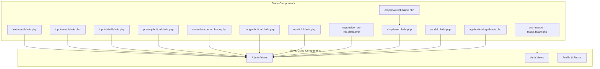
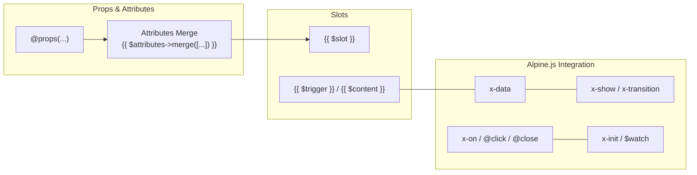
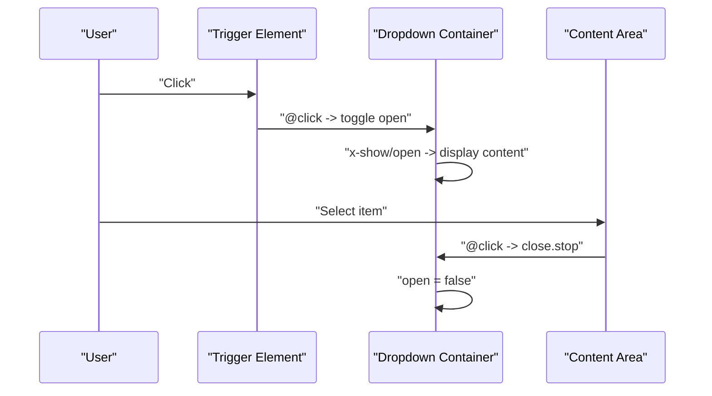
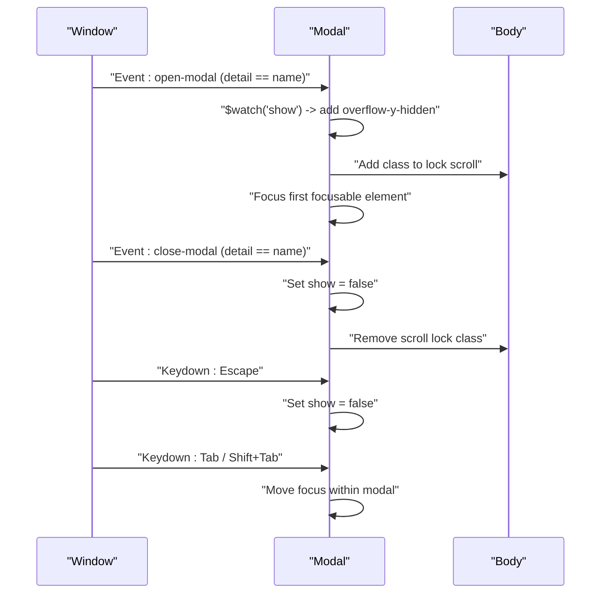
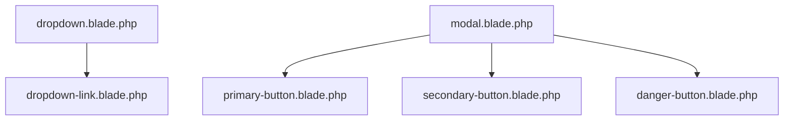

# Component Library

<cite>
**Referenced Files in This Document**
- [application-logo.blade.php](file://resources/views/components/application-logo.blade.php)
- [auth-session-status.blade.php](file://resources/views/components/auth-session-status.blade.php)
- [text-input.blade.php](file://resources/views/components/text-input.blade.php)
- [input-error.blade.php](file://resources/views/components/input-error.blade.php)
- [input-label.blade.php](file://resources/views/components/input-label.blade.php)
- [primary-button.blade.php](file://resources/views/components/primary-button.blade.php)
- [secondary-button.blade.php](file://resources/views/components/secondary-button.blade.php)
- [danger-button.blade.php](file://resources/views/components/danger-button.blade.php)
- [nav-link.blade.php](file://resources/views/components/nav-link.blade.php)
- [responsive-nav-link.blade.php](file://resources/views/components/responsive-nav-link.blade.php)
- [dropdown.blade.php](file://resources/views/components/dropdown.blade.php)
- [dropdown-link.blade.php](file://resources/views/components/dropdown-link.blade.php)
- [modal.blade.php](file://resources/views/components/modal.blade.php)
</cite>

## Table of Contents
1. [Introduction](#introduction)
2. [Project Structure](#project-structure)
3. [Core Components](#core-components)
4. [Architecture Overview](#architecture-overview)
5. [Detailed Component Analysis](#detailed-component-analysis)
6. [Dependency Analysis](#dependency-analysis)
7. [Performance Considerations](#performance-considerations)
8. [Troubleshooting Guide](#troubleshooting-guide)
9. [Conclusion](#conclusion)
10. [Appendices](#appendices)

## Introduction
This document describes the reusable Blade-based UI component library used in the ClinicalLog CMS. It covers form controls, navigation, interactive elements, and layout components. Each component’s purpose, props/attributes, styling classes, usage patterns, accessibility considerations, responsive behavior, and integration with Alpine.js is documented. Practical examples and extension guidelines are included to help teams build consistent, accessible, and maintainable user interfaces.

## Project Structure
The component library is organized under resources/views/components. Each component is a self-contained Blade template that:
- Accepts props via @props
- Merges Tailwind utility classes with caller-provided attributes
- Uses Alpine.js directives for interactivity where applicable
- Exposes a slot for content injection

**Diagram sources**
- [text-input.blade.php:1-4](file://resources/views/components/text-input.blade.php#L1-L4)
- [input-error.blade.php:1-10](file://resources/views/components/input-error.blade.php#L1-L10)
- [input-label.blade.php:1-6](file://resources/views/components/input-label.blade.php#L1-L6)
- [primary-button.blade.php:1-4](file://resources/views/components/primary-button.blade.php#L1-L4)
- [secondary-button.blade.php:1-4](file://resources/views/components/secondary-button.blade.php#L1-L4)
- [danger-button.blade.php:1-4](file://resources/views/components/danger-button.blade.php#L1-L4)
- [nav-link.blade.php:1-12](file://resources/views/components/nav-link.blade.php#L1-L12)
- [responsive-nav-link.blade.php:1-12](file://resources/views/components/responsive-nav-link.blade.php#L1-L12)
- [dropdown.blade.php:1-36](file://resources/views/components/dropdown.blade.php#L1-L36)
- [dropdown-link.blade.php:1-2](file://resources/views/components/dropdown-link.blade.php#L1-L2)
- [modal.blade.php:1-79](file://resources/views/components/modal.blade.php#L1-L79)
- [application-logo.blade.php:1-4](file://resources/views/components/application-logo.blade.php#L1-L4)
- [auth-session-status.blade.php:1-8](file://resources/views/components/auth-session-status.blade.php#L1-L8)

**Section sources**
- [text-input.blade.php:1-4](file://resources/views/components/text-input.blade.php#L1-L4)
- [input-error.blade.php:1-10](file://resources/views/components/input-error.blade.php#L1-L10)
- [input-label.blade.php:1-6](file://resources/views/components/input-label.blade.php#L1-L6)
- [primary-button.blade.php:1-4](file://resources/views/components/primary-button.blade.php#L1-L4)
- [secondary-button.blade.php:1-4](file://resources/views/components/secondary-button.blade.php#L1-L4)
- [danger-button.blade.php:1-4](file://resources/views/components/danger-button.blade.php#L1-L4)
- [nav-link.blade.php:1-12](file://resources/views/components/nav-link.blade.php#L1-L12)
- [responsive-nav-link.blade.php:1-12](file://resources/views/components/responsive-nav-link.blade.php#L1-L12)
- [dropdown.blade.php:1-36](file://resources/views/components/dropdown.blade.php#L1-L36)
- [dropdown-link.blade.php:1-2](file://resources/views/components/dropdown-link.blade.php#L1-L2)
- [modal.blade.php:1-79](file://resources/views/components/modal.blade.php#L1-L79)
- [application-logo.blade.php:1-4](file://resources/views/components/application-logo.blade.php#L1-L4)
- [auth-session-status.blade.php:1-8](file://resources/views/components/auth-session-status.blade.php#L1-L8)

## Core Components
This section summarizes the component families and their roles.

- Form Controls
  - text-input: Single-line text input with focus styles and optional disabled state.
  - input-error: Renders validation messages as a styled list.
  - input-label: Associates labels with form controls.
- Buttons
  - primary-button: Emphasized submit button with focus and hover states.
  - secondary-button: Neutral action button with focus and hover states.
  - danger-button: Destructive action button with focus and hover states.
- Navigation
  - nav-link: Desktop navigation item with active state styling.
  - responsive-nav-link: Mobile/toggle-friendly navigation item with active state styling.
- Interactive Elements
  - dropdown: Click-triggered menu with alignment and width options, Alpine-driven.
  - dropdown-link: Menu item suitable for use inside dropdown.
  - modal: Fullscreen overlay dialog with focus trapping, Alpine-driven.
- Layout
  - application-logo: SVG logo component with passthrough attributes.
  - auth-session-status: Conditional message container for authenticated sessions.

**Section sources**
- [text-input.blade.php:1-4](file://resources/views/components/text-input.blade.php#L1-L4)
- [input-error.blade.php:1-10](file://resources/views/components/input-error.blade.php#L1-L10)
- [input-label.blade.php:1-6](file://resources/views/components/input-label.blade.php#L1-L6)
- [primary-button.blade.php:1-4](file://resources/views/components/primary-button.blade.php#L1-L4)
- [secondary-button.blade.php:1-4](file://resources/views/components/secondary-button.blade.php#L1-L4)
- [danger-button.blade.php:1-4](file://resources/views/components/danger-button.blade.php#L1-L4)
- [nav-link.blade.php:1-12](file://resources/views/components/nav-link.blade.php#L1-L12)
- [responsive-nav-link.blade.php:1-12](file://resources/views/components/responsive-nav-link.blade.php#L1-L12)
- [dropdown.blade.php:1-36](file://resources/views/components/dropdown.blade.php#L1-L36)
- [dropdown-link.blade.php:1-2](file://resources/views/components/dropdown-link.blade.php#L1-L2)
- [modal.blade.php:1-79](file://resources/views/components/modal.blade.php#L1-L79)
- [application-logo.blade.php:1-4](file://resources/views/components/application-logo.blade.php#L1-L4)
- [auth-session-status.blade.php:1-8](file://resources/views/components/auth-session-status.blade.php#L1-L8)

## Architecture Overview
The component library follows a consistent pattern:
- Props via @props define defaults and shape expectations.
- Attributes are merged with Tailwind classes to allow overrides.
- Alpine.js directives power interactivity (x-data, x-show, x-on, x-init).
- Slots enable flexible content injection.

**Diagram sources**
- [dropdown.blade.php:16-35](file://resources/views/components/dropdown.blade.php#L16-L35)
- [modal.blade.php:18-47](file://resources/views/components/modal.blade.php#L18-L47)
- [text-input.blade.php:1-4](file://resources/views/components/text-input.blade.php#L1-L4)
- [primary-button.blade.php:1-4](file://resources/views/components/primary-button.blade.php#L1-L4)

## Detailed Component Analysis

### Form Controls

#### text-input
- Purpose: Standard single-line text input with focus and disabled states.
- Props:
  - disabled: Boolean to disable the input.
- Attributes:
  - Merges Tailwind classes for borders, focus rings, and shadows.
- Usage patterns:
  - Pair with input-label for accessibility.
  - Combine with input-error to render validation messages.
- Accessibility:
  - Ensure label association via input-label.
  - Disabled state is reflected visually and semantically.
- Responsive:
  - Inherits responsive sizing from parent containers.

**Section sources**
- [text-input.blade.php:1-4](file://resources/views/components/text-input.blade.php#L1-L4)

#### input-error
- Purpose: Render validation errors as a styled list.
- Props:
  - messages: Array or string of messages.
- Behavior:
  - Iterates over messages and renders each as a list item.
- Styling:
  - Red text, compact spacing.
- Usage patterns:
  - Pass validation errors from backend or frontend validation.

**Section sources**
- [input-error.blade.php:1-10](file://resources/views/components/input-error.blade.php#L1-L10)

#### input-label
- Purpose: Associates a label with a form control.
- Props:
  - value: Optional static label text; otherwise uses slot content.
- Styling:
  - Medium font weight and dark gray text.
- Usage patterns:
  - Wrap around or pair with inputs for screen reader support.

**Section sources**
- [input-label.blade.php:1-6](file://resources/views/components/input-label.blade.php#L1-L6)

### Buttons

#### primary-button
- Purpose: Emphasized submit action.
- Props:
  - None (default type is submit).
- Styling:
  - Dark background, white text, hover/focus/active states, ring focus.
- Usage patterns:
  - Use for primary actions like saving forms.

**Section sources**
- [primary-button.blade.php:1-4](file://resources/views/components/primary-button.blade.php#L1-L4)

#### secondary-button
- Purpose: Neutral action button.
- Props:
  - None (default type is button).
- Styling:
  - Light background, bordered, hover/focus/active states, disabled state handled.
- Usage patterns:
  - Use for secondary actions like cancel.

**Section sources**
- [secondary-button.blade.php:1-4](file://resources/views/components/secondary-button.blade.php#L1-L4)

#### danger-button
- Purpose: Destructive action button.
- Props:
  - None (default type is submit).
- Styling:
  - Red background, hover/focus/active states, ring focus.
- Usage patterns:
  - Use for irreversible actions like deletion.

**Section sources**
- [danger-button.blade.php:1-4](file://resources/views/components/danger-button.blade.php#L1-L4)

### Navigation

#### nav-link
- Purpose: Desktop navigation item with active state styling.
- Props:
  - active: Boolean flag to switch between active/inactive classes.
- Behavior:
  - Dynamically computes classes based on active state.
- Styling:
  - Active: indigo accent and focus styles.
  - Inactive: hover styles and focus transitions.

**Section sources**
- [nav-link.blade.php:1-12](file://resources/views/components/nav-link.blade.php#L1-L12)

#### responsive-nav-link
- Purpose: Mobile/toggle-friendly navigation item.
- Props:
  - active: Boolean flag to switch between active/inactive classes.
- Behavior:
  - Computes block-level, padding, and border-left classes per active state.
- Styling:
  - Active: indigo background and text.
  - Inactive: hover and focus states with subtle backgrounds.

**Section sources**
- [responsive-nav-link.blade.php:1-12](file://resources/views/components/responsive-nav-link.blade.php#L1-L12)

### Interactive Elements

#### dropdown
- Purpose: Click-triggered dropdown menu with alignment and width options.
- Props:
  - align: left | top | right (default).
  - width: 48 (default) or custom width class.
  - contentClasses: Additional classes for content wrapper.
- Alpine.js integration:
  - x-data declares open state.
  - x-show toggles visibility with transitions.
  - @click.outside and @close.stop manage click-outside and event bubbling.
- Composition:
  - Requires two slots: trigger and content.
  - dropdown-link is recommended for menu items.

**Diagram sources**
- [dropdown.blade.php:16-35](file://resources/views/components/dropdown.blade.php#L16-L35)

**Section sources**
- [dropdown.blade.php:1-36](file://resources/views/components/dropdown.blade.php#L1-L36)
- [dropdown-link.blade.php:1-2](file://resources/views/components/dropdown-link.blade.php#L1-L2)

#### modal
- Purpose: Fullscreen overlay dialog with focus trapping and keyboard navigation.
- Props:
  - name: Unique identifier for programmatic control.
  - show: Boolean initial visibility.
  - maxWidth: sm | md | lg | xl | 2xl (default).
- Alpine.js integration:
  - x-data defines reactive state and focusable helpers.
  - x-init watches show to manage body scroll and initial focus.
  - x-on:open-modal / x-on:close-modal listen for window events.
  - x-on:keydown.escape, x-on:keydown.tab, x-on:shift.tab handle closing and focus trapping.
  - x-transition manages enter/leave animations.
- Accessibility:
  - Focus trapping ensures focus stays inside the modal.
  - Escape key closes the modal.
  - Body scroll locking prevents background scrolling.

**Diagram sources**
- [modal.blade.php:18-47](file://resources/views/components/modal.blade.php#L18-L47)

**Section sources**
- [modal.blade.php:1-79](file://resources/views/components/modal.blade.php#L1-L79)

### Layout

#### application-logo
- Purpose: Reusable SVG logo component.
- Props:
  - None (passes through attributes to the svg element).
- Usage patterns:
  - Use in headers, footers, and branding areas.
  - Customize size via Tailwind utilities or attributes.

**Section sources**
- [application-logo.blade.php:1-4](file://resources/views/components/application-logo.blade.php#L1-L4)

#### auth-session-status
- Purpose: Displays a session status message when present.
- Props:
  - status: String message to display.
- Behavior:
  - Conditionally renders only when status exists.
- Styling:
  - Green text, small font size, medium font weight.

**Section sources**
- [auth-session-status.blade.php:1-8](file://resources/views/components/auth-session-status.blade.php#L1-L8)

## Dependency Analysis
- Internal composition:
  - dropdown uses dropdown-link for menu items.
  - modal relies on Alpine.js for state and focus management.
  - Buttons share consistent focus and transition utilities.
- External dependencies:
  - Tailwind CSS classes for styling.
  - Alpine.js directives for interactivity.
- Coupling:
  - Components are loosely coupled via attributes and slots.
  - Props provide controlled configuration without tight coupling.

**Diagram sources**
- [dropdown.blade.php:1-36](file://resources/views/components/dropdown.blade.php#L1-L36)
- [dropdown-link.blade.php:1-2](file://resources/views/components/dropdown-link.blade.php#L1-L2)
- [modal.blade.php:1-79](file://resources/views/components/modal.blade.php#L1-L79)
- [primary-button.blade.php:1-4](file://resources/views/components/primary-button.blade.php#L1-L4)
- [secondary-button.blade.php:1-4](file://resources/views/components/secondary-button.blade.php#L1-L4)
- [danger-button.blade.php:1-4](file://resources/views/components/danger-button.blade.php#L1-L4)

**Section sources**
- [dropdown.blade.php:1-36](file://resources/views/components/dropdown.blade.php#L1-L36)
- [dropdown-link.blade.php:1-2](file://resources/views/components/dropdown-link.blade.php#L1-L2)
- [modal.blade.php:1-79](file://resources/views/components/modal.blade.php#L1-L79)
- [primary-button.blade.php:1-4](file://resources/views/components/primary-button.blade.php#L1-L4)
- [secondary-button.blade.php:1-4](file://resources/views/components/secondary-button.blade.php#L1-L4)
- [danger-button.blade.php:1-4](file://resources/views/components/danger-button.blade.php#L1-L4)

## Performance Considerations
- Prefer merging attributes over hardcoding classes to minimize duplication and improve maintainability.
- Keep Alpine.js expressions concise; avoid heavy computations in templates.
- Use width presets for dropdowns to reduce custom class churn.
- Limit nested transitions to essential components to avoid layout thrashing.

## Troubleshooting Guide
- Dropdown does not close on outside click:
  - Ensure @click.outside is attached to the dropdown container and @close.stop is on content items.
- Modal cannot be closed:
  - Verify event dispatch detail matches the modal name for open/close events.
  - Confirm escape key handler is not prevented elsewhere.
- Focus trapping not working:
  - Ensure focusable elements exist and are not disabled.
  - Check that initial focus is set after modal opens.
- Button styles not applying:
  - Confirm attributes merge is used to preserve base classes while adding new ones.
- Validation messages not visible:
  - Ensure messages prop is passed as an array or string and input-error is placed near the input.

**Section sources**
- [dropdown.blade.php:16-35](file://resources/views/components/dropdown.blade.php#L16-L35)
- [modal.blade.php:34-47](file://resources/views/components/modal.blade.php#L34-L47)
- [input-error.blade.php:1-10](file://resources/views/components/input-error.blade.php#L1-L10)
- [primary-button.blade.php:1-4](file://resources/views/components/primary-button.blade.php#L1-L4)

## Conclusion
The component library offers a cohesive set of Blade components designed for form handling, navigation, interactivity, and layout. By leveraging props, attributes merging, slots, and Alpine.js, the components remain flexible, accessible, and easy to extend. Teams should follow the documented patterns to maintain consistency across the application.

## Appendices

### Accessibility Checklist
- Forms
  - Associate labels with inputs using input-label.
  - Display validation messages via input-error.
  - Disable inputs appropriately with text-input disabled prop.
- Buttons
  - Use semantic types (submit vs button) via component defaults.
  - Ensure focus outlines and keyboard operability.
- Navigation
  - Indicate active states clearly for both desktop and mobile links.
- Interactive Elements
  - Dropdowns: Provide keyboard access and aria roles if needed.
  - Modals: Trap focus, announce content, and support escape key.

### Responsive Design Notes
- Use Tailwind responsive modifiers on parent containers to adjust component sizes and spacing.
- Dropdown widths accept preset values; custom widths can be passed via attributes.
- Navigation links adapt to mobile via responsive-nav-link’s block and padding classes.

### Integration with Alpine.js
- Use x-data for local state, x-show for visibility, and x-transition for smooth animations.
- Leverage x-on for event handling and x-init/$watch for lifecycle effects.
- For modals, coordinate with window events to open/close programmatically.