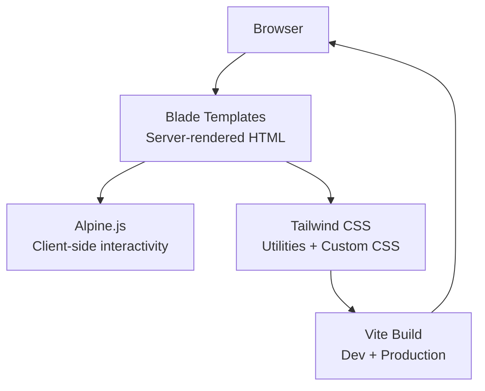
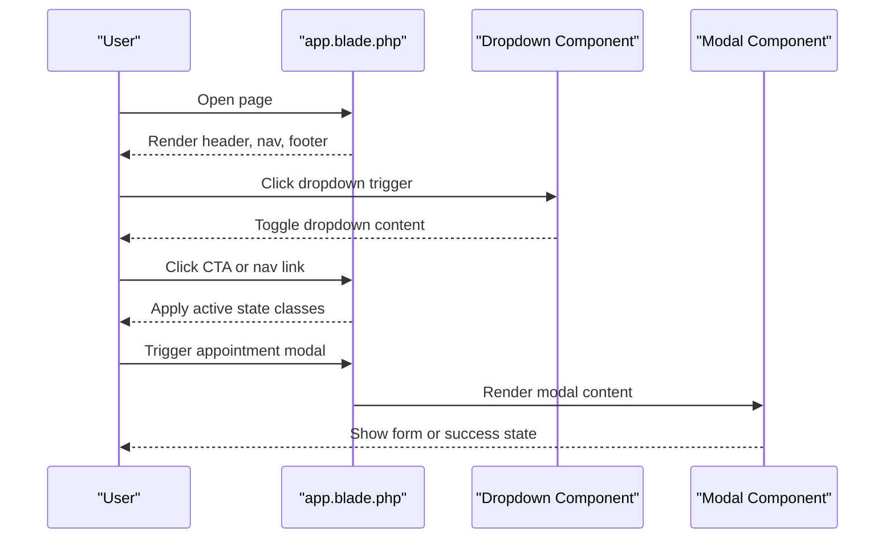
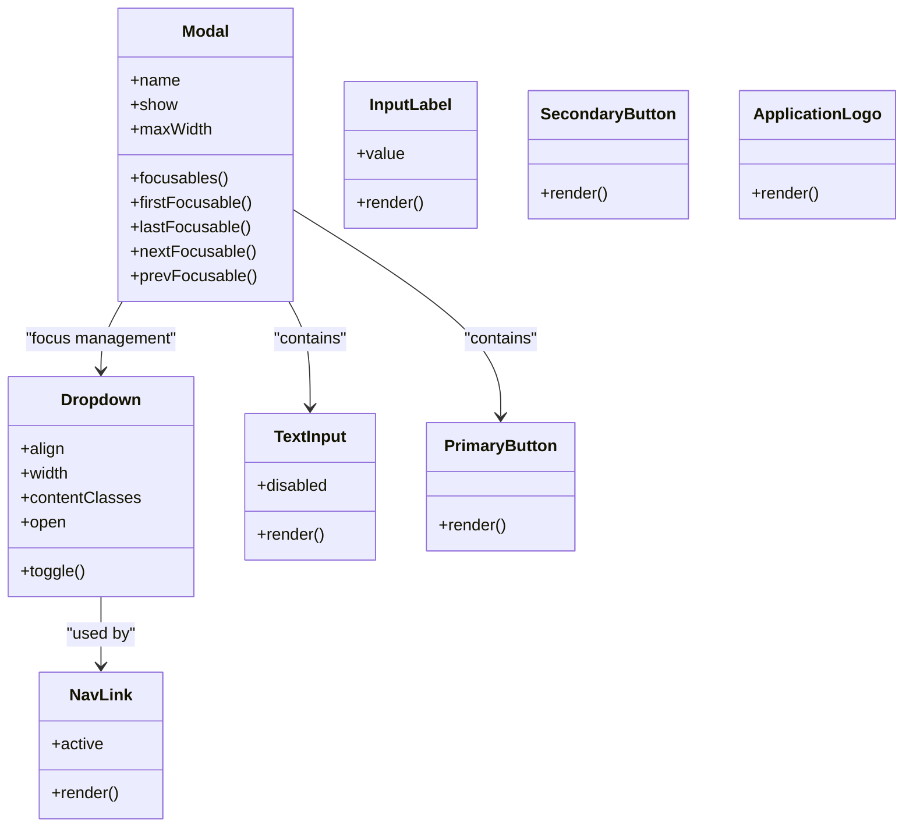
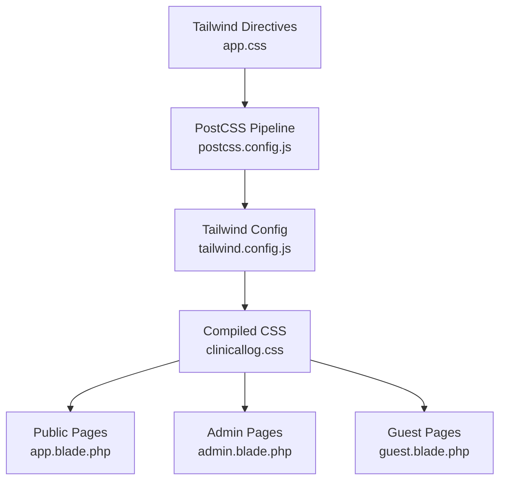
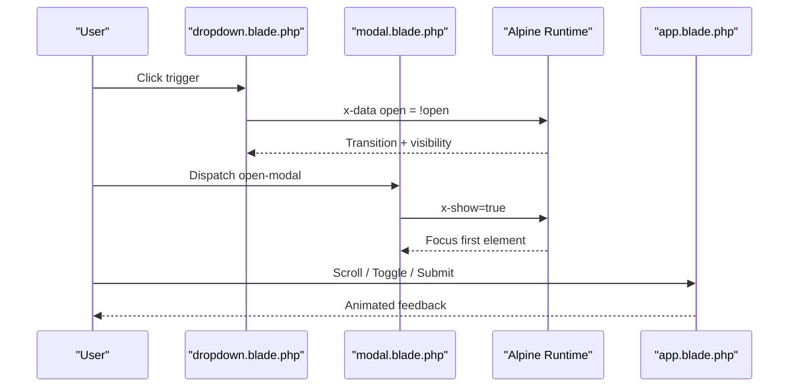
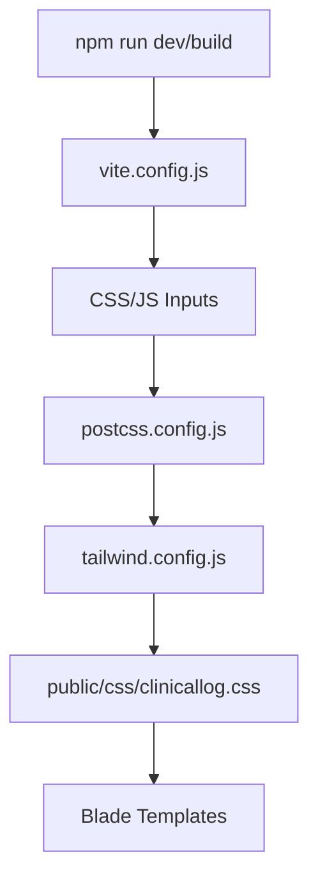
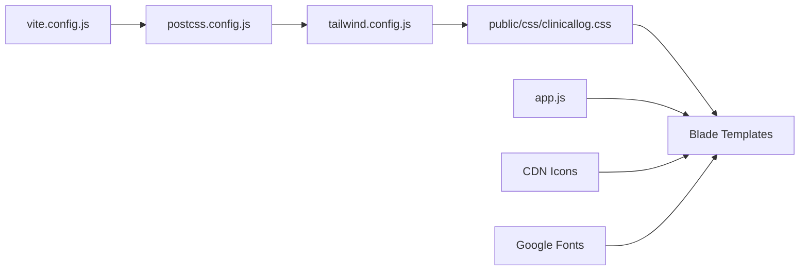

# Frontend Architecture

<cite>
**Referenced Files in This Document**
- [app.blade.php](file://resources/views/layouts/app.blade.php)
- [admin.blade.php](file://resources/views/layouts/admin.blade.php)
- [guest.blade.php](file://resources/views/layouts/guest.blade.php)
- [navigation.blade.php](file://resources/views/layouts/navigation.blade.php)
- [application-logo.blade.php](file://resources/views/components/application-logo.blade.php)
- [nav-link.blade.php](file://resources/views/components/nav-link.blade.php)
- [dropdown.blade.php](file://resources/views/components/dropdown.blade.php)
- [input-label.blade.php](file://resources/views/components/input-label.blade.php)
- [text-input.blade.php](file://resources/views/components/text-input.blade.php)
- [primary-button.blade.php](file://resources/views/components/primary-button.blade.php)
- [secondary-button.blade.php](file://resources/views/components/secondary-button.blade.php)
- [modal.blade.php](file://resources/views/components/modal.blade.php)
- [app.js](file://resources/js/app.js)
- [app.css](file://resources/css/app.css)
- [vite.config.js](file://vite.config.js)
- [tailwind.config.js](file://tailwind.config.js)
- [postcss.config.js](file://postcss.config.js)
- [package.json](file://package.json)
- [composer.json](file://composer.json)
- [clinicallog.css](file://public/css/clinicallog.css)
</cite>

## Table of Contents
1. [Introduction](#introduction)
2. [Project Structure](#project-structure)
3. [Core Components](#core-components)
4. [Architecture Overview](#architecture-overview)
5. [Detailed Component Analysis](#detailed-component-analysis)
6. [Dependency Analysis](#dependency-analysis)
7. [Performance Considerations](#performance-considerations)
8. [Troubleshooting Guide](#troubleshooting-guide)
9. [Conclusion](#conclusion)
10. [Appendices](#appendices)

## Introduction
This document describes the frontend architecture of ClinicalLog CMS, focusing on the Blade template system, component library, layout inheritance, Tailwind CSS integration, custom styling, responsive design, JavaScript integration with Alpine.js, asset compilation via Vite, and build process optimization. It also covers accessibility, cross-browser compatibility, performance, asset pipeline, caching, and production deployment considerations.

## Project Structure
The frontend is organized around Blade templates and a small set of reusable Blade components. Layouts define page scaffolding, while components encapsulate UI primitives and interactive behaviors. Assets are compiled using Vite with Tailwind CSS and PostCSS.

```mermaid
graph TB
subgraph "Blade Templates"
L_App["resources/views/layouts/app.blade.php"]
L_Admin["resources/views/layouts/admin.blade.php"]
L_Guest["resources/views/layouts/guest.blade.php"]
L_Nav["resources/views/layouts/navigation.blade.php"]
end
subgraph "Reusable Components"
C_Logo["resources/views/components/application-logo.blade.php"]
C_Link["resources/views/components/nav-link.blade.php"]
C_Dropdown["resources/views/components/dropdown.blade.php"]
C_Label["resources/views/components/input-label.blade.php"]
C_Text["resources/views/components/text-input.blade.php"]
C_Primary["resources/views/components/primary-button.blade.php"]
C_Secondary["resources/views/components/secondary-button.blade.php"]
C_Modal["resources/views/components/modal.blade.php"]
end
subgraph "Assets"
J_App["resources/js/app.js"]
CSS_App["resources/css/app.css"]
Vite["vite.config.js"]
Tailwind["tailwind.config.js"]
PostCSS["postcss.config.js"]
CL_CSS["public/css/clinicallog.css"]
end
L_App --> C_Logo
L_App --> C_Dropdown
L_Admin --> C_Modal
L_Guest --> C_Logo
L_Nav --> C_Dropdown
L_Nav --> C_Link
J_App --> |"Alpine.js"| L_App
CSS_App --> |"Tailwind"| CL_CSS
Vite --> |"Build"| CL_CSS
Tailwind --> |"Content globs"| L_App
PostCSS --> |"autoprefix"| CL_CSS
```

**Diagram sources**
- [app.blade.php:1-397](file://resources/views/layouts/app.blade.php#L1-L397)
- [admin.blade.php:1-156](file://resources/views/layouts/admin.blade.php#L1-L156)
- [guest.blade.php:1-31](file://resources/views/layouts/guest.blade.php#L1-L31)
- [navigation.blade.php:1-101](file://resources/views/layouts/navigation.blade.php#L1-L101)
- [application-logo.blade.php:1-4](file://resources/views/components/application-logo.blade.php#L1-L4)
- [dropdown.blade.php:1-36](file://resources/views/components/dropdown.blade.php#L1-L36)
- [nav-link.blade.php:1-12](file://resources/views/components/nav-link.blade.php#L1-L12)
- [input-label.blade.php:1-6](file://resources/views/components/input-label.blade.php#L1-L6)
- [text-input.blade.php:1-4](file://resources/views/components/text-input.blade.php#L1-L4)
- [primary-button.blade.php:1-4](file://resources/views/components/primary-button.blade.php#L1-L4)
- [secondary-button.blade.php:1-4](file://resources/views/components/secondary-button.blade.php#L1-L4)
- [modal.blade.php:1-79](file://resources/views/components/modal.blade.php#L1-L79)
- [app.js:1-8](file://resources/js/app.js#L1-L8)
- [app.css:1-3](file://resources/css/app.css#L1-L3)
- [vite.config.js:1-12](file://vite.config.js#L1-L12)
- [tailwind.config.js:1-22](file://tailwind.config.js#L1-L22)
- [postcss.config.js:1-7](file://postcss.config.js#L1-L7)
- [clinicallog.css:1-1070](file://public/css/clinicallog.css#L1-L1070)

**Section sources**
- [app.blade.php:1-397](file://resources/views/layouts/app.blade.php#L1-L397)
- [admin.blade.php:1-156](file://resources/views/layouts/admin.blade.php#L1-L156)
- [guest.blade.php:1-31](file://resources/views/layouts/guest.blade.php#L1-L31)
- [navigation.blade.php:1-101](file://resources/views/layouts/navigation.blade.php#L1-L101)
- [app.js:1-8](file://resources/js/app.js#L1-L8)
- [app.css:1-3](file://resources/css/app.css#L1-L3)
- [vite.config.js:1-12](file://vite.config.js#L1-L12)
- [tailwind.config.js:1-22](file://tailwind.config.js#L1-L22)
- [postcss.config.js:1-7](file://postcss.config.js#L1-L7)
- [clinicallog.css:1-1070](file://public/css/clinicallog.css#L1-L1070)

## Core Components
- Layouts
  - Public site layout with navigation, footer, and appointment modal: [app.blade.php:1-397](file://resources/views/layouts/app.blade.php#L1-L397)
  - Admin layout with sidebar, topbar, and flash messages: [admin.blade.php:1-156](file://resources/views/layouts/admin.blade.php#L1-L156)
  - Guest layout integrating Vite-managed assets: [guest.blade.php:1-31](file://resources/views/layouts/guest.blade.php#L1-L31)
  - Authenticated user navigation with dropdown and responsive menu: [navigation.blade.php:1-101](file://resources/views/layouts/navigation.blade.php#L1-L101)
- Component Library
  - Application logo primitive: [application-logo.blade.php:1-4](file://resources/views/components/application-logo.blade.php#L1-L4)
  - Navigation link with active state: [nav-link.blade.php:1-12](file://resources/views/components/nav-link.blade.php#L1-L12)
  - Dropdown with Alpine-driven visibility and focus management: [dropdown.blade.php:1-36](file://resources/views/components/dropdown.blade.php#L1-L36)
  - Form label and input primitives: [input-label.blade.php:1-6](file://resources/views/components/input-label.blade.php#L1-L6), [text-input.blade.php:1-4](file://resources/views/components/text-input.blade.php#L1-L4)
  - Primary and secondary buttons: [primary-button.blade.php:1-4](file://resources/views/components/primary-button.blade.php#L1-L4), [secondary-button.blade.php:1-4](file://resources/views/components/secondary-button.blade.php#L1-L4)
  - Modal dialog with focus trapping and transitions: [modal.blade.php:1-79](file://resources/views/components/modal.blade.php#L1-L79)
- JavaScript and Styles
  - Alpine.js bootstrapping: [app.js:1-8](file://resources/js/app.js#L1-L8)
  - Tailwind directives: [app.css:1-3](file://resources/css/app.css#L1-L3)
  - Asset pipeline configuration: [vite.config.js:1-12](file://vite.config.js#L1-L12), [tailwind.config.js:1-22](file://tailwind.config.js#L1-L22), [postcss.config.js:1-7](file://postcss.config.js#L1-L7)
  - Custom UI styles and utilities: [clinicallog.css:1-1070](file://public/css/clinicallog.css#L1-L1070)

**Section sources**
- [app.blade.php:1-397](file://resources/views/layouts/app.blade.php#L1-L397)
- [admin.blade.php:1-156](file://resources/views/layouts/admin.blade.php#L1-L156)
- [guest.blade.php:1-31](file://resources/views/layouts/guest.blade.php#L1-L31)
- [navigation.blade.php:1-101](file://resources/views/layouts/navigation.blade.php#L1-L101)
- [application-logo.blade.php:1-4](file://resources/views/components/application-logo.blade.php#L1-L4)
- [nav-link.blade.php:1-12](file://resources/views/components/nav-link.blade.php#L1-L12)
- [dropdown.blade.php:1-36](file://resources/views/components/dropdown.blade.php#L1-L36)
- [input-label.blade.php:1-6](file://resources/views/components/input-label.blade.php#L1-L6)
- [text-input.blade.php:1-4](file://resources/views/components/text-input.blade.php#L1-L4)
- [primary-button.blade.php:1-4](file://resources/views/components/primary-button.blade.php#L1-L4)
- [secondary-button.blade.php:1-4](file://resources/views/components/secondary-button.blade.php#L1-L4)
- [modal.blade.php:1-79](file://resources/views/components/modal.blade.php#L1-L79)
- [app.js:1-8](file://resources/js/app.js#L1-L8)
- [app.css:1-3](file://resources/css/app.css#L1-L3)
- [vite.config.js:1-12](file://vite.config.js#L1-L12)
- [tailwind.config.js:1-22](file://tailwind.config.js#L1-L22)
- [postcss.config.js:1-7](file://postcss.config.js#L1-L7)
- [clinicallog.css:1-1070](file://public/css/clinicallog.css#L1-L1070)

## Architecture Overview
The frontend architecture combines server-rendered Blade templates with client-side interactivity powered by Alpine.js. Tailwind CSS provides utility-first styling, while Vite manages asset builds and hot module replacement during development.

**Diagram sources**
- [app.blade.php:1-397](file://resources/views/layouts/app.blade.php#L1-L397)
- [admin.blade.php:1-156](file://resources/views/layouts/admin.blade.php#L1-L156)
- [navigation.blade.php:1-101](file://resources/views/layouts/navigation.blade.php#L1-L101)
- [dropdown.blade.php:1-36](file://resources/views/components/dropdown.blade.php#L1-L36)
- [modal.blade.php:1-79](file://resources/views/components/modal.blade.php#L1-L79)
- [app.js:1-8](file://resources/js/app.js#L1-L8)
- [app.css:1-3](file://resources/css/app.css#L1-L3)
- [vite.config.js:1-12](file://vite.config.js#L1-L12)
- [tailwind.config.js:1-22](file://tailwind.config.js#L1-L22)
- [postcss.config.js:1-7](file://postcss.config.js#L1-L7)
- [clinicallog.css:1-1070](file://public/css/clinicallog.css#L1-L1070)

## Detailed Component Analysis

### Blade Template System and Layout Inheritance
- Public site layout
  - Provides global head assets, fonts, and preconnect hints, plus a decorative background and AOS initialization.
  - Implements a responsive navigation with desktop and mobile variants, sticky behavior, and an embedded appointment modal with form submission logic.
  - Uses a dynamic navigation builder that respects landing page visibility flags and generates anchor URLs appropriately.
  - Includes a footer with grid-based links and social media entries.
  - See [app.blade.php:1-397](file://resources/views/layouts/app.blade.php#L1-L397).
- Admin layout
  - Defines a fixed sidebar with navigation items, active state highlighting, and logout flow.
  - Includes a mobile-friendly topbar and flash message rendering for success/error states.
  - Integrates Lucide icons via CDN and Alpine for sidebar toggling.
  - See [admin.blade.php:1-156](file://resources/views/layouts/admin.blade.php#L1-L156).
- Guest layout
  - Minimal authenticated guest wrapper that injects Vite-managed assets and centers content.
  - See [guest.blade.php:1-31](file://resources/views/layouts/guest.blade.php#L1-L31).
- Auth navigation
  - Standardized navigation with a dropdown menu, responsive toggle, and user profile/logout actions.
  - See [navigation.blade.php:1-101](file://resources/views/layouts/navigation.blade.php#L1-L101).

**Diagram sources**
- [app.blade.php:1-397](file://resources/views/layouts/app.blade.php#L1-L397)
- [dropdown.blade.php:1-36](file://resources/views/components/dropdown.blade.php#L1-L36)
- [modal.blade.php:1-79](file://resources/views/components/modal.blade.php#L1-L79)

**Section sources**
- [app.blade.php:1-397](file://resources/views/layouts/app.blade.php#L1-L397)
- [admin.blade.php:1-156](file://resources/views/layouts/admin.blade.php#L1-L156)
- [guest.blade.php:1-31](file://resources/views/layouts/guest.blade.php#L1-L31)
- [navigation.blade.php:1-101](file://resources/views/layouts/navigation.blade.php#L1-L101)

### Component Library Structure
- Primitives
  - Logo: [application-logo.blade.php:1-4](file://resources/views/components/application-logo.blade.php#L1-L4)
  - Inputs: [input-label.blade.php:1-6](file://resources/views/components/input-label.blade.php#L1-L6), [text-input.blade.php:1-4](file://resources/views/components/text-input.blade.php#L1-L4)
  - Buttons: [primary-button.blade.php:1-4](file://resources/views/components/primary-button.blade.php#L1-L4), [secondary-button.blade.php:1-4](file://resources/views/components/secondary-button.blade.php#L1-L4)
- Navigation and Interactions
  - Nav link with active state: [nav-link.blade.php:1-12](file://resources/views/components/nav-link.blade.php#L1-L12)
  - Dropdown with Alpine-driven visibility and focus management: [dropdown.blade.php:1-36](file://resources/views/components/dropdown.blade.php#L1-L36)
  - Modal with focus trapping and transitions: [modal.blade.php:1-79](file://resources/views/components/modal.blade.php#L1-L79)

**Diagram sources**
- [nav-link.blade.php:1-12](file://resources/views/components/nav-link.blade.php#L1-L12)
- [dropdown.blade.php:1-36](file://resources/views/components/dropdown.blade.php#L1-L36)
- [modal.blade.php:1-79](file://resources/views/components/modal.blade.php#L1-L79)
- [input-label.blade.php:1-6](file://resources/views/components/input-label.blade.php#L1-L6)
- [text-input.blade.php:1-4](file://resources/views/components/text-input.blade.php#L1-L4)
- [primary-button.blade.php:1-4](file://resources/views/components/primary-button.blade.php#L1-L4)
- [secondary-button.blade.php:1-4](file://resources/views/components/secondary-button.blade.php#L1-L4)
- [application-logo.blade.php:1-4](file://resources/views/components/application-logo.blade.php#L1-L4)

**Section sources**
- [nav-link.blade.php:1-12](file://resources/views/components/nav-link.blade.php#L1-L12)
- [dropdown.blade.php:1-36](file://resources/views/components/dropdown.blade.php#L1-L36)
- [modal.blade.php:1-79](file://resources/views/components/modal.blade.php#L1-L79)
- [input-label.blade.php:1-6](file://resources/views/components/input-label.blade.php#L1-L6)
- [text-input.blade.php:1-4](file://resources/views/components/text-input.blade.php#L1-L4)
- [primary-button.blade.php:1-4](file://resources/views/components/primary-button.blade.php#L1-L4)
- [secondary-button.blade.php:1-4](file://resources/views/components/secondary-button.blade.php#L1-L4)
- [application-logo.blade.php:1-4](file://resources/views/components/application-logo.blade.php#L1-L4)

### Tailwind CSS Implementation and Custom Styling
- Tailwind directives
  - Base, components, and utilities are included in [app.css:1-3](file://resources/css/app.css#L1-L3).
- Tailwind configuration
  - Content globs scan Blade views and vendor/pagination views for unused CSS purging.
  - Extends font family to prefer a custom sans stack.
  - See [tailwind.config.js:1-22](file://tailwind.config.js#L1-L22).
- PostCSS pipeline
  - Tailwind and Autoprefixer are applied via [postcss.config.js:1-7](file://postcss.config.js#L1-L7).
- Custom UI styles
  - Comprehensive custom CSS in [clinicallog.css:1-1070](file://public/css/clinicallog.css#L1-L1070) defines tokens, utilities (glass, gradients), components (buttons, navbar, hero, features, pricing, footer), admin-specific styles, and responsive adjustments.
- Integration
  - Public pages load [clinicallog.css:1-1070](file://public/css/clinicallog.css#L1-L1070) alongside fonts and AOS.
  - Admin layout loads [clinicallog.css:1-1070](file://public/css/clinicallog.css#L1-L1070) and Tailwind CDN for convenience.
  - Guest layout integrates Vite-managed assets via [guest.blade.php](file://resources/views/layouts/guest.blade.php#L15).

**Diagram sources**
- [app.css:1-3](file://resources/css/app.css#L1-L3)
- [postcss.config.js:1-7](file://postcss.config.js#L1-L7)
- [tailwind.config.js:1-22](file://tailwind.config.js#L1-L22)
- [clinicallog.css:1-1070](file://public/css/clinicallog.css#L1-L1070)
- [app.blade.php:1-397](file://resources/views/layouts/app.blade.php#L1-L397)
- [admin.blade.php:1-156](file://resources/views/layouts/admin.blade.php#L1-L156)
- [guest.blade.php:1-31](file://resources/views/layouts/guest.blade.php#L1-L31)

**Section sources**
- [app.css:1-3](file://resources/css/app.css#L1-L3)
- [tailwind.config.js:1-22](file://tailwind.config.js#L1-L22)
- [postcss.config.js:1-7](file://postcss.config.js#L1-L7)
- [clinicallog.css:1-1070](file://public/css/clinicallog.css#L1-L1070)
- [app.blade.php:1-397](file://resources/views/layouts/app.blade.php#L1-L397)
- [admin.blade.php:1-156](file://resources/views/layouts/admin.blade.php#L1-L156)
- [guest.blade.php:1-31](file://resources/views/layouts/guest.blade.php#L1-L31)

### JavaScript Integration with Alpine.js
- Bootstrap
  - Alpine is imported and started in [app.js:1-8](file://resources/js/app.js#L1-L8).
- Interactive components
  - Dropdown uses Alpine to manage open state and click-outside behavior: [dropdown.blade.php:16-35](file://resources/views/components/dropdown.blade.php#L16-L35).
  - Modal uses Alpine for visibility, transitions, and focus trapping: [modal.blade.php:17-78](file://resources/views/components/modal.blade.php#L17-L78).
  - Navigation toggles responsive menu state: [navigation.blade.php:56-63](file://resources/views/layouts/navigation.blade.php#L56-L63).
- Public site interactivity
  - Sticky navbar, mobile menu toggle, AOS animations, and appointment modal form submission are implemented in [app.blade.php:285-391](file://resources/views/layouts/app.blade.php#L285-L391).

**Diagram sources**
- [dropdown.blade.php:16-35](file://resources/views/components/dropdown.blade.php#L16-L35)
- [modal.blade.php:17-78](file://resources/views/components/modal.blade.php#L17-L78)
- [app.js:1-8](file://resources/js/app.js#L1-L8)
- [app.blade.php:285-391](file://resources/views/layouts/app.blade.php#L285-L391)

**Section sources**
- [app.js:1-8](file://resources/js/app.js#L1-L8)
- [dropdown.blade.php:16-35](file://resources/views/components/dropdown.blade.php#L16-L35)
- [modal.blade.php:17-78](file://resources/views/components/modal.blade.php#L17-L78)
- [navigation.blade.php:56-63](file://resources/views/layouts/navigation.blade.php#L56-L63)
- [app.blade.php:285-391](file://resources/views/layouts/app.blade.php#L285-L391)

### Asset Compilation Through Vite and Build Process
- Vite configuration
  - Laravel Vite plugin configured with inputs for CSS and JS, and refresh support: [vite.config.js:1-12](file://vite.config.js#L1-L12).
- Package scripts
  - Dev and build scripts defined in [package.json:5-8](file://package.json#L5-L8).
- Composer scripts
  - Setup script installs PHP deps, seeds keys, migrates, installs JS deps, and builds assets: [composer.json:35-42](file://composer.json#L35-L42).
- Asset injection
  - Guest layout injects Vite assets via directive: [guest.blade.php](file://resources/views/layouts/guest.blade.php#L15).
- Tailwind integration
  - Tailwind and Autoprefixer configured in [postcss.config.js:1-7](file://postcss.config.js#L1-L7) and [tailwind.config.js:1-22](file://tailwind.config.js#L1-L22).

**Diagram sources**
- [vite.config.js:1-12](file://vite.config.js#L1-L12)
- [postcss.config.js:1-7](file://postcss.config.js#L1-L7)
- [tailwind.config.js:1-22](file://tailwind.config.js#L1-L22)
- [package.json:5-8](file://package.json#L5-L8)
- [composer.json:35-42](file://composer.json#L35-L42)
- [clinicallog.css:1-1070](file://public/css/clinicallog.css#L1-L1070)
- [guest.blade.php](file://resources/views/layouts/guest.blade.php#L15)

**Section sources**
- [vite.config.js:1-12](file://vite.config.js#L1-L12)
- [package.json:5-8](file://package.json#L5-L8)
- [composer.json:35-42](file://composer.json#L35-L42)
- [postcss.config.js:1-7](file://postcss.config.js#L1-L7)
- [tailwind.config.js:1-22](file://tailwind.config.js#L1-L22)
- [guest.blade.php](file://resources/views/layouts/guest.blade.php#L15)
- [clinicallog.css:1-1070](file://public/css/clinicallog.css#L1-L1070)

### Responsive Design Principles
- Breakpoints and grids
  - Custom CSS defines responsive grids for hero, features, benefits, steps, testimonials, and pricing.
  - Media queries adjust paddings, typography scales, and component sizes for mobile and tablet.
- Utilities
  - Flex utilities and text-center helpers are extended for alignment and centering.
- Examples
  - Hero grid responsiveness: [clinicallog.css:283-284](file://public/css/clinicallog.css#L283-L284)
  - Feature grid responsiveness: [clinicallog.css:366-368](file://public/css/clinicallog.css#L366-L368)
  - Footer grid responsiveness: [clinicallog.css:564-566](file://public/css/clinicallog.css#L564-L566)
  - Mobile navbar and menu: [clinicallog.css:206-234](file://public/css/clinicallog.css#L206-L234)

**Section sources**
- [clinicallog.css:283-284](file://public/css/clinicallog.css#L283-L284)
- [clinicallog.css:366-368](file://public/css/clinicallog.css#L366-L368)
- [clinicallog.css:564-566](file://public/css/clinicallog.css#L564-L566)
- [clinicallog.css:206-234](file://public/css/clinicallog.css#L206-L234)

### Accessibility Compliance
- Semantic markup
  - Landmarks and roles: banner, main, navigation, contentinfo.
  - Lists and headings are used to structure content.
- ARIA attributes
  - Navigation toggle controls mobile menu: [app.blade.php:103-113](file://resources/views/layouts/app.blade.php#L103-L113)
  - Dropdown and modal components manage focus and visibility.
- Keyboard navigation
  - Dropdown and modal trap focus and handle Tab/Shift+Tab.
  - Navigation toggles use accessible SVG icons and labels.
- Contrast and readability
  - Color tokens and gradient text ensure sufficient contrast.
- References
  - Dropdown focus management: [dropdown.blade.php:18-35](file://resources/views/components/dropdown.blade.php#L18-L35)
  - Modal focus trapping: [modal.blade.php:18-47](file://resources/views/components/modal.blade.php#L18-L47)

**Section sources**
- [app.blade.php:103-113](file://resources/views/layouts/app.blade.php#L103-L113)
- [dropdown.blade.php:18-35](file://resources/views/components/dropdown.blade.php#L18-L35)
- [modal.blade.php:18-47](file://resources/views/components/modal.blade.php#L18-L47)

### Cross-Browser Compatibility
- Tooling
  - Autoprefixer ensures vendor-prefixed properties in compiled CSS: [postcss.config.js:1-7](file://postcss.config.js#L1-L7).
- Fonts and icons
  - Google Fonts preconnect and Lucide icons CDN improve loading reliability.
- JavaScript
  - Alpine.js provides modern DOM manipulation with minimal polyfills; ensure target browsers support ES2015+ features.
- References
  - Font preconnects: [app.blade.php:12-14](file://resources/views/layouts/app.blade.php#L12-L14)
  - Icon CDN: [app.blade.php](file://resources/views/layouts/app.blade.php#L18)
  - PostCSS autoprefixer: [postcss.config.js:1-7](file://postcss.config.js#L1-L7)

**Section sources**
- [postcss.config.js:1-7](file://postcss.config.js#L1-L7)
- [app.blade.php:12-14](file://resources/views/layouts/app.blade.php#L12-L14)
- [app.blade.php](file://resources/views/layouts/app.blade.php#L18)

### Form Handling Patterns and Interactive Features
- Public appointment modal
  - Embedded form with CSRF, client-side validation hooks, and fetch submission to backend route.
  - Success and error states with animated transitions.
  - See [app.blade.php:196-391](file://resources/views/layouts/app.blade.php#L196-L391).
- Admin forms
  - Custom form inputs, labels, and buttons styled via [clinicallog.css:656-667](file://public/css/clinicallog.css#L656-L667).
- Auth forms
  - Guest layout integrates Vite assets for SPA-like UX; form components reuse primitives.
  - See [guest.blade.php](file://resources/views/layouts/guest.blade.php#L15).

**Section sources**
- [app.blade.php:196-391](file://resources/views/layouts/app.blade.php#L196-L391)
- [clinicallog.css:656-667](file://public/css/clinicallog.css#L656-L667)
- [guest.blade.php](file://resources/views/layouts/guest.blade.php#L15)

## Dependency Analysis
- Internal dependencies
  - Layouts depend on components for navigation, dropdowns, and modals.
  - Components share common attributes and Alpine-driven behaviors.
- External dependencies
  - Alpine.js runtime and DOM manipulation.
  - Lucide icons CDN for UI symbols.
  - Google Fonts and AOS for animations.
- Build-time dependencies
  - Vite, Tailwind CSS, PostCSS, and related plugins.

**Diagram sources**
- [vite.config.js:1-12](file://vite.config.js#L1-L12)
- [postcss.config.js:1-7](file://postcss.config.js#L1-L7)
- [tailwind.config.js:1-22](file://tailwind.config.js#L1-L22)
- [clinicallog.css:1-1070](file://public/css/clinicallog.css#L1-L1070)
- [app.js:1-8](file://resources/js/app.js#L1-L8)
- [app.blade.php:12-18](file://resources/views/layouts/app.blade.php#L12-L18)

**Section sources**
- [vite.config.js:1-12](file://vite.config.js#L1-L12)
- [postcss.config.js:1-7](file://postcss.config.js#L1-L7)
- [tailwind.config.js:1-22](file://tailwind.config.js#L1-L22)
- [clinicallog.css:1-1070](file://public/css/clinicallog.css#L1-L1070)
- [app.js:1-8](file://resources/js/app.js#L1-L8)
- [app.blade.php:12-18](file://resources/views/layouts/app.blade.php#L12-L18)

## Performance Considerations
- Asset optimization
  - Tailwind purges unused CSS based on content globs.
  - Autoprefixer reduces manual vendor prefixes.
- Lazy loading and connectivity
  - Font preconnect improves render performance.
  - External CDNs for icons and AOS reduce bundle size.
- Bundle hygiene
  - Keep Alpine.js lightweight; avoid unnecessary Alpine instances.
- Rendering
  - Prefer server-rendered Blade for SEO and initial load; use Alpine for progressive enhancement.
- Build scripts
  - Use npm run build for production; ensure static assets are served with appropriate cache headers.

[No sources needed since this section provides general guidance]

## Troubleshooting Guide
- Alpine not working
  - Ensure Alpine is imported and started in [app.js:1-8](file://resources/js/app.js#L1-L8).
  - Verify x-data/x-show bindings in components like [dropdown.blade.php:16-35](file://resources/views/components/dropdown.blade.php#L16-L35) and [modal.blade.php:17-78](file://resources/views/components/modal.blade.php#L17-L78).
- Missing styles
  - Confirm Tailwind directives in [app.css:1-3](file://resources/css/app.css#L1-L3) and Tailwind config in [tailwind.config.js:1-22](file://tailwind.config.js#L1-L22).
  - Check PostCSS pipeline in [postcss.config.js:1-7](file://postcss.config.js#L1-L7).
- Vite assets not loading
  - Run npm run build and ensure [composer.json](file://composer.json#L41) setup script executed.
  - Verify Vite directive in [guest.blade.php](file://resources/views/layouts/guest.blade.php#L15).
- Responsive issues
  - Review media queries and grid classes in [clinicallog.css:206-234](file://public/css/clinicallog.css#L206-L234) and component grids.
- Accessibility errors
  - Validate ARIA attributes and focus management in [dropdown.blade.php:16-35](file://resources/views/components/dropdown.blade.php#L16-L35) and [modal.blade.php:17-78](file://resources/views/components/modal.blade.php#L17-L78).

**Section sources**
- [app.js:1-8](file://resources/js/app.js#L1-L8)
- [dropdown.blade.php:16-35](file://resources/views/components/dropdown.blade.php#L16-L35)
- [modal.blade.php:17-78](file://resources/views/components/modal.blade.php#L17-L78)
- [app.css:1-3](file://resources/css/app.css#L1-L3)
- [tailwind.config.js:1-22](file://tailwind.config.js#L1-L22)
- [postcss.config.js:1-7](file://postcss.config.js#L1-L7)
- [composer.json](file://composer.json#L41)
- [guest.blade.php](file://resources/views/layouts/guest.blade.php#L15)
- [clinicallog.css:206-234](file://public/css/clinicallog.css#L206-L234)

## Conclusion
ClinicalLog CMS employs a pragmatic frontend architecture: server-rendered Blade templates with a compact component library, Tailwind CSS for utility-first styling, and Alpine.js for progressive interactivity. The Vite build pipeline streamlines asset compilation and development workflows. The approach balances maintainability, performance, and accessibility while supporting responsive design and admin workflows.

[No sources needed since this section summarizes without analyzing specific files]

## Appendices
- Deployment checklist
  - Run npm run build and commit generated assets.
  - Configure web server to serve static assets with long-lived cache headers.
  - Ensure environment variables and storage permissions are configured for production.
- Maintenance tips
  - Keep Tailwind content globs up to date as new Blade views are added.
  - Audit custom CSS for unused selectors periodically.

[No sources needed since this section provides general guidance]