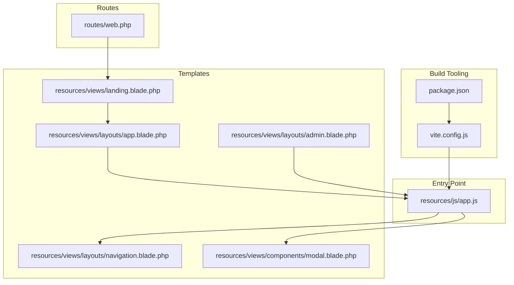
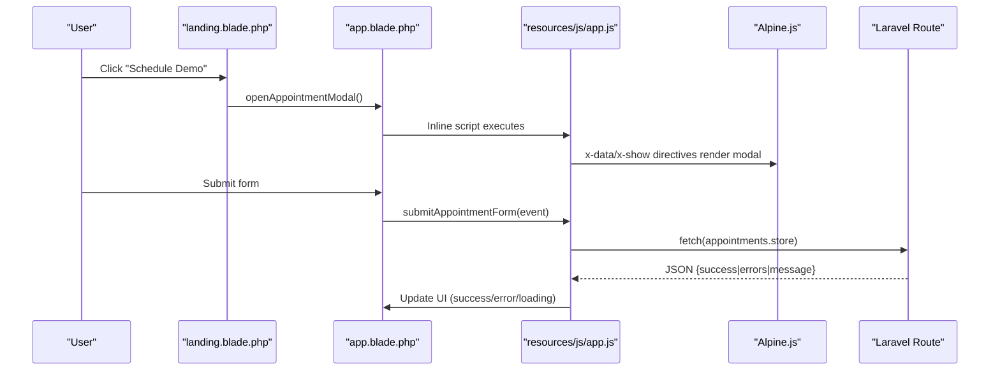
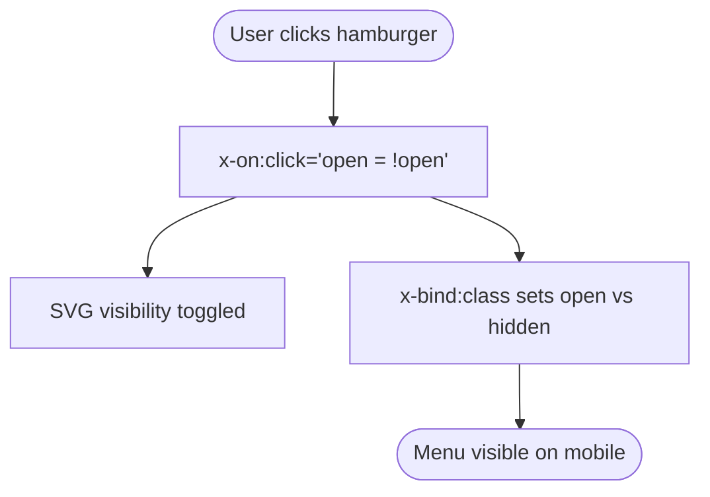
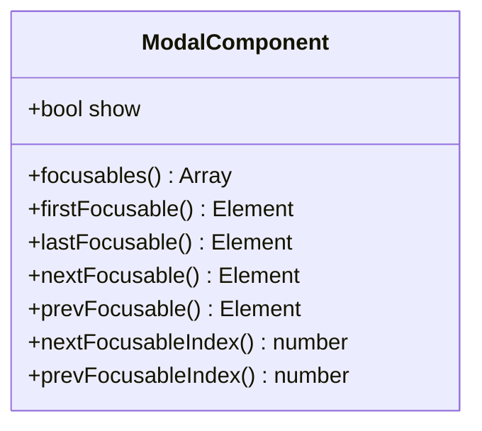
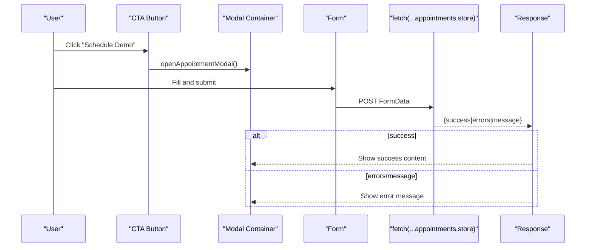
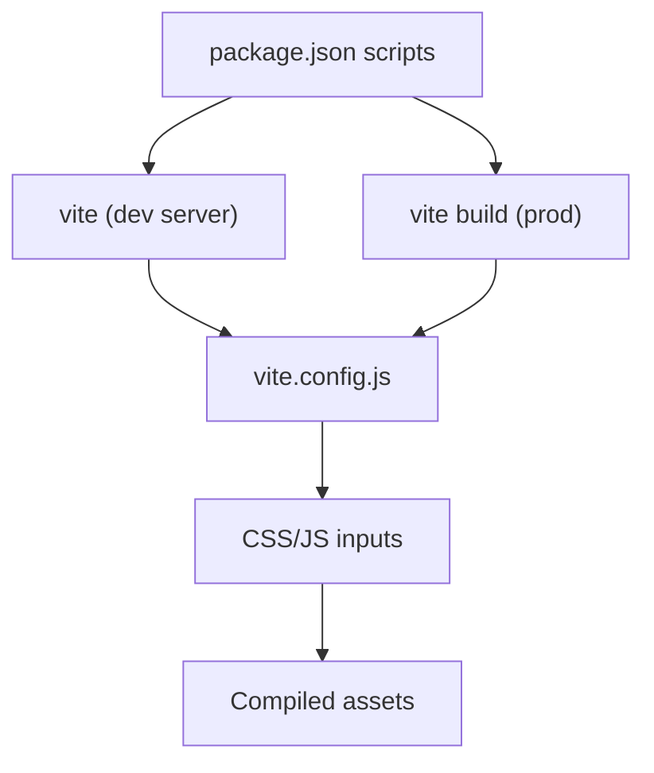
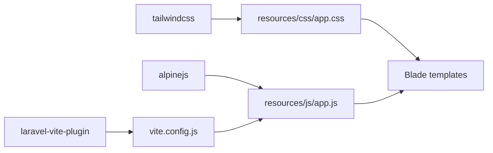

# JavaScript Integration

<cite>
**Referenced Files in This Document**
- [app.js](file://resources/js/app.js)
- [vite.config.js](file://vite.config.js)
- [package.json](file://package.json)
- [app.blade.php](file://resources/views/layouts/app.blade.php)
- [navigation.blade.php](file://resources/views/layouts/navigation.blade.php)
- [modal.blade.php](file://resources/views/components/modal.blade.php)
- [landing.blade.php](file://resources/views/landing.blade.php)
- [admin.blade.php](file://resources/views/layouts/admin.blade.php)
- [appointments/index.blade.php](file://resources/views/admin/appointments/index.blade.php)
- [web.php](file://routes/web.php)
- [clinicallog.css](file://resources/css/clinicallog.css)
</cite>

## Table of Contents
1. [Introduction](#introduction)
2. [Project Structure](#project-structure)
3. [Core Components](#core-components)
4. [Architecture Overview](#architecture-overview)
5. [Detailed Component Analysis](#detailed-component-analysis)
6. [Dependency Analysis](#dependency-analysis)
7. [Performance Considerations](#performance-considerations)
8. [Troubleshooting Guide](#troubleshooting-guide)
9. [Conclusion](#conclusion)

## Introduction
This document explains JavaScript integration and Alpine.js usage in ClinicalLog CMS. It covers interactive components such as mobile navigation, appointment modal, form handling, and dynamic content updates. It also documents the Vite build configuration, asset compilation, development server setup, module organization, ES6 imports/exports, Blade template integration, AJAX submission for the appointment form, error handling, loading states, user feedback mechanisms, performance optimization, bundle splitting strategies, and production deployment considerations.

## Project Structure
JavaScript and Alpine.js are integrated primarily via:
- A minimal ES module entry that initializes Alpine.js globally
- Vite configuration that compiles JS/CSS and enables hot reload
- Blade templates that embed Alpine directives and JavaScript behaviors
- Laravel routes that serve the SPA-like landing page and admin views

**Diagram sources**
- [vite.config.js:1-12](file://vite.config.js#L1-L12)
- [package.json:1-21](file://package.json#L1-L21)
- [app.js:1-8](file://resources/js/app.js#L1-L8)
- [landing.blade.php:1-598](file://resources/views/landing.blade.php#L1-L598)
- [app.blade.php:1-397](file://resources/views/layouts/app.blade.php#L1-L397)
- [admin.blade.php:1-150](file://resources/views/layouts/admin.blade.php#L1-L150)
- [navigation.blade.php:1-101](file://resources/views/layouts/navigation.blade.php#L1-L101)
- [modal.blade.php:1-79](file://resources/views/components/modal.blade.php#L1-L79)
- [web.php:1-77](file://routes/web.php#L1-L77)

**Section sources**
- [vite.config.js:1-12](file://vite.config.js#L1-L12)
- [package.json:1-21](file://package.json#L1-L21)
- [app.js:1-8](file://resources/js/app.js#L1-L8)
- [web.php:19-24](file://routes/web.php#L19-L24)

## Core Components
- Alpine.js initialization: A single ES module registers Alpine globally and starts it.
- Vite plugin: Laravel-Vite-plugin compiles Tailwind CSS and bundles the JS entry.
- Mobile navigation: Alpine-driven responsive navigation with reactive state.
- Appointment modal: A reusable modal component with focus trapping and keyboard handling.
- Landing page behaviors: Sticky navbar, mobile menu toggle, testimonial toggles, counters, and AJAX appointment submission.
- Admin layout behaviors: Sidebar toggle and click-outside-to-close.

**Section sources**
- [app.js:1-8](file://resources/js/app.js#L1-L8)
- [vite.config.js:4-10](file://vite.config.js#L4-L10)
- [navigation.blade.php:1-101](file://resources/views/layouts/navigation.blade.php#L1-L101)
- [modal.blade.php:17-78](file://resources/views/components/modal.blade.php#L17-L78)
- [app.blade.php:292-391](file://resources/views/layouts/app.blade.php#L292-L391)
- [admin.blade.php:134-145](file://resources/views/layouts/admin.blade.php#L134-L145)

## Architecture Overview
The JavaScript stack integrates Alpine.js directives with Blade-rendered HTML and Vite-compiled assets. Alpine directives power interactive UI states, while custom scripts handle AJAX submissions and DOM behaviors.

**Diagram sources**
- [landing.blade.php:454-461](file://resources/views/landing.blade.php#L454-L461)
- [app.blade.php:330-391](file://resources/views/layouts/app.blade.php#L330-L391)
- [web.php:26](file://routes/web.php#L26)
- [app.js:1-8](file://resources/js/app.js#L1-L8)

## Detailed Component Analysis

### Alpine.js Initialization
- Purpose: Expose Alpine globally and start it so directives work across templates.
- Integration: Imported by Vite and included via Blade’s @vite directive in guest layouts.

**Section sources**
- [app.js:1-8](file://resources/js/app.js#L1-L8)
- [vite.config.js:6-9](file://vite.config.js#L6-L9)

### Mobile Navigation (Responsive)
- Reactive state: x-data manages a boolean open state.
- Toggle: x-on@click toggles the state; SVG icons switch based on state.
- Responsive menu: x-bind:class conditionally shows/hides the mobile menu.
- Accessibility: aria-expanded and aria-controls attributes reflect state.

**Diagram sources**
- [navigation.blade.php:1-63](file://resources/views/layouts/navigation.blade.php#L1-L63)

**Section sources**
- [navigation.blade.php:1-63](file://resources/views/layouts/navigation.blade.php#L1-L63)

### Appointment Modal (Reusable)
- Props: name, show, maxWidth.
- Focus management: focusables(), firstFocusable(), nextFocusableIndex() compute focus order.
- Lifecycle: x-init watches show to manage body scroll and autofocus.
- Events: open/close-modal window events control visibility.
- Keyboard: escape closes; tab/shift+tab move focus within modal.

**Diagram sources**
- [modal.blade.php:17-47](file://resources/views/components/modal.blade.php#L17-L47)

**Section sources**
- [modal.blade.php:1-79](file://resources/views/components/modal.blade.php#L1-L79)

### Landing Page Interactive Behaviors
- Sticky navbar: scroll listener toggles a class for styling.
- Mobile menu: toggle button switches icons and opens/closes menu; links close it.
- Testimonial toggle: show/hide controls switch active class and visibility.
- Stats counters: animated counters simulate progress.
- Appointment modal: open/close handlers, form submission via fetch, loading/error handling, success message.

**Diagram sources**
- [app.blade.php:330-391](file://resources/views/layouts/app.blade.php#L330-L391)
- [web.php:26](file://routes/web.php#L26)

**Section sources**
- [app.blade.php:292-391](file://resources/views/layouts/app.blade.php#L292-L391)
- [landing.blade.php:454-461](file://resources/views/landing.blade.php#L454-L461)

### Admin Layout Interactions
- Sidebar toggle: mobile-friendly sidebar opens/closes.
- Click-outside: document-level click handler closes sidebar when clicking outside.

**Section sources**
- [admin.blade.php:103-145](file://resources/views/layouts/admin.blade.php#L103-L145)

### Appointment Management Table
- Status dropdown: live update via form submission.
- Delete action: confirmation dialog before DELETE request.
- Pagination: rendered via Blade paginator helpers.

**Section sources**
- [appointments/index.blade.php:60-89](file://resources/views/admin/appointments/index.blade.php#L60-L89)

### Vite Build Configuration and Asset Pipeline
- Inputs: CSS and JS entry configured for Laravel-Vite-plugin.
- Refresh: HMR enabled for rapid iteration.
- Dev/build scripts: npm scripts for dev and production builds.

**Diagram sources**
- [package.json:5-8](file://package.json#L5-L8)
- [vite.config.js:4-10](file://vite.config.js#L4-L10)

**Section sources**
- [vite.config.js:1-12](file://vite.config.js#L1-L12)
- [package.json:1-21](file://package.json#L1-L21)

### Module Organization and ES6 Imports/Exports
- Single import: Alpine.js imported and attached to window.
- No local modules: All custom logic is inline in Blade templates or compiled via Vite.

**Section sources**
- [app.js:1-8](file://resources/js/app.js#L1-L8)

### Blade Template Integration
- Guest layout: @vite injects compiled CSS/JS.
- App layout: @vite injects compiled assets; inline scripts augment Alpine behaviors.
- Components: Blade components encapsulate reusable UI (e.g., modal).

**Section sources**
- [landing.blade.php:1-598](file://resources/views/landing.blade.php#L1-L598)
- [app.blade.php:1-397](file://resources/views/layouts/app.blade.php#L1-L397)
- [admin.blade.php:1-150](file://resources/views/layouts/admin.blade.php#L1-L150)

## Dependency Analysis
- Alpine.js: Direct dependency via import and CDN usage in templates.
- Vite/Laravel-Vite-plugin: Build toolchain for JS/CSS bundling.
- Tailwind: CSS framework integrated via PostCSS pipeline.
- External libraries: Lucide icons and AOS loaded via CDN.

**Diagram sources**
- [package.json:12](file://package.json#L12)
- [vite.config.js:6-9](file://vite.config.js#L6-L9)
- [app.js:1-8](file://resources/js/app.js#L1-L8)

**Section sources**
- [package.json:1-21](file://package.json#L1-L21)
- [vite.config.js:1-12](file://vite.config.js#L1-L12)

## Performance Considerations
- Bundle size: Keep Alpine.js and external CDNs minimal; defer non-critical scripts if needed.
- Tree shaking: Ensure unused Alpine code is not bundled; avoid global Alpine usage if only a few components need it.
- Asset caching: Use long-lived cache headers for compiled assets; leverage versioned filenames in production.
- Lazy loading: Defer heavy animations until viewport; lazy-load images and videos.
- Minification: Enable production builds to minimize payload.
- Network: Prefer CDN-hosted libraries for reduced origin requests.

[No sources needed since this section provides general guidance]

## Troubleshooting Guide
- Alpine directives not working:
  - Ensure Alpine is initialized and global before templates render.
  - Verify @vite includes the compiled JS entry.
- Modal not closing or focus not trapped:
  - Confirm x-on:close and x-on:keydown handlers are present.
  - Check that x-data scope matches the component’s container.
- Appointment form fails silently:
  - Inspect network tab for fetch responses.
  - Verify CSRF token presence and route correctness.
  - Check error handling logic for precedence of errors vs message.
- Mobile menu not toggling:
  - Confirm inline script runs after DOM load.
  - Check for conflicting CSS causing display issues.

**Section sources**
- [app.js:1-8](file://resources/js/app.js#L1-L8)
- [modal.blade.php:42-47](file://resources/views/components/modal.blade.php#L42-L47)
- [app.blade.php:345-391](file://resources/views/layouts/app.blade.php#L345-L391)
- [navigation.blade.php:55-63](file://resources/views/layouts/navigation.blade.php#L55-L63)

## Conclusion
ClinicalLog CMS integrates Alpine.js with a minimal ES module entry and Vite-powered asset pipeline. Interactive components like mobile navigation and the appointment modal are implemented declaratively with Alpine directives and enhanced with inline scripts for AJAX and DOM behaviors. The Blade templates coordinate Alpine state, user feedback, and server-side routing. For production, enable optimized builds, cache assets effectively, and monitor network performance to maintain a responsive user experience.