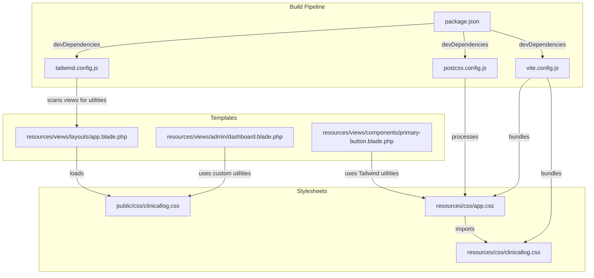
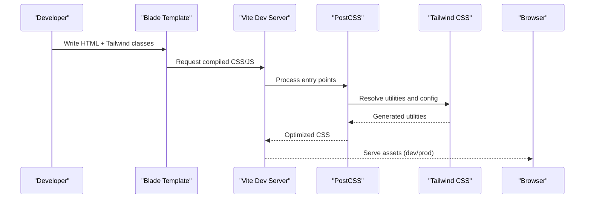
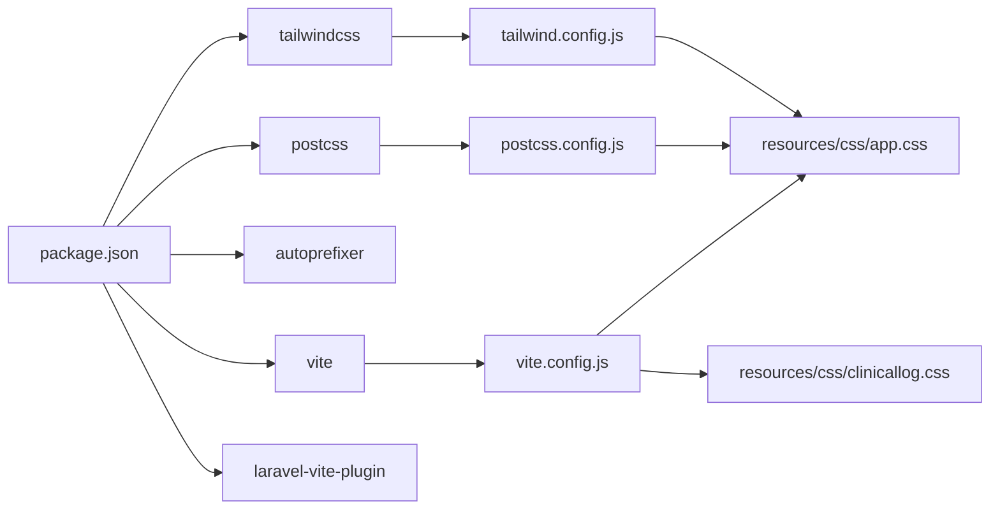

# Styling with Tailwind CSS

<cite>
**Referenced Files in This Document**
- [app.css](file://resources/css/app.css)
- [clinicallog.css](file://resources/css/clinicallog.css)
- [clinicallog.css](file://public/css/clinicallog.css)
- [tailwind.config.js](file://tailwind.config.js)
- [postcss.config.js](file://postcss.config.js)
- [vite.config.js](file://vite.config.js)
- [package.json](file://package.json)
- [app.blade.php](file://resources/views/layouts/app.blade.php)
- [dashboard.blade.php](file://resources/views/admin/dashboard.blade.php)
- [primary-button.blade.php](file://resources/views/components/primary-button.blade.php)
</cite>

## Table of Contents
1. [Introduction](#introduction)
2. [Project Structure](#project-structure)
3. [Core Components](#core-components)
4. [Architecture Overview](#architecture-overview)
5. [Detailed Component Analysis](#detailed-component-analysis)
6. [Dependency Analysis](#dependency-analysis)
7. [Performance Considerations](#performance-considerations)
8. [Troubleshooting Guide](#troubleshooting-guide)
9. [Conclusion](#conclusion)

## Introduction
This document explains the styling architecture of ClinicalLog CMS using Tailwind CSS. It covers the utility-first approach, custom color palette, spacing system, responsive design, and the custom CSS layer that extends Tailwind utilities. It also documents the Tailwind configuration, PostCSS pipeline, Vite asset compilation, and practical examples of component styling, responsive patterns, and performance optimization.

## Project Structure
The styling system is organized around:
- Tailwind base, components, and utilities imports in the main stylesheet
- A dedicated custom CSS file for brand-specific styles, animations, and layout utilities
- Tailwind configuration extending fonts and enabling the forms plugin
- PostCSS processing with Tailwind and Autoprefixer
- Vite bundling assets for development and production

**Diagram sources**
- [app.css:1-3](file://resources/css/app.css#L1-L3)
- [clinicallog.css:1-812](file://resources/css/clinicallog.css#L1-L812)
- [tailwind.config.js:1-22](file://tailwind.config.js#L1-L22)
- [postcss.config.js:1-7](file://postcss.config.js#L1-L7)
- [vite.config.js:1-12](file://vite.config.js#L1-L12)
- [package.json:1-21](file://package.json#L1-L21)
- [app.blade.php:1-397](file://resources/views/layouts/app.blade.php#L1-L397)
- [dashboard.blade.php:1-128](file://resources/views/admin/dashboard.blade.php#L1-L128)
- [primary-button.blade.php:1-4](file://resources/views/components/primary-button.blade.php#L1-L4)

**Section sources**
- [app.css:1-3](file://resources/css/app.css#L1-L3)
- [tailwind.config.js:1-22](file://tailwind.config.js#L1-L22)
- [postcss.config.js:1-7](file://postcss.config.js#L1-L7)
- [vite.config.js:1-12](file://vite.config.js#L1-L12)
- [package.json:1-21](file://package.json#L1-L21)
- [app.blade.php:1-397](file://resources/views/layouts/app.blade.php#L1-L397)

## Core Components
- Tailwind base, components, and utilities are imported via a single stylesheet to ensure consistent ordering and scanning.
- A custom CSS layer defines brand tokens, glass utilities, gradients, and reusable layout components.
- Tailwind is configured to scan Blade views and storage views for class usage and to extend fonts.
- PostCSS runs Tailwind and Autoprefixer to produce optimized CSS.
- Vite bundles and serves assets during development and builds production-ready assets.

Key implementation references:
- Tailwind imports: [app.css:1-3](file://resources/css/app.css#L1-L3)
- Brand tokens and utilities: [clinicallog.css:7-28](file://resources/css/clinicallog.css#L7-L28)
- Custom components and layout utilities: [clinicallog.css:139-273](file://resources/css/clinicallog.css#L139-L273)
- Tailwind configuration: [tailwind.config.js:5-21](file://tailwind.config.js#L5-L21)
- PostCSS configuration: [postcss.config.js:1-7](file://postcss.config.js#L1-L7)
- Vite configuration: [vite.config.js:4-11](file://vite.config.js#L4-L11)
- Asset loading in Blade: [app.blade.php:11-19](file://resources/views/layouts/app.blade.php#L11-L19)

**Section sources**
- [app.css:1-3](file://resources/css/app.css#L1-L3)
- [clinicallog.css:1-812](file://resources/css/clinicallog.css#L1-L812)
- [tailwind.config.js:5-21](file://tailwind.config.js#L5-L21)
- [postcss.config.js:1-7](file://postcss.config.js#L1-L7)
- [vite.config.js:4-11](file://vite.config.js#L4-L11)
- [app.blade.php:11-19](file://resources/views/layouts/app.blade.php#L11-L19)

## Architecture Overview
The styling pipeline integrates Tailwind utilities with custom CSS and follows a predictable build flow.

**Diagram sources**
- [app.css:1-3](file://resources/css/app.css#L1-L3)
- [tailwind.config.js:5-21](file://tailwind.config.js#L5-L21)
- [postcss.config.js:1-7](file://postcss.config.js#L1-L7)
- [vite.config.js:4-11](file://vite.config.js#L4-L11)
- [app.blade.php:11-19](file://resources/views/layouts/app.blade.php#L11-L19)

## Detailed Component Analysis

### Utility-First Approach and Tailwind Configuration
- Tailwind scans Blade views and compiled views for class usage, ensuring purged production builds remain lean.
- Fonts are extended to prioritize a custom family while retaining system fallbacks.
- The forms plugin enhances form controls consistently.

References:
- Content scanning globs: [tailwind.config.js:6-10](file://tailwind.config.js#L6-L10)
- Font extension: [tailwind.config.js:12-17](file://tailwind.config.js#L12-L17)
- Plugin enablement: [tailwind.config.js](file://tailwind.config.js#L20)

**Section sources**
- [tailwind.config.js:5-21](file://tailwind.config.js#L5-L21)

### Custom Color Palette and Tokens
- CSS custom properties define a cohesive light theme with brand colors, backgrounds, and typography tokens.
- Tokens are used across components for consistent spacing, borders, and shadows.

References:
- Token definitions: [clinicallog.css:7-28](file://resources/css/clinicallog.css#L7-L28)
- Usage in components: [clinicallog.css:139-273](file://resources/css/clinicallog.css#L139-L273)

**Section sources**
- [clinicallog.css:7-28](file://resources/css/clinicallog.css#L7-L28)
- [clinicallog.css:139-273](file://resources/css/clinicallog.css#L139-L273)

### Spacing System and Layout Utilities
- The custom CSS introduces container widths, section paddings, and alignment helpers.
- Responsive breakpoints are applied via media queries for mobile-first layouts.

References:
- Section and container utilities: [clinicallog.css:236-241](file://resources/css/clinicallog.css#L236-L241)
- Centering and alignment helpers: [clinicallog.css:777-797](file://resources/css/clinicallog.css#L777-L797)

**Section sources**
- [clinicallog.css:236-241](file://resources/css/clinicallog.css#L236-L241)
- [clinicallog.css:777-797](file://resources/css/clinicallog.css#L777-L797)

### Responsive Design Patterns
- Breakpoints are implemented using max-width media queries targeting tablet and mobile screens.
- Components adapt grid layouts, typography scaling, and spacing at different viewport widths.

References:
- Mobile navbar and menu: [clinicallog.css:206-234](file://resources/css/clinicallog.css#L206-L234)
- Hero grid responsiveness: [clinicallog.css:283-284](file://resources/css/clinicallog.css#L283-L284)
- Feature and benefit grids: [clinicallog.css:366-368](file://resources/css/clinicallog.css#L366-L368), [clinicallog.css:429-431](file://resources/css/clinicallog.css#L429-L431)

**Section sources**
- [clinicallog.css:206-234](file://resources/css/clinicallog.css#L206-L234)
- [clinicallog.css:283-284](file://resources/css/clinicallog.css#L283-L284)
- [clinicallog.css:366-368](file://resources/css/clinicallog.css#L366-L368)
- [clinicallog.css:429-431](file://resources/css/clinicallog.css#L429-L431)

### Dark Mode Considerations
- The current custom CSS targets a light theme with brand tokens and glass effects.
- No explicit dark mode classes or runtime toggles are present in the scanned files.

Recommendations:
- Introduce a data attribute or class on the root element to toggle modes.
- Define dark-mode variants for tokens and components.
- Use Tailwind’s dark mode strategy or manual overrides.

[No sources needed since this section provides general guidance]

### Custom CSS Additions Beyond Tailwind Utilities
- Glass utilities, gradient text, and gradient buttons encapsulate brand-specific visuals.
- Navigation, hero, feature, pricing, and admin components reuse these utilities.
- Animations and interactive states are defined for enhanced UX.

References:
- Glass utilities: [clinicallog.css:60-78](file://resources/css/clinicallog.css#L60-L78)
- Gradient text: [clinicallog.css:80-92](file://resources/css/clinicallog.css#L80-L92)
- Buttons: [clinicallog.css:94-137](file://resources/css/clinicallog.css#L94-L137)
- Navbar: [clinicallog.css:139-187](file://resources/css/clinicallog.css#L139-L187)
- Hero: [clinicallog.css:274-363](file://resources/css/clinicallog.css#L274-L363)
- Features: [clinicallog.css:365-394](file://resources/css/clinicallog.css#L365-L394)
- Pricing: [clinicallog.css:513-574](file://resources/css/clinicallog.css#L513-L574)
- Admin layout: [clinicallog.css:671-713](file://resources/css/clinicallog.css#L671-L713)

**Section sources**
- [clinicallog.css:60-78](file://resources/css/clinicallog.css#L60-L78)
- [clinicallog.css:80-92](file://resources/css/clinicallog.css#L80-L92)
- [clinicallog.css:94-137](file://resources/css/clinicallog.css#L94-L137)
- [clinicallog.css:139-187](file://resources/css/clinicallog.css#L139-L187)
- [clinicallog.css:274-363](file://resources/css/clinicallog.css#L274-L363)
- [clinicallog.css:365-394](file://resources/css/clinicallog.css#L365-L394)
- [clinicallog.css:513-574](file://resources/css/clinicallog.css#L513-L574)
- [clinicallog.css:671-713](file://resources/css/clinicallog.css#L671-L713)

### Practical Examples of Component Styling
- Admin dashboard uses custom grid and glass utilities alongside Tailwind spacing.
- Blade components combine Tailwind utilities with custom button classes.

References:
- Admin dashboard grid and cards: [dashboard.blade.php:22-64](file://resources/views/admin/dashboard.blade.php#L22-L64), [dashboard.blade.php:67-125](file://resources/views/admin/dashboard.blade.php#L67-L125)
- Primary button component: [primary-button.blade.php:1-3](file://resources/views/components/primary-button.blade.php#L1-L3)

**Section sources**
- [dashboard.blade.php:22-125](file://resources/views/admin/dashboard.blade.php#L22-L125)
- [primary-button.blade.php:1-3](file://resources/views/components/primary-button.blade.php#L1-L3)

### PostCSS Processing Pipeline and Asset Compilation
- PostCSS applies Tailwind directives and Autoprefixer for vendor prefixes.
- Vite manages development and production builds, serving assets and enabling hot reload.

References:
- PostCSS plugins: [postcss.config.js:1-7](file://postcss.config.js#L1-L7)
- Vite entry points: [vite.config.js:4-11](file://vite.config.js#L4-L11)
- Build scripts: [package.json:5-8](file://package.json#L5-L8)

**Section sources**
- [postcss.config.js:1-7](file://postcss.config.js#L1-L7)
- [vite.config.js:4-11](file://vite.config.js#L4-L11)
- [package.json:5-8](file://package.json#L5-L8)

## Dependency Analysis
The styling stack relies on Tailwind, PostCSS, and Vite. Dependencies are declared in package.json and wired through configuration files.

**Diagram sources**
- [package.json:9-19](file://package.json#L9-L19)
- [tailwind.config.js:1-22](file://tailwind.config.js#L1-L22)
- [postcss.config.js:1-7](file://postcss.config.js#L1-L7)
- [vite.config.js:1-12](file://vite.config.js#L1-L12)
- [app.css:1-3](file://resources/css/app.css#L1-L3)
- [clinicallog.css:1-812](file://resources/css/clinicallog.css#L1-L812)

**Section sources**
- [package.json:9-19](file://package.json#L9-L19)
- [tailwind.config.js:1-22](file://tailwind.config.js#L1-L22)
- [postcss.config.js:1-7](file://postcss.config.js#L1-L7)
- [vite.config.js:1-12](file://vite.config.js#L1-L12)
- [app.css:1-3](file://resources/css/app.css#L1-L3)
- [clinicallog.css:1-812](file://resources/css/clinicallog.css#L1-L812)

## Performance Considerations
- Keep Tailwind content globs precise to avoid scanning unnecessary files and reduce purge size.
- Prefer utility classes over ad-hoc custom CSS to leverage purging.
- Minimize custom CSS to essential brand tokens and reusable components.
- Use lazy-loading and aspect-ratio utilities for images to improve CLS and LCP.
- Enable CSS source maps only in development; disable in production.
- Split critical above-the-fold CSS and defer non-critical styles.

[No sources needed since this section provides general guidance]

## Troubleshooting Guide
Common issues and resolutions:
- Classes not generated
  - Ensure Tailwind scans the correct paths and that the template files are included.
  - Reference: [tailwind.config.js:6-10](file://tailwind.config.js#L6-L10)
- Styles not applied in Blade
  - Confirm the compiled CSS is loaded and paths are correct.
  - Reference: [app.blade.php:11-19](file://resources/views/layouts/app.blade.php#L11-L19)
- PostCSS errors
  - Verify plugin order and versions match configuration.
  - Reference: [postcss.config.js:1-7](file://postcss.config.js#L1-L7)
- Vite build failures
  - Check entry points and plugin compatibility.
  - Reference: [vite.config.js:4-11](file://vite.config.js#L4-L11), [package.json:5-8](file://package.json#L5-L8)

**Section sources**
- [tailwind.config.js:6-10](file://tailwind.config.js#L6-L10)
- [app.blade.php:11-19](file://resources/views/layouts/app.blade.php#L11-L19)
- [postcss.config.js:1-7](file://postcss.config.js#L1-L7)
- [vite.config.js:4-11](file://vite.config.js#L4-L11)
- [package.json:5-8](file://package.json#L5-L8)

## Conclusion
ClinicalLog CMS employs a clean, maintainable styling architecture centered on Tailwind’s utility-first philosophy, extended by a focused custom CSS layer. The build pipeline integrates Tailwind, PostCSS, and Vite to deliver fast, responsive, and consistent UI components. By adhering to the established patterns and configurations, teams can scale styling efficiently while preserving performance and accessibility.