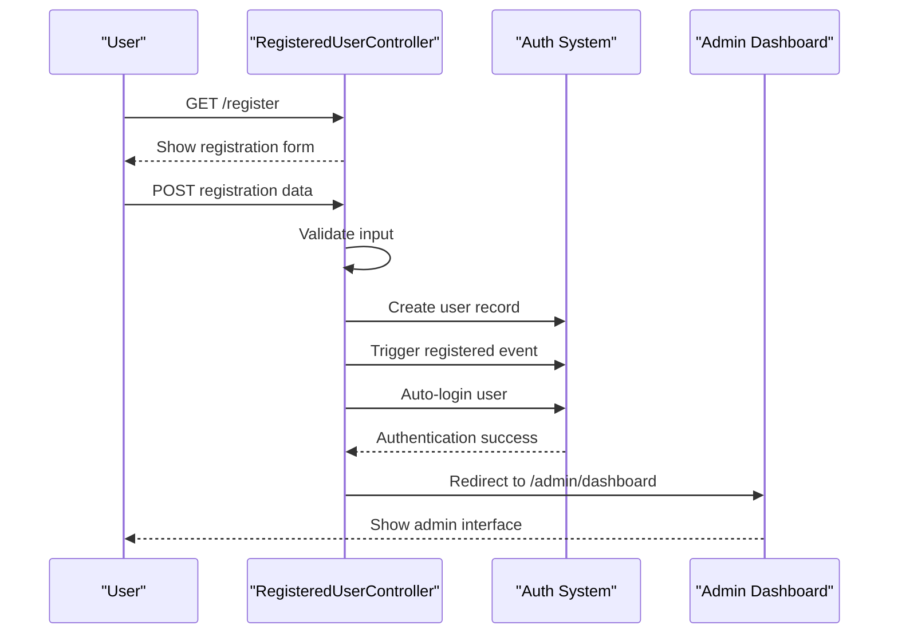
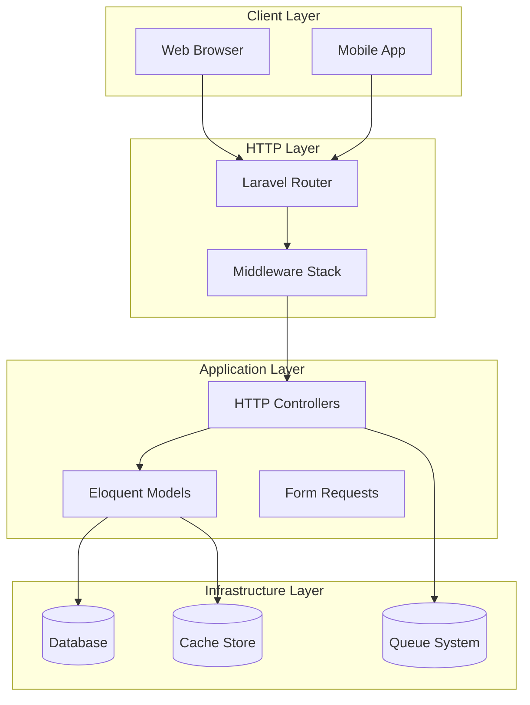
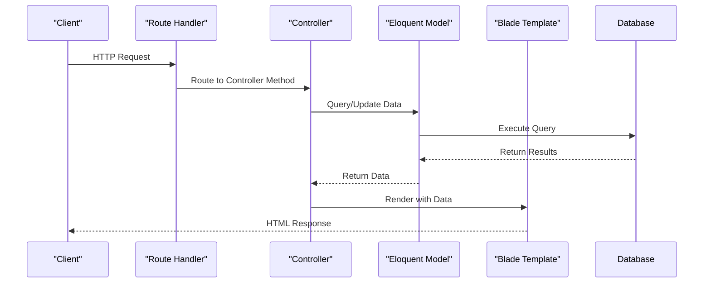
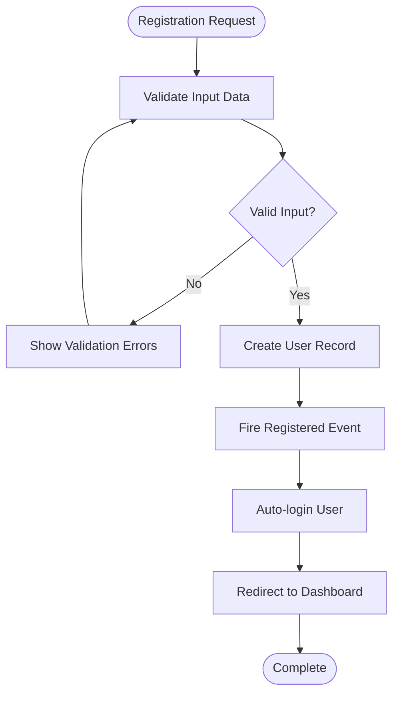
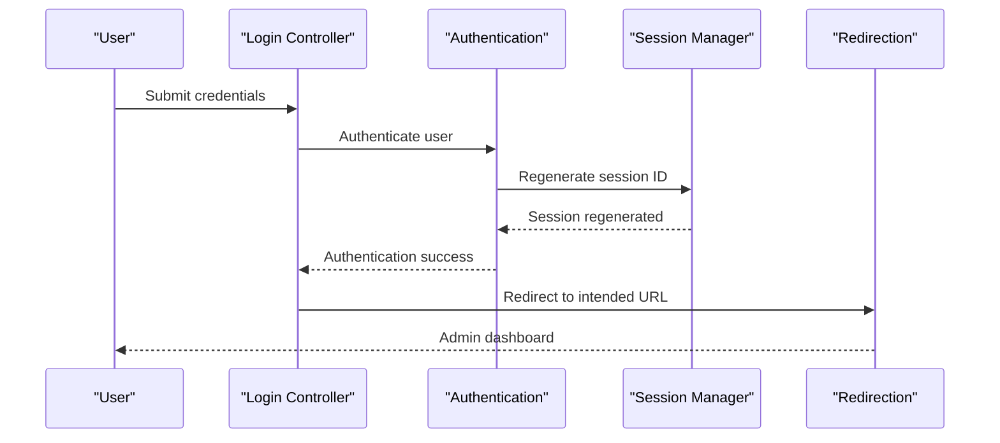
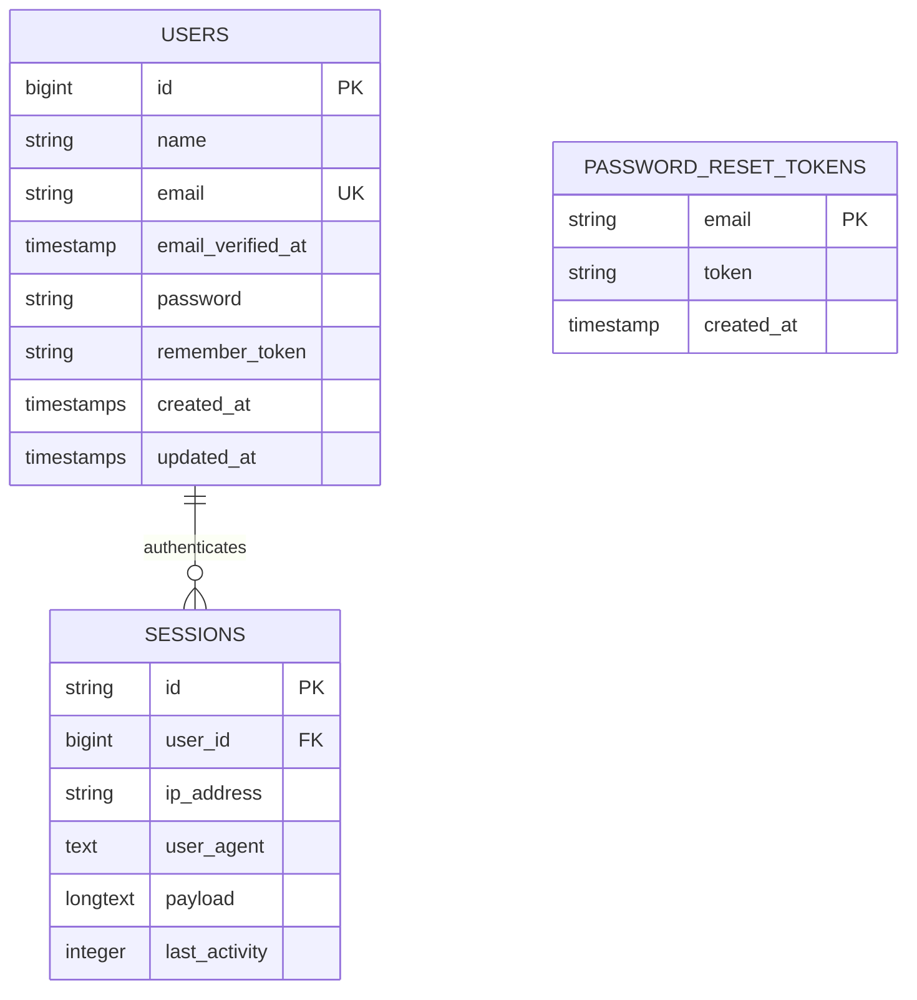
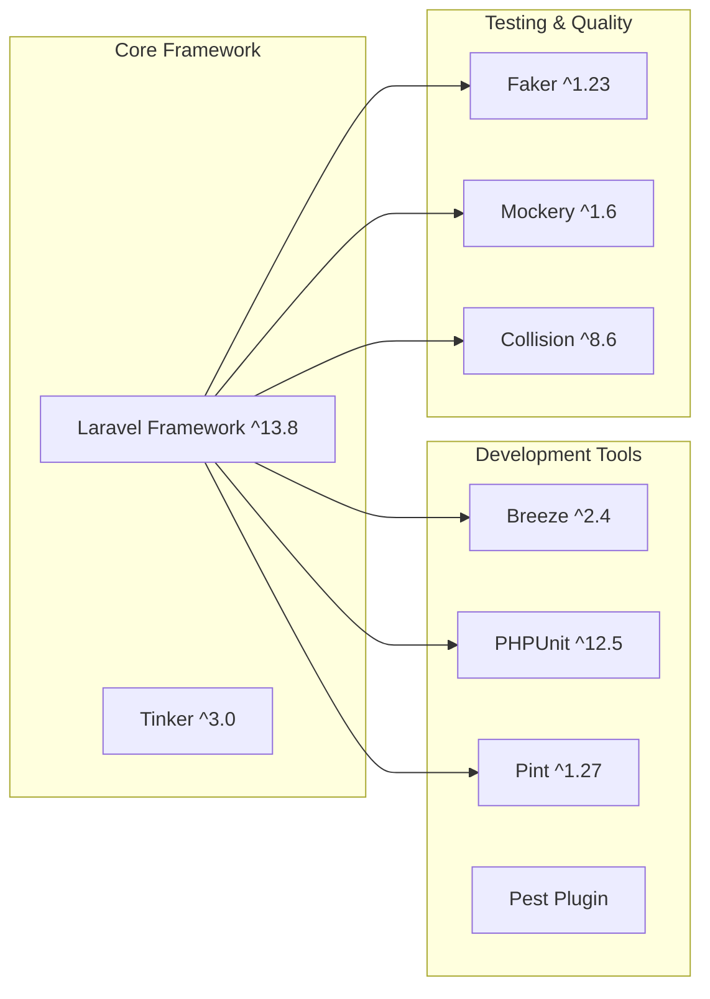
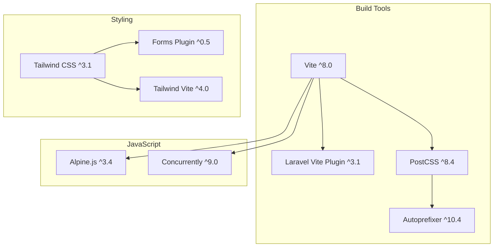

# Getting Started

<cite>
**Referenced Files in This Document**
- [composer.json](file://composer.json)
- [package.json](file://package.json)
- [README.md](file://README.md)
- [config/app.php](file://config/app.php)
- [config/database.php](file://config/database.php)
- [bootstrap/app.php](file://bootstrap/app.php)
- [routes/web.php](file://routes/web.php)
- [vite.config.js](file://vite.config.js)
- [tailwind.config.js](file://tailwind.config.js)
- [postcss.config.js](file://postcss.config.js)
- [database/migrations/0001_01_01_000000_create_users_table.php](file://database/migrations/0001_01_01_000000_create_users_table.php)
- [app/Http/Controllers/Auth/RegisteredUserController.php](file://app/Http/Controllers/Auth/RegisteredUserController.php)
- [app/Http/Controllers/Auth/AuthenticatedSessionController.php](file://app/Http/Controllers/Auth/AuthenticatedSessionController.php)
- [resources/views/auth/register.blade.php](file://resources/views/auth/register.blade.php)
</cite>

## Table of Contents
1. [Introduction](#introduction)
2. [Prerequisites](#prerequisites)
3. [Installation](#installation)
4. [Development Server Setup](#development-server-setup)
5. [First-Time Setup](#first-time-setup)
6. [Basic Configuration](#basic-configuration)
7. [Architecture Overview](#architecture-overview)
8. [Detailed Component Analysis](#detailed-component-analysis)
9. [Dependency Analysis](#dependency-analysis)
10. [Performance Considerations](#performance-considerations)
11. [Troubleshooting Guide](#troubleshooting-guide)
12. [Conclusion](#conclusion)

## Introduction
ClinicalLog CMS is a Laravel-based content management system designed for medical data management and e-logbook platforms. Built with Laravel 13.8 and PHP 8.3+, it provides a modern foundation for healthcare information systems with integrated appointment management, landing page customization, and feature administration capabilities.

The system follows Laravel's standard MVC architecture with Blade templating, Eloquent ORM, and a comprehensive admin interface. It supports multiple database backends including SQLite, MySQL, MariaDB, PostgreSQL, and SQL Server, making it adaptable to various deployment environments.

## Prerequisites
Before installing ClinicalLog CMS, ensure your development environment meets the following requirements:

### PHP and Laravel Requirements
- PHP 8.3 or higher (required)
- Laravel Framework 13.8 or compatible
- OpenSSL PHP extension
- PDO PHP extension
- Mbstring PHP extension
- Tokenizer PHP extension
- XML PHP extension
- Ctype PHP extension
- JSON PHP extension
- PCRE PHP extension

### Database Requirements
The application supports multiple database systems:

**SQLite (Default)**
- SQLite3 support enabled
- Write permissions to the database directory
- Database file located at `database/database.sqlite`

**MySQL/MariaDB**
- MySQL 5.7+ or MariaDB equivalent
- PDO MySQL extension
- Required privileges for database creation and schema modifications

**PostgreSQL**
- PostgreSQL 9.6+ (tested)
- PDO PostgreSQL extension
- Required privileges for schema operations

**SQL Server**
- SQL Server 2019+ (tested)
- SQL Server Native Client or ODBC driver
- PDO SQLSRV extension

### Development Tools
- Composer 2.x or higher
- Node.js 18.x or higher
- NPM 8.x or higher
- Git for version control

### Optional but Recommended
- Laravel Valet for macOS/Linux development
- Laravel Pail for log monitoring
- Laravel Breeze for authentication scaffolding

**Section sources**
- [composer.json:8-12](file://composer.json#L8-L12)
- [composer.json:9](file://composer.json#L9)
- [config/database.php:20](file://config/database.php#L20)
- [config/database.php:35-115](file://config/database.php#L35-L115)

## Installation

### Step 1: Clone the Repository
Clone the ClinicalLog CMS repository to your local development environment:

```bash
git clone https://github.com/clinicallog/clinicallog-cms.git
cd clinicallog-cms
```

### Step 2: Install PHP Dependencies
Install all PHP dependencies using Composer:

```bash
composer install
```

This command installs all required Laravel packages and development dependencies specified in the `composer.json` file.

### Step 3: Environment Configuration
Copy the example environment file and generate the application key:

```bash
cp .env.example .env
php artisan key:generate
```

The environment configuration includes:
- Application name and URL settings
- Database connection defaults (SQLite)
- Session and cache configuration
- Maintenance mode settings

### Step 4: Database Setup
Configure your database connection in the `.env` file. The default SQLite configuration requires no additional setup, but for production databases:

```env
DB_CONNECTION=mysql
DB_HOST=127.0.0.1
DB_PORT=3306
DB_DATABASE=clinicallog_cms
DB_USERNAME=your_username
DB_PASSWORD=your_password
```

For SQLite, ensure the database directory is writable:
```env
DB_CONNECTION=sqlite
DB_DATABASE=/full/path/to/database.sqlite
```

### Step 5: Run Database Migrations
Execute the initial database migrations:

```bash
php artisan migrate
```

The migration creates essential tables including:
- Users table with authentication fields
- Password reset tokens table
- Sessions table for user authentication
- Additional tables for features, landing pages, and appointments

### Step 6: Install Frontend Dependencies
Install JavaScript dependencies using NPM:

```bash
npm install
```

### Step 7: Build Assets
Compile frontend assets using Vite:

```bash
npm run build
```

**Section sources**
- [composer.json:35-69](file://composer.json#L35-L69)
- [composer.json:36-43](file://composer.json#L36-L43)
- [config/database.php:20](file://config/database.php#L20)
- [database/migrations/0001_01_01_000000_create_users_table.php:12-38](file://database/migrations/0001_01_01_000000_create_users_table.php#L12-L38)

## Development Server Setup

### Option A: Laravel Valet (Recommended for macOS)
Install Laravel Valet globally and link the project:

```bash
composer global require laravel/valet
valet install
valet link clinicallog-cms
valet secure clinicallog-cms
```

Valet automatically configures a `.test` domain and HTTPS certificate for local development.

### Option B: Built-in PHP Server
Start the development server using Laravel's built-in server:

```bash
php artisan serve
```

Access the application at `http://127.0.0.1:8000`.

### Option C: NPM Vite Development Server
For hot-reload development with frontend assets:

```bash
npm run dev
```

This starts Vite's development server alongside Laravel's queue listener and log monitor.

### Option D: Production-like Setup
For a complete development environment with all Laravel features:

```bash
composer run-script dev
```

This command runs multiple processes simultaneously:
- Laravel development server
- Queue worker for background jobs
- Log monitoring with Laravel Pail
- Vite asset compilation with hot reload

**Section sources**
- [bootstrap/app.php:8-24](file://bootstrap/app.php#L8-L24)
- [vite.config.js:1-12](file://vite.config.js#L1-L12)
- [composer.json:44-47](file://composer.json#L44-L47)

## First-Time Setup

### Initial User Registration
After completing the installation, register the first administrator account:

1. Navigate to the registration page: `/register`
2. Fill in the required fields:
   - Full Name: Enter your administrative name
   - Email: Use a valid email address
   - Password: Minimum 8 characters with mixed case and numbers
   - Confirm Password: Repeat the password

3. Submit the registration form

The registration process validates input according to Laravel's password policy and creates a verified administrator user.

### Automatic Dashboard Access
Upon successful registration, users are automatically logged in and redirected to the admin dashboard (`/admin/dashboard`). The dashboard displays:
- Total count of features
- Total count of users
- Recent features (last 5)
- Total appointment count

### Authentication Flow
The authentication system handles both registration and login scenarios:



**Diagram sources**
- [app/Http/Controllers/Auth/RegisteredUserController.php:31-49](file://app/Http/Controllers/Auth/RegisteredUserController.php#L31-L49)
- [resources/views/auth/register.blade.php:34-84](file://resources/views/auth/register.blade.php#L34-L84)

**Section sources**
- [app/Http/Controllers/Auth/RegisteredUserController.php:21-50](file://app/Http/Controllers/Auth/RegisteredUserController.php#L21-L50)
- [routes/web.php:37-45](file://routes/web.php#L37-L45)

## Basic Configuration

### Application Settings
Configure the application in the `.env` file:

**Application Details**
```env
APP_NAME="ClinicalLog CMS"
APP_ENV=local
APP_KEY=
APP_DEBUG=true
APP_URL=http://localhost
```

**Database Configuration**
```env
DB_CONNECTION=sqlite
# For MySQL/MariaDB:
# DB_CONNECTION=mysql
# DB_HOST=127.0.0.1
# DB_PORT=3306
# DB_DATABASE=clinicallog_cms
# DB_USERNAME=your_username
# DB_PASSWORD=your_password
```

**Localization Settings**
```env
APP_LOCALE=en
APP_FALLBACK_LOCALE=en
APP_FAKER_LOCALE=en_US
```

### Asset Compilation
Configure frontend asset compilation in `vite.config.js`:

```javascript
export default {
    plugins: [
        laravel({
            input: ['resources/css/app.css', 'resources/js/app.js'],
            refresh: true,
        }),
    ],
};
```

Tailwind CSS is configured for responsive design with custom form styling and font family extensions.

### Middleware Configuration
The application uses Laravel's default middleware stack with custom redirects:
- Guests redirected to `/login`
- Authenticated users redirected to `/admin/dashboard`

**Section sources**
- [config/app.php:16-100](file://config/app.php#L16-L100)
- [config/database.php:35-115](file://config/database.php#L35-L115)
- [vite.config.js:4-11](file://vite.config.js#L4-L11)
- [tailwind.config.js:5-21](file://tailwind.config.js#L5-L21)
- [bootstrap/app.php:14-19](file://bootstrap/app.php#L14-L19)

## Architecture Overview

ClinicalLog CMS follows Laravel's standard MVC architecture with the following key components:



**Diagram sources**
- [bootstrap/app.php:8-24](file://bootstrap/app.php#L8-L24)
- [routes/web.php:1-77](file://routes/web.php#L1-L77)
- [config/database.php:33-117](file://config/database.php#L33-L117)

### Request Flow Architecture
The application processes requests through a well-defined flow:



**Diagram sources**
- [routes/web.php:19-35](file://routes/web.php#L19-L35)
- [app/Http/Controllers/Auth/AuthenticatedSessionController.php:25-31](file://app/Http/Controllers/Auth/AuthenticatedSessionController.php#L25-L31)

## Detailed Component Analysis

### Authentication System
The authentication system provides comprehensive user management with registration, login, and password reset capabilities.

#### Registration Process
The registration flow validates user input and creates authenticated administrator accounts:



**Diagram sources**
- [app/Http/Controllers/Auth/RegisteredUserController.php:31-49](file://app/Http/Controllers/Auth/RegisteredUserController.php#L31-L49)

#### Login Process
The login system manages user authentication with session regeneration and intended URL handling:



**Diagram sources**
- [app/Http/Controllers/Auth/AuthenticatedSessionController.php:25-31](file://app/Http/Controllers/Auth/AuthenticatedSessionController.php#L25-L31)

**Section sources**
- [app/Http/Controllers/Auth/RegisteredUserController.php:16-51](file://app/Http/Controllers/Auth/RegisteredUserController.php#L16-L51)
- [app/Http/Controllers/Auth/AuthenticatedSessionController.php:12-47](file://app/Http/Controllers/Auth/AuthenticatedSessionController.php#L12-L47)

### Database Schema Overview
The application uses Laravel's migration system to manage database schema evolution:



**Diagram sources**
- [database/migrations/0001_01_01_000000_create_users_table.php:14-37](file://database/migrations/0001_01_01_000000_create_users_table.php#L14-L37)

**Section sources**
- [database/migrations/0001_01_01_000000_create_users_table.php:1-50](file://database/migrations/0001_01_01_000000_create_users_table.php#L1-L50)

## Dependency Analysis

### PHP Dependencies
The application has the following core PHP dependencies:



**Diagram sources**
- [composer.json:8-22](file://composer.json#L8-L22)

### Frontend Dependencies
The frontend stack consists of modern JavaScript tooling:



**Diagram sources**
- [package.json:9-19](file://package.json#L9-L19)

**Section sources**
- [composer.json:8-22](file://composer.json#L8-L22)
- [package.json:1-21](file://package.json#L1-L21)

## Performance Considerations

### Database Optimization
- **Connection Pooling**: Configure appropriate database connection limits based on expected concurrent users
- **Indexing Strategy**: Ensure proper indexing on frequently queried columns like email addresses and timestamps
- **Query Optimization**: Use eager loading for relationships to prevent N+1 query problems
- **Caching**: Implement Redis caching for frequently accessed configuration data

### Asset Performance
- **Vite Build Optimization**: Enable production builds for optimized asset delivery
- **Tailwind Purge**: Configure purging to remove unused CSS in production
- **Image Optimization**: Compress images stored in the public storage directory
- **CDN Integration**: Serve static assets through a CDN for improved global performance

### Memory Management
- **PHP Memory Limits**: Set appropriate memory limits for long-running processes
- **Queue Workers**: Scale queue workers based on job volume and complexity
- **Session Storage**: Consider Redis for session storage in distributed environments

## Troubleshooting Guide

### Common Installation Issues

#### PHP Version Compatibility
**Issue**: Composer fails with PHP version error
**Solution**: Ensure PHP 8.3+ is installed and matches the project requirements
```bash
php -v
composer install
```

#### Database Connection Problems
**Issue**: Migration fails with database connection error
**Solution**: Verify database credentials and connection settings in `.env`
```bash
# Check database connectivity
php artisan tinker
>>> DB::connection()->getPdo()

# Re-run migrations
php artisan migrate:fresh
```

#### Permission Issues
**Issue**: Storage directory not writable
**Solution**: Set proper permissions for storage and cache directories
```bash
chmod -R 755 storage
chmod -R 755 bootstrap/cache
chown -R www-data:www-data storage
```

#### Asset Compilation Failures
**Issue**: Vite build fails with module resolution errors
**Solution**: Clear node_modules and reinstall dependencies
```bash
rm -rf node_modules
npm install
npm run build
```

#### Authentication Issues
**Issue**: Users cannot log in after registration
**Solution**: Check session configuration and cookie settings
```bash
# Clear application cache
php artisan cache:clear
php artisan config:clear
php artisan route:clear
php artisan view:clear

# Regenerate application key
php artisan key:generate
```

### Development Environment Issues

#### Valet Domain Resolution
**Issue**: Valet domain not resolving
**Solution**: Reinstall Valet and re-link the project
```bash
valet uninstall
valet install
valet link clinicallog-cms
```

#### Hot Reload Not Working
**Issue**: Vite hot reload not functioning
**Solution**: Restart development servers and clear browser cache
```bash
# Stop existing processes
pkill -f "artisan serve"
pkill -f "npm run dev"

# Start fresh
composer run-script dev
```

**Section sources**
- [composer.json:52-69](file://composer.json#L52-L69)
- [config/database.php:35-115](file://config/database.php#L35-L115)

## Conclusion
ClinicalLog CMS provides a robust foundation for healthcare information management systems. With its Laravel 13.8 architecture, comprehensive authentication system, and flexible database support, it offers developers a solid platform for building medical data management solutions.

The installation process is streamlined through Composer scripts and Laravel's standardized conventions. The modular design allows for easy customization while maintaining security and performance standards.

Key advantages of this setup include:
- **Modern Development Experience**: Laravel Breeze integration and Vite asset pipeline
- **Flexible Database Support**: Multi-database backend compatibility
- **Comprehensive Administration**: Built-in CMS functionality for content management
- **Developer-Friendly**: Extensive documentation and testing infrastructure

For production deployments, ensure proper security configurations, database optimization, and monitoring setup. The modular architecture facilitates scaling and customization based on specific healthcare requirements.