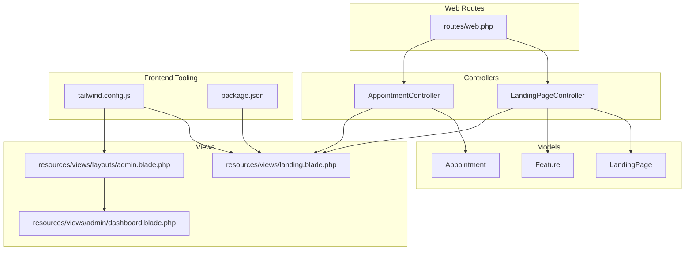
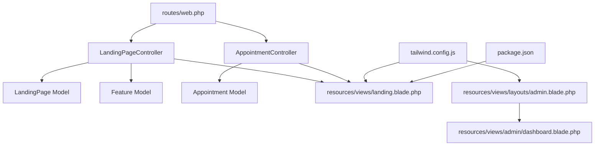
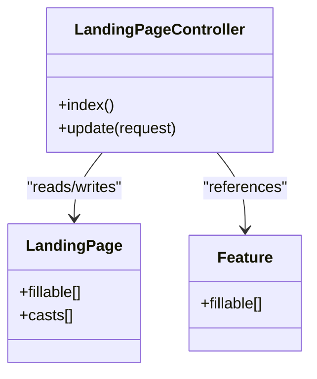
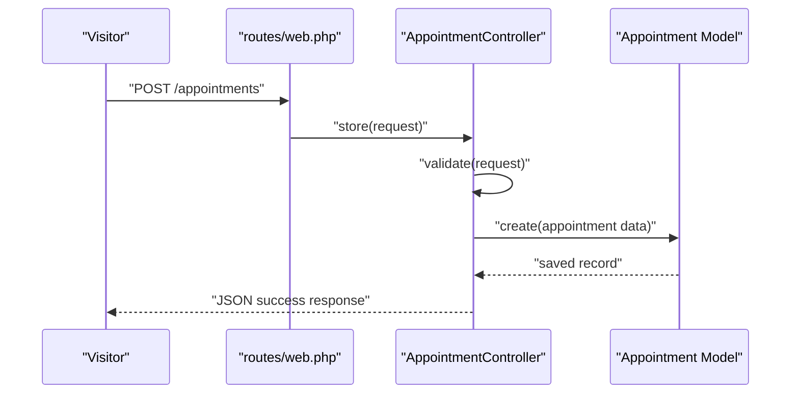
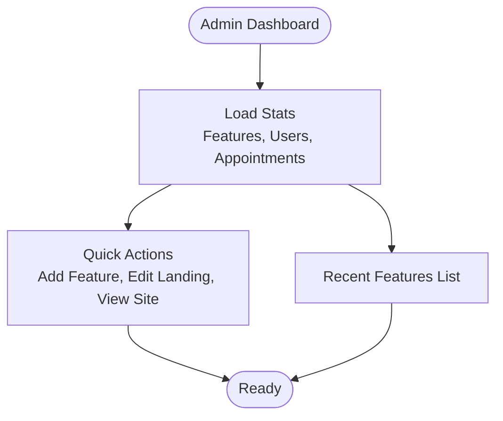
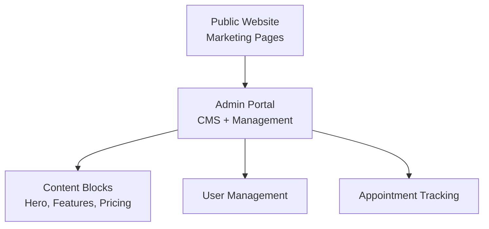
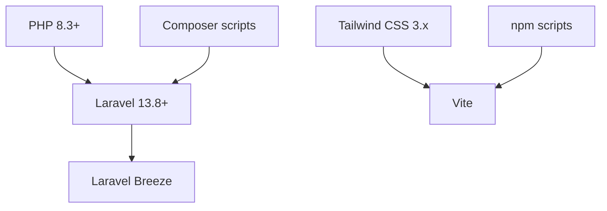

# Project Overview

<cite>
**Referenced Files in This Document**
- [README.md](file://README.md)
- [composer.json](file://composer.json)
- [package.json](file://package.json)
- [tailwind.config.js](file://tailwind.config.js)
- [routes/web.php](file://routes/web.php)
- [app/Http/Controllers/LandingPageController.php](file://app/Http/Controllers/LandingPageController.php)
- [app/Http/Controllers/AppointmentController.php](file://app/Http/Controllers/AppointmentController.php)
- [app/Models/LandingPage.php](file://app/Models/LandingPage.php)
- [app/Models/Feature.php](file://app/Models/Feature.php)
- [app/Models/Appointment.php](file://app/Models/Appointment.php)
- [database/migrations/2026_06_17_031941_create_landing_pages_table.php](file://database/migrations/2026_06_17_031941_create_landing_pages_table.php)
- [database/migrations/2026_06_17_060200_create_features_table.php](file://database/migrations/2026_06_17_060200_create_features_table.php)
- [database/migrations/2026_06_22_024652_create_appointments_table.php](file://database/migrations/2026_06_22_024652_create_appointments_table.php)
- [resources/views/landing.blade.php](file://resources/views/landing.blade.php)
- [resources/views/layouts/admin.blade.php](file://resources/views/layouts/admin.blade.php)
- [resources/views/admin/dashboard.blade.php](file://resources/views/admin/dashboard.blade.php)
</cite>

## Table of Contents
1. [Introduction](#introduction)
2. [Project Structure](#project-structure)
3. [Core Components](#core-components)
4. [Architecture Overview](#architecture-overview)
5. [Detailed Component Analysis](#detailed-component-analysis)
6. [Dependency Analysis](#dependency-analysis)
7. [Performance Considerations](#performance-considerations)
8. [Troubleshooting Guide](#troubleshooting-guide)
9. [Conclusion](#conclusion)

## Introduction
ClinicalLog CMS is a Laravel-based Content Management System designed specifically for medical education institutions. It serves dual roles: as a content management system for marketing websites and as a platform that powers user-facing interfaces for prospective clients. Its core value proposition lies in enabling institutions to manage their marketing presence, showcase features, collect appointment requests, and maintain user administration—all within a single cohesive Laravel application.

Key capabilities include:
- Landing page management with dynamic sections (hero, about, features, benefits, dashboard preview, steps, testimonials, CTA, pricing)
- Appointment scheduling workflows for prospective clients
- User administration for managing institutional users
- Marketing-focused presentation layer optimized for medical education audiences

Target audience:
- Medical schools, faculties, and departments seeking a centralized system to manage their digital presence and client engagement
- Administrators and staff responsible for content updates, lead capture, and user management

## Project Structure
The project follows Laravel’s conventional MVC structure with clear separation between controllers, models, views, and routes. The application integrates Blade templates for both guest-facing pages and administrative dashboards, and uses Tailwind CSS with Vite for modern front-end tooling.

**Diagram sources**
- [routes/web.php:19-76](file://routes/web.php#L19-L76)
- [app/Http/Controllers/LandingPageController.php:11-221](file://app/Http/Controllers/LandingPageController.php#L11-L221)
- [app/Http/Controllers/AppointmentController.php:14-75](file://app/Http/Controllers/AppointmentController.php#L14-L75)
- [app/Models/LandingPage.php:9-57](file://app/Models/LandingPage.php#L9-L57)
- [app/Models/Feature.php:9-15](file://app/Models/Feature.php#L9-L15)
- [app/Models/Appointment.php:9-18](file://app/Models/Appointment.php#L9-L18)
- [resources/views/landing.blade.php:1-597](file://resources/views/landing.blade.php#L1-L597)
- [resources/views/layouts/admin.blade.php:1-156](file://resources/views/layouts/admin.blade.php#L1-L156)
- [resources/views/admin/dashboard.blade.php:1-128](file://resources/views/admin/dashboard.blade.php#L1-L128)
- [tailwind.config.js:5-21](file://tailwind.config.js#L5-L21)
- [package.json:5-19](file://package.json#L5-L19)

**Section sources**
- [routes/web.php:19-76](file://routes/web.php#L19-L76)
- [resources/views/landing.blade.php:1-597](file://resources/views/landing.blade.php#L1-L597)
- [resources/views/layouts/admin.blade.php:1-156](file://resources/views/layouts/admin.blade.php#L1-L156)
- [resources/views/admin/dashboard.blade.php:1-128](file://resources/views/admin/dashboard.blade.php#L1-L128)
- [tailwind.config.js:5-21](file://tailwind.config.js#L5-L21)
- [package.json:5-19](file://package.json#L5-L19)

## Core Components
- Landing Page Management: Centralized controller and model for managing marketing content, images, visibility toggles, and structured content blocks (benefits, steps, testimonials, pricing plans).
- Appointment Scheduling: End-to-end workflow for collecting prospective client information and managing appointment statuses within the admin panel.
- User Administration: Administrative dashboard and user listing for managing institutional users.
- Frontend Presentation: Blade templates for the marketing website and admin interface, styled with Tailwind CSS and built via Vite.

Practical examples for medical education institutions:
- Update hero messaging and visuals to reflect seasonal campaigns
- Configure visibility flags to highlight specific sections during enrollment periods
- Capture demo requests from prospective institutions and track conversion rates
- Manage feature listings to align with curriculum offerings
- Monitor and approve appointment requests for institutional demos

**Section sources**
- [app/Http/Controllers/LandingPageController.php:11-221](file://app/Http/Controllers/LandingPageController.php#L11-L221)
- [app/Models/LandingPage.php:9-57](file://app/Models/LandingPage.php#L9-L57)
- [app/Http/Controllers/AppointmentController.php:14-75](file://app/Http/Controllers/AppointmentController.php#L14-L75)
- [app/Models/Appointment.php:9-18](file://app/Models/Appointment.php#L9-L18)
- [resources/views/landing.blade.php:1-597](file://resources/views/landing.blade.php#L1-L597)
- [resources/views/layouts/admin.blade.php:1-156](file://resources/views/layouts/admin.blade.php#L1-L156)
- [resources/views/admin/dashboard.blade.php:1-128](file://resources/views/admin/dashboard.blade.php#L1-L128)

## Architecture Overview
The system integrates content management with user-facing interfaces through a layered architecture:
- Routes define entry points for both public marketing pages and authenticated admin features
- Controllers orchestrate business logic for landing page updates, appointment submissions, and admin views
- Models encapsulate data structures and casting for flexible content management
- Views render marketing pages and admin dashboards with shared layouts and components
- Frontend tooling (Tailwind CSS and Vite) ensures a modern, responsive design system

**Diagram sources**
- [routes/web.php:19-76](file://routes/web.php#L19-L76)
- [app/Http/Controllers/LandingPageController.php:11-221](file://app/Http/Controllers/LandingPageController.php#L11-L221)
- [app/Http/Controllers/AppointmentController.php:14-75](file://app/Http/Controllers/AppointmentController.php#L14-L75)
- [app/Models/LandingPage.php:9-57](file://app/Models/LandingPage.php#L9-L57)
- [app/Models/Feature.php:9-15](file://app/Models/Feature.php#L9-L15)
- [app/Models/Appointment.php:9-18](file://app/Models/Appointment.php#L9-L18)
- [resources/views/landing.blade.php:1-597](file://resources/views/landing.blade.php#L1-L597)
- [resources/views/layouts/admin.blade.php:1-156](file://resources/views/layouts/admin.blade.php#L1-L156)
- [resources/views/admin/dashboard.blade.php:1-128](file://resources/views/admin/dashboard.blade.php#L1-L128)
- [tailwind.config.js:5-21](file://tailwind.config.js#L5-L21)
- [package.json:5-19](file://package.json#L5-L19)

## Detailed Component Analysis

### Landing Page Management
The landing page management component allows administrators to configure marketing content dynamically. It supports:
- Hero section customization (title, description, badge, CTAs)
- About section with image and description
- Visibility flags for major sections
- Structured content blocks: benefits, steps, testimonials, pricing plans
- Image uploads with safe deletion handling

**Diagram sources**
- [app/Http/Controllers/LandingPageController.php:11-221](file://app/Http/Controllers/LandingPageController.php#L11-L221)
- [app/Models/LandingPage.php:9-57](file://app/Models/LandingPage.php#L9-L57)
- [app/Models/Feature.php:9-15](file://app/Models/Feature.php#L9-L15)

**Section sources**
- [app/Http/Controllers/LandingPageController.php:18-221](file://app/Http/Controllers/LandingPageController.php#L18-L221)
- [app/Models/LandingPage.php:9-57](file://app/Models/LandingPage.php#L9-L57)
- [database/migrations/2026_06_17_031941_create_landing_pages_table.php:11-21](file://database/migrations/2026_06_17_031941_create_landing_pages_table.php#L11-L21)
- [database/migrations/2026_06_17_060200_create_features_table.php:14-23](file://database/migrations/2026_06_17_060200_create_features_table.php#L14-L23)

### Appointment Scheduling Workflow
The appointment scheduling workflow captures prospective client information and manages statuses within the admin panel.

**Diagram sources**
- [routes/web.php:26](file://routes/web.php#L26)
- [app/Http/Controllers/AppointmentController.php:14-41](file://app/Http/Controllers/AppointmentController.php#L14-L41)
- [app/Models/Appointment.php:9-18](file://app/Models/Appointment.php#L9-L18)

**Section sources**
- [routes/web.php:26](file://routes/web.php#L26)
- [app/Http/Controllers/AppointmentController.php:14-75](file://app/Http/Controllers/AppointmentController.php#L14-L75)
- [database/migrations/2026_06_22_024652_create_appointments_table.php:14-25](file://database/migrations/2026_06_22_024652_create_appointments_table.php#L14-L25)

### User Administration Dashboard
The admin dashboard aggregates key metrics and provides quick access to content and user management.

**Diagram sources**
- [routes/web.php:39-45](file://routes/web.php#L39-L45)
- [resources/views/admin/dashboard.blade.php:22-124](file://resources/views/admin/dashboard.blade.php#L22-L124)

**Section sources**
- [routes/web.php:39-73](file://routes/web.php#L39-L73)
- [resources/views/admin/dashboard.blade.php:1-128](file://resources/views/admin/dashboard.blade.php#L1-L128)

### Conceptual Overview
The system blends marketing automation with institutional content management, enabling seamless updates to the public-facing website while maintaining a robust backend for administrative tasks.

[No sources needed since this diagram shows conceptual workflow, not actual code structure]

[No sources needed since this section doesn't analyze specific source files]

## Dependency Analysis
Technology stack overview:
- Backend: Laravel 13.8+ with PHP 8.3+
- Authentication: Laravel Breeze for streamlined authentication scaffolding
- Styling: Tailwind CSS v3 with @tailwindcss/forms and @tailwindcss/vite
- Build tooling: Vite for modern asset pipeline
- Package management: Composer for PHP dependencies, npm for JS dependencies

**Diagram sources**
- [composer.json:8-22](file://composer.json#L8-L22)
- [package.json:5-19](file://package.json#L5-L19)
- [tailwind.config.js:5-21](file://tailwind.config.js#L5-L21)

**Section sources**
- [composer.json:8-22](file://composer.json#L8-L22)
- [package.json:5-19](file://package.json#L5-L19)
- [tailwind.config.js:5-21](file://tailwind.config.js#L5-L21)

## Performance Considerations
- Keep image uploads optimized and leverage browser caching for static assets
- Paginate admin lists (features, users, appointments) to reduce load times
- Minimize unnecessary re-renders in Blade by using efficient loops and conditionals
- Utilize Tailwind’s JIT mode and purge unused styles for smaller bundles

[No sources needed since this section provides general guidance]

## Troubleshooting Guide
Common issues and resolutions:
- Authentication errors: Verify middleware requirements for admin routes and ensure verified emails are configured
- File upload failures: Confirm storage permissions for public disk and validate image constraints
- Frontend asset issues: Rebuild assets using Vite and clear compiled views

**Section sources**
- [routes/web.php:37-74](file://routes/web.php#L37-L74)
- [app/Http/Controllers/LandingPageController.php:76-113](file://app/Http/Controllers/LandingPageController.php#L76-L113)
- [resources/views/layouts/guest.blade.php:15](file://resources/views/layouts/guest.blade.php#L15)

## Conclusion
ClinicalLog CMS delivers a focused solution for medical education institutions to manage their marketing website and client engagement workflows. By combining Laravel’s robust MVC architecture with modern front-end tooling and a clean admin interface, it enables institutions to present compelling content, capture leads efficiently, and maintain user administration—without sacrificing developer productivity or user experience.