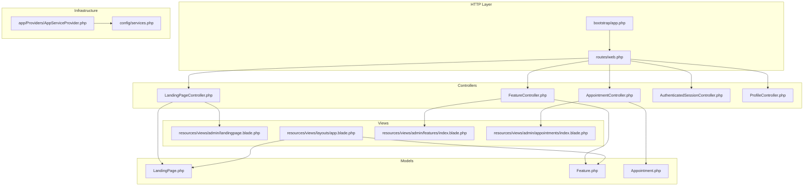
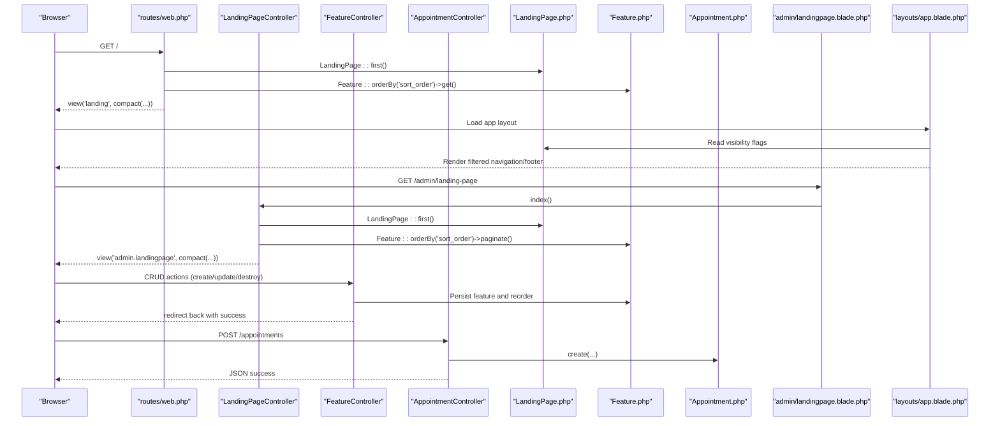
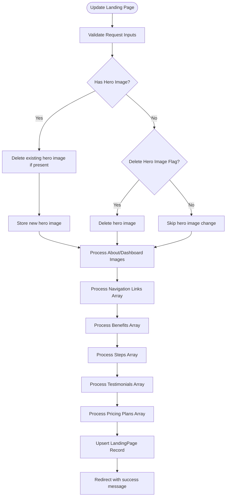
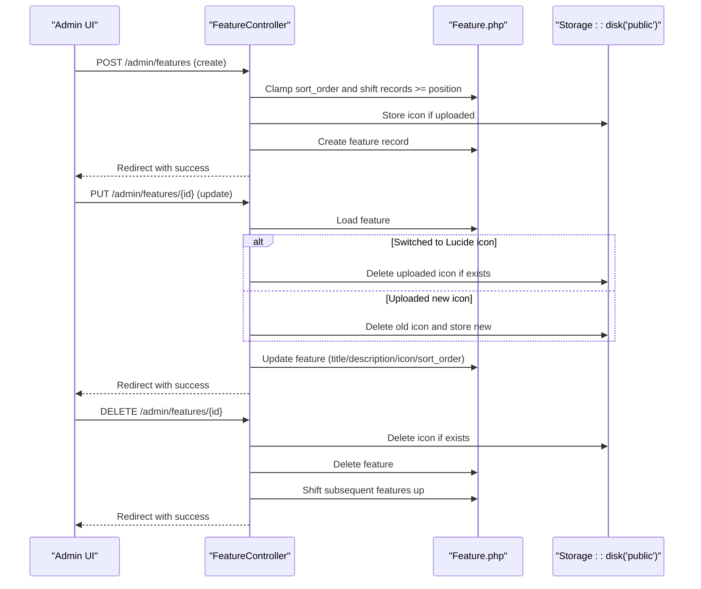
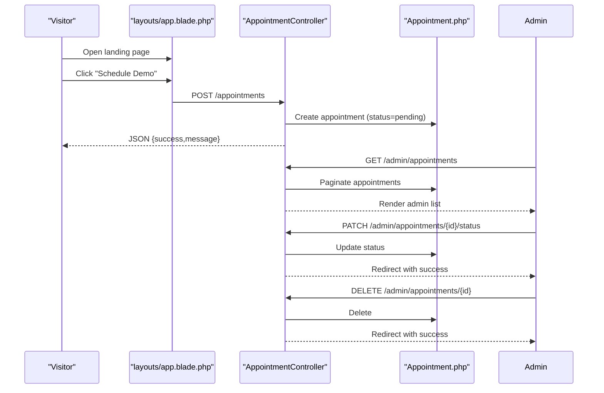
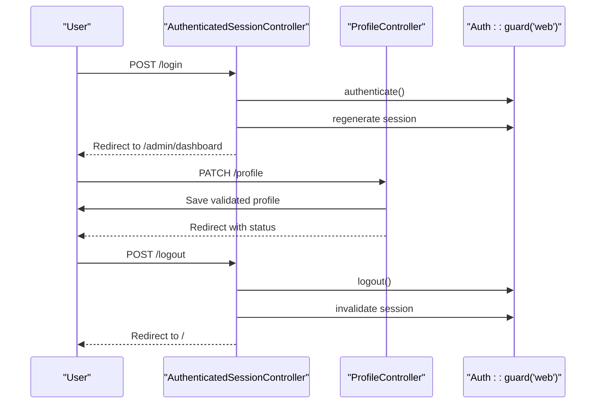
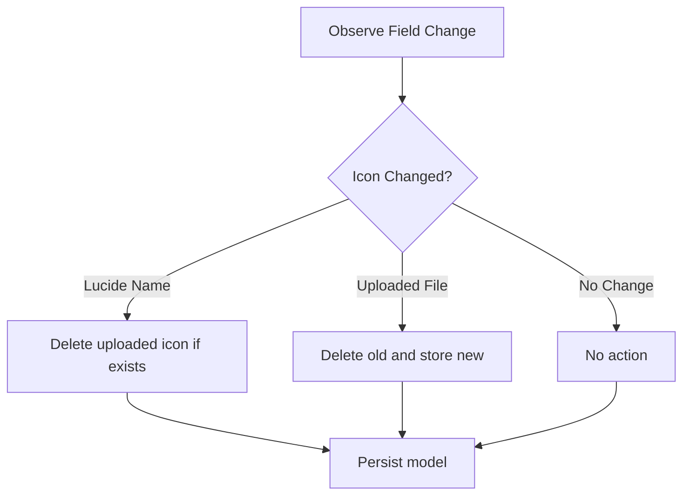
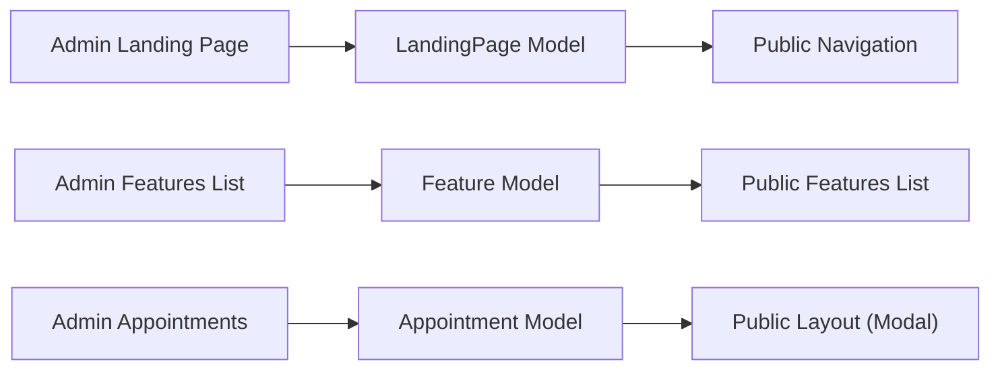
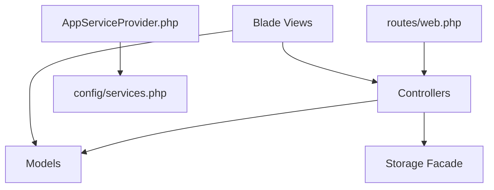

# Component Interaction & Integration

<cite>
**Referenced Files in This Document**
- [Controller.php](file://app/Http/Controllers/Controller.php)
- [LandingPageController.php](file://app/Http/Controllers/LandingPageController.php)
- [FeatureController.php](file://app/Http/Controllers/FeatureController.php)
- [AppointmentController.php](file://app/Http/Controllers/AppointmentController.php)
- [AuthenticatedSessionController.php](file://app/Http/Controllers/Auth/AuthenticatedSessionController.php)
- [ProfileController.php](file://app/Http/Controllers/ProfileController.php)
- [LandingPage.php](file://app/Models/LandingPage.php)
- [Feature.php](file://app/Models/Feature.php)
- [Appointment.php](file://app/Models/Appointment.php)
- [AppLayout.php](file://app/View/Components/AppLayout.php)
- [web.php](file://routes/web.php)
- [app.php](file://bootstrap/app.php)
- [AppServiceProvider.php](file://app/Providers/AppServiceProvider.php)
- [services.php](file://config/services.php)
- [landingpage.blade.php](file://resources/views/admin/landingpage.blade.php)
- [app.blade.php](file://resources/views/layouts/app.blade.php)
- [index.blade.php](file://resources/views/admin/appointments/index.blade.php)
- [index.blade.php](file://resources/views/admin/features/index.blade.php)
</cite>

## Table of Contents
1. [Introduction](#introduction)
2. [Project Structure](#project-structure)
3. [Core Components](#core-components)
4. [Architecture Overview](#architecture-overview)
5. [Detailed Component Analysis](#detailed-component-analysis)
6. [Dependency Analysis](#dependency-analysis)
7. [Performance Considerations](#performance-considerations)
8. [Troubleshooting Guide](#troubleshooting-guide)
9. [Conclusion](#conclusion)

## Introduction
This document explains how components interact in ClinicalLog CMS, focusing on controller-model-view collaboration, subsystem integration (Landing Page, Features, Appointments), observer-like patterns for file operations, event broadcasting for asynchronous tasks, and service container usage for dependency resolution. It also covers administrative interfaces, public-facing rendering, cross-component data sharing, API communication patterns, external service integration (Google Drive), lifecycle management, memory optimization, and performance monitoring across component boundaries.

## Project Structure
The system follows Laravel’s MVC pattern with explicit separation of concerns:
- Controllers handle HTTP requests and orchestrate model updates and view rendering.
- Models encapsulate persistence and casting for Landing Page, Features, and Appointments.
- Views render both public pages and admin dashboards, with Blade components and layout composition.
- Routes define entry points for public and admin areas.
- Service providers and configuration files manage container bindings and third-party integrations.

**Diagram sources**
- [web.php:19-77](file://routes/web.php#L19-L77)
- [app.php:8-24](file://bootstrap/app.php#L8-L24)
- [LandingPageController.php:9-224](file://app/Http/Controllers/LandingPageController.php#L9-L224)
- [FeatureController.php:9-156](file://app/Http/Controllers/FeatureController.php#L9-L156)
- [AppointmentController.php:9-77](file://app/Http/Controllers/AppointmentController.php#L9-L77)
- [AuthenticatedSessionController.php:12-48](file://app/Http/Controllers/Auth/AuthenticatedSessionController.php#L12-L48)
- [ProfileController.php:12-61](file://app/Http/Controllers/ProfileController.php#L12-L61)
- [LandingPage.php:7-59](file://app/Models/LandingPage.php#L7-L59)
- [Feature.php:7-17](file://app/Models/Feature.php#L7-L17)
- [Appointment.php:7-20](file://app/Models/Appointment.php#L7-L20)
- [landingpage.blade.php:1-1441](file://resources/views/admin/landingpage.blade.php#L1-L1441)
- [app.blade.php:1-397](file://resources/views/layouts/app.blade.php#L1-L397)
- [index.blade.php:1-109](file://resources/views/admin/features/index.blade.php#L1-L109)
- [index.blade.php:1-93](file://resources/views/admin/appointments/index.blade.php#L1-L93)
- [AppServiceProvider.php:7-25](file://app/Providers/AppServiceProvider.php#L7-L25)
- [services.php:1-39](file://config/services.php#L1-L39)

**Section sources**
- [web.php:19-77](file://routes/web.php#L19-L77)
- [app.php:8-24](file://bootstrap/app.php#L8-L24)

## Core Components
- Controllers
  - LandingPageController: Manages landing page content, media uploads, and structured content arrays (navigation links, benefits, steps, testimonials, pricing).
  - FeatureController: Handles feature CRUD, icon selection (Lucide icon name vs. uploaded SVG), and dynamic sort ordering with position clamping and shifting.
  - AppointmentController: Processes appointment submissions, admin listing, status updates, and deletions.
  - AuthenticatedSessionController: Login/logout flows integrated with admin redirection.
  - ProfileController: User profile updates and deletion.
- Models
  - LandingPage: Fillable attributes and array casts for structured content; visibility booleans.
  - Feature: Fillable fields including sort order and icon selection.
  - Appointment: Fillable fields for submission and status.
- Layout and Components
  - AppLayout: Blade component rendering the main application layout.
  - app.blade.php: Public layout composing navigation, footer, and appointment modal; reads LandingPage visibility flags to filter navigation items.
- Views
  - Admin CMS: landingpage.blade.php for comprehensive landing page editing; features and appointments admin lists.
  - Public landing: Rendered via routes/web.php home route and app.blade.php layout.

**Section sources**
- [LandingPageController.php:9-224](file://app/Http/Controllers/LandingPageController.php#L9-L224)
- [FeatureController.php:9-156](file://app/Http/Controllers/FeatureController.php#L9-L156)
- [AppointmentController.php:9-77](file://app/Http/Controllers/AppointmentController.php#L9-L77)
- [AuthenticatedSessionController.php:12-48](file://app/Http/Controllers/Auth/AuthenticatedSessionController.php#L12-L48)
- [ProfileController.php:12-61](file://app/Http/Controllers/ProfileController.php#L12-L61)
- [LandingPage.php:7-59](file://app/Models/LandingPage.php#L7-L59)
- [Feature.php:7-17](file://app/Models/Feature.php#L7-L17)
- [Appointment.php:7-20](file://app/Models/Appointment.php#L7-L20)
- [AppLayout.php:8-18](file://app/View/Components/AppLayout.php#L8-L18)
- [app.blade.php:32-123](file://resources/views/layouts/app.blade.php#L32-L123)
- [landingpage.blade.php:1-1441](file://resources/views/admin/landingpage.blade.php#L1-L1441)
- [index.blade.php:1-109](file://resources/views/admin/features/index.blade.php#L1-L109)
- [index.blade.php:1-93](file://resources/views/admin/appointments/index.blade.php#L1-L93)

## Architecture Overview
The system integrates three major subsystems:
- Landing Page CMS: Admin-driven content management with media handling and structured content arrays.
- Features CMS: Dynamic feature list with icon selection and sortable positions.
- Appointments: Public appointment submission and admin management.

**Diagram sources**
- [web.php:19-31](file://routes/web.php#L19-L31)
- [app.blade.php:32-123](file://resources/views/layouts/app.blade.php#L32-L123)
- [landingpage.blade.php:1-1441](file://resources/views/admin/landingpage.blade.php#L1-L1441)
- [LandingPageController.php:11-17](file://app/Http/Controllers/LandingPageController.php#L11-L17)
- [FeatureController.php:11-20](file://app/Http/Controllers/FeatureController.php#L11-L20)
- [AppointmentController.php:14-41](file://app/Http/Controllers/AppointmentController.php#L14-L41)

## Detailed Component Analysis

### Landing Page Subsystem
- Controller responsibilities
  - Index action loads LandingPage and paginated features for admin editing.
  - Update action validates inputs, handles image uploads/deletes per section, and processes structured arrays (navigation links, benefits, steps, testimonials, pricing plans).
- Model characteristics
  - Fillable includes all editable fields; casts convert JSON-like arrays and boolean flags.
- View integration
  - Admin landing page template organizes content into tabs and supports toggles for section visibility.
- Media handling
  - Uses Storage facade to store images under public disk and remove previous files when replacing or deleting.

**Diagram sources**
- [LandingPageController.php:19-222](file://app/Http/Controllers/LandingPageController.php#L19-L222)
- [LandingPage.php:9-57](file://app/Models/LandingPage.php#L9-L57)

**Section sources**
- [LandingPageController.php:11-222](file://app/Http/Controllers/LandingPageController.php#L11-L222)
- [LandingPage.php:9-57](file://app/Models/LandingPage.php#L9-L57)
- [landingpage.blade.php:40-297](file://resources/views/admin/landingpage.blade.php#L40-L297)

### Features Subsystem
- Controller responsibilities
  - Create/store: Accepts Lucide icon name or uploaded icon, clamps sort order, shifts existing features to make room, and persists.
  - Edit/update: Supports swapping between Lucide icon name and uploaded icon, deletes uploaded icon when switching, and reorders features with bidirectional shifting.
  - Destroy: Deletes feature and icon, then shifts subsequent features up.
- Model characteristics
  - Fillable includes title, description, icon path/name, and sort_order.
- View integration
  - Admin features list displays icons (Lucide or uploaded), titles, descriptions, and pagination.

**Diagram sources**
- [FeatureController.php:22-154](file://app/Http/Controllers/FeatureController.php#L22-L154)
- [Feature.php:9-15](file://app/Models/Feature.php#L9-L15)

**Section sources**
- [FeatureController.php:16-154](file://app/Http/Controllers/FeatureController.php#L16-L154)
- [Feature.php:9-15](file://app/Models/Feature.php#L9-L15)
- [index.blade.php:1-109](file://resources/views/admin/features/index.blade.php#L1-L109)

### Appointments Subsystem
- Controller responsibilities
  - Store: Validates appointment fields and creates a record with pending status; returns JSON success for AJAX.
  - Index: Lists recent appointments for admin dashboard.
  - UpdateStatus: Updates status with strict validation.
  - Destroy: Removes an appointment.
- View integration
  - Admin appointments list allows changing status via select and deleting entries.

**Diagram sources**
- [app.blade.php:195-391](file://resources/views/layouts/app.blade.php#L195-L391)
- [AppointmentController.php:14-75](file://app/Http/Controllers/AppointmentController.php#L14-L75)
- [index.blade.php:1-93](file://resources/views/admin/appointments/index.blade.php#L1-L93)

**Section sources**
- [AppointmentController.php:14-75](file://app/Http/Controllers/AppointmentController.php#L14-L75)
- [index.blade.php:1-93](file://resources/views/admin/appointments/index.blade.php#L1-L93)

### Authentication and Profile
- AuthenticatedSessionController: Integrates with Laravel’s Auth guard, redirects to admin dashboard upon login, and invalidates session on logout.
- ProfileController: Updates user profile and handles account deletion with current password verification.

**Diagram sources**
- [AuthenticatedSessionController.php:25-46](file://app/Http/Controllers/Auth/AuthenticatedSessionController.php#L25-L46)
- [ProfileController.php:27-37](file://app/Http/Controllers/ProfileController.php#L27-L37)

**Section sources**
- [AuthenticatedSessionController.php:17-46](file://app/Http/Controllers/Auth/AuthenticatedSessionController.php#L17-L46)
- [ProfileController.php:17-59](file://app/Http/Controllers/ProfileController.php#L17-L59)

### Observer Pattern for File Operations
- FeatureController demonstrates an observer-like pattern for file operations:
  - On update, it observes the icon field changes and reacts by deleting the old uploaded icon and storing a new one when applicable.
  - On destroy, it ensures cleanup of associated files.
- LandingPageController similarly observes media fields and deletes previous files before storing new ones.

**Diagram sources**
- [FeatureController.php:64-92](file://app/Http/Controllers/FeatureController.php#L64-L92)
- [FeatureController.php:134-154](file://app/Http/Controllers/FeatureController.php#L134-L154)
- [LandingPageController.php:77-114](file://app/Http/Controllers/LandingPageController.php#L77-L114)

**Section sources**
- [FeatureController.php:64-92](file://app/Http/Controllers/FeatureController.php#L64-L92)
- [FeatureController.php:134-154](file://app/Http/Controllers/FeatureController.php#L134-L154)
- [LandingPageController.php:77-114](file://app/Http/Controllers/LandingPageController.php#L77-L114)

### Event Broadcasting for Asynchronous Tasks
- The system does not implement explicit event broadcasting for asynchronous tasks in the analyzed files. To integrate asynchronous notifications (e.g., email or Slack), consider:
  - Defining events and listeners for appointment creation/status changes.
  - Using queued jobs to offload heavy tasks (e.g., sending emails, Slack notifications).
  - Leveraging the configured third-party services in config/services.php for integrations.

[No sources needed since this section provides general guidance]

### Service Container Usage for Dependency Resolution
- The application uses the default Laravel service container for dependency injection and middleware configuration.
- AppServiceProvider currently registers no custom bindings; however, it is the appropriate place to bind interfaces to implementations or configure singletons.

**Section sources**
- [app.php:14-23](file://bootstrap/app.php#L14-L23)
- [AppServiceProvider.php:12-23](file://app/Providers/AppServiceProvider.php#L12-L23)

### Integration Points Between Administrative Interfaces and Public-Facing Components
- Admin landing page edits feed into the public layout:
  - app.blade.php reads LandingPage visibility flags to filter navigation links and footer sections.
  - Navbar links and CTA buttons are populated from LandingPage data.
- Admin features list feeds the public landing page features list via the home route’s query.

**Diagram sources**
- [app.blade.php:32-123](file://resources/views/layouts/app.blade.php#L32-L123)
- [web.php:19-24](file://routes/web.php#L19-L24)
- [landingpage.blade.php:1-1441](file://resources/views/admin/landingpage.blade.php#L1-L1441)

**Section sources**
- [app.blade.php:32-123](file://resources/views/layouts/app.blade.php#L32-L123)
- [web.php:19-24](file://routes/web.php#L19-L24)

### Cross-Component Data Sharing
- Controllers share data with views via compact arrays and route parameters.
- Models expose structured content (arrays) that controllers parse and persist, ensuring consistent data shapes across components.
- Public layout consumes LandingPage model data to render navigation and footer links dynamically.

**Section sources**
- [LandingPageController.php:11-17](file://app/Http/Controllers/LandingPageController.php#L11-L17)
- [FeatureController.php:11-20](file://app/Http/Controllers/FeatureController.php#L11-L20)
- [app.blade.php:32-123](file://resources/views/layouts/app.blade.php#L32-L123)

### API Communication Patterns
- Public appointment submission uses AJAX with JSON responses for seamless UX.
- Admin endpoints follow REST conventions with proper HTTP verbs and status updates.

**Section sources**
- [app.blade.php:358-390](file://resources/views/layouts/app.blade.php#L358-L390)
- [AppointmentController.php:14-41](file://app/Http/Controllers/AppointmentController.php#L14-L41)

### External Service Integration (Google Drive)
- LandingPageController stores Google Drive URLs for Terms and Privacy documents.
- The public layout exposes privacy policy link using the stored URL or a fallback.

**Section sources**
- [LandingPageController.php:45-46](file://app/Http/Controllers/LandingPageController.php#L45-L46)
- [app.blade.php:171-172](file://resources/views/layouts/app.blade.php#L171-L172)

## Dependency Analysis
- Routing depends on controllers and models to serve public and admin pages.
- Views depend on models for data rendering and on controllers for admin forms.
- Controllers depend on models for persistence and on Storage for media operations.
- Service provider and services configuration support third-party integrations.

**Diagram sources**
- [web.php:19-77](file://routes/web.php#L19-L77)
- [AppServiceProvider.php:12-23](file://app/Providers/AppServiceProvider.php#L12-L23)
- [services.php:17-36](file://config/services.php#L17-L36)

**Section sources**
- [web.php:19-77](file://routes/web.php#L19-L77)
- [AppServiceProvider.php:12-23](file://app/Providers/AppServiceProvider.php#L12-L23)
- [services.php:17-36](file://config/services.php#L17-L36)

## Performance Considerations
- Pagination: Feature listings use pagination to limit payload sizes in admin views.
- Efficient queries: Controllers load only required fields and use eager loading where appropriate.
- Media optimization: Uploads are validated and stored under a dedicated disk; consider adding CDN integration and image resizing for scalability.
- Rendering: Blade components and layout reuse reduce duplication and improve maintainability.

[No sources needed since this section provides general guidance]

## Troubleshooting Guide
- Validation errors
  - Controllers validate inputs and return errors to views; ensure error keys match form fields.
- Media upload failures
  - Verify storage permissions and disk configuration; check file size and MIME type constraints.
- Visibility toggles not reflected
  - Confirm LandingPage visibility flags are persisted and read by the public layout.
- Appointment submission issues
  - Inspect AJAX response handling and CSRF token presence in forms.

**Section sources**
- [LandingPageController.php:21-47](file://app/Http/Controllers/LandingPageController.php#L21-L47)
- [FeatureController.php:24-30](file://app/Http/Controllers/FeatureController.php#L24-L30)
- [app.blade.php:358-390](file://resources/views/layouts/app.blade.php#L358-L390)

## Conclusion
ClinicalLog CMS demonstrates clear MVC separation with robust controller orchestration, model-centric persistence, and cohesive admin/public integration. The system leverages structured content arrays, observer-like file handling, and RESTful admin endpoints. Extending asynchronous processing and integrating third-party services would further enhance scalability and operational efficiency.