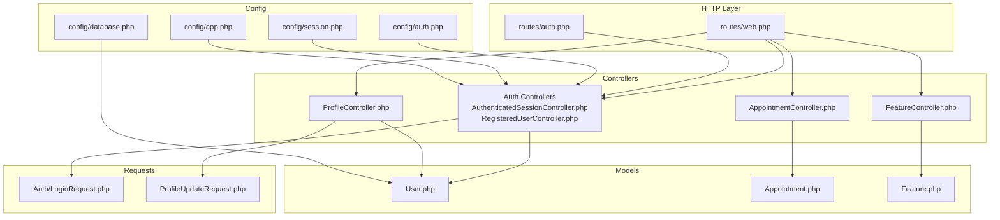
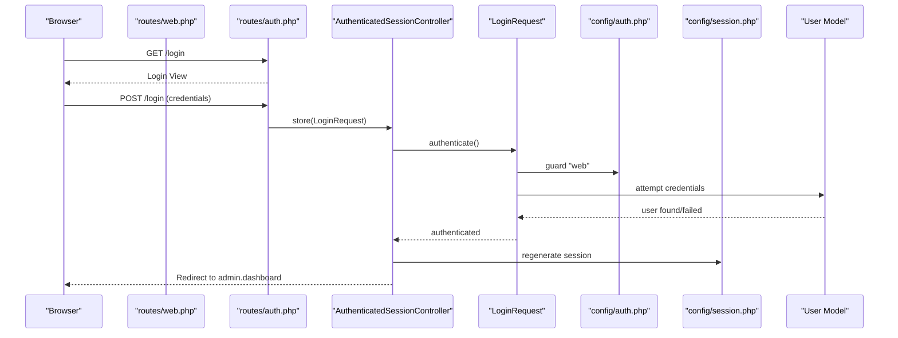
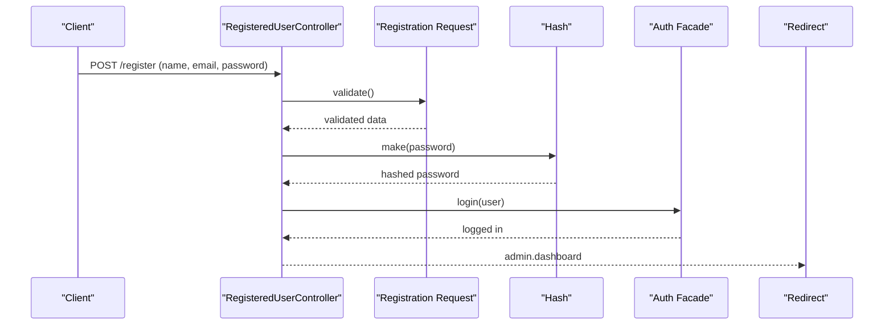
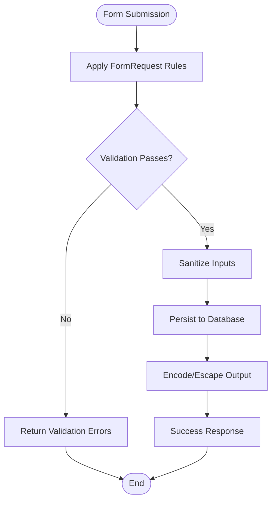
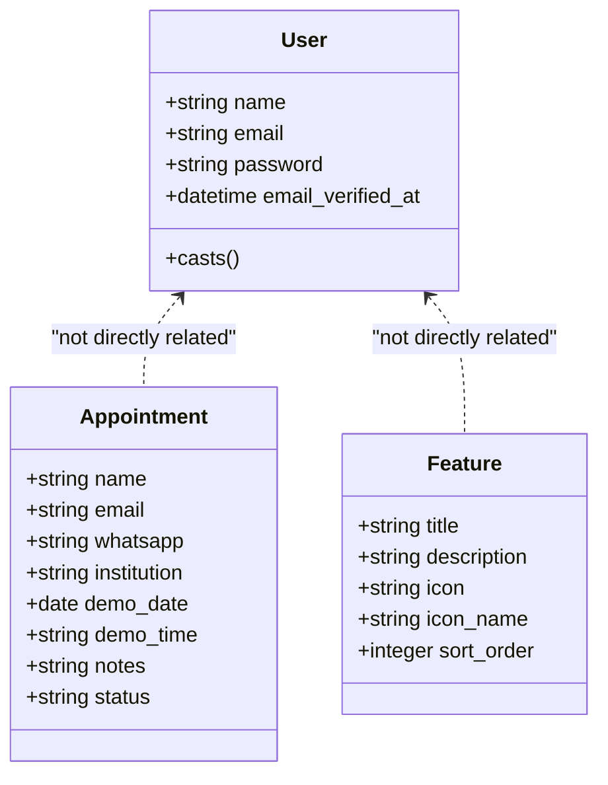
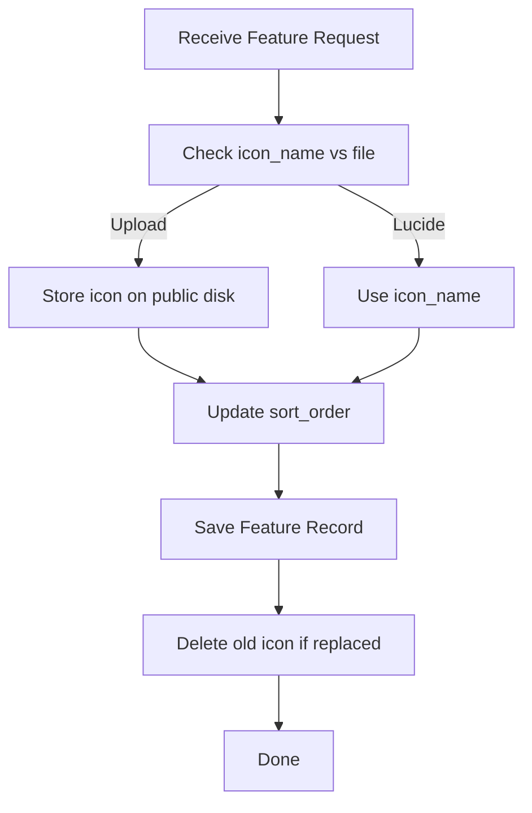
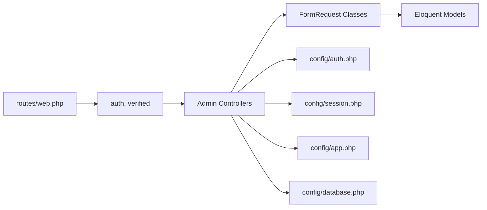
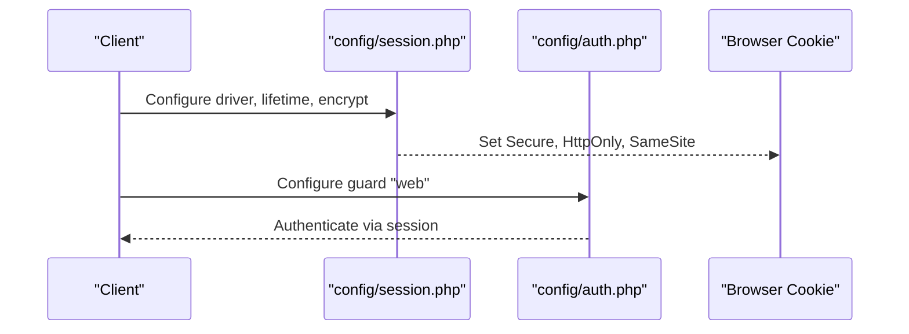

# Data Flow & Security Architecture

<cite>
**Referenced Files in This Document**
- [AuthenticatedSessionController.php](file://app/Http/Controllers/Auth/AuthenticatedSessionController.php)
- [LoginRequest.php](file://app/Http/Requests/Auth/LoginRequest.php)
- [RegisteredUserController.php](file://app/Http/Controllers/Auth/RegisteredUserController.php)
- [ProfileController.php](file://app/Http/Controllers/ProfileController.php)
- [ProfileUpdateRequest.php](file://app/Http/Requests/ProfileUpdateRequest.php)
- [User.php](file://app/Models/User.php)
- [web.php](file://routes/web.php)
- [auth.php](file://routes/auth.php)
- [auth.php](file://config/auth.php)
- [session.php](file://config/session.php)
- [app.php](file://config/app.php)
- [database.php](file://config/database.php)
- [AppointmentController.php](file://app/Http/Controllers/AppointmentController.php)
- [FeatureController.php](file://app/Http/Controllers/FeatureController.php)
- [.htaccess](file://public/.htaccess)
</cite>

## Table of Contents
1. [Introduction](#introduction)
2. [Project Structure](#project-structure)
3. [Core Components](#core-components)
4. [Architecture Overview](#architecture-overview)
5. [Detailed Component Analysis](#detailed-component-analysis)
6. [Dependency Analysis](#dependency-analysis)
7. [Performance Considerations](#performance-considerations)
8. [Security Implementation](#security-implementation)
9. [Troubleshooting Guide](#troubleshooting-guide)
10. [Conclusion](#conclusion)

## Introduction
This document describes the data flow architecture and security implementation in ClinicalLog CMS. It covers the complete request-response lifecycle from authentication to data persistence, including input validation, sanitization, and output encoding. It explains the Laravel Breeze authentication flow, session management, CSRF protection, request validation using FormRequest classes, custom validation rules, and error handling strategies. Security measures for file uploads, SQL injection prevention, and XSS protection are documented alongside encryption, secure password handling, and audit logging. CORS configuration, rate limiting, and security headers are addressed.

## Project Structure
ClinicalLog CMS follows a standard Laravel MVC structure with dedicated controllers, requests, models, routes, and configuration files. Authentication is handled via controllers under app/Http/Controllers/Auth, while administrative features are routed through app/Http/Controllers. Validation is centralized in app/Http/Requests, and security-related configuration resides in config/.

**Diagram sources**
- [web.php:1-77](file://routes/web.php#L1-L77)
- [auth.php:1-60](file://routes/auth.php#L1-L60)
- [AuthenticatedSessionController.php:1-48](file://app/Http/Controllers/Auth/AuthenticatedSessionController.php#L1-L48)
- [RegisteredUserController.php:1-52](file://app/Http/Controllers/Auth/RegisteredUserController.php#L1-L52)
- [ProfileController.php:1-61](file://app/Http/Controllers/ProfileController.php#L1-L61)
- [AppointmentController.php:1-77](file://app/Http/Controllers/AppointmentController.php#L1-L77)
- [FeatureController.php:1-156](file://app/Http/Controllers/FeatureController.php#L1-L156)
- [LoginRequest.php:1-87](file://app/Http/Requests/Auth/LoginRequest.php#L1-L87)
- [ProfileUpdateRequest.php:1-32](file://app/Http/Requests/ProfileUpdateRequest.php#L1-L32)
- [User.php:1-33](file://app/Models/User.php#L1-L33)
- [auth.php:1-118](file://config/auth.php#L1-L118)
- [session.php:1-234](file://config/session.php#L1-L234)
- [app.php:1-127](file://config/app.php#L1-L127)
- [database.php:1-185](file://config/database.php#L1-L185)

**Section sources**
- [web.php:1-77](file://routes/web.php#L1-L77)
- [auth.php:1-60](file://routes/auth.php#L1-L60)

## Core Components
- Authentication Controllers: Manage login, logout, registration, password reset, and email verification flows.
- Request Validators: Centralize validation rules using FormRequest classes for consistent input sanitization.
- Profile Management: Handles profile updates, password changes, and account deletion with validation and state cleanup.
- Administrative Controllers: Manage appointments and features, including file uploads and ordering logic.
- Models: Define user and data entity structures with attribute casting and hidden fields for security.
- Configuration: Defines authentication guards, session behavior, encryption keys, and database connections.

**Section sources**
- [AuthenticatedSessionController.php:1-48](file://app/Http/Controllers/Auth/AuthenticatedSessionController.php#L1-L48)
- [RegisteredUserController.php:1-52](file://app/Http/Controllers/Auth/RegisteredUserController.php#L1-L52)
- [ProfileController.php:1-61](file://app/Http/Controllers/ProfileController.php#L1-L61)
- [LoginRequest.php:1-87](file://app/Http/Requests/Auth/LoginRequest.php#L1-L87)
- [ProfileUpdateRequest.php:1-32](file://app/Http/Requests/ProfileUpdateRequest.php#L1-L32)
- [User.php:1-33](file://app/Models/User.php#L1-L33)

## Architecture Overview
The system enforces authentication-first access to administrative routes. Requests pass through route groups with middleware for authentication and email verification. Controllers delegate validation to FormRequest classes, interact with models for persistence, and return appropriate responses. Sessions are managed via the configured driver with security headers enabled through .htaccess.

**Diagram sources**
- [auth.php:14-36](file://routes/auth.php#L14-L36)
- [AuthenticatedSessionController.php:25-31](file://app/Http/Controllers/Auth/AuthenticatedSessionController.php#L25-L31)
- [LoginRequest.php:41-54](file://app/Http/Requests/Auth/LoginRequest.php#L41-L54)
- [auth.php:40-44](file://config/auth.php#L40-L44)
- [session.php:35-37](file://config/session.php#L35-L37)

## Detailed Component Analysis

### Authentication Flow (Breeze-style)
- Login: The login form posts to the authenticated session controller, which delegates credential validation and throttling to the LoginRequest FormRequest. Successful authentication regenerates the session and redirects to the admin dashboard.
- Registration: Validates name, email uniqueness, and password strength, hashes the password, fires a registered event, and logs the user in.
- Logout: Clears the current guard, invalidates the session, regenerates the CSRF token, and redirects to home.
- Password Reset and Email Verification: Defined in separate controllers and routes, leveraging Laravel’s built-in mechanisms.

**Diagram sources**
- [RegisteredUserController.php:31-49](file://app/Http/Controllers/Auth/RegisteredUserController.php#L31-L49)
- [User.php:29-30](file://app/Models/User.php#L29-L30)

**Section sources**
- [AuthenticatedSessionController.php:17-46](file://app/Http/Controllers/Auth/AuthenticatedSessionController.php#L17-L46)
- [LoginRequest.php:28-85](file://app/Http/Requests/Auth/LoginRequest.php#L28-L85)
- [RegisteredUserController.php:31-49](file://app/Http/Controllers/Auth/RegisteredUserController.php#L31-L49)
- [auth.php:40-44](file://config/auth.php#L40-L44)

### Request Validation and Sanitization
- LoginRequest: Enforces presence of email and password, checks rate limits per IP and email, and throws localized throttle messages.
- ProfileUpdateRequest: Ensures name and email uniqueness against the current user record.
- AppointmentController: Validates appointment fields including date/time constraints and optional notes.
- FeatureController: Validates feature creation/update with sanitization for icon uploads and ordering logic.

**Diagram sources**
- [LoginRequest.php:28-34](file://app/Http/Requests/Auth/LoginRequest.php#L28-L34)
- [ProfileUpdateRequest.php:17-29](file://app/Http/Requests/ProfileUpdateRequest.php#L17-L29)
- [AppointmentController.php:16-24](file://app/Http/Controllers/AppointmentController.php#L16-L24)
- [FeatureController.php:22-54](file://app/Http/Controllers/FeatureController.php#L22-L54)

**Section sources**
- [LoginRequest.php:28-85](file://app/Http/Requests/Auth/LoginRequest.php#L28-L85)
- [ProfileUpdateRequest.php:17-29](file://app/Http/Requests/ProfileUpdateRequest.php#L17-L29)
- [ProfileController.php:27-37](file://app/Http/Controllers/ProfileController.php#L27-L37)
- [AppointmentController.php:14-41](file://app/Http/Controllers/AppointmentController.php#L14-L41)
- [FeatureController.php:22-154](file://app/Http/Controllers/FeatureController.php#L22-L154)

### Data Persistence and Models
- User Model: Uses hashed casting for passwords and hides sensitive attributes. Provides the foundation for authentication and profile management.
- Appointment and Feature Models: Persist appointment requests and feature metadata, including optional icon storage paths.

**Diagram sources**
- [User.php:13-31](file://app/Models/User.php#L13-L31)
- [AppointmentController.php:26-35](file://app/Http/Controllers/AppointmentController.php#L26-L35)
- [FeatureController.php:46-52](file://app/Http/Controllers/FeatureController.php#L46-L52)

**Section sources**
- [User.php:13-31](file://app/Models/User.php#L13-L31)
- [AppointmentController.php:14-41](file://app/Http/Controllers/AppointmentController.php#L14-L41)
- [FeatureController.php:22-154](file://app/Http/Controllers/FeatureController.php#L22-L154)

### File Upload Security in Feature Management
- Icon selection: Supports either Lucide icon names or uploaded files.
- Upload handling: Stores icons under the public disk with a features directory. Existing files are replaced or deleted upon updates.
- Ordering logic: Maintains sort order integrity during insertions and deletions, preventing gaps or duplicates.

**Diagram sources**
- [FeatureController.php:22-132](file://app/Http/Controllers/FeatureController.php#L22-L132)

**Section sources**
- [FeatureController.php:22-154](file://app/Http/Controllers/FeatureController.php#L22-L154)

## Dependency Analysis
- Route Dependencies: Administrative routes depend on auth and verified middleware, ensuring only authenticated and email-verified users can access admin features.
- Controller Dependencies: Controllers rely on FormRequest classes for validation, Eloquent models for persistence, and configuration files for session and authentication behavior.
- Configuration Dependencies: Session driver, encryption key, and database connections are central to runtime behavior and security posture.

**Diagram sources**
- [web.php:37-74](file://routes/web.php#L37-L74)
- [auth.php:40-44](file://config/auth.php#L40-L44)
- [session.php:21-234](file://config/session.php#L21-L234)
- [app.php:98-106](file://config/app.php#L98-L106)
- [database.php:20-115](file://config/database.php#L20-L115)

**Section sources**
- [web.php:37-74](file://routes/web.php#L37-L74)
- [auth.php:40-44](file://config/auth.php#L40-L44)
- [session.php:21-234](file://config/session.php#L21-L234)
- [app.php:98-106](file://config/app.php#L98-L106)
- [database.php:20-115](file://config/database.php#L20-L115)

## Performance Considerations
- Session Driver: Database-backed sessions are used by default, balancing reliability and scalability. Consider Redis for high-traffic deployments.
- Validation Overhead: Centralized FormRequest validation reduces duplication and improves maintainability. Keep rules minimal and targeted.
- Pagination: Administrative listings use pagination to limit memory usage and improve responsiveness.
- Database Strictness: MySQL strict mode is enabled, helping catch invalid data early.

[No sources needed since this section provides general guidance]

## Security Implementation

### Authentication and Session Management
- Guard and Provider: The session guard with Eloquent provider ensures robust user retrieval and authentication.
- Session Configuration: Lifetime, encryption flag, cookie security (Secure, HttpOnly, SameSite), and serialization are configurable for hardening.
- CSRF Protection: Laravel’s built-in CSRF middleware protects forms; .htaccess handles Authorization and XSRF headers for API compatibility.

**Diagram sources**
- [session.php:21-50](file://config/session.php#L21-L50)
- [session.php:172-202](file://config/session.php#L172-L202)
- [auth.php:40-44](file://config/auth.php#L40-L44)

**Section sources**
- [auth.php:40-44](file://config/auth.php#L40-L44)
- [session.php:21-50](file://config/session.php#L21-L50)
- [session.php:172-202](file://config/session.php#L172-L202)
- [.htaccess:8-14](file://public/.htaccess#L8-L14)

### Rate Limiting and Brute Force Mitigation
- Login Throttling: LoginRequest enforces a throttle key based on email and IP, with lockout events and localized messages.
- Password Reset Throttling: Separate throttling policy applied to password reset requests.

**Section sources**
- [LoginRequest.php:61-77](file://app/Http/Requests/Auth/LoginRequest.php#L61-L77)
- [auth.php:95-102](file://config/auth.php#L95-L102)

### Input Validation, Sanitization, and Output Encoding
- FormRequest Validation: Strong typing and rule enforcement in LoginRequest and ProfileUpdateRequest.
- Controller-Level Validation: AppointmentController and FeatureController validate inputs before persistence.
- Output Encoding: Blade templates in the resources/views directory handle output encoding by default in Laravel.

**Section sources**
- [LoginRequest.php:28-34](file://app/Http/Requests/Auth/LoginRequest.php#L28-L34)
- [ProfileUpdateRequest.php:17-29](file://app/Http/Requests/ProfileUpdateRequest.php#L17-L29)
- [AppointmentController.php:16-24](file://app/Http/Controllers/AppointmentController.php#L16-L24)
- [FeatureController.php:22-54](file://app/Http/Controllers/FeatureController.php#L22-L54)

### SQL Injection Prevention
- Eloquent ORM: All persistence uses Eloquent models and query builders, which parameterize queries by default.
- Database Configuration: Strict modes and charset/collation settings reduce risk exposure.

**Section sources**
- [database.php:60-64](file://config/database.php#L60-L64)
- [database.php:78-84](file://config/database.php#L78-L84)

### XSS Protection
- Output Escaping: Laravel Blade escapes output by default. Avoid raw() usage and sanitize untrusted content.
- Content Security: No inline scripts or eval in provided templates.

[No sources needed since this section provides general guidance]

### File Upload Security
- Disk and Visibility: Icons stored on the public disk; ensure only intended files are uploaded and validate MIME types if needed.
- Path Handling: Controller cleans up previous files when replacing or deleting icons.
- Access Control: Serve static assets via web server with appropriate permissions.

**Section sources**
- [FeatureController.php:28-30](file://app/Http/Controllers/FeatureController.php#L28-L30)
- [FeatureController.php:73-92](file://app/Http/Controllers/FeatureController.php#L73-L92)
- [FeatureController.php:139-142](file://app/Http/Controllers/FeatureController.php#L139-L142)

### Encryption and Secure Password Handling
- Encryption Key: APP_KEY configured for encryption cipher AES-256-CBC.
- Password Hashing: User passwords are hashed via framework hashing and cast as hashed in the model.

**Section sources**
- [app.php:98-106](file://config/app.php#L98-L106)
- [User.php:29-30](file://app/Models/User.php#L29-L30)

### Audit Logging
- Event-driven Registration: Firing a registered event enables integration with external logging systems.
- Recommendation: Add logging for authentication attempts, profile changes, and administrative actions.

**Section sources**
- [RegisteredUserController.php:45-46](file://app/Http/Controllers/Auth/RegisteredUserController.php#L45-L46)

### CORS Configuration
- Library Presence: The project includes a CORS library; configure allowed origins, methods, and headers in middleware as needed.
- .htaccess Headers: Authorization and XSRF headers are forwarded to support SPA integrations.

**Section sources**
- [.htaccess:8-14](file://public/.htaccess#L8-L14)

### Security Headers Implementation
- Cookie Flags: Secure, HttpOnly, SameSite, and partitioned flags are configurable in session configuration.
- HTTPS Enforcement: Set SESSION_SECURE_COOKIE appropriately in production environments.

**Section sources**
- [session.php:172-202](file://config/session.php#L172-L202)

## Troubleshooting Guide
- Authentication Failures: Verify rate limiting thresholds and throttle keys. Check localized auth messages and lockout events.
- Session Issues: Confirm session driver configuration, lifetime, and cookie settings. Ensure database sessions table exists if using database driver.
- Validation Errors: Review FormRequest rules and ensure client-side and server-side validation align.
- File Upload Problems: Confirm public disk permissions and storage path availability. Validate that only intended files are uploaded.
- CORS Errors: Validate allowed origins and headers; ensure preflight requests are handled.

**Section sources**
- [LoginRequest.php:61-77](file://app/Http/Requests/Auth/LoginRequest.php#L61-L77)
- [session.php:21-234](file://config/session.php#L21-L234)
- [FeatureController.php:28-30](file://app/Http/Controllers/FeatureController.php#L28-L30)

## Conclusion
ClinicalLog CMS implements a secure, layered approach to authentication, validation, and data persistence. The Laravel Breeze-style authentication flow integrates with FormRequest validation, session management, and rate limiting to provide robust protection. Administrative controllers enforce strong validation rules, sanitize inputs, and persist data safely. File upload handling includes cleanup and ordering logic. Security is further strengthened through configurable session cookies, encryption, and recommended CORS and header configurations. Adopting the suggested audit logging and CSP practices will enhance the system’s resilience and compliance posture.