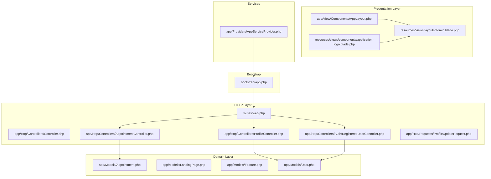
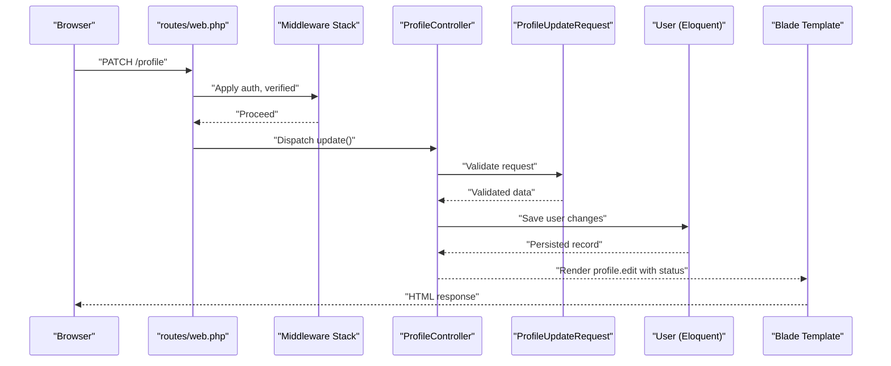
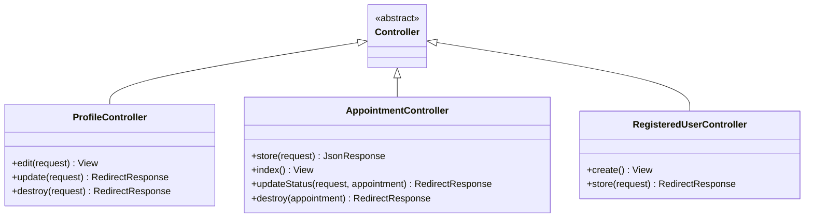
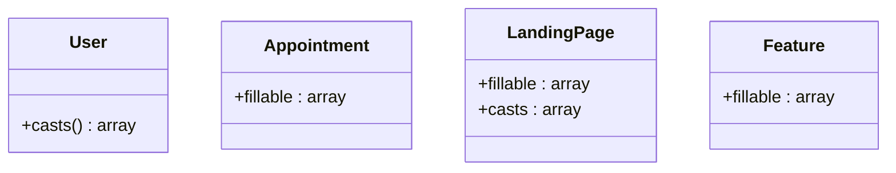
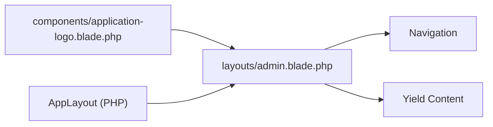
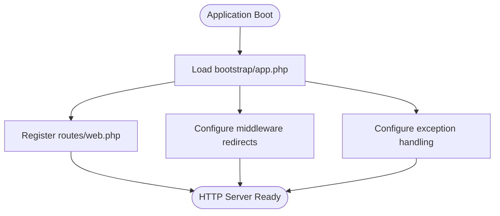
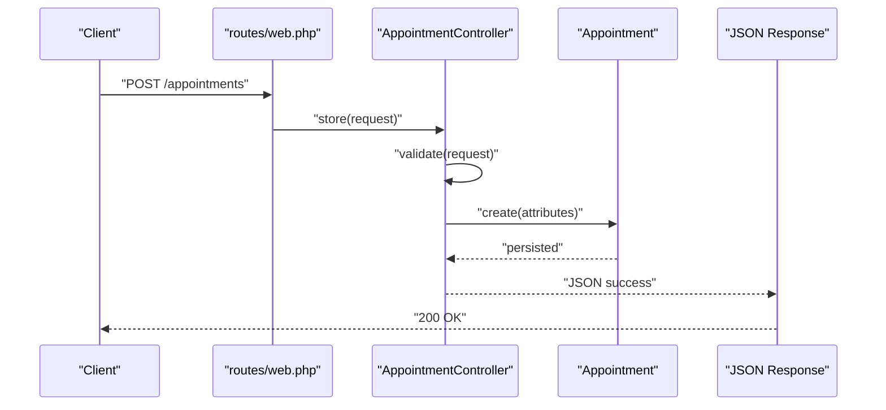
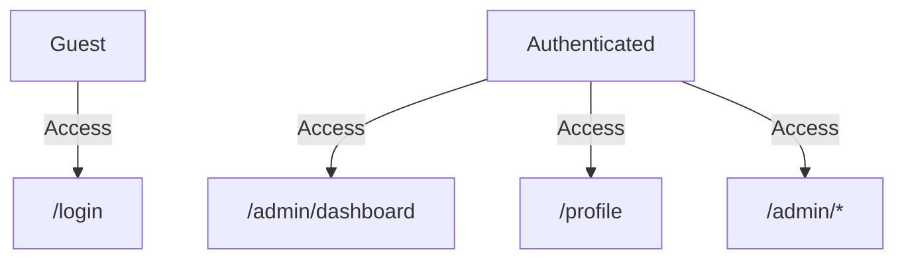
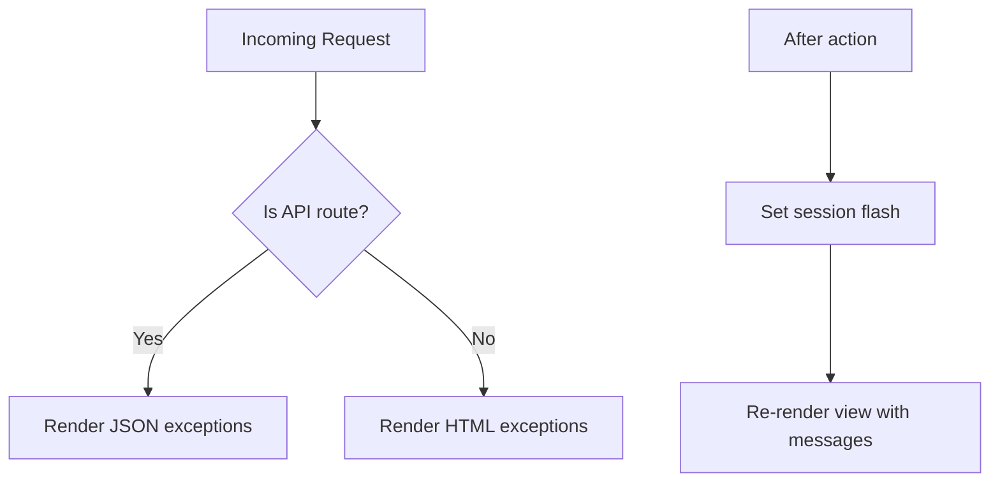
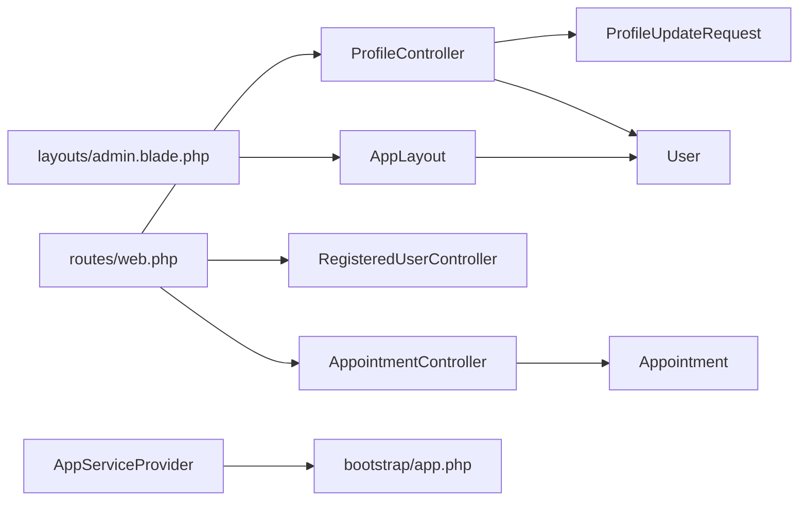

# MVC Architecture & Design Patterns

<cite>
**Referenced Files in This Document**
- [app.php](file://bootstrap/app.php)
- [web.php](file://routes/web.php)
- [Controller.php](file://app/Http/Controllers/Controller.php)
- [AppointmentController.php](file://app/Http/Controllers/AppointmentController.php)
- [ProfileController.php](file://app/Http/Controllers/ProfileController.php)
- [RegisteredUserController.php](file://app/Http/Controllers/Auth/RegisteredUserController.php)
- [ProfileUpdateRequest.php](file://app/Http/Requests/ProfileUpdateRequest.php)
- [Appointment.php](file://app/Models/Appointment.php)
- [LandingPage.php](file://app/Models/LandingPage.php)
- [Feature.php](file://app/Models/Feature.php)
- [User.php](file://app/Models/User.php)
- [AppLayout.php](file://app/View/Components/AppLayout.php)
- [admin.blade.php](file://resources/views/layouts/admin.blade.php)
- [application-logo.blade.php](file://resources/views/components/application-logo.blade.php)
- [AppServiceProvider.php](file://app/Providers/AppServiceProvider.php)
</cite>

## Table of Contents
1. [Introduction](#introduction)
2. [Project Structure](#project-structure)
3. [Core Components](#core-components)
4. [Architecture Overview](#architecture-overview)
5. [Detailed Component Analysis](#detailed-component-analysis)
6. [Dependency Analysis](#dependency-analysis)
7. [Performance Considerations](#performance-considerations)
8. [Troubleshooting Guide](#troubleshooting-guide)
9. [Conclusion](#conclusion)

## Introduction
This document explains the Model-View-Controller (MVC) architecture used in ClinicalLog CMS, aligned with Laravel conventions. It covers how controllers handle HTTP requests, models manage data access and validation, and views render content using Blade templating. It also documents the service provider registration system, dependency injection patterns, component lifecycle management, and how the application follows SOLID principles and design patterns such as Repository and Factory. Request-response flow, middleware integration, and error handling throughout the MVC stack are addressed.

## Project Structure
The application follows Laravel’s conventional MVC layout:
- Controllers under app/Http/Controllers handle HTTP requests and orchestrate responses.
- Models under app/Models encapsulate data access and Eloquent relationships.
- Views under resources/views define presentation logic with Blade templates.
- Service providers under app/Providers configure bindings and application-wide services.
- Routing under routes/web.php defines endpoint mappings and middleware stacks.
- View components under app/View/Components provide reusable Blade components.

**Diagram sources**
- [app.php:1-25](file://bootstrap/app.php#L1-L25)
- [web.php:1-77](file://routes/web.php#L1-L77)
- [Controller.php:1-9](file://app/Http/Controllers/Controller.php#L1-L9)
- [AppointmentController.php:1-77](file://app/Http/Controllers/AppointmentController.php#L1-L77)
- [ProfileController.php:1-61](file://app/Http/Controllers/ProfileController.php#L1-L61)
- [RegisteredUserController.php:1-52](file://app/Http/Controllers/Auth/RegisteredUserController.php#L1-L52)
- [ProfileUpdateRequest.php:1-32](file://app/Http/Requests/ProfileUpdateRequest.php#L1-L32)
- [Appointment.php:1-20](file://app/Models/Appointment.php#L1-L20)
- [LandingPage.php:1-59](file://app/Models/LandingPage.php#L1-L59)
- [Feature.php:1-17](file://app/Models/Feature.php#L1-L17)
- [User.php:1-33](file://app/Models/User.php#L1-L33)
- [AppLayout.php:1-18](file://app/View/Components/AppLayout.php#L1-L18)
- [admin.blade.php:1-150](file://resources/views/layouts/admin.blade.php#L1-L150)
- [application-logo.blade.php:1-4](file://resources/views/components/application-logo.blade.php#L1-L4)
- [AppServiceProvider.php:1-25](file://app/Providers/AppServiceProvider.php#L1-L25)

**Section sources**
- [app.php:1-25](file://bootstrap/app.php#L1-L25)
- [web.php:1-77](file://routes/web.php#L1-L77)

## Core Components
- Controller base class: Provides a shared foundation for all controllers.
- Domain models: Define fillable attributes, casting, and relationships.
- Blade layouts and components: Encapsulate presentation concerns and reusable UI parts.
- Service providers: Configure application services and bindings during bootstrapping.
- Form requests: Centralize validation rules for controller actions.

Key implementation patterns:
- Controllers inherit from a base controller to share common behavior.
- Models leverage Eloquent attributes for field protection and automatic casting.
- Blade layouts compose reusable UI scaffolding; Blade components encapsulate small widgets.
- Service providers participate in application lifecycle via register() and boot() hooks.
- Form requests enforce validation prior to controller execution.

**Section sources**
- [Controller.php:1-9](file://app/Http/Controllers/Controller.php#L1-L9)
- [User.php:1-33](file://app/Models/User.php#L1-L33)
- [Appointment.php:1-20](file://app/Models/Appointment.php#L1-L20)
- [LandingPage.php:1-59](file://app/Models/LandingPage.php#L1-L59)
- [Feature.php:1-17](file://app/Models/Feature.php#L1-L17)
- [AppLayout.php:1-18](file://app/View/Components/AppLayout.php#L1-L18)
- [AppServiceProvider.php:1-25](file://app/Providers/AppServiceProvider.php#L1-L25)
- [ProfileUpdateRequest.php:1-32](file://app/Http/Requests/ProfileUpdateRequest.php#L1-L32)

## Architecture Overview
The MVC flow integrates routing, middleware, controllers, models, and views:

**Diagram sources**
- [web.php:48-50](file://routes/web.php#L48-L50)
- [ProfileController.php:27-38](file://app/Http/Controllers/ProfileController.php#L27-L38)
- [ProfileUpdateRequest.php:1-32](file://app/Http/Requests/ProfileUpdateRequest.php#L1-L32)
- [User.php:1-33](file://app/Models/User.php#L1-L33)

## Detailed Component Analysis

### Controller Layer
- Base controller: Minimal base class enabling shared controller behavior.
- ProfileController: Handles profile editing, updates, and deletion with validated requests.
- AppointmentController: Manages appointment creation, listing, status updates, and deletions with inline validation.
- RegisteredUserController: Implements user registration with validation, hashing, event dispatch, and auto-login.

Design patterns and SOLID alignment:
- Single Responsibility: Each controller focuses on a bounded context (profile, appointments, auth).
- Open/Closed: Extensible via base controller and middleware stack.
- Dependency Inversion: Uses Eloquent models and form requests rather than raw SQL or ad-hoc validation.

**Diagram sources**
- [Controller.php:1-9](file://app/Http/Controllers/Controller.php#L1-L9)
- [ProfileController.php:1-61](file://app/Http/Controllers/ProfileController.php#L1-L61)
- [AppointmentController.php:1-77](file://app/Http/Controllers/AppointmentController.php#L1-L77)
- [RegisteredUserController.php:1-52](file://app/Http/Controllers/Auth/RegisteredUserController.php#L1-L52)

**Section sources**
- [Controller.php:1-9](file://app/Http/Controllers/Controller.php#L1-L9)
- [ProfileController.php:1-61](file://app/Http/Controllers/ProfileController.php#L1-L61)
- [AppointmentController.php:1-77](file://app/Http/Controllers/AppointmentController.php#L1-L77)
- [RegisteredUserController.php:1-52](file://app/Http/Controllers/Auth/RegisteredUserController.php#L1-L52)

### Model Layer
- User: Eloquent model with attributes for fillable and hidden fields, and automatic casting for sensitive data.
- Appointment: Eloquent model with fillable attributes for appointment records.
- LandingPage: Eloquent model with extensive fillable attributes and JSON/array casting for structured content.
- Feature: Eloquent model with fillable attributes for feature items.

Validation and data integrity:
- Inline validation in controllers ensures request sanitization.
- Form requests centralize validation rules for predictable reuse.
- Model casting ensures consistent data types and serialization.

**Diagram sources**
- [User.php:1-33](file://app/Models/User.php#L1-L33)
- [Appointment.php:1-20](file://app/Models/Appointment.php#L1-L20)
- [LandingPage.php:1-59](file://app/Models/LandingPage.php#L1-L59)
- [Feature.php:1-17](file://app/Models/Feature.php#L1-L17)

**Section sources**
- [User.php:1-33](file://app/Models/User.php#L1-L33)
- [Appointment.php:1-20](file://app/Models/Appointment.php#L1-L20)
- [LandingPage.php:1-59](file://app/Models/LandingPage.php#L1-L59)
- [Feature.php:1-17](file://app/Models/Feature.php#L1-L17)

### View Layer and Composition
- Blade layouts: Provide page scaffolding and navigation for admin and guest experiences.
- Blade components: Encapsulate reusable UI elements such as logos and form controls.
- Component rendering: AppLayout composes the admin layout for authenticated routes.

**Diagram sources**
- [admin.blade.php:1-150](file://resources/views/layouts/admin.blade.php#L1-L150)
- [application-logo.blade.php:1-4](file://resources/views/components/application-logo.blade.php#L1-L4)
- [AppLayout.php:1-18](file://app/View/Components/AppLayout.php#L1-L18)

**Section sources**
- [admin.blade.php:1-150](file://resources/views/layouts/admin.blade.php#L1-L150)
- [application-logo.blade.php:1-4](file://resources/views/components/application-logo.blade.php#L1-L4)
- [AppLayout.php:1-18](file://app/View/Components/AppLayout.php#L1-L18)

### Service Provider and Lifecycle Management
- AppServiceProvider: Standard service provider with empty register() and boot() hooks suitable for future bindings and bootstrapping tasks.
- Application bootstrap: Configures routing, middleware redirection, and exception handling policies.

**Diagram sources**
- [app.php:1-25](file://bootstrap/app.php#L1-L25)
- [AppServiceProvider.php:1-25](file://app/Providers/AppServiceProvider.php#L1-L25)

**Section sources**
- [app.php:1-25](file://bootstrap/app.php#L1-L25)
- [AppServiceProvider.php:1-25](file://app/Providers/AppServiceProvider.php#L1-L25)

### Request-Response Flow Examples
- Profile update flow: Validates input via form request, persists changes through Eloquent, and renders a success message.
- Appointment creation flow: Validates appointment fields, creates a new record, and returns a JSON success response.

**Diagram sources**
- [web.php:26-26](file://routes/web.php#L26-L26)
- [AppointmentController.php:14-41](file://app/Http/Controllers/AppointmentController.php#L14-L41)
- [Appointment.php:1-20](file://app/Models/Appointment.php#L1-L20)

**Section sources**
- [web.php:26-26](file://routes/web.php#L26-L26)
- [AppointmentController.php:14-41](file://app/Http/Controllers/AppointmentController.php#L14-L41)

### Middleware Integration
- Global middleware redirection: Redirects guests to login and authenticated users away from login pages.
- Route-specific middleware: Protects admin routes requiring authentication and email verification.

**Diagram sources**
- [app.php:14-19](file://bootstrap/app.php#L14-L19)
- [web.php:37-74](file://routes/web.php#L37-L74)

**Section sources**
- [app.php:14-19](file://bootstrap/app.php#L14-L19)
- [web.php:37-74](file://routes/web.php#L37-L74)

### Error Handling
- Exception configuration: Determines when to render JSON for API-like requests.
- Session-based flash messages: Used in admin layouts to communicate success/error feedback after redirects.

**Diagram sources**
- [app.php:20-24](file://bootstrap/app.php#L20-L24)
- [admin.blade.php:112-125](file://resources/views/layouts/admin.blade.php#L112-L125)

**Section sources**
- [app.php:20-24](file://bootstrap/app.php#L20-L24)
- [admin.blade.php:112-125](file://resources/views/layouts/admin.blade.php#L112-L125)

## Dependency Analysis
- Controllers depend on models for persistence and on form requests for validation.
- Blade layouts depend on Blade components and route helpers for navigation and content.
- Service providers integrate with the application lifecycle to register and boot services.

**Diagram sources**
- [web.php:1-77](file://routes/web.php#L1-L77)
- [ProfileController.php:1-61](file://app/Http/Controllers/ProfileController.php#L1-L61)
- [AppointmentController.php:1-77](file://app/Http/Controllers/AppointmentController.php#L1-L77)
- [RegisteredUserController.php:1-52](file://app/Http/Controllers/Auth/RegisteredUserController.php#L1-L52)
- [ProfileUpdateRequest.php:1-32](file://app/Http/Requests/ProfileUpdateRequest.php#L1-L32)
- [User.php:1-33](file://app/Models/User.php#L1-L33)
- [Appointment.php:1-20](file://app/Models/Appointment.php#L1-L20)
- [AppLayout.php:1-18](file://app/View/Components/AppLayout.php#L1-L18)
- [admin.blade.php:1-150](file://resources/views/layouts/admin.blade.php#L1-L150)
- [AppServiceProvider.php:1-25](file://app/Providers/AppServiceProvider.php#L1-L25)
- [app.php:1-25](file://bootstrap/app.php#L1-L25)

**Section sources**
- [web.php:1-77](file://routes/web.php#L1-L77)
- [ProfileController.php:1-61](file://app/Http/Controllers/ProfileController.php#L1-L61)
- [AppointmentController.php:1-77](file://app/Http/Controllers/AppointmentController.php#L1-L77)
- [RegisteredUserController.php:1-52](file://app/Http/Controllers/Auth/RegisteredUserController.php#L1-L52)
- [ProfileUpdateRequest.php:1-32](file://app/Http/Requests/ProfileUpdateRequest.php#L1-L32)
- [User.php:1-33](file://app/Models/User.php#L1-L33)
- [Appointment.php:1-20](file://app/Models/Appointment.php#L1-L20)
- [AppLayout.php:1-18](file://app/View/Components/AppLayout.php#L1-L18)
- [admin.blade.php:1-150](file://resources/views/layouts/admin.blade.php#L1-L150)
- [AppServiceProvider.php:1-25](file://app/Providers/AppServiceProvider.php#L1-L25)
- [app.php:1-25](file://bootstrap/app.php#L1-L25)

## Performance Considerations
- Use pagination for listing endpoints to limit memory usage (as seen in admin users and appointments).
- Leverage Eloquent model casting to avoid manual type conversions in controllers.
- Minimize view rendering overhead by composing layouts and components efficiently.
- Keep validation rules concise and centralized in form requests to reduce duplication.

## Troubleshooting Guide
- Authentication and verification: Ensure middleware redirection is configured correctly to prevent unauthorized access to admin routes.
- Validation failures: Review form request rules and controller validation to identify mismatched keys or missing constraints.
- Session flashes: Confirm flash messages are set after redirects and rendered in the appropriate layout.
- JSON vs HTML exceptions: Verify exception configuration for API-like routes to ensure proper client responses.

**Section sources**
- [app.php:14-24](file://bootstrap/app.php#L14-L24)
- [web.php:37-74](file://routes/web.php#L37-L74)
- [ProfileUpdateRequest.php:1-32](file://app/Http/Requests/ProfileUpdateRequest.php#L1-L32)
- [admin.blade.php:112-125](file://resources/views/layouts/admin.blade.php#L112-L125)

## Conclusion
ClinicalLog CMS implements a clean MVC architecture following Laravel conventions. Controllers handle HTTP concerns, models encapsulate domain logic and persistence, and Blade templates deliver responsive views with reusable components. Service providers participate in the application lifecycle, while middleware and form requests enforce security and validation. The design aligns with SOLID principles and supports scalable enhancements such as Repository and Factory patterns for improved testability and maintainability.