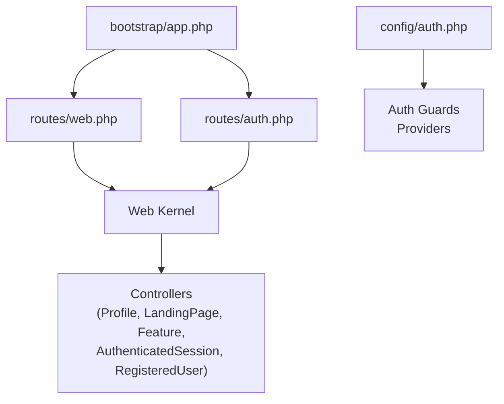
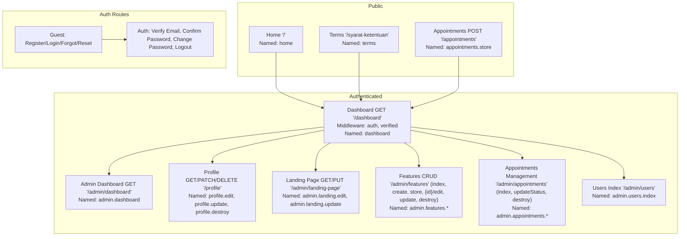
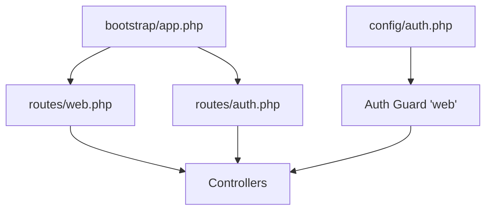

# Routing System & Middleware Stack

<cite>
**Referenced Files in This Document**
- [web.php](file://routes/web.php)
- [auth.php](file://routes/auth.php)
- [app.php](file://bootstrap/app.php)
- [auth.php](file://config/auth.php)
- [AuthenticatedSessionController.php](file://app/Http/Controllers/Auth/AuthenticatedSessionController.php)
- [RegisteredUserController.php](file://app/Http/Controllers/Auth/RegisteredUserController.php)
- [ProfileController.php](file://app/Http/Controllers/ProfileController.php)
- [LandingPageController.php](file://app/Http/Controllers/LandingPageController.php)
- [FeatureController.php](file://app/Http/Controllers/FeatureController.php)
- [.htaccess](file://public/.htaccess)
</cite>

## Table of Contents
1. [Introduction](#introduction)
2. [Project Structure](#project-structure)
3. [Core Components](#core-components)
4. [Architecture Overview](#architecture-overview)
5. [Detailed Component Analysis](#detailed-component-analysis)
6. [Dependency Analysis](#dependency-analysis)
7. [Performance Considerations](#performance-considerations)
8. [Troubleshooting Guide](#troubleshooting-guide)
9. [Conclusion](#conclusion)

## Introduction
This document explains the routing system and middleware architecture of ClinicalLog CMS. It covers route registration patterns, URL definitions, controller mappings, middleware stacks, and practical guidance for middleware ordering, conditional execution, and route caching. It also includes debugging techniques for routing issues and performance considerations.

## Project Structure
The routing system is primarily defined in two files:
- routes/web.php: Defines public and authenticated routes, including named routes and resource-like endpoints.
- routes/auth.php: Defines authentication lifecycle routes grouped by guest and authenticated contexts.

The application bootstrapper registers the web routes and sets redirection defaults for guests and authenticated users. Authentication configuration is centralized in config/auth.php.

**Diagram sources**
- [web.php](file://routes/web.php)
- [auth.php](file://routes/auth.php)
- [app.php](file://bootstrap/app.php)
- [auth.php](file://config/auth.php)

**Section sources**
- [web.php](file://routes/web.php)
- [auth.php](file://routes/auth.php)
- [app.php](file://bootstrap/app.php)
- [auth.php](file://config/auth.php)

## Core Components
- Route registration patterns:
  - Named routes for consistent URL generation and redirects.
  - Grouped middleware for authenticated/admin routes.
  - Explicit controller method bindings for actions.
- URL pattern definitions:
  - Static pages (home, terms).
  - Resource-like endpoints for admin dashboards and management.
  - Parameterized routes for editing/deleting items.
- Controller method mappings:
  - ProfileController handles profile CRUD.
  - LandingPageController updates CMS content.
  - FeatureController manages feature entries with sorting logic.
  - Auth controllers handle login, logout, registration, and password flows.

Examples of route constructs present in the codebase:
- Named static routes for home and terms.
- Parameterized route for editing features.
- Grouped routes under middleware for authenticated access.
- Conditional middleware usage for signed verification and throttling.

**Section sources**
- [web.php](file://routes/web.php)
- [auth.php](file://routes/auth.php)
- [ProfileController.php](file://app/Http/Controllers/ProfileController.php)
- [LandingPageController.php](file://app/Http/Controllers/LandingPageController.php)
- [FeatureController.php](file://app/Http/Controllers/FeatureController.php)
- [AuthenticatedSessionController.php](file://app/Http/Controllers/Auth/AuthenticatedSessionController.php)
- [RegisteredUserController.php](file://app/Http/Controllers/Auth/RegisteredUserController.php)

## Architecture Overview
The routing architecture separates concerns into:
- Public routes: Home, Terms, Appointment submission.
- Authenticated routes: Dashboard, Profile, CMS management (Landing Page, Features, Appointments, Users).
- Authentication routes: Registration, Login, Password reset, Email verification, Logout.

Middleware applied globally via the bootstrapper enforces redirection defaults for guests and authenticated users. Authentication and verification middleware are applied per-route group or individually where required.

**Diagram sources**
- [web.php](file://routes/web.php)
- [auth.php](file://routes/auth.php)

## Detailed Component Analysis

### Route Registration Patterns and URL Definitions
- Static routes:
  - Home page mapped to a closure returning the landing view with data.
  - Terms page mapped to a closure rendering a terms view.
- Parameterized routes:
  - Feature edit/update/delete use numeric identifiers in the path.
- Resource-like routes:
  - Admin dashboard, profile, landing page, features, appointments, and users follow RESTful naming conventions.

Key observations:
- Named routes enable consistent redirects and URL generation across controllers and views.
- Grouped middleware ensures all admin routes require authentication and email verification.

**Section sources**
- [web.php](file://routes/web.php)

### Controller Method Mappings
- ProfileController:
  - Edit profile form and update profile data.
  - Delete account with confirmation and session cleanup.
- LandingPageController:
  - Retrieve landing page and paginated features.
  - Update landing page content with extensive validation and media handling.
- FeatureController:
  - Create, edit, update, and delete features with dynamic sort order adjustments.
- Auth controllers:
  - Login/logout and registration flows integrate with intended redirects.

These mappings demonstrate explicit controller-action bindings and named routes for consistent navigation.

**Section sources**
- [ProfileController.php](file://app/Http/Controllers/ProfileController.php)
- [LandingPageController.php](file://app/Http/Controllers/LandingPageController.php)
- [FeatureController.php](file://app/Http/Controllers/FeatureController.php)
- [AuthenticatedSessionController.php](file://app/Http/Controllers/Auth/AuthenticatedSessionController.php)
- [RegisteredUserController.php](file://app/Http/Controllers/Auth/RegisteredUserController.php)

### Middleware Stack
- Global redirection defaults:
  - Guests redirected to login.
  - Authenticated users redirected to admin dashboard.
- Route-level middleware:
  - Authenticated/admin routes apply both authentication and email verification.
  - Verification routes apply signed and throttling middleware.
  - Password reset and verification notifications apply throttling.

Middleware ordering:
- Middleware resolution follows registration order; ensure authentication precedes verification checks.
- Conditional middleware (signed, throttle) are applied only to specific routes requiring additional protections.

Maintenance mode:
- Maintenance mode artifacts are stored under storage/framework; the application’s health endpoint is configured at /up.

**Section sources**
- [app.php](file://bootstrap/app.php)
- [web.php](file://routes/web.php)
- [auth.php](file://routes/auth.php)

### Custom Middleware Implementation
- Role-based access control (RBAC):
  - No custom RBAC middleware is present in the current codebase.
  - Implement a custom middleware to check roles/permissions and register it in the bootstrapper or route groups.
- Request filtering:
  - Use middleware to sanitize inputs, enforce rate limits, or validate request formats.
  - Apply middleware globally or per-route group depending on scope.

Note: The current middleware stack relies on built-in authentication and verification mechanisms. Introducing custom middleware requires careful placement in the stack and appropriate registration.

**Section sources**
- [app.php](file://bootstrap/app.php)
- [web.php](file://routes/web.php)

### Examples of Route Parameters, Named Routes, and Resource Controllers
- Route parameters:
  - Feature edit/update/delete use an identifier segment.
- Named routes:
  - Home, terms, dashboard, admin routes, and all admin CRUD endpoints are named for consistent URL generation.
- Resource controllers:
  - FeatureController implements index/create/store/edit/update/destroy semantics.
  - Admin endpoints mirror resource-style naming and actions.

These patterns improve maintainability and reduce coupling between routes and controllers.

**Section sources**
- [web.php](file://routes/web.php)
- [FeatureController.php](file://app/Http/Controllers/FeatureController.php)

### Middleware Ordering, Conditional Execution, and Scope
- Ordering:
  - Authentication middleware should run before verification checks.
  - Signed and throttle middleware should be placed after authentication for proper context.
- Conditional execution:
  - Verification routes apply signed and throttle middleware conditionally.
  - Password reset and notification routes apply throttling to mitigate abuse.
- Scope:
  - Global redirection defaults apply to unauthenticated requests.
  - Route groups apply middleware to all enclosed routes.

**Section sources**
- [app.php](file://bootstrap/app.php)
- [web.php](file://routes/web.php)
- [auth.php](file://routes/auth.php)

### Route Caching and Performance Considerations
- Route caching:
  - Laravel supports route caching to speed up request handling. Use the framework’s cache command to compile routes.
  - After enabling caching, avoid runtime route modifications and ensure all routes are registered before caching.
- Performance characteristics:
  - Grouped routes reduce repeated middleware overhead.
  - Named routes minimize string concatenation and improve readability.
  - Keep controller logic lean; delegate heavy tasks to queued jobs or services.

[No sources needed since this section provides general guidance]

### Debugging Techniques for Routing Issues
- Enable verbose logging to inspect route resolution and middleware execution.
- Use the framework’s route list command to enumerate all registered routes and their associated middleware.
- Inspect the front controller rewrite rules to ensure clean URLs and index.php forwarding.
- Validate middleware registration and ordering in the bootstrapper.

Relevant configuration artifacts:
- Front controller rewrite rules in public/.htaccess ensure index.php receives all requests.

**Section sources**
- [.htaccess](file://public/.htaccess)

## Dependency Analysis
The routing system depends on:
- Route definitions in web.php and auth.php.
- Bootstrapper configuration for middleware redirection defaults.
- Authentication configuration for guards and providers.
- Controllers implementing route actions.

**Diagram sources**
- [web.php](file://routes/web.php)
- [auth.php](file://routes/auth.php)
- [app.php](file://bootstrap/app.php)
- [auth.php](file://config/auth.php)

**Section sources**
- [web.php](file://routes/web.php)
- [auth.php](file://routes/auth.php)
- [app.php](file://bootstrap/app.php)
- [auth.php](file://config/auth.php)

## Performance Considerations
- Prefer route caching in production to reduce boot-time overhead.
- Minimize middleware chains for frequently accessed routes.
- Use pagination for admin listings to reduce payload sizes.
- Offload long-running tasks from request lifecycle to queued jobs.

[No sources needed since this section provides general guidance]

## Troubleshooting Guide
Common issues and resolutions:
- Authentication loops:
  - Ensure intended redirect targets are protected by the same middleware.
  - Verify session configuration and cookie attributes.
- Verification failures:
  - Confirm signed URL generation and throttle limits for verification routes.
- Throttling errors:
  - Adjust throttle parameters for verification and password reset routes.
- Maintenance mode:
  - Check maintenance artifact presence and remove after deployment completes.

**Section sources**
- [app.php](file://bootstrap/app.php)
- [auth.php](file://routes/auth.php)

## Conclusion
ClinicalLog CMS employs a clear separation of public, authenticated, and auth-specific routes with named endpoints and grouped middleware. The bootstrapper centralizes redirection defaults, while controllers implement focused actions aligned with the routing patterns. For enhanced security and scalability, consider introducing custom middleware for role-based access control and request filtering, ensuring proper ordering and conditional application. Route caching and performance-aware controller design further support efficient operation.