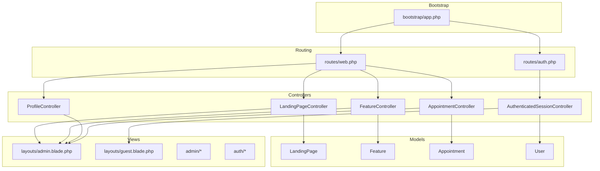
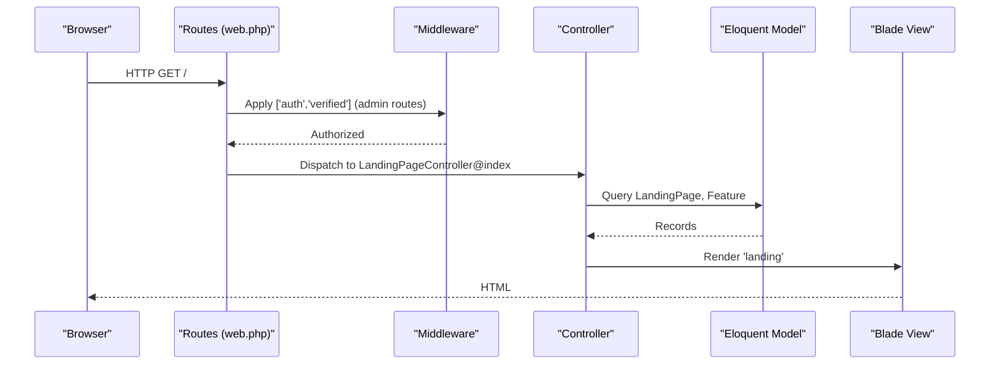
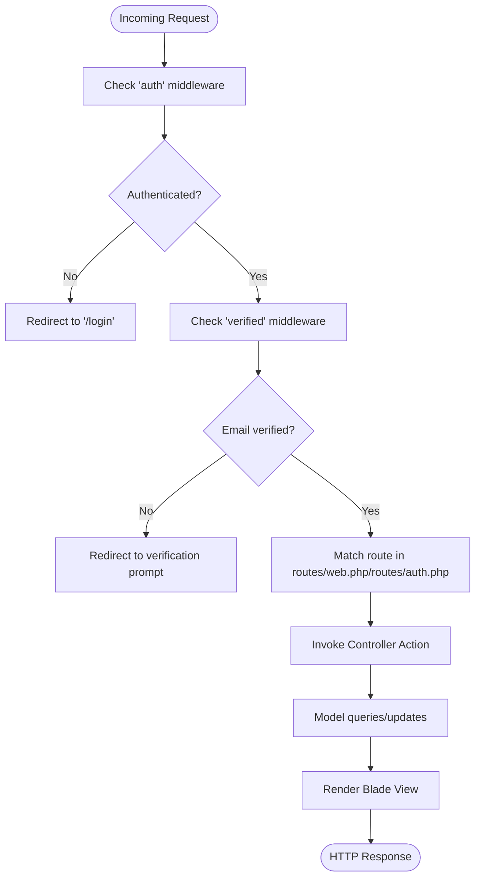
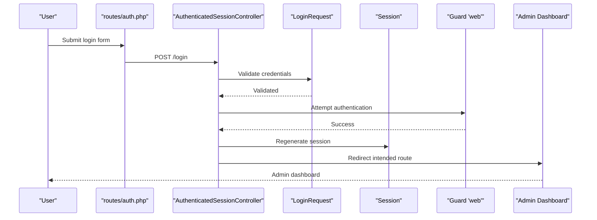
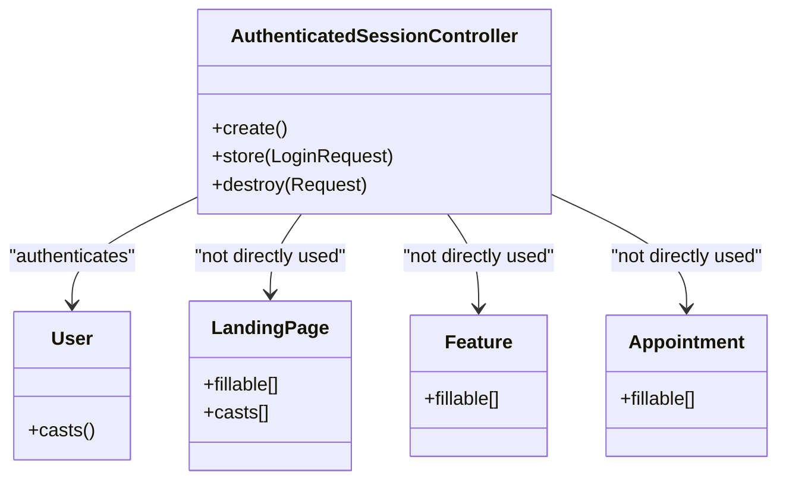
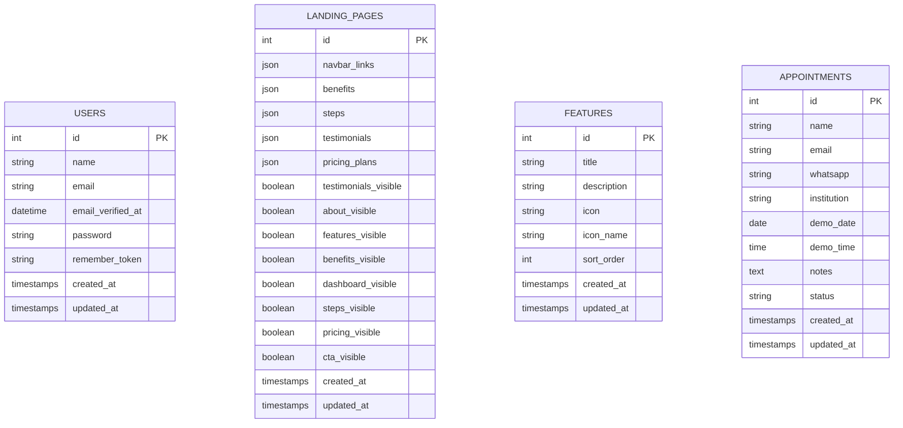
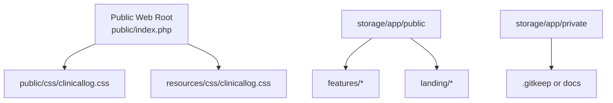

# System Architecture

<cite>
**Referenced Files in This Document**
- [web.php](file://routes/web.php)
- [auth.php](file://routes/auth.php)
- [app.php](file://bootstrap/app.php)
- [auth.php](file://config/auth.php)
- [session.php](file://config/session.php)
- [database.php](file://config/database.php)
- [AuthenticatedSessionController.php](file://app\Http\Controllers\Auth\AuthenticatedSessionController.php)
- [LoginRequest.php](file://app\Http\Requests\Auth\LoginRequest.php)
- [User.php](file://app\Models\User.php)
- [LandingPage.php](file://app\Models\LandingPage.php)
- [Feature.php](file://app\Models\Feature.php)
- [Appointment.php](file://app\Models\Appointment.php)
- [admin.blade.php](file://resources\views\layouts\admin.blade.php)
- [guest.blade.php](file://resources\views\layouts\guest.blade.php)
- [AppLayout.php](file://app\View\Components\AppLayout.php)
- [0001_01_01_000000_create_users_table.php](file://database\migrations\0001_01_01_000000_create_users_table.php)
- [2026_06_22_024652_create_appointments_table.php](file://database\migrations\2026_06_22_024652_create_appointments_table.php)
- [2026_06_17_031941_create_landing_pages_table.php](file://database\migrations\2026_06_17_031941_create_landing_pages_table.php)
- [2026_06_17_060200_create_features_table.php](file://database\migrations\2026_06_17_060200_create_features_table.php)
- [2026_06_18_064300_add_testimonials_visible_to_landing_pages.php](file://database\migrations\2026_06_18_064300_add_testimonials_visible_to_landing_pages.php)
- [2026_06_22_031700_add_gdrive_links_to_landing_pages.php](file://database\migrations\2026_06_22_031700_add_gdrive_links_to_landing_pages.php)
- [clinicallog.css](file://public/css/clinicallog.css)
- [clinicallog.css](file://resources/css/clinicallog.css)
</cite>

## Table of Contents
1. [Introduction](#introduction)
2. [Project Structure](#project-structure)
3. [Core Components](#core-components)
4. [Architecture Overview](#architecture-overview)
5. [Detailed Component Analysis](#detailed-component-analysis)
6. [Dependency Analysis](#dependency-analysis)
7. [Performance Considerations](#performance-considerations)
8. [Security Considerations](#security-considerations)
9. [Infrastructure and Data Design](#infrastructure-and-data-design)
10. [File Storage Architecture](#file-storage-architecture)
11. [Troubleshooting Guide](#troubleshooting-guide)
12. [Conclusion](#conclusion)

## Introduction
This document describes the system architecture of the ClinicalLog CMS, focusing on its high-level MVC design aligned with Laravel conventions. It explains controller-model-view interactions, routing and middleware stacks, authentication and session management, role-based access control, infrastructure and database design, file storage, separation between public-facing website components and administrative interfaces, security measures, validation layers, error handling, and integration points with external services such as Google Drive.

## Project Structure
The application follows Laravel’s conventional MVC layout:
- Controllers under app/Http/Controllers handle HTTP requests and orchestrate responses.
- Models under app/Models encapsulate data and business logic.
- Views under resources/views define presentation layers, including admin and guest layouts.
- Routing is defined in routes/web.php and routes/auth.php.
- Configuration is centralized under config/.
- Bootstrap wiring is handled in bootstrap/app.php.

**Diagram sources**
- [app.php:8-24](file://bootstrap/app.php#L8-L24)
- [web.php:1-77](file://routes/web.php#L1-L77)
- [auth.php:1-60](file://routes/auth.php#L1-L60)
- [AuthenticatedSessionController.php:1-48](file://app\Http\Controllers\Auth\AuthenticatedSessionController.php#L1-L48)
- [LandingPage.php:1-59](file://app\Models\LandingPage.php#L1-L59)
- [Feature.php:1-17](file://app\Models\Feature.php#L1-L17)
- [Appointment.php:1-20](file://app\Models\Appointment.php#L1-L20)
- [User.php:1-33](file://app\Models\User.php#L1-L33)
- [admin.blade.php:1-156](file://resources\views\layouts\admin.blade.php#L1-L156)
- [guest.blade.php:1-31](file://resources\views\layouts\guest.blade.php#L1-L31)

**Section sources**
- [app.php:8-24](file://bootstrap/app.php#L8-L24)
- [web.php:1-77](file://routes/web.php#L1-L77)
- [auth.php:1-60](file://routes/auth.php#L1-L60)

## Core Components
- Controllers: Manage request handling for landing page CMS, features CMS, profile management, appointment administration, and authentication.
- Models: Define data structures and casting for LandingPage, Feature, Appointment, and User.
- Views: Admin layout with navigation and flash messaging; guest layout for authentication pages.
- Routing: Centralized web routes plus dedicated auth routes; middleware groups enforce authentication and verification.

Key implementation references:
- Controllers and routes: [web.php:19-77](file://routes/web.php#L19-L77), [auth.php:1-60](file://routes/auth.php#L1-L60)
- Authentication controller: [AuthenticatedSessionController.php:1-48](file://app\Http\Controllers\Auth\AuthenticatedSessionController.php#L1-L48)
- Models: [LandingPage.php:1-59](file://app\Models\LandingPage.php#L1-L59), [Feature.php:1-17](file://app\Models\Feature.php#L1-L17), [Appointment.php:1-20](file://app\Models\Appointment.php#L1-L20), [User.php:1-33](file://app\Models\User.php#L1-L33)
- Layouts: [admin.blade.php:1-156](file://resources\views\layouts\admin.blade.php#L1-L156), [guest.blade.php:1-31](file://resources\views\layouts\guest.blade.php#L1-L31)

**Section sources**
- [web.php:19-77](file://routes/web.php#L19-L77)
- [auth.php:1-60](file://routes/auth.php#L1-L60)
- [AuthenticatedSessionController.php:1-48](file://app\Http\Controllers\Auth\AuthenticatedSessionController.php#L1-L48)
- [LandingPage.php:1-59](file://app\Models\LandingPage.php#L1-L59)
- [Feature.php:1-17](file://app\Models\Feature.php#L1-L17)
- [Appointment.php:1-20](file://app\Models\Appointment.php#L1-L20)
- [User.php:1-33](file://app\Models\User.php#L1-L33)
- [admin.blade.php:1-156](file://resources\views\layouts\admin.blade.php#L1-L156)
- [guest.blade.php:1-31](file://resources\views\layouts\guest.blade.php#L1-L31)

## Architecture Overview
The system follows a layered MVC pattern:
- Request enters via routes/web.php and routes/auth.php.
- Middleware enforces authentication and verified email policies.
- Controllers coordinate model retrieval and updates, then render appropriate Blade views.
- Models encapsulate persistence and data casting.
- Views render HTML with admin and guest layouts.

**Diagram sources**
- [web.php:19-31](file://routes/web.php#L19-L31)
- [auth.php:38-59](file://routes/auth.php#L38-L59)

## Detailed Component Analysis

### Routing and Middleware Stack
- Web routes define:
  - Home page composition using LandingPage and Feature models.
  - Terms page rendering.
  - Protected admin dashboard and CMS routes.
  - Profile management endpoints.
  - Landing page and features CRUD endpoints.
  - Appointments listing, status update, and deletion.
  - Users listing endpoint.
- Auth routes define registration, login, password reset, email verification, and logout flows.
- Middleware stack:
  - Global redirection policy configured in bootstrap/app.php.
  - Route-specific middleware groups apply auth and verified policies.

**Diagram sources**
- [app.php:14-19](file://bootstrap/app.php#L14-L19)
- [web.php:37-77](file://routes/web.php#L37-L77)
- [auth.php:14-59](file://routes/auth.php#L14-L59)

**Section sources**
- [web.php:19-77](file://routes/web.php#L19-L77)
- [auth.php:14-59](file://routes/auth.php#L14-L59)
- [app.php:14-19](file://bootstrap/app.php#L14-L19)

### Authentication Architecture
- Guard and provider:
  - Session-based guard "web" with Eloquent provider for User model.
- Password reset configuration and timeouts.
- Authentication controller:
  - Creates login view, authenticates credentials, regenerates session, and redirects to admin dashboard.
  - Destroys session and invalidates CSRF token on logout.
- Login request validation:
  - Custom request object validates credentials and applies throttling.

**Diagram sources**
- [auth.php:20-23](file://routes/auth.php#L20-L23)
- [AuthenticatedSessionController.php:25-31](file://app\Http\Controllers\Auth\AuthenticatedSessionController.php#L25-L31)
- [LoginRequest.php](file://app\Http\Requests\Auth\LoginRequest.php)

**Section sources**
- [auth.php:40-44](file://config/auth.php#L40-L44)
- [AuthenticatedSessionController.php:17-46](file://app\Http\Controllers\Auth\AuthenticatedSessionController.php#L17-L46)
- [LoginRequest.php](file://app\Http\Requests\Auth\LoginRequest.php)

### Session Management
- Driver configured to database with tunable lifetime, cookie attributes, and SameSite policy.
- Encrypt flag and serialization strategy are configurable.

**Section sources**
- [session.php:21-231](file://config/session.php#L21-L231)

### Role-Based Access Control
- Current configuration relies on middleware groups to gate admin routes.
- No explicit roles are defined in the provided code; access control is enforced by route protection and user authentication state.

**Section sources**
- [web.php:37-77](file://routes/web.php#L37-L77)

### Public-Facing Website vs Administrative Interfaces
- Public site:
  - Home and terms pages rendered with LandingPage and Feature data.
  - Uses guest layout for authentication-related pages.
- Admin interface:
  - Dedicated admin.blade.php layout with navigation, sidebar, and flash messages.
  - Separate routes under /admin for dashboard, landing page CMS, features CMS, appointments, and users.

**Section sources**
- [web.php:19-31](file://routes/web.php#L19-L31)
- [admin.blade.php:1-156](file://resources\views\layouts\admin.blade.php#L1-L156)
- [guest.blade.php:1-31](file://resources\views\layouts\guest.blade.php#L1-L31)

### Data Validation Layers
- Form requests:
  - LoginRequest validates credentials prior to authentication.
  - ProfileUpdateRequest validates profile updates.
- Model casting:
  - LandingPage casts arrays and booleans for structured content.
- Fillable attributes:
  - Models restrict mass assignment to safe fields.

**Section sources**
- [LoginRequest.php](file://app\Http\Requests\Auth\LoginRequest.php)
- [LandingPage.php:43-57](file://app\Models\LandingPage.php#L43-L57)

### Error Handling Mechanisms
- Global exception configuration in bootstrap/app.php:
  - JSON rendering for API routes.
  - Default HTML rendering for web routes.

**Section sources**
- [app.php:20-24](file://bootstrap/app.php#L20-L24)

## Dependency Analysis
The following diagram maps key runtime dependencies among controllers, models, and views:

**Diagram sources**
- [AuthenticatedSessionController.php:1-48](file://app\Http\Controllers\Auth\AuthenticatedSessionController.php#L1-L48)
- [User.php:1-33](file://app\Models\User.php#L1-L33)
- [LandingPage.php:1-59](file://app\Models\LandingPage.php#L1-L59)
- [Feature.php:1-17](file://app\Models\Feature.php#L1-L17)
- [Appointment.php:1-20](file://app\Models\Appointment.php#L1-L20)

**Section sources**
- [AuthenticatedSessionController.php:1-48](file://app\Http\Controllers\Auth\AuthenticatedSessionController.php#L1-L48)
- [User.php:1-33](file://app\Models\User.php#L1-L33)
- [LandingPage.php:1-59](file://app\Models\LandingPage.php#L1-L59)
- [Feature.php:1-17](file://app\Models\Feature.php#L1-L17)
- [Appointment.php:1-20](file://app\Models\Appointment.php#L1-L20)

## Performance Considerations
- Database driver defaults to SQLite in the provided configuration; production deployments should consider MySQL/MariaDB or PostgreSQL for scalability.
- Session storage on database is suitable for small to medium workloads; consider Redis for high concurrency.
- Minimize N+1 queries by eager-loading related data where applicable.
- Use pagination for admin listings (already present for users).

[No sources needed since this section provides general guidance]

## Security Considerations
- CSRF protection is enabled via Blade layouts and forms.
- Session cookies configured with secure, http_only, and SameSite attributes.
- Authentication guard uses session storage with Eloquent provider.
- Password reset broker and timeout are configured.
- Middleware enforces authentication and email verification for admin routes.

**Section sources**
- [session.php:172-202](file://config/session.php#L172-L202)
- [auth.php:95-102](file://config/auth.php#L95-L102)
- [web.php:37-77](file://routes/web.php#L37-L77)

## Infrastructure and Data Design
- Database connections support SQLite, MySQL, MariaDB, PostgreSQL, and SQL Server.
- Redis configuration provided for caching and queues.
- Migrations define:
  - Users table creation.
  - Cache and jobs tables.
  - Landing pages table with extensive content fields and visibility toggles.
  - Features table with icon metadata and sort order.
  - Appointments table with contact and scheduling fields.
  - Additional columns for Google Drive links and visibility flags.

**Diagram sources**
- [0001_01_01_000000_create_users_table.php](file://database\migrations\0001_01_01_000000_create_users_table.php)
- [2026_06_17_031941_create_landing_pages_table.php](file://database\migrations\2026_06_17_031941_create_landing_pages_table.php)
- [2026_06_17_060200_create_features_table.php](file://database\migrations\2026_06_17_060200_create_features_table.php)
- [2026_06_22_024652_create_appointments_table.php](file://database\migrations\2026_06_22_024652_create_appointments_table.php)
- [2026_06_18_064300_add_testimonials_visible_to_landing_pages.php](file://database\migrations\2026_06_18_064300_add_testimonials_visible_to_landing_pages.php)
- [2026_06_22_031700_add_gdrive_links_to_landing_pages.php](file://database\migrations\2026_06_22_031700_add_gdrive_links_to_landing_pages.php)

**Section sources**
- [database.php:33-117](file://config/database.php#L33-L117)
- [database.php:146-182](file://config/database.php#L146-L182)

## File Storage Architecture
- Public storage:
  - Assets served via public/index.php; stylesheets include clinicallog.css.
- Private storage:
  - Private documents under storage/app/private.
- Publicly accessible media:
  - Images and uploads under storage/app/public/{features,landing}.
- Filesystem configuration:
  - Disks and visibility are managed via filesystems configuration (referenced in project structure).

**Diagram sources**
- [web.php:19-31](file://routes/web.php#L19-L31)
- [admin.blade.php](file://resources\views\layouts\admin.blade.php#L13)
- [clinicallog.css](file://public/css/clinicallog.css)
- [clinicallog.css](file://resources/css/clinicallog.css)

**Section sources**
- [web.php:19-31](file://routes/web.php#L19-L31)
- [admin.blade.php](file://resources\views\layouts\admin.blade.php#L13)

## Troubleshooting Guide
- Authentication failures:
  - Verify guard configuration and provider model.
  - Ensure session driver and lifetime are correctly set.
- Middleware redirection loops:
  - Check global redirectTo settings and route group middleware assignments.
- Database connectivity:
  - Confirm DB_CONNECTION and credentials for chosen driver.
- Session issues:
  - Review cookie attributes (secure, http_only, same_site) and session driver configuration.

**Section sources**
- [auth.php:40-44](file://config/auth.php#L40-L44)
- [session.php:21-231](file://config/session.php#L21-L231)
- [app.php:14-19](file://bootstrap/app.php#L14-L19)
- [database.php:20-117](file://config/database.php#L20-L117)

## Conclusion
ClinicalLog CMS implements a clean MVC architecture with Laravel conventions. Routing and middleware enforce authentication and access control, while controllers coordinate model-driven views for both public and admin surfaces. Authentication leverages Laravel Breeze-style flows with session-based guards and CSRF protections. Data modeling supports flexible content editing via LandingPage and Feature entities, with robust validation and casting. Infrastructure is configurable for various databases and session backends, and file storage separates public and private assets. Integration with external services like Google Drive is represented through dedicated fields in LandingPage migrations.